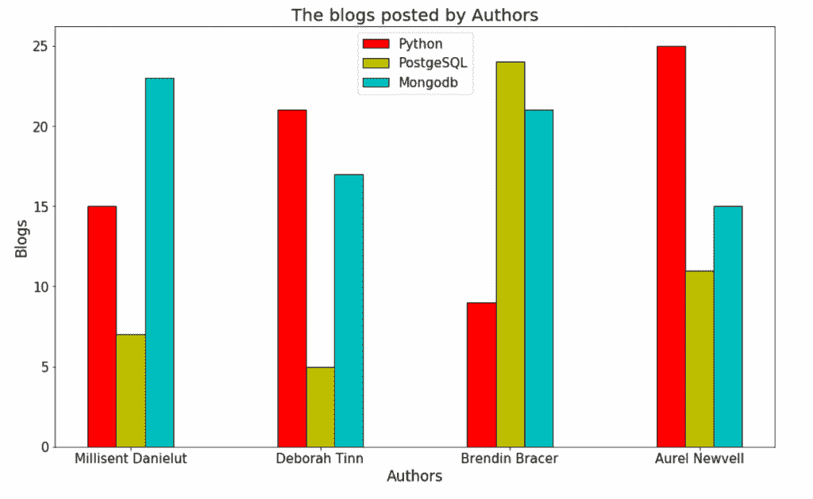

# Matplotlib plot bar chart

> 原文：<https://pythonguides.com/matplotlib-plot-bar-chart/>

[](https://sharepointsky.teachable.com/p/python-and-machine-learning-training-course)

在本 [Python 教程](https://pythonguides.com/)中，我们将讨论如何使用 Python 中的 matplotlib**绘制条形图，我们还将涉及以下主题:**

*   Matplotlib plot bar chart
*   Matplotlib 绘图条形图大小
*   不同颜色的 Matplotlib 绘图条形图
*   来自字典的 Matplotlib 绘制条形图
*   Matplotlib 从数据帧绘制条形图
*   带值的 Matplotlib 绘图条形图
*   带日期的 Matplotlib 绘图条形图
*   带误差线的 Matplotlib 绘图条形图
*   Matplotlib 绘制多个条形图
*   Matplotlib 绘图堆积条形图
*   Matplotlib 绘图水平条形图

目录

[](#)

*   [Matplotlib 绘图条形图](#Matplotlib_plot_bar_chart "Matplotlib plot bar chart")
*   [Matplotlib 绘图条形图尺寸](#Matplotlib_plot_bar_chart_size "Matplotlib plot bar chart size")
*   [Matplotlib 绘制不同颜色的条形图](#Matplotlib_plot_bar_chart_with_different_colors "Matplotlib plot bar chart with different colors")
*   [来自字典的 Matplotlib 绘制条形图](#Matplotlib_plot_bar_chart_from_dict "Matplotlib plot bar chart from dict")
*   [Matplotlib 从数据帧中绘制条形图](#Matplotlib_plot_bar_chart_from_dataframe "Matplotlib plot bar chart from dataframe")
*   [Matplotlib 用数值绘制条形图](#Matplotlib_plot_bar_chart_with_values "Matplotlib plot bar chart with values")
*   [带日期的 Matplotlib 绘制条形图](#Matplotlib_plot_bar_chart_with_dates "Matplotlib plot bar chart with dates")
*   [Matplotlib 绘制带误差线的条形图](#Matplotlib_plot_bar_chart_with_error_bars "Matplotlib plot bar chart with error bars")
*   [Matplotlib 绘制多个条形图](#Matplotlib_plot_multiple_bar_graphs "Matplotlib plot multiple bar graphs")
*   [Matplotlib 绘图堆积条形图](#Matplotlib_plot_stacked_bar_chart "Matplotlib plot stacked bar chart")
*   [Matplotlib 绘制水平条形图](#Matplotlib_plot_horizontal_bar_chart "Matplotlib plot horizontal bar chart")

## Matplotlib 绘图条形图

**[Matplotlib](https://pythonguides.com/what-is-matplotlib/)** 是 python 中最常用的数据可视化工具——丰富库。它支持多种数据可视化工具，可以根据不同来源或不同类型(如列表、数组、字典、数据帧、JSON 文件、CSV 文件等)提供的数据制作 2D 图。这个库建立在 python 中的 Numpy 数组之上。

使用 `matplotlib` 库提供的 API `pyplot` 作为 matplotlib 中的子模块，可以在 python 中创建**条形图**或**条形图**或**条形图**。 `Pyplot` 提供了各种各样的剧情以及与之相关的功能。

**条形图**是一种将数据中的不同类别显示为矩形条的图形，其高度或长度与这些类别分别代表的值成比例。这意味着条形图用于可视化**分类数据**(比较数据中的类别)。

您可以根据需要垂直或水平绘制条形图。其中一个轴显示要比较的类别，另一个轴显示这些类别的值。

您可以使用模块(库) `matplotlib` 的子模块 `pyplot` 的函数 `bar()` 在 python 中创建条形图/图表/图形。 `bar()` 函数的语法如下:

```py
matplotlib.pyplot.bar(categories, heights [, width, bottom, align, ...])
```

在上面的语法中，

*   *类别*指定要比较的类别的值或列表/数组。
*   *高度*指定每个相应类别的值或值列表/数组。
*   您可以在*宽度*中指定条形的宽度。默认值为 0.8。
*   您可以在*底部*指定条形的底部(条形底部的 y 坐标)。默认值为 0。
*   您可以指定条形与*类别*轴刻度的对齐方式。默认为“中心”:
    *   将它设置为“中心”来对齐条形，以便刻度位置到达条形底部的中心。
    *   将它设置为“edge”来对齐条形，以便条形的左边缘到达刻度位置。
    *   将*宽度*的负值设置为“edge ”,以对齐条形，使条形的右边缘到达刻度位置。
*   您还可以根据需要指定其他参数，例如:
    *   *颜色*指定条形的颜色。您可以设置一种颜色或颜色列表。
    *   *edgecolor* 指定条形边缘的颜色。您可以设置一种颜色或颜色列表。
    *   *linewidth* 指定条形边缘的宽度，如果为 0，则不绘制边缘。
    *   *tick_label* 指定条形的刻度标签。
    *   *yerr/xerr* 指定棒顶端的误差棒。
    *   *ecolor* 指定误差线的线条颜色，默认为“黑色”。
    *   *倾覆*以磅为单位指定误差线帽的长度，默认为 0.0。
    *   *log* 如果设置为 True，将高度轴的刻度设置为 log。

您可以按照下面提到的一般步骤来创建条形图:

*   导入绘制图形所需的库(numpy 或/和 pandas，用于数据包含或创建或操作，从 matplotlib 导入 pyplot，用于数据可视化等。).
*   定义要可视化的数据(定义 x 和 y 轴值)。
*   Plot 命令，使用想要添加到图中的特征(命令的参数)定义图(使用不同颜色条、标签、标题、图例等进行绘制)
*   显示上面定义的图形/曲线图/图表。

**举例:**

```py
# Importing the required libraries
from matplotlib import pyplot as plt

# Preparing the data to plot
blogs = ['python', 'sqlserver', 'postgresql', 'mongodb', 'sharepoint']
posts = [257, 213, 112, 101, 456]

# Creating a simple bar chart
plt.bar(blogs, posts)

plt.title('The posts in different blogs')
plt.xlabel('blogs', fontsize=15)
plt.ylabel('posts', fontsize=15)
plt.show()

# Creating a bar chart with the parameters
plt.bar(blogs, posts, width=0.7, bottom=50, align='edge')

plt.title('The posts in different blogs')
plt.xlabel('blogs', fontsize=15)
plt.ylabel('posts', fontsize=15)
plt.show()
```


Matplotlib plot bar chart

阅读:[如何安装 matplotlib python](https://pythonguides.com/how-to-install-matplotlib-python/)

## Matplotlib 绘图条形图尺寸

您可以在 python 中使用 matplotlib 指定图表的大小，方法是使用带有参数 `figsize` 的`matplotlib . py plot . figure()`函数，该函数可以接受表示图形/图表的宽度和高度的两个值的列表。

**举例:**

```py
# Importing the required libraries
from matplotlib import pyplot as plt

# Preparing the data to plot
players = ['Cristiano Ronaldo', 'Pele', 'Romario', 'Lionel Messi', 
           'Ferenc Puskas', 'Josef Bican', 'Jimmy Jones', 
           'Gerd Muller', 'Eusebio', 'Joe Bambrick'] 
goals = [783, 765, 753, 748, 729, 720, 647, 634, 622, 616]

# Creating a simple bar chart
plt.bar(players, goals)

plt.title('Top 10 football goal scorers of all time')
plt.xlabel('Players', fontsize=15)
plt.ylabel('Goals', fontsize=15)
plt.show()

# Increase the size of the figure (chart)
plt.figure(figsize=[15, 7])

# Creating a bar chart with the parameters
plt.bar(players, goals, width=0.7)

plt.title('Top 10 football goal scorers of all time')
plt.xlabel('Players', fontsize=15)
plt.ylabel('Goals', fontsize=15)
plt.show()
```


Matplotlib plot bar chart size

阅读: [Matplotlib 绘制一条线](https://pythonguides.com/matplotlib-plot-a-line/)

## Matplotlib 绘制不同颜色的条形图

您可以为条形图中的不同条形指定不同的颜色。您可以通过在 `matplotlib.pyplot.bar()` 函数中指定参数 `color` 的值来实现，该函数可以接受颜色名称或颜色代码或颜色哈希代码的列表。

您可以手动输入颜色名称列表，也可以使用**颜色图**使用 matplotlib 中可用的**调色板**。您可以使用带有位置参数的函数`matplotlib . py plot . get _ cmap()`来指定 matplotlib 中可用的色彩映射表的名称。

**举例:**

```py
# Importing the required libraries
from matplotlib import pyplot as plt
import numpy as np
import pandas as pd

# Preparing the data to plot
players = ['Cristiano Ronaldo', 'Pele', 'Romario', 'Lionel Messi', 
           'Ferenc Puskas', 'Josef Bican', 'Jimmy Jones', 
           'Gerd Muller', 'Eusebio', 'Joe Bambrick'] 
goals = [783, 765, 753, 748, 729, 720, 647, 634, 622, 616]

plt.figure(figsize=[15, 7])

# Creating a bar chart with bars of different color
plt.bar(players, goals, width=0.7, edgecolor='blueviolet',
        color=['r', 'y', 'g', 'b', 'c', 'k', 
               'olive', 'gray', 'pink', 'maroon'], linewidth=2)

plt.title('Top 10 football goal scorers of all time', fontsize=15)
plt.xlabel('Players', fontsize=15)
plt.ylabel('Goals', fontsize=15)
plt.show()

# Set colors to the bars using colormaps available in matplotlib

plt.figure(figsize=[15, 7])
col_map = plt.get_cmap('Paired')

# Creating a bar chart with bars of different color using colormap
plt.bar(players, goals, width=0.7, color=col_map.colors, edgecolor='k', 
        linewidth=2)

plt.title('Top 10 football goal scorers of all time', fontsize=15)
plt.xlabel('Players', fontsize=15)
plt.ylabel('Goals', fontsize=15)
plt.show()
```


Matplotlib plot bar chart with different colors

阅读: [Python 情节多行](https://pythonguides.com/python-plot-multiple-lines/)

## 来自字典的 Matplotlib 绘制条形图

您可以通过从 python **字典**中指定类别和高度值来绘制条形图。

**举例:**

```py
# Preparing the data to plot
data_dict = {'Cristiano Ronaldo': 783, 'Pele': 765, 'Romario': 753,
             'Lionel Messi': 748, 'Ferenc Puskas': 729, 
             'Josef Bican': 720, 'Jimmy Jones': 647, 
             'Gerd Muller': 634, 'Eusebio': 622, 'Joe Bambrick': 616}

print('type: '+str(type(data_dict)), 'size: '+str(len(data_dict)), data_dict, sep='\n')
```


Python create dictionary

```py
# Importing the required libraries
from matplotlib import pyplot as plt

# Visualizing the data

plt.figure(figsize=[15, 7])
col_map = plt.get_cmap('tab20c')

# Creating a bar chart from a dictionary
plt.bar(data_dict.keys(), data_dict.values(), width=0.7, 
        color=col_map.colors, edgecolor='maroon', linewidth=2)

plt.title('Top 10 football goal scorers of all time', fontsize=15)
plt.xlabel('Players', fontsize=15)
plt.ylabel('Goals', fontsize=15)
plt.show()
```


Matplotlib plot bar chart from dict

读取 [Matplotlib savefig 空白图像](https://pythonguides.com/matplotlib-savefig-blank-image/)

## Matplotlib 从数据帧中绘制条形图

您可以通过从数据框的列中指定类别和高度值，从熊猫**数据框**中绘制条形图。

**举例:**

在以下示例中，创建了两个数据帧，第一个是普通数据帧，条形图的类别和值作为数据帧的列，第二个是数据帧，索引作为条形图的类别。

```py
# Importing the required libraries
import numpy as np
import pandas as pd

# Preparing the data to plot
players = ['Cristiano Ronaldo', 'Pele', 'Romario', 'Lionel Messi', 
           'Ferenc Puskas', 'Josef Bican', 'Jimmy Jones', 
           'Gerd Muller', 'Eusebio', 'Joe Bambrick'] 
goals = [783, 765, 753, 748, 729, 720, 647, 634, 622, 616]

# Creating a DataFrame from a dictionary
df = pd.DataFrame({'Players': players, 'Goals': goals})
print('type: '+str(type(df)), 'size: '+str(np.shape(df)), df, sep='\n', end='\n\n')

# Another dataframe where index is changed
df2 = df.set_index('Players')
print('type: '+str(type(df2)), 'size: '+str(np.shape(df2)), df2, sep='\n')
```


Python create DataFrame

```py
# Importing the required libraries
from matplotlib import pyplot as plt

# Visualizing the data in DataFrame df

plt.figure(figsize=[14, 7])
col_map = plt.get_cmap('tab20')

# Creating a bar chart from the DataFrame df
plt.bar(df.Players, df.Goals, width=0.5, color=col_map.colors, 
        edgecolor='maroon', linewidth=2)

plt.title('Top 10 football goal scorers of all time', fontsize=15)
plt.xlabel('Players', fontsize=15)
plt.ylabel('Goals', fontsize=15)
plt.show()

# Visualizing the data in DataFrame df2 where category data is set as index

plt.figure(figsize=[14, 7])
col_map = plt.get_cmap('Paired')

# Creating a bar chart from the DataFrame df2
plt.bar(df2.index, df2.Goals, width=0.5, color=col_map.colors, 
        edgecolor='olive', linewidth=3)

plt.title('Top 10 football goal scorers of all time', fontsize=15)
plt.xlabel('Players', fontsize=15)
plt.ylabel('Goals', fontsize=15)
plt.show()
```


Matplotlib plot bar chart from dataframe

阅读:[什么是 matplotlib 内联](https://pythonguides.com/what-is-matplotlib-inline/)

## Matplotlib 用数值绘制条形图

您可以通过使用带有两个强制参数(文本和文本在图形上的 x-y 位置)的`matplotlib . py plot . annotate()`函数，将文本(值)注释到图表/图形中，从而将值添加到条形聊天中。

**举例:**

```py
# Importing the required libraries

import numpy as np
import pandas as pd

# Preparing the data to plot
players = ['Cristiano Ronaldo', 'Pele', 'Romario', 'Lionel Messi', 
           'Ferenc Puskas', 'Josef Bican', 'Jimmy Jones', 
           'Gerd Muller', 'Eusebio', 'Joe Bambrick'] 
goals = [783, 765, 753, 748, 729, 720, 647, 634, 622, 616]

# Creating a DataFrame from a dictionary
df = pd.DataFrame({'Players': players, 'Goals': goals})
print('type: '+str(type(df)), 'size: '+str(np.shape(df)), df, sep='\n')
```


Python create dataframe from a dictionary

```py
# Importing the required libraries
from matplotlib import pyplot as plt

# Visualizing the data in DataFrame df with values on the bars

plt.figure(figsize=[14, 7])
col_map = plt.get_cmap('tab20')

# Creating a bar chart from the DataFrame df
pl = plt.bar(df.Players, df.Goals, width=0.5, color=col_map.colors, 
        edgecolor='maroon', linewidth=3)

for bar in pl:
    plt.annotate(bar.get_height(), 
                 xy=(bar.get_x()+0.07, bar.get_height()+10), 
                     fontsize=15)

plt.title('Top 10 football goal scorers of all time', fontsize=15)
plt.xlabel('Players', fontsize=15)
plt.ylabel('Goals', fontsize=15)
plt.show()
```


Matplotlib plot bar chart with values

读取: [Matplotlib 日志日志图](https://pythonguides.com/matplotlib-log-log-plot/)

## 带日期的 Matplotlib 绘制条形图

您可以使用 python 中的 matplotlib 从**时间序列**数据绘制条形图。

首先，您必须通过将日期列转换成**日期戳**类型来准备时间序列数据。然后将日期列设置为数据帧索引。现在，选择要可视化的数据，然后绘制该数据随时间变化的条形图。

**举例:**

```py
# Importing the required libraries
import pandas as pd

# Importing the dataset using the pandas into Dataframe
sales_df = pd.read_csv('./Data/Sales_records.csv')
print(sales_df.head(), end='\n\n')

# Converting the Date column into the datestamp type
sales_df['Date'] = pd.to_datetime(sales_df['Date'])

# Sorting the data in ascending order by the date
sales_df = sales_df.sort_values(by='Date')

# Now, setting the Date column as the index of the dataframe
sales_df.set_index('Date', inplace=True)

# Print the new dataframe and its summary
print(sales_df.head(), sales_df.describe(), sep='\n\n')

# Subset dataframe by year 2017
sales2017 = sales_df['2017']
print(sales2017)
```


Python prepare time series dataframe

```py
# Importing the required libraries
from matplotlib import pyplot as plt

# Visualizing the Total Revenue in Time series DataFrame sales2017
plt.figure(figsize=[15, 9])
col_map = plt.get_cmap('Paired')

# Plotting total revenue throughout 2017 sales in bar chart
pl = plt.bar(sales2017.index, sales2017['Total Revenue'], width=5, 
             color=col_map.colors, edgecolor='maroon', linewidth=2)

# Annotating the heights of the bars at the top of the bars
for bar in pl:
    plt.annotate(bar.get_height(), 
                 xy=(bar.get_x()-4, bar.get_height()+100000), 
                     fontsize=15)

plt.title('Total Revenue generated in 2017', fontsize=20)
plt.xlabel('Date', fontsize=20)
plt.ylabel('Total Revenue', fontsize=20)
plt.xticks(fontsize=14)
plt.yticks(fontsize=18)

plt.show()
```


Matplotlib plot bar chart with dates

Read: [modulenotfounderror:没有名为“matplotlib”的模块](https://pythonguides.com/no-module-named-matplotlib/)

## Matplotlib 绘制带误差线的条形图

通过在 `matplotlib.pyplot.bar()` 函数中指定参数 `yerr/xerr` 的值，可以使用 python 中的 matplotlib 绘制带有误差线的条形图。

您还可以通过将颜色名称作为参数 `ecolor` 的值来指定误差线的**颜色**，以及误差线的**翻转**。

**举例:**

```py
# Importing the required libraries

import pandas as pd

# Importing the dataset using the pandas into Dataframe
sales_df = pd.read_csv('./Data/Sales_records.csv')
print(sales_df.head(), end='\n\n')

# Converting the Date column into the datestamp type
sales_df['Date'] = pd.to_datetime(sales_df['Date'])

# Sorting the data in ascending order by the date
sales_df = sales_df.sort_values(by='Date')

# Now, setting the Date column as the index of the dataframe
sales_df.set_index('Date', inplace=True)

# Subset dataframe by year 2017
sales2017 = sales_df['2017']
print(sales2017, end='\n\n')

x = sales2017.columns.values
heights = sales2017.mean().values
errors = sales2017.std().values

print('categories: '+str(x), 'heights: '+str(heights), 'errors: '+str(errors), sep='\n')
```


Python prepare data from a time series dataframe

```py
# Importing the required libraries
from matplotlib import pyplot as plt

# Visualizing the Total Revenue in DataFrame sales2017 with error bars
plt.figure(figsize=[15, 9])
plt.grid(axis='y', color = 'olive', linestyle = '--')
col_map = plt.get_cmap('tab20b')

# Plotting total revenue throughout 2017 sales in bar chart with error bars
plt.bar(x, heights, width=0.5, color=col_map.colors, edgecolor='y', 
        linewidth=3, yerr=errors, ecolor='k', capsize=10)

plt.title('Total sales description of 2017', fontsize=20)
plt.ylabel('Amount', fontsize=20)
plt.xticks(fontsize=18)
plt.yticks(fontsize=18)

plt.show()
```


Matplotlib plot bar chart with error bars

读取 [Matplotlib 另存为 png](https://pythonguides.com/matplotlib-save-as-png/)

## Matplotlib 绘制多个条形图

当您有每个类别的一些子类别的数据时，您可以通过在同一个图表/图形中绘制多个条形图来可视化该数据，其中您可以为所有类别并排绘制同一类别的条形图(代表不同的子类别)。

**举例:**

```py
# Importing the required libraries

import numpy as np
import pandas as pd

# Preparing the data to plot
authors = ['Millisent Danielut', 'Deborah Tinn', 'Brendin Bracer',
           'Aurel Newvell']
python = [15, 21, 9, 25]
postgreSQL = [7, 5, 24, 11]
mongodb = [23, 17, 21, 15]

# Creating a DataFrame from a dictionary
blogs = pd.DataFrame({'Authors': authors, 'Python': python, 
                      'PostgreSQL': postgreSQL, 'Mongodb': mongodb})
print('type: '+str(type(blogs)), 'size: '+str(np.shape(blogs)), blogs, sep='\n')
```


Python create dataframe from lists

```py
# Importing the required libraries
from matplotlib import pyplot as plt
import numpy as np

# Visualizing the data with multiple bar chart
plt.figure(figsize=[15, 9])

# Set the width of the bars
wd = 0.3
x_pos = np.arange(1, 2*len(blogs), 2)

# Plotting the multiple bar graphs on the same figure
plt.bar(x_pos, blogs.Python, color='r', width=wd, edgecolor='k',
        label='Python')
plt.bar(x_pos+wd, blogs.PostgreSQL, color='y', width=wd, edgecolor='k', 
        label='PostgeSQL')
plt.bar(x_pos+(wd*2), blogs.Mongodb, color='c', width=wd, 
        edgecolor='k', label='Mongodb')

# Add xticks
plt.xticks(x_pos+wd, blogs.Authors.values, fontsize=15)
plt.yticks(fontsize=15)
plt.title('The blogs posted by Authors', fontsize=20)
plt.xlabel('Authors', fontsize=17)
plt.ylabel('Blogs', fontsize=17)

plt.legend(loc='upper center', fontsize=15)
plt.show()
```



Matplotlib plot multiple bar graphs

阅读: [Matplotlib 最佳拟合线](https://pythonguides.com/matplotlib-best-fit-line/)

## Matplotlib 绘图堆积条形图

当您有每个类别的一些子类别的数据时，您也可以通过在同一图表/图形中绘制多个条形图来可视化该数据，其中您可以为所有类别一个接一个地绘制同一类别的条形图(代表不同的子类别)。这被称为**堆积条形图**，因为它就像是堆积每个类别的子类别。

```py
# Importing the required libraries

import numpy as np
import pandas as pd

# Preparing the data to plot
authors = ['Millisent Danielut', 'Deborah Tinn', 'Brendin Bracer',
           'Aurel Newvell']
python = [15, 21, 9, 25]
postgreSQL = [7, 5, 24, 11]
mongodb = [23, 17, 21, 15]

# Creating a DataFrame from a dictionary
blogs = pd.DataFrame({'Authors': authors, 'Python': python, 
                      'PostgreSQL': postgreSQL, 'Mongodb': mongodb})
print('type: '+str(type(blogs)), 'size: '+str(np.shape(blogs)), blogs, sep='\n')
```


Python prepare dataframe for the stacked bar chart

```py
# Importing the required libraries
from matplotlib import pyplot as plt
import numpy as np

# Visualizing the data with stacked bar chart
plt.figure(figsize=[15, 9])

# Set the width of the bars
wd = 0.4
x_pos = np.arange(len(blogs))

# Plotting the multiple bar graphs on top on other
plt.bar(x_pos, blogs.Python, color='r', width=wd, label='Python')
plt.bar(x_pos, blogs.PostgreSQL, color='y', width=wd, label='PostgeSQL', 
       bottom=blogs.Python)
plt.bar(x_pos, blogs.Mongodb, color='c', width=wd, label='Mongodb', 
       bottom=blogs.Python+blogs.PostgreSQL)

# Add xticks
plt.xticks(x_pos, blogs.Authors.values, fontsize=15)
plt.yticks(fontsize=15)
plt.title('The blogs posted by Authors', fontsize=20)
plt.xlabel('Authors', fontsize=17)
plt.ylabel('Blogs', fontsize=17)

plt.legend(loc='upper left', fontsize=15)
plt.show()
```


Matplotlib plot stacked bar chart

阅读: [Matplotlib 支线剧情教程](https://pythonguides.com/matplotlib-subplot-tutorial/)

## Matplotlib 绘制水平条形图

还可以使用 matplotlib python 中的 `matplotlib.pyplot.barh()` 函数绘制水平条形图。除了**高度**和**宽度**之外，其中所有参数与 `matplotlib.pyplot.bar()` 函数中的参数相同。

这里，位置参数**宽度**表示类别(条)的值，**高度**表示条形图中水平条的粗细。

在类别(条形)数量很大的情况下，可以使用水平条形图，垂直条形图无法方便地显示类别。

**举例:**

```py
# Importing the required libraries
from matplotlib import pyplot as plt

# Preparing the data to plot
players = ['Cristiano Ronaldo', 'Pele', 'Romario', 'Lionel Messi', 
           'Ferenc Puskas', 'Josef Bican', 'Jimmy Jones', 'Gerd Muller',
           'Eusebio', 'Joe Bambrick'] 
goals = [783, 765, 753, 748, 729, 720, 647, 634, 622, 616]

plt.figure(figsize=[7, 7])
col_map = plt.get_cmap('Paired')

# Plotting a simple horizontal bar chart
plt.barh(players, goals, height=0.6, color=col_map.colors, 
         edgecolor='k', linewidth=2)

plt.title('Top 10 football goal scorers of all time', fontsize=15)
plt.xlabel('Players', fontsize=15)
plt.ylabel('Goals', fontsize=15)
plt.show() simple
```


Matplotlib plot horizontal bar chart

您可能会喜欢以下 Matplotlib 教程:

*   [Matplotlib 条形图标签](https://pythonguides.com/matplotlib-bar-chart-labels/)
*   [在 Python 中添加文本到绘图 matplotlib](https://pythonguides.com/add-text-to-plot-matplotlib/)
*   [Matplotlib 绘图误差线](https://pythonguides.com/matplotlib-plot-error-bars/)
*   [堆积条形图 Matplotlib](https://pythonguides.com/stacked-bar-chart-matplotlib/)

在本 Python 教程中，我们讨论了如何使用 Python 中的 matplotlib 来 ****绘制条形图，并且我们还讨论了以下主题:****

*   Matplotlib plot bar chart
*   Matplotlib 绘图条形图大小
*   不同颜色的 Matplotlib 绘图条形图
*   来自字典的 Matplotlib 绘制条形图
*   Matplotlib 从数据帧绘制条形图
*   带值的 Matplotlib 绘图条形图
*   带日期的 Matplotlib 绘图条形图
*   带误差线的 Matplotlib 绘图条形图
*   Matplotlib 绘制多个条形图
*   Matplotlib 绘图堆积条形图
*   Matplotlib 绘图水平条形图

[Bijay Kumar](https://pythonguides.com/author/fewlines4biju/)

Python 是美国最流行的语言之一。我从事 Python 工作已经有很长时间了，我在与 Tkinter、Pandas、NumPy、Turtle、Django、Matplotlib、Tensorflow、Scipy、Scikit-Learn 等各种库合作方面拥有专业知识。我有与美国、加拿大、英国、澳大利亚、新西兰等国家的各种客户合作的经验。查看我的个人资料。

[enjoysharepoint.com/](https://enjoysharepoint.com/)[](https://www.facebook.com/fewlines4biju "Facebook")[](https://www.linkedin.com/in/fewlines4biju/ "Linkedin")[](https://twitter.com/fewlines4biju "Twitter")