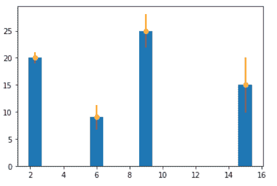
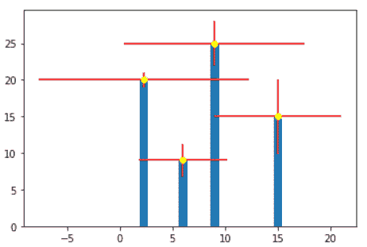

# Matplotlib 绘图误差线

> 原文：<https://pythonguides.com/matplotlib-plot-error-bars/>

[](https://sharepointsky.teachable.com/p/python-and-machine-learning-training-course)

在本 python 教程中，我们将讨论 Python 中的 **[Matplotlib](https://pythonguides.com/what-is-matplotlib/) 绘图误差条**。在这里，我们将介绍使用 matplotlib 与误差线相关的不同示例。我们还将讨论以下主题:

*   Matplotlib 绘图误差线
*   Matplotlib 绘图误差线示例
*   Matplotlib 交互式绘图误差线
*   Matplotlib 图表误差线
*   Matplotlib 散点图误差线
*   Matplotlib plot_date 误差线
*   Matplotlib 仅绘制误差线
*   Matplotlib 图误差线对称
*   Matplotlib 图误差线不对称
*   Matplotlib 极坐标图误差线

目录

[](#)

*   [Matplotlib 绘图误差线](#Matplotlib_plot_error_bars "Matplotlib plot error bars")
*   [Matplotlib 绘图误差线示例](#Matplotlib_plot_error_bars_example "Matplotlib plot error bars example")
*   [Matplotlib 绘制交互误差线](#Matplotlib_plot_interactive_error_bars "Matplotlib plot interactive error bars")
*   [Matplotlib 图表误差线](#Matplotlib_chart_error_bars "Matplotlib chart error bars")
    *   [Matplotlib 图表中 x 值的误差线](#Matplotlib_chart_error_bars_in_x_values "Matplotlib chart error bars in x values")
    *   [Matplotlib 图表中 y 值的误差线](#Matplotlib_chart_error_bars_in_y_values "Matplotlib chart error bars in y values")
    *   [Matplotlib 图表中 x 和 y 值的误差线](#Matplotlib_chart_error_bars_in_x_and_y_values "Matplotlib chart error bars in x and y values")
*   [Matplotlib 散点图误差线](#Matplotlib_scatter_plot_error_bars "Matplotlib scatter plot error bars")
    *   [Matplotlib 散点图 x 值误差线](#Matplotlib_scatter_plot_error_bars_in_x_values "Matplotlib scatter plot error bars in x values")
    *   [Matplotlib 散点图 y 值误差线](#Matplotlib_scatter_plot_error_bars_in_y_values "Matplotlib scatter plot error bars in y values")
    *   [Matplotlib 散点图 x 和 y 值的误差线](#Matplotlib_scatter_plot_error_bars_in_x_and_y_values "Matplotlib scatter plot error bars in x and y values")
*   [Matplotlib plot_date 误差线](#Matplotlib_plot_date_error_bars "Matplotlib plot_date error bars ")
    *   [Matplotlib plot _ date x 值误差线](#Matplotlib_plot_date_error_bars_in_x_values "Matplotlib plot_date error bars in x values")
    *   [Matplotlib plot _ date y 值误差线](#Matplotlib_plot_date_error_bars_in_y_values "Matplotlib plot_date error bars in y values")
    *   [Matplotlib plot _ date x 和 y 值的误差线](#Matplotlib_plot_date_error_bars_in_x_and_y_values "Matplotlib plot_date error bars in x and y values")
*   [Matplotlib 仅绘制误差线](#Matplotlib_plot_only_error_bars "Matplotlib plot only error bars")
*   [Matplotlib 绘图误差条对称](#Matplotlib_plot_error_bars_symmetric "Matplotlib plot error bars symmetric")
*   [Matplotlib 绘图误差线不对称](#Matplotlib_plot_error_bars_asymmetric "Matplotlib plot error bars asymmetric")
*   [Matplotlib 极坐标图误差线](#Matplotlib_polar_plot_error_bars "Matplotlib polar plot error bars")

## Matplotlib 绘图误差线

在本节中，我们将了解误差线。在开始误差线之前，我们首先了解误差意味着什么。

误差是一个错误，或者我们可以说是计算值和实际值之间差异。

当我们用图形表示数据时，有些数据具有不规则性。为了表示这些不规则性或不确定性，我们使用**误差棒**。

基本上，误差线用于表示图形中的误差。

**以下步骤用于在 matplotlib 中绘制误差线，概述如下:**

*   **定义库:**导入绘制误差线所需的库(用于数据创建和操作:Numpy，用于数据可视化:来自 matplotlib 的 pyplot)。
*   **定义 X 和 Y:** 定义用于绘图的数据值。x 轴和 y 轴的数据值。
*   **绘制误差线:**通过使用 `errorbar()` 方法，我们可以绘制误差线。
*   **显示:**最后我们要使用 `show()` 方法来显示剧情。

**绘制误差线的语法如下:**

```py
matplotlib.pyplot.errorbar(x, y, yerr=None, xerr=None, fmt='', ecolor=None, elinewidth=None, capsize=None, barsabove=False, lolims=False, uplimes=False, xlolims=False, xuplims=False, errorevery=1, capthick=None, * , data=None, **kwargs)
```

**上述使用的参数概述如下:**

*   **x:** 指定数据点的水平坐标。
*   **y:** 指定数据点的垂直坐标。
*   **xerr:** 定义水平误差线尺寸。必须具有浮点或类似数组的形状。
*   **yerr:** 定义垂直误差线尺寸。必须具有浮点或类似数组的形状。
*   **fmt:** 包含字符串值。默认情况下，这将使用标记绘制误差线。使用“无”绘制不带标记的误差线。
*   **ecolor:** 指定误差线的颜色。
*   **elinewidth:** 指定误差线的线宽。
*   **翻转:**指定误差线的长度，以点或浮点为单位。
*   **capthick:** 指定以浮点或磅为单位的误差线宽度。
*   **barsabove:** 包含 bool 值。默认情况下，值为 False，如果值为 True，则在绘图符号上方绘制误差线。
*   **lolims，uplims，xlolims，xuplims:** 指定值仅给出上限和下限。它包含布尔值。
*   **errorevery:** 包含整数值，用于在数据子集上绘制误差线。

先学习“[如何安装 matplotlib python](https://pythonguides.com/how-to-install-matplotlib-python/) ”。

## Matplotlib 绘图误差线示例

在上面几节中，我们讨论了误差和误差线的含义。我们还讨论了绘制误差线的各个步骤。

**下面我们通过一个例子来理解这个概念:**

```py
**# Import Library**

import matplotlib.pyplot as plt

**# Define Data**

x= [1, 2, 3, 5]
y= [9, 15, 20, 25]

**# Plot error bar** 
plt.errorbar(x, y, xerr = 0.9)

**# Display graph**

plt.show()
```

*   在上面的例子中，我们导入了 `matplotlib.pyplot` 库。
*   然后我们定义 x 轴和 y 轴数据点。
*   `plt.errorbar()` 方法用于绘制误差线，我们传递参数 **x，y，**和 `xerr` ，并设置 xerr 的值= `0.9` 。
*   然后我们使用 `plt.show()` 方法显示误差棒图。


plt.errorbar()

阅读: [Matplotlib 绘制一条线](https://pythonguides.com/matplotlib-plot-a-line/)

## Matplotlib 绘制交互误差线

这里我们格式化误差线，或者我们可以说根据我们的选择定制误差线，使我们的误差线更具交互性。

**让我们更改误差栏中的以下内容，使其更具交互性:**

*   **fmt:** 改变标记的样式。设置为圆形。
*   **颜色:**改变标记的颜色。设置为橙色。
*   **ecolor:** 改变误差线的颜色。设置为浅绿色。
*   **elinewidth:** 改变误差线的线宽。设置为 5。
*   **倾覆:**改变误差棒的倾覆。设置为 10。

**借助例子理解概念:**

```py
**# Import Library** 
import matplotlib.pyplot as plt

**# Define Data**

x= [1, 2, 3, 5]
y= [9, 15, 20, 25]

**# Plot error bar**

plt.errorbar(x, y, xerr = 0.9, fmt = 'o',color = 'orange', 
            ecolor = 'lightgreen', elinewidth = 5, capsize=10)

**# Display graph**

plt.show()
```

*   在上面的例子中，我们绘制了误差线，并根据上面提到的列表对它们进行了格式化。
*   我们使用 `plt.errorbar()` 方法绘制误差线，使其更具交互性。


plt.errorbar()

阅读: [Python 使用 Matplotlib 绘制多条线](https://pythonguides.com/python-plot-multiple-lines/)

## Matplotlib 图表误差线

在本节中，我们将使用 Matplotlib 创建一个带有误差线的图表。我们使用 `plt.errorbar()` 方法在条形图中绘制误差线。

**下面是我们在条形图中绘制误差线的情况:**

*   x 值的误差
*   y 值的误差
*   x 和 y 值都有误差

### Matplotlib 图表中 x 值的误差线

通过使用 `plt.errorbar()` 方法，我们绘制误差线，并传递参数 `xerr` 来绘制 x 值上的误差。

**其语法为:**

```py
matplotlib.pyplot.errorbar(x, y, xerr=None)
```

**让我们借助一个例子来理解这个概念:**

```py
**# Import Library**

import matplotlib.pyplot as plt

**# Define Data**

x= [6, 15, 2.3, 9]
y= [9, 15, 20, 25]

**# Define Error**

x_error = [2.3, 5.1, 1, 3.1]

**# Plot Bar chart**

plt.bar(x,y)

**# Plot error bar**

plt.errorbar(x, y, xerr = x_error,fmt='o',ecolor = 'red',color='yellow')

**# Display graph**

plt.show()
```

*   在上面的例子中，我们导入了 `matplotlib.pyplot` 库，并定义了 x 轴和 y 轴上的数据点。
*   然后我们定义误差值，使用 `plt.bar()` 方法绘制条形图。
*   `plt.errorbar()` 方法用于绘制误差线，我们将 `xerr` 作为参数传递，并将其值设置为我们定义的 `x_error` 值。


plt.errorbar(xerr=None)

### Matplotlib 图表中 y 值的误差线

通过使用 `plt.errorbar()` 方法，我们绘制误差线，并传递参数 `yerr` 来绘制 y 值上的误差。

**在 y 值上绘制误差线的语法如下:**

```py
matplotlib.pyplot.errorbar(x, y, yerr=None)
```

**为了更好的理解，我们举个例子:**

```py
**# Import Library**

import matplotlib.pyplot as plt

**# Define Data** 
x= [6, 15, 2.3, 9]
y= [9, 15, 20, 25]

**# Define Error**

y_error = [2.3, 5.1, 1, 3.1]

**# Plot Bar chart**

plt.bar(x,y)

**# Plot error bar**

plt.errorbar(x, y, yerr = y_error,fmt='o',ecolor = 'red',color='yellow')

**# Display graph** 
plt.show()
```

*   在上面的例子中，我们导入了 `matplotlib.pyplot` 库
*   这之后定义了 x 轴和 y 轴上的数据点。
*   然后我们定义误差值，并使用 `plt.bar()` 方法绘制条形图，并使用 `plt.errorbar()` 方法绘制误差条。
*   将 `yerr` 作为参数传递，并将其值设置为等于我们定义的 `y_error` 值。



plt.errorbar(yerr=None)

### Matplotlib 图表中 x 和 y 值的误差线

通过使用 `plt.errorbar()` 方法，我们绘制误差线，并传递参数 **xeer 和 yerr** 来分别绘制 x 和 y 值上的误差。

**在两个值上绘制误差线的语法如下:**

```py
matplotlib.pyplot.errorbar(x, y, xerr=None, yerr=None)
```

**让我们举一个例子来了解如何在两个值上绘制误差线:**

```py
**# Import Library**

import matplotlib.pyplot as plt

**# Define Data** 
x= [6, 15, 2.3, 9]
y= [9, 15, 20, 25]

**# Define Error**

x_error = [4.2, 6, 10, 8.6]
y_error = [2.3, 5.1, 1, 3.1]

**# Plot Bar chart**

plt.bar(x,y)

**# Plot error bar**

plt.errorbar(x, y, xerr = x_error, yerr = y_error,
             fmt='o', ecolor = 'red',color='yellow')

**# Display graph** 

plt.show()
```

*   在上面的例子中，我们导入了 `matplotlib.pyplot` 库
*   这之后定义了 x 轴和 y 轴上的数据点。
*   然后我们定义误差值，并使用 `plt.bar()` 方法绘制条形图，并使用 `plt.errorbar()` 方法绘制误差条。
*   传递 `xeer` ， `yerr` 作为参数，并将其值分别设置为等于我们定义的 `x_error` ， `y_error` 值。



plt.errorbar(xerr=None,yerr=None)

阅读:[什么是 matplotlib 内联](https://pythonguides.com/what-is-matplotlib-inline/)

## Matplotlib 散点图误差线

在本节中，我们将使用 Matplotlib 创建一个带有误差线的散点图。我们使用 `plt.errorbar()` 方法在散点图中绘制误差线。

**以下是我们在散点图中绘制误差线的情况:**

*   x 值的误差
*   y 值的误差
*   x 和 y 值都有误差

### Matplotlib 散点图 x 值误差线

通过使用 `plt.errorbar()` 方法，我们绘制误差线，并传递参数 `xerr` 来绘制散点图中 x 值的误差。

**其语法为:**

```py
matplotlib.pyplot.errorbar(x, y, xerr=None)
```

**让我们借助一个例子来理解这个概念:**

```py
**# Import Library**

import matplotlib.pyplot as plt

**# Define Data**

x= [10, 20, 30, 40]
y= [4, 8, 12, 16]

**# Define Error**

x_error = [2, 4, 6, 8]

**# Plot scatter plot**

plt.scatter(x,y)

**# Plot error bar**

plt.errorbar(x, y, xerr = x_error,fmt='o',ecolor = 'cyan',color='black')

**# Display graph**

plt.show()
```

*   在上面的例子中，我们导入了 `matplotlib.pyplot` 库，并定义了 x 轴和 y 轴上的数据点。
*   然后我们定义误差值，用 `plt.scatter()` 方法画散点图。
*   `plt.errorbar()` 方法用于绘制误差线，我们将 `xerr` 作为参数传递，并将其值设置为我们定义的 `x_error` 值。


plt.errorbar(xerr=None)

### Matplotlib 散点图 y 值误差线

通过使用 `plt.errorbar()` 方法，我们绘制误差线，并传递参数 `yerr` 来绘制散点图中 y 值的误差。

**在 y 值上绘制误差线的语法如下:**

```py
matplotlib.pyplot.errorbar(x, y, yerr=None)
```

**为了更好的理解，我们举个例子:**

```py
**# Import Library**

import matplotlib.pyplot as plt

**# Define Data**

x= [10, 20, 30, 40]
y= [4, 8, 12, 16]

**# Define Error**
y_error = [2, 4, 6, 8]

**# Plot Scatter Plot**

plt.scatter(x,y)

**# Plot error bar**

plt.errorbar(x, y, yerr = y_error,fmt='o',ecolor = 'cyan',color='black')

**# Display graph**

plt.show()
```

*   在上面的例子中，我们导入了 `matplotlib.pyplot` 库
*   这之后定义了 x 轴和 y 轴上的数据点。
*   然后我们定义误差值，并使用 `plt.scatter()` 方法绘制散点图，并使用 `plt.errorbar()` 方法绘制误差线。
*   将 `yerr` 作为参数传递，并将其值设置为等于我们定义的 `y_error` 值。


plt.errorbar(yerr=None)

### Matplotlib 散点图 x 和 y 值的误差线

通过使用 `plt.errorbar()` 方法，我们绘制误差线，并传递参数 `xeer` 和 `yerr` 来分别绘制 x 和 y 值上的误差。

**在两个值上绘制误差线的语法如下:**

```py
matplotlib.pyplot.errorbar(x, y, xerr=None, yerr=None)
```

**让我们举一个例子来了解如何在两个值上绘制误差线:**

```py
**# Import Library**

import matplotlib.pyplot as plt

**# Define Data** 

x= [10, 20, 30, 40]
y= [4, 8, 12, 16]

**# Define Error**

x_error= [3, 6, 9, 12]
y_error = [2, 4, 6, 8]

**# Plot Scatter Plot**

plt.scatter(x,y)

**#Plot error bar**

plt.errorbar(x, y, xerr= x_error, yerr = y_error,fmt='o',ecolor = 'cyan',color='black')

**# Display graph**

plt.show()
```

*   在上面的例子中，我们导入了 `matplotlib.pyplot` 库
*   这之后定义了 x 轴和 y 轴上的数据点。
*   然后我们定义误差值，并使用 `plt.scatter()` 方法绘制散点图，并使用 `plt.errorbar()` 方法绘制误差线。
*   传递 `xeer` ， `yerr` 作为参数，并将其值设置为等于我们定义的 `x_error` ， `y_error` 值。


plt.errorbar(xerr=None, yerr=None)

阅读: [Matplotlib 绘图条形图](https://pythonguides.com/matplotlib-plot-bar-chart/)

## Matplotlib plot_date 误差线

在本节中，我们将使用 Matplotlib 创建一个带有误差线的日期图。我们使用 `plt.errorbar()` 方法来绘制误差线。

**以下是我们在日期图中绘制误差线的情况:**

*   x 值的误差
*   y 值的误差
*   x 和 y 值都有误差

### Matplotlib plot _ date x 值误差线

通过使用 `plt.errorbar()` 方法，我们绘制误差线，并传递参数 `xerr` 来绘制日期图中 x 值的误差。

**其语法为:**

```py
matplotlib.pyplot.errorbar(x, y, xerr=None)
```

**让我们借助一个例子来理解这个概念:**

```py
**# Import Library**

import matplotlib.pyplot as plt

**# Define Data**

x= [1, 2, 3]
y= [1.5, 2, 2.5]

**# Define Error**

x_error= 1.5

**# Plot Date**

plt.plot_date(x,y)

**#Plot error bar**

plt.errorbar(x, y, xerr= x_error, fmt='o',
             ecolor = 'lightblue',color='m')

**# Display graph** 
plt.tight_layout()

plt.show()
```

*   在上面的例子中，我们导入了 `matplotlib.pyplot` 库，并定义了 x 轴和 y 轴上的数据点。
*   然后我们定义误差值，并使用 `plt.plot_date()` 方法绘制一个包含日期的图。
*   `plt.errorbar()` 方法用于绘制误差线，我们将 `xerr` 作为参数传递，并将其值设置为我们定义的 `x_error` 值。


plt.errorbar(xerr=None)

阅读: [Matplotlib 支线剧情教程](https://pythonguides.com/matplotlib-subplot-tutorial/)

### Matplotlib plot _ date y 值误差线

通过使用 `plt.errorbar()` 方法，我们绘制误差线，并传递参数 `yerr` 来绘制日期图中 y 值的误差。

**在 y 值上绘制误差线的语法如下:**

```py
matplotlib.pyplot.errorbar(x, y, yerr=None)
```

**为了更好的理解，我们举个例子:**

```py
**# Import Library**

import matplotlib.pyplot as plt

**# Define Data** 

x= [1, 2, 3]
y= [0.5, 0.8, 1]

**# Define Error** 

y_error= 0.1

**# Plot Date**

plt.plot_date(x,y)

**# Plot error bar**

plt.errorbar(x, y, yerr= y_error, fmt='o',
             ecolor = 'lightblue',color='m')

**# Display graph**

plt.tick_params(axis='x', which='major', labelsize=8)

plt.tight_layout()

plt.show()
```

*   在上面的例子中，我们导入了 `matplotlib.pyplot` 库
*   这之后定义了 x 轴和 y 轴上的数据点。
*   然后，我们定义误差值，并使用 `plt.plot_date()` 方法绘制由日期组成的图形，并使用 `plt.errorbar()` 方法绘制误差线。
*   将 `yerr` 作为参数传递，并将其值设置为等于我们定义的 `y_error` 值。


plt.errorbar(yerr=None)

### Matplotlib plot _ date x 和 y 值的误差线

通过使用 `plt.errorbar()` 方法，我们绘制误差线，并传递参数 `xeer` 和 `yerr` 来分别绘制日期图中 x 和 y 值的误差。

**在两个值上绘制误差线的语法如下:**

```py
matplotlib.pyplot.errorbar(x, y, xerr=None, yerr=None)
```

**让我们举一个例子来了解如何在日期图中绘制两个数值的误差线:**

```py
**# Import Library**

import matplotlib.pyplot as plt

**# Define Data**

x= [1,2,3]
y= [1.5, 2, 2.5]

**# Define Error** 

x_error= 1.5
y_error = 2.3

**# Plot Date**

plt.plot_date(x,y)

**# Plot error bar** 

plt.errorbar(x, y, xerr= x_error, yerr = y_error,fmt='o',ecolor = 'lightblue',color='m')

**# Display graph**

plt.tight_layout()

plt.show()
```

*   在上面的例子中，我们导入了 `matplotlib.pyplot` 库
*   这之后定义了 x 轴和 y 轴上的数据点。
*   然后我们定义误差值，并使用 `plt.plot_date()` 方法绘制日期，使用 `plt.errorbar()` 方法绘制误差线。
*   传递 `xeer` ， `yerr` 作为参数，并将其值设置为等于我们定义的 `x_error` ， `y_error` 值。


plt.errorbar(xerr=None,yerr=None)

阅读: [Matplotlib 最佳拟合线](https://pythonguides.com/matplotlib-best-fit-line/)

## Matplotlib 仅绘制误差线

在这里，我们学习如何只绘制误差线。

**绘制误差线的语法是:**

```py
matplotlib.pyplot.errorbar(x,y,xerr=None,yerr=None)
```

**上面使用的参数是:**

*   **x:** 数据点的横坐标。
*   **y:** 数据点的纵坐标。
*   **xerr:** 定义水平误差线尺寸。必须具有浮点或类似数组的形状。
*   **yerr:** 定义垂直误差线尺寸。必须具有浮点或类似数组的形状。

**让我们以仅创建误差线为例:**

```py
**# Import Library**

import matplotlib.pyplot as plt

**# Define Data**

x= [1, 2, 3]
y= [1.5, 2, 2.5]

**# Define Error**

x_error = 0.2
y_error = 0.5

**#Plot error bar**

plt.errorbar(x, y, xerr= x_error, yerr = y_error,fmt='o',
             ecolor = 'pink',color='blue')

**# Display graph**

plt.show()
```

在上面的例子中，我们定义了数据和误差值，并通过使用 `errorbar()` 方法绘制了唯一的误差条形图。


plt.errorbar()

阅读: [Matplotlib 支线剧情 _adjust](https://pythonguides.com/matplotlib-subplots_adjust/)

## Matplotlib 绘图误差条对称

这里我们了解什么是对称误差线。误差是常数值，我们以**数组**的形式表示**误差值**。

有时，我们会遇到这样的情况，每个点的误差不同，但误差的上下限值相等。这种情况被称为**对称误差线**。

在对称情况下，数组的**形状为: **(N，)****

**让我们看看对称误差线的例子:**

```py
**# Import library**

import numpy as np
import matplotlib.pyplot as plt

**# Define Data** 
x = np.arange(2, 16, 1.5)
y = np.exp(x*2)

**# Define Data**

error = 0.1 * x

**# Plot error**

plt.errorbar(x, y, yerr=error, fmt='-o')

**# Display Graph**

plt.show()
```

*   在上面的例子中，我们使用 NumPy `arrange()` 方法和 `exp()` 方法定义数据。之后，我们以 **(N，)**的形式定义误差值。
*   通过使用 `plt.errorbar()` 方法，我们绘制了对称误差线。


Shape(N,) *Symmetric in Nature*

读取: [Matplotlib 日志日志图](https://pythonguides.com/matplotlib-log-log-plot/)

## Matplotlib 绘图误差线不对称

这里我们了解了什么是不对称误差线。误差是常数值，它们以**数组**的形式表示。

有时，我们会遇到这样的情况，每个点的误差都不同，但误差的下限和上限不相等，或者在性质上不同。这种情况被称为**不对称误差棒**。

在非对称情况下，数组的**形状为: **(2，N)** 。**

**让我们看看不对称误差线的例子:**

```py
**# Import Libraries**

import numpy as np
import matplotlib.pyplot as plt

**# Define Data**

x = np.arange(2, 16, 1.5)
y = np.exp(x*2)

**# Define errors**

error = 0.1 * x

**# Lower limit of error**

lower_error = 0.6 * error

**# Upper limit of error** 
upper_error = error

**# plot error bars**

asymmetric_error = [lower_error, upper_error]
plt.errorbar(x, y, xerr=asymmetric_error, fmt='o')

**# Display Graph**

plt.show()
```

在上面的例子中，我们定义了**下限**和**上限**的不同误差值。通过使用 `plt.errorbar()` 方法，我们绘制了非对称性质的误差线。


Shape(2,N) *Asymmetric in Nature*

阅读: [Matplotlib plot_date](https://pythonguides.com/matplotlib-plot-date/)

## Matplotlib 极坐标图误差线

使用极坐标绘制笛卡尔坐标系。 `plt.polar()` 方法用于绘制极坐标。

**绘制极坐标图的语法如下:**

```py
matplotlib.pyplot.polar(r, theta)
```

**上面使用的参数是:**

*   **r:** 指定离原点的距离。
*   **θ:**指定从原点开始测量距离的角度。

**让我们来看一个在极坐标中绘制误差线的例子:**

```py
**# Import Library**

import matplotlib.pyplot as plt
import numpy as np

**# Define Data**

r= np.arange(0, 4, 0.5)
theta= 2*np.pi*r

**# Define Error**

x_error = 0.2
y_error = 5

**# Plot polar coordinates**

plt.polar(r,theta,"ro")

**# Plot error bar**

plt.errorbar(r, theta, xerr = x_error, yerr= y_error,                           color='black')    

**# Display graph**

plt.show()
```

*   在上面的例子中，我们导入了 `matplotlib` 和 `numpy` 库。
*   之后，我们定义了' **r'** 和'**θ**，即距离和角度。
*   然后，我们使用 `plt.polar()` 方法绘制极坐标，并使用 `plt.errorbar()` 方法在极坐标图中绘制误差线。
*   最后，我们显示 `plt.show()` 方法来显示极坐标图。

你可能也喜欢阅读下面的 Matplotlib 教程。

*   [Matplotlib 虚线](https://pythonguides.com/matplotlib-dashed-line/)
*   [Matplotlib 散点图标记](https://pythonguides.com/matplotlib-scatter-marker/)
*   [Matplotlib 改变背景颜色](https://pythonguides.com/matplotlib-change-background-color/)
*   [Matplotlib 旋转刻度标签](https://pythonguides.com/matplotlib-rotate-tick-labels/)
*   [Matplotlib 移除刻度标签](https://pythonguides.com/matplotlib-remove-tick-labels/)

在本 Python 教程中，我们已经讨论了“ **Matplotlib 绘图误差线**”，并且我们还介绍了一些与之相关的例子。这些是我们在本教程中讨论过的以下主题。

*   Matplotlib 绘图误差线
*   Matplotlib 绘图误差线示例
*   Matplotlib 交互式绘图误差线
*   Matplotlib 图表误差线
*   Matplotlib 散点图误差线
*   Matplotlib plot_date 误差线
*   Matplotlib 仅绘制误差线
*   Matplotlib 图误差线对称
*   Matplotlib 图误差线不对称
*   Matplotlib 极坐标图误差线

[Bijay Kumar](https://pythonguides.com/author/fewlines4biju/)

Python 是美国最流行的语言之一。我从事 Python 工作已经有很长时间了，我在与 Tkinter、Pandas、NumPy、Turtle、Django、Matplotlib、Tensorflow、Scipy、Scikit-Learn 等各种库合作方面拥有专业知识。我有与美国、加拿大、英国、澳大利亚、新西兰等国家的各种客户合作的经验。查看我的个人资料。

[enjoysharepoint.com/](https://enjoysharepoint.com/)[](https://www.facebook.com/fewlines4biju "Facebook")[](https://www.linkedin.com/in/fewlines4biju/ "Linkedin")[](https://twitter.com/fewlines4biju "Twitter")