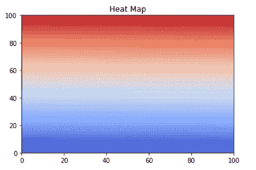

# Matplotlib Plot NumPy Array

> 原文：<https://pythonguides.com/matplotlib-plot-numpy-array/>

[](https://sharepointsky.teachable.com/p/python-and-machine-learning-training-course)

在本 [Python Matplotlib 教程](https://pythonguides.com/what-is-matplotlib/)中，我们将讨论 Matplotlib 中的 **Matplotlib plot numpy 数组**。在这里，我们将涵盖与使用 matplotlib 绘制 numpy 数组相关的不同示例。我们还将讨论以下主题:

*   Matplotlib plot numpy array
*   将 numpy 数组绘制成直线
*   Matplotlib 散点图数字数组
*   Matplotlib 从 numpy 数组中绘制多行
*   Python 将 numpy 数组绘制为热图
*   Matplotlib 将 numpy 数组绘制为图像
*   Matplotlib 保存绘图到 numpy 数组
*   Matplotlib plot numpy 数组 2d
*   Matplotlib plot numpy 数组 3d
*   Matplotlib 绘图数字矩阵
*   Matplotlib 绘图 numpy 数组列

目录

[](#)

*   [Matplotlib plot numpy 数组](#Matplotlib_plot_numpy_array "Matplotlib plot numpy array")
*   [Matplotlib 将 numpy 数组绘制为线](#Matplotlib_plot_numpy_array_as_line "Matplotlib plot numpy array as line")
*   [Matplotlib 散点图 numpy 数组](#Matplotlib_scatter_plot_numpy_array "Matplotlib scatter plot numpy array")
*   [Matplotlib 从 numpy 数组中绘制多行](#Matplotlib_plot_multiple_lines_from_numpy_array "Matplotlib plot multiple lines from numpy array")
*   [Python 将 numpy 数组绘制为热图](#Python_plot_numpy_array_as_heatmap "Python plot numpy array as heatmap")
    *   [使用 matplotlib imshow()函数](#Using_matplotlib_imshow_function "Using matplotlib imshow() function")
    *   [使用 matplotlib pcolormesh()函数](#Using_matplotlib_pcolormesh_function "Using matplotlib pcolormesh() function")
    *   [使用 seaborn heatmap()函数](#Using_seaborn_heatmap_function "Using seaborn heatmap() function")
*   [Matplotlib 将 numpy 数组绘制为图像](#Matplotlib_plot_numpy_array_as_image "Matplotlib plot numpy array as image")
*   [Matplotlib 将绘图保存到 numpy 数组](#Matplotlib_save_plot_to_numpy_array "Matplotlib save plot to numpy array")
*   [Matplotlib plot numpy 数组 2d](#Matplotlib_plot_numpy_array_2d "Matplotlib plot numpy array 2d")
*   [Matplotlib plot numpy 数组 3d](#Matplotlib_plot_numpy_array_3d "Matplotlib plot numpy array 3d")
*   [Matplotlib 打印数字矩阵](#Matplotlib_plot_numpy_matrix "Matplotlib plot numpy matrix")
*   [Matplotlibb plot numpy 数组列](#Matplotlibb_plot_numpy_array_columns "Matplotlibb plot numpy array columns")

## Matplotlib plot numpy 数组

在 Python 中， `matplotlib` 是一个绘图库。我们可以将它与 Python 的[](https://pythonguides.com/numpy/)****库一起使用。NumPy 代表**数字 Python** ，用于处理**数组**。****

 `**`以下是绘制 numpy 数组的步骤:**

*   **定义库:**导入所需的库，如用于数据可视化的 `matplotlib.pyplot` 和用于创建 numpy 数组的 `numpy` 。
*   **定义数据:**定义用于绘图的 x 轴和 y 轴数据坐标。
*   **绘制图表:**通过使用 matplotlib 库的 `plot()` ， `scatter()` 方法我们可以绘制图表。
*   **可视化绘图:**通过使用 `show()` 方法，用户可以在他们的屏幕上生成一个绘图。

**我们来看一个例子:**

```py
**# Import Library**

import numpy as np 
import matplotlib.pyplot as plt

**# Data Cooedinates**

x = np.arange(5, 10) 
y = np.arange(12, 17)

**# PLot**

plt.plot(x,y) 

**# Add Title**

plt.title("Matplotlib PLot NumPy Array") 

**# Add Axes Labels** 
plt.xlabel("x axis") 
plt.ylabel("y axis") 

**# Display**

plt.show()
```

**说明:**

*   导入所需的库，如 `matplotlib.pyplot` 和 `numpy` 。
*   之后，我们使用 numpy 的 `np.arange()` 函数定义数据坐标。
*   要绘制图形，请使用 matplotlib 的 `plot()` 函数。
*   然后我们使用 `title()` 、 `xlabel()` 和 `ylabel()` 方法，在绘图的轴上添加 `title` 和**标签**。

**输出:**


np.arange()

另外，检查: [Matplotlib set_xticks](https://pythonguides.com/matplotlib-set-xticks/)

## Matplotlib 将 numpy 数组绘制为线

我们将学习使用 numpy 函数创建一个线图。为此，我们使用 `np.arange()` 函数，该函数从区间中返回等距值。

**我们来看一个例子:**

```py
**# Import Library**

import numpy as np 
import matplotlib.pyplot as plt

**# Data Coordinates**

x = np.arange(2, 8) 
y = np.array([5, 8, 6, 20, 18, 30])

**# PLot**

plt.plot(x, y, linestyle='--') 

**# Add Title**

plt.title("Matplotlib Plot NumPy Array As Line") 

**# Add Axes Labels** 
plt.xlabel("x axis") 
plt.ylabel("y axis") 

**# Display**

plt.show()
```

*   在这个例子中，为了定义数据坐标，我们使用 numpy 的 `arange()` 和 `array()` 方法。
*   为了绘制线图，使用 `plot()` 方法，我们还将 `linestyle` 参数传递给该方法，以更改线条的样式。
*   要给绘图添加标题，使用 `title()` 函数。
*   要在绘图的 x 轴和 y 轴上添加标签，请使用 `xlabel()` 和 `ylabel()` 方法。


plt.plot(linestyle=’–‘)

Read: [Matplotlib set_xticklabels](https://pythonguides.com/matplotlib-set_xticklabels/)

## Matplotlib 散点图 numpy 数组

我们将学习使用 numpy 函数创建散点图。

**我们来看一个例子:**

```py
**# Import Library** 
import numpy as np 
import matplotlib.pyplot as plt

**# Data Coordinates** 
x = np.arange(2, 8) 
y = x * 2 + 6

**# Plot**

plt.scatter(x, y) 

**# Add Title**

plt.title("Matplotlib Scatter Plot NumPy Array") 

**# Add Axes Labels** 
plt.xlabel("x axis") 
plt.ylabel("y axis") 

**# Display**

plt.show()
```

*   在上面的例子中，我们使用 `np.arange()` 函数在 x 轴上创建一个 n array，在 y 轴上，我们使用等式创建一个 n array。
*   要绘制散点图，请使用 `scatter()` 方法。


plt.scatter()

读取: [Matplotlib fill_between](https://pythonguides.com/matplotlib-fill_between/)

## Matplotlib 从 numpy 数组中绘制多行

我们将学习从 numpy 数组中绘制多条线。

**举例:**

```py
**# Import Library** 
import numpy as np 
import matplotlib.pyplot as plt

**# Data Coordinates**

x = np.arange(2, 8) 
y1 = x * 3
y2 = np.array([5, 2.6, 4, 15, 20, 6])

**# PLot**

plt.plot(x, y1) 
plt.plot(x, y2)

**# Add Title**

plt.title("Matplotlib Multiple Line Plot From NumPy Array") 

**# Add Axes Labels**

plt.xlabel("x axis") 
plt.ylabel("y axis") 

**# Display** 
plt.show()
```

**输出:**


Multiple Line

*   在上面的例子中，我们定义了 `x` 、 `y1` 和 `y2` 数据坐标。
*   在此之后，我们使用 matplotlib 的 `plot()` 方法绘制了 **(x，y1)** 和 **(x，y2)** 之间的图形。

阅读:[Matplotlib set _ yticklabels](https://pythonguides.com/matplotlib-set_yticklabels/)

## Python 将 numpy 数组绘制为热图

热图是一种数据可视化图形技术，在这种技术中，我们使用颜色来表示数据，以可视化矩阵的值。热图也称为阴影矩阵。

**将热图绘制成 numpy 数组有多种方式:**

*   使用 matplotlib imshow()函数
*   使用 matplotlib pcolormesh()函数
*   使用 seaborn heatmap()函数

### 使用 matplotlib imshow()函数

matplotlib 的 `imshow()` 函数用于将数据显示为图像。

**以下是语法:**

```py
matplotlib.pyplot.imshow(X, cmap=None, norm=None, aspect=None,
                         interpolation=None, alpha=None,  
                         vmin=None, vmax=None, origin=None, 
                         extent=None, shape=, filternorm=1, 
                         filterrad=4.0, imlim=, resample=None,
                         url=None, \* , data=None, \*\*kwargs) 
```

**举例:**

```py
**# Import Library**

import numpy as np
import matplotlib.pyplot as plt

**# Define Data**

x = np.arange(100).reshape((10,10)) 

**# Heat map**

plt.imshow( x, cmap = 'rainbow' , interpolation = 'bilinear')

**# Add Title**

plt.title( "Heat Map" )

**# Display**

plt.show()
```

*   这里我们使用 numpy 的 `arange()` 方法来定义数据坐标。
*   之后，我们使用 `imshow()` 函数来绘制热图。我们通过 `x` 参数来表示图像的数据， `cmap` 参数是 colormap 实例，**插值**参数用于显示图像。


plt.imshow()

### 使用 matplotlib pcolormesh()函数

`pcolormesh()` 函数用于创建带有不规则矩形网格的伪彩色图。

**以下是语法:**

```py
matplotlib.pyplot.pcolormesh(*args, alpha=None, norm=None,
                             cmap=None, vmin=None, vmax=None,
                             shading='flat', antialiased=False,
                             data=None, **kwargs)
```

**举例:**

```py
**# Import Library**

import numpy as np
import matplotlib.pyplot as plt

**# Define Data** 
x = np.arange(10000).reshape((100,100)) 

**# Heat map**

plt.pcolormesh( x, cmap = 'coolwarm')

**# Add Title**

plt.title( "Heat Map" )

**# Display** 
plt.show()
```



plt.pcolormesh()

### 使用 seaborn heatmap()函数

`heatmap()` 函数用于将矩形数据绘制成颜色矩阵。

**以下是语法:**

```py
seaborn.heatmap(data, *, vmin=None, vmax=None, cmap=None, 
                center=None, annot_kws=None, linewidths=0, 
                linecolor='white', cbar=True, **kwargs)
```

**举例:**

```py
**# Import Library** 
import numpy as np
import seaborn as sns
import matplotlib.pyplot as plt

**# Define Data Coordinates** 
x = np.arange(15**2).reshape((15, 15))

**# HeatMap** 
sns.heatmap( x , linewidth = 0.5 , cmap = 'Dark2' )

**# Add Title** 
plt.title( "Heat Map" )

**# Display**

plt.show()
```

*   在上面的例子中，我们导入了 `numpy` 、 `matplotlib.pyplot` 和 `seaborn` 库。
*   之后，我们使用 numpy 的 `arange()` 方法定义数据坐标，并使用`shape()`方法对其进行整形。
*   然后我们使用 seaborn 的 `heatmap()` 函数。
*   要给绘图添加标题，使用 `title()` 函数。


sns.heatmap()

阅读: [Matplotlib tight_layout](https://pythonguides.com/matplotlib-tight-layout/)

## Matplotlib 将 numpy 数组绘制为图像

我们将学习把 numpy 数组绘制成图像。我们使用`matplotlib . py plot . im show()`函数将 numpy 数组转换为图像。

**我们来看一个例子:**

```py
**# Import Library**

import numpy as np
import matplotlib.pyplot as plt

**# Define Data**

x = np.array([[[0, 0, 128], [255, 255, 0], [128, 0, 0]],
             [[0, 255, 0], [0, 0, 255], [255, 0, 255]]])

**# Image**

plt.imshow(x)

**# Display**

plt.show()
```

*   在上面的例子中，我们导入了 `matplotlib.pyplot` 和 `numpy` 库。
*   接下来，我们定义一个 RGB 颜色代码数组。
*   然后我们使用 `imshow()` 函数将数组保存为图像。


plt.imshow()

阅读:[Python Matplotlib tick _ params](https://pythonguides.com/matplotlib-tick-params/)

## Matplotlib 将绘图保存到 numpy 数组

我们将学习绘制 numpy 数组。使用 matplotlib pyplot 模块的 `savefig()` 函数保存图形。

**我们来看一个例子:**

```py
**# Import Library**

import numpy as np
import matplotlib.pyplot as plt

**# Define Data**

x = np.array([1, 2.5, 8, 4.3, 6])

**# Plot**

plt.plot(x)

**# Save** 

plt.savefig('NumPy Array.png')

**# Display**

plt.show()
```

*   这里我们使用 numpy 的 `array()` 方法定义数据坐标，并使用 `plot()` 方法绘制数据 we。
*   为了将绘图保存为 png 图像，我们使用了 `savefig()` 方法。


savefig()

读取: [Matplotlib x 轴标签](https://pythonguides.com/matplotlib-x-axis-label/)

## Matplotlib plot numpy 数组 2d

我们将学习使用 matplotlib 的 pyplot 模块的 `plot()` 方法绘制 2d numpy 数组。

**举例:**

```py
**# Import Library**

import numpy as np
import matplotlib.pyplot as plt

**# Define Data**

x = np.array([[2, 4, 6], [6, 8, 10]])
y = np.array([[8, 10, 12], [14, 16, 18]])

**# Plot**

plt.plot(x, y)

**# Display**

plt.show()
```

*   这里我们创建 2d 数组来定义数据坐标 x 和 y。
*   要绘制 2D 数字数组，请使用 `plot()` 方法。


2D NumPy Array

阅读: [Matplotlib 多条形图](https://pythonguides.com/matplotlib-multiple-bar-chart/)

## Matplotlib plot numpy 数组 3d

我们将学习使用 matplotlib 的轴模块的散点图方法绘制 3d numpy 数组。我们还使用 3d 投影来创建 3d 绘图。

**举例:**

```py
**# Import Library** 
import numpy as np
import matplotlib.pyplot as plt

**# Create figure and subplot**

fig = plt.figure()
ax = fig.add_subplot(111, projection='3d')

**# Define Data**

x = np.array([[[1, 2, 3], [4, 5, 6]], [[1, 2, 3], [4, 5, 6]]])
y = np.array([[[1, 2, 3], [4, 5, 6]], [[8, 10, 12], [4, 5, 6]]])
z = np.array([[[5, 6, 9], [4, 5, 6]], [[1, 2, 3], [4, 5, 6]]])

**# Plot**

ax.scatter(x, y, z, color='red')

**# Display**

plt.show()
```

以下是从 3D numpy 数组建立 3D 出图的步骤:

*   先导入库，比如 `numpy` 和 `matplotlib.pyplot`
*   使用**图()**方法创建一个新的。
*   使用 `add_subplot()` 方法给图形添加一个轴。
*   使用 numpy 的 `array()` 方法创建一个 3D numpy 数组。
*   使用**散点()**方法绘制 3D 图。
*   要显示绘图，使用 `show()` 方法。


3D NumPy Array

阅读: [Matplotlib 散点图图例](https://pythonguides.com/matplotlib-scatter-plot-legend/)

## Matplotlib 打印数字矩阵

我们将学习绘制一个 numpy 矩阵。Numpy 矩阵是严格的二维矩阵。为了将数组显示为矩阵，我们使用 matplotlib 的 pyplot 模块的 `matshow()` 方法。

**例#1**

```py
**# Import Library**

import matplotlib.pyplot as plt
import numpy as np

**# Function**

def mat (dim):
    x = np.zeros(dim)
    for i in range(max(dim)):
        x[i, i] = -i 
    return x

**# Display matrix**

plt.matshow(mat((20,20)))

**# Display**

plt.show()
```

*   首先，我们导入 `matplotlib.pyplot` 和 `numpy` 库。
*   接下来，我们创建一个函数来生成一个带有零点的矩阵，并减少它的对角元素。
*   然后我们使用 `matshow()` 方法，将一个数组显示为一个矩阵。


plt.matshow()

**例 2**

```py
**# Import Library**

import numpy as np
import matplotlib.pyplot as plt

**# Define Data**

a = np.mat('4 3; 2 1')
b = np.mat('1 2; 3 4')
c= a + b

**# Plot**

plt.plot(a, b, color='red')
plt.plot(a, c, color='m')

**# Display**

plt.show()
```

*   这里我们使用 `mat()` 函数将给定的输入解释为一个矩阵。
*   我们还执行两个矩阵的**加法**运算。
*   然后我们使用 `plot()` 方法创建一个图形。


np.mat()

阅读: [Matplotlib 3D 散点图](https://pythonguides.com/matplotlib-3d-scatter/)

## Matplotlibb plot numpy 数组列

我们将学习从 numpy 数组中获取列，并使用 matplotlib 的 pyplot 模块的 `plot()` 方法进行绘制。

**例#1**

```py
**# Import Library**

import numpy as np
import matplotlib.pyplot as plt

**# Create numpy array**

data = np.array([1, 2, 3, 4, 5, 6, 7, 8])

**# First two columns'** 
print("First two columns")
print(data[0:2])

**# Define data**

x= data[0:2]

**# Plot**

plt.plot(x)

**# Display**

plt.show()
```

*   这里我们使用 numpy 的 `array` 方法创建一个 numpy 数组。
*   然后我们从数组中取出前两列。
*   为了绘制图表，我们使用了 `plot()` 方法。


plt.plot()

**例 2**

```py
**# Import Library**

import numpy as np
import matplotlib.pyplot as plt

**# Create numpy array**

data = np.array([1, 2, 3, 4, 5, 6, 7, 8])

**# Length of an array**

length = len(data)

**# Last three columns**

print("Last 3 Columns")
print(data[length-3:length])

x= data[length-3:length]

**# PLot**

plt.plot(x)

**# Display**

plt.show()
```

*   这里我们使用 numpy 的 `array()` 方法创建一个数组。
*   然后我们使用 `len()` 方法找到数组的长度。
*   然后我们使用 `plot()` 方法打印并绘制数组的最后三列。


matplotlib plot numpy array with columns

你可能也喜欢阅读下面的 Matplotlib 教程。

*   [堆积条形图 Matplotlib](https://pythonguides.com/stacked-bar-chart-matplotlib/)
*   [Matplotlib 散点图颜色](https://pythonguides.com/matplotlib-scatter-plot-color/)
*   [Matplotlib 更新循环中的绘图](https://pythonguides.com/matplotlib-update-plot-in-loop/)
*   [Matplotlib 两个 y 轴](https://pythonguides.com/matplotlib-two-y-axes/)
*   [画垂直线 matplotlib](https://pythonguides.com/draw-vertical-line-matplotlib/)
*   [Matplotlib 标题字体大小](https://pythonguides.com/matplotlib-title-font-size/)

因此，在这个 **Python 教程**中，我们已经讨论了**“Matplotlib plot numpy 数组”**，并且我们也涵盖了一些与之相关的例子。这些是我们在本教程中讨论过的以下主题。

*   Matplotlib plot numpy array
*   将 numpy 数组绘制成直线
*   Matplotlib 散点图数字数组
*   Matplotlib 从 numpy 数组中绘制多行
*   Python 将 numpy 数组绘制为热图
*   Matplotlib 将 numpy 数组绘制为图像
*   Matplotlib 保存绘图到 numpy 数组
*   Matplotlib plot numpy 数组 2d
*   Matplotlib plot numpy 数组 3d
*   Matplotlib 绘图数字矩阵
*   Matplotlib 绘图 numpy 数组列

[Bijay Kumar](https://pythonguides.com/author/fewlines4biju/)

Python 是美国最流行的语言之一。我从事 Python 工作已经有很长时间了，我在与 Tkinter、Pandas、NumPy、Turtle、Django、Matplotlib、Tensorflow、Scipy、Scikit-Learn 等各种库合作方面拥有专业知识。我有与美国、加拿大、英国、澳大利亚、新西兰等国家的各种客户合作的经验。查看我的个人资料。

[enjoysharepoint.com/](https://enjoysharepoint.com/)[](https://www.facebook.com/fewlines4biju "Facebook")[](https://www.linkedin.com/in/fewlines4biju/ "Linkedin")[](https://twitter.com/fewlines4biju "Twitter")****