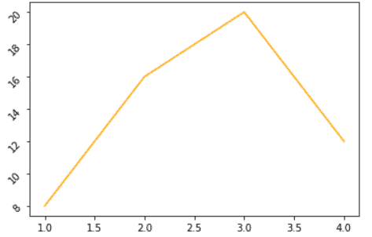

# Matplotlib 旋转刻度标签

> 原文：<https://pythonguides.com/matplotlib-rotate-tick-labels/>

[](https://sharepointsky.teachable.com/p/python-and-machine-learning-training-course)

在本 [Python 教程](https://pythonguides.com/python-download-and-installation/)中，我们将讨论 Python 中的 **matplotlib 旋转刻度标签**。我们还将讨论以下主题:

*   Matplotlib 旋转刻度标签
*   Matplotlib 旋转刻度标签示例
*   Matplotlib 旋转刻度标签 x 轴
*   Matplotlib 旋转刻度标签 y 轴
*   Matplotlib 旋转刻度标签日期
*   Matplotlib 旋转刻度标签色带
*   Matplotlib 将刻度标签旋转 45 度
*   Matplotlib 将刻度标签旋转 90 度
*   旋转刻度标签对齐

目录

[](#)

*   [Matplotlib 旋转刻度标签](#Matplotlib_rotate_tick_labels "Matplotlib rotate tick labels")
*   [Matplotlib 旋转刻度标签示例](#Matplotlib_rotate_tick_labels_examples "Matplotlib rotate tick labels examples")
*   [Matplotlib 旋转 x 轴刻度标签](#Matplotlib_rotate_tick_labels_x-axis "Matplotlib rotate tick labels x-axis")
    *   [Matplotlib 在图形级别旋转 x 轴刻度标签](#Matplotlib_rotate_x-axis_tick_labels_on_figure_level "Matplotlib rotate x-axis tick labels on figure level")
    *   [Matplotlib 在轴级别旋转 x 轴刻度标签](#Matplotlib_rotate_x-axis_tick_labels_on_axes_level "Matplotlib rotate x-axis tick labels on axes level")
    *   [Matplotlib 使用 ax.set_xticklabels()方法旋转 x 轴刻度标签](#Matplotlib_rotate_x_axis_tick_labels_by_using_axset_xticklabels_method "Matplotlib rotate x axis tick labels by using ax.set_xticklabels()  method")
    *   [Matplotlib 使用 ax.tick_parmas()](#Matplotlib_rotate_x-axis_tick_labels_by_using_axtick_parmas "Matplotlib rotate x-axis tick labels by using ax.tick_parmas()") 旋转 x 轴刻度标签
*   [Matplotlib 旋转 Y 轴刻度标签](#Matplotlib_rotate_tick_labels_Y-axis "Matplotlib rotate tick labels Y-axis")
    *   [Matplotlib 在图形级别旋转 y 轴刻度标签](#Matplotlib_rotate_y-axis_tick_labels_on_figure_level "Matplotlib rotate y-axis tick labels on figure level")
    *   [Matplotlib 在轴级别旋转 y 轴刻度标签](#Matplotlib_rotate_y-axis_tick_labels_on_axes_level "Matplotlib rotate y-axis tick labels on axes level")
    *   [Matplotlib 使用 ax.set_yticklabels()方法旋转 Y 轴刻度标签](#Matplotlib_rotate_Y_axis_tick_labels_by_using_axset_yticklabels_method "Matplotlib rotate Y axis tick labels by using ax.set_yticklabels()  method")
    *   [Matplotlib 使用 ax.tick_parmas()](#Matplotlib_rotate_Y-axis_tick_labels_by_using_axtick_parmas "Matplotlib rotate Y-axis tick labels by using ax.tick_parmas()") 旋转 Y 轴刻度标签
*   [Matplotlib 旋转刻度标签日期](#Matplotlib_rotate_tick_labels_date "Matplotlib rotate tick labels date")
*   [Matplotlib 旋转刻度标签子图](#Matplotlib_rotate_tick_labels_subplot "Matplotlib rotate tick labels subplot")
*   [Matplotlib 旋转刻度标签颜色条](#Matplotlib_rotate_tick_label_colorbar "Matplotlib rotate tick label colorbar")
    *   [Matplotlib 水平旋转刻度标签柱状图](#Matplotlib_rotate_tick_label_colobar_horizontal "Matplotlib rotate tick label colobar horizontal")
    *   [Matplotlib 垂直旋转刻度标签柱状图](#Matplotlib_rotate_tick_label_colobar_vertical "Matplotlib rotate tick label colobar vertical")
*   [Matplotlib 将刻度标签旋转 45 度](#Matplotlib_rotate_tick_labels_45_degrees "Matplotlib rotate tick labels 45 degrees")
*   [Matplotlib 将刻度标签旋转 90 度](#Matplotlib_rotate_tick_labels_90_degrees "Matplotlib rotate tick labels 90 degrees")
*   [Matplotlib 旋转刻度标签对齐](#Matplotlib_rotate_tick_labels_alignment "Matplotlib rotate tick labels alignment")
    *   [Matplotlib 向右旋转刻度标签对齐](#Matplotlib_rotate_tick_label_alignment_right "Matplotlib rotate tick label alignment right")
    *   [Matplotlib 旋转刻度标签对齐中心](#Matplotlib_rotate_tick_label_alignment_center "Matplotlib rotate tick label alignment center")
    *   [Matplotlib 向左旋转刻度标签对齐](#Matplotlib_rotate_tick_label_alignment_left "Matplotlib rotate tick label alignment left")

## Matplotlib 旋转刻度标签

*   在 python 中， [matplotlib](https://pythonguides.com/what-is-matplotlib/) 是用于数据可视化的最好的库之一。
*   Matplotlib 库提供了根据我们的选择定制刻度标签的功能。
*   它提供了旋转刻度标签的功能。

首先，让我们了解 ticks 标签是什么意思:

*   代表轴上数据点的标记称为“**记号**”。
*   而给标记赋予的名称叫做“**记号标签**”。

默认情况下，Matplotlib 在轴上标记数据点，但它也为我们提供了根据我们的选择设置刻度和刻度标签的功能。

在本节中，我们将学习刻度标签的旋转。

**以下步骤用于旋转 matplotlib 中的刻度标签，概述如下:**

*   **定义库:**导入旋转刻度标签所需的重要库(用于可视化:来自 matplotlib 的 pyplot，用于数据创建和操作:NumPy 和 Pandas)。
*   **定义 X 和 Y:** 定义 X 轴和 Y 轴上的数据值。
*   **绘制图表:**通过使用 `plot()` 方法或任何其他可用于绘制的方法，您可以绘制图表。
*   **旋转刻度标签:**通过使用 `x.ticks()` 和 `y.ticks()` 的方法我们可以旋转刻度标签。
*   **显示:**最后使用 `show()` 的方法显示剧情。

**旋转刻度标签的语法如下:**

```py
`For X-axis labels` 
matplotlib.pyplot.xticks(ticks=None, labels=None, rotation=None, ......)

`For Y-axis labels`

matplotlib.pyplot.yticks(ticks=None, labels=None, rotation=None, ......) 
```

**上述使用的参数概述如下:**

*   **蜱:**是一种阵列状结构。它指定 xtick 或 ytick 位置的列表。
*   **标签:**指定放置在给定刻度位置的标签。它是一个类似数组的结构。
*   **旋转:**指定旋转的角度。

另外，学习:[如何安装 matplotlib python](https://pythonguides.com/how-to-install-matplotlib-python/)

## Matplotlib 旋转刻度标签示例

在上面的部分中，我们讨论了刻度标签的含义以及刻度标签旋转的语法。

**下面我们通过一个例子来理解刻度标签旋转的概念:**

```py
**# Import Libraries**

import matplotlib.pyplot as plt

**# Define data**

x = [2, 4, 6, 8]
y = [7, 14, 21, 28]

**# Create Plot**

plt.plot(x, y, color='red')

**# Rotate tick labels**

plt.xticks(rotation=30)

**# Display graph**

plt.show()
```

*   在上面的例子中，我们导入 **matplotlib。pyplot** 库。之后，我们定义 x 轴和 y 轴的数据点。
*   `plt.plot()` 方法用于图形的创建。
*   `plt.xticks()` 方法用于 x 轴刻度标签的旋转。这里我们通过**旋转**参数，设置旋转角度 **30 度**。


plt.xticks()

**结论！** x 标签旋转 30 度角。

阅读: [Python 使用 Matplotlib 绘制多条线](https://pythonguides.com/python-plot-multiple-lines/)

## Matplotlib 旋转 x 轴刻度标签

在本节中，我们将学习如何旋转 X 轴刻度标签。

**旋转 x 轴有两种方式:**

*   **plt.xticks():** 在图形级别上旋转。
*   **tick.set_rotation():** 轴级旋转。
*   **ax.set_xticklabels():** 在轴级别上旋转。
*   `ax.tick_params()`

### Matplotlib 在图形级别旋转 x 轴刻度标签

对于图形级别的刻度标签的旋转，首先我们必须使用 `plt.plot()` 方法绘制图形。

在这之后，我们必须调用 `plt.xticks()` 方法并传递**旋转**参数，并根据您的选择设置它们的值。

**改变图形级 x 轴刻度旋转的语法如下:**

```py
matplotlib.pyplot.xticks(rotation=)
```

**上述使用的参数描述如下:**

*   **旋转:**设置旋转角度。

**让我们用一个例子来看看图形级的旋转是如何工作的:**

```py
**# Import Libraries**
import matplotlib.pyplot as plt

**# Define data**
x = [2, 4, 6, 8]
y = [7, 14, 21, 28]

**# Create Plot**
plt.plot(x, y, color='red')

**# Rotate tick labels**
plt.xticks(rotation=175)

**# Display graph**
plt.show()
```

在上面的例子中，我们使用 **plt 来绘制图表。plot()** 方法之后，我们调用 `plt.xticks()` 方法，将旋转角度设置为 **175 度**。


plt.xticks()

### Matplotlib 在轴级别旋转 x 轴刻度标签

对于图形级别的刻度标签的旋转，首先我们必须使用 `plt.draw()` 方法绘制图形。

在此之后，您必须调用 `tick.set_rotation()` 方法，并将**旋转**角度值作为参数传递。

**在轴级别改变 x 轴刻度旋转的语法如下:**

```py
matplotlib.pyplot.set_ticks(rotation angle)
```

**上述使用的参数描述如下:**

*   **旋转角度:**设置旋转移动 x 轴标签的角度。

**让我们用一个例子来看看轴级旋转是如何工作的:**

```py
**# Import Libraries**

import matplotlib.pyplot as plt

**# Define data**

x = [2, 4, 6, 8]
y = [7, 14, 21, 28]

**# Create Plot**

plt.plot(x, y, color = 'm')

ax = plt.gca()

**# Call draw function**

plt.draw()

**# Tick rotation on axes**

for tick in ax.get_xticklabels():
    tick.set_rotation(63)

**# Display graph**

plt.show()
```

在上面的例子中，首先我们调用 `draw()` 方法，然后使用 for loop 和 `tick.set_rotation()` 方法并设置旋转角度 **63 度**。


tick.set_rotation()

读取 [Matplotlib 反转 y 轴](https://pythonguides.com/matplotlib-invert-y-axis/)

### Matplotlib 使用 ax.set_xticklabels()方法旋转 x 轴刻度标签

旋转 X 轴刻度标签的另一种方法是使用 `ax.set_xticklabels()` 方法。在此之前，你必须获得对象的当前轴。

记住在调用这个方法之前，你必须调用 `plt.draw()` 方法。

**上述方法的语法如下:**

```py
ax.set_xticklabels(ax.get_xticks(), rotation =)
```

**让我们借助一个例子来理解这个概念:**

```py
**# Import Libraries**

import matplotlib.pyplot as plt

**# Define data**

x = [2, 4, 6, 8]
y = [7, 14, 21, 28]

**# Create Plot**

plt.plot(x, y, color = 'orange')

ax = plt.gca()

**# Call draw function**

plt.draw()

**# Tick rotation on axes**

ax.set_xticklabels(ax.get_xticks(), rotation = 10)

**# Display graph**

plt.show()
```

在上面的例子中，我们首先调用 `plt.draw()` 方法，然后我们 `ax.set_xticklabels()` 方法，并将旋转角度设置为 **10 度**。


ax.set_xticklabels()

### Matplotlib 使用 ax.tick_parmas() 旋转 x 轴刻度标签

旋转 x 轴刻度标签的另一种方法是使用 `ax.tick_parmas()` 方法。在此之前，你必须获得对象的当前轴。

**该方法的语法如下:**

```py
ax.tick_params(axis=None, labelrotation= None)
```

**上面使用的参数概述如下:**

*   **轴:**指定要旋转的轴。
*   **标签旋转:**具体的旋转角度。

**让我们借助一个例子来理解这个概念:**

```py
**# Import Libraries**

import matplotlib.pyplot as plt

**# Define data**

x = [2, 4, 6, 8]
y = [7, 14, 21, 28]

**# Crate Plot**

plt.plot(x, y, color = 'orange')

ax = plt.gca()

**# Rotate x-axis labels** 

ax.tick_params(axis='x', labelrotation = 45)

**# Display graph**

plt.show() 
```

在上面的例子中，我们使用了 `ax.tick_params()` 方法，并将“**轴”**作为参数传递，并将它们的值设置为**“x”**，还将**“标签旋转**”作为参数传递，并将它们的值设置为 `45` 。

阅读: [Matplotlib 绘制一条线](https://pythonguides.com/matplotlib-plot-a-line/)

## Matplotlib 旋转 Y 轴刻度标签

在本节中，我们将学习如何旋转 Y 轴刻度标签。

**旋转 y 轴有两种方式:**

*   **plt.yticks():** 在图形级别上旋转。
*   **tick.set_rotation():** 轴级旋转。
*   **ax.set_yticklabels():** 在轴级别上旋转。
*   `ax.tick_params()`

### Matplotlib 在图形级别旋转 y 轴刻度标签

对于图形级别的刻度标签的旋转，首先我们必须使用 `plt.plot()` 方法绘制图形。

在这之后，我们必须调用 `plt.yticks()` 方法并传递**旋转**参数，并根据您的选择设置它们的值。

**改变图形级 y 轴刻度旋转的语法如下:**

```py
matplotlib.pyplot.yticks(rotation=)
```

**上述使用的参数描述如下:**

*   **旋转:**设置旋转角度。

**让我们用一个例子来看看图形级的旋转是如何工作的:**

```py
**# Import Libraries**
import matplotlib.pyplot as plt

**# Define data**
x = [2, 4, 6, 8]
y = [7, 14, 21, 28]

**# Create Plot**
plt.plot(x, y)

**# Rotate tick labels**
plt.yticks(rotation=63)

**# Display graph**
plt.show()
```

在上面的例子中，我们使用 **plt 来绘制图表。plot()** 方法，之后我们调用 `plt.yticks()` 方法，设置旋转角度为 **63 度**。


plt.yticks()

**结论！** Y 轴刻度标签旋转 63 度。

阅读:[什么是 matplotlib 内联](https://pythonguides.com/what-is-matplotlib-inline/)

### Matplotlib 在轴级别旋转 y 轴刻度标签

要在图形级别旋转刻度标签，首先必须使用 `plt.draw()` 方法绘制图形。

在此之后，您必须调用 `tick.set_rotation()` 方法，并将**旋转**角度值作为参数传递。

**在轴级别改变 y 轴刻度旋转的语法如下:**

```py
matplotlib.pyplot.set_ticks(rotation angle)
```

**上述使用的参数描述如下:**

*   **旋转角度:**设置旋转移动 y 轴标签的角度。

**让我们用一个例子来看看轴级旋转是如何工作的:**

```py
**# Import Libraries**

import matplotlib.pyplot as plt

**# Define data**

x = [2, 4, 6, 8]
y = [7, 14, 21, 28]

**# Create Plot**

plt.plot(x, y, color = 'm')

ax = plt.gca()

**# Call draw function**

plt.draw()

**# Tick rotation on axes**

for tick in ax.get_yticklabels():
    tick.set_rotation(63)

**# Display graph**

plt.show()
```

在上面的例子中，首先我们调用 `draw()` 方法，然后使用 for loop 和 `tick.set_rotation()` 方法，并设置旋转角度 **23 度**。


tick.set_rotation()

**结论！** Y 轴标签旋转 23 度。

### Matplotlib 使用 ax.set_yticklabels()方法旋转 Y 轴刻度标签

旋转 Y 轴刻度标签的另一种方法是使用 `ax.set_yticklabels()` 方法。在此之前，你必须获得对象的当前轴。

记住在调用这个方法之前，你必须调用 `plt.draw()` 方法。

**上述方法的语法如下:**

```py
ax.set_yticklabels(ax.get_yticks(), rotation =)
```

**让我们借助一个例子来理解这个概念:**

```py
**# Import Libraries**

import matplotlib.pyplot as plt

**# Define data**

x = [2, 4, 6, 8]
y = [7, 14, 21, 28]

**# Create Plot**

plt.plot(x, y, color = 'orange')

ax = plt.gca()

**# Call draw function**

plt.draw()

**# Tick rotation on axes**

ax.set_yticklabels(ax.get_yticks(), rotation = 10)

**# Display graph**

plt.show()
```

在上面的例子中，我们首先调用 `plt.draw()` 方法，然后我们 `ax.set_yticklabels()` 方法，并将旋转角度设置为 **10 度**。


set_yticklabels()

### Matplotlib 使用 ax.tick_parmas() 旋转 Y 轴刻度标签

旋转 Y 轴刻度标签的另一种方法是使用 `ax.tick_parmas()` 方法。在此之前，你必须获得对象的当前轴。

**该方法的语法如下:**

```py
ax.tick_params(axis=None, labelrotation= None)
```

**上面使用的参数概述如下:**

*   **轴:**指定要旋转的轴。
*   **标签旋转:**具体的旋转角度。

**让我们借助一个例子来理解这个概念:**

```py
**# Import Libraries**

import matplotlib.pyplot as plt

**# Define data**

x = [2, 4, 6, 8]
y = [7, 14, 21, 28]

**# Crate Plot**

plt.plot(x, y, color = 'orange')

ax = plt.gca()

**# Rotate y-axis labels** 
ax.tick_params(axis='y', labelrotation = 45)

**# Display graph**

plt.show() 
```

在上面的例子中，我们使用了 `ax.tick_params()` 方法，并将“**轴”**作为参数传递，并将它们的值设置为**“y”**，还将**“标签旋转**作为参数传递，并将它们的值设置为 `45` 。


ax.tick_params()

阅读: [Matplotlib 绘图条形图](https://pythonguides.com/matplotlib-plot-bar-chart/)

## Matplotlib 旋转刻度标签日期

刻度标签旋转背后的原因是重叠。大多数情况下，日期刻度很长，并开始重叠。为了避免这种情况，我们旋转日期刻度标签。

*   为了避免 x 轴上的日期重叠，我们使用了 `fig.autofmt_xdate()` 方法。
*   这种方法自动设置日期的旋转和调整 x 轴，或者你也可以设置你选择的旋转角度。

**x 轴日期旋转的语法:**

```py
matplotlib.figure.Figure.autofmt_xdate(bottom=0.2,roation=10,ha='left',which=None)
```

**以下参数用于上述` `功能，概述如下****:**

*   **底部:**指定绘图的底部。
*   **旋转:**指定旋转角度。
*   **ha:** 具体横向对齐。
*   **哪个:**指定旋转哪个 ticket。

**让我们借助一个例子来理解这个概念:**

**代码#1**

下面是没有使用 `autofmt_xdate()` 方法的代码。

```py
**# Import Libraries**

import matplotlib.pyplot as plt
from datetime import datetime, timedelta

**# Define Dates**

dates = [
    datetime(2021, 10, 21),
    datetime(2021, 7, 24),
    datetime(2021, 8, 25),
    datetime(2021, 10, 26),
]

y = [2, 4, 4.5, 6]

**# Plot Dates**

fig = plt.figure()
plt.plot_date(dates, y, linestyle= 'dashed')

**# Display Graph**

plt.show()
```

在上面的代码中，我们简单地创建由 x 轴上的日期组成的数据，并绘制它们。


*The output of Code#1*

**结论！**重叠造成的问题。要删除这个代码#2

**代码#2**

```py
 **# Import Libraries**

import matplotlib.pyplot as plt
from datetime import datetime, timedelta

**# Define Dates**

dates = [
    datetime(2021, 10, 21),
    datetime(2021, 7, 24),
    datetime(2021, 8, 25),
    datetime(2021, 10, 26),
]

y = [2, 4, 4.5, 6]

**# Plot Dates**

fig = plt.figure()
plt.plot_date(dates, y, linestyle= 'dashed')

**# Rotate dates on x-xis**

fig.autofmt_xdate()

**# Display Graph**

plt.show() 
```

在上面的代码中，我们创建由 x 轴上的日期组成的数据，然后我们使用 `autofmt_xdate()` 方法来避免重叠或旋转 x 轴上的日期。


*The output of Code#*2

**结论！**通过旋转 x 轴解决重叠问题。

阅读: [Matplotlib 支线剧情教程](https://pythonguides.com/matplotlib-subplot-tutorial/)

## Matplotlib 旋转刻度标签子图

有时我们在一个图形区域有多个支线剧情。我们只想自定义一个子图轴或旋转特定子图的轴。

在这种情况下，我们使用方法 `set_xticklabels()` 来旋转轴。

**其语法如下:**

```py
matplotlib.axis.Axis.set_xticlabels(labels=, rotation=)
```

**上述使用的参数描述如下:**

*   **标签:**为旋转设置标签。
*   **旋转:**指定旋转的角度。

**我们举个例子明确一下概念:**

```py
**# Importing Libraries**

import numpy as np
import matplotlib.pyplot as plt

**# Define Data** 
x1= [0.2, 0.4, 0.6, 0.8, 1]
y1= [0.3, 0.6, 0.8, 0.9, 1.5]

x2= [2, 6, 7, 9, 10]
y2= [3, 4, 6, 9, 12]

x3= [5, 8, 12]
y3= [3, 6, 9]

x4= [7, 8, 15]
y4= [6, 12, 18]

**# Plot graph**

fig, ax = plt.subplots(2, 2)

ax[0, 0].set_facecolor('cyan')

**# Set axis for rotation**

ax[0,0].set_xticklabels([0.2, 0.4, 0.6, 0.8, 1], rotation = 30)
ax[0, 0].plot(x1, y1)
ax[0, 1].plot(x2, y2)
ax[1, 0].plot(x3, y3)
ax[1, 1].plot(x4,y4)

**# Display graph**

fig.tight_layout()
plt.show()
```

在上面的例子中，我们使用 `set_xticklabels()` 方法将第一个子图的 x 轴旋转 **30 度**角度。


set_xticklabels()

阅读: [Matplotlib 最佳拟合线](https://pythonguides.com/matplotlib-best-fit-line/)

## Matplotlib 旋转刻度标签颜色条

彩条是颜色数据值的映射。 `colorbar()` 方法用于向图表添加一个颜色条。

如果我们想要旋转颜色条的轴以获得更好的可视化效果，我们有以下两种方法:

*   **cbar.ax.set_xticklabels:** 如果彩条的方向是水平的。
*   **cbar.ax.set_yticklabels:** 如果彩条的方向是垂直的。

### Matplotlib 水平旋转刻度标签柱状图

在这里，我们将学习如何旋转水平放置的彩条轴。

**其语法如下:**

```py
cbar.ax.set_xticklabels(labels, rotation)
```

**上面使用的参数是:**

*   **标签:**指定彩条的标签
*   **旋转:**指定旋转的角度

**我们举个例子来了解一下怎么做旋转:**

```py
**# Import libraries**

import matplotlib.pyplot as plt
import numpy as np

**# Plot image**

a = np.random.random((5, 5))
plt.imshow(a, cmap='summer')

**# Plot horizontal colorbar**

cbar = plt.colorbar(
    orientation="horizontal")

**# Set ticklabels**

labels = [0, 0.1, 0.2, 0.3, 0.4, 0.5, 0.6,
          0.7, 0.8, 0.9, 1]
cbar.set_ticks(labels)

**# Rotate x tick labels**

cbar.ax.set_xticklabels(labels, rotation=40)

**#Plot graph**  

plt.show()
```

*   在上面的例子中，我们导入库 matplotlib 和 numpy。然后我们使用 numpy 绘制数据。
*   之后，我们将方位设置为**“水平”**，并使用 `set_xticklabels()` 方法将旋转角度设置为 **40 度**。


cbar.ax.set_xticklabels ()

### Matplotlib 垂直旋转刻度标签柱状图

在这里，我们将学习如何旋转垂直放置的彩条轴。

**其语法如下:**

```py
cbar.ax.set_yticklabels(labels, rotation)
```

**上面使用的参数是:**

*   **标签:**指定彩条的标签
*   **旋转:**指定旋转的角度

**我们举个例子来了解一下怎么做旋转:**

```py
**# Import libraries**

import matplotlib.pyplot as plt
import numpy as np

**# Plot image**

a = np.random.random((5, 5))
plt.imshow(a, cmap='summer')

**# Plot vertical colorbar**

cbar = plt.colorbar(
    orientation="vertical")

**# Set ticklabels**

labels = [0, 0.1, 0.2, 0.3, 0.4, 0.5, 0.6,
          0.7, 0.8, 0.9, 1]
cbar.set_ticks(labels)

**# Rotate y tick labels**

cbar.ax.set_yticklabels(labels, rotation=40)

**# Plot graph** 

plt.show()
```

*   在上面的例子中，我们导入库 matplotlib 和 numpy。然后我们使用 numpy 绘制数据。
*   之后，我们将方位设置为**“垂直”**，并使用 `set_yticklabels()` 方法将旋转角度设置为 **40 度**。


cbar.ax.set_yticklabels()

阅读: [Matplotlib 支线剧情 _adjust](https://pythonguides.com/matplotlib-subplots_adjust/)

## Matplotlib 将刻度标签旋转 45 度

在本节中，我们将学习如何旋转以 45 度的特定角度绘制的中的 X 轴和 Y 轴。

旋转刻度的主要原因是为了避免重叠，并获得图表轴的清晰视图。

这里我们将研究刻度标签旋转 45 度的三种情况。

*   **1st:** 我们研究如何将 X 轴刻度标签旋转 45 度。
*   **2nd:** 我们研究如何将 Y 轴刻度标签旋转 45 度。
*   **3 日:**我们研究如何一次旋转 X 轴和 Y 轴刻度标签 45 度。

**旋转刻度标签 45 度的语法如下:**

```py
Matplotlib.pyplot.xticks(rotation = 45)
```

**让我们借助一个例子来更清楚地理解这个概念:**

**情况#1** (旋转 X 刻度标签)

```py
**# Import Libraries** 

import matplotlib.pyplot as plt

**# Define data** 

x = [1, 2, 3, 4]
y = [8, 16, 20, 12]

**# Create plot**

plt.plot(x, y, color='orange')

**# Rotate X-axis tick labels**

plt.xticks(rotation=45)

**# Display the Graph**

plt.show()
```

*   导入库 `matplotlib.pyplot` 进行数据可视化。
*   定义 X 轴和 Y 轴的数据，并使用 `plt.plot()` 方法创建一个图。
*   使用 `plt.xticks()` 方法将 xticks 标签旋转设置为 45 度，并将**旋转= 45** 设置为该方法中的参数。
*   最后，使用 `plt.show()` 方法显示图形。


plt.xticks()

**情况#2** (旋转 Y 刻度标签)

```py
**# Import Libraries**

import matplotlib.pyplot as plt

**# Define data**

x = [1, 2, 3, 4]
y = [8, 16, 20, 12]

**# Create plot**

plt.plot(x, y, color='orange')

**# Rotate Y-axis tick labels**

plt.yticks(rotation=45)

**# Display the Graph**

plt.show()
```

*   导入库 `matplotlib.pyplot` 进行数据可视化。
*   定义 X 轴和 Y 轴的数据，并使用 `plt.plot()` 方法创建一个图。
*   使用 `plt.yticks()` 方法将 xticks 标签旋转设置为 45 度，并将**旋转= 45** 设置为该方法中的参数。
*   最后，使用 `plt.show()` 方法显示图形。



plt.yticks()

**情况#3** (旋转两个刻度标签)

```py
**# Import Libraries**

import matplotlib.pyplot as plt

**# Define data** 

x = [1, 2, 3, 4]
y = [8, 16, 20, 12]

**# Create plot**

plt.plot(x, y, color='orange')

**# Rotate X-axis and Y-axis tick labels**

plt.xticks(rotation=45)
plt.yticks(rotation=45)

**# Display the Graph**

plt.show()
```

*   导入库 `matplotlib.pyplot` 进行数据可视化。
*   定义 X 轴和 Y 轴的数据，并使用 `plt.plot()` 方法创建一个图。
*   分别对 x 轴和 y 轴使用 `plt.xticks()` 和 `plt.yticks()` 方法，将 xticks 和 yticks 标签旋转设置为 45 度，并将**旋转= 45 度**设置为方法中的参数。
*   最后，使用 `plt.show()` 方法显示图形。


plt.xticks() and plt.yticks()

读取: [Matplotlib 日志日志图](https://pythonguides.com/matplotlib-log-log-plot/)

## Matplotlib 将刻度标签旋转 90 度

在本节中，我们将学习如何旋转以特定角度 90 度绘制的中的 X 轴和 Y 轴。

旋转刻度的主要原因是为了避免重叠，并获得图表轴的清晰视图。

这里我们研究了刻度标签旋转 90 度的三种情况。

*   **1st:** 我们研究如何将 X 轴刻度标签旋转 90 度。
*   **2nd:** 我们研究如何将 Y 轴刻度标签旋转 90 度。
*   **3 日:**我们研究如何将 X 轴和 Y 轴刻度标签一次旋转 90 度。

**将刻度标签旋转 90 度的语法如下:**

```py
Matplotlib.pyplot.xticks(rotation = 90)
```

**让我们借助一个例子来更清楚地理解这个概念:**

**情况#1** (旋转 X 刻度标签)

```py
**# Import Libraries**

import matplotlib.pyplot as plt

**# Define data** 

x = [5, 6, 7, 8]
y = [8, 16, 20, 12]

**# Create plot**

plt.plot(x, y)

**# Rotate X-axis tick labels**

plt.xticks(rotation=90)

**# Display the Graph**

plt.show()
```

*   导入库 `matplotlib.pyplot` 进行数据可视化。
*   定义 X 轴和 Y 轴的数据，并使用 `plt.plot()` 方法创建一个图。
*   使用 `plt.xticks()` 方法将 xticks 标签旋转设置为 90 度，并将**旋转= 90 度**设置为该方法中的参数。
*   最后，使用 `plt.show()` 方法显示图形。


plt.xticks()

**情况#2** (旋转 Y 刻度标签)

```py
**# Import Libraries**

import matplotlib.pyplot as plt

**# Define data**

x = [5, 6, 7, 8]
y = [8, 16, 20, 12]

**# Create plot**

plt.plot(x, y)

**# Rotate Y-axis tick labels**

plt.yticks(rotation=90)

**# Display the Graph** 
plt.show()
```

*   导入库 `matplotlib.pyplot` 进行数据可视化。
*   定义 X 轴和 Y 轴的数据，并使用 `plt.plot()` 方法创建一个图。
*   使用 `plt.yticks()` 方法将 xticks 标签旋转设置为 90 度，并将**旋转= 90 度**设置为该方法中的参数。
*   最后，使用 `plt.show()` 方法显示图形。


plt.yticks()

**情况#3** (旋转两个刻度标签)

```py
**# Import Libraries** 
import matplotlib.pyplot as plt

**# Define data** 
x = [5, 6, 7, 8]
y = [8, 16, 20, 12]

**# Create plot** 
plt.plot(x, y)

**# Rotate X-axis and Y-axis tick labels** 
plt.xticks(rotation=90)
plt.yticks(rotation=90)

**# Display the Graph** 
plt.show()
```

*   导入库 `matplotlib.pyplot` 进行数据可视化。
*   定义 X 轴和 Y 轴的数据，并使用 `plt.plot()` 方法创建一个图。
*   分别对 x 轴和 y 轴使用 `plt.xticks()` 和 `plt.yticks()` 方法将 xticks 和 yticks 标签旋转设置为 90 度，并将**旋转= 90 度**设置为该方法中的参数。
*   最后，使用 `plt.show()` 方法显示图形。


plt.xticks() and plt.yticks()

阅读:[Matplotlib](https://pythonguides.com/matplotlib-plot-date/)[p](https://pythonguides.com/matplotlib-plot-date/)[lot _ date](https://pythonguides.com/matplotlib-plot-date/)

## Matplotlib 旋转刻度标签对齐

在本节中，我们将学习如何对齐刻度标签。我们可以说我们将如何在不同的位置排列刻度标签。

对于刻度标签的对齐，我们使用**‘ha’**参数，它意味着“**水平对齐**，我们将这个参数传递给 `xticks()` 和 `yticks()` 方法。

**我们可以在以下位置对齐刻度标签，如下所示:**

*   **ha='right':** 指定刻度标签在右端对齐。
*   **ha='center':** 指定刻度标签居中对齐。
*   **ha='left':** 指定刻度标签在左端对齐。

**让我们正确理解每一种对齐情况:**

### Matplotlib 向右旋转刻度标签对齐

我们将研究如何在右端对齐刻度标签。

**右对齐的语法如下:**

```py
**# For x-axis**
matplotlib.pyplot.xticks(ha='right')
**# For y-axis**
matplotlib.pyplot.yticks(ha='right')
```

**让我们看一个与右对齐相关的例子:**

```py
**# Import Libraries**

import matplotlib.pyplot as plt

**# Define data**

x = [2, 4, 6, 8]
y = [8, 16, 20, 12]

**# Create plot**

plt.plot(x, y)

**# Right align X-axis tick labels** 
plt.xticks(ha='right')

                  **# OR**

**# Right align Y-axis tick labels**

plt.yticks(ha='right')

**# Display the Graph**

plt.show()
```

*   导入库 `matplotlib.pyplot` 进行数据可视化。
*   定义 X 轴和 Y 轴的数据，并使用 `plt.plot()` 方法创建一个图。
*   使用带有参数 **ha='right'** 的 `plt.xticks()` 设置右端 xticks 标签旋转对齐。
*   如果你想对齐 y 轴刻度标签，使用方法 `plt.yticks()` 并传递参数 **ha='right'** 。
*   最后，使用 `plt.show()` 方法显示图形。


plt.xticks(ha=’right’)


plt.yticks(ha=’right’)

### Matplotlib 旋转刻度标签对齐中心

我们将研究如何在中心对齐刻度标签。

**中心对齐的语法如下:**

```py
**# For x-axis label**
matplotlib.pyplot.xticks(ha='center')
**# For y-axis label**
matplotlib.pyplot.yticks(ha='center') 
```

**让我们看一个与中心对齐相关的例子:**

```py
**# Import Libraries**

import matplotlib.pyplot as plt

**# Define data**

x = [2, 4, 6, 8]
y = [8, 16, 20, 12]

**# Create plot**

plt.plot(x, y)

**# Center align X-axis tick labels** plt.xticks(ha='center')

                  **# OR**

**# Center align Y-axis tick labels**

plt.yticks(ha='center')

**# Display the Graph**

plt.show()
```

*   导入库 `matplotlib.pyplot` 进行数据可视化。
*   定义 X 轴和 Y 轴的数据，并使用 `plt.plot()` 方法创建一个图。
*   使用带有参数**ha =‘中心’**的 `plt.xticks()` 设置 xticks 标签旋转对齐中心。
*   如果您想要对齐 y 轴刻度标签，请使用方法 `plt.yticks()` 并传递参数 **ha='center'** 。
*   最后，使用 `plt.show()` 方法显示图形。


plt.xticks(ha=’center’)


plt.yticks(ha=’center’)

### Matplotlib 向左旋转刻度标签对齐

我们将研究如何在左端对齐刻度标签。

**左对齐的语法如下:**

```py
**# For x-axis label**
matplotlib.pyplot.xticks(ha='left')
**# For y-axis label**
matplotlib.pyplot.yticks(ha='left') 
```

**让我们看一个与左对齐相关的例子:**

```py
**# Import Libraries**

import matplotlib.pyplot as plt

**# Define data**

x = [2, 4, 6, 8]
y = [8, 16, 20, 12]

**# Create plot**

plt.plot(x, y)

**# Left align X-axis tick labels** plt.xticks(ha='left')

                  **# OR**

**# Left align Y-axis tick labels**

plt.yticks(ha='left')

**# Display the Graph**

plt.show()
```

*   导入库 `matplotlib.pyplot` 进行数据可视化。
*   定义 X 轴和 Y 轴的数据，并使用 `plt.plot()` 方法创建一个图。
*   使用带有参数 **ha='left'** 的 `plt.xticks()` 设置左端 xticks 标签旋转对齐。
*   如果你想对齐 y 轴刻度标签，使用方法 `plt.yticks()` 并传递参数 **ha='left'** 。
*   最后，使用 `plt.show()` 方法显示图形。


plt.xticks(ha=’left’)


plt.yticks(ha=’left’)

您可能喜欢阅读更多关于 Matplotlib 的内容。

*   [Matplotlib 虚线](https://pythonguides.com/matplotlib-dashed-line/)
*   [Matplotlib 散点图标记](https://pythonguides.com/matplotlib-scatter-marker/)
*   [Matplotlib 改变背景颜色](https://pythonguides.com/matplotlib-change-background-color/)

在本 Python 教程中，我们已经讨论了" **Matplotlib 旋转刻度标签**"并且我们还介绍了一些与之相关的例子。这些是我们在本教程中讨论过的以下主题。

*   Matplotlib 旋转刻度标签
*   Matplotlib 旋转刻度标签示例
*   Matplotlib 旋转刻度标签 x 轴
*   Matplotlib 旋转刻度标签 y 轴
*   Matplotlib 旋转刻度标签日期
*   Matplotlib 旋转刻度标签色带
*   Matplotlib 将刻度标签旋转 45 度
*   Matplotlib 将刻度标签旋转 90 度
*   旋转刻度标签对齐

[Bijay Kumar](https://pythonguides.com/author/fewlines4biju/)

Python 是美国最流行的语言之一。我从事 Python 工作已经有很长时间了，我在与 Tkinter、Pandas、NumPy、Turtle、Django、Matplotlib、Tensorflow、Scipy、Scikit-Learn 等各种库合作方面拥有专业知识。我有与美国、加拿大、英国、澳大利亚、新西兰等国家的各种客户合作的经验。查看我的个人资料。

[enjoysharepoint.com/](https://enjoysharepoint.com/)[](https://www.facebook.com/fewlines4biju "Facebook")[](https://www.linkedin.com/in/fewlines4biju/ "Linkedin")[](https://twitter.com/fewlines4biju "Twitter")