# Matplotlib 另存为 pdf + 13 示例

> 原文：<https://pythonguides.com/matplotlib-save-as-pdf/>

[](https://sharepointsky.teachable.com/p/python-and-machine-learning-training-course)

在本 [Python 教程](https://pythonguides.com/learn-python/)中，我们将讨论 Python 中的 **Matplotlib 另存为 pdf** 。这里我们将介绍与使用 matplotlib 将图保存为 pdf 的**相关的不同示例。我们还将讨论以下主题:**

*   Matplotlib 另存为 pdf
*   Matplotlib 将 fig 另存为 pdf
*   Matplotlib savefig pdf 示例
*   Matplotlib 保存图 pdf dpi
*   Matplotlib 保存 pdf 透明背景
*   Matplotlib 将图形保存为 pdf
*   Matplotlib 将子图保存到 pdf
*   Matplotlib savefig pdf 截断
*   Matplotlib save pdf file
*   Matplotlib 保存图 pdf 多页
*   Matplotlib 将表格另存为 pdf
*   Matplotlib savefig pdf a4
*   Matplotlib savefig pdf empty

目录

[](#)

*   [Matplotlib 另存为 pdf](#Matplotlib_save_as_pdf "Matplotlib save as pdf")
*   [Matplotlib 将 fig 另存为 pdf](#Matplotlib_savefig_as_pdf "Matplotlib savefig as pdf")
*   [Matplotlib savefig pdf 示例](#Matplotlib_savefig_pdf_example "Matplotlib savefig pdf example")
*   [Matplotlib savefig pdf dpi](#Matplotlib_savefig_pdf_dpi "Matplotlib savefig pdf dpi")
*   [Matplotlib 保存 pdf 透明背景](#Matplotlib_save_pdf_transparent_background "Matplotlib save pdf transparent background")
*   [Matplotlib 将图形保存为 pdf](#Matplotlib_save_graph_as_pdf "Matplotlib save graph as pdf")
*   [Matplotlib 将子图保存为 pdf](#Matplotlib_save_subplot_to_pdf "Matplotlib save subplot to pdf")
*   [Matplotlib savefig pdf 切断](#Matplotlib_savefig_pdf_cut_off "Matplotlib savefig pdf cut off")
*   [Matplotlib 保存 pdf 文件](#Matplotlib_save_pdf_file "Matplotlib save pdf file")
*   [Matplotlib savefig pdf 多页](#Matplotlib_savefig_pdf_multiple_pages "Matplotlib savefig pdf multiple pages")
*   [Matplotlib 将表格另存为 pdf](#Matplotlib_save_table_as_pdf "Matplotlib save table as pdf")
*   [Matplotlib 将矢量保存为 pdf](#Matplotlib_save_vector_as_pdf "Matplotlib save vector as pdf")
*   [Matplotlib savefig pdf a4](#Matplotlib_savefig_pdf_a4 "Matplotlib savefig pdf a4")
*   [Matplotlib save fig pdf empty](#Matplotlib_savefig_pdf_empty "Matplotlib savefig pdf empty")

## Matplotlib 另存为 pdf

在本节中，我们将学习如何使用 [matplotlib 库](https://pythonguides.com/how-to-install-matplotlib-python/)将绘图或图表保存为 pdf 文件。首先，我们讨论一下**【pdf】**是什么意思:

> `PDF` 代表可移植文档格式

PDF 格式用于保存不可修改的文件。PDF 文件的最大优点是可以方便地共享和打印。

**以下步骤用于将图形或图表保存为 pdf 格式，概述如下:**

*   **定义库:**导入将文件保存为 pdf 和定义数据所需的重要库(用于数据创建和操作:Numpy 和 Pandas，用于数据可视化:来自 matplotlib 的 pyplot)。
*   **定义 X 和 Y:** 定义用于 X 轴和 Y 轴的数据值。
*   **创建一个图:**使用 `plot()` ， `scatter()` ， `bar()` ，你可以创建一个图，也可以使用任何你喜欢的方法。
*   **另存为 pdf:** 通过使用 `savefig()` 方法，您可以将文件保存到您的系统中。将文件的**扩展名**设置为**“pdf”**，因为你的主要目的是保存为 pdf。
*   **生成图:**通过使用 `show()` 函数，生成一个图给用户。

## Matplotlib 将 fig 另存为 pdf

要使用 matplotlib 将图形导出为 pdf 文件，我们必须调用 `savefig()` 方法。此方法的主要目的是将图形保存到本地系统内存中。

**save fig()方法的语法如下:**

```py
matplotlib.pyplot.savefig(fname, dpi=None, 
                          facecolor='w',                                                
                          edgecolor='w',
                          orientation='portrait', 
                          papertype=None,                                  
                          format=None,                                
                          transparent=False,     
                          bbox_inches=None,                
                          pad_inches=0.1,                         
                          frameon=None,               
                          metadata=None)
```

**使用的参数讨论如下:**

*   **fname:** 指定文件名或文件位置。
*   **dpi:** 指定每英寸点数或图像质量。
*   **表面颜色:**指定绘图的表面颜色。默认情况下，是**【白色】**。
*   **边缘颜色:**指定绘图的边缘颜色。默认情况下，是**【白色】**。
*   **方向:**指定绘图方向为横向或纵向。
*   **papertype:** 指定纸张的类型，如“信函”、“法律”、“a0 到 a10”等。
*   **格式:**指定文件的扩展名，如。 `pdf` 。
*   **透明:**使图像的背景透明。
*   **bbox_inches:** 指定要保存的绘图部分。对于一个合适的安装套件，它需要**【拧紧】**。
*   **pad_inches:** 指定绘图周围的空间。
*   **元数据:**指定存储在绘图元数据中的键/值对。取**字典**格式的数据。

读取 [Matplotlib 绘制一条线](https://pythonguides.com/matplotlib-plot-a-line/)

## Matplotlib savefig pdf 示例

让我们来看一个例子，以便更清楚地理解在 matplotlib 中将绘图保存为 pdf 文件的概念。

**举例:**

```py
**# Import Library**

import matplotlib.pyplot as plt

**# Define Data**

x= [0, 1, 2, 3, 4, 5]
y= [1.5, 2, 3.6, 14, 2.5, 3.9]

**# Plot** 

plt.plot(x,y)

**# Save as pdf**

plt.savefig('save as pdf.pdf')

**# Show image**

plt.show() 
```

*   在上面的例子中，我们首先导入 `matplotlib.pyplot` 库。之后，我们在 x 和 y 坐标中定义数据用于绘图。
*   `plot()` 方法用于绘制图表。
*   之后，我们使用 `savefig()` 方法将绘图保存在我们的项目目录中，作为一个 `pdf` 文件。
*   最后，我们使用 `show()` 方法在一个窗口中为用户生成一个绘图。

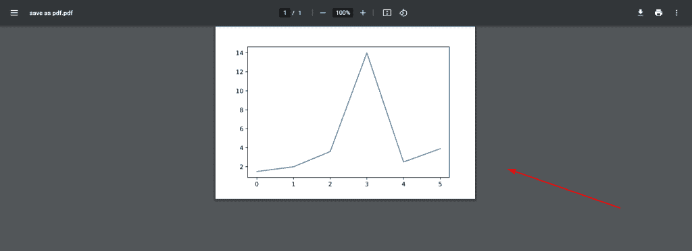

*” Output of Plot save as a PDF file “*

阅读 [Python 使用 Matplotlib 绘制多行](https://pythonguides.com/python-plot-multiple-lines/)

## Matplotlib savefig pdf dpi

**“dpi”**参数决定每英寸的点数。点的值以像素为单位定义。

**语法如下:**

```py
matplotlib.pyplot.savefig(fname, dpi=None)
```

**使用的参数定义如下:**

*   **fname:** 文件名或位置。
*   **dpi:** 指定绘图的质量。

**让我们看一个用 dpi 保存绘图的例子:**

```py
**# Import Library**

import matplotlib.pyplot as plt
import numpy as np

**# Define Data**

x = np.arange(0, 12, 0.2)
y = np.sin(x)

**# Plot figure**

plt.plot(x, y)

**# Save as pdf**

plt.savefig('save as dpi .pdf', dpi=120, format='pdf', bbox_inches='tight')

**# Generate Plot**

plt.show()
```

这里，我们将 `dpi` 参数传递给 `savefig()` 方法，并将其值设置为 120。


*” Output of PDF with dpi “*

阅读[什么是 matplotlib 内联](https://pythonguides.com/what-is-matplotlib-inline/)

## Matplotlib 保存 pdf 透明背景

在这里，您将学习如何将文件保存为具有透明背景的 pdf。你必须使用一个 `savefig()` 方法将一个绘图保存为 pdf 文件，并传递一个参数**透明**并将其值设置为**真**。

**举例:**

绘图有绿色背景，你必须把它保存为一个没有透明参数的 pdf 文件(T2)。

```py
**# Import Library**

import matplotlib.pyplot as plt

**# Define Data**

student = [10, 5, 3, 2, 4]
weight = [35, 25, 20, 50, 43]

**# Define background color**

ax = plt.figure()
ax.set_facecolor('green')

**# Plot Graph**

plt.bar(weight,student) 

**# Define axes label** 
plt.xlabel("Weight of the students")
plt.ylabel("Number of students")

**# Save as pdf** 
plt.savefig('save pdf without transparent argument.pdf')

**# Display Graph** 
plt.show() 
```

在上面的例子中，我们绘制了一个条形图，并通过使用 `savefig()` 方法将其保存在系统本地内存中。

为了向您展示不同之处，我们将背景颜色设置为绿色。


*” Pdf without Transparent argument “*

**举例:**

绘图有绿色背景，你必须保存带有透明 T2 参数的 pdf 文件。

```py
**# Import Library**

import matplotlib.pyplot as plt

**# Define Data**

student = [10, 5, 3, 2, 4]
weight = [35, 25, 20, 50, 43]

**# Define background color**

ax = plt.figure()
ax.set_facecolor('green')

**# Plot Graph**

plt.bar(weight,student) 

**# Define axes label**

plt.xlabel("Weight of the students")
plt.ylabel("Number of students")

**# Save as pdf** 
plt.savefig('save pdf with transparent argument.pdf',transparent = True)

**# Display Graph**

plt.show() 
```

这里我们将**透明**作为参数传递给 `savefig()` 方法，并将其值设置为 `True` 。

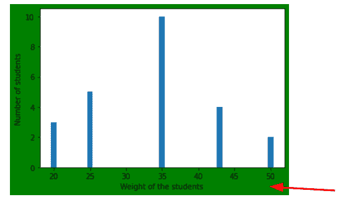

*” Output on user screen “*

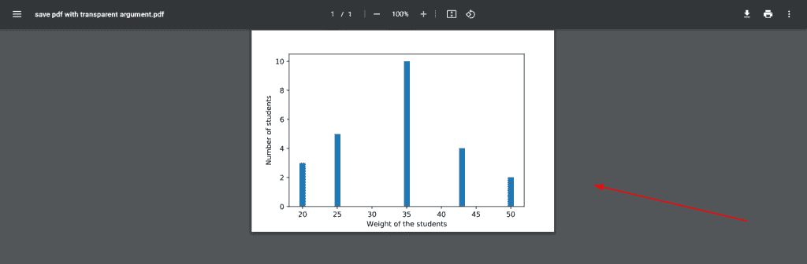

*” Output as PDF file with transparent background “*

阅读 [Matplotlib 绘图条形图](https://pythonguides.com/matplotlib-plot-bar-chart/)

## Matplotlib 将图形保存为 pdf

在这里，我们将学习如何将条形图保存为 pdf 文件。为此，首先，你必须绘制条形图，然后将其保存为 pdf 格式。

**语法如下:**

```py
**# Plot graph**

matplotlib.pyplot.bar(x,y)

**# Save as pdf**

matplotlib.pyplot.savefig(fname)
```

**让我们看一个与保存为 pdf 文件的条形图相关的例子:**

```py
**# Import Library**

import matplotlib.pyplot as plt
import numpy as np

**# Define Data**

subjects = ['MATHS', 'SCIENCE', 'ENGLISH', 'USA ENGLISH', 'SOCIAL-SCIENCE']

data = [20, 7, 31, 25, 12]

**# Creating plot**

plt.bar(subjects, data)

**# save as pdf**

plt.savefig('save graph as pdf.pdf')

**# show plot** 
plt.show()
```

在上面的例子中，我们使用 `plt.bar()` 方法绘制条形图，然后使用 `plt.savefig()` 方法将条形图保存为 pdf 文件。所以我们将扩展设置为**。pdf** 。

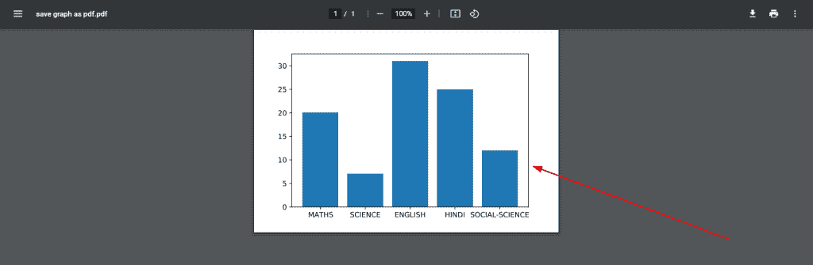

*” Output of graph save as PDF file “*

阅读 [Matplotlib 支线剧情教程](https://pythonguides.com/matplotlib-subplot-tutorial/)

## Matplotlib 将子图保存为 pdf

这里我们将讨论如何将支线剧情保存到 pdf 文件中。只需使用 `savefig()` 方法，就可以将它保存在一个文件中。注意一件事，你必须通过**。pdf** 作为文件名的扩展名。

**我们来看一个例子:**

```py
**# Importing Libraries**

import numpy as np
import matplotlib.pyplot as plt

**# Define Data**

x1= [0, 1, 2, 3, 4, 5]
y1= [0, 1.5, 2.3, 6.5, 15, 2.6]

x2= [2, 4, 6, 8]
y2= [3, 6, 9, 12]

x3= [2.3, 5.6, 4.6, 9.36, 5.6]
y3= [10, 5, 4, 6, 2]

x4= [7, 8, 15]
y4= [6, 12, 18]

fig, ax = plt.subplots(2, 2)

**# Set title**

ax[0, 0].set_title("Plot 1")
ax[0, 1].set_title("Plot 2")
ax[1, 0].set_title("Plot 3")
ax[1, 1].set_title("Plot 4")

**# Plot graph**

ax[0, 0].plot(x1, y1)
ax[0, 1].plot(x2, y2)
ax[1, 0].plot(x3, y3)
ax[1, 1].plot(x4,y4)

**# Save as pdf**

plt.savefig('save subplot as pdf.pdf')

**# Display Subplot**

fig.tight_layout()
plt.show()
```

*   在上面的例子中，我们导入了重要的库，如 `matplotlib.pyplot` 和 `numpy` 。
*   之后，我们定义在图形区域绘制支线图的数据。
*   然后我们使用 `set_title()` 方法为每个子情节设置不同的标题。
*   通过使用 `savefig()` 方法，我们通过传递扩展名**将支线剧情保存在 pdf 文件中。pdf** 到文件名。
*   最后，我们使用 `tight_layout()` 方法自动调整支线剧情，使用 `show()` 方法在用户界面上生成支线剧情。


*” Subplots in Pdf File “*

读取 [Matplotlib 最佳拟合线](https://pythonguides.com/matplotlib-best-fit-line/)

## Matplotlib savefig pdf 切断

当我们将绘图保存到 pdf 文件中时，我们会得到一个额外的边框或空间。

如果你想去掉多余的空格，在 `savefig()` 方法中传递 `bbox_inches` 参数，并将其值设置为**‘紧’**。

让我们来看看例子:

**举例:当我们正常保存一个图形到 pdf 文件**

**代码:**

```py
**# Import Library**

import matplotlib.pyplot as plt
import numpy as np

**# Define Data**

subjects = ['MATHS', 'SCIENCE', 'ENGLISH', 'HINDI', 'SOCIAL-SCIENCE']

data = [20, 7, 31, 25, 12]

**# Creating plot**

plt.pie(data, labels = subjects)

**# save as pdf**

plt.savefig('save as pdf without cutoff.pdf')

**# show plot**

plt.show()
```

在上面的例子中，我们通过使用 `plt.pie()` 方法绘制饼图，然后通过使用 `plt.savefig()` 方法将该图保存为 pdf 文件。

**输出:**

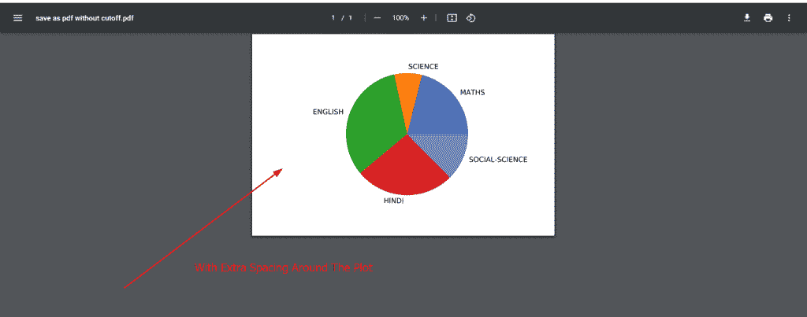

*” With extra spacing around the plot “*

**示例:当我们将绘图保存为 pdf 并删除多余的间距时**

**代码:**

```py
**# Import Library** 
import matplotlib.pyplot as plt
import numpy as np

**# Define Data** 
subjects = ['MATHS', 'SCIENCE', 'ENGLISH', 'HINDI', 'SOCIAL-SCIENCE']

data = [20, 7, 31, 25, 12]

**# Creating plot**

plt.pie(data, labels = subjects)

**# save as pdf**

plt.savefig('save as pdf with cutoff.pdf', bbox_inches='tight')

**# show plot** 
plt.show()
```

在上面的例子中，我们通过使用 `plt.pie()` 方法绘制饼图，然后通过使用 `plt.savefig()` 方法将该图保存为 pdf 文件。

我们将 `bbox_inches` 作为参数传递，并将它的值设置为**‘紧’**以切断绘图。

**输出:**


*” Cut off of plot “*

**结论:**当我们在 savefig()方法中使用 bbox_inches 作为参数时，我们就脱离了绘图。

读取[Matplotlib subplots _ adjust](https://pythonguides.com/matplotlib-subplots_adjust/)

## Matplotlib 保存 pdf 文件

在 matplotlib 中，可以使用 `PdfPages` 类的 `savefig()` 方法将生成的绘图保存为 PDF 文件。

首先，您必须导入 `matplotlib` 库。

**语法如下:**

```py
from matplotlib.backends.backend_pdf import PdfPages 
```

接下来，您必须实现 PdfPages

**语法如下:**

```py
PdfPages(filename = None, keep_empty = True, metadata = None)
```

**上述使用的参数如下:**

*   **文件名:**指定要保存的文件的名称和位置。
*   **keep_empty:** 取布尔值。如果为 false，则自动删除空的 PDF 文件。
*   **元数据:**以字典的形式取数据。它包含标题、作者、主题、关键词等信息。

最后，PdfPages 创建一个类的对象。

**以下是类对象使用的主要函数:**

*   **get_pagecount():** 该方法返回 pdf 文件的页数。
*   **close():** 该方法用于关闭对象。
*   **savefig():** 该方法用于将图形保存到 pdf 文件中。

**注:**指定格式。因为你的主要目标是 pdf，所以使用**。pdf** 作为扩展。

**让我们看一个例子来更好地理解:**

```py
**# Import Libraries**

from matplotlib.backends.backend_pdf import PdfPages
import numpy as np
import matplotlib.pyplot as plt

**# Define Data**

X = np.arange(20)
Y = X**2

**# PdfPages method** 
pp = PdfPages('save as pdf file in matplotlib.pdf')

**# Plot graph**

plt.plot(X,Y)

**# Object of class** 
pp.savefig()  

**# Close object**

pp.close()
```

*   在上面的例子中，我们首先导入 `PdfPages` 库。
*   `PdfPages()` 方法用于将绘图保存为 pdf。
*   接下来，我们定义用于绘图的数据，并使用 `plt.plot()` 方法来绘制图形。
*   然后我们定义 `savefig()` 和 `close()` 作为类的对象

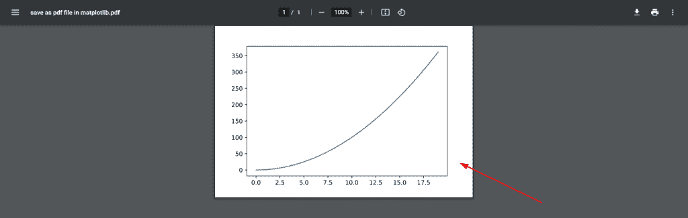

*” PdfPages() “*

读取 [Matplotlib 日志日志图](https://pythonguides.com/matplotlib-log-log-plot/)

## Matplotlib savefig pdf 多页

如果你想在一个文件中保存多个图，你必须使用 **PdfPages 类**的 `savefig()` 方法。

**让我们看一个多页 pdf 的例子:**

```py
**# Import Library**

from matplotlib.backends.backend_pdf import PdfPages
import numpy as np
import matplotlib.pyplot as plt

**# Define Data**

x = np.arange(10)
y1 = np.sin(x)
y2 = np.cos(x)
y3 = np.tan(x)

**# PdfPages()**

pdf = PdfPages('hi.pdf')

**# Create function**

def multiple_plot(X,Y):
    plt.figure()
    plt.clf()
    plt.plot(X,Y)
    plt.xlabel('x axis')
    plt.ylabel('y axis')
    pdf.savefig()

**# call function**

multiple_plot(x,y1)
multiple_plot(x,y2)
multiple_plot(x,y3)

**# class function**

pdf.close()
```

*   在上面的例子中，首先我们导入重要的库 `PdfPages` 、 `numpy` 和 `matplotlib.pyplot` 。
*   之后，我们定义用于绘图的数据，并通过使用 `PdfPages()` 方法定义文件名并设置**。pdf** 作为文件的扩展名。
*   我们创建用户定义函数名为 `multiple_plot()` ，在这里我们定义了类对象的 `plot()` 方法 `xlabel()` ， `ylabel()` 方法和 `savefig()` 方法。
*   然后我们调用用户自定义函数来绘制多幅图以及类对象的 `close()` 方法。


*” Output of Page 1 out of Page 3 “*


*” Output of Page 2 out Page 3 “*

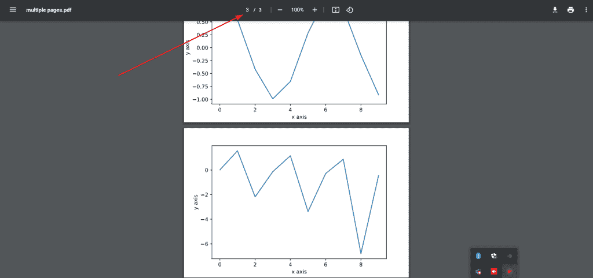

*” Output of Page 3 Out of Page 3 “*

这里，我们将三个不同的图保存在一个 pdf 文件中，而不是三个单独的文件中。

读取 [Matplotlib plot_date](https://pythonguides.com/matplotlib-plot-date/)

## Matplotlib 将表格另存为 pdf

如果你想在 matplotlib 中创建一个表格并保存为 pdf 文件。您必须执行以下步骤:

*   导入 `PdfPages` 、 **matplotlib.pyplot、**和 `numpy` 库。
*   定义**列名**和**数据**。
*   然后使用 `plt.subplot()` 方法设置 figsize，并将**轴设置为 off** 使轴不可见。
*   接下来使用 `plt.table()` 方法绘制表格并传递 `cellText` 、 `colLabels` 、 `loc` 和 `colLoc` 作为参数，并分别设置其值为 **data、** `col_names` 、 `center` 和 `right` 。
*   然后使用 `PdfPages()` 方法，传递文件的位置，保存为 Pdf。
*   然后在最后调用类对象的 `savefig()` 和 `close()` 方法。

**举例:**

```py
**# Import Libraries**

import numpy as np
import matplotlib.pyplot as plt
from matplotlib.backends.backend_pdf import PdfPages

**# Define Data**

col_names = ["Col-1", "Col-2", "Col-3", "Col-4", "Col-5", "Col-6"]
data = np.random.randint(100, size=(30,6))

**# Plot table**

fig, ax = plt.subplots(1, figsize=(10,10))
ax.axis('off')
table = plt.table(cellText=data, colLabels=col_names,loc='center',colLoc='right')

**# save as Pdf**

pdf = PdfPages('save table as pdf.pdf')
pdf.savefig()
pdf.close()
```

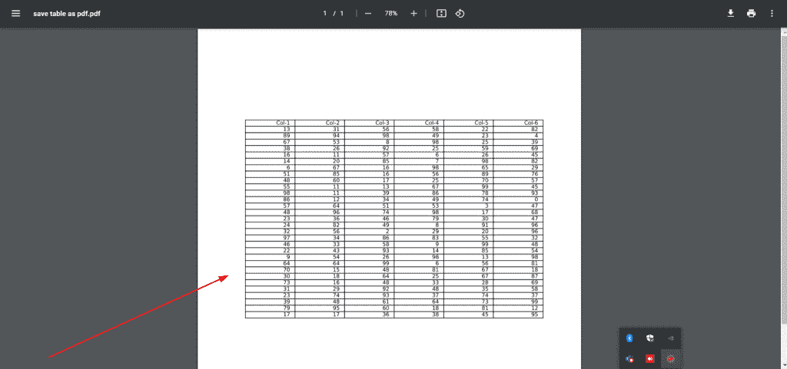

plt.table()

读取 [Matplotlib 虚线](https://pythonguides.com/matplotlib-dashed-line/)

## Matplotlib 将矢量保存为 pdf

首先，我们必须了解向量的含义，以及如何在 matplotlib 中绘制向量。

一个**矢量**是一个既有大小又有方向的物体。

从图形上看，我们可以用线段来表示矢量，线段的长度表示矢量的大小，箭头表示矢量的方向。

**在 matplotlib 中，绘制向量场有两种方法，描述如下:**

通过使用**颤()**方法我们可以绘制矢量:

```py
matplotlib.pyplot.quiver(X,Y,U,V,**kw)
```

**上面使用的参数如下:**

*   **X 和 Y:** 指定矢量的位置。
*   **U 和 V:** 指定矢量的方向。

通过使用 `streamplot()` 方法我们可以绘制矢量:

```py
matplotlib.pyplot.streamplot(X,Y,U,V,density=1,linewidth=none,color=None,**kw)
```

**上面使用的参数如下:**

*   **X 和 Y:** 指定 1D 阵列间隔网格。
*   **U 和 V:** 指定每个点的速度。
*   **密度:**指定图形每一区域的矢量数量。
*   **线宽:**代表厚度。

**让我们看一个 pdf 格式的矢量例子:**

```py
**# Import libraries** 
import numpy as np
import matplotlib.pyplot as plt

**# Vector location**

X = [7]
Y = [1]

**# Directional vectors**

U = [5] 
V = [3] 
 **
# Creating plot**

plt.quiver(X, Y, U, V)

**# Save as pdf**

plt.savefig('vector as pdf.pdf')

**# Show plot**

plt.show() 
```

*   在上面的例子中，我们首先导入 `matplotlib.pyplot` 和 `numpy` 库。
*   然后我们定义向量的位置和方向。
*   通过使用 **plt .颤()**我们绘制了一个矢量图，并使用 `plt.savefig()` 方法将生成的图形保存到一个 pdf 文件中。

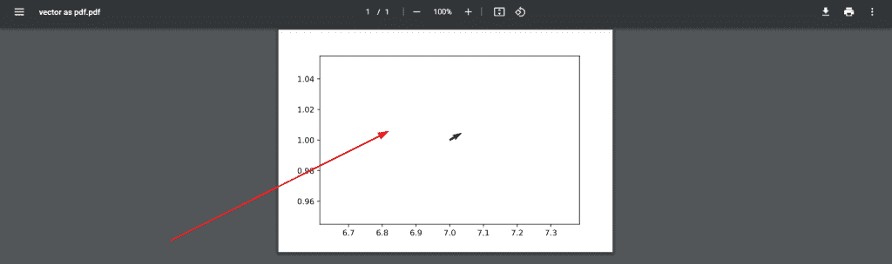

*” Save vector as Pdf “*

读取 [Matplotlib 散点标记](https://pythonguides.com/matplotlib-scatter-marker/)

## Matplotlib savefig pdf a4

如果你想在 a4 大小的纸上保存绘图，你必须将 `papertype` 设置为 `a4` 大小，并将其传递给 `savefig()` 方法。

**举例:**

```py
**# Import Library**

import matplotlib.pyplot as plt
import numpy as np

**# Define Data**

x = np.arange(0, 12, 0.2)
y = np.sin(x)

**# Plot figure**

plt.plot(x, y)

**# Save image** 

plt.savefig('save as pdf on a4 size paper.pdf', papertype='a4')

**# Generate Plot**

plt.show()
```

这里我们将 `papertype` 参数传递给 `savefig()` 方法，并将其值设置为 `a4` 。

**注意:**此 papertype 参数仅适用于版本早于 3.3 的编辑器，否则，您将看到如下警告:

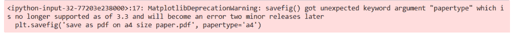

Warning

读取 [Matplotlib 标题字体大小](https://pythonguides.com/matplotlib-title-font-size/)

## Matplotlib save fig pdf empty

在这里，我们将讨论许多 matplotlib 初学者面临的一个非常普遍的问题。

**问题**是当用户在 matplotlib 中绘制图形并试图在本地系统中将其保存为 PDF 文件时，他们得到的是一个空文件。

**让我们看一个你发现这个问题的例子:**

```py
**# Import Library**

import matplotlib.pyplot as plt

**# Define Data**

x= [0, 1, 2, 3, 4, 5]
y= [1.5, 2, 3.6, 14, 2.5, 3.9]

**# Plot** 

plt.scatter(x,y)

**# Show plot**

plt.show() 

**# Save as pdf**

plt.savefig('save as pdf.pdf')
```

*   在上面的例子中，我们首先导入 `matplotlib.pyplot` 库。
*   在此之后，我们定义数据坐标并使用 `plt.scatter()` 方法绘制散点图。
*   在此之后，我们使用 `plt.show()` 方法在屏幕上可视化绘图。
*   最后，我们使用 `plt.savefig()` 方法将您的绘图保存为图像。

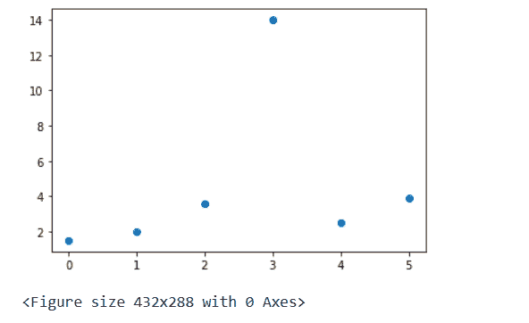

” Output on user screen “


” Output In Pdf File “

我们得到的不是 pdf 文件中的图，而是一个空的 Pdf。

**解决方案:**

现在我告诉你解决这个问题的方法。解决方法是，你得在 `plt.savefig()` 方法之后调用 `plt.show()` 方法。

**让我们来看一个解决方案代码:**

```py
**# Import Library**

import matplotlib.pyplot as plt

**# Define Data**

x= [0, 1, 2, 3, 4, 5]
y= [1.5, 2, 3.6, 14, 2.5, 3.9]

**# Plot** 

plt.scatter(x,y)

**# Save as pdf**

plt.savefig('Pdf file consist plot.pdf')

**# Show plot**

plt.show() 
```

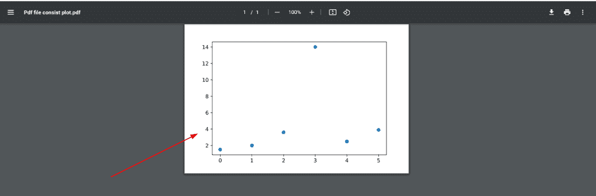

Solution

您可能会喜欢以下教程:

*   [Matplotlib 默认图形尺寸](https://pythonguides.com/matplotlib-default-figure-size/)
*   [Matplotlib savefig 空白图像](https://pythonguides.com/matplotlib-savefig-blank-image/)
*   [Matplotlib 另存为 png](https://pythonguides.com/matplotlib-save-as-png/)
*   [Matplotlib 两个 y 轴](https://pythonguides.com/matplotlib-two-y-axes/)

在本 Python 教程中，我们已经讨论了**“Matplotlib 另存为 pdf”**，并且我们还介绍了一些与之相关的例子。这些是我们在本教程中讨论过的以下主题。

*   Matplotlib 另存为 pdf
*   Matplotlib 将 fig 另存为 pdf
*   Matplotlib savefig pdf 示例
*   Matplotlib 保存图 pdf dpi
*   Matplotlib 保存 pdf 透明背景
*   Matplotlib 将图形保存为 pdf
*   Matplotlib 将子图保存到 pdf
*   Matplotlib savefig pdf 截断
*   Matplotlib save pdf file
*   Matplotlib 保存图 pdf 多页
*   Matplotlib 将表格另存为 pdf
*   Matplotlib savefig pdf a4
*   Matplotlib savefig pdf empty

[Bijay Kumar](https://pythonguides.com/author/fewlines4biju/)

Python 是美国最流行的语言之一。我从事 Python 工作已经有很长时间了，我在与 Tkinter、Pandas、NumPy、Turtle、Django、Matplotlib、Tensorflow、Scipy、Scikit-Learn 等各种库合作方面拥有专业知识。我有与美国、加拿大、英国、澳大利亚、新西兰等国家的各种客户合作的经验。查看我的个人资料。

[enjoysharepoint.com/](https://enjoysharepoint.com/)[](https://www.facebook.com/fewlines4biju "Facebook")[](https://www.linkedin.com/in/fewlines4biju/ "Linkedin")[](https://twitter.com/fewlines4biju "Twitter")