# Matplotlib 另存为 png

> 原文：<https://pythonguides.com/matplotlib-save-as-png/>

[](https://sharepointsky.teachable.com/p/python-and-machine-learning-training-course)

在本 [Python 教程](https://pythonguides.com/learn-python/)中，我们将讨论 **Matplotlib 在 Python 中另存为 png** 。这里我们将介绍使用 matplotlib 将图像保存为 png 的不同例子。我们还将讨论以下主题:

*   Matplotlib 如何另存为 png
*   Matplotlib 另存为 png
*   Matplotlib 另存为 png dpi
*   Matplotlib 图形为 png
*   Matplotlib 保存 png 透明背景
*   Matplotlib 保存 png 更改背景
*   Matplotlib 保存不带边框的 png
*   Matplotlib 将数组另存为 png
*   Matplotlib 将轴另存为 png
*   Matplotlib 将图形另存为 png 大小
*   Matplotlib 将图表另存为 png
*   Matplotlib 将图形保存为高分辨率的 png
*   Matplotlib 另存为 png edgecolor

如果您是 Matplotlib 的新手，请查看[什么是 Matplotlib 以及如何在 Python 中使用它](https://pythonguides.com/what-is-matplotlib/)以及[如何安装 matplotlib python](https://pythonguides.com/how-to-install-matplotlib-python/)

目录

[](#)

*   [Matplotlib 如何另存为 png](#Matplotlib_how_to_save_as_png "Matplotlib how to save as png")
*   [Matplotlib 另存为 png](#Matplotlib_save_as_png "Matplotlib save as png")
*   [Matplotlib 另存为 png dpi](#Matplotlib_save_as_png_dpi "Matplotlib save as png dpi")
*   [Matplotlib 图形为 png](#Matplotlib_graph_as_png "Matplotlib graph as png")
*   [Matplotlib 保存 png 透明背景](#Matplotlib_save_png_transparent_background "Matplotlib save png transparent background")
*   [Matplotlib 保存 png 更改背景](#Matplotlib_save_png_change_background "Matplotlib save png change background")
*   [Matplotlib 保存不带边框的 png](#Matplotlib_save_png_without_border "Matplotlib save png without border")
*   [Matplotlib 将数组保存为 png](#Matplotlib_save_array_as_png "Matplotlib save array as png")
*   [Matplotlib 将轴另存为 png](#Matplotlib_save_axis_as_png "Matplotlib save axis as png")
*   [Matplotlib 将图形保存为 png 大小](#Matplotlib_save_figure_as_png_size "Matplotlib save figure as png size")
*   [Matplotlib 将图表另存为 png](#Matplotlib_save_chart_as_png "Matplotlib save chart as png")
*   [Matplotlib 将图形保存为高分辨率 png](#Matplotlib_save_figure_as_png_with_high_resolution "Matplotlib save figure as png with high resolution")
*   [Matplotlib 另存为 png edgecolor](#Matplotlib_save_as_png_edgecolor "Matplotlib save as png edgecolor")

## Matplotlib 如何另存为 png

在本节中，我们将学习如何使用 matplotlib 库将绘图或图形保存为图像文件。首先，我们讨论一下**“png”**是什么意思:

> `PNG` 代表便携式网络图形

PNG 是一种压缩器，用于在不丢失图像细节的情况下将图像压缩成较小的尺寸。

**以下步骤用于将绘图或图形保存为 png，概述如下:**

*   **定义库:**导入将图像保存为 png 和定义数据所需的重要库(用于数据创建和操作:Numpy，用于数据可视化:来自 matplotlib 的 pyplot)。
*   **定义 X 和 Y:** 定义用于 X 轴和 Y 轴的数据值。
*   **创建一个情节:**通过使用**情节()**方法创建一个情节或者你可以使用任何你喜欢的方法。
*   **另存为 png:** 使用 `savefig()` 方法可以将图像保存到系统中。将文件的**扩展名**设置为**“png”**，因为你的主要目的是保存为 png。
*   **生成剧情:**通过调用 `show()` 函数，生成一个剧情给用户。

> **注意:**在 show()方法之前使用 savefig()方法**。**

## Matplotlib 另存为 png

为了将一个绘图或图表或图形保存为 png，我们使用了 `savefig()` 方法。此方法的目的是将图像保存到您的本地系统内存中。

**save fig()方法的语法如下:**

```py
matplotlib.pyplot.savefig(fname, dpi=None, facecolor='w', edgecolor='w', orientation='portrait', papertype=None, format=None, transparent=False, bbox_inches=None, pad_inches=0.1, frameon=None, metadata=None)
```

**使用的参数讨论如下:**

*   **fname:** 指定文件名或文件位置。
*   **dpi:** 指定图像质量(每英寸点数)。
*   **facecolor:** 根据您的选择指定图像的面颜色。默认情况下，是**【白色】**。
*   **边缘颜色:**根据您的选择指定绘图的边缘颜色。默认情况下，是**【白色】**。
*   **方向:**您可以将图像的方向设置为横向或纵向。
*   **papertype:** 指定纸张的类型，如“信件”、“法律”、“a0 到 a10”等。
*   **格式:**指定文件的扩展名，如**。png** 。
*   **透明:**使图像的背景透明。
*   **bbox_inches:** 指定要保存的图像部分。对于一个合适的安装套件，它需要**【拧紧】**。
*   **pand_inches:** 当 bbox_inches 为“紧”时，指定图像周围的填充。
*   **元数据:**指定要存储在图像元数据中的键/值对。获取**字典**数据类型中的数据。

**我们来看一个另存为 png 的例子:**

```py
**# Import Library**

import matplotlib.pyplot as plt

**# Define Data**

x= [1, 2, 3, 4, 5]
y= [2.5, 6.3, 12, 14, 2]

**# Plot** 

plt.plot(x,y,color='r')

**# Save image as png** 
plt.savefig('save as png.png')

**# Show image**

plt.show() 
```

*   在上面的例子中，首先我们导入 `matplotlib.pyplot` 库。之后，我们在 x 和 y 坐标中定义数据。
*   `plot()` 函数用于绘制图形。
*   一旦生成了绘图，我们使用 `savefig()` 方法将图形保存在我们的项目目录中。
*   之后使用 `show()` 方法来为用户生成一个绘图窗口。

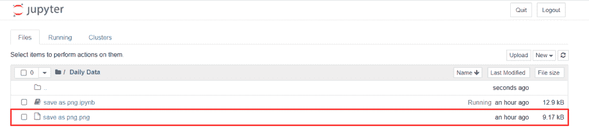

*” Project Directory Where Image Save”*

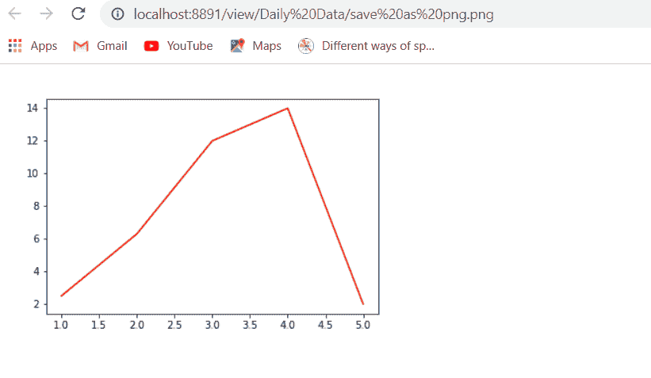

“The output of savefig() method”

阅读: [Matplotlib 绘制一条线](https://pythonguides.com/matplotlib-plot-a-line/)

## Matplotlib 另存为 png dpi

**“dpi”**参数决定点数。点的值以像素为单位定义。

**语法如下:**

```py
matplotlib.pyplot.savefig(fname, dpi=None)
```

**让我们看一个没有 dpi 的例子，这样我们就得到差异:**

```py
**# Import Library**

import matplotlib.pyplot as plt

**# Define Data** 
student = [3,2,0,5,9,1]
weight = [30,35,40,45,50,55]

**# Plot Graph**

plt.scatter(weight,student) 

**# Define axes label** 
plt.xlabel("Weight of the students")
plt.ylabel("Number of students")

**# Save image**

plt.savefig('save as png without dpi.png')

**# Display Graph**

plt.show() 
```

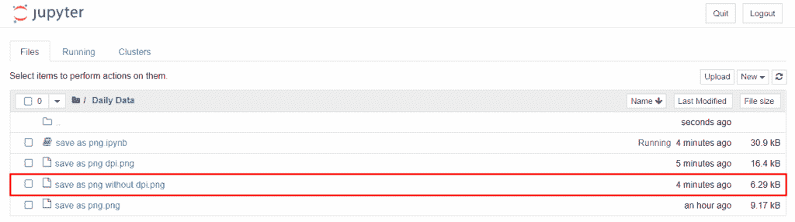

*” Project Directory”*

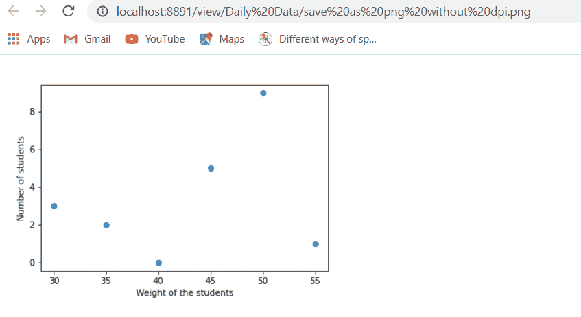

*” Image Without DPI”*

**让我们看一个用 dpi 保存图像的例子:**

```py
**# Import Library**

import matplotlib.pyplot as plt

**# Define Data** 
student = [3,2,0,5,9,1]
weight = [30,35,40,45,50,55]

**# Plot Graph**

plt.scatter(weight,student) 

**# Define axes label** 
plt.xlabel("Weight of the students")
plt.ylabel("Number of students")

**# Save image** 
plt.savefig('save as png dpi.png', dpi = 150)

**# Display Graph**

plt.show() 
```

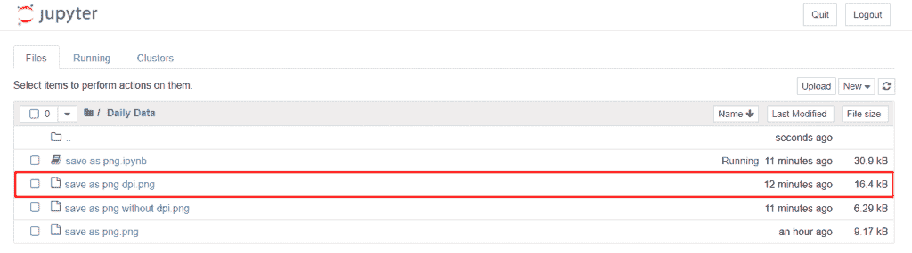

*” Directory of Image”*

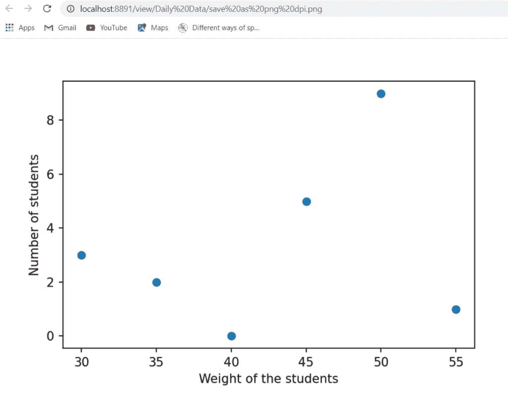

*” Image with DPI”*

阅读:[什么是 matplotlib 内联](https://pythonguides.com/what-is-matplotlib-inline/)

## Matplotlib 图形为 png

在本节中，我们将学习如何将条形图保存为 png。为此，首先，你必须绘制条形图，然后将其保存为 png 格式。

**语法如下:**

```py
**# Plot graph**
matplotlib.pyplot.bar(x,y)

**# Save as png**
matplotlib.pyplot.savefig(fname)
```

**我们来看一个与此相关的例子:**

```py
**# Import Library**

import matplotlib.pyplot as plt

**# Define Data**

students = [5, 6, 2, 3]
activities= ["Joging", "Gyming", "Swimming", "Shopping"]

**# Plot bar chart**

plt.bar( activities, students, color= 'm')

**# Save image** 
plt.savefig('save graph as png.png', dpi =100)

**# Display chart**

plt.show()
```

在上面，我们使用 `plt.bar()` 方法绘制条形图，然后使用 `plt.savefig()` 方法将图像保存为 png，我们还将其 `dpi` 值设置为 `100` 。

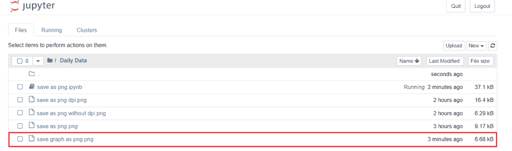

*“Directory where image save”*

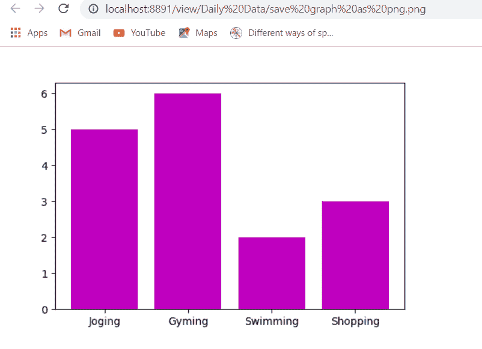

*“Save bar chart as a png with DPI 100”*

阅读: [Python 使用 Matplotlib 绘制多条线](https://pythonguides.com/python-plot-multiple-lines/)

## Matplotlib 保存 png 透明背景

在这里，我们将学习如何保存透明背景的图像。我们将使用一个 `savefig()` 函数将绘图保存为图像，并将**透明**作为参数传递，将其值设置为**真**。

**示例:**图有**粉色**背景色，我们保存的图像**没有透明**参数。

```py
**# Import Library**

import matplotlib.pyplot as plt
import numpy as np
 **# Define Data** 
x = np.arange(0, 5, 0.2)
y = np.cos(x)

**# Plot figure and set background to pink**

ax = plt.figure()
ax.set_facecolor('pink')
plt.plot(x, y)

**# Save image** 

plt.savefig('save png without transparent background.png')

**# Generate Plot**

plt.show()
```

*   在上面的例子中，我们绘制了一个图形，并使用 `savefig()` 方法保存它。
*   我们也设置**背景**颜色为**粉色**。

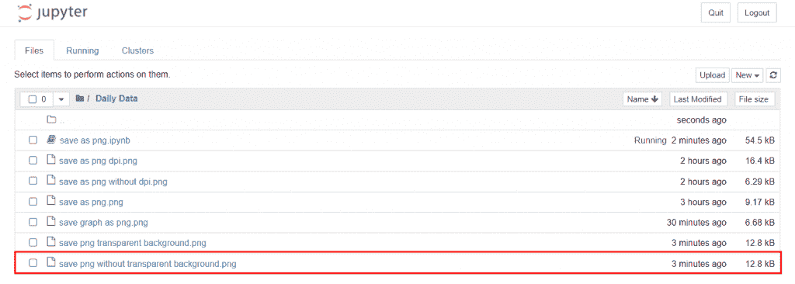

*“Directory”*

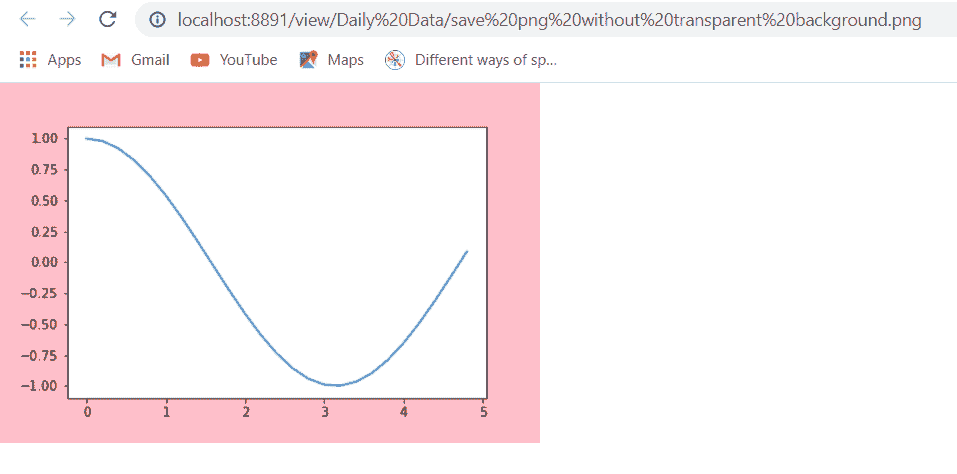

*“Image without Transparent argument or savefig(transparent = False)”*

**示例:**绘图有**粉色**背景色，我们保存图像**有透明**参数。

```py
**# Import Library** 
import matplotlib.pyplot as plt
import numpy as np

**# Define Data**

x = np.arange(0, 5, 0.2)
y = np.cos(x)

**# Plot figure and set background to pink**

ax = plt.figure()
ax.set_facecolor('pink')
plt.plot(x, y)

**# Save image** 
plt.savefig('save png transparent background.png', transparent = True)

**# Generate Plot**

plt.show()
```

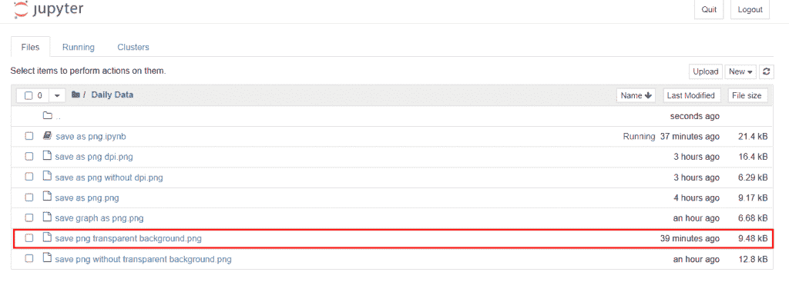

*“Directory”*

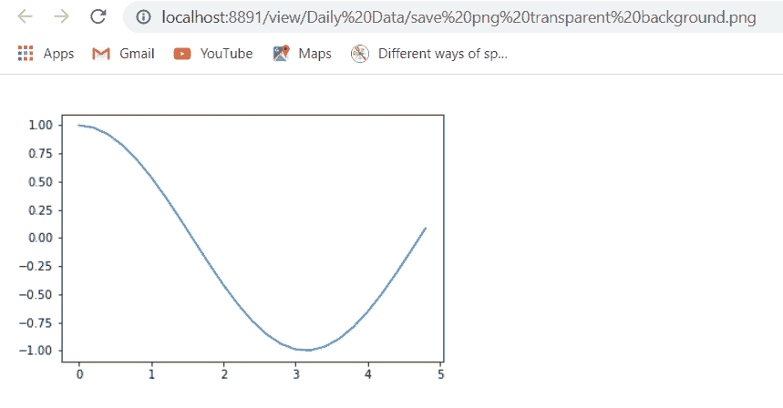

*” Image with Transparent argument or savefig(Transparent=True)”*

阅读: [Matplotlib 绘图条形图](https://pythonguides.com/matplotlib-plot-bar-chart/)

## Matplotlib 保存 png 更改背景

这里我们学习如何改变图面的颜色。默认情况下，脸部颜色为**【白色】**。

我们可以通过将**的** facecolor 参数传递给**的 savefig()** 方法来改变它。

**改变 facecolor 的语法如下:**

```py
matplotlib.pyplot.savefig(fname, facecolor = None)
```

**举例:**

```py
**# Import Library**

import matplotlib.pyplot as plt
import numpy as np

**# Define Data** 
x = [1, 2, 3, 4, 5]
y = [1, 2, 3, 4, 5]

**# Plot**

plt.plot(x, y)

**# Save image** 

plt.savefig('save png change background.png', facecolor ='orange')

**# Generate Plot**

plt.show() 
```

在上面的例子中，我们使用 `savefig()` 方法将一个图形保存为图像，并将 `facecolor` 参数传递给它，并将其值设置为**“橙色”**。

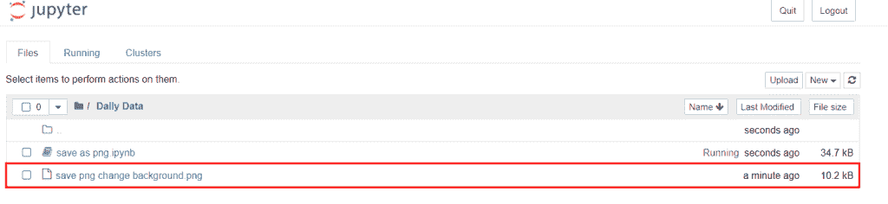

*“Directory where Image save”*

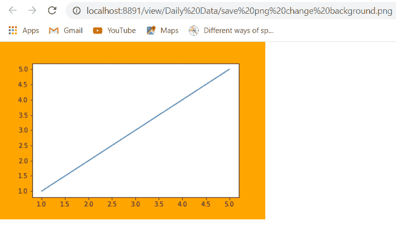

*” Change facecolor or background color”*

阅读: [Matplotlib 支线剧情教程](https://pythonguides.com/matplotlib-subplot-tutorial/)

## Matplotlib 保存不带边框的 png

当我们将 `bbox_inches` 参数传递给 `savefig()` 方法并将其值设置为“**tight”**时，它会移除其边框。

基本上，它尽可能地从图形中裁剪出额外的边框。

**去除多余边框的语法:**

```py
matplotlib.pyplot.savefig(fname, bbox_inches='tight')
```

**我们来看一个无边框另存为 png 的例子:**

```py
**# Import Library**

import matplotlib.pyplot as plt
import numpy as np

**# Define Data** x = [1, 2, 3, 4, 5]
y = [1, 2, 3, 4, 5]

**# Plot**

plt.scatter(x, y)

**# Save image** 

plt.savefig('save png without border.png', facecolor ='green', bbox_inches='tight')

**# Generate Plot**

plt.show() 
```

在上面的例子中，我们将 `facecolor` 设置为绿色，并且我们还使用了 `bbox_inches` 参数来剪切其额外的边框。

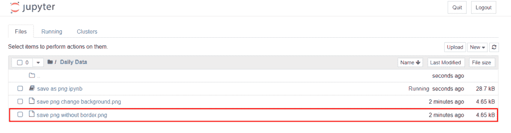

*“Directory”*

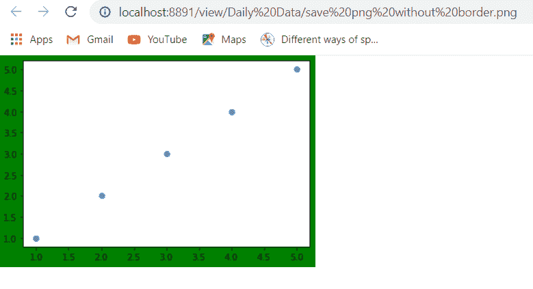

plt.savefig(bbox_inches=’tight’)

阅读: [Matplotlib 最佳拟合线](https://pythonguides.com/matplotlib-best-fit-line/)

## Matplotlib 将数组保存为 png

为了将数组保存为 png 图像，我们使用了 `imsave()` 方法。

**语法如下:**

```py
mtplotlib.pyplot.imsave(fname, array)
```

**举例:**

```py
**# Import Library** import matplotlib.pyplot as plt
import numpy as np

**# Define Data** 
x = np.arange(0, 737280, 1, np.uint8)
array = np.reshape(array, (1024, 720))

**# Save image** 
plt.imsave('save array as png.png', array)

**# Show plot**

plt.show()
```

在上面的例子中，我们使用 `imsave()` 方法将数组保存为图像。

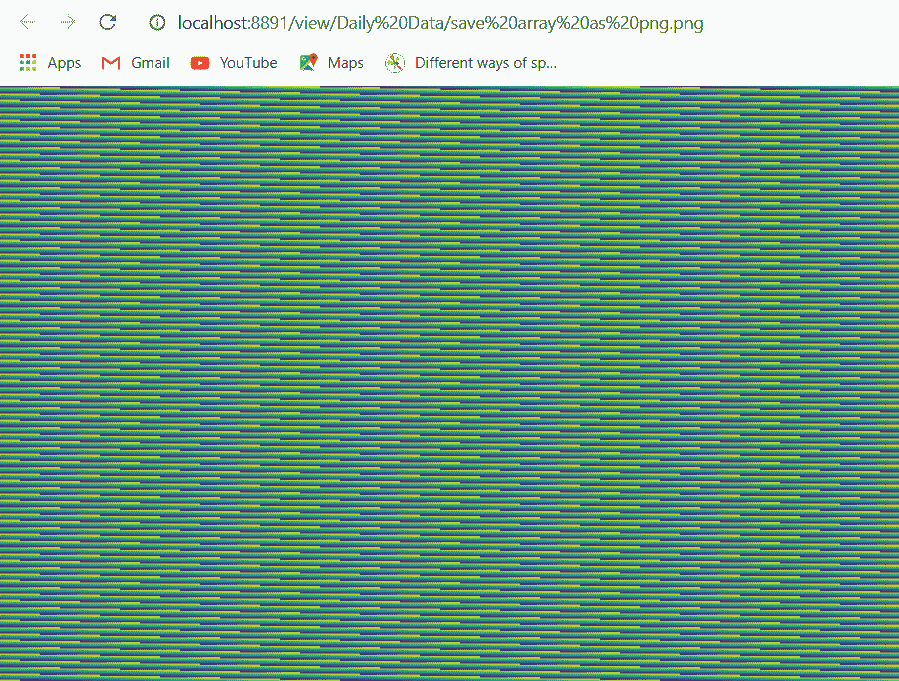

*“save array as png”*

阅读: [Matplotlib 支线剧情 _adjust](https://pythonguides.com/matplotlib-subplots_adjust/)

## Matplotlib 将轴另存为 png

在这里，我们可以看到如何将轴保存为 png。

**我们来看一个例子:**

```py
**# Import Library** 
import matplotlib.pyplot as plt

**# Define Data**

x = [1, 2, 3, 4, 5]
y = [1, 2, 15, 4, 5]

**# Define axes**

plt.xlabel('x-axis')
plt.ylabel('y-axis')

**# Save image** 

plt.savefig('matplotlib save axis as png.png', bbox_inches='tight')

**# Generate Plot**

plt.show() 
```

在上面的例子中，我们只画了图表的轴。

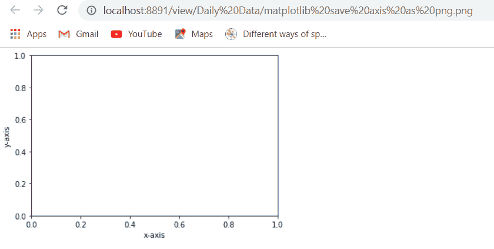

*“Save axis as png”*

阅读: [Matplotlib plot_date](https://pythonguides.com/matplotlib-plot-date/)

## Matplotlib 将图形保存为 png 大小

通过使用 `dpi` 参数，我们可以根据您的选择增加和减少图形的大小。

**语法如下:**

```py
matplotlib.pyplot.savefig(fname, dpi=None)
```

**我们来看一个例子:**

```py
**# Import Library** 
import matplotlib.pyplot as plt
import numpy as np

**# Define Data** 
x = np.arange(0, 5, 0.2)
y = np.sin(x)

**# Plot figure** 
plt.plot(x, y)

**# Save image** 

plt.savefig('save figure as png size.png', dpi=30)

**# Generate Plot**

plt.show()
```

这里我们将 `dpi` 参数的大小设置为 30，并将其传递给 `savefig()` 方法。

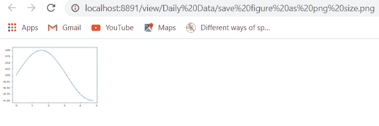

*“The size of the image decreased”*

阅读: [Matplotlib 虚线](https://pythonguides.com/matplotlib-dashed-line/)

## Matplotlib 将图表另存为 png

在这里，我们学习如何将饼图保存为图像。首先，你必须知道如何创建一个饼图。

**绘制饼图并保存为图像的语法如下:**

```py
**# Pie chart**
matplotlib.pyplot.pie(data, explode=None, labels=None, colors=None, autopct=None, shadow=False)

**# Save Image**
matplotlib.pyplot.savefig(fname)
```

**上面使用的参数定义为:**

*   **数据:**指定要绘制的数据值数组。
*   **标签:**指定每个楔形的标签。
*   **颜色:**指定楔形的颜色。
*   **autopct:** 用于给楔形标注数值。
*   **阴影:**用于创建阴影。
*   **文件名:**文件名或路径

**举例:**

```py
**# Import Library**

import matplotlib.pyplot as plt
import numpy as np

**# Define Data**

subjects = ['MATHS', 'SCIENCE', 'ENGLISH', 'HINDI', 'SOCIAL-SCIENCE']

data = [20, 7, 31, 25, 12]

**# Creating plot**

plt.pie(data, labels = subjects)

**# save as an image** 
plt.savefig('save chart as png.png')

**# show plot**

plt.show()
```

*   在上面的例子中，我们首先导入了 `matplotlib.pyplot` 和 `numpy` 库。
*   之后，我们定义数据和标签，并使用 `pie()` 方法绘制一个饼图。
*   然后我们使用 `plt.savefig()` 方法将饼状图保存为 `png` 格式的图像。
*   最后，我们使用 `show()` 方法来可视化图表。

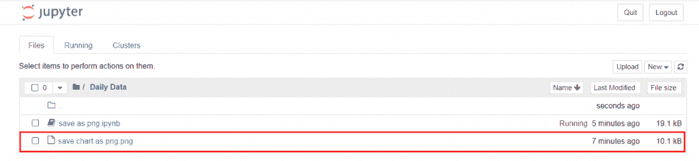

*“Directory”*

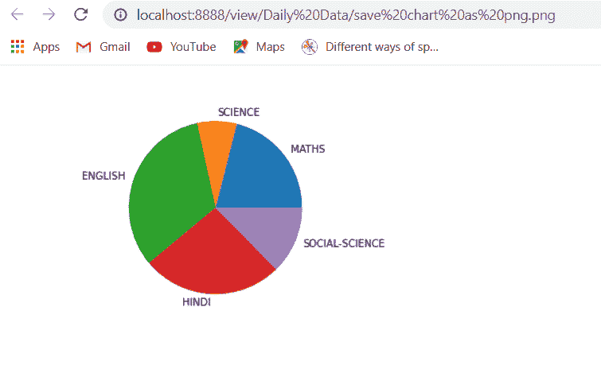

*“Save Pie Chart as an image”*

阅读: [Matplotlib 散点图标记](https://pythonguides.com/matplotlib-scatter-marker/)

## Matplotlib 将图形保存为高分辨率 png

为了保存高分辨率的图片，你必须在 `savefig()` 方法中传递一个 `dpi` 参数，然后**增加**它的值。

**让我们来看一个高分辨率图形的例子:**

```py
**# Import Library** 
import matplotlib.pyplot as plt

**# Define Data** 

student = [15, 12, 10, 5, 2]
marks = [50, 45, 30, 22, 15]

**# Plot Graph**

plt.bar(marks,student) 

**# Define axes label**

plt.xlabel("Marks of the students")
plt.ylabel("Number of students")

**# Save image**

plt.savefig('save figure as png with high resolution.png', dpi=200)

**# Display Graph** 
plt.show() 
```

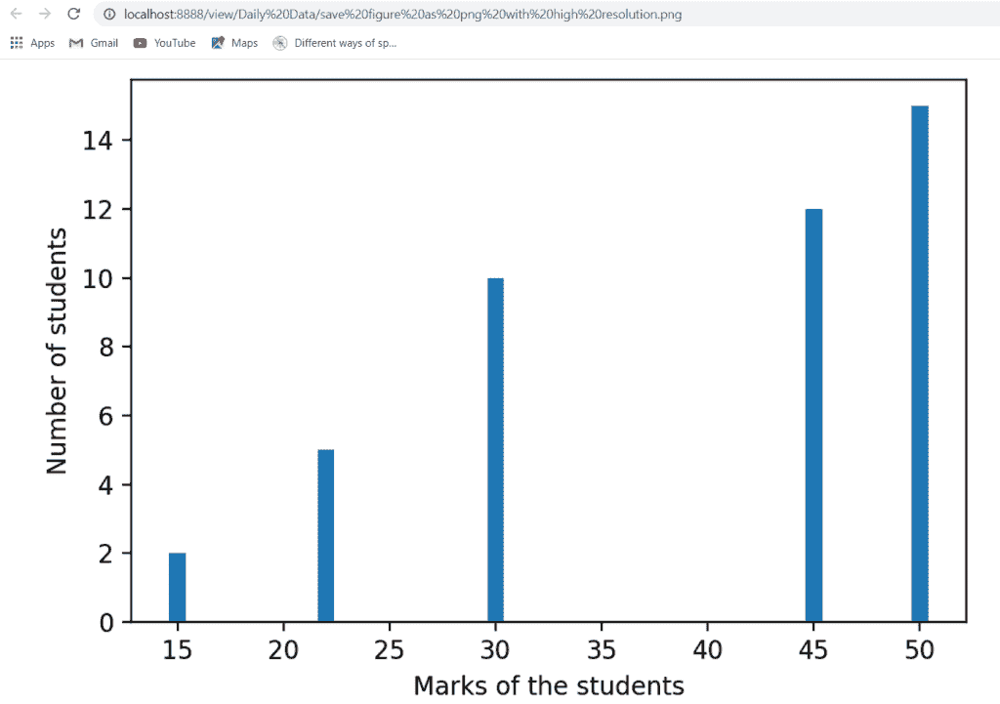

“High-Resolution *Figure with DPI = 200″*

阅读: [Matplotlib 旋转刻度标签](https://pythonguides.com/matplotlib-rotate-tick-labels/)

## Matplotlib 另存为 png edgecolor

这里我们学习如何在 matplotlib 中用 edgecolor 保存图形。

程序员有时会发现很难保存带有边缘颜色的图像，因为默认情况下**线宽**被设置为 `0.0` 。

所以，首先要保存一个带边缘颜色的图像，你必须改变**线宽**或者我们可以说你必须**增加线宽大小**。

**改变线宽并保存带有边缘颜色的图像的语法如下:**

```py
**# Linewidth** 
matplotlib.pyplot.figure(linewidth= 0.0)

**# Save iamge**
matplotlib.pyplot.savefig(fname, edgecolor=Name) 
```

**让我们看一个例子来更好地理解这个概念:**

```py
**# Import Library**

import matplotlib.pyplot as plt
import numpy as np

**# Define Data` **and linewidth`

plt.figure(linewidth=15)

x = np.arange(0, 15, 0.2)
y = np.sin(x)

**# Plot figure**

plt.plot(x, y)

**# Save image** 

plt.savefig('save as png edgecolor.png', edgecolor='blue', facecolor='yellow')

**# Generate Plot**

plt.show()
```

*   在上面的例子中，我们首先将图形的**线宽**设置为 `15` ，然后定义数据坐标。
*   然后，我们使用， `plt.plot()` 方法绘制图表，之后，我们使用 `plt.savefig()` 方法将绘图保存为图像。
*   这里我们传递参数 `edgecolor` 和 `facecolor` ，并将它们的值分别设置为**蓝色**和**黄色**。

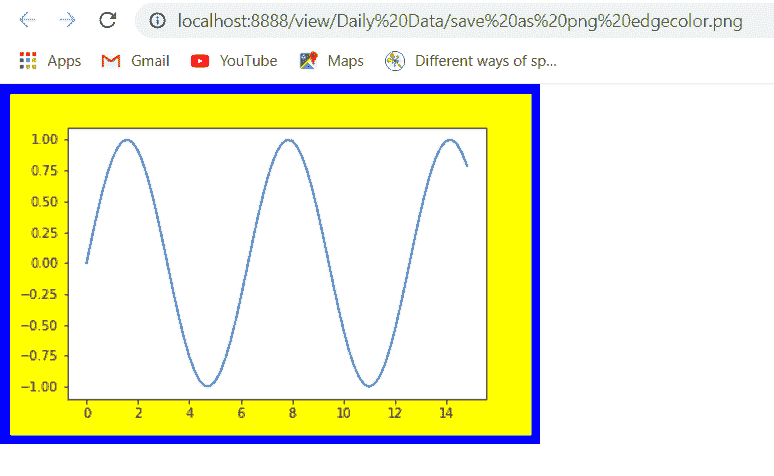

*“Save image with edgecolor”*

你可能也喜欢阅读下面的 Matplotlib 教程。

*   [Matplotlib 条形图标签](https://pythonguides.com/matplotlib-bar-chart-labels/)
*   [Matplotlib 绘图误差线](https://pythonguides.com/matplotlib-plot-error-bars/)
*   [Matplotlib fill_between](https://pythonguides.com/matplotlib-fill_between/)

在本 Python 教程中，我们已经讨论了**“Matplotlib 另存为 png”**，并且我们还讨论了一些与之相关的例子。这些是我们在本教程中讨论过的以下主题。

*   Matplotlib 如何另存为 png
*   Matplotlib 另存为 png
*   Matplotlib 另存为 png dpi
*   Matplotlib 图形为 png
*   Matplotlib 保存 png 透明背景
*   Matplotlib 保存 png 更改背景
*   Matplotlib 保存不带边框的 png
*   Matplotlib 将数组另存为 png
*   Matplotlib 将轴另存为 png
*   Matplotlib 将图形另存为 png 大小
*   Matplotlib 将图表另存为 png
*   Matplotlib 将图形保存为高分辨率的 png
*   Matplotlib 另存为 png edgecolor

[Bijay Kumar](https://pythonguides.com/author/fewlines4biju/)

Python 是美国最流行的语言之一。我从事 Python 工作已经有很长时间了，我在与 Tkinter、Pandas、NumPy、Turtle、Django、Matplotlib、Tensorflow、Scipy、Scikit-Learn 等各种库合作方面拥有专业知识。我有与美国、加拿大、英国、澳大利亚、新西兰等国家的各种客户合作的经验。查看我的个人资料。

[enjoysharepoint.com/](https://enjoysharepoint.com/)[](https://www.facebook.com/fewlines4biju "Facebook")[](https://www.linkedin.com/in/fewlines4biju/ "Linkedin")[](https://twitter.com/fewlines4biju "Twitter")