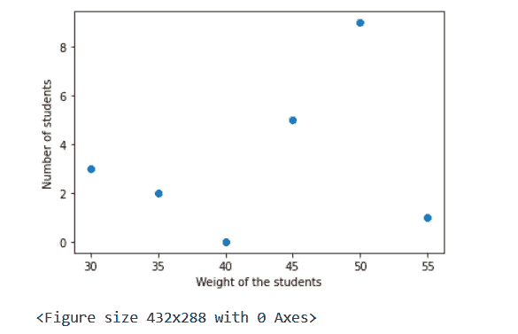
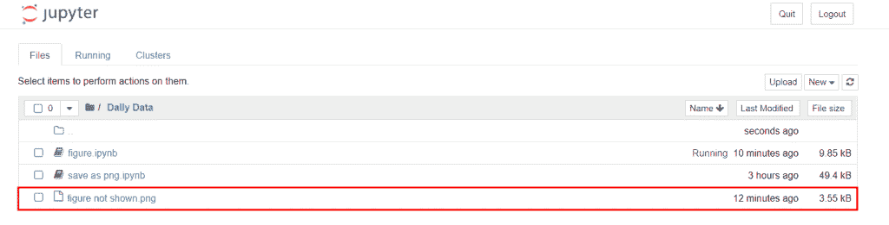
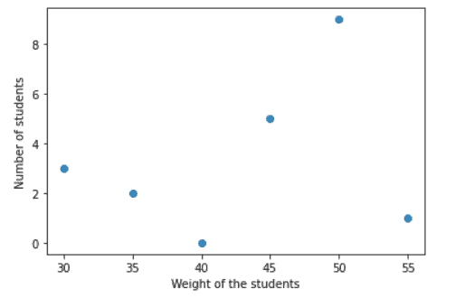
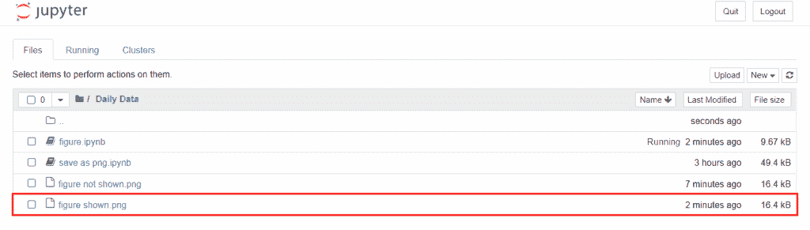
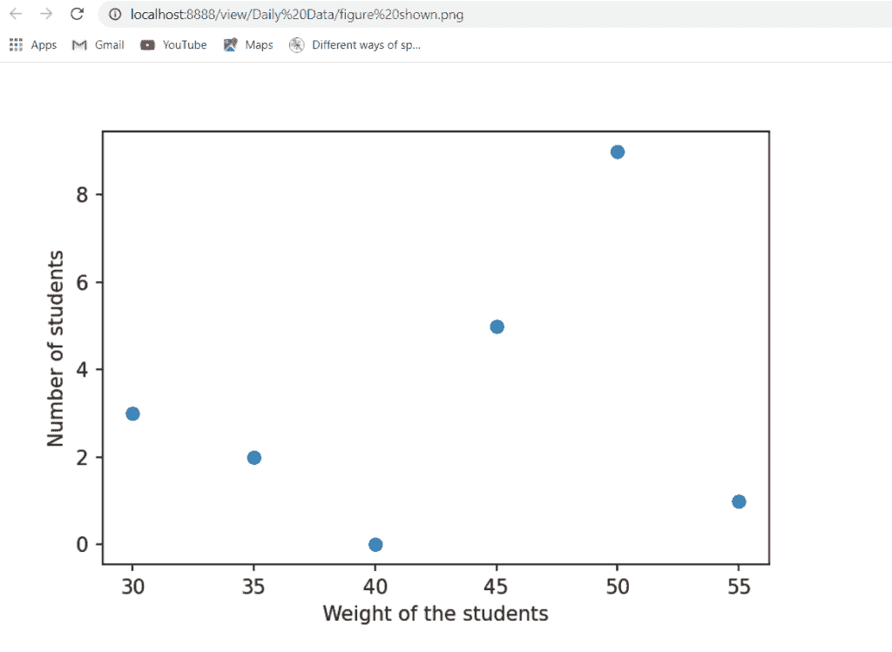
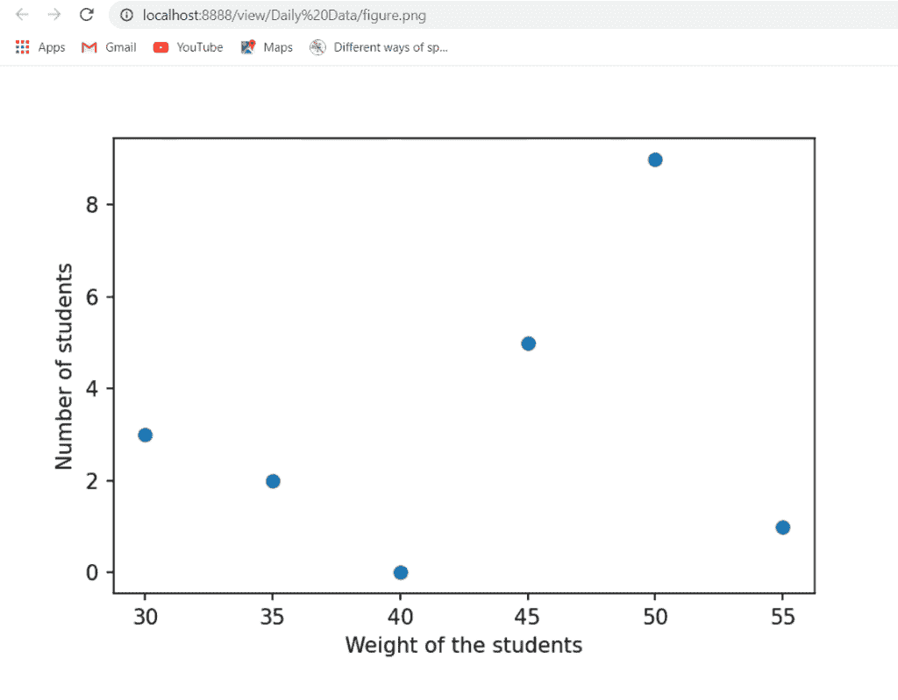

# Matplotlib 保存空白图像

> 原文：<https://pythonguides.com/matplotlib-savefig-blank-image/>

[](https://sharepointsky.teachable.com/p/python-and-machine-learning-training-course)

在这里，我们将讨论许多 matplotlib 初学者或程序员面临的一个非常普遍的问题。我们将尝试涵盖一些解决方案来克服这个问题“`matplotlib save fig blank image`”。

看看，[什么是 Matplotlib，如何在 Python 中使用它](https://pythonguides.com/what-is-matplotlib/)

目录

[](#)

*   [matplotlib savefig 空白图像](#matplotlib_savefig_blank_image "matplotlib savefig blank image")
    *   [解决方案#1:通过使用 plt.savefig()](#Solution1_By_using_pltsavefig "Solution#1: By using plt.savefig() ")
    *   [解决方案#2:通过使用 plt.figure()](#Solution2_By_using_pltfigure "Solution#2: By using plt.figure() ")

## matplotlib savefig 空白图像

**问题:**当程序员在 matplotlib 中绘制图形或图表，并试图将其保存为本地系统中的图像，但图形无法显示。

首先我应该向你澄清这不是一个错误。有时，当用户使用 `"savefig()"` 方法保存图形时，会得到一个**黑页**。

**让我们来看一个上述问题的例子:**

```py
**# Import Library**

import matplotlib.pyplot as plt

**# Define Data**

student = [3,2,0,5,9,1]
weight = [30,35,40,45,50,55]

**# Plot Graph**

plt.scatter(weight,student) 

**# Define axes label**

plt.xlabel("Weight of the students")
plt.ylabel("Number of students")

**# show plot** 
plt.show()

**# Save image**

plt.savefig('figure not shown', dpi = 150)
```

*   在上面的例子中，我们首先导入 `matplotlib.pyplot` 库。
*   在此之后，我们定义数据坐标并使用 `plt.scatter()` 方法绘制散点图。
*   我们使用 `plt.xlabel()` 和 `plt.ylabel()` 方法分别定义 x 轴标签和 y 轴标签。
*   在此之后，我们使用 `plt.show()` 方法在屏幕上可视化绘图。
*   最后，我们使用 `plt.savefig()` 方法将您的绘图保存为图像。



*” Figure show in jupyter notebook or on your screen”*



“Directory where the *figure is shown in your local system”*


*” Output when you open saved figure from your system”*

上面你可以看到，当我们打开保存图时，我们得到的是一个空白页，而不是一个图。

退房， [Matplotlib 支线剧情教程](https://pythonguides.com/matplotlib-subplot-tutorial/)

### **方案一:** 利用 plt.savefig()

这个问题的解决方案是，你必须在 `plt.savefig()` 方法之后调用 `plt.show()` 方法。

**我们来看一个代码:**

```py
**# Import Library**

import matplotlib.pyplot as plt

**# Define Data**

student = [3,2,0,5,9,1]
weight = [30,35,40,45,50,55]

**# Plot Graph**

plt.scatter(weight,student) 

**# Define axes label** 
plt.xlabel("Weight of the students")
plt.ylabel("Number of students")

**# Save image** 
plt.savefig('figure shown', dpi = 150)

**# show plot** 
plt.show() 
```

在上面的例子中，我们在使用 `show()` 方法之前使用了 `savefig()` 方法。



*” Output on your screen”*



*“Directory where image saved”*



*“Output when you open saved image from your system”*

> **结论！**当我们在 matplotlib 中 show()方法之前调用 savefig()方法时，得到的是一个图而不是空白页。

另外，请阅读: [modulenotfounderror:没有名为“matplotlib”的模块](https://pythonguides.com/no-module-named-matplotlib/)

### **方案二:** 利用 plt.figure()

这个问题的下一个解决方案是使用 `figure()` 方法将图形保存为图像。在这里，我们在使用 `savefig()` 方法之前使用了 `show()` 方法。

**让我们看看代码:**

```py
**# Import Library** 
import matplotlib.pyplot as plt

**# Define Data** 
student = [3,2,0,5,9,1]
weight = [30,35,40,45,50,55]

**# Plot Graph** fig = plt.figure()

plt.scatter(weight,student) 

**# Define axes label** 
plt.xlabel("Weight of the students")
plt.ylabel("Number of students")

**# show plot**

plt.show()

**# Save image**

fig.savefig('figure', dpi = 150) 
```

*   在上面的例子中，我们导入 `matplotlib.pyplot` 库并定义数据坐标。
*   之后我们使用 `plt.figure()` 方法和 `plt.scatter()` 方法绘制散点图。
*   然后我们使用 `plt.xlabel()` 和 `plt.ylabel()` 方法定义轴标签。
*   `plt.show()` 方法用于可视化绘图。
*   最后，我们使用 `fig.savefig()` 方法将图形保存为图像。



plt.figure()

> **结论！**这里我们使用 plt.figure()方法和 fig.savefig()方法将 figure 保存为图像。

因此，在本教程中，我们了解了关于 **Matplotlib savefig() "figure "不显示**错误或 Matplotlib savefig 空白图像的问题。

你可能也喜欢阅读下面的 Matplotlib 教程。

*   [Matplotlib 另存为 png](https://pythonguides.com/matplotlib-save-as-png/)
*   [Matplotlib set _ yticklabels](https://pythonguides.com/matplotlib-set_yticklabels/)
*   [Matplotlib 绘图误差线](https://pythonguides.com/matplotlib-plot-error-bars/)
*   [Matplotlib 散点图标记](https://pythonguides.com/matplotlib-scatter-marker/)
*   [Matplotlib 虚线](https://pythonguides.com/matplotlib-dashed-line/)
*   [Matplotlib plot_date](https://pythonguides.com/matplotlib-plot-date/)
*   [Matplotlib 测井记录图](https://pythonguides.com/matplotlib-log-log-plot/)
*   [Matplotlib 条形图标签](https://pythonguides.com/matplotlib-bar-chart-labels/)
*   [Matplotlib 默认图形尺寸](https://pythonguides.com/matplotlib-default-figure-size/)
*   [Matplotlib tight_layout](https://pythonguides.com/matplotlib-tight-layout/)

[Bijay Kumar](https://pythonguides.com/author/fewlines4biju/)

Python 是美国最流行的语言之一。我从事 Python 工作已经有很长时间了，我在与 Tkinter、Pandas、NumPy、Turtle、Django、Matplotlib、Tensorflow、Scipy、Scikit-Learn 等各种库合作方面拥有专业知识。我有与美国、加拿大、英国、澳大利亚、新西兰等国家的各种客户合作的经验。查看我的个人资料。

[enjoysharepoint.com/](https://enjoysharepoint.com/)[](https://www.facebook.com/fewlines4biju "Facebook")[](https://www.linkedin.com/in/fewlines4biju/ "Linkedin")[](https://twitter.com/fewlines4biju "Twitter")