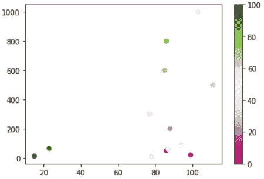
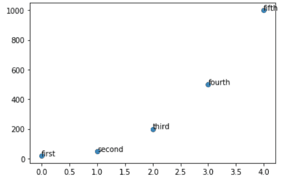

# Matplotlib 散点标记

> 原文：<https://pythonguides.com/matplotlib-scatter-marker/>

[](https://sharepointsky.teachable.com/p/python-and-machine-learning-training-course)

在本 python 教程中，我们将使用 Python 中的 matplotlib 讨论带有标记的**散点图。我们还将讨论以下主题:**

*   Matplotlib 散点标记
*   如何绘制散点图
*   Matplotlib 散点图标记示例
*   Matplotlib 散点标记多重绘图
*   Matplotlib 散点图标记颜色
*   Matplotlib 散点图标记每个标记有不同的颜色
*   Matplotlib 散点图生成器大小
*   Matplotlib 散点图标记每个标记的大小不同
*   Matplotlib 散点图标记样式
*   Matplotlib 散点图标记每个标记有不同的样式
*   Matplotlib 散点标记色图
*   Matplotlib 散点图标记轮廓
*   Matplotlib 散点图标记文本
*   按值或类别排列的 Matplotlib 散点图标记颜色
*   Matplotlib 散点图标记透明

目录

[](#)

*   [Matplotlib 散点图标记](#Matplotlib_scatter_marker "Matplotlib scatter marker")
*   [Matplotlib 散点图如何绘制](#Matplotlib_scatter_marker_how_to_plot "Matplotlib scatter marker how to plot")
*   [Matplotlib 散点图标记示例](#Matplotlib_scatter_marker_example "Matplotlib scatter marker example")
*   [Matplotlib 散点图标记多重图](#Matplotlib_scatter_marker_multiple_plot "Matplotlib scatter marker multiple plot ")
*   [Matplotlib 散点图标记颜色](#Matplotlib_scatter_marker_color "Matplotlib scatter marker color")
*   [Matplotlib 散点图标记每个标记不同的颜色](#Matplotlib_scatter_marker_different_color_for_each_marker "Matplotlib scatter marker different color for each marker")
*   [Matplotlib 散点图标记大小](#Matplotlib_scatter_marker_size "Matplotlib scatter marker size")
*   [Matplotlib 散点图标记每个标记的大小不同](#Matplotlib_scatter_marker_different_sizes_for_each_marker "Matplotlib scatter marker different sizes for each marker")
*   [Mtplotlib 散点标记样式](#Mtplotlib_scatter_marker_style "Mtplotlib scatter marker style")
*   [Matplotlib 散点图标记每个标记的不同样式](#Matplotlib_scatter_marker_different_style_for_each_marker "Matplotlib scatter marker different style for each marker")
*   [Matplotlib 散点标记色图](#Matplotlib_scatter_marker_colormap "Matplotlib scatter marker colormap")
*   [Matplotlib 散点图标记轮廓](#Matplotlib_scatter_marker_outline "Matplotlib scatter marker outline")
*   [Matplotlib 散点图标记文本](#Matplotlib_scatter_marker_text "Matplotlib scatter marker text")
    *   [Matplotlib 散点标记文本–单点注释](#Matplotlib_scatter_marker_text_-_single_point_annotation "Matplotlib scatter marker text – single point annotation")
    *   [Matplotlib 散点标记文本–所有点注释](#Matplotlib_scatter_marker_text_-_all_points_annotation "Matplotlib scatter marker text – all points annotation")
*   [Matplotlib 散点图颜色按数值或类别](#Matplotlib_scatter_marker_color_by_value_or_category "Matplotlib scatter marker color by value or category")
*   [Matplotlib 散点标记透明](#Matplotlib_scatter_marker_transparent "Matplotlib scatter marker transparent")

## Matplotlib 散点图标记

*   [Matplotlib](https://pythonguides.com/what-is-matplotlib/) 为数据可视化提供了一个 `pyplot` 模块。
*   在 pyplot 模块下，我们有一个 `scatter()` 函数来绘制散点图。
*   基本上， `scatter()` 方法为每次观察画一个点。
*   在 matplotlib 中，绘制的点称为“**标记**”。
*   这就是为什么它被称为**散射标记**的原因。

## Matplotlib 散点图如何绘制

*   **散点图()**方法用于绘制散点图。
*   它以数组的形式接收数据。
*   它接受相同长度的两个数组中的值，一个用于 x 轴**的**，另一个用于 y 轴**的**。

**以下步骤用于创建 matplotlib 散点图标记，概述如下:**

*   **定义库:**导入创建散点标记所需的重要库(可视化:来自 matplotlib 的 pyplot，数据创建和操作:NumPy)。
*   **定义 X 和 Y:** 定义 X 轴和 Y 轴上的数据值。它接受数组形式的数据值。两个区域的大小必须相同。
*   **绘制散点图:**通过使用**散点图()**方法，我们可以绘制一个图形。
*   **显示:**最后使用 `show()` 函数显示出图形。

**创建 matplotlib 散点图的语法如下:**

```py
matplotlib.pyplot.scatter(x, y, s=None, c=None, marker=None, ....)
```

**上述使用的参数概述如下:**

*   **x:** 指定 x 轴上的数据位置。
*   **y:** 指定 y 轴上的数据位置。
*   **s:** 指定标记尺寸。
*   **c:** 指定点的颜色。
*   **标记:**指定标记的种类。

## Matplotlib 散点图标记示例

在上面的章节中，我们讨论了散点图的确切含义。我们还讨论了用于创建或绘制 matplotlib 散点图的各个步骤。现在，让我们看看如何使用 matplotlib 绘制散点图。

**下面我们通过一个例子来理解这个概念:**

```py
**# Import Libraries**

import matplotlib.pyplot as plt
import numpy as np

**# Define Data**

x = np.array([5,7,8,7,2])
y = np.array([99,103,87,94,78])

**# Plot a scatter marker**

plt.scatter(x, y)

**# Display a graph**

plt.show()
```

*   在上面的例子中，我们导入了 `matplotlib.pyplot` 和 `numpy` 库。
*   然后我们定义数组形式的 X 轴**和 Y 轴**点。
*   `plt.scatter()` 方法用于为每个数据点绘制一个点。
*   然后我们最后使用方法 `plt.show()` 来显示绘制的图形。


Matplotlib scatter marker

阅读:[如何安装 matplotlib python](https://pythonguides.com/how-to-install-matplotlib-python/)

## Matplotlib 散点图标记多重图

如果我们想在同一个图中绘制多个散点图会发生什么。

**让我们借助一个例子来理解这个概念:**

```py
**# Import Libraries**

import matplotlib.pyplot as plt
import numpy as np

**# Plot data** 

x = np.array([5,7,8,7])
y = np.array([78,77,85,86])
plt.scatter(x, y)

**# Plot data** 
x = np.array([4,7,14,12])
y = np.array([100,105,84,105])
plt.scatter(x, y)

**# Display Graph**

plt.show()
```

*   在上面的例子中，我们得出结论，当我们绘制两个不同的数据时，这些图是用两种不同的颜色绘制的。
*   默认情况下，散射标记为蓝色和橙色。


plt.scatter()

## Matplotlib 散点图标记颜色

我们可以为每个散点图设置我们选择的颜色。

**改变颜色的语法如下:**

```py
matplotlib.pyplot.scatter(x, y, color=None)
```

**给定语法的参数概述如下:**

*   **x:** 指定 x 轴上的数据位置。
*   **y:** 指定 y 轴上的数据位置。
*   **颜色:**设置您选择的颜色。颜色的简写是“ `c` ”。

**结果:**所有标记颜色相同。

**让我们借助一个例子来理解这个概念:**

```py
**# Import Libraries**

import matplotlib.pyplot as plt
import numpy as np

**# Define Data**

x = np.array([5,7,8,7,2])
y = np.array([99,103,87,94,78])

**# Plot a scatter marker**

plt.scatter(x, y, color='red')

                       **#OR**

plt.scatter(x, y, c='cyan')

**# Display a graph**

plt.show()
```

*   在上面的例子中，我们导入了 `matplotlib.pyplot` 和 `numpy` 库。
*   然后我们定义数组形式的 X 轴**和 Y 轴**点。
*   `plt.scatter()` 方法用于为每个数据点绘制点，我们传递一个参数 color 来设置绘图的颜色。
*   然后我们最后使用方法 `plt.show()` 来显示绘制的图形。


plt.scatter() *“Output of case1”*


plt.scatter() *“Output of case2”*

阅读: [Matplotlib 绘制一条线](https://pythonguides.com/matplotlib-plot-a-line/)

## Matplotlib 散点图标记每个标记不同的颜色

*   如果我们想为每个点或标记设置不同的颜色，我们必须定义一个由颜色值组成的数组。
*   两个数组的大小必须相同，即颜色或值。

**为每个标记设置不同颜色的语法如下:**

```py
matplotlib.pyplot.scatter(x,y,c=None)
```

**给定语法的参数概述如下:**

*   **x:** 指定数据在 x 轴上的位置。
*   **y:** 指定数据在 y 轴上的位置。
*   `c` :为每个点设置不同的颜色。

**结果:**所有标记颜色不同。

> **注:** 用于为每个点设置不同的颜色通过' `c` '作为自变量或颜色自变量。

**让我们借助一个例子来理解这个概念:**

```py
**# Import Libraries** 

import matplotlib.pyplot as plt
import numpy as np

**# Define Data**

x = np.array([5, 7, 8, 7, 2, 6, 12, 3, 5, 63, 22, 69])
y = np.array([10, 15, 12, 11, 63, 45, 56, 36, 56, 99, 21, 23])
colors_set = np.array(["orange","purple","beige","brown","gray","cyan","magenta","red","green","blue","yellow","pink"])

**# Plot a scatter marker**

plt.scatter(x, y, c=colors_set)

**# Display a graph**

plt.show()
```

*   在上面的例子中，我们导入了 `matplotlib.pyplot` 和 `numpy` 库。然后我们以数组的形式定义了 X 轴**和 Y 轴**点。
*   `plt.scatter()` 方法用于为每个数据点绘制点，我们通过一个参数**‘c’**为每个点设置不同的颜色。然后我们最终使用方法 `plt.show()` 来显示绘制的图形


plt.scatter()

阅读: [Python 使用 Matplotlib 绘制多条线](https://pythonguides.com/python-plot-multiple-lines/)

## Matplotlib 散点图标记大小

如果我们想根据自己的选择设置标记的大小。我们必须传递参数' `s` '。

我们可以根据需要轻松增加或减少标记的大小。

**改变标记大小的语法如下:**

```py
matplotlib.pyplot.scatter(x, y, s=None)
```

**给定语法的参数概述如下:**

*   **x:** 指定数据在 x 轴上的位置。
*   **y:** 指定数据在 y 轴上的位置。
*   `s` :设置标记的大小。

**结果:**所有标记大小相同。

**让我们借助下面给出的例子来理解这个概念:**

```py
**# Import Libraries**

import matplotlib.pyplot as plt
import numpy as np

**# Define Data** 

x = np.array([99,86,88,111,103,87,94,78,77,85,86])
y = np.array([20,50,200,500,1000,60,90,10,300,600,800])

**# Define scatter() function**

plt.scatter(x, y, s=115)

# Display the graph

plt.show()
```

*   在上面的例子中，我们导入了 `matplotlib.pyplot` 和 `numpy` 库。
*   然后我们定义数组形式的 X 轴**和 Y 轴**点。
*   `plt.scatter()` 方法用于为每个数据点绘制点，我们通过一个参数【T2 的】来设置标记的大小。
*   然后我们最后使用方法 `plt.show()` 来显示绘制的图形。


Matplotlib scatter marker size

阅读:[什么是 matplotlib 内联](https://pythonguides.com/what-is-matplotlib-inline/)

## Matplotlib 散点图标记每个标记的大小不同

当我们想要修改每个标记的大小时。我们必须将参数' `s` '传递给该方法。

此功能增加或减少每个标记的大小。

**设置每个标记大小的语法如下:**

```py
matplotlib.pyplot.scatter(x, y, s=None)
```

**给定语法的参数概述如下:**

*   **x:** 指定数据在 x 轴上的位置。
*   **y:** 指定数据在 y 轴上的位置。
*   `s` :设定每个标记的不同尺寸。默认大小为 RC params[' lines . marker size ']* * 2

**结果:**每个标记大小不同。

**让我们借助下面给出的例子来理解这个概念:**

```py
**# Import Libraries**

import matplotlib.pyplot as plt
import numpy as np

**# Define Data**

x = np.array([99,86,88,111,103,87,94,78,77,85,86])
y = np.array([20,50,200,500,1000,60,90,10,300,600,800])

**# Define scatter() function**

sizes = (np.random.sample(size=x.size) * 75) ** 2
plt.scatter(x, y, s=sizes)

**# Display the graph**

plt.show()
```

*   在上面的例子中，我们导入了 `matplotlib.pyplot` 和 `numpy` 库。
*   然后我们定义数组形式的 **x 轴**和 **y 轴**点。
*   `plt.scatter()` 方法用于为每个数据点绘制一个标记。要改变每个标记的大小，我们必须将参数【T2 的】传递给函数。
*   然后，我们最后使用方法 `plt.show()` 来显示绘制的图形。


plt.scatter()

阅读: [Matplotlib 绘图条形图](https://pythonguides.com/matplotlib-plot-bar-chart/)

## Mtplotlib 散点标记样式

程序员可以定制标记的样式或形状。Matplotlib 提供了更改标记样式的功能。

通过使用参数'**标记**，我们可以随时改变标记的样式或形状。

**标记样式的一些常见类型:**

| **标记** | **描述** |
| '.' | 要点 |
| 的 | 圆 |
| '+' | 加 |
| '>' | 三角形右 |
| ' | 向左三角形 |
| “s” | 平方 |
| x ' | X |

Different Markers

**改变标记样式的语法如下:**

```py
matplotlib.pyplot.scatter(x, y, marker=None)
```

**给定语法的参数概述如下:**

*   **x:** 指定数据在 x 轴上的位置。
*   **y:** 指定数据在 y 轴上的位置。
*   **标记**:设置标记的不同风格。默认情况下，样式为圆形。

**结果:**不同风格的标记。

**我们借助一个例子来讨论一下上面的概念:**

```py
**# Import Libraries**

import matplotlib.pyplot as plt
import numpy as np

**# Define Data** 
x = np.array([99,86,88,111,103,87,94,78,77,85,86])
y = np.array([20,50,200,500,1000,60,90,10,300,600,800])

**# Define scatter() function**

plt.scatter(x, y, marker='>', s = 65)

                     **#OR**

plt.scatter(x, y, marker='s', s = 165)

**# Display the graph**

plt.show()
```

*   在上面的例子中，我们导入了 `matplotlib.pyplot` 和 `numpy` 库。
*   然后我们以数组的形式定义 **x 轴**和 **y 轴**点。
*   `plt.scatter()` 方法用于为每个数据点绘制标记，我们通过参数**‘标记’**来设置标记的样式。
*   然后我们最后使用方法 `plt.show()` 来显示绘制的图形。


plt.scatter() *“Output of Case1”*


plt.scatter() *“Output of Case2”*

阅读: [Matplotlib 支线剧情教程](https://pythonguides.com/matplotlib-subplot-tutorial/)

## Matplotlib 散点图标记每个标记的不同样式

为了区分不同的数据组，我们必须使用不同风格的标记。无法在对 `scatter()` 方法的一次调用中定义多个标记样式。

因此，要对不同组的数据使用不同的标记样式，我们每次都必须使用 `scatter()` 方法。

**改变每个标记样式的语法:**

```py
matplotlib.pyplot.scatter(x, y, marker=None) // Call each time
```

**给定语法的参数概述如下:**

*   **x:** 指定数据在 x 轴上的位置。
*   **y:** 指定数据在 y 轴上的位置。
*   **标记**:设置每个标记的不同风格。每次都调用函数。

**Result:** 返回不同样式的标记，便于区分不同的数据组。

**让我们借助一个例子来理解这个概念:**

```py
**# Import Libraries** 
import matplotlib.pyplot as plt
import numpy as np

**# Define Data**

x = np.array([10, 20, 30, 15, 25, 13, 8, 2])
y1 = np.array([1, 6, 8, 12, 25, 15, 10, 7.5])
y2= np.array([6.5, 3.2, 16, 15, 19, 23, 18.6, 29])

**# Define scatter() function**

plt.scatter(x, y1, marker='s', s = 265)
plt.scatter(x, y2, marker='d', s = 265)

**# Display the graph**

plt.show()
```

*   在上面的例子中，我们导入了`matplotlib . py plot`和 `numpy` 库。
*   然后我们将 x 轴的**和 y 轴的**点以数组的形式排列。****
*   ****`plt.scatter()` 方法用于为每个数据点绘制标记，我们通过参数**‘marker’**来设置标记的样式。要设置不同风格的每个标记，每次都必须调用 `scatter()` 方法。****
*   ****然后我们最后使用方法 `plt.show()` 来显示绘制的图形。****

****

plt.scatter()

阅读: [Matplotlib 支线剧情 _adjust](https://pythonguides.com/matplotlib-subplots_adjust/)

## Matplotlib 散点标记色图

有时，我们必须绘制依赖于其他数据的数据。在这种情况下，我们使用彩色地图。

如果您想在图形区域中包含一个颜色图条，使用函数 `plt.colorbar()`

**其语法如下:**

```py
matplotlib.pyplot.scatter(x, y, c=None, cmap=None) 
matplotlib.pyplot.colorbar()
```

**给定语法的参数概述如下:**

*   **x:** 指定数据在 x 轴上的位置。
*   **y:** 指定数据在 y 轴上的位置。
*   `c` :指定颜色的数组。范围从 0 到 100。
*   **cmap:** 指定彩色地图。

**让我们借助一个例子来理解这个概念:**

```py
**# Import Libraries**

import matplotlib.pyplot as plt
import numpy as np

**# Define Data**

x = np.array([99,86,88,111,103,87,94,78,77,85,86,23,15])
y = np.array([20,50,200,500,1000,60,90,10,300,600,800,65,12])
colors = np.array([0, 10, 20, 30, 40, 45, 50, 55, 60, 70, 80, 90, 100])

**# Define scatter() function** 
plt.scatter(x, y, c=colors, cmap= 'PiYG')

                   **#Or**

plt.scatter(x, y, c=colors, cmap= 'Dark2')

plt.colorbar()

**# Display the graph**

plt.show()
```

*   在上面的例子中，我们导入了`matplotlib . py plot`和 `numpy` 库。
*   然后我们将 x 轴的**和 y 轴的**点以数组的形式排列。****
*   ****`plt.scatter()` 方法用于为每个数据点绘制标记，我们通过参数**【cmap】**来设置颜色图。****
*   ****`plt.colorbar()` 方法用于显示绘图中的色带。****
*   ****然后我们最后使用方法 `plt.show()` 来显示绘制的图形。****

****

plt.scatter() *“Output of case1”*


plt.colorbar() *“Output of case2”*

读取: [Matplotlib 日志日志图](https://pythonguides.com/matplotlib-log-log-plot/)

## Matplotlib 散点图标记轮廓

我们可以通过改变其边缘颜色来改变每个标记的轮廓。基本上，它用特定的颜色在标记周围创建轮廓。

**其语法如下:**

```py
matplotlib.pyplot.scatter(x, y, c=None, s=None, edgecolors=None, cmap=None)
```

**给定语法的参数概述如下:**

*   **x:** 指定数据在 x 轴上的位置。
*   **y:** 指定数据在 y 轴上的位置。
*   `c` :指定颜色的数组。范围从 0 到 100。
*   **s:** 指定标记的大小
*   **边缘颜色:**设置标记的边缘颜色
*   **cmap:** 指定彩色地图。

**让我们借助一个例子来理解这个概念:**

```py
**# Import Libraries**

import matplotlib.pyplot as plt
import numpy as np

**# Define Data** 
x = np.array([99,86,88,111,103,87,94,78,77,85,86,23,15])
y = np.array([20,50,200,500,1000,60,90,10,300,600,800,65,12])
colors = np.array([0, 10, 20, 30, 40, 45, 50, 55, 60, 70, 80, 90, 100])

**# Define scatter() function**

plt.scatter(x, y, c=colors, edgecolors= 'k', s= 120, cmap= 'Dark2')
plt.colorbar()

**# Display the graph**

plt.show()
```

*   在上面的例子中，我们导入了`matplotlib . py plot`和 `numpy` 库。
*   然后我们将 x 轴的**和 y 轴的**点以数组的形式排列。****
*   ****`plt.scatter()` 方法用于为每个数据点绘制标记，我们通过参数**【edge colors】**来设置标记边缘的颜色。这里我们将颜色设置为**黑色**。****
*   ****`plt.colorbar()` 方法用于显示绘图中的色带。****
*   ****然后我们最后使用方法 `plt.show()` 来显示绘制的图形。****

****

plt.scatter()

阅读: [Matplotlib plot_date](https://pythonguides.com/matplotlib-plot-date/)

## Matplotlib 散点图标记文本

当我们想要在 matplotlib 中的散点图旁边放置一个文本时，这个过程被称为**注释**。

根据我们想要注释的分散点的数量，有两种类型的注释。

**注释的类型如下:**

*   单点注释
*   多点注释

### Matplotlib 散点标记文本–单点注释

在单点注释中，我们可以将文本放置在特定的点上。

当可以使用 `plt.text()` 方法来提及文本时。

**单点标注的语法如下:**

```py
matplotlib.plot.text(x, y, s)
```

**给定语法的参数概述如下:**

*   **x:** 指定放置文本的 x 轴点。
*   **y:** 指定放置文本的 y 轴点。
*   **s:** 指定文本。

**让我们借助一个例子来理解这个概念:**

```py
**# Import Libraries**

import matplotlib.pyplot as plt
import numpy as np

**# Define Data** 

x = np.array([99,86,88,111,103,87,94,78,77,85,86])
y = np.array([20,50,200,500,1000,60,90,10,300,600,800])

**# Define scatter() function**

plt.scatter(x, y)

**# Annotate the point**

plt.text(99,20, 'Point 1')

**# Display the graph**

plt.show()
```

*   在上面的例子中，我们导入了`matplotlib . py plot`和 `numpy` 库。
*   然后我们将 x 轴的**和 y 轴的**点以数组的形式排列。****
*   ****`plt.scatter()` 方法用于为每个数据点绘制标记。****
*   ****`plt.text()` 方法用于标注单点。****
*   ****然后我们最后使用方法 `plt.show()` 来显示绘制的图形。****

****

plt.text()

### Matplotlib 散点标记文本–所有点注释

如果我们想要注释散点图中的所有点，我们在 matplotlib 中有 `annotate()` 方法。

**其语法如下:**

```py
matplotlib.pyplot.annotate(text, (xy))
```

**给定语法的参数概述如下:**

*   **文本:**指定注释的文本。
*   **xy:** 指定要注释的点。

**让我们借助一个例子来理解这个概念:**

```py
**# Import Libraries**

import matplotlib.pyplot as plt
import numpy as np

**# Define Data**

x = [x for x in range(5)]
y = np.array([20,50,200,500,1000])
text = ["first", "second", "third", "fourth", "fifth"]

**# Define scatter() function**

plt.scatter(x, y)

**# Annotate the point**

for i in range(len(x)):
    plt.annotate(text[i], (x[i], y[i] + 0.2))

**# Display the graph**

plt.show()
```

*   在上面的例子中，我们导入了`matplotlib . py plot`和 `numpy` 库。
*   然后我们将 x 轴**和 y 轴**点以数组的形式排列。****
*   ****`plt.scatter()` 方法用于为每个数据点绘制标记。****
*   ****`plt.annotate()` 方法用于标注单点。****
*   ****然后我们最后使用方法 `plt.show()` 来显示绘制的图形。****

****

plt.annotate()

阅读: [Matplotlib 虚线](https://pythonguides.com/matplotlib-dashed-line/)

## Matplotlib 散点图颜色按数值或类别

在本节中，我们将学习如何根据数值或类别给数据点或散点图标记着色。

对于分组，使用' `groupby` '子句。

**让我们借助一个例子来理解这个概念:**

```py
**# Import Libraries**

import pandas as pd
import matplotlib.pyplot as plt

**#create DataFrame**

df = pd.DataFrame({'x': [10, 12, 13, 14, 19, 23, 25, 30],
                   'y': [5, 7, 7, 9, 12, 9, 9, 4],
                   'z': ['A', 'A', 'A', 'B', 'B', 'C', 'C', 'C']})

**#view DataFrame**

df

**#groupby category**

groups = df.groupby('z')
for name, group in groups:
    plt.scatter(group.x, group.y, label=name)

**# Display the graph**

plt.legend()
plt.show()
```

*   在上面的例子中，我们导入了`matplotlib . py plot`和**熊猫**库。
*   然后我们创建一个数据帧，以数组的形式定义 x 轴**和 y 轴**点。****
*   ****`plt.scatter()` 方法用于为每个数据点绘制标记。****
*   ****`groupby` 用于分组的子句****
*   ****然后我们最后使用方法 `plt.show()` 来显示绘制的图形。****

 ****读取: [Matplotlib 绘图误差线](https://pythonguides.com/matplotlib-plot-error-bars/)

## Matplotlib 散点标记透明

当我们想要检查绘制的数据密度时，由于大量的重叠我们无法看到，这时我们需要透明度。

`alpha` 参数用于使散点标记透明。

`alpha` 参数移除散点的轮廓。

**透明的语法如下:**

```py
matplotlib.pyplot.scatter(x, y, alpha=None)
```

**给定语法的参数概述如下:**

*   **x:** 指定 x 轴上的数据点。
*   **y:** 指定 y 轴上的数据点。
*   **alpha:** 设置透明度值。默认值为 1，即无透明度。

**让我们借助一个例子来理解这个概念:**

```py
**# Import Libraries**

import matplotlib.pyplot as plt
import numpy as np

**# Define Data** 

x = np.array([99,86,88,111,103,87,94,78,77,85,86])
y = np.array([20,50,200,500,1000,60,90,10,300,600,800])

**# Define scatter() function**

sizes = (np.random.sample(size=x.size) * 75) ** 2
plt.scatter(x, y, s=sizes, alpha=0.3, c='red')

**# Display the graph**

plt.show()
```

*   在上面的例子中，我们导入了`matplotlib . py plot`和**熊猫**库。
*   然后我们将 x 轴的**和 y 轴的**点以数组的形式排列。****
*   ****`plt.scatter()` 方法用于为每个数据点 t 绘制标记，并通过参数' `alpha` '设置透明度。我们设定α= 0.3****
*   ****然后我们最后使用方法 `plt.show()` 来显示绘制的图形。****

****

plt.scatter()

另外，看看更多的文章:

*   [Matplotlib 另存为 png](https://pythonguides.com/matplotlib-save-as-png/)
*   [画垂直线 matplotlib](https://pythonguides.com/draw-vertical-line-matplotlib/)
*   [将图例放在绘图 matplotlib 之外](https://pythonguides.com/put-legend-outside-plot-matplotlib/)

在本 Python 教程中，我们已经讨论了" **Matplotlib 散点标记**"并且我们还介绍了一些与之相关的例子。我们在本教程中讨论了以下主题。

*   Matplotlib 散点标记
*   如何绘制散点图
*   Matplotlib 散点图标记示例
*   Matplotlib 散点标记多重绘图
*   Matplotlib 散点图标记颜色
*   Matplotlib 散点图标记每个标记有不同的颜色
*   Matplotlib 散点图生成器大小
*   Matplotlib 散点图标记每个标记的大小不同
*   Matplotlib 散点图标记样式
*   Matplotlib 散点图标记每个标记有不同的样式
*   Matplotlib 散点标记色图
*   Matplotlib 散点图标记轮廓
*   Matplotlib 散点图标记文本
*   按值或类别排列的 Matplotlib 散点图标记颜色
*   Matplotlib 散点图标记透明

[Bijay Kumar](https://pythonguides.com/author/fewlines4biju/)

Python 是美国最流行的语言之一。我从事 Python 工作已经有很长时间了，我在与 Tkinter、Pandas、NumPy、Turtle、Django、Matplotlib、Tensorflow、Scipy、Scikit-Learn 等各种库合作方面拥有专业知识。我有与美国、加拿大、英国、澳大利亚、新西兰等国家的各种客户合作的经验。查看我的个人资料。

[enjoysharepoint.com/](https://enjoysharepoint.com/)[](https://www.facebook.com/fewlines4biju "Facebook")[](https://www.linkedin.com/in/fewlines4biju/ "Linkedin")[](https://twitter.com/fewlines4biju "Twitter")``********************``