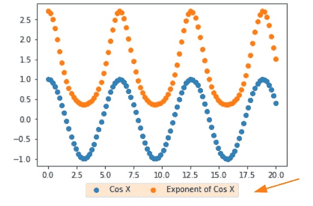

# Matplotlib 散点图颜色

> 原文：<https://pythonguides.com/matplotlib-scatter-plot-color/>

[](https://sharepointsky.teachable.com/p/python-and-machine-learning-training-course)

在本 [Python Matplotlib 教程](https://pythonguides.com/what-is-matplotlib/)中，我们将讨论 Matplotlib 中的 **Matplotlib 散点图颜色**。这里我们将介绍使用 matplotlib 与散点图颜色相关的不同示例。我们还将讨论以下主题:

*   Matplotlib 散点图颜色
*   Python 散点图颜色数组
*   Python 散点图颜色为红色
*   Matplotlib 散点图边缘颜色
*   Matplotlib 散点图每个点的颜色
*   Matplotlib 散点图彩色地图
*   Matplotlib 散点图标记表面颜色
*   Matplotlib 散点图颜色透明度
*   Python 散点图随机颜色
*   按标签排列的散点图颜色
*   Python 散点图颜色范围
*   Matplotlib 散点图两种颜色
*   Matplotlib 散点图颜色标签
*   Matplotlib 散点图颜色 rgb
*   Matplotlib 按字符串散点图颜色
*   Matplotlib 散点图颜色分类
*   Matplotlib 散点图颜色值
*   按类别排列的散点图颜色图例

目录

[](#)

*   [Matplotlib 散点图颜色](#Matplotlib_scatter_plot_color "Matplotlib scatter plot color")
*   [Python 散点图颜色数组](#Python_scatter_plot_color_array "Python scatter plot color array")
*   [Python 散点图颜色红色](#Python_scatter_plot_color_red "Python scatter plot color red")
*   [Matplotlib 散点图边缘颜色](#Matplotlib_scatter_plot_edge_color "Matplotlib scatter plot edge color")
*   [Matplotlib 散点图每个点的颜色](#Matplotlib_scatter_plot_color_each_point "Matplotlib scatter plot color each point")
*   [Matplotlib 散点图颜色图](#Matplotlib_scatter_plot_color_map "Matplotlib scatter plot color map")
*   [Matplotlib 散点图标记表面颜色](#Matplotlib_scatter_plot_marker_face_color "Matplotlib scatter plot marker face color")
*   [Matplotlib 散点图颜色透明度](#Matplotlib_scatter_plot_color_transparency "Matplotlib scatter plot color transparency")
*   [Python 散点图随机颜色](#Python_scatter_plot_random_colors "Python scatter plot random colors")
*   [Matplotlib 标签散点图颜色](#Matplotlib_scatter_plot_color_by_label "Matplotlib scatter plot color by label")
*   [Python 散点图颜色范围](#Python_scatter_plot_color_range "Python scatter plot color range")
*   [Matplotlibb 散点图两种颜色](#Matplotlibb_scatter_plot_two_colors "Matplotlibb scatter plot two colors")
*   [Matplotlib 散点图颜色标签](#Matplotlib_scatter_plot_color_label "Matplotlib scatter plot color label")
*   [Matplotlib 散点图颜色 rgb](#Matplotlib_scatter_plot_color_rgb "Matplotlib scatter plot color rgb")
*   [Matplotlib 散点图颜色按字符串排列](#Matplotlib_scatter_plot_color_by_string "Matplotlib scatter plot color by string")
*   [Matplotlib 散点图颜色分类](#Matplotlib_scatter_plot_color_by_category "Matplotlib scatter plot color by category")
*   [Matplotlib 散点图颜色值](#Matplotlib_scatter_plot_color_by_value "Matplotlib scatter plot color by value")
*   [Matplotlib 散点图颜色分类图例](#Matplotlib_scatter_plot_color_by_category_legend "Matplotlib scatter plot color by category legend")

## Matplotlib 散点图颜色

对于数据可视化，matplotlib 提供了一个 `pyplot` 模块，在这个模块下我们有一个 `scatter()` 函数来绘制散点图。在这里，我们将学习如何根据不同的条件给散点图着色。

**以下步骤用于设置散点图的颜色:**

*   **定义库:**导入创建散点图所需的重要库。对于可视化:**来自 matplotlib** 的 pyplot 和对于数据创建: `NumPy` 。
*   **定义坐标:**定义 x 轴和 y 轴数据坐标，用于数据绘图。
*   **绘制散点图:**通过使用 `scatter()` 函数，我们可以绘制一个散点图。
*   **设置颜色:**使用 `scatter()` 函数的以下参数设置散点图的颜色 `c` 、 `color` 、 `edgecolor` 、 `markercolor` 、 `cmap` 和 `alpha` 。
*   **显示:**使用 `show()` 功能在用户屏幕上显示图形。

另外，检查: [Matplotlib 3D 散点图](https://pythonguides.com/matplotlib-3d-scatter/)

## Python 散点图颜色数组

如果我们多次调用 `scatter()` 函数，来绘制散点图，我们将得到不同颜色的每个散点图。这里我们将学习手动设置数组的颜色，绕过作为参数的**颜色**。

**以下是语法:**

```py
matplotlib.pyplot.scatter(x, y, color=None)
```

**举例:**

```py
**# Import Library**

import matplotlib.pyplot as plt
import numpy as np

**# Define Data** 
x = np.array([5,7,8, 2,17])
y1 = np.array([99,103,87,94,78])
y2 = np.array([26, 23, 18, 55, 16])

**# Scatter Plot color array**

plt.scatter(x, y1, color='green')
plt.scatter(x, y2, color='red')

**# Display**

plt.show()
```

**说明:**

*   首先导入 `matplotlib.pyplot` 和 `numpy` 等库进行数据可视化和数据创建。
*   接下来，我们使用 numpy 的 `array()` 函数定义 `x` 、 `y1` 和 `y2` 数据坐标。
*   然后我们多次使用 `scatter()` 函数来创建散点图。
*   我们将 `color` 参数传递给函数来手动设置颜色。
*   为了可视化图形，使用 `show()` 方法。

**输出:**


plt.scatter(color=None)

阅读:[堆积条形图 Matplotlib](https://pythonguides.com/stacked-bar-chart-matplotlib/)

## Python 散点图颜色红色

在这里，我们将学习用单色格式绘制散点图。我们使用参数 `c` 来设置绘图的颜色，这里我们将它设置为**红色**。

**以下是语法:**

```py
matplotlib.pyplot(x, y, c='red')
```

**举例:**

```py
**# Import Library**

import matplotlib.pyplot as plt
import numpy as np

**# Define Data**

x = np.array([1, 2, 3, 4, 5, 6, 7])
y = np.array([2, 4, 6, 8, 10, 15, 12])

**# Scatter Plot color red**

plt.scatter(x, y, c='red')

**# Display**

plt.show()
```

*   这里我们用 numpy 的 `array()` 方法定义 **x 轴**和 **y 轴**数据坐标。
*   接下来，为了获得单色散点图字符串格式，我们将 `c` 参数传递给 `scatter()` 方法，并将其值设置为 `red` 。


plt.scatter(c=’red’)

默认情况下，我们将散射标记的**颜色设为蓝色**。

阅读: [Matplotlib 两个 y 轴](https://pythonguides.com/matplotlib-two-y-axes/)

## Matplotlib 散点图边缘颜色

我们将看到散点图的例子，我们设置了图的边缘颜色。要设置散点标记的边缘颜色，使用 `edgecolor` 参数和 `scatter()` 方法。

**以下是语法:**

```py
matplotlib.pyplot.scatter(x, y, edgecolor=None)
```

**例#1**

```py
**# Import Library**

import matplotlib.pyplot as plt
import numpy as np

**# Define Data** 
x = np.array([1, 4, 5, 6, 7])
y = np.array([2, 4, 6, 15, 12])

**# Edgecolor** 
plt.scatter(x, y, c='lime', edgecolor='black', s=500)

**# Display** 
plt.show()
```


plt.scatter(edgecolor=’k’)

这里我们将参数 `edgecolor` 、 `color` 传递给 `scatter()` 函数，并将其值分别设置为**黑色**和**石灰**。

**例 2**

这里我们将看到一个例子，我们为每个散点标记设置不同的边缘颜色。

**以下是步骤:**

*   导入库 `matplotlib.pyplot` 。
*   接下来，定义 `x` 和 `y` 轴数据点。
*   然后创建颜色列表。
*   要绘制散点图，使用 `scatter()` 函数。
*   为每个散射通道设置不同的边缘颜色**边缘颜色**参数，并将其值设置为给定的颜色列表。

**输出:**


Different edgecolors for each scatter marker

读取:[水平线 matplotlib](https://pythonguides.com/horizontal-line-matplotlib/)

## Matplotlib 散点图每个点的颜色

我们将看到一个例子，我们为每个散射点设置不同的颜色。为了给每个点设置不同的颜色，我们将一个颜色列表传递给 `scatter()` 方法的 `color` 参数。

**我们来看一个例子:**

```py
**# Import Library** 
import matplotlib.pyplot as plt
import numpy as np

**# Define Data**

x = np.array([0, 1, 2, 3, 4, 5])
y = np.array([1, 3, 5, 7, 9, 11])

**# Color**

color = ['lightcoral', 'darkorange', 'olive', 'teal', 'violet', 
         'skyblue']

**# Set different color**

plt.scatter(x, y, c=color, s=400)

**# Display**

plt.show()
```

**以下是步骤:**

*   导入库 `matplotlib.pyplot` 和 `numpy` 进行数据可视化和创建。
*   接下来，使用 numpy 的 `array()` 方法定义数据轴。
*   然后创建颜色列表。
*   要绘制散点图，使用 `scatter()` 函数。
*   要为每个散射标记设置不同的颜色，请传递**颜色**参数，并将其值设置为给定的颜色列表。


Different colors for each scatter marker

阅读:[画垂直线 matplotlib](https://pythonguides.com/draw-vertical-line-matplotlib/)

## Matplotlib 散点图颜色图

我们将学习用彩色地图创建 x 和 y 坐标的散点图。要添加颜色映射，请使用 `cmap` 参数调用`matplotlib . py plot . scatter()`方法。

**以下是语法:**

```py
matplotlib.pyplot.scatter(x, y, c=None, cmap=None)
```

**我们来看一个例子:**

```py
**# Import Library** 
import matplotlib.pyplot as plt
import numpy as np

**# Define Data**

x = np.linspace(0, 10, 100)
y = np.sin(x)

**# Set color map**

plt.scatter(x, y, c=y, cmap='Set2')

**# Display**

plt.show()
```

**说明:**

*   为了定义 x 轴和 y 轴的数据坐标，我们使用了 `linespace()` 和 `sin()` 函数。
*   为了创建散点图，我们使用 `scatter()` 方法。
*   我们通过 `c` 参数来设置颜色表示的变量，通过 `cmap` 参数来设置颜色图。


plt.scatter(cmap=’Set2′)

读取: [Matplotlib 反转 y 轴](https://pythonguides.com/matplotlib-invert-y-axis/)

## Matplotlib 散点图标记表面颜色

我们将学习设置散点标记的表面颜色。对于这个传递 `facecolors` 参数给 `scatter()` 方法。

**以下是语法:**

```py
matplotlib.pyplot.scatter(x, y, facecolors=None, edgecolors=None)
```

**举例:**

```py
**# Import Library** 
import matplotlib.pyplot as plt
import numpy as np

**# Define Data** 
x = np.random.randn(100) 
y = np.random.randn(100)

**# facecolor** 
plt.scatter(x, y, s=400, facecolors='none', edgecolors='green')

**# Display**

plt.show()
```

在这里，我们将参数**设置为**无**，这样，我们得到了白色的散射标记。**


plt.scatter(facecolors=’none’)

阅读: [Matplotlib 另存为 pdf](https://pythonguides.com/matplotlib-save-as-pdf/)

## Matplotlib 散点图颜色透明度

有时由于分散标记的重叠，我们无法检查绘制的数据的密度，所以那时我们需要透明度。 `alpha` 参数用于使散点标记透明。

**以下是语法:**

```py
matplotlib.pyplot.scatter(x, y, alpha=None)
```

这里 `alpha` 参数设置透明度值。默认情况下，它的值为 1，即没有透明度。

**举例:**

```py
**# Import Library**

import matplotlib.pyplot as plt
import numpy as np

**# Define Data**

x = np.array([99,86,88,111,103,87,94,78,77,85,86])
y = np.array([20,50,200,500,1000,60,90,10,300,600,800])

**# Transparency** 
plt.scatter(x, y, s=4500, facecolor='maroon', alpha=0.2)

**# Display** 
plt.show()
```

*   这里我们用 numpy 的 `array()` 函数定义数据坐标。
*   要创建散点图，使用 `scatter()` 函数，我们还将 `facecolors` 、 `s` 和 `alpha` 作为参数，分别设置标记的颜色、标记的大小和标记的透明度。


plt.scatter(alpha=0.2)

阅读: [Matplotlib 标题字体大小](https://pythonguides.com/matplotlib-title-font-size/)

## Python 散点图随机颜色

这里我们将看到一个例子，我们为每个散点标记点创建一个随机颜色的散点图。

**举例:**

```py
**# Import Library**

import matplotlib.pyplot as plt
import numpy as np

**# Define data**

x = np.random.randn(200) 
y = np.random.randn(200)

**# Random colors for each point**

plt.scatter(x, y, c=np.random.rand(len(x),3))

**# Display**

plt.show()
```

这里我们使用 numpy 的 `random.rand()` 方法和 `len()` 方法对每个散点标记进行随机着色。


plt.scatter(c=np.random.rand(len(x),3)

阅读: [Matplotlib 默认图形尺寸](https://pythonguides.com/matplotlib-default-figure-size/)

## Matplotlib 标签散点图颜色

在这里，我们将看到一个用 bt 标签着色的散点图标记示例。

**举例:**

```py
**# Import Library**

import matplotlib.pyplot as plt
from numpy.random import random

**# Define colors**

colors = ['maroon', 'teal', 'yellow']

**# Plot**

data1 = plt.scatter(random(30), random(30), marker='d', 
                    color=colors[0],label='Label 1')
data2 = plt.scatter(random(50), random(50), marker='d', 
                    color=colors[1],label='Label 2')
data3 = plt.scatter(random(25), random(25), marker='d', 
                    color=colors[1],label='Label 3')
data4 = plt.scatter(random(20), random(20), marker='d', 
                    color=colors[2],label='Label 4')
data5 = plt.scatter(random(10), random(10), marker='d', 
                    color=colors[0],label='Label 5')

**# Add legend**

plt.legend(loc='upper center', bbox_to_anchor=(0.5, -0.08), 
           ncol=2)

**# Display**

plt.show()
```

*   在上面的例子中，首先我们导入 `matplotlib.pyplot` 和 `random` 库。
*   接下来，我们创建一个颜色列表。
*   然后我们使用 `scatter()` 方法创建一个散点图，我们还传递了**标记**、**颜色**和**标签**作为参数。
*   我们通过使用 `random()` 函数来定义数据坐标。
*   要向绘图添加图例，请使用 `legend()` 方法。
*   为了设置图例在绘图之外的位置，我们使用了 `bbox_to_anchor()` 方法。


Color By Label

读取: [Matplotlib Plot NumPy 数组](https://pythonguides.com/matplotlib-plot-numpy-array/)

## Python 散点图颜色范围

通过向散点图添加一个**颜色条**，我们根据图表中绘制的数据提供了一个数字到颜色的范围。要给绘图添加一个颜色条，调用**颜色条()**函数。

**举例:**

```py
**# Import Library** 
import matplotlib.pyplot as plt
import numpy as np

**# Define Data** 
x = np.linspace(0, 20, 200)
y = np.cos(x)

**# Set different color** 
plt.scatter(x, y, c=x, cmap='tab20')

**# Add Colorbar**

plt.colorbar()

**# Display**

plt.show()
```


plt.colorbar()

阅读: [Matplotlib set_xticks](https://pythonguides.com/matplotlib-set-xticks/)

## Matplotlibb 散点图两种颜色

在这里，我们将看到一个使用 `scatter()` 方法创建多重散点图的示例。为了区分这些图，我们使用了您选择的两种颜色。

**举例:**

```py
**# Import Library**

import matplotlib.pyplot as plt

**# Define Data**

x = [1, 2, 3, 4, 5, 6]
y = [4, 1, 9, 6, 9, 3]

**# Plot 1 scatter plot**

plt.scatter(x, y, c='indigo')

**# Define Data** 
x = [5, 9, 7, 8, 10, 11]
y = [1, 3, 5, 2, 6, 9]

**# Plot 2 scatter plot**

plt.scatter(x, y, c='chocolate')

**# Title**

plt.title('Two color scatter Plot')

**# Labels**

plt.xlabel('X')
plt.ylabel('Y')

**# Display** 
plt.show()
```

这里我们使用了两次 `scatter()` 函数来创建一个散点图。我们为每个散点图定义不同的数据坐标。


Scatter Plot Two Different Colors

Read: [Matplotlib set_xticklabels](https://pythonguides.com/matplotlib-set_xticklabels/)

## Matplotlib 散点图颜色标签

在这里，我们将看到一个示例，其中我们设置了用散点图绘制的图例的颜色。要设置颜色，请使用带有 `legend()` 方法的 `facecolor` 参数。

**以下是语法:**

```py
matplotlib.pyplot.legend(['labels'], facecolor=None)
```

**举例:**

```py
**# Import library** 
import matplotlib.pyplot as plt
import numpy as np

**# Define Data**

x = np.linspace(0,20,100)
y1 = np.cos(x)
y2 = np.exp(y1)

**# Scatter Plot**

plt.scatter(x, y1)
plt.scatter(x, y2)

**# Add legend and change color**

plt.legend(["Cos X" , "Exponent of Cos X"], facecolor='bisque', 
           loc='upper center', bbox_to_anchor=(0.5, -0.08), 
           ncol=2)

**# Display**

plt.show()
```

*   这里我们使用 numpy 的 `linespace()` 、 `cos()` 和 `exp()` 方法定义数据坐标。
*   为了创建散点图，我们使用了 `scatter()` 方法。
*   为了给绘图添加一个图例，我们使用了 `legend()` 方法。
*   为了设置图例的颜色，我们将参数 `facecolor` 传递给该方法。



plt.legend(facecolor=None)

读取: [Matplotlib fill_between](https://pythonguides.com/matplotlib-fill_between/)

## Matplotlib 散点图颜色 rgb

这里，我们使用 `scatter()` 方法绘制了一个散点图，我们还为每个标记设置了不同的颜色，因此我们向该方法传递了一个**颜色**参数。

在这个例子中，我们通过使用 **RGB 颜色十六进制代码**创建了一个颜色列表。

**举例:**

```py
**# Import Library** 
import numpy as np
import matplotlib.pyplot as plt

**# Define Data**

x = np.array([99,86,88,111,103,87])
y = np.array([20,50,200,500,1000,60])

**# Color RGB hex code** 
color = ['#FF8C00', '#FFD700', '#DAA520','#00FF7F' ,'#20B2AA', 
         '#8B008B']

**# Plot**

plt.scatter(x, y, c=color)

**# Display**

plt.show()
```


RGB Hex Code

阅读:[Matplotlib set _ yticklabels](https://pythonguides.com/matplotlib-set_yticklabels/)

## Matplotlib 散点图颜色按字符串排列

这是一个如何制作散点图并根据字符串给散点图标记颜色的例子。

**我们来看一个例子:**

```py
**# Import Library**

import matplotlib.pyplot as plt
import numpy as np
import pandas as pd

**# Define Data**

females = np.random.rand(150)
males = np.random.randint(100,600,150)
country =['Australia','Argentina', 'Canada', 'Egypt', 
          'Greece']*30

**# Create DataFrame**

df = pd.DataFrame(dict(females=females, males=males, country = 
                       country))

**# Define colors** 

colors = {'Australia':'r','Argentina':'y', 'Canada':'c', 
          'Egypt':'g', 'Greece':'m'}

**# Scatter Plot**

plt.scatter(df['females'], df['males'], 
            c=df['country'].map(colors))

**# Display**

plt.show()
```

*   在上面的例子中，首先我们导入重要的库。
*   接下来，我们使用 `random.rand()` 和 `random.randint()` 函数定义数据坐标。
*   为了创建一个数据帧，我们使用 pandas 的 `DataFrame()` 函数。
*   然后我们在 string 的基础上创建一个颜色列表。
*   为了绘制散点图，我们使用了 `scatter()` 函数。


plt.scatter()

阅读: [Matplotlib tight_layout](https://pythonguides.com/matplotlib-tight-layout/)

## Matplotlib 散点图颜色分类

在本节中，我们将学习如何按类别给散点图标记上色。

**举个例子:**

```py
**# Import Library**

import matplotlib.pyplot as plt
import numpy

**# Define Data Points**

data = numpy.array([[2, 4, 6, 12, 5, 16, 11, 3, 9, 1, 7, 10],
                 [4, 2, 3, 7, 9, 1, 6, 5, 8, 15, 18, 13],
                 [3.5, 4, 12, 19, 20, 14, 2.9, 5.5, 9, 4, 14.2, 
                  5]])

**# Category**

categories = numpy.array([0, 1, 2, 1, 3, 2, 1, 0, 1, 3, 2, 0])

**# Colormap** 
colormap = numpy.array(['r', 'y', 'm', 'c'])

**# Plot**

plt.scatter(data[0], data[1], s=100, c=colormap[categories])
plt.scatter(data[0], data[2], s=100, c=colormap[categories])

**# Display** 
plt.show()
```

*   在上面的例子中，我们使用 numpy 的 `array()` 方法来定义数据坐标。
*   之后，我们使用 `array()` 方法定义类别。
*   然后我们使用 `array()` 方法定义颜色列表。
*   为了绘制散点图，我们使用了 `scatter()` 函数。


Color By Category

读取: [Matplotlib x 轴标签](https://pythonguides.com/matplotlib-x-axis-label/)

## Matplotlib 散点图颜色值

在这一节中，我们将看到一个示例，其中我们希望根据某个第三变量或值来给散点标记着色。

**举例:**

```py
**# Import Library** 
import matplotlib.pyplot as plt
import numpy as np

**# Define Data**

x = np.array([5, 10, 15, 20, 25, 30])
y = np.array([99, 100, 78, 55, 65, 62])
z = np.array([1, 2, 1, 2, 2, 1])

**# Scatter Plot color by value** 
plt.scatter(x, y, s=350, c=z, cmap='jet')

**# Display**

plt.show()
```


Color By Third Variable

阅读:[Python Matplotlib tick _ params](https://pythonguides.com/matplotlib-tick-params/)

## Matplotlib 散点图颜色分类图例

在本节中，我们将看到一个示例，其中我们希望根据类别对散点标记进行着色，并且我们还根据类别添加了图例。

**我们来看一个例子:**

```py
**# Import Libraries**

import pandas as pd
import matplotlib.pyplot as plt

**# Create Data Frame**

df = pd.DataFrame({'girls': [10, 12, 14, 16, 9, 8, 5, 6],
                   'boys': [2, 9, 11, 2.6, 5, 4, 10, 8],
                   'grades': ['A', 'A', 'A', 'B', 'B', 'C', 
                              'C', 'C']})

**# group by category** 
groups = df.groupby('grades')
for grade, group in groups:
    plt.scatter(group.girls, group.boys, label=grade)

**# Add legend**

plt.legend()

**# Display the graph**

plt.show()
```

*   在上面的例子中，我们导入了 `matplotlib.pyplot` 和 `pandas` 库。
*   接下来，我们使用 pandas 的 `DataFrame()` 方法定义数据坐标。
*   为了绘制散点图，我们使用了 `scatter()` 方法。
*   `groupby` 子句用于分组。
*   为了给绘图添加一个图例，我们使用了 `legend()` 函数。


Category With Legend

你可能也喜欢阅读下面的 Matplotlib 教程。

*   [Matplotlib 多条形图](https://pythonguides.com/matplotlib-multiple-bar-chart/)
*   [Matplotlib 饼图教程](https://pythonguides.com/matplotlib-pie-chart/)
*   [Matplotlib 设定轴范围](https://pythonguides.com/matplotlib-set-axis-range/)
*   [Matplotlib 散点图图例](https://pythonguides.com/matplotlib-scatter-plot-legend/)
*   [Matplotlib 更新循环中的绘图](https://pythonguides.com/matplotlib-update-plot-in-loop/)
*   [Matplotlib xlim–完整指南](https://pythonguides.com/matplotlib-xlim/)

因此，在这个 **Python 教程**中，我们已经讨论了**“Matplotlib 散点图颜色”**，并且我们也涵盖了一些与之相关的例子。这些是我们在本教程中讨论过的以下主题。

*   Matplotlib 散点图颜色
*   Python 散点图颜色数组
*   Python 散点图颜色为红色
*   Matplotlib 散点图边缘颜色
*   Matplotlib 散点图每个点的颜色
*   Matplotlib 散点图彩色地图
*   Matplotlib 散点图标记表面颜色
*   Matplotlib 散点图颜色透明度
*   Python 散点图随机颜色
*   按标签排列的散点图颜色
*   Python 散点图颜色范围
*   Matplotlib 散点图两种颜色
*   Matplotlib 散点图颜色标签
*   Matplotlib 散点图颜色 rgb
*   Matplotlib 按字符串散点图颜色
*   Matplotlib 散点图颜色分类
*   Matplotlib 散点图颜色值
*   按类别排列的散点图颜色图例

[Bijay Kumar](https://pythonguides.com/author/fewlines4biju/)

Python 是美国最流行的语言之一。我从事 Python 工作已经有很长时间了，我在与 Tkinter、Pandas、NumPy、Turtle、Django、Matplotlib、Tensorflow、Scipy、Scikit-Learn 等各种库合作方面拥有专业知识。我有与美国、加拿大、英国、澳大利亚、新西兰等国家的各种客户合作的经验。查看我的个人资料。

[enjoysharepoint.com/](https://enjoysharepoint.com/)[](https://www.facebook.com/fewlines4biju "Facebook")[](https://www.linkedin.com/in/fewlines4biju/ "Linkedin")[](https://twitter.com/fewlines4biju "Twitter")