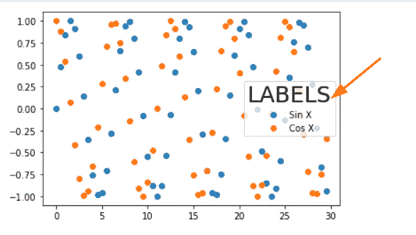
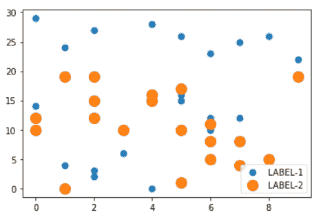

# Matplotlib 散点图图例

> 原文：<https://pythonguides.com/matplotlib-scatter-plot-legend/>

[](https://sharepointsky.teachable.com/p/python-and-machine-learning-training-course)

在本 [Matplotlib 教程](https://pythonguides.com/what-is-matplotlib/)中，我们将讨论 **Matplotlib 散点图图例**。在这里，我们将使用 matplotlib 介绍与散点图图例相关的不同示例。我们还将讨论以下主题:

*   Matplotlib 散点图图例
*   Matplotlib 散点图图例示例
*   Matplotlib 散点图图例位置
*   Python 散点图外部图例
*   Matplotlib 散点图图例标题
*   Matplotlib 散点图图例面颜色
*   Matplotlib 散点图显示图例
*   Python seaborn 散点图外部图例
*   Matplotlib 散点图图例大小
*   Python 散点图图例标记大小
*   按颜色排列的散点图图例

目录

[](#)

*   [Matplotlib 散点图图例](#Matplotlib_scatter_plot_legend "Matplotlib scatter plot legend")
*   [Matplotlib 散点图图例示例](#Matplotlib_scatter_plot_legend_example "Matplotlib scatter plot legend example")
*   [Matplotlib 散点图图例位置](#Matplotlib_scatter_plot_legend_position "Matplotlib scatter plot legend position")
    *   [图例的右上位置](#Upper_Right_Position_of_Legend "Upper Right Position of Legend")
    *   [图例的左上角位置](#Upper_Left_Position_of_Legend "Upper Left Position of Legend")
    *   [图例的左下位置](#Lower_left_Position_of_Legend "Lower left Position of Legend")
    *   [图例的右下位置](#Lower_Right_Position_of_Legend "Lower Right Position of Legend")
    *   [图例右侧位置](#Right_Position_of_Legend "Right Position of Legend")
    *   [图例的中心左侧位置](#Center_Left_Position_of_Legend "Center Left Position of Legend")
    *   [图例的中心右侧位置](#Center_Right_Position_of_Legend "Center Right Position of Legend")
    *   [图例的下中心位置](#Lower_Center_Position_of_Legend "Lower Center Position of Legend")
    *   [图例的上中心位置](#Upper_Center_Position_of_Legend "Upper Center Position of Legend")
    *   [图例的中心位置](#Center_Position_of_Legend "Center Position of Legend")
*   [Python 散点图图例外](#Python_scatter_plot_legend_outside "Python scatter plot legend outside")
*   [Matplotlib 散点图图例标题](#Matplotlib_scatter_plot_legend_title "Matplotlib scatter plot legend title")
*   [Matplotlib 散点图图例面颜色](#Matplotlib_scatter_plot_legend_facecolor "Matplotlib scatter plot legend facecolor")
*   [Matplotlib 散点图显示图例](#Matplotlib_scatter_plot_show_legend "Matplotlib scatter plot show legend")
*   [Python seaborn 散点图传奇外](#Python_seaborn_scatter_plot_legend_outside "Python seaborn scatter plot legend outside")
*   [Matplotlib 散点图图例尺寸](#Matplotlib_scatter_plot_legend_size "Matplotlib scatter plot legend size")
*   [Python 散点图图例标记大小](#Python_scatter_plot_legend_marker_size "Python scatter plot legend marker size")
*   [Matplotlib 散点图图例颜色](#Matplotlib_scatter_plot_legend_by_color "Matplotlib scatter plot legend by color")

## Matplotlib 散点图图例

在本节中，我们将了解如何在 Python 的 matplotlib 中向散点图添加图例。现在在开始这个话题之前，我们首先要了解一下**【传说】**是什么意思，以及**【散点图制作】**是如何产生的。

> ***图例*** 是勾勒出剧情元素的区域。

> ***散点图*** 是沿两个轴绘制两个变量数值的图形。它代表了数据集中两个变量之间的关系。

**以下步骤用于绘制散点图并为其添加图例，概述如下:**

*   **定义库:**导入数据创建和操作所需的重要库( `Numpy` 和 `Pandas` )和数据可视化所需的重要库( `pyplot` from matplotlib)。
*   **定义 X 和 Y:** 定义用于 X 轴和 Y 轴的数据坐标值。
*   **绘制散点图:**使用**散点图()**方法我们可以绘制一个图。
*   **添加图例:**通过使用 `legend()` 方法，我们可以给一个图形添加一个图例。
*   **生成绘图:**使用 `show()` 方法在用户窗口上可视化绘图。

## Matplotlib 散点图图例示例

我们可以使用 matplotlib 模块向绘图添加一个图例。我们使用`matplotlib . py plot . legend()`方法标出并标记图中的元素。

**向图中添加图例的语法:**

```py
matplotlib.pyplot.legend(["Title"], ncol=1, loc="upper left", bbox_to_anchor=(1,1))
```

**上面使用的参数描述如下:**

*   **标题:**指定要添加的标签。
*   **ncol:** 表示图例中的列数。
*   **loc:** 代表图例的位置。
*   **bbox_to_anchor:** 表示图例在图上的坐标。

**让我们看一个带有图例的散点图示例:**

```py
**# Import libraries** 
import matplotlib.pyplot as plt

**# Define Data** 
x =  [1, 2, 3, 4, 5]
y1 = [5, 10, 15, 20, 25]
y2 = [10, 20, 30, 40, 50]

**# Scatter Plot** 
plt.scatter(x, y1)
plt.scatter(x, y2)

**# Add legend** 
plt.legend(["x*5" , "x*10"])

**# Display** 
plt.show()
```

*   在上面的例子中，我们导入 matplotlib 的 `pyplot` 模块。
*   之后，我们定义数据坐标。
*   `plt.scatter()` 方法用于绘制散点图。
*   `plt.legend()` 方法用于给绘图添加一个图例。
*   `plt.show()` 方法用于在用户屏幕上可视化绘图。


plt.legend()

另外，请阅读: [Matplotlib 另存为 png](https://pythonguides.com/matplotlib-save-as-png/)

## Matplotlib 散点图图例位置

这里我们将学习如何在散点图的特定位置添加图例。matplotlib 中有不同的位置可用于放置图例。

**让我们用例子来看看图例的不同位置:**

### 图例的右上位置

我们使用 `legend()` 方法添加一个图例，并传递 `loc` 参数来设置图例的位置。这里我们将其位置设置为**右上角**。

**语法如下:**

```py
matplotlib.pyplot.legend(["Title"], loc='upper right')
```

**举例:**

```py
**# Import libraries** 
import matplotlib.pyplot as plt

**# Define Data** 
x =  [1, 2, 3, 4, 5]
y1 = [5, 10, 15, 13.6, 16]
y2 = [10, 20, 16.3, 4.8, 9]

**# Scatter Plot** 
plt.scatter(x, y1, s=50)
plt.scatter(x, y2, s=50)

**# Add legend** 
plt.legend(["Label-1" , "Label-2"], loc= 'upper right')

**# Display** 
plt.show()
```

*   在上面的例子中，我们使用 `legend()` 方法向散点图添加一个图例，我们将 `loc` 作为参数传递，并将其值设置为**右上角的**。


plt.legend(loc=’upper right’)

### 图例的左上角位置

我们使用**图例()**方法添加图例，并通过 `loc` 参数设置图例的位置。在这里，我们将其位置设置为**左上角**。

**语法如下:**

```py
matplotlib.pyplot.legend(["Title"], loc='upper left')
```

**举例:**

```py
**# Import library** 
import matplotlib.pyplot as plt

**# Define Data** 
x =  [1, 2, 3, 4, 5]
y1 = [5, 10, 15, 20, 25]
y2 = [10, 20, 30, 40, 50]

**# Scatter Plot** 
plt.scatter(x, y1)
plt.scatter(x, y2)

**# Add legend** 
plt.legend(["x*5" , "x*10"], loc='upper left')

**# Display**

plt.show()
```

*   在上面的例子中，我们使用 `legend()` 方法向散点图添加一个图例，我们将 `loc` 作为参数传递，并将其值设置为**左上角的**。


plt.legend(loc=upper left)

### 图例的左下位置

我们使用 `legend()` 方法添加一个图例，并传递 `loc` 参数来设置图例的位置。这里我们将其位置设置为左下方的**。**

 ****语法如下:**

```py
matplotlib.pyplot.legend(["Title"], loc='lower left')
```

**举例:**

```py
**# Import library** 
import matplotlib.pyplot as plt

**# Define Data** 
x =  [1, 2, 3, 4, 5]
y1 = [5, 10, 15, 13.6, 16]
y2 = [10, 20, 16.3, 4.8, 9]

**# Scatter Plot** 
plt.scatter(x, y1, s=150, zorder=1.5)
plt.scatter(x, y2, s=150, zorder=1.5)

**# Add legend** 
plt.legend(["Label-1" , "Label-2"], loc= 'lower left')

**# Display** 
plt.show()
```

*   在上面的例子中，我们使用 `legend()` 方法向散点图添加一个图例，我们将 `loc` 作为参数传递，并将其值设置为左下方的**。**
*   **我们还使用了 `zorder` 参数，以便在散点上方得到图例。**

**

plt.legend(loc=’lower left’)

读取: [Matplotlib savefig 空白图像](https://pythonguides.com/matplotlib-savefig-blank-image/)

### 图例的右下位置

我们使用 `legend()` 方法添加一个图例，并传递 `loc` 参数来设置图例的位置。这里我们将其位置设置为**右下角**。

**语法如下:**

```py
matplotlib.pyplot.legend(["Title"], loc='lower right')
```

**举例:**

```py
**# Import library** 
import matplotlib.pyplot as plt
import numpy as np

**# Define Data** 
x = np.arange(0, 20, 0.2)
y1 = np.sin(x)
y2 = np.cos(x)

**# Scatter Plot** 
plt.scatter(x, y1, s=150, zorder=1.5)
plt.scatter(x, y2, s=150, zorder=1.5)

**# Add legend** 
plt.legend(["Label-1" , "Label-2"], loc= 'lower right')

**# Display** 
plt.show()
```

*   在上面的例子中，我们使用 `legend()` 方法向散点图添加一个图例。
*   我们将 `loc` 作为参数传递，并将其值设置为**右下角的**。
*   我们还使用 `zorder` 参数来获得散点上方的图例。


plt.legend(loc= ‘lower right’)

### 图例右侧位置

我们使用 `legend()` 方法添加一个图例，并传递 `loc` 参数来设置图例的位置。这里我们将其位置设置为**右侧**。

**语法如下:**

```py
matplotlib.pyplot.legend(["Title"], loc='right')
```

**举例:**

```py
**# Import library** 
import matplotlib.pyplot as plt
import numpy as np

**# Define Data** 
x = np.random.randint(450,size=(80))
y1 = np.random.randint(260, size=(80))
y2 = np.random.randint(490, size=(80))

**# Scatter Plot** 
plt.scatter(x, y1, s=150, zorder=1.5)
plt.scatter(x, y2, s=150, zorder=1.5)

**# Add legend** 
plt.legend(["Label-1" , "Label-2"], loc= 'right')

**# Display** 
plt.show()
```

*   在上面的例子中，我们使用 `legend()` 方法向散点图添加一个图例，我们还使用 `zorder` 参数在散点上方获得一个图例。
*   我们将 `loc` 作为参数传递，并将其值设置为**右**。


plt.legend(loc=’right’)

阅读: [Matplotlib 条形图标签](https://pythonguides.com/matplotlib-bar-chart-labels/)

### 图例的中心左侧位置

我们使用 `legend()` 方法添加一个图例，并传递 `loc` 参数来设置图例的位置。在这里我们将其位置设置为**的中左**。

**语法如下:**

```py
matplotlib.pyplot.legend(["Title"], loc='center left')
```

**举例:**

```py
**# Import library** 
import matplotlib.pyplot as plt
import numpy as np

**# Define Data** 
x = np.arange(0, 20, 0.2)
y1 = np.sin(x)
y2 = np.cos(x)

**# Scatter Plot** 
plt.scatter(x, y1, s=150, zorder=1.5)
plt.scatter(x, y2, s=150, zorder=1.5)

**# Add legend** 
plt.legend(["Sin X" , "Cos X"], loc= 'center left')

**# Display** 
plt.show()
```

*   在上面的例子中，我们使用 `legend()` 方法向散点图添加一个图例，我们还使用 `zorder` 参数在散点图上方获得一个图例。
*   我们将 `loc` 作为参数传递，并将其值设置为**中心左侧**。


plt.legend(loc=’center left’)

### 图例的中心右侧位置

我们使用 `legend()` 方法添加一个图例，并传递 `loc` 参数来设置图例的位置。这里我们将它的位置设置为**的中间偏右**。

**语法如下:**

```py
matplotlib.pyplot.legend(["Title"], loc='center right')
```

**举例:**

```py
**# Import library** 
import matplotlib.pyplot as plt
import numpy as np

**# Define Data** 
x = np.arange(0, 20, 0.2)
y1 = np.sin(x)
y2 = np.exp(x)

**# Scatter Plot** 
plt.scatter(x, y1, zorder=1.5)
plt.scatter(x, y2, zorder=1.5)

**# Add legend** 
plt.legend(["Sin X" , "Exp X"], loc= 'center right')

**# Display** 
plt.show()
```

*   在上面的例子中，我们使用 `legend()` 方法向散点图添加一个图例
*   我们还使用 `zorder` 参数在上面得到一个图例来散布点。
*   我们将 `loc` 作为参数传递，并将其值设置为**中心右侧**。


plt.legend(loc=’center right’)

读取: [Matplotlib 绘图误差线](https://pythonguides.com/matplotlib-plot-error-bars/)

### 图例的下中心位置

我们使用 `legend()` 方法添加一个图例，并传递 `loc` 参数来设置图例的位置。这里我们将其位置设置为**的下中心**。

**语法如下:**

```py
matplotlib.pyplot.legend(["Title"], loc='lower center')
```

**举例:**

```py
**# Import library** 
import matplotlib.pyplot as plt
import numpy as np
 **# Define Data** 
x = np.arange(0, 20, 0.2)
y1 = np.cos(x)
y2 = np.exp(x)

**# Scatter Plot** 
plt.scatter(x, y1, zorder=1.5)
plt.scatter(x, y2, zorder=1.5)

**# Add legend** 
plt.legend(["Cos X" , "Exp X"], loc= 'lower center')

**# Display** 
plt.show()
```

*   在上面的例子中，我们使用 `legend()` 方法向散点图添加一个图例，我们将 `loc` 作为参数传递，并将其值设置为**的下中心**。


plt.legend(loc=’lower center’)

### 图例的上中心位置

我们使用 `legend()` 方法添加一个图例，并传递 `loc` 参数来设置图例的位置。这里我们将它的位置设置为**的上中心**。

**语法如下:**

```py
matplotlib.pyplot.legend(["Title"], loc='upper center')
```

**举例:**

```py
**# Import library**

import matplotlib.pyplot as plt
import numpy as np

**# Define Data**

x = np.linspace(0,15,150)
y1 = np.sin(x)
y2 = np.cos(x)

**# Scatter Plot**

plt.scatter(x, y1, zorder=1.5)
plt.scatter(x, y2, zorder=1.5)

**# Add legend**

plt.legend(["Sin X" , "Cos X"], loc= 'upper center')

**# Display**

plt.show()
```

*   在上面的例子中，我们使用 `legend()` 方法向散点图添加一个图例，我们将 `loc` 作为参数传递，并将其值设置为**上中心**。


plt.legend(loc=’upper center’)

阅读: [Matplotlib 旋转刻度标签](https://pythonguides.com/matplotlib-rotate-tick-labels/)

### 图例的中心位置

我们使用 `legend()` 方法添加一个图例，并传递 `loc` 参数来设置图例的位置。这里我们将其位置设置为**中心**。

**语法如下:**

```py
matplotlib.pyplot.legend(["Title"], loc='center')
```

**举例:**

```py
**# Import library** 
import matplotlib.pyplot as plt
import numpy as np

**# Define Data** 
x = np.linspace(0,15,150)
y1 = np.tan(x)
y2 = np.exp(4*x)

**# Scatter Plot** 
plt.scatter(x, y1, zorder=1.5)
plt.scatter(x, y2, zorder=1.5)

**# Add legend** 
plt.legend(["Tan X" , "Exp X"], loc= 'center')

**# Display** 
plt.show()
```

*   在上面的例子中，我们使用 `legend()` 方法向散点图添加一个图例
*   我们还使用 `zorder` 参数在上面得到一个图例来散布点。
*   我们将 `loc` 作为参数传递，并将其值设置为**中心**。


plt.legend(loc=’center’)

读取: [Matplotlib 改变背景颜色](https://pythonguides.com/matplotlib-change-background-color/)

## Python 散点图图例外

在这里，我们将学习如何在 Matplotlib 中的绘图之外添加图例。通过使用 `bbox_to_anchor` ,我们可以将图例放置在绘图之外。

`bbox_to_anchor` 指定图例框的位置。 `bbox` 的意思是包围盒。

**在图外添加图例的语法如下:**

```py
matplotlib.pyplot.legend(['Legend'], bbox_to_anchor=(x, y, width, height), loc= )
```

**上面使用的参数如下:**

*   **x:** 指定图例框在 x 轴上的位置。
*   **y:** 指定图例框在 y 轴上的位置。
*   **宽度:**指定图例框的宽度。
*   **高度:**指定图例框的高度。
*   **loc:** 指定图例框的位置。

**让我们来看看在剧情之外绘制传奇的例子:**

**例#1**

```py
**# Import library** 
import matplotlib.pyplot as plt
import numpy as np

**# Define Data** 
x = np.arange(0, 20, 0.2)
y1 = np.sin(x)
y2 = np.cos(x)

**# Scatter Plot** 
plt.scatter(x, y1, s=100)
plt.scatter(x, y2, s=100)

**# Add legend outside the plot** 
plt.legend(['Sin X', 'Cos X'], bbox_to_anchor=(1.22,0.5), loc= 'upper right')

**# Display** 
plt.show()
```

*   在上面的例子中，我们导入了 `pyplot` 和 `numpy` matplotlib 模块。
*   之后，我们使用 numpy 的 `arange()` 、 `sin()` 和 `cos()` 方法来定义数据。
*   `plt.scatter()` 方法用于绘制散点图。
*   `plt.legend()` 方法用于将图例添加到绘图中，我们通过 `bbox_to_anchor` 参数来指定绘图外的图例位置。
*   我们还通过 `loc` 作为参数来指定图例的位置。
*   `plt.show()` 方法用于在用户屏幕上可视化绘图。


plt.legend(bbox_to_anchor=())

**例 2**

```py
**# Import library** 
import matplotlib.pyplot as plt
import numpy as np

**# Define Data** 
x = [14, 24, 43, 47, 54, 66, 74, 89, 12,
      44, 1, 2, 3, 4, 5, 9, 8, 7, 6, 5]

y1 = [0, 1, 2, 3, 4, 5, 6, 7, 8, 9, 6, 3,
      5, 2, 4, 1, 8, 7, 0, 5]

y2 = [9, 6, 3, 5, 2, 4, 1, 8, 7, 0, 1, 2, 
      3, 4, 5, 6, 7, 8, 9, 0]

**# Scatter Plot** 
plt.scatter(x, y1, s=150)
plt.scatter(x, y2, s=150)

**# Add legend** 
plt.legend(["Label-1" , "Label-2"], bbox_to_anchor=(-0.1, 0.75))

**# Display** 
plt.show()
```

这里我们使用带有 `bbox_to_anchor` 参数的 `plt.legend()` 方法在情节外添加一个图例。


bbox_to_anchor()

阅读: [Matplotlib 散点图标记](https://pythonguides.com/matplotlib-scatter-marker/)

## Matplotlib 散点图图例标题

在这里，我们将学习如何在 matplotlib 中为图例添加标题。

要添加标题，我们必须将**标题**作为参数传递给**图例()**方法，我们还可以通过将**标题 _ 字体大小**作为参数来设置标题的大小。

**语法如下:**

```py
matplotlib.pyplot.legend(title= , title_fontsize= , ['Labels'] , loc= )
```

**让我们看一个标题为**的图例示例

```py
**# Import library** 
import matplotlib.pyplot as plt
import numpy as np

**# Define Data** 
x = np.arange(0, 30, 0.5)
y1 = np.sin(x)
y2 = np.cos(x)

**# Scatter Plot** 
plt.scatter(x, y1)
plt.scatter(x, y2)

**# Add legend with title** 
plt.legend(['Sin X', 'Cos X'], title='LABELS',  
           title_fontsize= 25,
 loc= 'best')

**# Display** 
plt.show()
```

*   在上面的例子中，我们使用 `plt.legend()` 方法在绘图中添加一个图例。
*   我们通过**标签**、**标题**、**标题 _ 字体大小**、**锁定**作为参数。



*“Legend with Title”*

阅读: [Matplotlib 虚线](https://pythonguides.com/matplotlib-dashed-line/)

## Matplotlib 散点图图例面颜色

这里我们将学习如何在 matplotlib 中改变散点图中图例的颜色。要更改颜色，请将参数 `facecolor` 传递给 `legend()` 方法。

**改变散点图图例面颜色的语法:**

```py
matplotlib.pyplot.legend(['label'], facecolor=None)
```

**以上参数为:**

*   **标签:**定义标签。
*   **面颜色:**指定图例的面颜色。

**我们来看一个例子:**

```py
**# Import library** 
import matplotlib.pyplot as plt
import numpy as np

**# Define Data** 
x = np.linspace(0,10,25)
y1 = np.cos(x)
y2 = np.sin(x)

**# Scatter Plot** 
plt.scatter(x, y1)
plt.scatter(x, y2)

**# Add legend and change color** 
plt.legend(["Cos X" , "Sin X"], loc= 'lower left', 
            facecolor='yellow')

**# Display** 
plt.show()
```

这里我们使用一个 `plot.legend()` 方法，并传递 `facecolor` 作为参数来设置它的 `facecolor` 。


*” Legend With Facecolor “*

读取: [Matplotlib 日志日志图](https://pythonguides.com/matplotlib-log-log-plot/)

## Matplotlib 散点图显示图例

这里我们学习如何在散点图中显示图例。有时用户在**绘图方法**中定义**标签**，而不使用**图例()**方法。在这种情况下，不会显示图例。

**我们来看一个例子:**

**例#1**

在这个例子中，我们在**散点()**方法中定义了**标签**，而没有使用**图例()**方法。

```py
**# Import library** 
import matplotlib.pyplot as plt
import numpy as np

**# Define Data** 
x =  np.random.randint(100,size=(80))
y1 = np.random.randint(150, size=(80))
y2 = np.random.randint(200, size=(80))

**# Scatter Plot and define label** 
plt.scatter(x, y1, label='LABEL-1')
plt.scatter(x, y2, label='LABEL-2')

**# Display** 
plt.show()
```

在上面的例子中，我们使用 `plt.scatter()` 方法来绘制散点图，并通过**标签**作为参数来定义图例标签。


plt.scatter(label= )

在这里我们看到这个图例没有在这个图中显示出来。

**例 2**

在这个例子中，我们在**散点()**方法中定义了**标签**，并且使用了**图例()**方法。

```py
**# Import library** 
import matplotlib.pyplot as plt
import numpy as np

**# Define Data** 
x = np.random.randint(100,size=(80))
y1 = np.random.randint(150, size=(80))
y2 = np.random.randint(200, size=(80))

**# Scatter Plot and define label** 
plt.scatter(x, y1, label='LABEL-1')
plt.scatter(x, y2, label='LABEL-2')

**# Add legend** 
plt.legend()

**# Display** 
plt.show()
```

在上面的例子中，我们使用 `plt.scatter()` 方法来绘制散点图，并通过**标签**作为参数来定义图例标签。并且我们使用 `plt.legend()` 的方法来显示图例。


plt.legend()

这里我们看到图例是通过使用 `plt.legend()` 方法显示在散点图中的。

阅读:[堆积条形图 Matplotlib](https://pythonguides.com/stacked-bar-chart-matplotlib/)

## Python seaborn 散点图传奇外

在这里，我们学习如何绘制海浪散点图并在外面添加图例。

使用 `sns.scatterplot()` 方法绘制 seaborn 散点图，我们使用 `plt.legend()` 方法添加图例。

**我们来看一个例子:**

```py
**# Import library** 
import pandas as pd
import seaborn as sns
import matplotlib.pyplot as plt

**# Define data** 
df = pd.DataFrame({'Maths': [5, 12, 15, 13, 10, 9, 8, 6, 15, 
                            20, 16, 13, 15],
                   'Science': [3, 6, 9, 2, 6, 7, 3, 1, 2.5,  
                               6.9, 4, 2, 1],
                   'favour':  
                   ['Like','Dislike','Dislike','Like',      
                    'Like', 'Like','Dislike', 
                    'Dislike','Dislike', 'Like', 'Like', 
                    'Like', 'Dislike']})

**# create scatterplot** 
sns.scatterplot(data=df, x='Maths', y='Science', hue='favour')

**# Legend outside** 
plt.legend(bbox_to_anchor=(1.02, 1), loc='upper left')

**# Display** 
plt.show()
```

*   在上面的例子中，我们导入了**熊猫**、**海豹**和 `pyplot` 库。
*   然后我们通过使用**数据帧**来定义数据。
*   之后，我们使用 `sns.scatterplot()` 方法创建一个 seaborn 散点图。
*   `plt.legend()` 方法用于给绘图添加一个图例。


Seaborn Scatter Plot With Legend

阅读: [Matplotlib 两个 y 轴](https://pythonguides.com/matplotlib-two-y-axes/)

## Matplotlib 散点图图例尺寸

在这里，我们将学习如何将图例中的点的大小设置为固定值。有时我们用不同的标记大小绘制散点图，但我们希望图例中的标记大小是固定的。

**我们来看一个例子:**

**示例:图例尺寸不固定**

```py
**# Import library** 
import matplotlib.pyplot as plt
import numpy as np

**# Define Data** 
x = np.random.randint(10,size=(20))
y1 = np.random.randint(30, size=(20))
y2 = np.random.randint(20, size=(20))

**# Scatter Plot and define label** 
plt.scatter(x, y1, s= 50, label='LABEL-1')
plt.scatter(x, y2, s= 150, label='LABEL-2')

**# Add legend** 
plt.legend()

**# Display** 
plt.show()
```

*   在上面的例子中，我们通过使用 `plt.scatter()` 方法绘制了一个散点图，并且我们将 `s` 作为参数来设置散点图标记的大小。
*   `plt.legend()` 方法用于给绘图添加一个图例。



Not Fixed Size Legend

这里您可以看到图例处的标签 1 标记和标签 2 标记具有不同的大小。

**示例:` `其中图例大小固定**

```py
**# Import library** 
import matplotlib.pyplot as plt
import numpy as np

**# Define Data** 
x = np.random.randint(10,size=(20))
y1 = np.random.randint(30, size=(20))
y2 = np.random.randint(20, size=(20))

**# Scatter Plot and define label** 
plt.scatter(x, y1, s= 50, label='LABEL-1')
plt.scatter(x, y2, s= 150, label='LABEL-2')

**# Add legend fixed size** 
lgnd = plt.legend(loc="upper right", scatterpoints=1, fontsize=10)
lgnd.legendHandles[0]._sizes = [30]
lgnd.legendHandles[1]._sizes = [30]

**# Display** 
plt.show()
```

这里我们使用 `plt.legend()` 方法向散点图添加一个图例。为了设置图例点的固定大小，我们使用 **legendHandles[]。尺寸**。


*” Scatter Plot having Fixed Size Legend Point”*

读取:[水平线 matplotlib](https://pythonguides.com/horizontal-line-matplotlib/)

## Python 散点图图例标记大小

在这里，我们将学习如何绘制带有图例标记大小的散点图。

**我们来看一个例子:**

```py
**# Import library** 
import matplotlib.pyplot as plt
import numpy as np

**# Define Data** x, y = np.random.rand(2, 30)
color = np.random.randint(1, 40, size=30)
size = np.random.randint(40, 150, size=30)

**# Add subplot** 
fig, ax = plt.subplots()

**# Scatter plot** 
scatter = ax.scatter(x, y, c=color, s=size)

**# Add legend** 
handles, labels = scatter.legend_elements(prop="sizes")
legnd = ax.legend(handles, labels, loc="upper right", title="Sizes")

**# Display** 
plt.show()
```

*   这里我们使用了 `legend_elements()` 方法，并将 `prop` 作为参数传递，并将其值设置为标记的大小。
*   并且我们还使用 `plt.legend()` 方法给情节添加一个图例，并且我们传递**句柄**、**标签**、 `loc` 、**标题**作为参数。


*” Legend Marker Size “*

阅读:[模块“matplotlib”没有属性“artist”](https://pythonguides.com/module-matplotlib-has-no-attribute-artist/)

## Matplotlib 散点图图例颜色

在这里，我们将学习如何用颜色绘制图例。

**我们来看一个例子:**

```py
**# Import Library** 
import matplotlib.pyplot as plt
from numpy.random import random

**# Define color data** 
colors = ['b', 'c', 'y', 'm', 'r']

**# Plot** 
data1 = plt.scatter(random(10), random(10), marker='o', color=colors[0],label='Label 1')
data2 = plt.scatter(random(10), random(10), marker='o', color=colors[0],label='Label 2')
data3 = plt.scatter(random(10), random(10), marker='o', color=colors[1],label='Label 3')
data4 = plt.scatter(random(10), random(10), marker='o', color=colors[2],label='Label 4')
data5 = plt.scatter(random(10), random(10), marker='o', color=colors[3],label='Label 5')
data6 = plt.scatter(random(10), random(10), marker='o', color=colors[4],label='Label 6')
data7 = plt.scatter(random(10), random(10), marker='o', color=colors[4],label='Label 7')

**# Add legend** 
plt.legend(loc='upper center', bbox_to_anchor=(0.5, -0.08), ncol=3)

**# Display** 
plt.show()
```

*   在上面的例子中，我们使用定义的颜色数据，然后使用 `scatter()` 方法绘制散点图。
*   在此之后，我们使用 `legend()` 方法在情节中添加一个图例，并使用 `bbox_to_anchor()` 在外部添加图例。


另外，请查看以下关于 Python Matplotlib 的文章。

*   [Matplotlib x 轴标签](https://pythonguides.com/matplotlib-x-axis-label/)
*   [Matplotlib fill_between](https://pythonguides.com/matplotlib-fill_between/)
*   [Matplotlib set _ yticklabels](https://pythonguides.com/matplotlib-set_yticklabels/)

在本 Python 教程中，我们已经讨论了**“Matplotlib 散点图图例”**，并且我们还涵盖了一些与之相关的示例。这些是我们在本教程中讨论过的以下主题。

*   Matplotlib 散点图图例
*   Matplotlib 散点图图例示例
*   Matplotlib 散点图图例位置
*   Python 散点图外部图例
*   Matplotlib 散点图图例标题
*   Matplotlib 散点图图例面颜色
*   Matplotlib 散点图显示图例
*   Python seaborn 散点图外部图例
*   Matplotlib 散点图图例大小
*   Python 散点图图例标记大小
*   按颜色排列的散点图图例

[Bijay Kumar](https://pythonguides.com/author/fewlines4biju/)

Python 是美国最流行的语言之一。我从事 Python 工作已经有很长时间了，我在与 Tkinter、Pandas、NumPy、Turtle、Django、Matplotlib、Tensorflow、Scipy、Scikit-Learn 等各种库合作方面拥有专业知识。我有与美国、加拿大、英国、澳大利亚、新西兰等国家的各种客户合作的经验。查看我的个人资料。

[enjoysharepoint.com/](https://enjoysharepoint.com/)[](https://www.facebook.com/fewlines4biju "Facebook")[](https://www.linkedin.com/in/fewlines4biju/ "Linkedin")[](https://twitter.com/fewlines4biju "Twitter")****