# Matplotlib 辅助 y 轴[完整指南]

> 原文：<https://pythonguides.com/matplotlib-secondary-y-axis/>

[](https://sharepointsky.teachable.com/p/python-and-machine-learning-training-course)

在本 [Python 教程](https://pythonguides.com/learn-python/)中，我们将讨论 Python 中的 **Matplotlib 辅助 y 轴**。在这里，我们将使用 [matplotlib](https://pythonguides.com/what-is-matplotlib/) 涵盖与辅助 y 轴相关的不同示例。我们还将讨论以下主题:

*   Matplotlib 辅助 y 轴限制
*   Matplotlib 辅助 y 轴标签
*   Matplotlib 辅助 y 轴对数刻度
*   Matplotlib 辅助 y 轴颜色
*   Matplotlib 辅助 y 轴对齐 0
*   Matplotlib 辅助 y 轴子图
*   Matplotlib 辅助 y 轴直方图
*   Matplotlib 散点图辅助 y 轴
*   Matplotlib 辅助 y 轴刻度
*   Matplotlib 第二个 y 轴熊猫

目录

[](#)

*   [Matplotlib 辅助 y 轴限值](#Matplotlib_secondary_y-axis_limits "Matplotlib secondary y-axis limits")
*   [Matplotlib 辅助 y 轴标签](#Matplotlib_secondary_y-axis_label "Matplotlib secondary y-axis label")
*   [Matplotlib 辅助 y 轴对数刻度](#Matplotlib_secondary_y-axis_log_scale "Matplotlib secondary y-axis log scale")
*   [Matplotlib 辅助 y 轴颜色](#Matplotlib_secondary_y-axis_color "Matplotlib secondary y-axis color")
*   [Matplotlib 辅助 y 轴对齐 0](#Matplotlib_secondary_y-axis_align_0 "Matplotlib secondary y-axis align 0")
*   [Matplotlib 辅助 y 轴子图](#Matplotlib_secondary_y-axis_subplot "Matplotlib secondary y-axis subplot")
*   [Matplotlib 辅助 y 轴直方图](#Matplotlib_secondary_y-axis_histogram "Matplotlib secondary y-axis histogram")
*   [Matplotlib 散点图辅助 y 轴](#Matplotlib_scatter_secondary_y-axis "Matplotlib scatter secondary y-axis")
*   [Matplotlib 辅助 y 轴刻度](#Matplotlib_secondary_y-axis_ticks "Matplotlib secondary y-axis ticks")
*   [Matplotlib 第二个 y 轴熊猫](#Matplotlib_second_y-axis_pandas "Matplotlib second y-axis pandas")

## Matplotlib 辅助 y 轴限值

在这里，我们将学习使用 matplotlib 设置辅助 y 轴的轴限制。在 matplotlib 中，我们有不同的函数来设置轴限制。

**功能如下:**

*   ylim()函数
*   set_ylim()函数
*   axis()函数

现在，让我们看看与此相关的不同示例:

**例#1**

这里，我们将绘制一个带有辅助 y 轴的图形，然后使用 `ylim()` 函数设置它的极限。

```py
**# Import Library**

import numpy as np
import matplotlib.pyplot as plt

**# Define Data** 
x = np.arange(200)
y = np.cos(x)

**# Plot Graph** 
fig, ax1 = plt.subplots()
ax1.plot(x, y)

**# Define Labels** 
ax1.set_xlabel('X-axis')
ax1.set_ylabel('Y1-axis')

**# Twin Axes**

ax2 = ax1.twinx()
ax2.set_ylabel('Y2-axis')

**# Set limit** 

plt.ylim(-1, 1)

**# Display**

plt.show() 
```

*   首先导入必要的库，如 `matplotlib.pyplot` 和 `numpy` 。
*   接下来，使用 numpy 的 `arange()` 和 `cos()` 函数定义数据坐标。
*   然后，使用一个 `subplot()` 函数返回包含图形和轴对象的元组。
*   使用 `plot()` 函数绘制一个对应于轴 1 对象的图形。
*   使用 `set_xlabel()` 和 `set_ylabel()` 函数定义 1 轴的标签。
*   然后，使用 `twinx()` 函数创建一个辅助 y 轴。
*   要在辅助 y 轴上设置标签，使用 `set_ylabel()` 函数。
*   然后，使用 `plt.ylim()` 函数设置辅助 y 轴的轴极限。
*   要显示图表，使用 `show()` 功能。

> **注:** 使用 `ylim()` 功能后的 `twinx()` 功能或次 y 轴对象后的。如果你在其他任何地方使用这个函数，它会改变主 y 轴的极限。

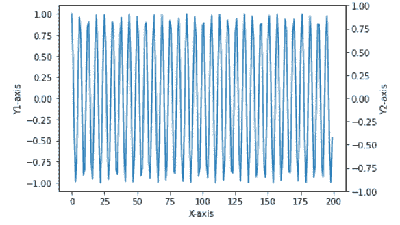

Matplotlib secondary y-axis limits

**例 2**

这里我们将绘制一个带有辅助 y 轴的图形，然后使用 set_ylim()函数设置它的界限。

```py
**# Import Library** 
import numpy as np
import matplotlib.pyplot as plt

**# Define Data**

x = np.arange(50)
y = np.sin(x)

**# Plot Graph**

fig, ax1 = plt.subplots()
ax1.plot(x, y)

**# Define Labels**

ax1.set_xlabel('X-axis')
ax1.set_ylabel('Y1-axis')

**# Twin Axes**

ax2 = ax1.twinx()
ax2.set_ylabel('Y2-axis')

**# Set limit** 

ax2.set_ylim(-1, 1)

**# Display**

plt.show()
```

*   导入用于数据创建的 `numpy` 库。
*   导入 `matplotlib.pyplot` 库进行数据可视化。
*   使用 numpy 的 `arange()` 和 `sin()` 函数定义 x 和 y 坐标。
*   然后，使用一个 **子情节()** 函数返回包含图形和轴对象的元组。
*   使用轴 1 对象的 `plot()` 函数绘制图形。
*   然后使用 `set_xlabel()` 和 `set_ylabel()` 函数在轴上添加标签。
*   使用 `twinx()` 函数创建辅助 y 轴。
*   要设置辅助 y 轴的极限，使用与辅助 y 轴对象对应的 `set_ylim()` 函数。
*   要显示图表，使用 `show()` 功能。

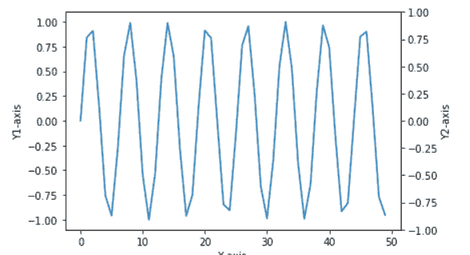

Matplotlib axis limit of secondary y-axis

**例 3**

这里我们将绘制一个带有辅助 y 轴的图形，然后使用 axis()函数设置它的界限。

```py
**# Import Library** 
import numpy as np
import matplotlib.pyplot as plt

**# Define Data**

x = np.arange(50)
y = np.cos(x*50)

**# Plot Graph** 
fig, ax1 = plt.subplots()
ax1.plot(x, y)

**# Define Labels**

ax1.set_xlabel('X-axis')
ax1.set_ylabel('Y1-axis')

**# Twin Axes**

ax2 = ax1.twinx()
ax2.set_ylabel('Y2-axis')

**# Set limit** 

plt.axis([None, None, -1, 1])

**# Display**

plt.show()
```

*   导入 `numpy` 和 `matplotlib.pyplot` 库。
*   接下来，定义数据坐标。
*   要绘制图形，使用对应于轴 1 对象的 `plot()` 函数。
*   要创建辅助 y 轴，使用 `twinx()` 函数。
*   为了设置辅助 y 轴的极限，我们使用 `plt.axis()` 函数。这里我们将 `xmin` 和 `xmax` 的值设置为 `None` ，因为我们不想改变 x 轴的极限。

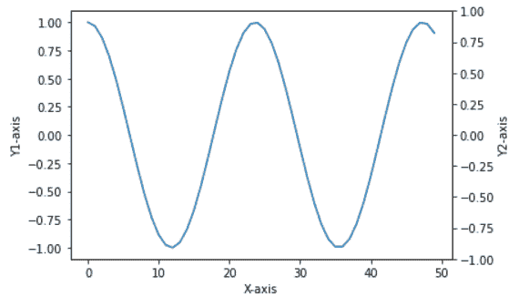

Matplotlib axis range of the secondary y-axis

> **注意:在 `twinx()` 函数之后或者辅助 y 轴 axes 对象之后使用 `axis()` 函数。如果您在其他地方使用此功能，它将改变主 y 轴的限制。**

另外，检查:[什么是 add_axes matplotlib](https://pythonguides.com/add_axes-matplotlib/)

## Matplotlib 辅助 y 轴标签

这里我们将学习使用 matplotlib 在辅助 y 轴上添加一个标签。我们可以使用 `ylabel()` 函数或者 `set_ylabel()` 函数在 y 轴添加标签。

**让我们看看与此相关的例子:**

**例#1**

在这个例子中，我们通过使用 `ylabel()` 方法在辅助 y 轴上添加一个标签。

```py
**# Import Library**

import numpy as np 
import matplotlib.pyplot as plt 

**# Define Data** 
x = np.arange(0, 15, 0.2)
data_1 = np.sin(x)
data_2 = np.exp(x) 

**# Create Plot**

fig, ax1 = plt.subplots() 

ax1.set_xlabel('X-axis') 
ax1.set_ylabel('Primary-axis') 
ax1.plot(x, data_1, color = 'red') 

**# Adding Twin Axes**

ax2 = ax1.twinx() 
ax2.plot(x, data_2, color = 'blue')  

**# Add label** 
plt.ylabel('Secondary-axis') 

**# Show plot**

plt.show()
```

*   导入必要的库，如 `numpy` 和 `matplotlib.pyplot` 。
*   使用 numpy 的 `arange()` 、 `sin()` 、 `exp()` 函数定义数据坐标。
*   然后，使用一个 `subplots()` 函数返回包含 figure 和 axes 1 对象的元组。
*   之后，在 x 轴和主 y 轴添加标签，使用与 axes 对象 1 对应的 `set_xlabel()` 和 `set_ylabel()` 函数。
*   然后，使用 `twinx()` 函数创建辅助 y 轴。
*   要绘制图形，使用 `plot()` 函数。
*   要在辅助 y 轴添加标签，使用 `ylabel()` 函数。注意，创建轴对象 2 后，必须定义函数。
*   为了显示图形，我们使用 `show()` 函数。

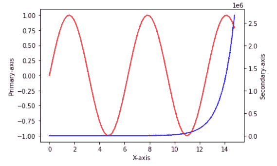

Matplotlib secondary y-axis label

**例 2**

在这个例子中，我们通过使用 `set_ylabel()` 方法在辅助 y 轴上添加一个标签。

```py
**# Import Library**

import numpy as np 
import matplotlib.pyplot as plt 

**# Define Data**

x = np.arange(0, 15, 0.2)
data_1 = np.sin(x)
data_2 = np.exp(x) 

**# Create Plot**

fig, ax1 = plt.subplots() 

ax1.set_xlabel('X-axis') 
ax1.set_ylabel('Primary-axis') 
ax1.plot(x, data_1, color = 'red') 

**# Adding Twin Axes**

ax2 = ax1.twinx() 
ax2.plot(x, data_2, color = 'blue')  

**# Add label**

plt.ylabel('Secondary-axis') 

**# Show plot**

plt.show()
```

*   导入必要的库，如 `numpy` 和 `matplotlib.pyplot` 。
*   接下来，我们使用 `arange()` 、 `sin()` 、 `exp()` 函数来定义数据坐标。
*   要创建第二个 y 轴，使用 `twinx()` 函数。
*   要绘制图表，使用 `plot()` 函数。
*   要在辅助 y 轴添加标签，我们使用与双轴对象对应的 `set_ylabel()` 函数。

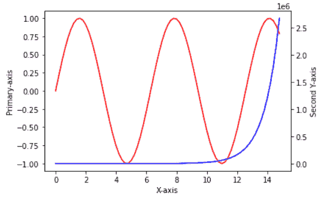

Matplotlib second y-axis label

阅读: [Matplotlib 二维表面图](https://pythonguides.com/matplotlib-2d-surface-plot/)

## Matplotlib 辅助 y 轴对数刻度

在这里，我们将学习使用 matplotlib 创建一个带有对数刻度的辅助 y 轴。

**我们来看一个例子:**

```py
**# Import libraries**

import matplotlib.pyplot as plt
import numpy as np

**# Set figure size**

fig = plt.figure(figsize=(6,5))

**# Create subplot** 
ax = fig.add_subplot(111)

**# Create secondary axes**

ax2 = ax.twinx()

**# Define Data** 

x = np.random.rand(50)
y = np.random.rand(50)
y2 = data = [10**i for i in range(50)]

**# Plot graph**

ax.scatter(x, y, c="b")
ax2.scatter(x, y2, c="r")

**# Set second y-axis to log** 
ax2.set_yscale("log")

**# Add labels**

ax.set_ylabel("Linear axis")
ax2.set_ylabel("Logarithmic axis")

**# Display** 
plt.show()
```

*   导入 `matplotlib.pyplot` 库。
*   导入用于数据创建的 `numpy` 库。
*   要设置图形大小，使用 `figure()` 方法，并将 `figsize` 参数传递给该方法，以设置绘图的宽度和高度。
*   然后，使用一个 `add_subplot()` 函数对应轴 1 对象。
*   之后，创建对应于轴 2 对象的辅助 y 轴。
*   定义数据坐标，使用 `random.rand()` 函数和 `for loop` 和 `range()` 函数。
*   要绘制散点图，使用 `scatter()` 函数。
*   现在，使用 `set_yscale()` 函数以对数刻度形式设置辅助 y 轴。
*   为了在主 y 轴和次 y 轴上设置标签，我们对相应的轴使用 `set_ylabel()` 函数。
*   要显示图表，使用 `show()` 功能。

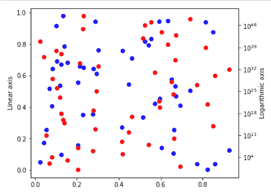

Matplotlib secondary y-axis log scale

阅读: [Matplotlib 时间序列图](https://pythonguides.com/matplotlib-time-series-plot/)

## Matplotlib 辅助 y 轴颜色

这里我们使用 matplotlib 设置辅助 y 轴的颜色。

**我们来看一个例子:**

```py
**# Import Library** 
import numpy as np 
import matplotlib.pyplot as plt 

**# Define Data**

x = np.arange(0, 15, 0.2)
data_1 = np.sin(x)
data_2 = np.cos(x) 

**# Create Plot** 
fig, ax1 = plt.subplots() 

ax1.set_xlabel('X-axis') 
ax1.set_ylabel('Primary-axis') 
ax1.plot(x, data_1, color = 'red') 

**# Adding Twin Axes**

ax2 = ax1.twinx() 
ax2.plot(x, data_2, color = 'blue') 

**# Add label** 
ax2.set_ylabel('Secondary Y-axis', color= 'blue') 
ax2.tick_params(axis='y', color='blue', labelcolor='blue')

**# Show plot** 
plt.show()
```

*   导入 `numpy` 和 `matplotlib.pyplot` 库。
*   接下来，使用 numpy 的 `arange()` 、 `sin()` 、 `cos()` 函数定义数据坐标。
*   使用 axes 对象 1 对应的 `subplots()` 函数创建 subplot。
*   然后我们通过使用 `set_xlabel()` 和 `set_ylabel()` 函数在 x 轴和主 y 轴添加标签。
*   为了绘制图表，我们使用了 `plot()` 函数。
*   为了创建第二个 y 轴，我们使用了 `twinx()` 函数。
*   为了在辅助 y 轴上添加标签，我们使用了 `set_ylabel()` 函数。
*   要将轴标签的颜色设置为与绘制线相同，请将**颜色**参数传递给 `set_ylabel()` 方法。
*   要将刻度和刻度标签的颜色设置为与绘制线相同，请将**颜色**和**标签颜色**参数传递给 `tick_params()` 方法。

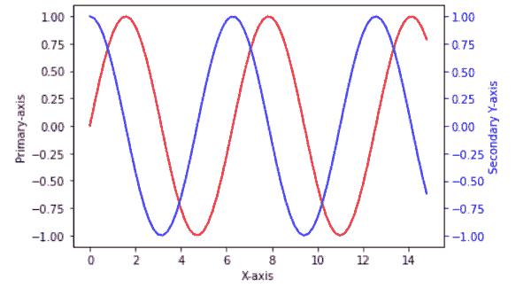

Matplotlib secondary y-axis color

读取: [Matplotlib 设置 y 轴范围](https://pythonguides.com/matplotlib-set-y-axis-range/)

## Matplotlib 辅助 y 轴对齐 0

在这里，我们将通过示例学习使用 matplotlib 将辅助 y 轴对齐到 0。为了将轴对齐到 0，我们将 y 轴的底部设置为 0。

**语法:**

```py
matplotlib.pyplot.ylim(bottom=0)
```

也可以用 set_ylim()或 axis()函数代替 ylim()。

**我们来看一个例子:**

这里我们要用 set_ylim()函数将次 y 轴对齐到 0。

```py
**# Import Library**

import pandas as pd

**# Create DataFrames**

df1 = pd.DataFrame({'year': [1, 2, 3, 4, 5, 6, 7, 8, 9, 10],
                    'profit': [80, 60, 50, 95, 75, 63, 35, 90, 
                               68, 78]})

df2 = pd.DataFrame({'year': [1, 2, 3, 4, 5, 6, 7, 8, 9, 10],
                    'loss': [20, 40, 50, 5, 25, 37, 65, 10, 32, 
                             22]})

**# Print**

print(df1)
print('\n')
print(df2)
```

*   为了创建一个数据框，我们首先需要导入一个 `pandas` 库。
*   我们用 `DataFrame()` 方法生成数据帧。
*   之后，我们使用 `print()` 函数显示两个数据帧。

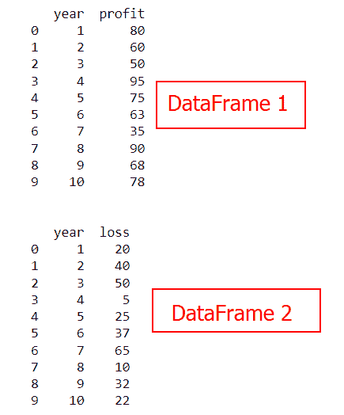

Matplotlib secondary y-axis align 0

```py
**# Import Library**

import matplotlib.pyplot as plt

**# define subplots**

fig,ax = plt.subplots()

**# plot**

ax.plot(df1.year, df1.profit, color='slategrey', marker='o', 
        linewidth=3)

**# add x-axis label**

ax.set_xlabel('Year')

**# add primary y-axis label**

ax.set_ylabel('Profit')

**# define second y-axis**

ax2 = ax.twinx()

**# plot**

ax2.plot(df2.year, df2.loss, color='orange', marker ='o', 
         linewidth=3)

**# Align to 0**

ax2.set_ylim(bottom=0)

**# add second y-axis label** 
ax2.set_ylabel('Loss')

**# Display**

plt.show()
```

*   对于数据可视化，导入 `matplotlib.pyplot` 库。
*   通过调用 axis 对象上的 `subplots()` 函数创建一个 subplot。
*   `plot()` 函数用于创建折线图。
*   我们还将**颜色**、**标记**和**线宽**作为参数来增强情节。
*   `set_xlabel()` 函数用于设置 x 轴上的标签。
*   `set_ylabel()` 函数用于设置主 y 轴上的标签。
*   我们使用 `set_ylim()` 函数，将 `bottom` 参数设置为 `0` ，将次轴对齐到 0。
*   `set_ylabel()` 函数对应于 axes 对象 2，用于设置辅助 y 轴上的标签。
*   `show()` 函数用于显示图形。

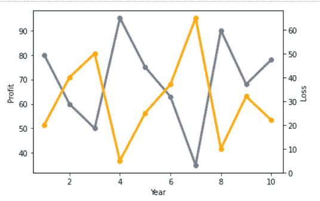

Matplotlib align secondary y-axis to 0

阅读:[Matplotlib xlim–完整指南](https://pythonguides.com/matplotlib-xlim/)

## Matplotlib 辅助 y 轴子图

在这个 matplotlib 教程中，我们将学习如何在支线剧情之间共享辅助 Y 轴。

**让我们看看与此相关的例子:**

**例#1**

在这里，我们为特定的子情节添加一个辅助 y 轴。

```py
**# Import Library**

import numpy as np
import matplotlib.pyplot as plt

**# Define Data**

x = np.arange(20)
y = np.cos(x*60)

**# Define Subplot**

fig, ax = plt.subplots(2, figsize=(8,6))

**# Plot**

ax[0].plot(x, y)

**# Define Labels** 
ax[0].set_xlabel('X-axis')
ax[0].set_ylabel('Y-axis')

**# Twin Axes** 
ax1 = ax[1].twinx()

**# Plot** 
ax[1].plot(x,y)

**# Add Labels** 
ax[1].set_ylabel('Primary Y-axis')
ax1.set_ylabel('Secondary Y-axis')

**# Display**

plt.show()
```

*   导入用于数据创建的 `numpy` 库。
*   导入 `matplotlib.pyplot` 库进行数据可视化。
*   要定义数据坐标，使用 numpy 的 `arange()` 和 `cos()` 方法。
*   之后，使用 `subplots()` 方法创建支线剧情。
*   然后绘制线图，使用 `plot()` 函数。
*   要设置轴标签，使用 `set_xlabel()` 和 `set_ylabel()` 方法。
*   要在第二个图中创建双 y 轴，使用 `twinx()` 函数。
*   `ax1.set_ylabel()` 函数用于添加辅助 y 轴标签。
*   为了显示该图，我们使用 `show()` 方法。

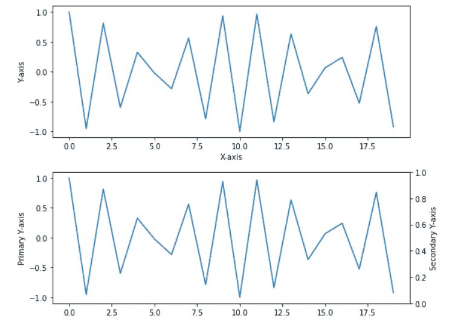

Matplotlib secondary y-axis subplot

阅读: [Matplotlib 饼图教程](https://pythonguides.com/matplotlib-pie-chart/)

## Matplotlib 辅助 y 轴直方图

在这里，我们将学习使用 matplotlib 创建一个带有两个 y 轴的直方图。

**我们来看一个例子:**

```py
**# Import Libraries** 
import matplotlib.pyplot as plt
import numpy as np

**# Define subplot**

fig, ax = plt.subplots()

**# Initialize the random number generator**

np.random.seed(100)

**# Define Data**

data = np.random.randn(1000)

**# Create histogram** 
ax.hist(data, bins=40)

**# Second y-axis**

ax2 = ax.twinx()

**# Create histogram**

ax2.hist(data, bins=40, density=True, cumulative=True, 
         histtype="step", color="lime")

**# Display**

plt.show()
```

*   导入用于数据创建的 `numpy` 库。
*   导入 `matplotlib.pyplot` 进行数据可视化。
*   然后，使用一个 **子情节()** 函数返回包含图形和轴对象的元组。
*   然后使用 `seed()` 方法初始化随机数发生器。要生成随机数，随机数生成器需要一个称为种子值的起始值。
*   然后使用 `random.rand()` 函数生成一个具有所需形状和随机值的数组。
*   使用 `hist()` 函数创建直方图。
*   接下来，使用 `twinx()` 函数创建第二个 y 轴。
*   然后使用 `hist()` 函数创建对应于 twinx 的直方图。
*   然后，我们将以下参数传递给函数 `hist()` 来美化这个情节
    *   **密度:**指定箱子的密度。
    *   **累积:**如果为真，则创建一个直方图，每个条块包含该条块中的计数以及所有较小值的条块。数据点的总数显示在最后一个框中。
    *   **hisstype:** 设置直方图的类型。我们将其设置为 step，这将生成一个线图。
    *   **颜色:**指定颜色。

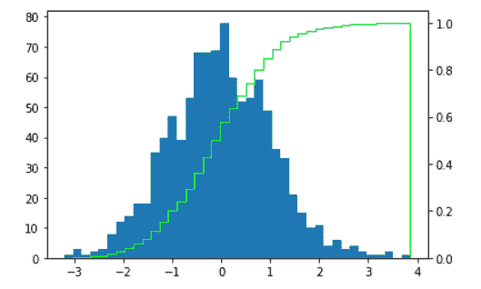

Matplotlib secondary y-axis histogram

读取: [Matplotlib 更新循环中的绘图](https://pythonguides.com/matplotlib-update-plot-in-loop/)

## Matplotlib 散点图辅助 y 轴

在这里，我们将学习使用 matplotlib 创建具有两个 y 轴的散点图。

**我们来看一个例子:**

这里我们创建了一个带有两个 y 轴的散点图。

```py
**# Import Library** 
import numpy as np 
import matplotlib.pyplot as plt 

**# Define Data**

name = ['Ava', 'Noah', 'Charlotte', 'Robert', 'Patricia']
weight_kg = [45, 60, 50, 75, 53]
height_cm = [162, 175, 155, 170, 168]

**# Create Plot**

fig, ax1 = plt.subplots() 

**# Add labels** 
ax1.set_xlabel('X-axis') 
ax1.set_ylabel('Primary Y-axis') 
ax1.scatter(name, weight_kg ,color = 'red') 

**# Adding Twin Axes**

ax2 = ax1.twinx() 
ax2.scatter(name, height_cm, color = 'blue') 

**# Add label at second y-axis**

ax2.set_ylabel('Secondary Y-axis') 

**# Show plot**

plt.show()
```

*   导入需要的库，即 `numpy` 和 `matplotlib.pyplot` 。
*   之后，您必须定义用于出图的数据坐标。
*   然后使用 `subplots()` 函数获得一个包含图形和轴对象的元组。
*   使用 `set_xaxis()` 函数向 x 轴添加一个标签。
*   `set_yaxis()` 函数用于分别向主 y 轴和次 y 轴添加标签。
*   使用 `scatter()` 方法创建散点图。
*   使用 `show()` 功能显示绘图。

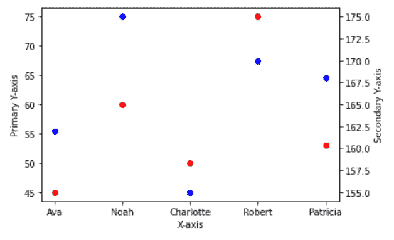

Matplotlib scatter secondary y-axis

阅读: [Matplotlib 散点图颜色](https://pythonguides.com/matplotlib-scatter-plot-color/)

## Matplotlib 辅助 y 轴刻度

在这里，我们将借助一个示例，学习使用 matplotlib 在辅助 y 轴上设置刻度。

**我们来看例子:**

```py
**# Import Library**

import numpy as np 
import matplotlib.pyplot as plt 

**# Subplot** 
fig, ax1 = plt.subplots() 

**# Define Data**

x = np.linspace(0, 5 * np.pi, 150)
data_1 = np.sin(x)
data_2 = np.cos(x)

**# Create Plot**

ax1.set_xlabel('X-axis') 
ax1.set_ylabel('Primary-axis') 
ax1.plot(x, data_1,color='r') 

**# Adding Twin Axes**

ax2 = ax1.twinx() 
ax2.plot(x, data_2) 

**# Set y axis ticks and labels** 
ax2.set_yticks([-1,0, 1, 2, 3, 4])
ax2.set_yticklabels(['Label-1', 'Label-2', 'Label-3', 
                     'Label-4', 'Label-5', 'Label-6'])

**# Add label**

ax2.set_ylabel('Second Y-axis') 

**# Show plot**

plt.show()
```

*   导入用于数据创建的 `numpy` 库。
*   将 `matplotlib.pyplot` 库导入为 `plt` 进行数据可视化。
*   然后使用 **支线剧情()** 函数得到一个带有人物和坐标轴的元组对象。
*   之后，我们使用 numpy 函数创建数据坐标，即 `linspace()` 、 `sin()` 和 `cos()` 。
*   要在轴上添加标签，使用 `set_xlabel()` 和 `set_ylabel()` 函数。
*   为了绘制图形，我们使用 `plot()` 函数。
*   要创建第二个 y 轴，使用 `twinx()` 函数。
*   为了固定 y 轴上的刻度位置，我们使用了 `set_yticks()` 函数。
*   为了设置 y 轴上的字符串标签，我们使用了 `set_yticklabels()` 函数。

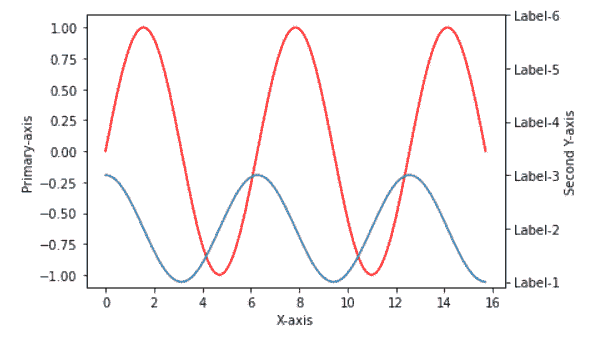

Matplotlib secondary y-axis ticks

Read: [Matplotlib set_xticklabels](https://pythonguides.com/matplotlib-set_xticklabels/)

## Matplotlib 第二个 y 轴熊猫

在这里，我们将学习使用 matplotlib 中的 pandas DataFrame 添加第二个 y 轴。

**我们来看一个例子:**

```py
**# Import Libraries**

import pandas as pd
import matplotlib.pyplot as plt

**# Creating dataframe for plot** 
df1 = pd.DataFrame({'year': [1, 2, 3, 4, 5, 6, 7, 8, 9, 10],
                    'profit': [80, 60, 50, 95, 75, 63, 35, 90, 
                               68, 78]})

df2 = pd.DataFrame({'year': [1, 2, 3, 4, 5, 6, 7, 8, 9, 10],
                    'loss': [20, 40, 50, 5, 25, 37, 65, 10, 32, 
                             22]})

**# Creating axes object and defining plot** 
ax = df1.plot(kind = 'line', x = 'year',
              y = 'profit', color = 'slategrey', marker='o')

ax2 = df2.plot(kind = 'line', x = 'year',
                   y = 'loss', secondary_y = True,
                   color = 'Red', marker = 'o',
                   ax = ax)

**# Labeling axes**

ax.set_xlabel('Year')
ax.set_ylabel('Profit')
ax2.set_ylabel('Loss')

**# Show plot**

plt.show()
```

*   导入 `pandas` 库来创建数据帧。
*   导入 `matplotlib.pyplot` 库进行数据可视化。
*   之后，使用 pandas 的 `DataFrame()` 函数为地块创建数据帧。
*   然后，使用 `plot()` 函数创建轴对象并定义绘图。
*   要在辅助 y 轴上绘制数据，请使用 `df2.plot()` 方法中的 `secondary_y` 关键字。
*   为了给轴加标签，我们使用 `set_xlabel()` 和 `set_ylabel()` 函数分别对应于它们的轴对象。
*   要显示图形，使用 `show()` 功能。

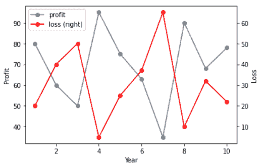

Matplotlib second y-axis pandas

你可能也喜欢阅读下面的 Matplotlib 教程。

*   [Matplotlib 绘制一条线(详细指南)](https://pythonguides.com/matplotlib-plot-a-line/)
*   [Matplotlib 改变背景颜色](https://pythonguides.com/matplotlib-change-background-color/)
*   [Matplotlib 默认图形尺寸](https://pythonguides.com/matplotlib-default-figure-size/)
*   [Matplotlib legend font size](https://pythonguides.com/matplotlib-legend-font-size/)
*   [Matplotlib 多个图](https://pythonguides.com/matplotlib-multiple-plots/)
*   [Matplotlib savefig 空白图像](https://pythonguides.com/matplotlib-savefig-blank-image/)

因此，在这个 **Python 教程**中，我们已经讨论了**“Matplotlib 辅助 y 轴**，并且我们还涵盖了一些与使用辅助 y 轴相关的示例。这些是我们在本教程中讨论过的以下主题。

*   Matplotlib 辅助 y 轴限制
*   Matplotlib 辅助 y 轴标签
*   Matplotlib 辅助 y 轴对数刻度
*   Matplotlib 辅助 y 轴颜色
*   Matplotlib 辅助 y 轴对齐 0
*   Matplotlib 辅助 y 轴子图
*   Matplotlib 辅助 y 轴直方图
*   Matplotlib 散点图辅助 y 轴
*   Matplotlib 辅助 y 轴刻度
*   Matplotlib 第二个 y 轴熊猫

[Bijay Kumar](https://pythonguides.com/author/fewlines4biju/)

Python 是美国最流行的语言之一。我从事 Python 工作已经有很长时间了，我在与 Tkinter、Pandas、NumPy、Turtle、Django、Matplotlib、Tensorflow、Scipy、Scikit-Learn 等各种库合作方面拥有专业知识。我有与美国、加拿大、英国、澳大利亚、新西兰等国家的各种客户合作的经验。查看我的个人资料。

[enjoysharepoint.com/](https://enjoysharepoint.com/)[](https://www.facebook.com/fewlines4biju "Facebook")[](https://www.linkedin.com/in/fewlines4biju/ "Linkedin")[](https://twitter.com/fewlines4biju "Twitter")