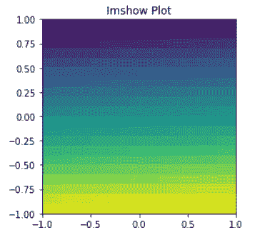

# Matplotlib 设置轴范围

> 原文：<https://pythonguides.com/matplotlib-set-axis-range/>

[](https://sharepointsky.teachable.com/p/python-and-machine-learning-training-course)

在本 [Python Matplotlib 教程](https://pythonguides.com/what-is-matplotlib/)中，我们将讨论 **Matplotlib 设置轴范围**。在这里，我们将介绍与使用 matplotlib 设置轴范围相关的不同示例。我们还将讨论以下主题:

*   Matplotlib 设置轴范围
*   Matplotlib 设置三维轴范围
*   Matplotlib 设置轴范围子图
*   Matplotlib 为所有子情节设置轴限制
*   Matplotlib 设置轴范围散点图
*   Matplotlib 设置轴范围日期时间
*   Matplotlib imshow 设置轴范围
*   Matplotlib 设置轴相同比例
*   Matplotlib 设置辅助轴范围
*   Matplotlib 3d 散点图集合轴范围
*   Matplotlib 设置轴刻度日志
*   Matplotlib 设置轴下限

目录

[](#)

*   [Matplotlib 设定轴范围](#Matplotlib_set_axis_range "Matplotlib set axis range")
    *   [通过使用 xlim()和 ylim()方法](#By_using_xlim_and_ylim_methods "By using xlim() and ylim() methods")
    *   [通过使用 set_xlim()和 set_ylim()方法](#By_using_set_xlim_and_set_ylim_methods "By using set_xlim() and set_ylim() methods")
    *   [通过使用轴()方法](#By_using_axis_method "By using axis() method")
*   [Matplotlib 设定轴范围 3d](#Matplotlib_set_axis_range_3d "Matplotlib set axis range 3d")
*   [Matplotlib 设置轴范围子图](#Matplotlib_set_axis_range_subplot "Matplotlib set axis range subplot")
*   [Matplotlib 为所有子情节设置轴限制](#Matplotlib_set_axis_limits_for_all_subplots "Matplotlib set axis limits for all subplots")
*   [Matpolotlib 设置轴范围散点图](#Matpolotlib_set_axis_range_scatter "Matpolotlib set axis range scatter")
*   [Matplotlib 设置轴范围日期时间](#Matplotlib_set_axis_range_datetime "Matplotlib set axis range datetime")
*   [matplotlib im how 设置轴范围](#Matplotlib_imshow_set_axis_range "Matplotlib imshow set axis range")
*   [Matplotlib 设定轴相同比例](#Matplotlib_set_axis_same_scale "Matplotlib set axis same scale")
*   [Matplotlib 设置次轴范围](#Matplotlib_set_secondary_axis_range "Matplotlib set secondary axis range")
*   [Matplotlib 3d 散点图设定轴范围](#Matplotlib_3d_scatter_set_axis_range "Matplotlib 3d scatter set axis range")
*   [Matplotlib 设置轴刻度日志](#Matplotlib_set_axis_scale_log "Matplotlib set axis scale log")
*   [Matplotlib 设定轴下限](#Matplotlib_set_axis_lower_limit "Matplotlib set axis lower limit")

## Matplotlib 设定轴范围

Matplotlib 是 Python 最流行的数据可视化库之一。在本节中，我们将了解如何使用 Matplotlib 的轴范围来截断或扩展绘图的某些边界。

Matplotlib 自动生成沿绘图的 x、y(以及 3D 绘图时的 z 轴)轴显示的变量的最小值和最大值。

但是，可以使用以下方法定义明确的限制:

*   通过使用 xlim()和 ylim()
*   通过使用 set_xlim()和 set_ylim()
*   通过使用轴()

### 通过使用 xlim()和 ylim()方法

在 matplotlib 中，要设置或获取 X 轴和 Y 轴限制，相应地使用 `xlim()` 和 `ylim()` 方法。如果传递了参数，这些方法定义了各个轴的限制，如果没有传递参数，我们将获得各个轴的范围。

**以下是语法:**

```py
**# Set x-axis range**

matplotlib.pyplot.xlim()

**# Set y-axis range**

matplotlib.pyplot.ylim()
```

**我们来看例子:**

**例#1**

在这个例子中，我们没有使用 `xlim()` 和 `ylim()` 函数，我们将得到一个完整范围的图。

```py
**# Import Libraries**

import numpy as np
import matplotlib.pyplot as plt

**# Define Data**

x = np.arange(0, 10, 0.2)
y = np.sin(x)

**# Plot**

plt.plot(x, y)

**# Add title**

plt.title("Plot without limiting axes")

**# Add labels**

plt.xlabel("X-axis")
plt.ylabel("Y-axis")

**# Display**

plt.show()
```


Matplotlib set axis limits

正如在输出中所看到的，我们将得到一个具有完整轴范围的图，X 轴范围从-1 到 1，Y 轴范围从 0 到 10。

**例 2**

在这个例子中，我们使用 `xlim()` 和 `ylim()` 函数，得到一个带有手动选择的限制的图。

```py
**# Import Libraries** 
import numpy as np
import matplotlib.pyplot as plt

**# Define Data**

x = np.arange(0, 10, 0.2)
y = np.sin(x)

**# Plot**

plt.plot(x, y)

**# Set axes limit**

plt.xlim(2, 8)
plt.ylim(-0.50,1.5)

**# Add title**

plt.title("Setting range of Axes")

**# Add labels**

plt.xlabel("X-axis")
plt.ylabel("Y-axis")

**# Display**

plt.show()
```

*   首先导入必要的库，如 `numpy` 和 `matplotlib.pyplot` 。
*   要定义 x 轴和 y 轴数据坐标，使用 `arange()` 和 `sin()` 函数。
*   要绘制折线图，使用 `plot()` 函数。
*   要设置 x 轴和 y 轴的范围，分别使用 `xlim()` 和 `ylim()` 函数。
*   要给绘图添加标题，使用 `title()` 函数。
*   要在轴上添加标签，使用 `xlabel()` 和 `ylabel()` 函数。
*   为了可视化绘图，使用 `show()` 函数。


Matplotlib set axis range

这将 X 轴的范围设置为 2 到 8，而 Y 轴的范围为-0.50 到 1.5。

### 通过使用 set_xlim()和 set_ylim()方法

`set_xlim()` 和 `set_ylim()` 函数也用于限制图上的数字范围。

**以下是语法:**

```py
**# Set x-axis range**

matplotlib.axes.Axes.set_xlim()

**# Set y-axis range**

matplotlib.axes.Axes.set_ylim()
```

**我们来看例子:**

**例#1**

在这个例子中，我们没有使用 `set_xlim()` 和 `set_ylim()` 函数来获得完整范围的图。

```py
**# Import Libraries**

import matplotlib.pyplot as plt
import numpy as np

**# Define Data**

x = np.random.randint(low = -15, high = 80, size = 50)

**# Plot**

plt.plot(x, color='#EE1289')

**# Add title**

plt.title("Plot without limiting axes")

**# Add labels**

plt.xlabel("X-axis")
plt.ylabel("Y-axis")

**# Display**

plt.show()
```


Matplotlib set limits of axes

正如在输出中看到的，我们将得到一个具有完整轴范围的图，X 轴范围从 0 到 80，Y 轴范围从 0 到 50。

**例 2**

在本例中，我们使用 `set_xlim()` 和 `set_ylim()` 函数，获得一个带有手动选择的限制的图。

```py
**# Import Libraries**

import matplotlib.pyplot as plt
import numpy as np

**# Define Data**

x = np.random.randint(low = -15, high = 80, size = 50)

**# Plot**

plt.plot(x, color='#EE1289')

**# Set axes limit**

plt.xlim(0 , 43)
plt.ylim(0 , 55)

**# Add title**

plt.title("Setting range of Axes")

**# Add labels**

plt.xlabel("X-axis")
plt.ylabel("Y-axis")

**# Display**

plt.show()
```

*   导入 `matplotlib.pyplot` 库。
*   之后，导入 `numpy` 包。
*   然后使用 `numpy` 的 `rndom.randint()` 方法定义数据坐标。
*   要给当前图形添加轴，使用 `axes()` 方法。
*   要设置轴限制，分别对 x 轴和 y 轴使用 `set_xlim()` 和 `set_ylim()` 。
*   要绘制折线图，使用 `pyplot` 模块的 `plot()` 函数。
*   要给绘图添加标题，使用 `title()` 函数。
*   要在 x 轴上添加标签，使用 `xlabel()` 函数。
*   要在 y 轴上添加标签，使用 `ylabel()` 函数。
*   要在用户屏幕上显示图形，使用 `show()` 功能。


Matplotlib set range of axes

这将 X 轴的范围设置为 0 到 43，而 Y 轴的范围为 0 到 55。

### 通过使用轴()方法

为了设置轴的限制，我们也可以使用 `axis()` 函数。

**以下是语法:**

```py
matplotlib.pyplot.axis([xmin, xmax, ymin, ymax])
```

**我们来看例子:**

**例#1**

在这个例子中，我们没有使用**轴()**函数来获得一个完整范围的图。

```py
**# Import Libraries** 
import matplotlib.pyplot as plt
import numpy as np

**# Define Data**

x = np.linspace(0, 8, 100)
y = np.exp(x/2)

**# Plot** 
plt.plot(x, y, color='green')

**# Add title**

plt.title("Plot without limiting axes")

**# Add labels**

plt.xlabel("X-axis")
plt.ylabel("Y-axis")

**# Display**

plt.show()
```


Set axis limits using matplotlib

正如在输出中所看到的，我们将得到一个具有完整轴范围的图，X 轴范围从 0 到 50，Y 轴范围从 0 到 8。

**例 2**

在本例中，我们使用**轴()**函数，获得一个带有手动选择的限制的图。

```py
**# Import Libraries** 
import matplotlib.pyplot as plt
import numpy as np

**# Define Data**

x = np.linspace(0, 8, 100)
y = np.exp(x/2)

**# Set axes**

plt.axis([2, 6.5, 2, 45])

**# Plot**

plt.plot(x, y, color='green')

**# Add title**

plt.title("Setting range of Axes")

**# Add labels**

plt.xlabel("X-axis")
plt.ylabel("Y-axis")

**# Display** 
plt.show()
```

*   将 `matplotlib.pyplot` 库导入到项目中。
*   之后导入 `numpy` 包。
*   然后，使用 numpy 的 `linspace()` 和 `exp()` 方法，定义数据坐标。
*   使用 `axis()` 功能设置 x 轴和 y 轴的轴限值。
*   使用 pyplot 模块的 `plot()` 函数创建折线图。
*   使用 `title()` 功能为绘图添加标题。
*   使用 `xlabel()` 函数在 x 轴上添加一个标签。
*   使用 `ylabel()` 函数向 y 轴添加一个标签。
*   使用 `show()` 功能在用户屏幕上显示图形。


Set axis range using matplotlib

这将 X 轴的范围设置为 2 到 6.5，而 Y 轴的范围为 2 到 45。

## Matplotlib 设定轴范围 3d

在本教程中，我们将学习如何调整 3D 绘图的轴限制。轴上的值范围由输入值自动定义。

`set_xlim()` 、 `set_ylim()` 和 `set_zlim()` 函数用于改变每个轴上的最小和最大限值。

**以下是改变轴限制的语法:**

```py
**# For x-axis limit**
matplotlib.axis.Axis.set_xlim(min, max)

**# For y-axis limit**
matplotlib.axis.Axis.set_ylim(min, max)

**# For z-axis limit**
matplotlib.axis.Axis.set_zlim(min, max)
```

**让我们看看与此相关的例子:**

**例#1**

在本例中，我们将绘制一个 3D 折线图，并使用上面定义的函数修改其轴。

```py
**# Import libraries**

from mpl_toolkits import mplot3d
import numpy as np
import matplotlib.pyplot as plt

**# 3D projection**

ax = plt.axes(projection ="3d")

**# Define Data**

x = np.arange(20)
y = x+8
z = 2*x+8

**# Modify axis**

ax.set_xlim(0,20)
ax.set_ylim(5,32)
ax.set_zlim(10, 55)

**# Plot**

ax.plot3D(x, y, z)

**# Show**

plt.show()
```

*   为 3d 投影导入 `mplot3d` 库。
*   接下来，导入用于数据创建的 `numpy` 库。
*   之后，导入 `matplotlib.pyplot` 进行图形可视化。
*   要设置 3d 投影，使用 `axes()` 方法给新图形添加轴，并传递**投影**参数，设置为 `3d` 。
*   接下来，定义数据坐标。
*   然后，使用 `set_xlim()` 、 `set_ylim()` 、 `set_zlim()` 方法，根据传递的最小值和最大值修改三个轴的限值。
*   要绘制 3d 折线图，使用 `plot3d()` 功能。


Matplotlib set axis range 3d

**例 2**

在这个例子中，我们将绘制一个 3D 条形图，并使用上面定义的函数修改它的轴。

```py
**# Import libraries**

from mpl_toolkits import mplot3d
import numpy as np
import matplotlib.pyplot as plt

**# 3D projection**

ax = plt.axes(projection ="3d")

**# Define Data**

x3 = [2, 4, 6, 8, 10, 12, 14, 16, 18, 20]
y3 = [5, 10, 15, 20, 25, 30, 35, 40, 45, 50]
z3 = np.zeros(10)

dx = np.ones(10)
dy = np.ones(10)
dz = [4, 8, 12, 16, 20, 24, 28, 32, 36, 40]

**# Modify axis**

ax.set_xlim(0,30)
ax.set_ylim(5, 70)
ax.set_zlim(-2, 55)

**# Plot**

ax.bar3d(x3, y3, z3, dx, dy, dz)

**# Show**

plt.show()
```

*   导入 `mplot3d` 、 `numpy` 、 `matplotlib.pyplot` 等必要的库。
*   要定义 3D 投影，使用 `axes()` 方法向新图形添加轴，并传递 **投影** 参数，并设置为 `3d` 。
*   使用 numpy 的 `zero()` 和 `ones()` 方法来定义宽度、深度和高度。
*   然后，使用 `set_xlim()` 、 `set_ylim()` 、 `set_zlim()` 方法，根据传递的最小值和最大值修改三个轴的限值。
*   使用 `bar3d()` 函数绘制三维条形图。


Matplotlib set 3d axis range

另外，检查:[什么是 add_axes matplotlib](https://pythonguides.com/add_axes-matplotlib/)

## Matplotlib 设置轴范围子图

这里我们将学习使用 matplotlib 设置特定子绘图的轴范围。

**让我们看看与此相关的例子:**

**例#1**

这里我们使用 xlim()和 ylim()方法来修改特定子情节的轴限制。

```py
**# Import Libraries**

import matplotlib.pyplot as plt
import numpy as np

**# plot 1:**

plt.subplot(1, 2, 1)

**# Data**

x = np.arange(0,10,0.2)
y = np.sin(x)

**# Plotting**

plt.plot(x, y)

**# plot 2:**

plt.subplot(1, 2, 2 )

**# Data**

x = np.arange(0,10,0.2)
y = np.cos(x)

**# Set axes for specific subplot**

plt.xlim(2, 8)
plt.ylim(-0.50,1.5)

**# Plotting**

plt.plot(x,y)

**# Auto adjust**

plt.tight_layout()

**# Display**

plt.show()
```

*   导入 `matplotlib.pyplot` 和 `numpy` 库。
*   接下来，使用定义了行和列的 `subplot()` 函数创建一个子情节。
*   `arange()` 、 `sin()` 、 `cos()` 方法用于定义数据坐标。
*   这里我们修改了子情节 2nd 的轴，所以我们使用了 `xlim()` 和 `ylim()` 函数。
*   要绘制图形，在每个子图中使用 `plot()` 函数。


Matplotlib set axis range subplot

**例 2**

在这里，我们将创建两个支线剧情，一个具有原始极限值，另一个具有截断的极限值。

```py
**# Import Libraries**

import matplotlib.pyplot as plt
import numpy as np

**# Set figure size**

fig = plt.figure(figsize=(12, 6))

**# Define Data**

x = np.arange(0, 10, 0.1)
y = np.tan(x)

**# Create subplot**

ax1 = fig.add_subplot(121)
ax2 = fig.add_subplot(122)

**# Set limits**

ax2.set_xlim([25, 50])
ax2.set_ylim([-20, 60])

**# Plot graphs**

ax1.set_title('Orignal Limits')
ax1.plot(y, color='blue')

ax2.set_title('Truncated Limits')
ax2.plot(y, color='blue')

**# Display** 

plt.show()
```

*   导入必要的库，如 `matplotlib.pyplot` 和 `numpy` 。
*   要设置图形大小，使用 `figure()` 方法并向其传递 figsize 参数。
*   定义数据坐标，使用 `arange()` 和 `tan()` 方法。
*   要创建子情节，使用 `add_subplot()` 方法。
*   要设置限制，使用 `set_xlim()` 和 `set_ylim()` 方法。
*   要给绘图添加标题，使用 `set_title()` 方法。
*   要绘制图表，请使用 `plot()` 方法。


Matplotlib set subplot axis range

## Matplotlib 为所有子情节设置轴限制

在这里，我们将在示例的帮助下学习使用 matplotlib 为所有子情节设置相同的轴限制。

**我们来看例子:**

**例#1**

这里，我们将使用 `set_xlim()` 和 `set_ylim()` 方法为所有支线剧情轴设置相同的限制。

```py
**# Import Libraries** import matplotlib.pyplot as plt

**# Set figure size** 
plt.figure(figsize=(8, 7))

**# Subplot 1** 
ax1 = plt.subplot(2, 2, 1)

**# Set axes**

ax1.set_xlim(2, 15)
ax1.set_ylim(0, 25)

ax1.plot([1, 2, 3, 8, 16, 21], [2, 4, 1, 20, 13, 15])

**# Subplot 2**

ax2 = plt.subplot(2, 2, 2, sharey=ax1, sharex=ax1)
ax2.plot([4, 2, 6, 8, 3, 20, 13, 15])

**# Subplot 3** 
ax3 = plt.subplot(2, 2, 4, sharey=ax1, sharex=ax1)
ax3.plot([1, 2, 3, 4, 5])

**# Subplot 4**

ax4 = plt.subplot(2, 2, 3, sharey=ax1, sharex=ax1)
ax4.plot([0, 0.6, 0.2, 15, 10, 8])

**# auto layout** 
plt.tight_layout()

**# Display**

plt.show()
```

*   首先导入 `matplotlib.pyplot` 和 `numpy` 库。
*   接下来，通过使用 `figure()` 方法并传递 `figsize` 参数来设置图形的大小。
*   使用 `subplot()` 方法分别在图中索引 1、2、3、4 处创建一个子图。
*   要设置轴限制，使用 `set_xlim()` 和 `set_ylim()` 方法。
*   要共享相同的轴，使用 `sharex` 和 `sharey` 参数。
*   要在不同的轴上画线，使用 `plot()` 方法。
*   要显示该图，请使用 `show()` 功能。


Matplotlib set axis limits for all subplots

**例 2**

在本例中，我们使用 `setp()` 函数为所有子图形设置相同的轴限制。

```py
**# Import Library**

import matplotlib.pyplot as plt

**# Create subplot**

fig, ax = plt.subplots(2, 2)

**# Define Data**

x1 = [1, 2, 3, 8, 16, 21]
y1 = [2, 4, 1, 20, 13, 15]

x2 = [4, 2, 6, 8, 3, 20, 13, 15]

x3= [5, 8, 12]
y3= [3, 6, 9]

x4= [7, 8, 15]
y4= [6, 12, 18]

**# Define axes**

cust_xlim = (0, 30)
cust_ylim = (2, 30)

**# Setting the same values for all axes**

plt.setp(ax, xlim=cust_xlim, ylim=cust_ylim)

**# Plot** 
ax[0, 0].plot(x1, y1)
ax[0, 1].plot(x2)
ax[1, 0].plot(x3, y3)
ax[1, 1].plot(x4, y4)

**# Auto adjust**

fig.tight_layout()

**# Display**

plt.show()
```

*   导入 `matplotlib.pyplot` 库。
*   要创建子情节，使用 `subplots()` 方法并指定行和列作为参数。这里我们将其设置为 2 行 2 列。
*   接下来，定义用于打印的数据坐标。
*   然后，定义轴限制。
*   要为所有子情节设置相同的轴限制值，使用 `setp()` 方法。
*   为了绘制图表，我们使用了 `plot()` 函数。
*   要自动调整支线剧情，使用 `tight_layout()` 函数。
*   要显示这些图，使用 `show()` 方法。


Matplotlib set axis range for all subplots

阅读: [Matplotlib 二维表面图](https://pythonguides.com/matplotlib-2d-surface-plot/)

## Matpolotlib 设置轴范围散点图

在这里，我们将学习使用 matplotlib 设置散点图的轴范围。

**我们来看例子:**

**例#1**

在本例中，我们使用 axis()方法来设置轴范围。

```py
**# Import Librar**y

import matplotlib.pyplot as plt

**# Define Data** 
x =[5, 7, 8, 7, 2, 17, 2, 9,
    4, 11, 12, 9, 6] 

y =[99, 86, 87, 88, 100, 86, 
    103, 87, 94, 78, 77, 85, 86]

**# Set axes**

plt.axis([0, 15, 50, 120])

**# Plot**

plt.scatter(x, y, color='green')

**# Add labels**

plt.xlabel("X-axis")
plt.ylabel("Y-axis")

**# Display**

plt.show()
```

*   首先导入 `matplotlib.pyplot` 库进行数据可视化。
*   接下来，定义数据坐标。
*   要设置散点图的轴，使用 `axis()` 方法并设置 xmin，xmax。ymin 和 ymax 值。
*   要绘制散点图，使用 `scatter()` 函数。
*   要在 x 轴上设置标签，使用 `xlabel()` 函数。
*   要在 y 轴设置标签，使用 `ylabel()` 函数。
*   要查看图形，请使用 `show()` 方法。


Matplotlib set axis range scatter

**例 2**

在这个例子中，我们使用 xlim()和 ylim()函数来设置轴的范围。

```py
**# Import Library**

import matplotlib.pyplot as plt

**# Define Data**

x = np.random.randint(low = -20, high = 80, size = 100)
y = np.random.randint(low = 0, high = 50, size = 100)

**# Set axes**

plt.xlim(0, 60)
plt.ylim(10, 40)

**# Plot**

plt.scatter(x, y, color='blue')

**# Add labels**

plt.xlabel("X-axis")
plt.ylabel("Y-axis")

**# Display**

plt.show() 
```

*   首先导入 `matplotlib.pyplot` 库进行数据可视化。
*   接下来，使用 `random.randint()` 函数定义数据坐标。
*   要设置散点图的轴，使用 `xlim()` 和 `ylim()` 函数。
*   要绘制散点图，使用 `scatter()` 函数。
*   要在 x 轴上设置标签，使用 `xlabel()` 函数。
*   要在 y 轴设置标签，使用 `ylabel()` 函数。
*   要查看图形，请使用 `show()` 方法。


Matplotlib set axis limit scatter

读取: [Matplotlib 设置 y 轴范围](https://pythonguides.com/matplotlib-set-y-axis-range/)

## Matplotlib 设置轴范围日期时间

在这里，我们将学习使用 matplotlib 设置日期时间图的轴范围。

**我们来看一个与此相关的` `的例子:**

```py
**# Import Libraries**

import datetime
import matplotlib.pyplot as plt

**# Create subplot**

fig, ax = plt.subplots()

**# Define Data**

x = [datetime.date(2022, 1, 30)] * 5
y = [2, 4, 1, 6, 8]

**# Set axes**

ax.set_xlim([datetime.date(2022, 1, 1), datetime.date(2022, 2, 
              1)])
ax.set_ylim([0, 10])

**# Plot date**

ax.plot_date(x, y, markerfacecolor='m', markeredgecolor='k', 
             markersize= 15)

**# Auto format** 
fig.autofmt_xdate()

**# Display**

plt.show()
```

*   导入必要的库，如 `datetime` 和 `matplotlib.pyplot` 。
*   要创建一个支线剧情，使用**支线剧情()**函数。
*   要定义数据坐标，使用 `datetime.date()` 函数。
*   要设置轴，使用 `set_xlim()` 和 `set_ylim()` 函数。
*   要绘制日期时间图，使用 `plot_date()` 函数。
*   通过参数 `markerfacecolor` 、 `markeredgecolor` 和 `markersize` 设置标记面颜色、边缘颜色和尺寸。
*   要自动格式化 x 轴上的日期，使用 `autofmt_xdate()` 函数。
*   要查看绘图，使用 `show()` 功能。


Matplotlib set axis range datetime

读取: [Matplotlib 更新循环中的绘图](https://pythonguides.com/matplotlib-update-plot-in-loop/)

## matplotlib im how 设置轴范围

这里我们将学习使用 matplotlib 设置 `imshow` 的轴范围。要更改 `imshow` 的轴，我们必须向 `imshow()` 函数传递一个范围参数。

**以下是语法:**

```py
matplotlib.pyplot.imshow(extent = [x_min, x_max, y_min, y_max])
```

**我们来看例子:**

这里我们通过使用范围参数来设置轴。

```py
**# Import Library**

import numpy as np
import matplotlib.pyplot as plt

**# Define Data** 
x = np.arange(400).reshape((20,20)) 

**# Imshow set axes**

plt.imshow(x , extent=[-1,1,-1,1])

**# Add Title** 
plt.title( "Imshow Plot" )

**# Display**

plt.show()
```

*   导入 `numpy` libaray 为 `np` 。
*   将 `matplotlib.pyplot` 库导入为 `plt` 。
*   要定义数据坐标，使用 `arange()` 和`shape()`方法。
*   要绘制 imshow 图，使用 `imshow()` 图。
*   要设置轴限制，请将**范围**参数分别传递给具有 `x_min` 、 `x_max` 、 `y_min` 和 `y_max` 值的方法。
*   要添加标题，请使用 `title()` 函数。



Matplotlib imshow set axis range

我们还可以使用 `xlim()` 、 `ylim()` 方法或者使用 `set_xlim()` 和 `set_ylim()` 方法或者使用 `axis()` 方法来设置 imshow 的轴。

**让我们再看一个使用上述定义方法设置 imshow 轴的例子:**

这里我们使用 axis()方法来设置 imshow 的轴。

**例 2**

```py
**# Import Library**

import matplotlib.pyplot as plt

**# Define Data**

x = [[1, 2, 4, 5, 6, 7],
      [21, 22, 24, 25, 26, 27],
      [100, 13, 41, 51, 61, 71],
      [111, 121, 141, 151, 161, 171]]

**# Set axes**

plt.axis([1, 4, 1, 3])

**# Imshow** `Plot`

plt.imshow(x)

**# Add Title**

plt.title( "Imshow Plot" )

**# Display**

plt.show()
```

*   导入 `matplotlib.pyplot` 库。
*   接下来，定义数据坐标。
*   要设置轴，使用 `axis()` 方法。
*   要绘制 imshow 图形，使用 `imshow()` 函数。
*   要添加标题，使用 `title()` 函数。
*   使用 `show()` 功能在用户屏幕上显示图形。


Matplotlib imshow set axis limits

阅读: [Matplotlib 饼图教程](https://pythonguides.com/matplotlib-pie-chart/)

## Matplotlib 设定轴相同比例

在这里，我们将了解如何使用 matplotlib 在 x 轴和 y 轴上设置相同的比例轴限制。

**举例:**

```py
**# Import Library** 
import matplotlib.pyplot as plt

**# Define Data**

x = np.random.randint(low = -15, high = 80, size = 50)

**# Plot**

plt.plot(x)

**# Set Axes** 
plt.xlim(0, 60)
plt.ylim(0, 60)
plt.gca().set_aspect('equal', adjustable='box')

**# Display** 
plt.show()
```

*   导入 `matplotlib.pyplot` 库进行数据可视化。
*   接下来，定义数据坐标。这里我们用 `random.randint()` 函数来定义数据。
*   要绘制图表，使用 `plot()` 函数。
*   要设置 x 轴的极限，使用 `xlim()` 功能。
*   要设置 y 轴的极限，使用 `ylim()` 函数。
*   `plt.gca()` 函数用于获取当前坐标轴。
*   接下来，我们使用 `set_aspect()` 函数，来设置轴缩放的方面。这里我们将**特征**设置为**等于**，这意味着 x 和 y 从数据到绘图单位的缩放是相同的


Matplotlib set axis same scale

阅读:[Matplotlib set _ x ticks–详细教程](https://pythonguides.com/matplotlib-set-xticks/)

## Matplotlib 设置次轴范围

在这里，我们将学习使用 matplotlib 设置辅助轴范围。

**让我们看看与此相关的例子:**

**例#1**

这里我们将创建两个 y 轴，并使用 set_xlim()和 set_ylim()函数设置它们的轴范围。

```py
**# Import Library**

import numpy as np
import matplotlib.pyplot as plt

**# Set figure size** 
fig, ax = plt.subplots(figsize = (8,5))

**# Define Data Coordinates**

x = np.arange(0, 50, 2)
y1 = np.sin(x*20)
y2 = x**2

**# Title**

plt.title('Set Secondary axis range')

**# Create Secondary Axes** 
ax2 = ax.twinx()
ax.plot(x, y1, color = 'g')
ax2.plot(x, y2, color = 'b')

**# Set axes range**

ax.set_xlim(0,45)
ax.set_ylim(-1, 1)
ax2.set_ylim(50, 3000)

**# Set Labels**

ax.set_xlabel('x-axis', color = 'r')
ax.set_ylabel('Primary y-axis', color = 'g') 
ax2.set_ylabel('Secondary y-axis', color = 'b')

**# Show plot** 
plt.show()
```

*   导入用于数据创建的 `numpy` 库。
*   导入 `matplotlib.pyplot` 库进行数据可视化。
*   要通过创建轴对象来绘制图形，使用 `subplots()` 函数。
*   要设置绘图的大小，使用 `figsize` 参数并设置宽度和高度。
*   为了定义数据坐标，我们使用 numpy 的 `arange()` 和 `sin()` 函数。
*   为了设置一个图的标题，我们使用了 `title()` 函数。
*   为了创建一个辅助 y 轴，我们使用了 `twinx()` 函数。
*   为了绘制对应于轴的数据，我们使用了 `plot()` 函数。
*   要区分绘制的数据，请传递**颜色**参数并设置不同的颜色。
*   为了设置主轴和副轴的轴范围，我们使用了 `set_xlim()` 和 `set_ylim()` 函数。
*   为了在 x 轴上设置标签，我们使用了 `set_xlabel()` 函数。
*   为了在主 y 轴和次 y 轴上设置标签，我们使用了 `set_ylabel()` 函数。
*   我们还在每个轴上设置标签的颜色，绕过标签函数的**颜色**参数。
*   为了显示这个图，我们使用了 `show()` 函数。


Matplotlib set secondary axis range

**例 2**

这里我们将创建两个 x 轴，并使用 set_xlim()和 set_ylim()函数设置它们的轴范围。

```py
**# Import library**

import matplotlib.pyplot as plt

**# Create subplot**

fig, ax1 = plt.subplots()

**# Plot**

ax1.plot([1, 2, 3, 4, 5], [2, 4, 12, 8, 10], color='red')

**# Secondary x-axis**

ax2 = ax1.twiny()
ax2.plot([5, 10, 15, 20, 25], [13, 51, 17, 11, 76], color='blue')

**# Set axes limit**

ax1.set_xlim(0, 4)
ax2.set_xlim(5, 20)
ax1.set_ylim(0, 60)

**# Display** 
plt.show()
```

*   首先导入 `matplotlib.pyplot` 库。
*   通过创建坐标轴对象来绘制图形，使用 **支线剧情()** 功能。
*   为了绘制图表，我们使用了 `plot()` 函数。
*   为了创建一个辅助 x 轴，我们使用了 `twiny()` 函数。
*   为了设置主轴和副轴的 x 轴限制，我们使用了 `set_xlim()` 函数。
*   为了设置 y 轴限制，我们使用了 `set_ylim()` 函数。
*   为了显示这个图，我们使用了 `show()` 函数。


Matplotlib set secondary axis limit

读取: [Matplotlib fill_between](https://pythonguides.com/matplotlib-fill_between/)

## Matplotlib 3d 散点图设定轴范围

在本教程中，我们将学习如何调整 3D 散点图的轴限制。轴上的值范围由输入值自动定义。

**让我们看看与此相关的例子:**

**例#1**

在此示例中，我们创建了 3d 散点图，并使用 set_xlim3d()、set_ylim3d()和 set_zlim3d()函数设置了散点图的轴范围。

```py
**# Import libraries** 
from mpl_toolkits import mplot3d
import numpy as np
import matplotlib.pyplot as plt

**# 3D projection** 
ax = plt.axes(projection ="3d")

**# Define Data** 
x = np.random.randint(low = -15, high = 80, size = 50)
y = np.random.randint(low = 0, high = 100, size = 50)

**# Modify axis** 
ax.set_xlim3d(-2, 62)
ax.set_ylim3d(5, 70)
ax.set_zlim3d(-1, 1)

**# Plot**

ax.scatter3D(x,y, s=45, edgecolor='k', color='slategrey')

**# Show** 
plt.show()
```

*   导入 python 的 `mplot3d` 库进行 3d 投影。
*   接下来，导入 `matplotlib.pyplot` 库进行数据可视化。
*   之后，导入 python 的 `numpy` 库进行数据创建。
*   给新图添加坐标轴，我们使用 `axes()` 的方法。
*   要设置 3d 投影，请将**投影**参数传递给该方法，并将其设置为 `3d` 。
*   为了定义数据坐标，我们使用 numpy 的 `random.randint()` 函数。
*   为了设置 x 轴的极限，我们使用 `set_xlim3d()` 方法。
*   要设置 y 轴的极限，我们使用 `set_ylim3d()` 方法。
*   为了设置 z 轴的极限，我们使用 `set_zlim3d()` 方法。
*   为了绘制 3d 散点图，我们使用了 `scatter3D()` 函数。
*   **尺寸**、**边缘颜色**和**颜色**参数用于美化地块。
*   要显示绘图，使用 `show()` 方法。


Matplotlib 3d scatter set axis range

**例 2**

在本例中，我们使用 pyplot 模块的 xlim()和 ylim()函数来设置 x 轴和 y 轴限值。为了设置 z 轴的极限，我们使用 set_zlim()函数。

```py
**# Import libraries**

from mpl_toolkits import mplot3d
import numpy as np
import matplotlib.pyplot as plt

**# Set figure size**

plt.figure(figsize=(8,8))

**# 3D projection**

ax = plt.axes(projection ="3d")

**# Define Data**

z = np.random.randint(100, size =(200))
y = np.sin(z) + np.random.randint(100, size =(200))
x = np.cos(z) + np.random.randint(100, size =(200))

**# Plot**

ax.scatter3D(x, y, z, s=50, edgecolor='k', color='lightgreen', marker='>')

**# Modify axis**

plt.xlim(-1, 150)
plt.ylim(-1, 150)
ax.set_zlim(-1, 100)

**# Show**

plt.show() 
```

*   首先导入必要的库如 `mplot3d` 、 `numpy` 、 `matplotlib.pyplot` 。
*   接下来，通过使用 `figure()` 方法并传递 figsize 参数来设置图形的大小。
*   要设置 3d 投影，使用 `axes()` 方法将轴添加到新图形，然后将**投影**参数设置为 `3d` 。
*   通过使用 `random.randint()` 、 `sin()` 、 `cos()` 方法定义数据坐标。
*   要创建 3d 散点图，使用 `scatter3D()` 方法。
*   为了设置 x 轴和 y 轴的极限，我们使用 `xlim()` 和 `ylim()` 函数。
*   为了设置 z 轴的极限，我们使用 `set_zlim()` 方法。
*   要显示绘图，使用 `show()` 功能。


Matplotlib 3d scatter set axis limit

阅读: [Matplotlib tight_layout](https://pythonguides.com/matplotlib-tight-layout/)

## Matplotlib 设置轴刻度日志

在这里，我们将学习使用 matplotlib 设置对数刻度的轴限制。

**让我们看看与此相关的例子:**

**例#1**

在本例中，我们创建了一个带有 y 轴对数刻度的图，并设置了它们的界限。

```py
**# Import Library**

import matplotlib.pyplot as plt

**# Define data** 
data = [10**i for i in range(50)]

**# Set y-axis log scale** 
plt.yscale("log")

**# Plot**

plt.plot(data)

**# Set axes limits** 
plt.axis([5, 45, 1E10, 1E50])

**# Display** 
plt.show()
```

*   导入 `matplotlib.pyplot` 库进行数据可视化。
*   然后定义指数数据坐标。
*   要设置 y 轴的对数刻度，使用 `yscale()` 函数，并将其设置为**对数**。
*   要绘制图表，使用 `plot()` 函数。
*   要设置轴限制，使用**轴()**功能。
*   要显示绘图，使用 `show()` 功能。


Matplotlib set axis scale log

**例 2**

这里我们使用 xlim()和 ylim()方法来设置对数标度图的轴限制。

```py
**# Import Library**

import matplotlib.pyplot as plt

**# Define Data**

x = [ 10**i for i in range(50)]
y = [ i for i in range(50)]

**# Log scale**

plt.xscale("log")

**# Plot**

plt.plot(x,y)

**# Set limits**

plt.xlim(1E10, 1E40)
plt.ylim(10, 45)

**# Display**

plt.show()
```

*   导入 `matplotlib.pyplot` 库进行数据可视化。
*   接下来，定义数据坐标。
*   要将 x 轴刻度设置为 log，使用 `xscale()` 函数并将 log 传递给它。
*   要绘制图表，使用 `plot()` 函数。
*   要设置 x 轴的极限，使用 `xlim()` 函数并向其传递最大值和最小值。
*   要设置 y 轴的界限，使用 `ylim()` 函数并向其传递顶部和底部值。
*   要显示图形，使用 `show()` 功能。


Matplotlib set axis range log scale

读取: [Matplotlib x 轴标签](https://pythonguides.com/matplotlib-x-axis-label/)

## Matplotlib 设定轴下限

这里我们学习使用 matplotlib 设置轴下限。y 轴的下限是底部，x 轴的下限是左侧。

**我们来看一个例子:**

```py
**# Import Libraries**

import matplotlib.pyplot as plt
import numpy as np

**# Define Data**

x = np.arange(0, 50, 2)
y = np.sin(x)

**# Set axes**

plt.xlim(left=5)
plt.ylim(bottom=10)

**# Plot**

plt.plot(x, color='blue')

**# Add labels**

plt.xlabel("X-axis")
plt.ylabel("Y-axis")

**# Display**

plt.show()
```

*   导入 `matplotlib.pyplot` 和 `numpy` 库。
*   接下来，定义数据坐标，使用 numpy 的 `arange()` 和 `sin()` 方法。
*   为了设置轴下限，我们使用 `xlim()` 和 `ylim()` 函数，分别传递**左**和**底**参数。
*   要绘制图表，使用 `plot()` 函数。
*   要在轴上设置标签，使用 `xlabel()` 和 `ylabel()` 函数。
*   要显示图形，使用 `show()` 功能。


Matplotlib set axis lower limit


Plot with original limits

你可能也喜欢阅读下面的 Matplotlib 教程。

*   [Matplotlib 多条形图](https://pythonguides.com/matplotlib-multiple-bar-chart/)
*   [Matplotlib 散点图图例](https://pythonguides.com/matplotlib-scatter-plot-legend/)
*   [Matplotlib legend font size](https://pythonguides.com/matplotlib-legend-font-size/)
*   [Matplotlib 不显示图](https://pythonguides.com/matplotlib-not-showing-plot/)
*   [堆积条形图 Matplotlib](https://pythonguides.com/stacked-bar-chart-matplotlib/)
*   [Matplotlib 默认图形尺寸](https://pythonguides.com/matplotlib-default-figure-size/)
*   [Matplotlib 辅助 y 轴](https://pythonguides.com/matplotlib-secondary-y-axis/)

因此，在这个 **Python 教程**中，我们已经讨论了**“Matplotlib 设置轴范围”**，并且我们还涵盖了一些与使用**设置轴范围 matplotlib** 相关的示例。这些是我们在本教程中讨论过的以下主题。

*   Matplotlib 设置轴范围
*   Matplotlib 设置三维轴范围
*   Matplotlib 设置轴范围子图
*   Matplotlib 为所有子情节设置轴限制
*   Matplotlib 设置轴范围散点图
*   Matplotlib 设置轴范围日期时间
*   Matplotlib imshow 设置轴范围
*   Matplotlib 设置轴相同比例
*   Matplotlib 设置辅助轴范围
*   Matplotlib 3d 散点图集合轴范围
*   Matplotlib 设置轴刻度日志
*   Matplotlib 设置轴下限

[Bijay Kumar](https://pythonguides.com/author/fewlines4biju/)

Python 是美国最流行的语言之一。我从事 Python 工作已经有很长时间了，我在与 Tkinter、Pandas、NumPy、Turtle、Django、Matplotlib、Tensorflow、Scipy、Scikit-Learn 等各种库合作方面拥有专业知识。我有与美国、加拿大、英国、澳大利亚、新西兰等国家的各种客户合作的经验。查看我的个人资料。

[enjoysharepoint.com/](https://enjoysharepoint.com/)[](https://www.facebook.com/fewlines4biju "Facebook")[](https://www.linkedin.com/in/fewlines4biju/ "Linkedin")[](https://twitter.com/fewlines4biju "Twitter")