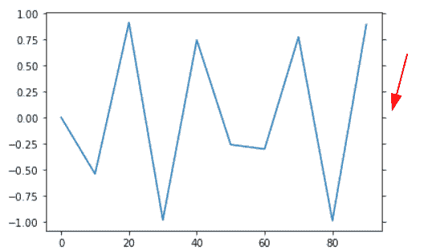

# matplotlib set _ x ticks–详细教程

> 原文：<https://pythonguides.com/matplotlib-set-xticks/>

[](https://sharepointsky.teachable.com/p/python-and-machine-learning-training-course)

在本 [Python Matplotlib 教程](https://pythonguides.com/how-to-install-matplotlib-python/)中，我们将讨论 Matplotlib 中的 `Matplotlib set_xticks` 。在这里，我们将介绍使用 matplotlib 与 set_xticks 相关的不同示例。我们还将讨论以下主题:

*   Matplotlib set_xticks
*   Matplotlib set_xticks 不可见
*   Matplotlib set_xticks 旋转
*   matplot lib set _ xts fontsize
*   Matplotlib set_xtciks 标签
*   Matplotlib set_xticks vertical
*   Matplotlib set_xticks 方向
*   Matplotlib set_xticks 长度
*   Matplotlib set_xticks 颜色
*   matplot lib bar plot set _xt 氮
*   Matplotlib 直方图集合 _xticks
*   matplot lib color bar set _ xts 氮
*   Matplotlib set_xticks 子图
*   Matplotlib set_xticks 对数标度
*   Matplotlib 向右设置刻度
*   Matplotlib 设置顶部刻度
*   Matplotlib 设置刻度间隔
*   Matplotlib set_xticks 范围
*   Matplotlib 设置次要刻度间隔
*   matplot lib set xts pad(打印库集 xts pad)
*   Matplotlib 将 xticks 设置为文本
*   Matplotlib 设置θ刻度

目录

[](#)

*   [matplotlib set _xt 氮](#Matplotlib_set_xticks "Matplotlib set_xticks")
*   [matplotlib set _ xtcics 不可见](#Matplotlib_set_xtciks_invisible "Matplotlib set_xtciks invisible")
*   [Matplotlib set_xticks 旋转](#Matplotlib_set_xticks_rotation "Matplotlib set_xticks rotation")
*   [matplot lib set _ xts fontsize](#Matplotlib_set_xticks_fontsize "Matplotlib set_xticks fontsize")
*   [Matplotlib set_xtciks 标签](#Matplotlib_set_xtciks_labels "Matplotlib set_xtciks labels")
*   [Matplotlib set _ x ticks vertical](#Matplotlib_set_xticks_vertical "Matplotlib set_xticks vertical")
*   [Matplotlib set_xticks 方向](#Matplotlib_set_xticks_direction "Matplotlib set_xticks direction")
*   [Matplotlib set_xticks 长度](#Matplotlib_set_xticks_length "Matplotlib set_xticks length")
*   [Matplotlib 设置刻度宽度](#Matplotlib_set_ticks_width "Matplotlib set ticks width")
*   [Matplotlib set _ x ticks color](#Matplotlib_set_xticks_color "Matplotlib set_xticks color")
*   [matplotlib bar plot set _ xts；](#Matplotlib_barplot_set_xticks "Matplotlib barplot set_xticks")
*   [Matplotlib 直方图集合 _xticks](#Matplotlib_histogram_set_xticks "Matplotlib histogram set_xticks")
*   [matplot lib colorable set _ xts](#Matplotlib_colorbar_set_xticks "Matplotlib colorbar set_xticks")
*   [matplotlib set _ xtcics 子图](#Matplotlib_set_xtciks_subplot "Matplotlib set_xtciks subplot")
*   [Matplotlib set_xticks 对数刻度](#Matplotlib_set_xticks_log_scale "Matplotlib set_xticks log scale")
*   [Matplotlib 设置右刻度](#Matplotlib_set_ticks_right "Matplotlib set ticks right")
*   [Matplotlib 设置 ticks top](#Matplotlib_set_ticks_top "Matplotlib set ticks top")
*   [Matplotlib 每隔](#Matplotlib_set_ticks_every "Matplotlib set ticks every")设置一次刻度
*   [Matplotlib set_xticks 范围](#Matplotlib_set_xticks_range "Matplotlib set_xticks range")
*   [Matplotlib 设置次要刻度间隔](#Matplotlib_set_minor_ticks_interval "Matplotlib set minor ticks interval")
*   [matplot lib set xts pad](#Matplotlib_set_xticks_pad "Matplotlib set xticks pad")
*   [Matplotlib 将 xticks 设置为文本](#Matplotlib_set_xticks_as_text "Matplotlib set xticks as text")
*   [Matplotlib 设置θ刻度](#Matplotlib_set_theta_ticks "Matplotlib set theta ticks")

## matplotlib set _xt 氮

在本节中，我们将学习 Python 中 matplotlib 的 axes 模块中的 `set_xticks()` 函数。 `set_xticks()` 函数用于设置 x 刻度位置。

**语法如下:**

```py
matplotlib.axes.Axes.set_xticks(ticks, labels=None, *, minor=False, **kwargs) 
```

**以下是参数:**

| **参数** | **值** | **描述** |
| --- | --- | --- |
| 滴答声 | 浮动列表 | 设置刻度位置。 |
| 标签 | 字符串列表 | 设置刻度标签列表。如果列表没有通过，则显示数据值。 |
| 较小的 | bool
默认为:False | 指定是否要设置次要刻度。 |
| kwargs |  | 标签和记号的文本属性。 |

**我们来看一个例子:**

```py
**# Import Library**

import numpy as np
import matplotlib.pyplot as plt

**# Create figure and subplots**

fig, ax = plt.subplots()

**# Define Data Coordinates**

x = np.linspace(0, 20 , 100)
y = np.sin(x)

**# Plot**

plt.plot(x, y)

**# Set ticks**

ax.set_xticks(np.arange(0, len(x)+1, 5))

**# Add Title**

fig.suptitle('set_xticks Example', fontweight ="bold")

**# Display**

plt.show()
```

**说明:**

*   导入 `numpy` 、 `matplotlib.pyplot` 等重要库。
*   在这之后，我们通过使用 `subplots ()` 方法创建一个支线剧情。
*   为了定义数据坐标，我们使用 numpy 的 `linespace()` 和 `sin()` 方法。
*   要设置 x 刻度，使用 `set_xticks()` 。
*   要给图形添加标题，使用 `suptitle()` 方法。
*   要在用户的屏幕上可视化绘图，使用 `show()` 方法。


set_xticks()

读取 [Matplotlib 绘制一条线](https://pythonguides.com/matplotlib-plot-a-line/)

## matplotlib set _ xtcics 不可见

这里我们将学习隐藏 x 轴上的刻度。为此，我们必须将空列表传递给 `set_xticks()` 方法。

```py
**# Import Library** 
import numpy as np
import matplotlib.pyplot as plt

**# Create figure and subplots**

fig, ax = plt.subplots()

**# Define Data Coordinates**

x = np.linspace(0, 20 , 100)
y = np.tan(x)

**# Plot**

plt.plot(x, y)

**# Set ticks invisible**

ax.set_xticks([])

**# Display**

plt.show()
```

这里我们使用 `set_xticks()` 方法来设置 x 轴刻度位置。为了使刻度不可见，我们向该方法传递一个空字符串。

**输出:**


set_xticks([])

阅读 [Python 使用 Matplotlib 绘制多行](https://pythonguides.com/python-plot-multiple-lines/)

## Matplotlib set_xticks 旋转

我们将改变 x 轴刻度的旋转。为了改变旋转，我们将**旋转**参数传递给 `plt.xticks()` 方法。

**我们来看一个例子:**

```py
**# Import Library**

import numpy as np
import matplotlib.pyplot as plt

**# Define Data Coordinates**

x = np.linspace(0, 20 , 100)
y = np.cos(x)

**# Plot**

plt.plot(x, y)

**# Set ticks Rotation** 
plt.xticks(rotation=45)

**# Display**

plt.show()
```

*   这里我们导入 `matplotlib.pyplot` 和 `numpy` 库。
*   接下来，我们使用 `numpy` 定义数据坐标。
*   要绘制折线图，请使用 `plot()` 方法。
*   要在 x 轴上旋转刻度，使用 `plt.xticks()` 方法并向其传递**旋转**参数。


plt.xticks(rotation)

阅读[什么是 matplotlib 内联](https://pythonguides.com/what-is-matplotlib-inline/)

## matplot lib set _ xts fontsize

这里我们将看到一个改变 x 轴刻度的字体大小的例子。为了改变字体大小，我们将**字体大小**参数传递给 `plt.xticks()` 函数。

**举例:**

```py
**# Import Library** 
import numpy as np
import matplotlib.pyplot as plt

**# Define Data Coordinates**

x = np.linspace(0, 20 , 100)
y = np.exp(x)

**# Plot**

plt.plot(x, y)

**# Set ticks Fontsize**

plt.xticks(fontsize=13)

**# Display**

plt.show()
```

**输出:**


plt.xticks(fontsize=13)

阅读 [Matplotlib 绘图条形图](https://pythonguides.com/matplotlib-plot-bar-chart/)

## Matplotlib set_xtciks 标签

在这里，我们将学习在 matplotlib 中设置记号的位置以及在 x 轴上添加标签。

**我们来看一个例子:**

```py
**# Import Library**

import matplotlib.pyplot as plt

**# Define Data Coordinates** 
x = [0, 1, 2, 3, 4, 5]
y = [1, 2.5, 4, 3.3, 10, 8]

**# Plot**

plt.plot(x, y)

**# Set ticks Labels**

plt.xticks([0, 1, 2, 3, 4, 5],['Term-1','Term-2','Term-3','Term-4', 'Term-5', 'Term-6'])

**# Display**

plt.show()
```

在上面的例子中，我们使用 `plt.xticks()` 方法在 x 轴手动添加标签和记号。


plt.xticks(ticks, labels)

阅读 [Matplotlib 支线剧情教程](https://pythonguides.com/matplotlib-subplot-tutorial/)

## Matplotlib set _ x ticks vertical

这里我们将学习在 Matplotlib 中垂直旋转 x 轴刻度。

**举例:**

```py
**# Import Library**

import numpy as np
import matplotlib.pyplot as plt

**# Define Data Coordinates**

x = np.linspace(0, 200 , 100)
y = np.sin(x)

**# Plot**

plt.plot(x, y)

**# Set ticks Rotation Vertical**

plt.xticks(rotation='vertical')

**# Display**

plt.show()
```

在上面的例子中，我们使用带有**旋转**参数的 `plt.xticks()` 函数来垂直旋转 x 刻度。


rotation=’vertical’

读取 [Matplotlib 最佳拟合线](https://pythonguides.com/matplotlib-best-fit-line/)

## Matplotlib set_xticks 方向

这里我们将看到一个例子，在 Python matplotlib 中我们改变了 x 轴记号的方向。

**举例:**

```py
**# Import Library**

import matplotlib.pyplot as plt
import numpy as np

**# Define Data Coordinates**

x = np.random.randint(450,size=(80))

**# Plot**

plt.plot(x)

**# Set ticks direction**

plt.tick_params(axis='x',direction='in')

**# Display**

plt.show()
```

**说明:**

*   这里我们使用 numpy 的 `random.randint()` 方法定义数据坐标。
*   要绘制线图，请使用 `plot()` 方法。
*   为了调整分笔成交点的行为，我们使用带有方向参数的函数。我们将它指定给中的**，以获得向内的刻度位置。**


tick_params(direction=’in’)

Read [Matplotlib set_xticklabels](https://pythonguides.com/matplotlib-set_xticklabels/)

## Matplotlib set_xticks 长度

在这里，我们将学习在 Matplotlib python 中更改 x 轴刻度的长度。要更改刻度的长度，请将**长度**参数传递给 `tick_params()` 方法。

**我们来看一个例子:**

```py
**# Import Library** 
import matplotlib.pyplot as plt
import numpy as np

**# Define Data Coordinates**

x = np.random.randint(500,size=(20))

**# Plot**

plt.plot(x,color='darkblue')

**# Tick length**

plt.tick_params(axis='x', length=12)

**# Display**

plt.show()
```


tick_params(length=12)

读取 [Matplotlib fill_between](https://pythonguides.com/matplotlib-fill_between/)

## Matplotlib 设置刻度宽度

在这里，我们将学习在 Matplotlib 中更改 x 轴刻度的宽度。将宽度传递宽度参数更改为 `tick_params()` 方法。

**我们来看一个例子:**

```py
**# Import Library**

import matplotlib.pyplot as plt
import numpy as np

**# Define Data Coordinates**

x = [0, 1, 2, 3, 4, 5]
y = [1, 2, 3, 4, 5, 6]

**# Plot**

plt.plot(x,y,color='lightgreen')

**# Tick Width**

plt.tick_params(axis='x', width=20)

**# Display**

plt.show()
```


tick_params(width=20)

读取[Matplotlib set _ yticklabels](https://pythonguides.com/matplotlib-set_yticklabels/)

## Matplotlib set _ x ticks color

我们将学习在 Python matplotlib 中改变位于 x 轴的刻度的颜色。

**举例:**

```py
**# Import Library**

import numpy as np
import matplotlib.pyplot as plt

**# Define Data Coordinates**

x = np.linspace(0, 50 , 100)
y = np.tan(x)

**# Plot** plt.plot(x, y)

**# Set ticks color**

plt.tick_params(axis='x', color='red', length=12, width=10)

**# Display**

plt.show()
```

在上面的例子中，我们使用带有**轴**、**颜色**、**长度**和**宽度**参数的 `tick_params()` 函数，并将它们的值分别设置为 `x` 、**红色**、 `12` 和 `10` 。


tick_params(axis=’x’, color=’red’)

读取 [Matplotlib tight_layout](https://pythonguides.com/matplotlib-tight-layout/)

## matplotlib bar plot set _ xts；

我们“学习在柱状图中设置 x 刻度的位置。为了设置位置，我们使用 matplotlib 中 axes 模块的 `set_xticks` 方法。

**举例:**

```py
**# Import Library** 
import numpy as np
import matplotlib.pyplot as plt

**# Create figure and subplots**

fig, ax = plt.subplots()

**# Define Data Coordinates**

x = [1, 2, 3, 4, 6]
y = [10, 20, 25, 15, 30]

**# Plot**

plt.bar(x, y, color='darkorange')

**# Set ticks** 

ax.set_xticks([0, 2, 4, 6, 8])

**# Display**

plt.show()
```


By default x ticks

*   在上面的例子中，我们定义了数据坐标 `x` 和 `y` 来使用 `bar()` 方法绘制条形图。
*   要设置 x 刻度的位置，请使用 `set_xticks()` 方法。

**设置刻度后的输出:**


set_xticks()

阅读[Python Matplotlib tick _ params+29 示例](https://pythonguides.com/matplotlib-tick-params/)

## Matplotlib 直方图集合 _xticks

我们将学习根据我们的选择来设置 x 刻度。要更改默认的 x 刻度，请使用 Matplotlib 中的 `set_xticks()` 函数。

**设置直方图中 x 刻度的步骤如下:**

*   导入重要的库，比如 **matplotlib.pyplot、**和 `numpy` 。
*   使用 numpy `random.randn()` 函数定义数据坐标 x 和 y。
*   要绘制 x 和 y 之间的直方图，使用 `plt.hist()` 函数。
*   要设置直方图中每个条的边缘颜色，请使用 `hist()` 方法中的 `edgecolor` 参数。
*   要设置 x 刻度，使用 `set_xtick()` 方法，我们使用 numpy 的 `range()` 方法来设置刻度的位置。
*   为了可视化用户的绘图，使用 `plt.show()` 方法。


ax.set_xticks(range())

读取 [Matplotlib x 轴标签](https://pythonguides.com/matplotlib-x-axis-label/)

## matplot lib colorable set _ xts

在这里，我们将学习通过使用 matplotlib 中的 `set_ticks()` 函数在颜色栏上设置 x 刻度。

**我们来看一个例子:**

```py
**# Import Libraries**

import matplotlib.pyplot as plt
import numpy as np

**# Define Data**

x = np.array([99,86,88,111,103,87,94])
y = np.array([20,50,200,500,1000,60,75])
colors = np.array([0, 10, 20, 30, 40, 45, 50])

**# Define scatter() function**

plt.scatter(x, y, c=colors, cmap= 'PiYG')

**# Colorbar** 
cbar = plt.colorbar()

**# Set ticks**

cbar.set_ticks(range(5, 30, 10))

**# Display the graph**

plt.show()
```

*   在上面的例子中，我们导入了 `matplotlib.pyplot` 和 `numpy` 库。
*   然后我们以数组的形式定义 `x` 、 `y` 和**颜色**数据点。
*   `plt.scatter()` 方法用于为每个数据点绘制标记，我们通过参数**‘cmap’**来设置颜色图。
*   `plt.colorbar()` 方法用于显示绘图中的色带。
*   然后我们使用 `set_ticks()` 函数来设置 x 轴上的刻度。
*   然后我们最后使用方法 `plt.show()` 来显示绘制的图形。


set_ticks()

读取 [Matplotlib 多条形图](https://pythonguides.com/matplotlib-multiple-bar-chart/)

## matplotlib set _ xtcics 子图

在本节中，我们将看到一个在子情节中使用 Matplotlib `set_xticks()` 函数的示例。

**举例:**

```py
**# Importing Libraries** 
import numpy as np
import matplotlib.pyplot as plt

**# Create subplot** 
fig, ax = plt.subplots(2, 2)

**# Define Data**

x1= [0.2, 0.4, 0.6, 0.8, 1]
y1= [0.3, 0.6, 0.8, 0.9, 1.5]

x2= [2, 6, 7, 9, 10]
y2= [3, 4, 6, 9, 12]

x3= [5, 8, 12]
y3= [3, 6, 9]

x4= [7, 8, 15]
y4= [6, 12, 18]

**# Plot graph** 
ax[0, 0].plot(x1, y1)
ax[0, 1].plot(x2, y2)
ax[1, 0].plot(x3, y3)
ax[1, 1].plot(x4, y4)

**# Set x-ticks** 
ax[0, 0].set_xticks([])
ax[0, 1].set_xticks([0, 1, 2, 3])
ax[1, 0].set_xticks(range(-5, 11))

**# Auto layout**

fig.tight_layout()

**# Display Graph**

plt.show()
```

*   在上面的例子中，我们使用子情节 1 中的 `set_xticks()` 函数来隐藏 x 刻度。
*   在子情节 2 中，我们使用 `set_xticks()` 函数来手动设置 x 刻度。
*   而在子情节 3 中，我们通过使用 numpy 的 `range()` 方法，使用 `set_xticks()` 函数来设置 x 个刻度。


Subplot

阅读 [Matplotlib 散点图图例](https://pythonguides.com/matplotlib-scatter-plot-legend/)

## Matplotlib set_xticks 对数刻度

这里我们将创建一个在 x 轴上有对数刻度的图，并使用 `set_xticks()` 函数设置 x 刻度。

**使用以下步骤:**

*   要创建一个子情节，使用 `plt.subplots()` 函数。
*   定义 `x` 和 `y` 数据坐标。
*   要绘制直线，请使用 `plt.plot()` 方法。
*   要设置 x 轴的对数刻度，使用 `set_xscale()` 方法。
*   要设置 x 轴的刻度，使用 `set_xticks()` 方法。
*   要显示绘图，请使用 `plt.show()` 方法。

**举例:**

```py
**# Importing Libraries** 
import numpy as np
import matplotlib.pyplot as plt

**# Create subplot**

fig, ax = plt.subplots()

**# Define Data Coordinates**

x = [50, 500, 5000, 50000]
y = [0, 1, 2, 3]

**# Plot**

plt.plot(x, y)

**# Set log scale** 
ax.set_xscale('log')

**# Set x ticks** 
ax.set_xticks([10, 100, 1000, 10000, 100000, 1000000, 
               10000000])

**# Display**

plt.show()
```


set_xscale(‘log’)

读取 [Matplotlib 3D 散点图](https://pythonguides.com/matplotlib-3d-scatter/)

## Matplotlib 设置右刻度

在这里，我们将学习在 matplotlib 中在绘图的右侧设置刻度。要设置刻度，使用带有**右**参数的 tick_params()方法，并将其值设置为 `True` 。

**以下是语法:**

```py
matplotlib.plot.tick_params(right=True)
```

**举例:**

```py
**# Importing Libraries**

import numpy as np
import matplotlib.pyplot as plt

**# Define Data Coordinates**

x = np.arange(0, 100, 10)
y = np.sin(x)

**# Plot**

plt.plot(x, y)

**# Right**

plt.tick_params(right=True)

**# Display**

plt.show()
```



Ticks at Right Side

读取[堆积条形图 Matplotlib](https://pythonguides.com/stacked-bar-chart-matplotlib/)

## Matplotlib 设置 ticks top

在这里，我们将学习在 Matplotlib 中的绘图顶部设置刻度。要设置刻度，使用带有 top 参数的 `tick_params()` 方法，并将其值设置为 `True` 。

**以下是语法:**

```py
matplotlib.plot.tick_params(top=True)
```

**举例:**

```py
**# Importing Libraries**

import numpy as np
import matplotlib.pyplot as plt

**# Define Data Coordinates**

x = np.random.rand(100)

**# Plot**

plt.plot(x)

# Tick at top

plt.tick_params(top=True)

**# Display**

plt.show()
```


Ticks at Top

读取 [Matplotlib 两个 y 轴](https://pythonguides.com/matplotlib-two-y-axes/)

## Matplotlib 每隔设置一次刻度

在这里，我们将学习在 matplotlib 中在绘图的每一边设置刻度。

**举例:**

```py
**# Importing Libraries**

import numpy as np
import matplotlib.pyplot as plt

**# Define Data Coordinates**

x = np.random.rand(500)

**# Plot**

plt.plot(x)

**# Set ticks everywhere** 
plt.tick_params(top=True, right=True, labelleft=False, 
                labelbottom=False)

**# Display**

plt.show()
```

*   在上面的例子中，我们使用 `tick_params()` 方法在绘图的每一边设置刻度。
*   要打开绘图右侧和顶部的刻度，使用带有**顶部**和**右侧**参数的 `tick_params()` 方法，并将其布尔值设置为 `True` 。
*   要隐藏绘图底部和左侧的标签，使用带有**标签底部**和**标签顶部**参数的 `tick_params()` 方法，并将其布尔值设置为 `False` 。


Set Ticks At Every Side Of The Plot

读取[水平线 matplotlib](https://pythonguides.com/horizontal-line-matplotlib/)

## Matplotlib set_xticks 范围

这里我们通过使用 matplotlib 中的 `range()` 方法来设置 x 刻度的位置。

**举例:**

```py
**# Import Library**

import numpy as np
import matplotlib.pyplot as plt

**# Create subplot**

fig, ax = plt.subplots()

**# Define Data Coordinates**

y = [0, 1, 2, 3, 5]
x = [0, 5, 8, 9, 15]

**# Ticks using arange method**

x_ticks = np.arange(0, 25, 5)
ax.set_xticks(x_ticks)

**# Plot**

plt.plot(x, y)

**# Display** 
plt.show()
```

**说明:**

*   在上面的例子中，为了在 x 轴上创建一个刻度，我们使用 numpy 的 `arange()` 方法。
*   在 `arange()` 方法中，我们定义了记号的起始值、不包含的结束值和一个指定记号间距的步长。
*   要设置 x 刻度的位置，使用轴模块的 `set_xticks()` 方法。


读取[绘制垂直线 matplotlib](https://pythonguides.com/draw-vertical-line-matplotlib/)

## Matplotlib 设置次要刻度间隔

这里我们将看到一个例子，我们使用 matplotlib `set_xticks()` 方法来设置次要刻度，绕过该方法的**次要**参数，并将其 bool 值设置为 `True` 。

**举例:**

```py
**# Import Libraries**

import numpy as np
import matplotlib.pyplot as plt

**# Create subplot**

fig, ax = plt.subplots()

**# Set minor ticks**

minor_ticks = np.arange(0, 50, 2)
ax.set_xticks(minor_ticks, minor=True)

**# Display**

plt.show()
```


ax.set_xticks(minor=True)

读取 [Matplotlib 反转 y 轴](https://pythonguides.com/matplotlib-invert-y-axis/)

## matplot lib set xts pad

在这里，我们将学习在 matplotlib 的 x 轴上添加刻度和 tickslabel 之间的空间。为此，我们使用带有**填充符**参数的 `tick_parmas()` 方法。

**我们来看一个例子:**

```py
**# Import Library** 
import numpy as np
import matplotlib.pyplot as plt

**# Define Data Coordinates**

x = np.linspace(0, 50 , 100)
y = np.cos(x)

**# Plot**

plt.plot(x, y)

**# Set xticks pad** 
plt.tick_params(axis='x', pad=30)

**# Display**

plt.show()
```


tick_params(pad=)

读取[将图例放在绘图 matplotlib 外](https://pythonguides.com/put-legend-outside-plot-matplotlib/)

## Matplotlib 将 xticks 设置为文本

在这里，我们将学习设置 x 记号为文本。为此，在 matplotlib 中使用带有记号位置和记号标签的 `xticks()` 函数。

**举例:**

```py
**# Import Library**

import matplotlib.pyplot as plt
import numpy as np

**# Define Data Coordinates** 
x = [0, 1, 2, 3, 4, 5]
y = [2, 4, 6, 8, 10, 12]

**# Plot**

plt.plot(x, y)

**# Set ticks as text**

plt.xticks([0, 1, 2, 3, 4, 5],['Value-1','Value-2','Value-3','Value-4', 'Value-5', 'Value-6'])

**# Display**

plt.show()
```

*   首先，我们导入 `matplotlib.pyplot` 和 `numpy` 库。
*   接下来，我们使用 `plot()` 方法定义数据坐标和绘图线图。
*   要将 x 刻度设置为文本，请使用 `plt.xticks()` 方法。


plt.xticks()

阅读 [Matplotlib 另存为 pdf + 13 示例](https://pythonguides.com/matplotlib-save-as-pdf/)

## Matplotlib 设置θ刻度

这里我们将看到一个例子，我们在 Python matplotlib 中将 x 刻度设置为 theta 值。我们使用 `xticks()` 方法，并将刻度位置和刻度标签作为 theta 传递。

**举例:**

```py
**# Import Library**

import matplotlib.pyplot as plt

**# Define Data Coordinates**

x = [0, 1, 2, 3, 4, 5]
y = [5.8, 3, 2.6, 6, 9, 5.6]

**# Plot**

plt.plot(x, y)

**# Set theta ticks**

plt.xticks([1, 2, 3, 4],[r'2$\theta$', r'4$\theta$', r'6$\theta$', r'8$\theta$'])

**# Display**

plt.show()
```


您可能会喜欢以下 python matplotlib 教程:

*   [Matplotlib 标题字体大小](https://pythonguides.com/matplotlib-title-font-size/)
*   [Matplotlib 默认图形尺寸](https://pythonguides.com/matplotlib-default-figure-size/)
*   [Matplotlib savefig 空白图像](https://pythonguides.com/matplotlib-savefig-blank-image/)
*   [Matplotlib 另存为 png](https://pythonguides.com/matplotlib-save-as-png/)
*   [Matplotlib 条形图标签](https://pythonguides.com/matplotlib-bar-chart-labels/)

因此，在这个 **Python 教程**中，我们已经讨论了**“Matplotlib set _ x ticks”**，并且我们也涵盖了一些与之相关的例子。这些是我们在本教程中讨论过的以下主题。

*   Matplotlib set_xticks
*   Matplotlib set_xticks 不可见
*   Matplotlib set_xticks 旋转
*   matplot lib set _ xts fontsize
*   Matplotlib set_xtciks 标签
*   Matplotlib set_xticks vertical
*   Matplotlib set_xticks 方向
*   Matplotlib set_xticks 长度
*   Matplotlib set_xticks 颜色
*   matplot lib bar plot set _xt 氮
*   Matplotlib 直方图集合 _xticks
*   matplot lib color bar set _ xts 氮
*   Matplotlib set_xticks 子图
*   Matplotlib set_xticks 对数标度
*   Matplotlib 向右设置刻度
*   Matplotlib 设置顶部刻度
*   Matplotlib 设置刻度间隔
*   Matplotlib set_xticks 范围
*   Matplotlib 设置次要刻度间隔
*   matplot lib set xts pad(打印库集 xts pad)
*   Matplotlib 将 xticks 设置为文本
*   Matplotlib 设置θ刻度

[Bijay Kumar](https://pythonguides.com/author/fewlines4biju/)

Python 是美国最流行的语言之一。我从事 Python 工作已经有很长时间了，我在与 Tkinter、Pandas、NumPy、Turtle、Django、Matplotlib、Tensorflow、Scipy、Scikit-Learn 等各种库合作方面拥有专业知识。我有与美国、加拿大、英国、澳大利亚、新西兰等国家的各种客户合作的经验。查看我的个人资料。

[enjoysharepoint.com/](https://enjoysharepoint.com/)[](https://www.facebook.com/fewlines4biju "Facebook")[](https://www.linkedin.com/in/fewlines4biju/ "Linkedin")[](https://twitter.com/fewlines4biju "Twitter")