# Matplotlib 设置 y 轴范围

> 原文：<https://pythonguides.com/matplotlib-set-y-axis-range/>

[](https://sharepointsky.teachable.com/p/python-and-machine-learning-training-course)

在本 [Python Matplotlib 教程](https://pythonguides.com/what-is-matplotlib/)中，我们将讨论 Matplotlib 中的 Matplotlib 设置 y 轴范围。这里我们将介绍与使用 matplotlib 设置 y 轴范围相关的不同示例。我们还将讨论以下主题:

*   Matplotlib 设置 y 轴范围
*   Matplotlib 设置 y 轴范围调用
*   Matplotlib 设置 y 轴最大值
*   Matplotlib 设置 y 轴最小值
*   Matplotlib 设置 y 轴对数刻度
*   Matplotlib 散点图集合 y 轴范围
*   Matplotlib 设置 y 轴范围子图
*   Matplotlib 直方图设置 y 轴范围
*   Matplotlib 条形图集 y 轴范围
*   Matplotlib 箱形图 y 轴范围
*   Matplotlib y 轴范围设定值

目录

[](#)

*   [Matplotlib 设定 y 轴范围](#Matplotlib_set_y_axis_range "Matplotlib set y axis range")
*   [Matplotlib 设定 y 轴范围调用](#Matplotlib_set_y_axis_range_call "Matplotlib set y axis range call")
    *   [获取当前 y 轴范围](#Get_current_y-axis_range "Get current y-axis range")
    *   [改变当前 y 轴范围](#Change_current_y-axis_range "Change current y-axis range")
    *   [用关键字参数](#Change_current_y-axis_range_with_keyword_arguments "Change current y-axis range with keyword arguments")改变当前 y 轴范围
*   [Matplotlib 设定 y 轴最大值](#Matplotlib_set_y_axis_max_value "Matplotlib set y axis max value")
*   [Matplotlib 设定 y 轴最小值](#Matplotlib_set_y_axis_min_value "Matplotlib set y axis min value")
*   [Matplotlib 设置 y 轴对数刻度](#Matplotlib_set_y_axis_log_scale "Matplotlib set y axis log scale")
*   [Matplotlib 散点图设置 y 轴范围](#Matplotlib_scatter_set_y_axis_range "Matplotlib scatter set y axis range")
*   [Matplotlib 设置 y 轴范围子图](#Matplotlib_set_y_axis_range_subplot "Matplotlib set y axis range subplot")
*   [Matplotlib 直方图设置 y 轴范围](#Matplotlib_histogram_set_y_axis_range "Matplotlib histogram set y axis range")
*   [Matplotlib 条形图设置 y 轴范围](#Matplotlib_bar_chart_set_y_axis_range "Matplotlib bar chart set y axis range")
*   [Matplotlib boxplot y 轴范围](#Matplotlib_boxplot_y_axis_range "Matplotlib boxplot y axis range")
*   [Matplotlib y 轴范围设定值](#Matplotlib_y_axis_range_setp "Matplotlib y axis range setp")

## Matplotlib 设定 y 轴范围

在本节中，我们将学习如何设置 y 轴范围。matplotlib 库的 pyplot 模块的 `ylim()` 函数用于设置 y 轴范围。

`ylim()` 函数用于设置或获取 y 轴限值，或者我们可以称之为 y 轴范围。默认情况下，matplotlib 会自动选择 y 轴限制的范围，以便在图形区域绘制数据。但是如果我们想要改变当前轴的范围，那么我们可以使用 `ylim()` 函数。

首先，我们将看到 `ylim()` 函数的语法。

```py
matplotlib.pyplot.ylim(*args, **kargs)
```

这里我们可以使用**参数**和**关键字参数**，所以我们可以有零个或多个参数和关键字参数。

另外，检查: [Matplotlib 更新循环中的绘图](https://pythonguides.com/matplotlib-update-plot-in-loop/)

## Matplotlib 设定 y 轴范围调用

在这里，我们将学习调用 pyplot 模块的 `ylim()` 函数。通常，我们会以三种不同的方式调用 `ylim()` 函数:

*   获取当前 y 轴范围
*   更改当前 y 轴范围
*   使用关键字参数更改当前 y 轴范围

### 获取当前 y 轴范围

要获得当前 y 轴范围的范围，我们必须采用两个变量，比如 left 和 right，因此我们将获得范围的左值和右值，然后我们将调用这个 `ylim()` 函数。

**语法:**

```py
left,right = matplotlib.pyplot.ylim()
```

**我们来看一个例子:**

```py
**# Import Library** 
import numpy as np 
import matplotlib.pyplot as plt

**# Data Coordinates** 
x = np.arange(1, 10) 
y = np.array([2, 4, 6, 8, 9, 10, 12, 14, 16])

**# Plot** 
plt.plot(x, y) 

**# Get and print current axes** 
bottom,top = plt.ylim()

print("Bottom value:",left,"\n","Top Value:",right)

**# Add Title** 
plt.title("Get Current y-axis range") 

**# Add Axes Labels**

plt.xlabel("X-axis") 
plt.ylabel("Y-axis") 

**# Display**

plt.show() 
```

*   首先，我们导入 `matplotlib.pyplot` 和 `numpy` 库。
*   接下来，我们使用 numpy 的 `arange()` 和 `array()` 方法来定义用于绘图的数据坐标。
*   `plt.plot()` 方法用于绘制图形。
*   接下来取两个变量 bottom 和 top，然后取不带任何参数的 `ylim()` 函数返回当前的 y 轴范围。
*   然后我们将获得底部和顶部的值，并使用 `print()` 函数打印它们。
*   为了添加标题，我们使用了 `title()` 函数。
*   为了添加 x 和 y 轴标签，我们使用了 `xlabel()` 和 `ylabel()` 函数。
*   为了显示图表，我们使用了 `show()` 方法。

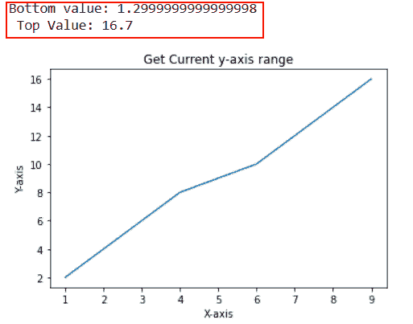

plt.ylim()

### 改变当前 y 轴范围

如果我们想改变当前 y 轴的极限，那么我们用你选择的底值和顶值调用 `ylim()` 函数。

**语法:**

```py
matplotlib.pyplot.ylim(bottom_value,top_value)
```

**我们来看一个例子:**

```py
**# Import Library**

import numpy as np
import matplotlib.pyplot as plt

**# Define Data**

x = [1, 2, 3, 4, 5]
y = [5, 10, 15, 20, 25]

**# Change current axes**

plt.ylim(10, 30)

**# Plot**

plt.plot(x,y,'-o')

**# Display**

plt.show()
```

这里我们使用 `ylim()` 函数来设置 y 轴的界限，并将最小值和最大值作为参数传递给该函数。

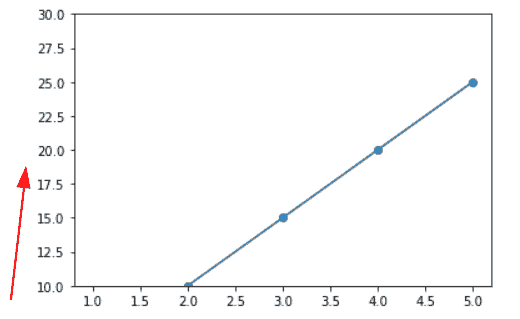

plt.ylim(10, 30)

### 用关键字参数改变当前 y 轴范围

这里我们将使用 `ylim()` 函数来改变 y 轴的轴范围，绕过**底部**和**顶部**作为关键字参数，而不是采用参数。

**语法:**

```py
matplotlib.pyplot.ylim(bottom=value, top=value)
```

**我们来看一个例子:**

```py
**# Import Library** 
import matplotlib.pyplot as plt
import numpy as np

**# Define data coordinates** 
x = np.linspace(20, 10, 100)
y = np.tan(x)

**# Change axes with keyword arguments** 
plt.ylim(bottom=-150, top=150)

**# Plot** 
plt.plot(x, y)

**# Display**

plt.show()
```

*   这里我们首先导入 `matplotlib.pyplot` 和 `numpy` 库。
*   接下来，我们定义数据坐标，使用 numpy 的 `linespace()` 和**【tan()**函数。
*   为了改变轴的限制，我们使用带有关键字参数**底部**和**顶部**的 `ylim()` 函数，并设置它们的值。这里我们将**底部**值设置为-150，将**顶部**值设置为 150。
*   为了绘制线图，我们使用了 `plot()` 函数。

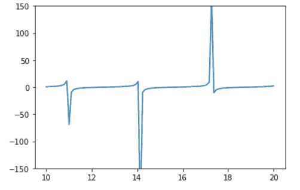

plt.ylim(bottom=-150, top=150)

阅读: [Matplotlib 饼图教程](https://pythonguides.com/matplotlib-pie-chart/)

## Matplotlib 设定 y 轴最大值

在这里，我们将学习设置或获取最大值的极限，即 y 轴的上限值。让我们看看不同的例子:

**例#1**

在本例中，我们将获得 y 轴的上限，为此，我们将获取变量 top，然后我们调用不带任何参数的 `ylim()` 函数。

**语法:**

```py
top=matplotlib.pyplot.ylim()
```

**源代码:**

```py
**# Import Library**

import numpy as np 
import matplotlib.pyplot as plt

**# Data Coordinates**

x = [3, 6, 9, 12, 15]
y = [5.5, 8, 10.5, 23, 12]

**# Plot**

plt.plot(x, y) 

**# Get and print current axes** 
bottom,top= plt.ylim()

print("Top value:",top)

**# Display**

plt.show()
```

**输出:**

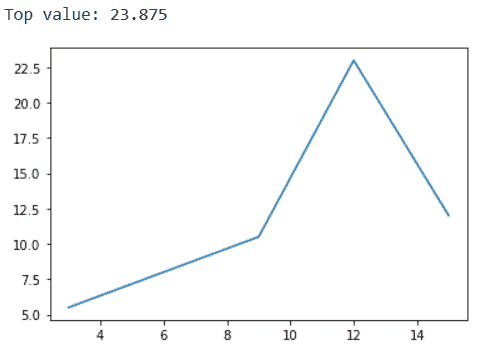

top=plt.ylim()

**例 2**

在本例中，我们将设置当前 y 轴的最大限制，为此，我们将使用关键字参数 `top` 和 `ylim()` 函数。

**语法:**

```py
matplotlib.pyplot.ylim(top=top_value)
```

**源代码:**

```py
**# Import Library**

import numpy as np 
import matplotlib.pyplot as plt

**# Data Coordinates**

x = np.linspace(0, 30, 150)
y = np.sin(x)

**# Plot** 
plt.plot(x, y) 

**# Set top axes**

plt.ylim(top=1.85)

**# Display**

plt.show()
```

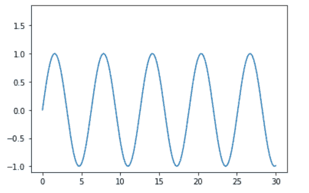

plt.ylim(top=1.85)

阅读: [Matplotlib 散点图颜色](https://pythonguides.com/matplotlib-scatter-plot-color/)

## Matplotlib 设定 y 轴最小值

在这里，我们将学习设置或获取 y 轴的最小极限。让我们看看不同的例子:

**例#1**

在本例中，我们将获得 y 轴的最小值，即**底部**极限。为此，我们取变量**底部**，然后我们不带任何参数地调用 `ylim()` 函数。在这之后，我们打印底部的值。

**语法:**

```py
bottom=matplotlib.pyplot.ylim()
```

**源代码:**

```py
 import matplotlib.pyplot as plt
import numpy as np

**# Define data coordinates**

x = np.arange(5, 11) 
y = np.exp(x)

**# Plot**

plt.plot(x, y)

**# Get and print current axes**

bottom,top= plt.ylim()

print("Bottom Value:",bottom)

**# Display** 
plt.show()
```

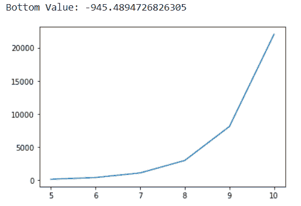

bottom=plt.ylim()

**例 2**

在这个例子中，我们将设置底部的 y 轴，为此，我们将传递一个参数给 `ylim()` 函数，它会自动将其作为底部的值。

**语法:**

```py
matplotlib.pyplot.ylim(value)
```

**源代码:**

```py
**# Import Libraries** 
import matplotlib.pyplot as plt
import numpy as np

**# Define Data** 
x = np.random.randint(low=1, high=20, size=25)

**# Plot**

plt.plot(x,linewidth=3, linestyle='dashed')

**# y-axis limits**

plt.ylim(-1)

**# Display**

plt.show()
```

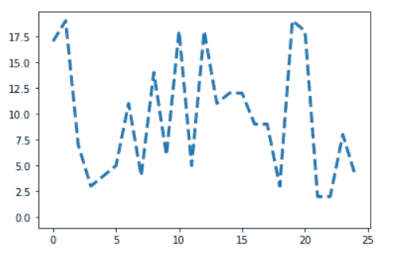

plt.ylim(-1)

阅读:[Matplotlib set _ x ticks–详细教程](https://pythonguides.com/matplotlib-set-xticks/)

## Matplotlib 设置 y 轴对数刻度

这里我们将看到一个对数图的示例，我们还设置了 y 轴的界限。

**举例:**

```py
**# Import Library** 
import matplotlib.pyplot as plt

**# Define Data**

data = [10**i for i in range(6)]

**# Convert y-axis** 
plt.yscale("log")  

**# Plot** 
plt.plot(data)

**# y-axis limit**

plt.ylim([1,2**14])

**# Display**

plt.show()
```

*   这里我们先导入 `matplotlib.pyplot` 库。
*   接下来，我们定义数据坐标。
*   然后，我们使用 `yscale()` 函数将 y 轴刻度转换为对数刻度。
*   为了绘制图表，我们使用了 `plot()` 函数。
*   为了设置 y 轴的极限，我们使用 `ylim()` 函数。
*   为了显示图形，我们使用 `show()` 函数。

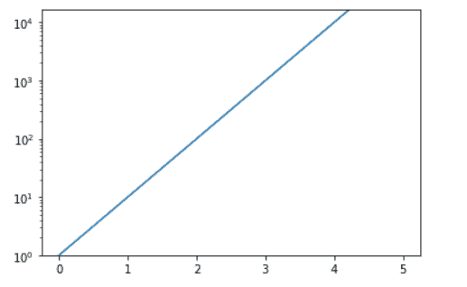

plt.ylim()

阅读:[Matplotlib fill _ between–完整指南](https://pythonguides.com/matplotlib-fill_between/)

## Matplotlib 散点图设置 y 轴范围

这里我们将设置散点图 y 轴的界限。为了创建散点图，我们使用 pyplot 模块的 `scatter()` 函数，为了设置 y 轴的范围，我们使用 `ylim()` 函数。

**举例:**

```py
**# Import Library** 
import matplotlib.pyplot as plt
import numpy as np

**# Define Data** 
x = [2, 6, 3, 5, 10, 9.5]
y = [20, 13, 15.6, 25, 6, 21]

**# Plotting** 
plt.scatter(x, y)

**# Set axes** 
plt.ylim(bottom=5,top=20)

**# Add label** 
plt.xlabel('X-Axis')
plt.ylabel('Y-Axis')

**# Display**

plt.show()
```

以下输出为默认 y 轴限值:

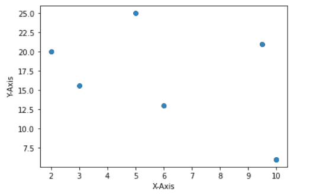

plt.scatter()

现在，让我们看看改变 y 轴限制后的输出:

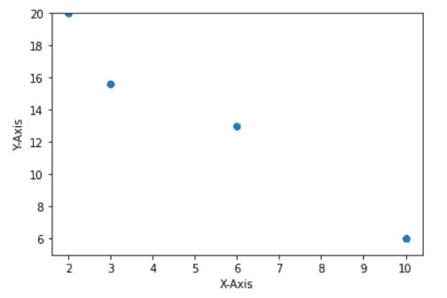

plt.ylim(bottom=5,top=20)

阅读:[Matplotlib set _ yticklabels–实用指南](https://pythonguides.com/matplotlib-set_yticklabels/)

## Matplotlib 设置 y 轴范围子图

这里我们将讨论如果我们在一个图形区域中绘制多个图，如何改变特定子图的 y 轴限制。

**举例:**

```py
**# Importing Libraries**

import numpy as np
import matplotlib.pyplot as plt

**# Create subplot**

fig, ax = plt.subplots(1, 2)

**# Define Data** 
x1= [0.2, 0.4, 0.6, 0.8, 1]
y1= [0.3, 0.6, 0.8, 0.9, 1.5]

x2= [2, 6, 7, 9, 10]
y2= [5, 10, 16, 20, 25]

**# Plot graph** 
ax[0].plot(x1, y1)
ax[1].plot(x2, y2)

**# Limit axes** 
ax[1].set_ylim(5,16)

**# Add space**

fig.tight_layout()

**# Display Graph** 
plt.show()
```

*   首先，我们导入 `numpy` 和 `matplotlib.pyplot` 库。
*   在这之后，我们使用 `subplots()` 函数创建一个 subplots。
*   然后我们为两个图创建 `x` 和 `y` 数据坐标。
*   为了绘制图表，我们使用 axes 模块的 `plot()` 函数。
*   这里我们通过使用 `set_ylim()` 函数来改变第一个子图的 x 轴限制。范围在 5 到 16 之间。
*   为了自动调整支线剧情之间的间距，我们使用了 `tight_layout()` 函数。
*   为了显示图表，我们使用了 `show()` 函数。

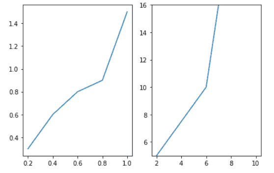

a[1].set_ylim()

阅读:[Matplotlib tight _ layout–有用教程](https://pythonguides.com/matplotlib-tight-layout/)

## Matplotlib 直方图设置 y 轴范围

在这里，我们将学习设置直方图中 y 轴的界限。

**举例:**

```py
**# Import Library**

import numpy as np
import matplotlib.pyplot as plt

**# Define Data**

x = np.random.normal(200, 10, 60)

**# Plot Histogram** 

plt.hist(x)

**# Set limits**

plt.ylim(top=15)

**# Display**

plt.show()
```

*   这里我们使用 `plt.hist()` 函数，来绘制直方图。
*   之后我们使用 `plt.ylim()` 函数，设置 y 轴的上限或最大值。

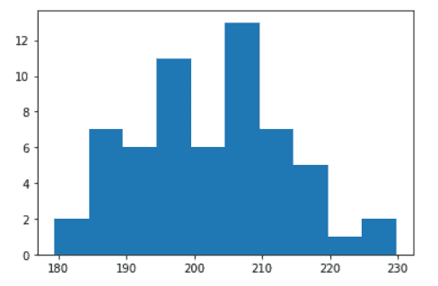

# Default axes limit

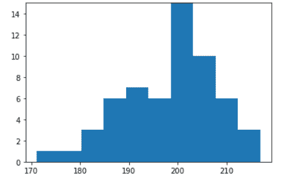

plt.ylim()

阅读:[Python Matplotlib tick _ params+29 示例](https://pythonguides.com/matplotlib-tick-params/)

## Matplotlib 条形图设置 y 轴范围

这里我们将看到一个条形图示例，其中我们手动设置了 y 轴的限值。

**举例:**

```py
**# Import Library**

import matplotlib.pyplot as plt

**# Define Data** 
x = ['Comdey', 'Action', 'Romance', 'Drama']
y = [4, 5.5, 7.6, 3]

**# Plot Histogram** 
plt.bar(x,y)

**# Set limits**

max_ylim = max(y) + 1.5
min_ylim = min(y) - 1
plt.ylim(min_ylim, max_ylim)

**# Display**

plt.show()
```

*   导入 `matplotlib.pyplot` 库。
*   接下来，创建数据点列表。
*   要绘制条形图，使用 `bar()` 功能。
*   定义两个变量 `max_ylim` 和 `min_ylim` ，用于获取 y 轴的最大值和最小值。
*   为了设置 y 轴的界限，我们使用了 `ylim()` 函数。
*   要显示图形，使用 `show()` 功能。

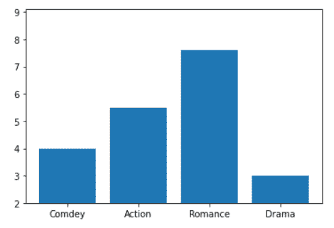

plt.bar()

阅读:[什么是 add_axes matplotlib](https://pythonguides.com/add_axes-matplotlib/)

## Matplotlib boxplot y 轴范围

这里我们将学习使用 matplotlib 设置 boxplot 的 y 轴范围。

**让我们看看与此相关的例子:**

**例#1**

在这个例子中，我们将使用 ylim()方法来设置轴范围。

```py
**# Import libraries** 
import matplotlib.pyplot as plt
import numpy as np

**# Figure size**

fig = plt.figure(figsize =(8,6))

**# Dataset**

np.random.seed(50)
data = np.random.normal(100, 20, 200) 

**# Creating plot** 
plt.boxplot(data)

**# Set y-axis range**

plt.ylim(0,200)

**# Show plot**

plt.show()
```

*   首先，我们导入 `matplotlib.pyplot` 和 `numpy` 库。
*   接下来，我们通过使用 `figure()` 方法和 `figsize` 参数来设置图形大小。
*   然后，我们使用 numpy 的 `seed()` 方法和 `random.normal()` 方法来定义数据坐标。
*   为了绘制箱线图，我们使用 `boxplot()` 方法。
*   要查看 y 轴的范围，我们使用 `ylim()` 方法。
*   为了显示该图，我们使用 `show()` 函数。

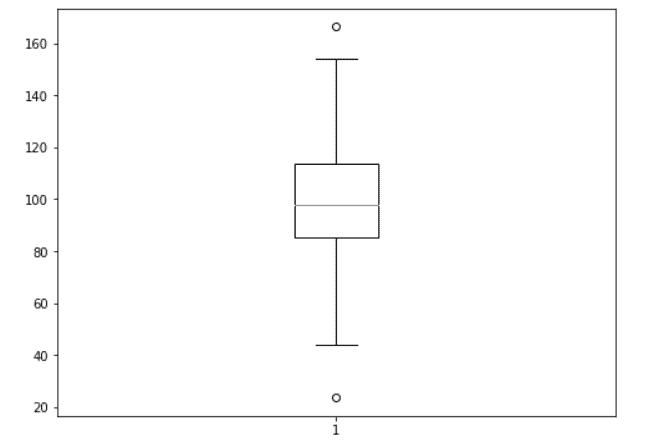

Original Plot

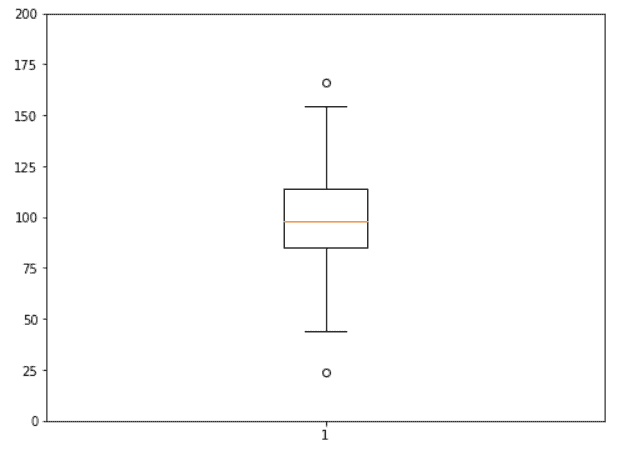

Matplotlib boxplot y-axis limit

这里，我们将最小限制设置为 0，最大限制设置为 200。我们也可以称之为下限和上限，而不是最小值和最大值。

**例 2**

在这个例子中，我们将使用 axis()方法来设置限制。

```py
**# Import libraries**

import pandas as pd
import numpy as np
import matplotlib.pyplot as plt

**# Define Data** 

df = pd.DataFrame(np.random.rand(30,10), 
                  columns=['C1', 'C2', 'C3', 'C4','C5', 
                          'C6','C7', 'C8', 'C9', 'C10' ])

**# Plot**

df.plot.box(grid='True')

**# Set y-axis range**

plt.axis([None, None, -0.75, 1.5])

**# Display**

plt.show()
```

*   导入**熊猫**库作为 `pd` 进行数据创建。
*   同样，导入 `numpy` 库作为 `np` 用于数据创建。
*   然后将 `matplotlib.pyplot` 库导入为 `plt` 进行数据可视化。
*   然后，使用 `DataFrame()` 函数创建数据帧。
*   要定义数据坐标，使用 `random.rand()` 函数。
*   要绘制箱线图，使用 `boxplot()` 函数。
*   为了设置 y 轴极限，我们使用 `axis()` 方法，我们分别设置 `xmin` 和 `xmax` 到 `None` 和 `ymin` 和 `ymax` 到 `-0.75` 和 `1.5` 。
*   要显示绘图，使用 `plot()` 功能。

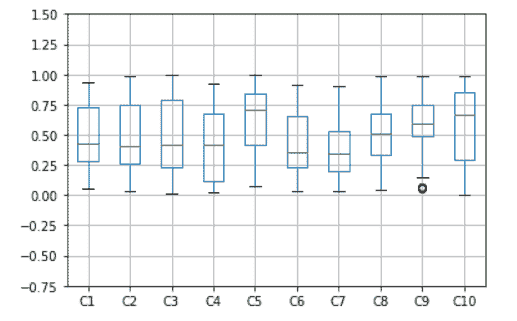

Matplotlib set y-axis range boxplot

阅读: [Matplotlib 二维表面图](https://pythonguides.com/matplotlib-2d-surface-plot/)

## Matplotlib y 轴范围设定值

在这里，我们将学习如何使用 setp()函数通过 matplotlib 设置 y 轴范围。

要设置 artist 对象的属性，请使用 matplotlib 包的 pyplot 模块中的 `setp()` 函数。

**以下是语法:**

```py
matplotlib.pyplot.setp(obj, ,\*args, \*\*kwargs)
```

**以下是使用的参数:**

*   艺术家对象由这个参数表示。
*   ****kwargs:** 有多种关键字参数可以使用。

**让我们看看与此相关的例子:**

**例#1**

在本例中，我们使用 setp()函数和 ylim()函数来设置 y 轴范围。

```py
**# Import Libraries**

import matplotlib.pyplot as plt
import numpy as np

**# Define Data** 

x = np.arange(50)
y = np.sin(x)

**# Plot**

plt.plot(x, y)

**# Set limit**

plt.setp(plt.gca(),ylim=(0,1))

**# Display**

plt.show()
```

*   导入 `matplotlib.pyplot` 库进行数据可视化。
*   导入用于数据创建的 `numpy` 库。
*   要定义 x 和 y 数据坐标，使用 numpy 的 `arange()` 和 `sin()` 函数。
*   要绘制图形，使用 `plot()` 函数。
*   为了设置轴限制，我们使用 `setp()` 函数，为了表示对象，我们使用 pyplot 模块的 `gca()` 函数。
*   我们还将带有**最小值**和**最大值**的 `ylim()` 函数传递给 `setp()` 函数来设置 y 轴范围。
*   要在用户屏幕上显示图形，使用 `show()` 功能。

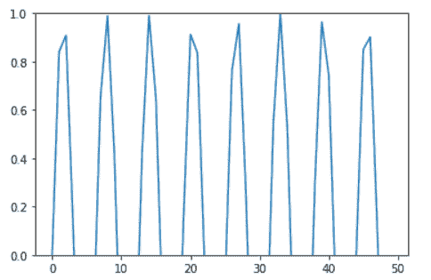

Matplotlib y axis range setp

**例 2**

```py
**# Import Libraries**

import matplotlib.pyplot as plt
import numpy as np

**# Define Data** 

name = ['Ava', 'Noah', 'Charlotte', 'Robert', 'Patricia']
weight_kg = [45, 60, 50, 75, 53]

**# Plot**

plt.bar(name, weight_kg)

**# Set y-axis**

plt.setp(plt.gca(), ylim=(0, 100))

**# Display**

plt.show()
```

*   导入必要的库，如 `numpy` 和 `matplotlib.pyplot` 。
*   接下来，定义绘制图形的数据坐标。
*   要创建条形图，使用 `bar()` 函数。
*   为了设置轴限制，我们使用 `setp()` 函数和 `ylim()` 函数。
*   要显示图形，使用 `show()` 功能。

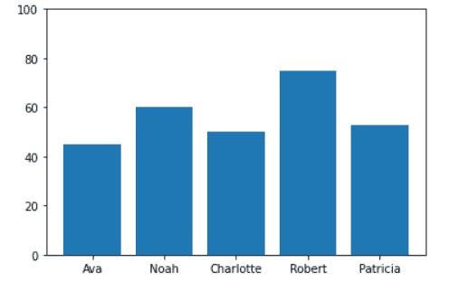

Matplotlib y axis range using setp

你可能也喜欢阅读下面的 Matplotlib 教程。

*   [Matplotlib 散点图图例](https://pythonguides.com/matplotlib-scatter-plot-legend/)
*   [Matplotlib 增加地块大小](https://pythonguides.com/matplotlib-increase-plot-size/)
*   [Matplotlib 多条形图](https://pythonguides.com/matplotlib-multiple-bar-chart/)
*   [堆积条形图 Matplotlib](https://pythonguides.com/stacked-bar-chart-matplotlib/)
*   [什么是 add_axes matplotlib](https://pythonguides.com/add_axes-matplotlib/)
*   [画垂直线 matplotlib](https://pythonguides.com/draw-vertical-line-matplotlib/)
*   [Matplotlib 2d 表面图](https://pythonguides.com/matplotlib-2d-surface-plot/)

因此，在这个 **Python 教程**中，我们已经讨论了**“Matplotlib set y 轴范围”**，并且我们也涵盖了一些与之相关的例子。这些是我们在本教程中讨论过的以下主题。

*   Matplotlib 设置 y 轴范围
*   Matplotlib 设置 y 轴范围调用
*   Matplotlib 设置 y 轴最大值
*   Matplotlib 设置 y 轴最小值
*   Matplotlib 设置 y 轴对数刻度
*   Matplotlib 散点图集合 y 轴范围
*   Matplotlib 设置 y 轴范围子图
*   Matplotlib 直方图设置 y 轴范围
*   Matplotlib 条形图集 y 轴范围
*   Matplotlib 箱形图 y 轴范围
*   Matplotlib y 轴范围设定值

[Bijay Kumar](https://pythonguides.com/author/fewlines4biju/)

Python 是美国最流行的语言之一。我从事 Python 工作已经有很长时间了，我在与 Tkinter、Pandas、NumPy、Turtle、Django、Matplotlib、Tensorflow、Scipy、Scikit-Learn 等各种库合作方面拥有专业知识。我有与美国、加拿大、英国、澳大利亚、新西兰等国家的各种客户合作的经验。查看我的个人资料。

[enjoysharepoint.com/](https://enjoysharepoint.com/)[](https://www.facebook.com/fewlines4biju "Facebook")[](https://www.linkedin.com/in/fewlines4biju/ "Linkedin")[](https://twitter.com/fewlines4biju "Twitter")