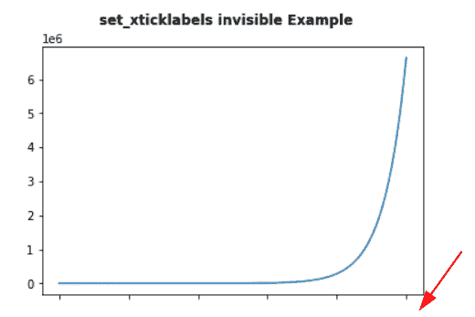
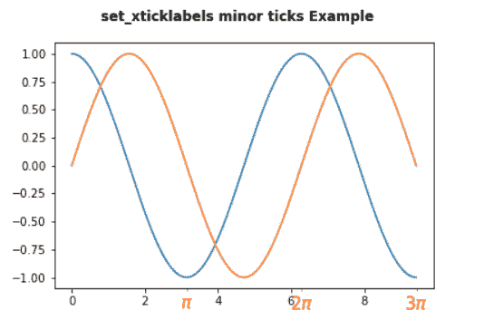

# Matplotlib set_xticklabels

> 原文：<https://pythonguides.com/matplotlib-set_xticklabels/>

[](https://sharepointsky.teachable.com/p/python-and-machine-learning-training-course)

在本 [Python Matplotlib 教程](https://pythonguides.com/what-is-matplotlib/)中，我们将讨论 Matplotlib 中的`Matplotlib set _ xticklabels`。这里我们将介绍使用 matplotlib 与 set_xticklabels 相关的不同示例。我们还将讨论以下主题:

*   Matplotlib set_xticklabels
*   matplorlib set _ xticklabels fontdict
*   matplotlib set _ xticklabels font size
*   Matplotlib set_xticklabels font
*   Matplotib set_xticklabels 颜色
*   matplotlib set _ xticklabels vertical
*   Matplotlib set_xticklabels 水平对齐
*   Matplotlib set_xticklabels 旋转
*   Matplotlib set_xticklabels hide
*   Matplotlib set_xticklabels 对齐
*   Matplotlib set_xticklabels minor
*   matplotlib box plot set _ x tick labels

目录

[](#)

*   [Matplotlib set _ xticklabels](#Matplotlib_set_xticklabels "Matplotlib set_xticklabels")
*   [matplotlib set _ xticklabels fontdict](#Matplotlib_set_xticklabels_fontdict "Matplotlib set_xticklabels fontdict")
*   [Matplotlib set _ xticklabels font size](#Matplotlib_set_xticklabels_fontsize "Matplotlib set_xticklabels fontsize")
*   [Matplotlib set_xtciklabels 字体](#Matplotlib_set_xtciklabels_font "Matplotlib set_xtciklabels font")
*   [Matplotlib set _ xticklabels color](#Matplotlib_set_xticklabels_color "Matplotlib set_xticklabels color")
*   [Matplotlib set _ xticklabels vertical](#Matplotlib_set_xticklabels_vertical "Matplotlib set_xticklabels vertical")
    *   [垂直对齐=‘居中’](#verticalalignmentcenter "verticalalignment=’center’")
    *   [verticallinenemnt =‘top’](#Verticalalignemnttop "Verticalalignemnt=’top’")
*   [Matplotlib set_xticklabels 水平对齐 mnt](#Matplotlib_set_xticklabels_horizontal_alignemnt "Matplotlib set_xticklabels horizontal alignemnt")
    *   [水平对齐= '居中'](#horizontalalignmentcenter "horizontalalignment=’center’")
    *   [horizontalalignment= '右'](#horizontalalignment_right "horizontalalignment= ‘right’")
    *   [水平对齐= '左'](#horizontalalignmentleft "horizontalalignment=’left’")
*   [matplotlib set _ xticklabels rotation](#Matplotlib_set_xticklabels_rotation "Matplotlib set_xticklabels rotation")
*   [Matplotlib set _ xticklabels hide](#Matplotlib_set_xticklabels_hide "Matplotlib set_xticklabels hide")
*   [Matplotlib set_xticklabels 对齐](#Matplotlib_set_xticklabels_alignment "Matplotlib set_xticklabels alignment")
*   [Matplotlib set _ xticklabels minor](#Matplotlib_set_xticklabels_minor "Matplotlib set_xticklabels minor")
*   [Matplotlib box plot set _ xticklabels](#Matplotlib_boxplot_set_xticklabels "Matplotlib boxplot set_xticklabels")

## Matplotlib set _ xticklabels

在本节中，我们将了解 Python 中 matplotlib 的 axes 模块中的 `set_xticklabels()` 函数。 `set_xticklabels` 函数用于用字符串标签列表设置 x 刻度标签。

**语法如下:**

```py
matplotlib.axes.Axes.set_xticklabels(labels, fontdict=None, minor=False, **kwargs)
```

**以下是上面使用的参数:**

| 因素 | 价值 | 默认 | 描述 |
| 标签 | 字符串列表 |  | 指定了字符串标签列表 |
| 丰迪克特 | 词典 | { ' font size ':RC params[' axes . title size ']，' font weight ':RC params[' axes . title weight ']，' verticalalignment' : 'baseline '，' horizontalalignment' : loc } | 此参数用于控制标签的外观。 |
| 较小的 | 弯曲件 | 错误的 | 该参数用于指定是否设置次要标签而不是主要标签。 |

> **警告**
> 
> This method only be used after fixing the tick positions using `Axes.set_xticks`.

**我们来看一个例子:**

```py
**# Import Library**

import numpy as np
import matplotlib.pyplot as plt

**# Create subplot**

fig, ax = plt.subplots()

**# Define Data**

x = np.linspace(0, 5 * np.pi, 100)
y1 = np.sin(x)

**# Plot**

ax.plot(x, y1)

**# Set ticklabels**

ax.set_xticks([0, np.pi, 2 * np.pi, 3 * np.pi, 4 * np.pi, 5 * np.pi])
ax.set_xticklabels(['0', r'$\pi$', r'2$\pi$', r'3$\pi$', r'4$\pi$', r'5$\pi$'])

**# Add fig title** 

fig.suptitle('set_xticklabels()function Example', fontweight ="bold")

**# Display**

plt.show()
```

*   在上面的例子中，首先我们导入了 `numpy` 和 `matplotlib` 库。
*   之后，我们使用 `subplots()` 函数创建一个 subplot。
*   为了定义数据坐标，我们使用了 `linespace()` 和 `sin()` 方法。
*   为了绘制 x 和 y 数据坐标之间的图形，我们使用 `plot()` 函数。
*   要固定记号的位置，使用 `set_xticks()` 函数。
*   要在 x 轴刻度标签处设置字符串标签，使用 `set_xticklabels()` 函数。
*   为了添加 suptitle，我们使用了 figure 类的 `suptitle()` 函数。
*   要在用户屏幕上显示图形，使用 `show()` 功能。


set_xticklabels()

## matplotlib set _ xticklabels fontdict

我们将学习如何使用 `set_xticklabels` 方法的 `fontdict` 参数。 `fondict` 参数是一个用于控制 ticklabels 外观的字典。

**以下是语法:**

```py
matplotlib.axes.Axes.set_xticklabels(labels, fontdict=None)
```

**举例:**

```py
**# Import Library**

import numpy as np
import matplotlib.pyplot as plt

**# Create subplot**

fig, ax = plt.subplots()

**# Define Data**

x = np.linspace(0, 3 * np.pi, 100)
y1 = np.cos(x)

**# Plot**

ax.plot(x, y1)

**# fontdict dictionary**

font_dict = {'fontsize': 20, 'fontweight': 'heavy', 'verticalalignment':'top'}

**# Set ticklabels**

ax.set_xticks([0, np.pi, 2 * np.pi, 3 * np.pi])
ax.set_xticklabels(['0', r'$\pi$', r'2$\pi$', r'3$\pi$'], fontdict=font_dict)

**# Add fig title** 

fig.suptitle('set_xticklabels fontdict Example', fontweight ="bold")

**# Display**

plt.show()
```

这里我们将 `fontdict` 参数传递给 `set_xticklabels` 函数。我们创建一个字典 `font_dict` 来用下面的键和值改变标签的外观:

| **键** | **值** |
| 字体大小 | Twenty |
| 字体粗细 | 沉重的 |
| 垂直排列 | 顶端 |

**输出:**


set_xticklabels(fontdict={})

读取 [Matplotlib 两个 y 轴](https://pythonguides.com/matplotlib-two-y-axes/)

## Matplotlib set _ xticklabels font size

这里我们将学习如何修改 x 轴刻度标签的字体大小。要更改大小，我们必须将 `fontsize` 参数传递给 `set_xticklabels` 方法。

**以下是语法:**

```py
matplotlib.axes.Axes.set_xtciklabels(labels, fontsize=None)
```

**我们来看一个例子:**

```py
**# Import Library** 
import numpy as np
import matplotlib.pyplot as plt

**# Create subplot** 
fig, ax = plt.subplots()

**# Define Data**

x = np.linspace(0, 3 * np.pi, 100)
y = np.cos(30*x)

**# Plot**

ax.plot(x, y)

**# Set ticklabels**

ax.set_xticks([0, np.pi, 2 * np.pi, 3 * np.pi])
ax.set_xticklabels(['0', r'$\pi$', r'2$\pi$', r'3$\pi$'], fontsize=5.5)

**# Add fig title** 

fig.suptitle('set_xticklabels fontsize Example', fontweight ="bold")

**# Display** 
plt.show()
```

*   在上面的例子中，我们通过使用 `set_xticklabels` 函数在 x 轴上设置文本标签，并且我们将 `fontsize` 参数传递给该函数来改变 ticklabels 的字体大小。
*   webassign


set_xticklabels(fontsize=5.5)

读取[堆积条形图 Matplotlib](https://pythonguides.com/stacked-bar-chart-matplotlib/)

## Matplotlib set_xtciklabels 字体

我们将学习如何改变 x 轴刻度标签的字体样式。为了改变样式，我们将 `fontstyle` 参数传递给 `set_xticklabels` 方法。

**以下是语法:**

```py
matplotlib.axes.Axesset_xticklabels(labels, fontstyle=None)
```

**我们来看一个例子:**

```py
**# Import Library**

import numpy as np
import matplotlib.pyplot as plt

**# Create subplot**

fig, ax = plt.subplots()

**# Define Data**

x = np.linspace(0, 6 * np.pi, 250)
y = np.sin(60*x)

**# Plot**

ax.plot(x, y)

**# Set ticklabels**

ax.set_xticks([0, 2 * np.pi, 4 * np.pi, 6 * np.pi])
ax.set_xticklabels(['0', r'2$\pi$', r'4$\pi$', r'6$\pi$'], fontstyle='italic')

**# Add fig title** 
fig.suptitle('set_xticklabels fontstyle Example', fontweight ="bold")

**# Display** 
plt.show()
```

这里我们改变 x 轴刻度标签的字体样式，并将其设置为**斜体**。


set_xticklabels(fontstyle=’italic’)

读取 [Matplotlib 3D 散点图](https://pythonguides.com/matplotlib-3d-scatter/)

## Matplotlib set _ xticklabels color

这里我们改变 x 轴刻度标签的字体样式，并将其设置为**斜体**。这里我们将学习改变 xticklabels 的颜色。为此，我们必须将**颜色**参数传递给 `set_xticklabels` 方法。

**以下是语法:**

```py
matplotlib.axes.Axes.set_xticklabels(labels, color=None)
```

**我们来看一个例子:**

```py
**# Import Library**

import numpy as np
import matplotlib.pyplot as plt

**# Create subplot**

fig, ax = plt.subplots()

**# Define Data**

x = np.linspace(0, 3 * np.pi, 100)
y = np.sin(x)

**# Plot**

ax.plot(x, y)

**# Set ticklabels**

ax.set_xticks([0, np.pi, 2 * np.pi, 3 * np.pi])
ax.set_xticklabels(['0', r'$\pi$', r'2$\pi$', r'3$\pi$'], color='red', fontsize=15)

**# Add fig title** 

fig.suptitle('set_xticklabels color Example', fontweight='bold')

**# Display** 
plt.show()
```

*   在上面的例子中，我们使用 `linespace()` 和 `sin()` 方法定义数据坐标，并使用 `plot()` 方法绘制坐标。
*   之后，我们使用 `set_xticks()` 方法来固定 x 轴上的刻度位置。
*   然后我们使用 `set_xticklabels()` 方法在轴上设置字符串标签。为了改变标签的颜色，我们将**颜色**参数传递给方法。


set_xticklables(color=’red)

默认情况下，ticklabels 的颜色是黑色的，现在我们将其更改为红色。

## Matplotlib set _ xticklabels vertical

这里我们将学习改变 xticklabels 的垂直对齐方式。要更改对齐，请将 `verticalalignment` 参数传递给 `set_xticklabels()` 方法。

代替垂直对齐，你也可以写 `va` 。

**以下是语法:**

```py
matplotlib.axes.Axes.set_xticklabels(lables, verticalalignemnt='center' | 'top' | 'bottom' | 'baseline')
```

**4 种不同的垂直校准是:**

*   中心
*   顶端
*   底部
*   基线

### 垂直对齐=‘居中’

**举例:**

```py
**# Import Library** 
import numpy as np
import matplotlib.pyplot as plt

**# Create subplot**

fig, ax = plt.subplots()

**# Define Data**

x = np.linspace(0, 3 * np.pi, 100)
y = np.tan(x)

**# Plot**

ax.plot(x, y)

**# Set ticklabels**

ax.set_xticks([0, np.pi, 2 * np.pi, 3 * np.pi])

ax.set_xticklabels(['0', r'$\pi$', r'2$\pi$', r'3$\pi$'], verticalalignment='center')

**# Add fig title**   

fig.suptitle('set_xticklabels verticalalignment Example', fontweight='bold')

**# Display**

plt.show()
```

*   这里我们使用 `linespace()` 和 `tan()` 方法来定义数据坐标。
*   在此之后，我们使用 `plot()` 方法绘制 x 和 y 坐标之间的图形。
*   要设置刻度线，使用 `set_xticks()` 方法。
*   为了设置字符串格式的刻度标签，我们使用了 `set_xticklabels()` 方法。
*   这里我们将刻度标签的**垂直对齐**设置为**中心**。


verticalalignement=’center’

### verticallinenemnt =‘top’

**举例:**

```py
**# Import Library**

import numpy as np
import matplotlib.pyplot as plt

**# Create subplot**

fig, ax = plt.subplots()

**# Define Data**

x = np.linspace(0, 3 * np.pi, 100)
y = np.tan(x)

**# Plot** 
ax.plot(x, y)

**# Set ticklabels**

ax.set_xticks([0, np.pi, 2 * np.pi, 3 * np.pi])

ax.set_xticklabels(['0', r'$\pi$', r'2$\pi$', r'3$\pi$'], verticalalignment='top')

**# Add fig title**   

fig.suptitle('set_xticklabels verticalalignment Example', fontweight='bold')

**# Display**

plt.show()
```

这里我们将 `verticalalignment` 参数传递给 `set_xticklabels` 方法，以设置 ticklabels 与 `top` 的对齐。


verticalalignemnt=’top’

## Matplotlib set_xticklabels 水平对齐 mnt

这里我们将学习改变 x 标签的水平对齐。要更改对齐方式，请将 `horizontalalignment` 参数传递给该方法。

你可以写 `ha` 来代替水平对齐

**以下是语法:**

```py
matplotlib.axes.Axes.set_xticklabels(labels, horizontalalignment='center' | 'right' | 'left' )
```

**让我们看看不同水平对齐的例子:**

### 水平对齐= '居中'

```py
**# Import Library**

import numpy as np
import matplotlib.pyplot as plt

**# Create subplot**

fig, ax = plt.subplots()

**# Define Data**

x = np.linspace(0, 5 * np.pi, 150)
y1 = np.tan(x)

**# Plot**

ax.plot(x, y1)

**# Set ticklabels**

ax.set_xticks([0, np.pi, 2 * np.pi, 3 * np.pi, 4 * np.pi, 5 * np.pi])

ax.set_xticklabels(['0', r'$\pi$', r'2$\pi$', r'3$\pi$', r'4$\pi$', r'5$\pi$'], horizontalalignment='center')

**# Add fig title** 

fig.suptitle('set_xticklabels horizontalalignmnt Example', fontweight='bold')

**# Display**

plt.show()
```

*   这里我们用 `linespace()` 和 `tan()` 的方法来定义数据坐标。
*   之后，我们使用 `plot()` 函数来绘制 x 和 y 数据坐标之间的线图。
*   要设置刻度，请使用 `set_xticks()` 方法。
*   为了设置字符串格式的刻度标签，我们使用了 `set_xticklabels()` 方法。
*   这里我们将刻度标签的**水平对齐**设置为**中心**。


ha=’center’

### horizontalalignment= '右'

```py
**# Import Library**

import numpy as np
import matplotlib.pyplot as plt

**# Create subplot** 
fig, ax = plt.subplots()

**# Define Data**

x = np.linspace(0, 5 * np.pi, 150)
y = np.tan(x)

**# Plot**

ax.plot(x, y)

**# Set ticklabels** 
ax.set_xticks([0, np.pi, 2 * np.pi, 3 * np.pi, 4 * np.pi, 5 * np.pi])

ax.set_xticklabels(['0', r'$\pi$', r'2$\pi$', r'3$\pi$', r'4$\pi$', r'5$\pi$'], horizontalalignment='right')

# `Add fig title` 

fig.suptitle('set_xticklabels horizontalalignment Example', fontweight='bold')

**# Display**

plt.show()
```

这里我们将 x 标签的**水平对齐**设置为**右**。


ha=’right’

### 水平对齐= '左'

```py
**# Import Library**

import numpy as np
import matplotlib.pyplot as plt

**# Create subplot** 
fig, ax = plt.subplots()

**# Define Data**

x = np.linspace(0, 5 * np.pi, 150)
y = np.tan(x)

**# Plot**

ax.plot(x, y)

**# Set ticklabels**

ax.set_xticks([0, np.pi, 2 * np.pi, 3 * np.pi, 4 * np.pi, 5 * np.pi])

ax.set_xticklabels(['0', r'$\pi$', r'2$\pi$', r'3$\pi$', r'4$\pi$', r'5$\pi$'], horizontalalignment='left')

**# Add fig title**   

fig.suptitle('set_xticklabels horizontalalignment Example', fontweight='bold')

**# Display**

plt.show()
```


ha=’left’

## matplotlib set _ xticklabels rotation

在这里，我们将学习旋转 x 轴标签。要更改旋转角度，请将**旋转**参数传递给 `set_xtciklabels()` 方法。我们可以用它来避免在 **x 轴**重叠标签。

**以下是语法:**

```py
matplotlib.axes.Axes.set_xticklabels(labels, rotation=None)
```

**我们来看一个例子:**

```py
**# Import Library**

import numpy as np
import matplotlib.pyplot as plt

**# Create subplot**

fig, ax = plt.subplots()

**# Define Data**

x = np.linspace(0, 5 * np.pi, 150)
y1 = np.exp(x)

**# Plot**

ax.plot(x, y1)

**# Set ticklabels**

ax.set_xticks([0, np.pi, 2 * np.pi, 3 * np.pi, 4 * np.pi, 5 * np.pi])

ax.set_xticklabels(['0', r'$\pi$', r'2$\pi$', r'3$\pi$', r'4$\pi$', r'5$\pi$'], rotation=30)

**# Add fig title  ** 

fig.suptitle('set_xticklabels rotation Example', fontweight='bold')

**# Display** 
plt.show()
```

*   在上面的例子中，为了定义数据坐标，我们使用了 `linespace()` 和 `exp()` 方法。并且要绘制一个图形，使用 matplotlib 的 `plot()` 方法。
*   为了在这里旋转 ticklabels，我们使用带有**旋转**参数的 `set_xticklabels()` 函数。


set_xticklabels(rotation=30)

## Matplotlib set _ xticklabels hide

这里我们将学习如何隐藏 x 轴上的标签。在这里，我们将刻度标签设置为空，以便使轴刻度或刻度标签不可见。但是扁虱依然存在。

**以下是语法:**

```py
matplotlib.axes.Axes.set_xticklabels([])
```

**我们来看一个例子:**

```py
**# Import Library**

import numpy as np
import matplotlib.pyplot as plt

**# Create subplot** 
fig, ax = plt.subplots()

**# Define Data** 
x = np.linspace(0, 5 * np.pi, 150)
y = np.exp(x)

**# Plot**

ax.plot(x, y)

**# Set ticklabels**

ax.set_xticks([0, np.pi, 2 * np.pi, 3 * np.pi, 4 * np.pi, 5 * np.pi])

ax.set_xticklabels([])

**# Add fig title  ** 

fig.suptitle('set_xticklabels invisible Example', fontweight='bold')

**# Display**

plt.show()
```

这里我们将**空白列表**传递给 `set_xtciklabels()` 方法，这样标签就不可见了。



## Matplotlib set_xticklabels 对齐

在这里，我们将学习更改 x 轴标签的对齐方式。要更改对齐，请将**旋转**作为 `set_xticklabels` 方法的参数，并将其值设置为**垂直**和**水平**。

**以下是语法:**

```py
matplotlib.axes.Axes.set_xticklabels(label, rotation='vertical' | 'horizontal')
```

**例子:**

```py
**# Import Library**

import numpy as np
import matplotlib.pyplot as plt

**# Create subplot**

fig, ax = plt.subplots()

**# Define Data**

x = np.linspace(0, 5 * np.pi, 150)
y1 = np.cos(x)
y2 = np.sin(x)

**# Plot** 
ax.plot(x, y1)
ax.plot(x, y2)

**# Set ticklabels**

ax.set_xticks([0, np.pi, 2 * np.pi, 3 * np.pi, 4 * np.pi, 5 * np.pi])

ax.set_xticklabels(['0', r'$\pi$', r'2$\pi$', r'3$\pi$', r'4$\pi$', r'5$\pi$'], rotation='vertical')

                         **#OR**

ax.set_xticklabels(['0', r'$\pi$', r'2$\pi$', r'3$\pi$', r'4$\pi$', r'5$\pi$'], rotation='horizontal')

**# Add fig title** 
fig.suptitle('set_xticklabels alignment Example', fontweight='bold')

**# Display**

plt.show()
```

在上面的例子中，我们将**旋转**参数传递给 `set_xticklabels()` 方法，并设置其值**垂直**和**水平**，以在 **x 轴**对齐标签。


alignment=’vertical’


alignment=’horizontal’

## Matplotlib set _ xticklabels minor

这里我们将学习如何在 x 轴上设置次要标签而不是主要标签。

**以下是语法:**

```py
matplotlib.axes.Axes.set_xticklabels(labels, minor=True)
```

**举例:**

```py
**# Import Library** 
import numpy as np
import matplotlib.pyplot as plt

**# Create subplot** 
fig, ax = plt.subplots()

**# Define Data**

x = np.linspace(0, 3 * np.pi, 150)
y1 = np.cos(x)
y2 = np.sin(x)

**# Plot**

ax.plot(x, y1)
ax.plot(x, y2)

**# Set ticklabels** 
ax.set_xticks([0, np.pi, 2* np.pi, 3 * np.pi], minor=True)

ax.set_xticklabels(['0', r'$\pi$', r'2$\pi$', r'3$\pi$'], minor=True, fontsize=15, color='red')

**# Add fig title** 

fig.suptitle('set_xticklabels minor ticks Example', fontweight='bold')

**# Display**

plt.show()
```

在上面的例子中，我们将 `minor` 作为参数传递给方法 `set_xtickss` 和 `set_xticklabels` 来设置次要 ticklabels 和 tick。



set_xticklabels(minor=True)

## Matplotlib box plot set _ xticklabels

我们将学习如何绘制一个箱线图，并在 x 轴上设置文本标签。

**以下是语法:**

```py
matplotlib.axes.Axes.set_xticklabels(labels)
```

**举例:**

```py
**# Import Library**

import numpy as np
import matplotlib.pyplot as plt

**# Subplot** 
fig, ax = plt.subplots()

**# Define` **Data Coordinates`

xticks = [2, 4, 6, 8, 10]

**# Plot**

plt.boxplot(xticks)

**# Ticklabels** 

ax.set_xticks(xticks)

ax.set_xticklabels(['Mon' , 'Tue' , 'Wed', 'Thur', 'Fri' ])

**# Display**

plt.show()
```

*   在上面的例子中，我们导入了 `matplotlib.pyplot` 和 `numpy` 。
*   然后我们使用 `subplots()` 方法创建一个支线剧情。
*   之后，我们使用 `boxplot()` 方法绘制箱线图。
*   要设置记号和记号标签，使用 `set_xticks` 和`set _ x ticks`方法。


您可能会喜欢以下 Python Matplotlib 教程:

*   [Matplotlib fill_between](https://pythonguides.com/matplotlib-fill_between/)
*   [Matplotlib set _ yticklabels](https://pythonguides.com/matplotlib-set_yticklabels/)
*   [Matplotlib tight_layout](https://pythonguides.com/matplotlib-tight-layout/)
*   [Python Matplotlib tick _ params+29 示例](https://pythonguides.com/matplotlib-tick-params/)
*   [Matplotlib x 轴标签](https://pythonguides.com/matplotlib-x-axis-label/)
*   [Matplotlib 多条形图](https://pythonguides.com/matplotlib-multiple-bar-chart/)

在本教程中，我们学习了:

*   Matplotlib set_xticklabels
*   matplorlib set _ xticklabels fontdict
*   matplotlib set _ xticklabels font size
*   Matplotlib set_xticklabels font
*   Matplotib set_xticklabels 颜色
*   matplotlib set _ xticklabels vertical
*   Matplotlib set_xticklabels 水平对齐
*   Matplotlib set_xticklabels 旋转
*   Matplotlib set_xticklabels hide
*   Matplotlib set_xticklabels 对齐
*   Matplotlib set_xticklabels minor
*   matplotlib box plot set _ x tick labels

[Bijay Kumar](https://pythonguides.com/author/fewlines4biju/)

Python 是美国最流行的语言之一。我从事 Python 工作已经有很长时间了，我在与 Tkinter、Pandas、NumPy、Turtle、Django、Matplotlib、Tensorflow、Scipy、Scikit-Learn 等各种库合作方面拥有专业知识。我有与美国、加拿大、英国、澳大利亚、新西兰等国家的各种客户合作的经验。查看我的个人资料。

[enjoysharepoint.com/](https://enjoysharepoint.com/)[](https://www.facebook.com/fewlines4biju "Facebook")[](https://www.linkedin.com/in/fewlines4biju/ "Linkedin")[](https://twitter.com/fewlines4biju "Twitter")