# Matplotlib 子情节 _adjust

> 原文：<https://pythonguides.com/matplotlib-subplots_adjust/>

[](https://sharepointsky.teachable.com/p/python-and-machine-learning-training-course)

在本 python 教程中，我们将讨论 Python 中的`Matplotlib subplots _ adjust`，这使我们能够在单个图形中优化多个图，我们还将讨论以下主题:

*   Matplotlib 子情节 _adjust
*   Matplotlib 子情节 _ 调整紧密度 _ 布局
*   Matplotlib 子图间距
*   Matplotlib 子图 _ 调整高度和空间
*   Matplotlib 子图 _ 调整图形大小
*   matplotlib subplots _ adjust wspace 和 width
*   Matplotlib 子情节 _ 调整底部
*   Matplotlib 子情节 _ 右调整
*   Matplotlib subplots_adjust 不起作用

目录

[](#)

*   [Matplotlib 子情节 _adjust](#Matplotlib_subplots_adjust "Matplotlib subplots_adjust")
*   [Matplotlib 支线剧情 _ 调整紧密 _ 布局](#Matplotlib_subplots_adjust_tight_layout "Matplotlib subplots_adjust tight_layout ")
*   [Matplotlib 子情节间距](#Matplotlib_subplots_spacing "Matplotlib subplots spacing ")
    *   [使用 tight_layout()函数](#Using_tight_layout_function "Using tight_layout() function")
    *   [使用 subplots_adjust()函数](#Using_subplots_adjust_function "Using subplots_adjust() function ")
    *   [使用 subplot_tool()函数](#Using_subplot_tool_function "Using subplot_tool() function ")
*   [Matplotlib subplot _ adjust height or hspace](#Matplotlib_subplot_adjust_height_or_hspace "Matplotlib subplot_adjust height or hspace ")
    *   [使用 tight_layout()函数](#Using_tight_layout_function-2 "Using tight_layout() function ")
    *   [使用 subplots_adjust()函数](#Using_subplots_adjust_function-2 "Using subplots_adjust() function")
    *   [使用 subplot_tool()函数](#Using_subplot_tool_function-2 "Using subplot_tool() function ")
*   [Matplotlib 子情节 _ 调整图形尺寸](#Matplotlib_subplots_adjust_figure_size "Matplotlib subplots_adjust figure size ")
*   [Matplotlib subplot _ adjust width 或 wspace](#Matplotlib_subplot_adjust_width_or_wspace "Matplotlib subplot_adjust width or wspace ")
    *   [使用 tight_layout()函数](#Using_tight_layout_function-3 "Using tight_layout() function")
    *   [使用 subplots_adjust()函数](#Using_subplots_adjust_function-3 "Using subplots_adjust() function")
    *   [使用 subplot_tool()函数](#Using_subplot_tool_function-3 "Using subplot_tool() function")
*   [Matplotlib subplot _ adjust bottom](#Matplotlib_subplot_adjust_bottom "Matplotlib subplot_adjust bottom")
    *   [使用 tight_layout()方法](#Using_tight_layout_method "Using tight_layout() method")
    *   [使用 subplots_adjust()方法](#Using_subplots_adjust_method "Using subplots_adjust() method")
    *   [使用 subplot_tool()方法](#Using_subplot_tool_method "Using subplot_tool() method")
*   [Matplotlib subplot _ adjust Right](#Matplotlib_subplot_adjust_Right "Matplotlib subplot_adjust Right")
    *   [使用 tight_layout()函数](#Using_tight_layout_function-4 "Using tight_layout() function")
    *   [使用 subplots_adjust()函数](#Using_subplots_adjust_function-4 "Using subplots_adjust() function")
    *   [使用 subplot_tool()函数](#Using_subplot_tool_function-4 "Using subplot_tool() function")
*   [Matplotlib subplot_adjust 不起作用](#Matplotlib_subplot_adjust_not_working "Matplotlib subplot_adjust not working")

## Matplotlib 子情节 _adjust

`subplots_adjust()` 是 matplotib 库中的一个函数，用于调整或细化子剧情结构或设计。

`subplots_adjust()` 的语法如下:

```py
matplotlib.pyplot.subplots_adjust(left=None,bottom=None,right=None,top=None,wspace=None,hspace=None)
```

在上述语法中，使用了以下参数，概述如下:

*   **左:**指定该图支线剧情的左位置。默认大小为 0.125。
*   **右:**指定人物支线剧情的右位置。默认大小为 0.9。
*   **底部:**指定该图支线剧情的底部位置。默认大小为 0.1。
*   **顶部:**指定该图支线剧情的顶部位置。默认大小为 0.9。
*   **wspace:** 指定子情节**(称为填充)**之间空白宽度的大小，作为平均轴宽度的一部分。默认大小为 0.2。
*   **hspace:** 指定子情节**(称为填充)**之间空白高度的大小，作为平均轴高度的一部分。默认大小为 0.2。

**让我们做一个例子来理解这些概念:**

**代码#1**

```py
# Importing libraries
import numpy as np
import matplotlib.pyplot as plt

x1 = [2 , 4 , 6 , 8 , 10]
x2 = [5 , 10 , 15 , 20 , 25]

fig = plt.figure()
ax = fig.subplots()

ax.plot(x1,x2)

fig.show()
```

上面的代码#1 只是一个简单的 matplotlib 子图代码。

**代码#2**

```py
 # Importing libraries
import numpy as np
import matplotlib.pyplot as plt

x1 = [2 , 4 , 6 , 8 , 10]
x2 = [5 , 10 , 15 , 20 , 25]

fig = plt.figure()
ax = fig.subplots()

ax.plot(x1,x2)

fig.subplots_adjust(right = 2)

fig.show() 
```

在上面的代码#2 中，我们用参数 right 实现了 `subplots_adjust` 函数。

现在，让我们看看这两个代码输出的区别，这样我们就清楚地了解了 subplots_adjust 函数的基本功能。

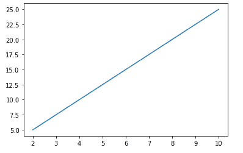

The output of Code#1 (Simple Subplot code)

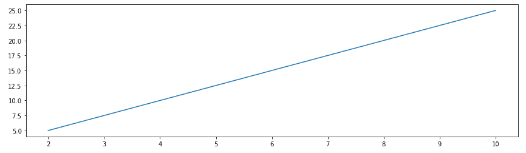

The output of Code#2 ( Code in which we use subplots_adjust() with parameter right )

现在从上面两个代码及其输出中，我们清楚地看到，通过使用 `subplots_adjust()` ，我们将 subplot 的右边位置调整了 2。

**结论！**matplotlib . py plot . subplots _ adjust()函数通过改变子情节的位置来重塑子情节的设计。

阅读: [Matplotlib 最佳拟合线](https://pythonguides.com/matplotlib-best-fit-line/)

## Matplotlib 支线剧情 _ 调整紧密 _ 布局

`subplots _ adjust tight _ layout()`是 matplotib 库中的一个函数，用于自动调整 subplots 之间的适当间距，使其适合图形区域。

**语法如下:**

```py
matplotlib.pyplot.tight_layout(pad=10.8, h_pad=None, w_pad=None, rect=None)
```

在上面的语法中，使用了下面概述的参数:

*   **填充:**指定支线剧情边缘之间空白(**称为填充**)的大小。默认情况下，它是 1.08
*   h_pad: 指定子情节边缘之间的填充高度。
*   **w_pad:** 指定子情节边缘之间的填充宽度。
*   **rect:** 指定适合支线剧情的图形区域的大小。

**何时使用 tight_layout():**

*   当标题的轴标签超出图形区域时。
*   当我们在一个图形区域中有多个支线剧情时，我们会看到不同支线剧情的标签或标题互相重叠。
*   当我们在一个图形区域中有多个支线剧情时，我们看到支线剧情有个不同的大小。
*   当我们在一个图形区域中有多个子情节，并且我们想要调整图形周围和子情节之间的额外填充时。

**让我们做一个例子来理解概念**:

**代码#1**

```py
 # Importing libraries 

import numpy as np
import matplotlib.pyplot as plt

x1= [2,4,6]
y1= [3,6,9]

x2= [5,10,15]
y2= [6,12,18]

x3= [2,4,6]
y3= [3,6,9]

x4= [5,10,15]
y4= [6,12,18]

fig, ax = plt.subplots(2, 2)

ax[0, 0].plot(x1, y1)
ax[0, 1].plot(x2, y2)
ax[1, 0].plot(x3, y3)
ax[1, 1].plot(x4,y4)

ax[0, 0].set_title("Graph 1 ")
ax[0, 1].set_title("Graph 2")
ax[1, 0].set_title("Graph 3")
ax[1, 1].set_title("Graph 4")

plt.show()
```

上面的**代码#1** 只是一个简单的 matplotlib 子图代码，其中我们在一个图形区域中有多个子图。

**代码#2**

```py
# Importing Libraries
import numpy as np
import matplotlib.pyplot as plt

x1= [2,4,6]
y1= [3,6,9]

x2= [5,10,15]
y2= [6,12,18]

x3= [2,4,6]
y3= [3,6,9]

x4= [5,10,15]
y4= [6,12,18]

fig, ax = plt.subplots(2, 2)

ax[0, 0].plot(x1, y1)
ax[0, 1].plot(x2, y2)
ax[1, 0].plot(x3, y3)
ax[1, 1].plot(x4,y4)

ax[0, 0].set_title("Graph 1 ")
ax[0, 1].set_title("Graph 2")
ax[1, 0].set_title("Graph 3")
ax[1, 1].set_title("Graph 4")

fig.tight_layout()
plt.show()
```

在上面的**代码#2** 中，我们必须实现**紧密布局**功能。

现在，让我们看看这两个代码输出的区别，这样我们就清楚地了解了 tight_layout 函数的基本功能。

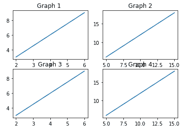

The output of Code#1 (Simple Subplot code)

在上面的输出中，我们看到不同轴的标签相互重叠。

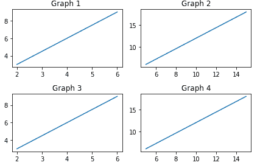

The output of Code#2 ( Code in which we use tight_layout function )

在上面的输出中，我们已经看到，通过使用 tight_layout 函数，我们调整了图形区域中子图形之间的间距，以避免重叠。

**结论！`**matplotlib . py plot . tight _ layout()`函数调整支线剧情，使其完全适合人物区域。

阅读: [Matplotlib 支线剧情教程](https://pythonguides.com/matplotlib-subplot-tutorial/)

## Matplotlib支线剧情间距

**我们为什么需要间距！**

当我们处理支线剧情时，我们必须在图形区域绘制多个支线剧情。有时我们会看到一个图形区域中的多个子图的轴开始重叠，或者轴值太混乱和拥挤。

所以为了解决这些问题，我们需要设置支线剧情之间的间距。

**求解间距的方法:**

*   使用 tight_layout()函数
*   使用 subplots_adjust()函数
*   使用 subplot_tool()函数

### 使用 tight_layout()函数

`tight_layout()` 函数自动调整支线剧情间距。

**上面的语法:**

```py
matplotlib.pyplot.tight_layout()
```

**我们借助一个例子来理解:**

```py
# Importing Libraries
import numpy as np
import matplotlib.pyplot as plt

x1= [2,4,6]
y1= [3,6,9]

x2= [5,10,15]
y2= [6,12,18]

x3= [2,4,6]
y3= [3,6,9]

x4= [5,10,15]
y4= [6,12,18]

fig, ax = plt.subplots(2, 2)

ax[0, 0].plot(x1, y1)
ax[0, 1].plot(x2, y2)
ax[1, 0].plot(x3, y3)
ax[1, 1].plot(x4,y4)

fig.tight_layout()
plt.show()
```

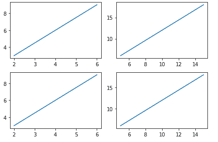

Using tight_layout()

从上面的例子中，我们得出结论，通过使用 tight_layout()函数，支线剧情之间的间距是合适的。

读取 [Matplotlib plot_date](https://pythonguides.com/matplotlib-plot-date/)

### 使用支线剧情 _ 调整()函数

**支线剧情 _adjust()** 函数改变支线剧情之间的间距。通过使用参数**左**、**右**、**上**、**下**、 `wspace` 、 `hspace` ，我们可以调整子情节的位置。

**上面的语法:**

```py
matplotlib.pyplot.subplots_adjust(left=None, bottom= None, right=None, top=None, wspace=None, hspace=None)
```

**让我们借助一个例子来理解**:

```py
# Importing Libraries

import numpy as np
import matplotlib.pyplot as plt

x1= [2,4,6]
y1= [3,6,9]

x2= [5,10,15]
y2= [6,12,18]

x3= [2,4,6]
y3= [3,6,9]

x4= [5,10,15]
y4= [6,12,18]

fig, ax = plt.subplots(2, 2)

ax[0, 0].plot(x1, y1)
ax[0, 1].plot(x2, y2)
ax[1, 0].plot(x3, y3)
ax[1, 1].plot(x4,y4)

plt.subplots_adjust(left=0.5, bottom=0.5, right=1, top=1, wspace=0.9,hspace=0.9)
plt.show()
```

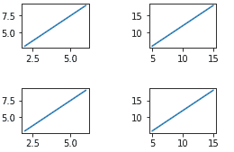

subplots_adjust()

从上面的例子中，我们得出结论，通过使用 subplots_adjust()函数，子情节之间的间距是适当的。

### 使用 subplot_tool()函数

`subplot_tool()` 方法提供了一个滑块来调整 subplot 的间距。这是一种交互式方法，用户可以根据自己的需要拖动滚动条进行调整。

**上面的语法:**

```py
matplotlib.pyplot.subplot_tool()
```

**我们借助一个例子来理解:**

```py
# Importing Libraries

import numpy as np
import matplotlib.pyplot as plt

x1= [2,4,6]
y1= [3,6,9]

x2= [5,10,15]
y2= [6,12,18]

x3= [2,4,6]
y3= [3,6,9]

x4= [5,10,15]
y4= [6,12,18]

fig, ax = plt.subplots(2, 2)

ax[0, 0].plot(x1, y1)
ax[0, 1].plot(x2, y2)
ax[1, 0].plot(x3, y3)
ax[1, 1].plot(x4,y4)

plt.subplot_tool()
plt.show()
```

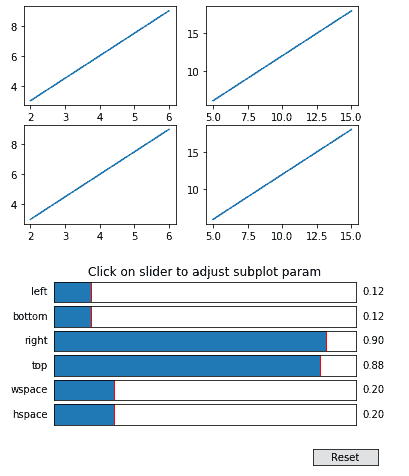

subplot_tool()

从上面的例子中，我们得出结论，通过使用 subplot_tool()函数，我们可以使用滑块来调整间距。

阅读: [Matplotlib 绘图条形图](https://pythonguides.com/matplotlib-plot-bar-chart/)

## Matplotlib subplot _ adjust height或 hspace

当我们处理支线剧情时，我们必须在图形区域绘制多个支线剧情。有时重叠的问题开始出现，为了避免这种情况，我们需要调整高度。

**调节高度的方式:**

*   使用 tight_layout()函数
*   使用 subplots_adjust()函数
*   使用 subplot_tool()函数

### 使用 tight_layout()函数

`tight_layout()` 函数自动调整支线剧情之间空白**(称为填充)**的高度。

**语法如下:**

```py
matplotlib.pyplot.tight_layout()
```

**我们借助一个例子来理解一下:**

```py
# Importing Libraries

import numpy as np
import matplotlib.pyplot as plt

x1= [1,2,3]
y1= [5,6,9]

x2= [5,10,20]
y2= [6,12,15]

x3= [2,5,6]
y3= [3,6,9]

x4= [7,8,15]
y4= [6,12,18]

fig, ax = plt.subplots(2, 2)

ax[0, 0].plot(x1, y1)
ax[0, 1].plot(x2, y2)
ax[1, 0].plot(x3, y3)
ax[1, 1].plot(x4,y4)

fig.tight_layout()
plt.show()
```

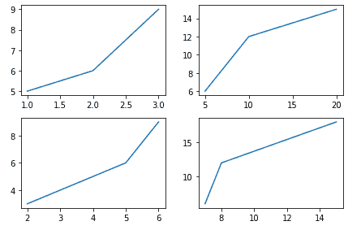

tight_layout()

从上面的例子中，我们可以得出结论，通过使用 tight_layout()函数，支线剧情之间的高度空间是精确的。

### 使用支线剧情 _ 调整()函数

**支线剧情 _adjust()** 函数改变支线剧情之间的间距。通过使用参数 hspace，我们可以调整支线剧情之间的填充高度。

**其语法如下:**

```py
matplotlib.pyplot.subplots_adjust(hspace=None) 
```

**让我们借助一个例子来理解这一点:**

```py
# Importing Libraries

import numpy as np
import matplotlib.pyplot as plt

x1= [1,2,3]
y1= [5,6,9]

x2= [5,10,20]
y2= [6,12,15]

x3= [2,5,6]
y3= [3,6,9]

x4= [7,8,15]
y4= [6,12,18]

fig, ax = plt.subplots(2, 2)

ax[0, 0].plot(x1, y1)
ax[0, 1].plot(x2, y2)
ax[1, 0].plot(x3, y3)
ax[1, 1].plot(x4,y4)

fig.subplots_adjust(hspace=0.9)
plt.show()
```

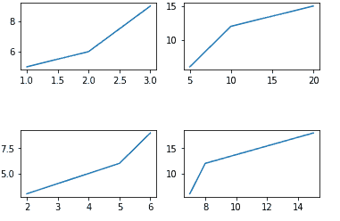

subplots_adjust()

从上面的例子中，我们得出结论，通过使用 subplots_adjust()函数，我们可以调整填充的高度。

阅读[在 Python 中添加文本到绘图 matplotlib](https://pythonguides.com/add-text-to-plot-matplotlib/)

### 使用 subplot_tool()函数

`subplot_tool()` 方法提供了一个滑块来调整 subplot 的高度。这是一个交互式工具，用户可以根据自己的需要来调整高度。

**上面的语法:**

```py
matplotlib.pyplot.subplot_tool()
```

**我们借助一个例子来理解一下:**

```py
**# Importing Libraries**

import numpy as np
import matplotlib.pyplot as plt

x1= [1,2,3]
y1= [5,6,9]

x2= [5,10,20]
y2= [6,12,15]

x3= [2,5,6]
y3= [3,6,9]

x4= [7,8,15]
y4= [6,12,18]

fig, ax = plt.subplots(2, 2)

ax[0, 0].plot(x1, y1)
ax[0, 1].plot(x2, y2)
ax[1, 0].plot(x3, y3)
ax[1, 1].plot(x4,y4)

plt.subplot_tool()
plt.show()
```

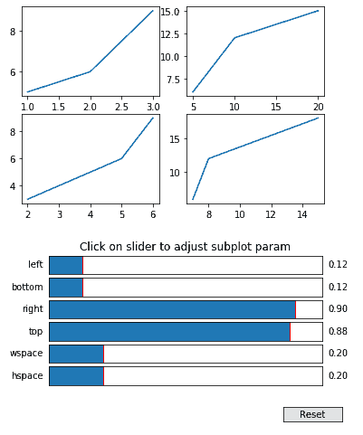

subplot_tools()

在上面的例子中，我们可以拖动滑块来调整图形区域中支线剧情的高度。

阅读:[什么是 matplotlib 内联](https://pythonguides.com/what-is-matplotlib-inline/)

## 【Matplotlib 支线剧情 _ 调整人物尺寸

正如我们已经研究过的，通过使用函数 `subplots()` 我们可以在同一个图形区域内创建多个图形。但是**异常发生**支线剧情方法只创建相同大小的支线剧情或者自动调整大小。

**现在问题来了！**如果我们想在区域内创建不同大小的支线剧情，该怎么做。

万岁！对于这个问题，我们有一个**解决方案**。所以我们来学学吧。

用于使用 `add_gridspec()` 方法根据您的选择改变同一图形区域内支线剧情的大小。如果我们想改变多个支线剧情的大小，这是一个强大的解决方案，但是创建多个相同大小的支线剧情需要时间。

*   在这个方法中，我们已经定义了想要创建情节的位置，并且还单独指定了每个子情节。
*   我们必须指定网格的行数和列数作为 `add_gridspec()` 方法的输入参数。
*   网格大小初始化后，我们可以通过改变 `add_subplot()` 函数中的输入坐标，根据你的相关性调整大小。
*   我们在 `sub_plot()` 方法中作为参数输入的坐标轴坐标指定了绘图的初始和最终位置(即行和列)。

要指定绘图的初始和最终位置，您应该了解一些索引和切片知识。

**提示！不要使用 add_gridspec()来创建相同大小的支线剧情。**

**那么，我们借助一个例子来理解:**

```py
# Importing Libraries.

import matplotlib.pyplot as plt

# .figure() method is used to plot a fig and parameter constrained_layout=True is used to plot figure nicely distributed.

fig = plt.figure(constrained_layout=True)

# Creating the subplots with .add_gridspec().

ax = fig.add_gridspec(3, 3)

# .add_subplot() shows initial and final position of the plot.

ax1 = fig.add_subplot(ax[0, 0:1])   # Plot is located in the first row and has a width of 1/3 of the entire gride.

ax1.set_title('[0, 0:1]')

ax1 = fig.add_subplot(ax[0:, -1])   # Plot is located in one column wide but has a height of entire grid.

ax1.set_title('[0:, -1]')

ax1 = fig.add_subplot(ax[2:, 0:2])  # Plot is located in last three rows and first two columns.

ax1.set_title('[2:, 0:2]')

# Display the Plot
plt.show()
```

下面是上面代码的输出。

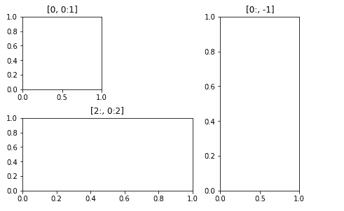

add_gridspec() method output

在上面的例子中，我们已经得出结论，通过使用 add_gridspec()方法，我们可以根据您的偏好改变图形区域中多个子情节的大小。

**结论！**改变图形尺寸的步骤:

*   用 `add_gridspec()` 方法创建支线剧情，并指定它们的分布。
*   使用 `add_subplot()` 方法指定子情节的起始和结束位置。
*   使用切片和索引来指定子情节在区域中的位置。

阅读: [Python 使用 Matplotlib 绘制多条线](https://pythonguides.com/python-plot-multiple-lines/)

## Matplotlib subplot _ adjustwidth 或 wspace

当我们处理支线剧情时，我们必须在图形区域绘制多个支线剧情。有时重叠的问题开始出现，为了避免这种情况，我们需要调整宽度。

**调整 wspace 的方法:**

*   使用 tight_layout()函数
*   使用 subplots_adjust()函数
*   使用 subplot_tool()函数

### 使用 tight_layout()函数

`tight_layout()` 函数根据需要自动调整子情节之间的填充宽度。这意味着带有图形区域的子情节之间的空白宽度是可调的。

**语法如下:**

```py
matplotlib.pyplot.tight_layout()
```

**我们借助一个例子来理解一下:**

```py
# Importing Libraries

import numpy as np
import matplotlib.pyplot as plt

x1= [0.2, 0.4, 0.6, 0.8, 1]
y1= [0.3, 0.6, 0.8, 0.9, 1.5]

x2= [2, 6, 7, 9, 10]
y2= [3, 4, 6, 9, 12]

x3= [5, 8, 12]
y3= [3, 6, 9]

x4= [7, 8, 15]
y4= [6, 12, 18]

fig, ax = plt.subplots(2, 2)

ax[0, 0].plot(x1, y1)
ax[0, 1].plot(x2, y2)
ax[1, 0].plot(x3, y3)
ax[1, 1].plot(x4,y4)

fig.tight_layout()
plt.show()
```

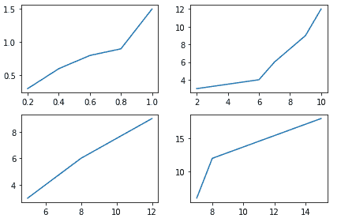

tight_layout()

从上面的例子中，我们得出结论，通过使用 tight_layout()方法，子情节之间的填充空间或宽度是精确的，没有任何重叠。

### 使用 subplots_adjust()函数

**支线剧情 _adjust()** 方法改变支线剧情之间的间距。通过使用参数 wspace，我们可以调整子情节之间的空白宽度(**称为填充**)。有时我们也称 wspace 为支线剧情的宽度。

**其语法如下:**

```py
matplotlib.pyplot.subplots_adjust(wspace=None)
```

**让我们借助一个例子来理解这一点:**

```py
# Importing Libraries

import numpy as np
import matplotlib.pyplot as plt

x1= [0.2, 0.4, 0.6, 0.8, 1]
y1= [0.3, 0.6, 0.8, 0.9, 1.5]

x2= [2, 6, 7, 9, 10]
y2= [3, 4, 6, 9, 12]

x3= [5, 8, 12]
y3= [3, 6, 9]

x4= [7, 8, 15]
y4= [6, 12, 18]

fig, ax = plt.subplots(2, 2)

ax[0, 0].plot(x1, y1)
ax[0, 1].plot(x2, y2)
ax[1, 0].plot(x3, y3)
ax[1, 1].plot(x4,y4)

fig.subplots_adjust(wspace=10)
plt.show()
```

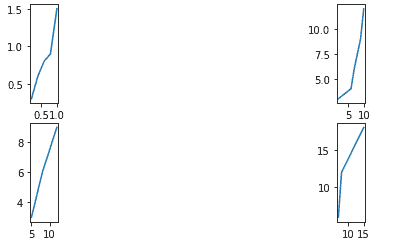

subplots_adjust(wspace=None)

从上面的例子中，我们得出结论，通过使用 `subplots_adjust()` 方法，我们可以调整一个区域内子情节之间的填充宽度。

### 使用 subplot_tool()函数

`subplot_tool()` 函数提供了一个滑块来调整 subplot 宽度或 wspace。这是一种交互式的方式来调整支线剧情的宽度。用户可以拖动 wspace 栏来调整支线剧情的宽度。

**上面的语法:**

```py
matplotlib.pyplot.subplot_tool()
```

**我们借助一个例子来理解一下:**

```py
# Importing Libraries

import numpy as np
import matplotlib.pyplot as plt

x1= [0.2, 0.4, 0.6, 0.8, 1]
y1= [0.3, 0.6, 0.8, 0.9, 1.5]

x2= [2, 6, 7, 9, 10]
y2= [3, 4, 6, 9, 12]

x3= [5, 8, 12]
y3= [3, 6, 9]

x4= [7, 8, 15]
y4= [6, 12, 18]

fig, ax = plt.subplots(2, 2)

ax[0, 0].plot(x1, y1)
ax[0, 1].plot(x2, y2)
ax[1, 0].plot(x3, y3)
ax[1, 1].plot(x4,y4)

plt.subplot_tool()
plt.show()
```

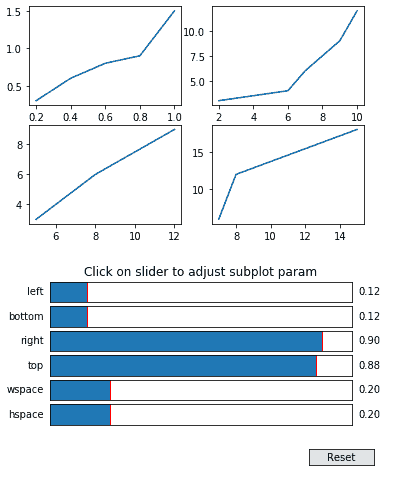

Subplot_tool()

在上面的例子中，我们必须点击滑块来调整支线剧情的宽度。

阅读: [Matplotlib 绘制一条线](https://pythonguides.com/matplotlib-plot-a-line/)

## Matplotlib subplot _ adjust bottom

当我们处理支线剧情时，我们必须在图形区域绘制多个图形。有时重叠的问题开始出现。我们遇到一个问题，刻度线标签或 x 轴标签在一个区域中的另一个子图的刻度线和轴标签上飘动或溢出。为了解决这个问题，我们必须调整底部边距。

**底部调整方式:**

*   使用 tight_layout()方法
*   使用 subplots_adjust()方法
*   使用 subplot_tool()方法

### 使用 tight_layout()方法

`tight_layout()` 函数自动调整支线剧情之间的下边距。我们也可以说它自动为刻度标签或 x 轴标签创建了一个空间。

**语法如下:**

```py
matplotlib.pyplot.tight_layout()
```

**我们用一个例子来理解这个概念:**

```py
# Import Libraries

import numpy as np
import matplotlib.pyplot as plt

x1= [2,4,6]
y1= [3,6,9]

x2= [5,10.9,15]
y2= [6,12,18]

x3= [2,4.5,6]
y3= [3,6,9]

x4= [5,10]
y4= [6,12]

fig, ax = plt.subplots(2, 2)

ax[0, 0].plot(x1, y1)
ax[0, 1].plot(x2, y2)
ax[1, 0].plot(x3, y3)
ax[1, 1].plot(x4, y4)

ax[0, 0].set_title("Graph 1 ")
ax[0, 1].set_title("Graph 2")
ax[1, 0].set_title("Graph 3")
ax[1, 1].set_title("Graph 4")

fig.tight_layout()

plt.show()
```

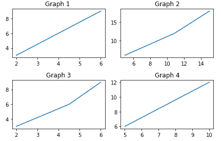

tight_layout()

从上面的例子中，我们得出结论，通过使用 tight_layout()函数，底部边距自动增加以避免重叠。

### 使用 subplots_adjust()方法

**支线剧情 _adjust()** 方法改变支线剧情之间的间距。通过使用参数 bottom，我们可以调整支线剧情的下边距。默认情况下，底部的值为 0.1。我们必须增加这个值来增加下边距的大小。

**语法如下:**

```py
matplotlib.pyplot.subplots_adjust(bottom=None)
```

**让我们借助一个例子来理解这一点:**

```py
# Import Libraries

import numpy as np
import matplotlib.pyplot as plt

x = [2,4,6,8,10]
y = [5,10,15,20,25]

fig = plt.figure()
ax = fig.subplots()

ax.plot(x, y)

fig.subplots_adjust(bottom = 0.2)

fig.show() 
```

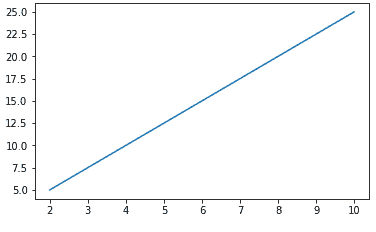

subplots_adjust()

从上面的例子中，我们可以得出结论，通过使用 subplots_adjust()方法，我们可以增加或减少图形区域底部边距的大小。

### 使用 subplot_tool()方法

`subplot_tool()` 函数提供了一种交互式的方式来调整支线剧情的下边距。这个方法提供了一个滑块来调整子情节的下边距。用户可以拖动底部的条来调整支线剧情的空白空间。

**上面的语法:**

```py
matplotlib.pyplot.suplot_tool()
```

**我们借助一个例子来理解一下:**

```py
# Importing Libraries

import numpy as np
import matplotlib.pyplot as plt

x1= [0.2, 0.4, 0.6, 0.8, 1]
y1= [0.3, 0.6, 0.8, 0.9, 1.5]

x2= [2, 6, 7, 9, 10]
y2= [3, 4, 6, 9, 12]

x3= [5, 8, 12]
y3= [3, 6, 9]

x4= [7, 8, 15]
y4= [6, 12, 18]

fig, ax = plt.subplots(2, 2)

ax[0, 0].plot(x1, y1)
ax[0, 1].plot(x2, y2)
ax[1, 0].plot(x3, y3)
ax[1, 1].plot(x4,y4)

plt.subplot_tool()
plt.show()
```

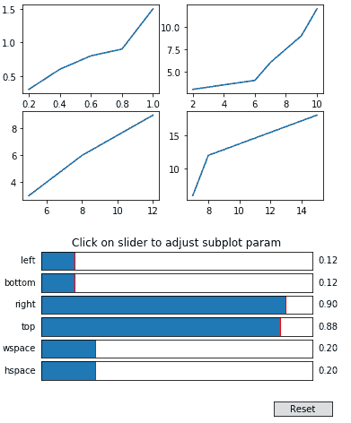

subplot_tool()

在上面的例子中，我们必须点击滑块来调整副情节底部的参数。

阅读:[如何安装 matplotlib python](https://pythonguides.com/how-to-install-matplotlib-python/)

## Matplotlib subplot _ adjust Right

当我们处理支线剧情时，我们必须在图形区域绘制多个支线剧情。有时重叠的问题开始出现，为了避免这种情况，我们需要调整。

为了在一个区域中完美地放置支线剧情，我们必须增加右边距，这样人物可以调整而不会抖动，为了给图例腾出空间，我们必须减小右边距的大小。

**向右调整的方式:**

*   使用 tight_layout()函数
*   使用 subplots_adjust()函数
*   使用 subplot_tool()函数

### 使用 tight_layout()函数

`tight_layout()` 函数自动调整支线剧情之间右边距的大小。在没有任何用户界面的情况下，这种方法完美的设计了包含多个支线剧情的人物区域。

**其语法如下:**

```py
matplotlib.pyplot.tight_layout()
```

**我们借助一个例子来理解一下:**

```py
# Importing Libraries

import numpy as np
import matplotlib.pyplot as plt

x1= [0.2, 0.4, 0.6, 0.8, 1]
y1= [0.3, 0.6, 0.8, 0.9, 1.5]

x2= [2, 6, 7, 9, 10]
y2= [3, 4, 6, 9, 12]

x3= [5, 8, 12]
y3= [3, 6, 9]

x4= [7, 8, 15]
y4= [6, 12, 18]

fig, ax = plt.subplots(2, 2)

ax[0, 0].plot(x1, y1)
ax[0, 1].plot(x2, y2)
ax[1, 0].plot(x3, y3)
ax[1, 1].plot(x4,y4)

fig.tight_layout()
plt.show()
```

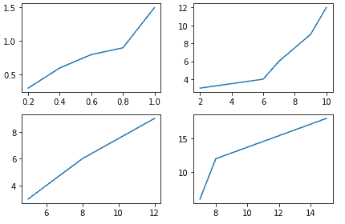

tight_layout()

从上面的例子中，我们得出结论，通过使用 tight_layout()方法，支线剧情之间的右边距变得完美。

### 使用 subplots_adjust()函数

**支线剧情 _adjust()** 方法改变支线剧情之间的间距。通过使用参数 right，我们可以从右侧调整边距大小。默认情况下，右侧参数的值为 0.9。我们必须根据需要增加或减少它。

**其语法如下:**

```py
matplotlib.pyplot.subplots_adjust(right=None)
```

**让我们借助一个例子来理解这个概念:**

```py
# Import Libraries

import numpy as np
import matplotlib.pyplot as plt

x = [2,4,6,8,10]
y = [5,10,15,6.3,25]

fig = plt.figure()
ax = fig.subplots()

ax.plot(x, y)

fig.subplots_adjust(right = 0.9)

fig.show() 
```

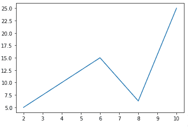

subplots_adjust()

从上面的代码示例中，我们得出结论，通过使用 subplots_adjust()方法，我们可以调整 subplots 的右边距。

### 使用 subplot_tool()函数

`subplot_tool()` 函数提供了一个滑块来调整 subplot 的右边距。这是一种改善支线剧情右边空白的互动方式。用户必须拖动右边栏来调整右边距。

**上面的语法:**

```py
matplotlib.pyplot.subplot_tool()
```

**我们借助一个例子来理解一下:**

```py
# Importing Libraries

import numpy as np
import matplotlib.pyplot as plt

x1= [0.2, 0.4, 0.6, 0.8, 1]
y1= [0.3, 0.6, 0.8, 0.9, 1.5]

x2= [2, 6, 7, 9, 10]
y2= [3, 4, 6, 9, 12]

x3= [5, 8, 12]
y3= [3, 6, 9]

x4= [7, 8, 15]
y4= [6, 12, 18]

fig, ax = plt.subplots(2, 2)

ax[0, 0].plot(x1, y1)
ax[0, 1].plot(x2, y2)
ax[1, 0].plot(x3, y3)
ax[1, 1].plot(x4,y4)

plt.subplot_tool()
plt.show()
```

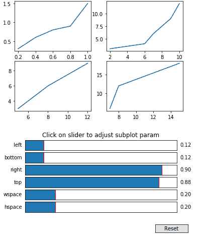

subplot_tool()

在上面的例子中，我们必须点击滑块来调整子情节右边的参数来调整边距。

Read: [modulenotfounderror:没有名为“matplotlib”的模块](https://pythonguides.com/no-module-named-matplotlib/)

## Matplotlib subplot_adjust 不起作用

不要在我们无法完成你的任务的条件下工作。我们也可以说，在编码中出现错误或一些障碍，而你没有得到想要的输出。

由于运行时错误或语法错误，出现了无法工作的情况。

**我们来讨论一些常见的，不工作的情况:**

**错误#1**

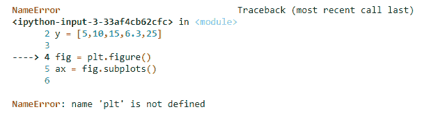

如果您遇到这种错误:

*   检查 libaraires 是否是进口的。
*   检查您是否将“plt”作为任何导入库的昵称

**错误#2**

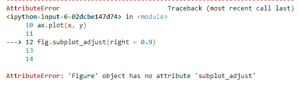

如果您遇到这种错误:

大多数程序员都会犯这个错误。这是一个很常见的语法错误。

*   注意属性名是`subplot_adjust`不是 subplot _ adjust。注意这样的错误。

**错误#3**

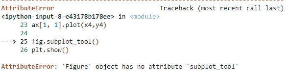

如果你遇到这样的错误，你将无法得到滑块来调整支线剧情参数。

*   记住**子情节 _ 工具**是 plt 的属性。所以纠正这个对象名。

**错误#4**

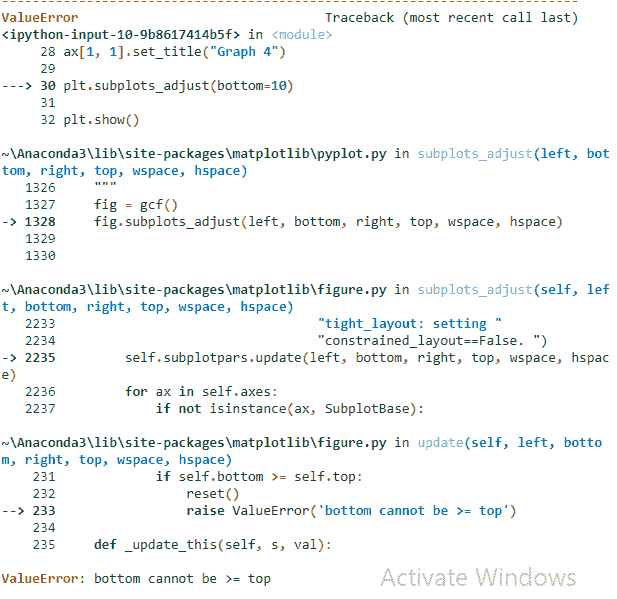

如果您遇到这样的错误:

*   顶部的默认值为 `0.9` ，底部的默认值为 `0.1` 。要消除此错误，请注意底部值应小于或等于顶部值。

你可能也喜欢读下面的文章。

*   [Matplotlib 测井记录图](https://pythonguides.com/matplotlib-log-log-plot/)
*   [水平线 matplotlib](https://pythonguides.com/horizontal-line-matplotlib/)
*   [Matplotlib 散点图图例](https://pythonguides.com/matplotlib-scatter-plot-legend/)
*   [Matplotlib 多条形图](https://pythonguides.com/matplotlib-multiple-bar-chart/)
*   [将图例放在绘图 matplotlib 之外](https://pythonguides.com/put-legend-outside-plot-matplotlib/)

在本 Python 教程中，我们已经讨论了" `Matplotlib subplot_adjust` "并且还介绍了一些与之相关的例子。我们在本教程中讨论了以下主题。

*   Matplotlib 子情节 _adjust
*   Matplotlib 子情节 _ 调整紧密度 _ 布局
*   Matplotlib 子图 _ 调整间距
*   Matplotlib 子图 _ 调整高度和空间
*   Matplotlib 子图 _ 调整图形大小
*   Matplotlib 子图 _adjust width 和 wspace
*   Matplotlib 子情节 _ 调整底部
*   Matplotlib 子情节 _ 右调整
*   Matplotlib subplots_adjust 不起作用

[Bijay Kumar](https://pythonguides.com/author/fewlines4biju/)

Python 是美国最流行的语言之一。我从事 Python 工作已经有很长时间了，我在与 Tkinter、Pandas、NumPy、Turtle、Django、Matplotlib、Tensorflow、Scipy、Scikit-Learn 等各种库合作方面拥有专业知识。我有与美国、加拿大、英国、澳大利亚、新西兰等国家的各种客户合作的经验。查看我的个人资料。

[enjoysharepoint.com/](https://enjoysharepoint.com/)[](https://www.facebook.com/fewlines4biju "Facebook")[](https://www.linkedin.com/in/fewlines4biju/ "Linkedin")[](https://twitter.com/fewlines4biju "Twitter")