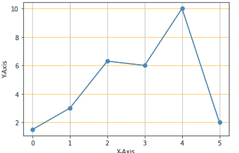
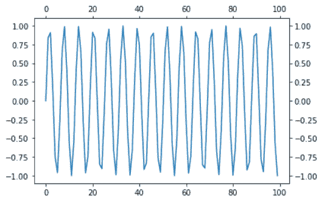

# Python Matplotlib tick_params + 29 示例

> 原文：<https://pythonguides.com/matplotlib-tick-params/>

[](https://sharepointsky.teachable.com/p/python-and-machine-learning-training-course)

在本 [Python Matplotlib 教程](https://pythonguides.com/what-is-matplotlib/)中，我们将讨论 python 中的 **Matplotlib tick_params。这里我们将介绍使用 matplotlib 与 tick_params 相关的不同示例。我们还将讨论以下主题:**

*   Matplotlib tick_params
*   Matplotlib tick_params 字体大小
*   Matplotlib tick_params 颜色
*   Matplotlib tick_params 旋转
*   Matplotlib tick_params 标签颜色
*   Matplotlib tick_params 颜色
*   Matplotlib tick_params direction
*   Matplotlib tick_params 长度
*   Matplotlib tick_params 宽度
*   Matplotlib tick_params pad
*   Matplotlib tick_params zorder
*   Matplotlib tick_params right
*   Matplotlib tick_params left
*   Matplotlib tick_params top
*   Matplotlib tick_params bottom
*   Matplotlib tick_params 标签底部
*   Matplotlib tick_params 标签顶部
*   Matplotlib tick_params 标签左侧
*   Matplotlib tick_params 标签右侧
*   Matplotlib tick_params grid color
*   Matplotlib tick_params grid alpha
*   Matplotlib tick_params 网格线宽
*   Matplotlib tick_params grid linestyle
*   Matplotlib tick_params which
*   Matplotlib set_tick_params
*   Matplotlib 子图 tick_params
*   Matplotlib 颜色条 tick_params
*   Matplotlib tick_params 显示全部
*   matplotlib tick _ params tick _ params 自定义刻度样式

目录

[](#)

*   [Matplotlib tick_params](#Matplotlib_tick_params "Matplotlib tick_params")
*   [Matplotlib tick_params 字体大小](#Matplotlib_tick_params_font_size "Matplotlib tick_params font size")
*   [Matplotlib tick _ params color](#Matplotlib_tick_params_color "Matplotlib tick_params color")
*   [Matplotlib tick_params 旋转](#Matplotlib_tick_params_rotation "Matplotlib tick_params rotation")
*   [Matplotlib tick_params 标签颜色](#Matplotlib_tick_params_label_color "Matplotlib tick_params label color")
*   [Matplotlib tick _ params colors](#Matplotlib_tick_params_colors "Matplotlib tick_params colors")
*   [Matplotlib tick_params 方向](#Matplotlib_tick_params_direction "Matplotlib tick_params direction")
*   [Matplotlib tick_params 长度](#Matplotlib_tick_params_length "Matplotlib tick_params length")
*   [Matplotlib tick_params 宽度](#Matplotlib_tick_params_width "Matplotlib tick_params width")
*   [Matplotlib tick_params pad](#Matplotlib_tick_params_pad "Matplotlib tick_params pad")
*   [Matplotlib tick_params zorder](#Matplotlib_tick_params_zorder "Matplotlib tick_params zorder")
*   [Matplotlib tick _ params right](#Matplotlib_tick_params_right "Matplotlib tick_params right")
*   [Matplotlib tick _ params left](#Matplotlib_tick_params_left "Matplotlib tick_params left")
*   [Matplotlib tick_params top](#Matplotlib_tick_params_top "Matplotlib tick_params top")
*   [Matplotlib tick _ params bottom](#Matplotlib_tick_params_bottom "Matplotlib tick_params bottom")
*   [Matplotlib tick_params 标签底部](#Matplotlib_tick_params_label_bottom "Matplotlib tick_params label bottom")
*   [Matplotlib tick _ params label top](#Matplotlib_tick_params_labeltop "Matplotlib tick_params labeltop")
*   [Matplotlib tick _ params label left](#Matplotlib_tick_params_label_left "Matplotlib tick_params label left")
*   [Matplotlib tick_params 标签右](#Matplotlib_tick_params_label_right "Matplotlib tick_params label right")
*   [Matplotlib tick_params 网格颜色](#Matplotlib_tick_params_grid_color "Matplotlib tick_params grid color")
*   [Matplotlib tick _ params grid alpha](#Matplotlib_tick_params_grid_alpha "Matplotlib tick_params grid alpha")
*   [Matplotlib tick_params 网格线宽](#Matplotlib_tick_params_grid_linewidth "Matplotlib tick_params grid linewidth")
*   [Matplotlib tick_params grid linestyle](#Matplotlib_tick_params_grid_linestyle "Matplotlib tick_params grid linestyle")
*   [Matplotlib tick_params 其中](#Matplotlib_tick_params_which "Matplotlib tick_params which")
*   [Matplotlib set _ tick _ params](#Matplotlib_set_tick_params "Matplotlib set_tick_params ")
*   [Matplotlib 子图 tick_params](#Matplotlib_subplot_tick_params "Matplotlib subplot tick_params")
*   [Matplotlib 彩色 tick_params](#Matplotlib_colorbar_tick_params "Matplotlib colorbar tick_params")
*   [Matplotlib tick_params 显示全部](#Matplotlib_tick_params_show_all "Matplotlib tick_params show all")
*   [Matplotlib tick_params 自定义刻度样式](#Matplotlib_tick_params_customize_ticks_style "Matplotlib tick_params customize ticks style")

## Matplotlib tick_params

在本节中，我们将学习 Python 中 [matplotlib 中的 `tick_params` 。 `tick_params()` 方法用于改变刻度、刻度标签和网格线的外观。](https://pythonguides.com/how-to-install-matplotlib-python/)

**语法如下:**

```py
matplotlib.pyplot.tick_params(axis='both',**kwargs)
```

**以下是上面使用的参数:**

| **参数** | **值** | **描述** |
| 轴 | ' x '，' y '，'两者' | 指定要将参数应用到哪个轴。 |
| 哪个 | 大调'，'小调'，'两者' | 应用参数的刻度组。 |
| 重置 | 弯曲件 | 是否重置刻度。 |
| 方向 | '输入'，'输出'，'输入' | 指定放置记号的方向。 |
| 长度 | 漂浮物 | 指定刻度长度。 |
| 宽度 | 漂浮物 | 指定记号宽度。 |
| 颜色 | 颜色 | 指定刻度颜色。 |
| 衬垫 | 漂浮物 | 指定记号和标签之间的距离。 |
| 标签尺寸 | 浮点型或字符串型 | 指定刻度标签的字体大小。 |
| 标签色 | 颜色 | 指定刻度标签的颜色。 |
| 颜色；色彩；色调 | 颜色 | 指定记号和记号标签的颜色。 |
| 更糟 | 漂浮物 | 指定刻度和标签。 |
| 底部、顶部、左侧、右侧 | 弯曲件 | 指定是否绘制相应的记号。 |
| 标签底部、标签顶部、标签左侧、标签右侧 | 弯曲件 | 指定是否绘制相应的刻度标签。 |
| 标签旋转 | 漂浮物 | 指定刻度标签的旋转。 |
| 网格颜色 | 颜色 | 指定网格线的颜色。 |
| 网格 _alpha | 漂浮物 | 指定网格线的透明度。 |
| 网格 _ 线宽 | 漂浮物 | 以磅为单位指定网格线的宽度。 |
| 网格 _ 线条样式 | 潜艇用热中子反应堆（submarine thermal reactor 的缩写） | 任何有效的二维线条样式。 |

**示例:默认绘图**

```py
**# Import Library** 
import matplotlib.pyplot as plt
import numpy as np

**# Define Data** 
x = np.arange(0, 20, 0.2)
y = np.sin(x)

**# Plotting** 
plt.plot(x, y)

**# Add label** 
plt.xlabel('X-Axis')
plt.ylabel('Y-Axis')

**# Visualize** 
plt.show()
```

*   在上面的例子中，我们导入了 `matplotlib.pyplot` 和 `numpy` 包，并定义了绘图的数据坐标。
*   之后，使用 `plt.plot()` 方法在 x 和 y 之间画一条线。
*   `plt.xlabel()` 和 `plt.ylabel()` 方法分别用于设置 x 轴和 y 轴标签。
*   使用 `plt.show()` 函数显示图形。


**举例:用 tick_params()函数**

```py
**# Import Library** 
import matplotlib.pyplot as plt
import numpy as np

**# Define Data** 
x = np.arange(0, 20, 0.2)
y = np.sin(x)

**# Plotting** 
plt.plot(x, y)

**# Add label** 
plt.xlabel('X-Axis')
plt.ylabel('Y-Axis')

**# tick_param** 
plt.tick_params(axis='x', direction='in')

**# Display**

plt.show()
```

为了改变 x 记号的外观，在上面的例子中，**轴**和**方向**参数被传递给 `tick_params()` 方法。我们将 x 轴刻度的方向向内反转。


plt.tick_params()

阅读 [Python 使用 Matplotlib 绘制多行](https://pythonguides.com/python-plot-multiple-lines/)

## Matplotlib tick_params 字体大小

在本节中，我们将学习如何在 Matplotlib tick_params 中更改刻度标签的字体大小。 `labelsize` 参数用于改变标签的字体大小。

**下面是改变标签字体大小的语法:**

```py
matplotlib.pyplot.tick_params(axis= , labelszie= )
```

**我们来看一个例子:**

```py
**# Import Library** 
import matplotlib.pyplot as plt
import numpy as np

**# Define Data** 
x = np.arange(0, 50, 0.8)
y = np.tan(x)

**# Plotting** 
plt.plot(x, y)

**# Add label** 
plt.xlabel('X-Axis')
plt.ylabel('Y-Axis')

**# tick_params fontsize** 
plt.tick_params(axis='both', labelsize=15)

**# Visualize** 
plt.show()
```

在这个例子中， `labelsize` 参数被传递给 `tick_params()` 方法来改变标签的字体大小。


plt.tick_params(labelsize=)

让我们再看一个例子:

```py
**# Import Library**

import matplotlib.pyplot as plt
import numpy as np

**# Define Data**

x = np.arange(0, 50, 0.8)
y = np.tan(x)

**# Plotting**

plt.plot(x, y)

**# Add label**

plt.xlabel('X-Axis')
plt.ylabel('Y-Axis')

**# tick_params fontsize** 
plt.tick_params(axis='y', labelsize='xx-large')

**# Visualize**

plt.show()
```

为了改变标签的字体大小，在示例中， `labelsize` 和**轴**参数被传递给 `tick_params()` 方法。这里我们将 `xx-large` 和 **y 轴**作为一个值传递。


*xx-large y-axis label*

读取 [Matplotlib 绘制一条线](https://pythonguides.com/matplotlib-plot-a-line/)

## Matplotlib tick _ params color

在本节中，我们将学习如何修改 Matplotlib 刻度的颜色。我们使用 `color` 参数来定制它的颜色。

**下面是修改刻度颜色的语法:**

```py
matplotlib.pyplot.tick_params(axis= , color= )
```

**例#1:**

```py
**# Import Library** 
import matplotlib.pyplot as plt
import numpy as np

**# Define Data**

x = [0, 1, 2, 3, 4]
y = [3, 6, 9, 12, 15]

**# Plotting**

plt.plot(x, y)

**# Add label**

plt.xlabel('X-Axis')
plt.ylabel('Y-Axis')

**# tick_params color** 
plt.tick_params(axis='both', color='red')

**# Visualize**

plt.show()
```

为了改变这两个记号的颜色，我们将**轴**和**颜色**参数传递给上面示例中的 `tick_params()` 方法。我们已经把颜色改成了红色。


“Modified color of ticks”

**例#2** :

```py
**# Import Library** 
import matplotlib.pyplot as plt
import numpy as np

**# Define Data** 
x = np.arange(0, 50, 0.8)
y = np.sin(x)

**# Plotting** 
plt.plot(x, y)

**# Add label** 
plt.xlabel('X-Axis')
plt.ylabel('Y-Axis')

**# tick_params color** 
plt.tick_params(axis='x', color='b')

**# Visualize** 
plt.show()
```

*   在上面的例子中，我们导入了 `matplotlib.pyplot` 和 `numpy` 包。
*   下一步是定义数据和创建图表。
*   `plt.xlabel()` 和 `plt.ylabel()` 方法用于创建 x 轴和 y 轴标签。
*   要更改 x 轴刻度的颜色，请使用 `plt.tick_params()` 方法。我们将**轴**和**颜色**作为参数，分别设置它们的值为 `x` 和**蓝色**。


“Modify x-axis tick color to blue”

读取 [Matplotlib 改变背景颜色](https://pythonguides.com/matplotlib-change-background-color/)

## Matplotlib tick_params 旋转

我们学习如何在 matplotlib 中**旋转标签。我们可以选择任何角度放置标签。**

**以下是旋转标签的语法:**

```py
matplotlib.pyplot.tick_params(axis= , labelrotation= )
```

**我们来看一个例子:**

为了旋转标签，我们使用了 `tick_params()` 函数。将**轴**和**标签旋转**作为参数，分别设置其值为 `y` 和 **90 度**。

```py
**# Import Library**

import matplotlib.pyplot as plt
import numpy as np

**# Define Data**

x = np.random.randint(450,size=(80))
y = np.random.randint(260, size=(80))

**# Plotting**

plt.scatter(x, y)

**# Add label**

plt.xlabel('X-Axis')
plt.ylabel('Y-Axis')

**# tick_params rotation**

plt.tick_params(axis='y', labelrotation=90)

**# Visualize**

plt.show()
```


“Label Rotation 90 Degrees”

读取 [Matplotlib 散点标记](https://pythonguides.com/matplotlib-scatter-marker/)

## Matplotlib tick_params 标签颜色

我们将学习如何在 Python 的 Matplotlib 中**改变刻度标签的颜色。为了改变颜色，我们将 `labelcolor` 作为参数传递。**

**举例:**

```py
**# Import Library**

import matplotlib.pyplot as plt
import numpy as np

**# Define Data**

x = np.random.randint(low=0, high=30, size=15)
y = np.random.randint(low=0, high=30, size=15)

**# Plotting**

plt.scatter(x, y)

**# Add label**

plt.xlabel('X-Axis')
plt.ylabel('Y-Axis')

**# tick_params labelcolor**

plt.tick_params(axis='both', labelcolor='red')

**# Visualize**

plt.show()
```

*   在上面的例子中，我们使用 `random.randint()` 函数来定义数据，使用 `scatter()` 函数来绘制它们之间的图形。
*   然后使用带有 `labelcolor` 参数的 `tick_params()` 方法将标签的颜色改为**红色**。


plt.tick_params()

**我们再来看一个例子:**

```py
**# Import Library**

import matplotlib.pyplot as plt
import numpy as np

**# Define Data**

x = [0, 1, 2, 3, 4, 5]
y = [0, 3, 1.5, 4, 2.8, 5]

**# Plotting** 
plt.plot(x, y)

**# Add label**

plt.xlabel('X-Axis')
plt.ylabel('Y-Axis')

**# tick_params labelcolor**

plt.tick_params(axis='x', labelcolor='g')
plt.tick_params(axis='y', labelcolor='m')

**# Visualize**

plt.show()
```

这里我们通过使用 `tick_paramas()` 函数来修改 x 轴和 y 轴的颜色。我们为 x 轴标签设置了**绿色**，为 y 轴标签设置了**洋红色**。


Labelcolor

读取 [Matplotlib 虚线](https://pythonguides.com/matplotlib-dashed-line/)

## Matplotlib tick _ params colors

我们将学习如何在 matplotlib 中改变刻度和刻度标签的颜色。

**语法如下:**

```py
matplotlib.pyplot.tick_params(axis = , colors = )
```

**举例:**

```py
**# Import Library**

import matplotlib.pyplot as plt
import numpy as np

**# Define Data**

x = np.arange(0, 100, 0.8)
y = np.cos(x)

**# Plotting**

plt.plot(x, y)

**# Add label**

plt.xlabel('X-Axis')
plt.ylabel('Y-Axis')

**# tick_params colors**

plt.tick_params(axis='x', colors ='r')

**# Visualize**

plt.show()
```

*   在上面的例子中，我们导入了 `matplotlib.pyplot` 和 `numpy` 库。
*   之后，我们使用 `arange()` 和 `cos()` 函数来定义数据。
*   要绘制 x 和 y 数据坐标之间的图形，使用 `plt.plot()` 方法。
*   `xlabel()` 和 `ylabel()` 函数用于给轴添加标签。
*   `plt.tick_params()` 函数用于改变刻度和刻度标签的颜色。


plt.tick_params(colors=None)

读取 [Matplotlib plot_date](https://pythonguides.com/matplotlib-plot-date/)

## Matplotlib tick_params 方向

我们将学习如何**改变 Matplotlib 记号**的方向。我们必须通过**方向**作为参数来改变方向。

**语法如下:**

```py
matplotlib.pyplot.tick_params(axis= , direction= )
```

**我们来看一个例子:**

```py
**# Import Library**

import matplotlib.pyplot as plt
import numpy as np

**# Define Data**

x = [0, 1, 2, 3, 4, 5]
y = [0, 3, 1.5, 4, 2.8, 5]

**# Plotting**

plt.plot(x, y)

**# Add label**

plt.xlabel('X-Axis')
plt.ylabel('Y-Axis')

**# tick_params direction**

plt.tick_params(axis='both', direction='inout')

**# Visualize**

plt.show()
```

在上面的例子中，我们使用 `plt.tick_params()` 方法来改变分笔成交点的方向，我们将**方向**作为参数传递，并将其值设置为 `inout` 。


InOut Direction

读取 [Matplotlib 日志日志图](https://pythonguides.com/matplotlib-log-log-plot/)

## Matplotlib tick_params 长度

我们将看看如何在 Matplotlib 中改变刻度的长度。要更改长度，需要将**长度**参数传递给 `tick_params()` 方法。

**以下是改变刻度长度的语法:**

```py
matplotlib.pyplot.tick_params(axis , length )
```

轴由**轴**指定，而刻度的长度由**长度**指定。

**举例:**

```py
**# Import Library**

import matplotlib.pyplot as plt
import numpy as np

**# Define Data**

x = np.arange(0, 100, 0.8)
y = np.exp(x)

**# Plotting**

plt.plot(x, y)

**# Add label**

plt.xlabel('X-Axis')
plt.ylabel('Y-Axis')

**# tick_params length**

plt.tick_params(axis='x', length=15)

**# Visualize**

plt.show()
```

*   在上面的例子中，我们导入了 `matplotlib.pyplot` 和 `numpy` 库。
*   接下来，我们使用 `arange()` 和 `exp()` 函数来定义数据。
*   要绘制图形，请使用 `plt.plot()` 方法。
*   要给 x 轴和 y 轴添加标签，分别使用 `plt.xlabel()` 和 `plt.ylabel()` 方法。
*   `plt.tick_params()` 带参数 `length` 的方法用于改变刻度的长度。


plt.tick_params(length)

这里我们改变 x 轴刻度的长度。

**举例:**

```py
**# Import Library**

import matplotlib.pyplot as plt
import numpy as np

**# Define Data**

x = [0, 1, 2, 3, 4]
y = [1, 2, 3, 4, 5]

**# Plotting**

plt.plot(x, y)

**# Add label**

plt.xlabel('X-Axis')
plt.ylabel('Y-Axis')

**# tick_params length**

plt.tick_params(axis='both', length=25)

**# Visualize**

plt.show()
```

这里我们要改变两个轴记号的长度。我们将其值设置为 25。


读取[Matplotlib subplots _ adjust](https://pythonguides.com/matplotlib-subplots_adjust/)

## Matplotlib tick_params 宽度

我们将看看如何**改变 Matplotlib 记号的宽度**。为了改变宽度，将**宽度**参数传递给 `tick_params()` 方法。

**以下是改变刻度宽度的语法:**

```py
matplotlib.pyplot.tick_params(axis , width)
```

轴由**轴**指定，而刻度的宽度由**宽度**指定。

**举例:**

```py
**# Import Library**

import matplotlib.pyplot as plt
import numpy as np

**# Define Data**

x = np.arange(100)
y = np.sin(x)

**# Plotting**

plt.plot(x, y)

**# Add label**

plt.xlabel('X-Axis')
plt.ylabel('Y-Axis')

**# tick_params width**

plt.tick_params(axis='x', width=15)

**# Visualize**

plt.show()
```

*   在上面的例子中，我们首先导入 `numpy` 和 `matplotlib.pyplot` 库。
*   接下来我们定义，数据使用 `arange()` ， `sin()` 的方法。
*   然后我们使用 `plot()` 方法绘制数据。
*   **带有**宽度**参数的 plt.tick_params()** 方法用于改变 x 轴刻度的宽度。


plt.tick_params(axis = ‘x’ , width = 15)

读取 [Matplotlib 最佳拟合线](https://pythonguides.com/matplotlib-best-fit-line/)

## Matplotlib tick_params pad

在本节中，我们将了解如何在 Python matplotlib 中的记号和记号标签之间添加空格。为了增加空间，将 `pad` 参数传递给 `tick_params()` 方法。

**以下是语法:**

```py
matplotlib.pyplot.tick_params(axis , pad)
```

**我们来看一个例子:**

```py
**# Import Library**

import matplotlib.pyplot as plt
import numpy as np

**# Define Data** 
x=np.linspace(0,10,15)
y= np.cos(2 * np.pi * x)

**# Plotting**

plt.plot(x, y)

**# Add label**

plt.xlabel('X-Axis')
plt.ylabel('Y-Axis')

**# tick_params pad**

plt.tick_params(axis='x', pad=26)

**# Visualize** 
plt.show()
```

在上面的例子中，我们使用 `plt.tick_params()` 方法在刻度和刻度标签之间添加空格，为此我们必须将 `pad` 作为参数传递。


Padding

阅读 [Matplotlib 支线剧情教程](https://pythonguides.com/matplotlib-subplot-tutorial/)

## Matplotlib tick_params zorder

面片、线、文本中轴的默认绘制顺序。顺序由 zorder 属性决定。我们可以通过设置 zorder 来改变顺序。

**举例:**

```py
**# Import Library**

import matplotlib.pyplot as plt
import numpy as np

**# Define Data** 
x = np.random.random(20)
y = np.random.random(20)

**# Plotting**

plt.plot(x, y, 'C3', zorder=1, lw=3)
plt.scatter(x, y, s=120, zorder=2)

**# Add label**

plt.xlabel('X-Axis')
plt.ylabel('Y-Axis')

**# tick_params**

plt.tick_params(axis='both', direction="inout", length=8, width=4, color="m")

**# Visualize**

plt.show()
```

这里我们将 `zorder` 参数传递给 `plot()` 和 `scatter()` 方法。并且我们将**轴**，**方向**，**长度**，**宽度**，**颜色**参数传递给 `tick_params()` 方法。


plt.tick_params()

阅读 [Matplotlib 绘图条形图](https://pythonguides.com/matplotlib-plot-bar-chart/)

## Matplotlib tick _ params right

我们将学习如何在 Matplotlib 中的图表右边打勾。默认情况下，记号将被添加到左侧和底部轴上。我们可以在 matplotlib 中独立地打开和关闭刻度。

**下面是在右侧添加刻度的语法:**

```py
matplotlib.pyplot.tick_params(right=True)
```

**我们来看一个例子:**

```py
**# Import Library**

import matplotlib.pyplot as plt
import numpy as np

**# Define Data**

x=np.linspace(0,10,15)
y= np.cos(2 * np.pi * x)

**# Plotting**

plt.plot(x, y)

**# Add label**

plt.xlabel('X-Axis')
plt.ylabel('Y-Axis')

**# tick_params right**

plt.tick_params(right=True)

**# Visualize**

plt.show()
```

*   在上面的例子中，我们首先导入 `numpy` 和 `matplotlib.pyplot` 库。
*   接下来，我们使用 `linspace()` 、 `cos()` 和 `pi()` 方法定义数据。
*   然后我们使用 `plot()` 方法绘制数据。
*   **带**右**参数的 plt.tick_params()** 方法用于在绘图轴右侧添加刻度。


*Ticks at Right Side Of the Plot*

阅读[什么是 matplotlib 内联](https://pythonguides.com/what-is-matplotlib-inline/)

## Matplotlib tick _ params left

默认情况下，刻度将显示在图的左轴和底轴上。我们将学习如何关闭左轴上的刻度。默认情况下，左边的值为 True。

**以下是语法:**

```py
matplotlib.pyplot.tick_params(left=False)
```

**举例:**

```py
**# Import Library**

import matplotlib.pyplot as plt
import numpy as np

**# Define Data**

x = [0, 1, 2, 3, 4]
y = [1, 2, 3, 4, 5]

**# Plot Bar**

plt.bar(x, y, color='g')

**# Add label**

plt.xlabel('X-Axis')
plt.ylabel('Y-Axis')

**# tick_params left**

plt.tick_params(left=False)

**# Visualize**

plt.show()
```

*   在上面的例子中，我们导入了 `matplotlib.pyplot` 和 `numpy` 库。
*   接下来，我们使用 `plt.bar()` 方法定义数据并绘制条形图。
*   要给 x 轴和 y 轴添加标签，分别使用 `plt.xlabel()` 和 `plt.ylabel()` 方法。
*   `plt.tick_params()` 带参数 `bottom` 的方法用于关闭左轴刻度。我们赋予它一个**假值**。


bottom=False

阅读 [Matplotlib 另存为 pdf](https://pythonguides.com/matplotlib-save-as-pdf/)

## Matplotlib tick_params top

我们将学习如何在 Python matplotlib 中在图表顶部打勾。默认情况下，记号将被添加到左侧和底部轴上。我们可以在 matplotlib 中独立地打开和关闭刻度。

**下面是在顶部添加刻度的语法:**

```py
matplotlib.pyplot.tick_params(top=True)
```

**我们来看一个例子:**

```py
**# Import**

import matplotlib.pyplot as plt

**# Define Data**

x = [1, 2, 3, 4, 5]
y = [5, 10, 15, 20, 25]

**# Scatter Plot**

plt.scatter(x, y)

**# Add label**

plt.xlabel('X-Axis')
plt.ylabel('Y-Axis')

**# tick_params top**

plt.tick_params(top=True, length=15, axis='x')

**# Display**

plt.show()
```

*   在上面的例子中，我们导入了 `matplotlib.pyplot` 和 `numpy` 库。
*   接下来，我们使用 `plt.scatter()` 方法定义数据并绘制散点图。
*   为了给 x 轴和 y 轴添加标签，我们分别使用了 `plt.xlabel()` 和 `plt.ylabel()` 方法。
*   **带参数 `top` 的 plt.tick_params()** 方法用于显示坐标轴顶部的刻度。我们赋予它一个**真值**。
*   我们还传递了**轴**和**长度**参数，并分别设置它们的值 `x` 和 `15` 。


*“Ticks On The Top Of Axis”*

读取 [Matplotlib 标题字体大小](https://pythonguides.com/matplotlib-title-font-size/)

## Matplotlib tick _ params bottom

默认情况下，在 Matplotlib 中，记号将显示在绘图的左轴和底轴上。我们将学习如何关闭底部轴的刻度。默认情况下，底部的值为 True。

**以下是语法:**

```py
matplotlib.pyplot.tick_params(bottom=False)
```

**举例:**

```py
**# Import Library**

import matplotlib.pyplot as plt
import numpy as np

**# Define Data**

x = [0, 1, 2, 3, 4, 5]
y = [0, 3, 1.5, 4, 2.8, 5]

**# Plot**

plt.plot(x, y)

**# Add label**

plt.xlabel('X-Axis')
plt.ylabel('Y-Axis')

**# tick_params bottom**

plt.tick_params(bottom=False)

**# Visualize**

plt.show()
```

在上面的例子中，我们使用了 `plt.tick_params()` 方法来关闭绘图底部轴的刻度，我们将底部作为一个参数传递，并为它们分配 false 值。


bottom=False

读取 [Matplotlib 默认图形尺寸](https://pythonguides.com/matplotlib-default-figure-size/)

## Matplotlib tick_params 标签底部

默认情况下，在 Python matplotlib 中，刻度标签将显示在绘图的左轴和底轴上。我们将学习如何关闭底部轴的刻度标签。默认情况下，底部的值为 True。

**以下是语法:**

```py
matplotlib.pyplot.tick_params(labelbottom=False)
```

**举例:**

```py
**# Import Library**

import matplotlib.pyplot as plt
import numpy as np

**# Define Data**

x = np.arange(0, 50, 0.8)
y = np.tan(x)

**# Plot**

plt.plot(x, y)

**# Add label**

plt.xlabel('X-Axis')
plt.ylabel('Y-Axis')

**# tick_params labelbottom**

plt.tick_params(labelbottom=False)

**# Visualize**

plt.show()
```

*   在上面的例子中，我们首先导入 `numpy` 和 `matplotlib.pyplot` 库。
*   接下来我们定义，数据使用**【arange()】**，**【tan()**的方法。
*   然后我们使用 `plot()` 方法绘制数据。
*   **带有**标签底部**参数的 plt.tick_params()** 方法用于关闭底部坐标轴的标签。


labelbottom=False

读取 [Matplotlib savefig 空白图像](https://pythonguides.com/matplotlib-savefig-blank-image/)

## Matplotlib tick _ params label top

我们将学习如何在 Python 的 Matplotlib 中在图表顶部放置一个刻度标签。默认情况下，标签将添加到左侧和底部轴。我们可以在 matplotlib 中独立地打开和关闭刻度。

**以下是语法:**

```py
matplotlib.pyplot.tick_params(labeltop=True)
```

**举例:**

```py
**# Import Library** 
import matplotlib.pyplot as plt
import numpy as np

**# Define Data**

x = np.arange(0, 50, 0.8)
y = np.tan(x)

**# Plotting**

plt.plot(x, y)

**# Add label**

plt.xlabel('X-Axis')
plt.ylabel('Y-Axis')

**# tick_params label**

plt.tick_params(labeltop=True)

**# Visualize**

plt.show()
```

*   在上面的例子中，我们导入了 `matplotlib.pyplot` 和 `numpy` 库。
*   接下来，我们使用 `plt.plot()` 方法定义数据并绘制图表。
*   为了给 x 轴和 y 轴添加标签，我们分别使用了 `plt.xlabel()` 和 `plt.ylabel()` 方法。
*   `plt.tick_params()` 带参数 `labeltop` 的方法用于显示坐标轴顶部的 ticklabels。我们赋予它一个真实的值。


labeltop=True

读取 [Matplotlib 另存为 png](https://pythonguides.com/matplotlib-save-as-png/)

## Matplotlib tick _ params label left

默认情况下，刻度标签将显示在 Matplotlib 图的**左侧**和**底部**轴上。我们将学习如何**从**左**轴关闭**刻度标签。默认情况下，左侧的值为 True。

**以下是语法:**

```py
matplotlib.pyplot.tick_params(labelleft=False)
```

**举例:**

```py
**# Import Library**

import matplotlib.pyplot as plt
import numpy as np

**# Define Data**

x = np.arange(0, 20, 0.2)
y = np.sin(x)

**# Plotting**

plt.plot(x, y)

**# Add label**

plt.xlabel('X-Axis')
plt.ylabel('Y-Axis')

**# tick_params label left**

plt.tick_params(labelleft=False)

**# Visualize**

plt.show()
```

这里我们使用带有 `labelleft` 参数的 `plt.tick_params()` 方法来关闭左轴的标签。


labelleft=False

读取 [Matplotlib 条形图标签](https://pythonguides.com/matplotlib-bar-chart-labels/)

## Matplotlib tick_params 标签右

我们将学习如何用 Python 在图表的右轴放置一个刻度标签。默认情况下，标签将添加到左侧和底部轴。我们可以在 matplotlib 中独立地打开和关闭刻度。

**以下是语法:**

```py
matplotlib.pyplot.tick_params(labelright=True)
```

**我们来看一个例子:**

```py
**# Import Library**

import matplotlib.pyplot as plt
import numpy as np

**# Define Data**

x = [0, 1, 2, 3, 4, 5]
y = [1.5, 3, 5.3, 6, 10, 2]

**# Plotting**

plt.plot(x, y, '-o')

**# Add label**

plt.xlabel('X-Axis')
plt.ylabel('Y-Axis')

**# tick_params label right**

plt.tick_params(labelright=True)

**# Visualize**

plt.show()
```

这里我们使用带有参数 `labelright` 的 `plt.tick_params()` 方法来打开右轴的标签。


plt.tick_params()

阅读[在 Python 中添加文本到绘图 matplotlib](https://pythonguides.com/add-text-to-plot-matplotlib/)

## Matplotlib tick_params 网格颜色

这里我们将学习如何通过使用 matplotlib 中的 `tick_params()` 方法来改变 `grid_color` 。所以，首先你必须知道如何在图表中绘制网格线。使用 `grid()` 方法绘制网格线。

**以下是绘图网格的语法:**

```py
matplotlib.pyplot.grid()
```

现在我们的主要目标是改变网格线的颜色。默认情况下，网格的颜色是白色。为了改变颜色，我们将 `grid_color` 参数传递给 `tick_params` 方法。

**以下是改变网格颜色的语法:**

```py
matplotlib.pyplot.tick_params(grid_color=None)
```

**举例:**

```py
**# Import Library**

import matplotlib.pyplot as plt
import numpy as np

**# Define Data**

x = [0, 1, 2, 3, 4, 5]
y = [1.5, 3, 5.3, 6, 10, 2]

**# Plotting**

plt.plot(x, y, '-o')

**# Add label**

plt.xlabel('X-Axis')
plt.ylabel('Y-Axis')

**# Turn on grid**

plt.grid()

**# tick_params grid color**

plt.tick_params(grid_color='red')

**# Visualize**

plt.show()
```

*   在上面的例子中，我们导入了 `matplotlib.pyplot` 和 `numpy` 库。
*   接下来，我们使用 `plt.plot()` 方法定义数据并绘制图表。
*   为了给 x 轴和 y 轴添加标签，我们分别使用了 `plt.xlabel()` 和 `plt.ylabel()` 方法。
*   为了在绘图中添加网格，我们使用了 `plt.grid()` 方法。
*   `plt.tick_params()` 方法用参数 `grid_color` 来改变网格的颜色。


plt.grid()

读取 [Matplotlib 绘图误差线](https://pythonguides.com/matplotlib-plot-error-bars/)

## Matplotlib tick _ params grid alpha

在这里，我们将学习如何调整 Matplotlib 网格的透明度。通过使用 `grid_alpha` 属性，我们可以改变 matplotlib 中绘图的透明度。

默认情况下，alpha 为 1。它的范围在 0 到 1 之间。我们可以通过增加或减少 alpha 值来调整透明度。

**以下是语法:**

```py
matplotlib.pyplot.tick_params(grid_alpha=0.5)
```

**举例:**

```py
**# Import Library**

import matplotlib.pyplot as plt
import numpy as np

**# Define Data**

x = [0, 1, 2, 3, 4, 5]
y = [1.5, 3, 6.3, 6, 10, 2]

**# Plotting**

plt.plot(x, y, '-o')

**# Add label**

plt.xlabel('X-Axis')
plt.ylabel('Y-Axis')

**# plot grid**

plt.grid()

**# tick_params alpha**

plt.tick_params(axis='y', grid_color='orange', grid_alpha=0.8)

**# Visualize**

plt.show()
```

上面我们使用带有**轴**、**网格颜色**和**网格阿尔法**参数的 `tick_params()` 方法来改变 y 轴网格线的不透明度。



plt.tick_param(grid_alpha)

读取 [Matplotlib 移除刻度标签](https://pythonguides.com/matplotlib-remove-tick-labels/)

## Matplotlib tick_params 网格线宽

在这里，我们将学习如何修改 Matplotlib 网格的线宽。通过使用 `grid_linewidth` 属性，我们可以改变绘图的线宽。

**以下是语法:**

```py
matplotlib.pyplot.tick_params(grid_linewidth=None)
```

**举例:**

```py
**# Import Library**

import matplotlib.pyplot as plt
import numpy as np

**# Define Data**

x = [0, 1, 2, 3, 4, 5]
y = [1.5, 3, 6.3, 6, 10, 2]

**# Plotting**

plt.plot(x, y, '-o')

**# Add label**

plt.xlabel('X-Axis')
plt.ylabel('Y-Axis')

**# plot grid**

plt.grid()

**# tick_params linewidth**

plt.tick_params(axis='y', grid_color='orange', grid_alpha=0.8, grid_linewidth=9)

**# Visualize**

plt.show()
```

*   在上面的例子中，我们将**轴**作为 `y` 传递给 `tick_params()` 方法。我们还传递 `grid_color` 、 `grid_alpha` 参数，并将它们的值分别设置为 `orange` 和 `0.8` 。
*   我们主要是修改网格线宽，为此，我们将 `grid_linewidth` 传递给 `tick_params()` 方法，并将它们的值设置为 `9` 。


plt.tick_paramss(grid_linewidth=None)

结帐， [Matplotlib 旋转刻度标签](https://pythonguides.com/matplotlib-rotate-tick-labels/)

## Matplotlib tick_params grid linestyle

我们将看看如何在 Python matplotlib 中修改网格线样式。要更改线条样式， `grid_linestyle` 参数被传递给 `tick_params()` 方法。

**以下是语法:**

```py
matplotlib.pyplot.tick_params(grid_linestyle=None)
```

**我们来看一个例子:**

```py
**# Import Library**

import matplotlib.pyplot as plt
import numpy as np

**# Define Data**

x = np.arange(0, 20, 0.2)
y = np.sin(x)

**# Plotting**

plt.plot(x, y)

**# Add label**

plt.xlabel('X-Axis')
plt.ylabel('Y-Axis')

**# plot grid**

plt.grid()

**# tick_params linestyle**

plt.tick_params(axis='both', grid_color='red',grid_linewidth=2, grid_linestyle=':')

**# Visualize**

plt.show()
```

*   在上面的例子中，我们首先导入 `numpy` 和 `matplotlib.pyplot` 库。
*   接下来我们定义，数据使用 `arange()` ， `sin()` 方法。
*   然后我们使用 `plot()` 方法绘制数据。
*   `plt.grid()` 方法用于在绘图中添加网格线。
*   `plt.tick_params()` 带有 `grid_linestyle` 参数的方法用于改变网格线型。


linestyle=:

读取 [Matplotlib x 轴标签](https://pythonguides.com/matplotlib-x-axis-label/)

## Matplotlib tick_params 其中

有时我们在 Matplotlib 图中既有主要刻度又有次要刻度和刻度标签。此时，我们使用 `which` 参数，这样我们就可以指定我们希望在哪个刻度和刻度标签上应用变化。

**以下是语法:**

```py
matplotlib.pyplot.tick_params(axis=None, which=None, ....)
```

**我们来看一个例子:**

```py
**# Import Library**

import matplotlib.pyplot as plt
from matplotlib.ticker import AutoMinorLocator, FormatStrFormatter

**# Define Data**

x = [0, 1, 2, 3, 4, 5]
y = [1.5, 3, 6.3, 6, 10, 2]

**# Create figure and subplot** 
fig, ax = plt.subplots()

**# Plotting**

plt.plot(x, y, '-o')

**# Minor ticks** 
ax.xaxis.set_minor_locator(AutoMinorLocator())
ax.yaxis.set_minor_locator(AutoMinorLocator())
ax.yaxis.set_minor_formatter(FormatStrFormatter(4))

**# Add label**

plt.xlabel('X-Axis')
plt.ylabel('Y-Axis')

**# tick_params**

plt.tick_params(axis ='both', which ='major', 
               labelsize = 15, pad = 6, 
               colors ='g')

plt.tick_params(axis ='both', which ='minor',
               labelsize = 6, colors ='k')

**# Visualize** 
plt.show()
```

*   在上面的例子中，我们从 matplotlib 导入了 `pyplot` 和 `ticker` 库。
*   接下来，我们定义数据，并使用 `plot()` 方法在它们之间绘制一个图形。
*   通过使用 `set_minor_locator()` 和 `set_minor_formatter()` 方法，我们分别设置了次要刻度的位置和格式。
*   `plt.tick_params()` 使用哪个参数来改变刻度和刻度标签的外观的方法。


tick_params(which=minor)

读取 [Matplotlib 多条形图](https://pythonguides.com/matplotlib-multiple-bar-chart/)

## Matplotlib set _ tick _ params

为了在 matplotlib 的 axis 模块中设置记号、记号标签和网格线的外观参数，我们使用了 `set_tick_params()` 函数。

**以下是语法:**

```py
matplotlib.axis.Axis.set_tick_params(self, axis=None, ...)
```

**我们来看一个例子:**

```py
**# Import Library** 
import matplotlib.pyplot as plt
import numpy as np

**# Create figure and subplot**

fig,ax = plt.subplots()

**# Define Data**

x = [0, 1, 2, 3, 4]
y = [1, 2, 3, 4, 5]

**# Plotting**

plt.plot(x, y)

**# Add label**

plt.xlabel('X-Axis')
plt.ylabel('Y-Axis')

**# set_tick_params** 

ax.yaxis.set_tick_params(rotation=25, labelsize=12, labelcolor = "r")

**# Visualize**

plt.show()
```

这里我们使用带有 **y 轴**的 `set_tick_params()` 方法，并且我们传递**旋转**、**标签大小**和**标签颜色**参数来改变 ticklabels 的外观。


set_tick_params()

阅读 [Matplotlib 散点图图例](https://pythonguides.com/matplotlib-scatter-plot-legend/)

## Matplotlib 子图 tick_params

这里我们将讨论如何改变 Python Matplotlib 中特定子情节的外观。为此，我们必须使用 `tick_params()` 方法。

**让我们看一个例子来理解这个概念:**

```py
**# Importing Libraries**

import numpy as np
import matplotlib.pyplot as plt

**# Define Data**

x1= [0.2, 0.4, 0.6, 0.8, 1]
y1= [0.3, 0.6, 0.8, 0.9, 1.5]

x2= [2, 6, 7, 9, 10]
y2= [3, 4, 6, 9, 12]

x3= [5, 8, 12]
y3= [3, 6, 9]

x4= [7, 8, 15]
y4= [6, 12, 18]

fig, ax = plt.subplots(2, 2)

**# Plot graph**

ax[0, 0].plot(x1, y1)
ax[0, 1].plot(x2, y2)
ax[1, 0].plot(x3, y3)
ax[1, 1].plot(x4, y4)

**# change appearance of specific subplot**

ax[0,1].tick_params(axis='x', labelsize=10, colors='red')
ax[0,1].tick_params(axis='y', length=15, width= 5, color= 'orange' )

**# Display Graph** 
fig.tight_layout()
plt.show()
```

*   在上面的例子中，我们在一个图形区域中绘制了多个图形，并且我们想要改变特定子图的外观。
*   这里我们使用 `tick_params()` 方法来改变 tick 和 ticklabels 的外观，并传递不同的参数，如**轴**、 `labelsize` 、 `color` 、 `length` 、 `width` 和 `color` 。


ax.tick_params()

读取 [Matplotlib 3D 散点图](https://pythonguides.com/matplotlib-3d-scatter/)

## Matplotlib 彩色 tick_params

在这一节中，我们将学习如何使用 `tick_params()` 方法来改变 colorbar 的外观。为此，首先你必须知道我们如何在 Python 中将 colorbar 添加到绘图中。

**其语法如下:**

```py
matplotlib.pyplot.scatter(x, y, c=None, cmap=None) 
matplotlib.pyplot.colorbar().tick_params()
```

**我们来看一个例子:**

```py
**# Import Libraries** 
import matplotlib.pyplot as plt
import numpy as np

**# Define Data**

x = np.array([99,86,88,111,103,87,94,78,77,85,86,23,15])
y = np.array([20,50,200,500,1000,60,90,10,300,600,800,65,12])
colors = np.array([0, 10, 20, 30, 40, 45, 50, 55, 60, 70, 80, 90, 100])

**# Define scatter() function**

plt.scatter(x, y, c=colors, cmap= 'Dark2')

**# colorbar tick_params** 
plt.colorbar().ax.tick_params(axis='both', labelsize=10, colors='red' )

**# Display the graph**

plt.show() 
```

*   在上面的例子中，我们导入了 `matplotlib.pyplot` 和 `numpy` 库。
*   然后我们定义数据并使用带有 `camp` 参数的 `plt.scatter()` 方法分别绘制图形和设置颜色图。
*   `plt.colorbar()` 方法用于显示绘图中的色带。
*   `plt.tick_params()` 方法用于改变刻度和刻度标签的外观。


plt.colorbar()

读取[堆积条形图 Matplotlib](https://pythonguides.com/stacked-bar-chart-matplotlib/)

## Matplotlib tick_params 显示全部

我们将学习如何在 Python matplotlib 中将记号和记号标签添加到绘图的所有边上。

**我们来看一个例子:**

```py
**# Import Library**

import matplotlib.pyplot as plt
import numpy as np

**# Define Data** x = np.arange(100)
y = np.sin(x)

**# Plotting**

plt.plot(x, y)

**# tick_params show all**

plt.tick_params(right=True, top=True, labelright=True, labeltop=True)

**# Visualize**

plt.show()
```

*   在上面的例子中，我们导入了 `matplotlib.pyplot` 和 `numpy` 库。
*   之后，我们使用 numpy 的 `arange()` 和 `sin()` 方法定义数据。我们还使用 matplotlib 的 `plot()` 方法绘制了数据点之间的图形。
*   默认情况下，**刻度**和**刻度标签**显示在图的**底部**和**左侧**轴上。因此，我们使用带有参数 `right` 、 `top` 、 `labelright` 和 `labeltop` 的 `tick_params()` 方法在绘图的所有四个轴上显示刻度和刻度线。



plt.tick_params()

读取 [Matplotlib 两个 y 轴](https://pythonguides.com/matplotlib-two-y-axes/)

## Matplotlib tick_params 自定义 ticks 样式

有时，我们希望通过自定义默认刻度样式来更改绘图的外观。幸运的是，在 matplotlib 中，我们有不同的参数来调整刻度的长度、宽度和颜色。

**举例:**

```py
**# Import Library**

import matplotlib.pyplot as plt
import numpy as np

**# Define Data** 
x = np.arange(0, 50, 0.8)
y = np.tan(x)

**# Plotting** 
plt.plot(x, y)

**# Add label**

plt.xlabel('X-Axis')
plt.ylabel('Y-Axis')

**# tick_params** 
plt.tick_params(axis='y', direction="in", length=16, width=5, color="g")
plt.tick_params(axis='x', direction="in", length=20, width=8, color="m")

**# Visualize**

plt.show()
```

这里我们使用 `tick_params()` 方法，参数**长度**和**宽度**以磅为单位，参数**颜色**为任何有效颜色。

您可能还喜欢:

*   [水平线 matplotlib](https://pythonguides.com/horizontal-line-matplotlib/)
*   [画垂直线 matplotlib](https://pythonguides.com/draw-vertical-line-matplotlib/)

因此，在本 Python 教程中，我们已经讨论了 `"Matplotlib tick_params"` ，并且我们还涵盖了一些与之相关的示例。这些是我们在本教程中讨论过的以下主题。

*   Matplotlib tick_params
*   Matplotlib tick_params 字体大小
*   Matplotlib tick_params 颜色
*   Matplotlib tick_params 旋转
*   Matplotlib tick_params 标签颜色
*   Matplotlib tick_params 颜色
*   Matplotlib tick_params direction
*   Matplotlib tick_params 长度
*   Matplotlib tick_params 宽度
*   Matplotlib tick_params pad
*   Matplotlib tick_params zorder
*   Matplotlib tick_params right
*   Matplotlib tick_params left
*   Matplotlib tick_params top
*   Matplotlib tick_params bottom
*   Matplotlib tick_params 标签底部
*   Matplotlib tick_params 标签顶部
*   Matplotlib tick_params 标签左侧
*   Matplotlib tick_params 标签右侧
*   Matplotlib tick_params grid color
*   Matplotlib tick_params grid alpha
*   Matplotlib tick_params 网格线宽
*   Matplotlib tick_params grid linestyle
*   Matplotlib tick_params which
*   Matplotlib set_tick_params
*   Matplotlib 子图 tick_params

[Bijay Kumar](https://pythonguides.com/author/fewlines4biju/)

Python 是美国最流行的语言之一。我从事 Python 工作已经有很长时间了，我在与 Tkinter、Pandas、NumPy、Turtle、Django、Matplotlib、Tensorflow、Scipy、Scikit-Learn 等各种库合作方面拥有专业知识。我有与美国、加拿大、英国、澳大利亚、新西兰等国家的各种客户合作的经验。查看我的个人资料。

[enjoysharepoint.com/](https://enjoysharepoint.com/)[](https://www.facebook.com/fewlines4biju "Facebook")[](https://www.linkedin.com/in/fewlines4biju/ "Linkedin")[](https://twitter.com/fewlines4biju "Twitter")