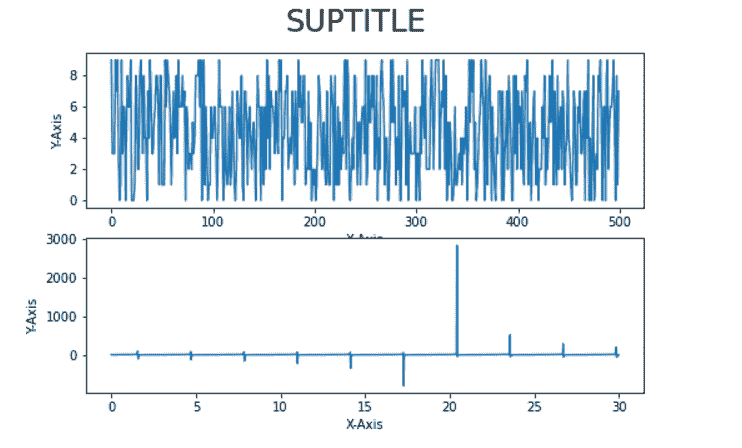

# matplotlib tight _ layout–有用的教程

> 原文：<https://pythonguides.com/matplotlib-tight-layout/>

[](https://sharepointsky.teachable.com/p/python-and-machine-learning-training-course)

在本 [Python Matplotlib 教程](https://pythonguides.com/what-is-matplotlib/)中，我们将讨论 Python 中的 `Matplotlib tight_layout` 。在这里，我们将使用 [matplotlib](https://pythonguides.com/how-to-install-matplotlib-python/) 介绍与紧密布局相关的不同示例。我们还将讨论以下主题:

*   Matplotlib tick_layout
*   Matplotlib tight_layout 示例
*   Matplotlib 紧密布局焊盘
*   Matplotlib 紧密布局 hspace
*   Matplotlib 紧密布局 wspace
*   Matplotlib 紧密布局矩形
*   Matplotlib tight_layout 保存图
*   Matplotlib tight_layout 子情节
*   Matplotlib tight_layout suptitle
*   Matplotlib tight_layout 剪切标签
*   Matplotlib 紧密布局图例
*   Matplotlib 紧密布局 bbox
*   Matplotlib tight_layout 未应用
*   Matplotlib tight_layout rcparams
*   Matplotlib imshow tight_layout
*   Matplotlib tight_layout gridspec
*   Matplotlib tight_layout 颜色条
*   Matplotlib 表格紧密布局
*   Matplotlib 散点图紧密布局
*   Matplotlib 3d plot tight layout
*   Matplotlib undo tight_layout
*   Matplotlib 紧密布局替代方案
*   Matplotlib constrained_layout 与 tight_layout

目录

[](#)

*   [Matplotlib tick_layout](#Matplotlib_tick_layout "Matplotlib tick_layout")
*   [Matplotlib tight_layout 示例](#Matplotlib_tight_layout_example "Matplotlib tight_layout example")
*   [Matplotlib tight _ layout pad](#Matplotlib_tight_layout_pad "Matplotlib tight_layout pad")
*   [Matplotlib tight _ layout hspace](#Matplotlib_tight_layout_hspace "Matplotlib tight_layout hspace")
*   [Matplotlib tight _ layout wspace](#Matplotlib_tight_layout_wspace "Matplotlib tight_layout wspace")
*   [Matplotlib tight _ layout rect](#Matplotlib_tight_layout_rect "Matplotlib tight_layout rect")
*   [Matplotlib tight _ layout save fig](#Matplotlib_tight_layout_savefig "Matplotlib tight_layout savefig")
*   [Matplotlib tight_layout 支线剧情](#Matplotlib_tight_layout_subplots "Matplotlib tight_layout subplots")
*   [Matplotlib tight _ layout sup title](#Matplotlib_tight_layout_suptitle "Matplotlib tight_layout suptitle")
*   [Matplotlib tight_layout 切割标签](#Matplotlib_tight_layout_cuts_labels "Matplotlib tight_layout cuts labels")
*   [Matplotlib tight_layout 图例](#Matplotlib_tight_layout_legend "Matplotlib tight_layout legend")
*   [matplotlibb TIG _ layout bbox](#Matplotlibb_tight_layout_bbox "Matplotlibb tight_layout bbox")
*   [Matplotlib tight_layout 未应用](#Matplotlib_tight_layout_not_applied "Matplotlib tight_layout not applied")
*   [Matplotlib tight _ layout RC params](#Matplotlib_tight_layout_rcparams "Matplotlib tight_layout rcparams")
*   [Matplotlib imshow tight _ layout](#Matplotlib_imshow_tight_layout "Matplotlib imshow tight_layout")
*   [Matplotlib tight _ layout grid spec](#Matplotlib_tight_layout_gridspec "Matplotlib tight_layout gridspec")
*   [Matplotlib tight _ layout color bar](#Matplotlib_tight_layout_colorbar "Matplotlib tight_layout colorbar")
*   [Matplotlib 表紧 _ 布局](#Matplotlib_table_tight_layout "Matplotlib table tight_layout")
*   [Matplotlib 散点紧密 _ 布局](#Matplotlib_scatter_tight_layout "Matplotlib scatter tight_layout")
*   [Matplotlib 3d plot tight layout](#Matplotlib_3d_plot_tight_layout "Matplotlib 3d plot tight layout")
*   [Matplotlib undo tight_layout](#Matplotlib_undo_tight_layout "Matplotlib undo tight_layout")
*   [Matplotlib tight_layout 替代方案](#Matplotlib_tight_layout_alternative "Matplotlib tight_layout alternative")
*   [Matplotlib constrained _ layout vs tight _ layout](#Matplotlib_constrained_layout_vs_tight_layout "Matplotlib constrained_layout vs tight_layout")

## Matplotlib tick_layout

在本节中，我们将学习 Python 中 matplotlib 的 [pyplot 模块](https://matplotlib.org/stable/api/_as_gen/matplotlib.pyplot.html)中的 `tick_layout` ()函数。 `tick_layout` 方法用于自动调整支线剧情。或者我们可以说，这个方法是用来调整子情节之间和周围的填充的。

**语法如下:**

```py
matplotlib.pyplot.tight_layout(*, pad=1.08, h_pad=None, w_pad=None, rect=None)
```

**以下是上面使用的参数:**

| **参数** | **值** | **默认值** | **描述** |
| 衬垫 | 漂浮物 | One point zero eight | 此参数用于指定人物边缘和子情节边缘之间的填充，作为字体大小的一部分。 |
| h_pad, w_pad | 漂浮物 | 衬垫 | 此参数用于指定相邻子情节边缘之间的高度或粗细，作为字体大小的一部分。 |
| 矩形 | 元组(左、下、右、上) | (0, 0, 1, 1) | 该参数用于在标准化图形坐标中指定一个矩形，包括标签在内的整个子图形区域将适合该矩形。 |

tight_layout

**我们使用 tight_layout()函数的不同情况:**

*   当轴标签或标题超出图形区域时。
*   当不同子情节的轴标签或标题相互重叠时。
*   当我们在图形区域有多个支线剧情，并且每个都有不同的大小时。
*   当我们想要调整人物周围和支线剧情之间的额外填充时。

阅读[Python Matplotlib tick _ params+29 示例](https://pythonguides.com/matplotlib-tick-params/)

## Matplotlib tight_layout 示例

有时在多个支线剧情的情况下，我们会看到标签、标记、标题、图例等互相重叠。

在 matplotlib 中，为了避免重叠，或者我们可以说，为了调整子情节之间的间距，我们可以使用 `tight_layout()` 函数。

这个函数( `tight_layout` )的主要目的是最小化重叠，而不是剪切它们。

**我们来看一个例子:**

**代码#1:正常绘图**

```py
**# Import Library** 
import numpy as np 
import matplotlib.pyplot as plt 

**# Create figure and subplot** 
fig, ax = plt.subplots(1, 2) 

**# Define  Data** 
x = np.arange(0.0, 30.0 , 0.02) 
y1 = np.sin(x) 
y2 = np.exp(-x) 

**# PLot Subplot 1** 
ax[0].plot(x, y1, label='Line1') 
ax[0].plot(x, y2, marker ='o', label='Line2') 

**# Add legend** 
ax[0].legend(loc='upper left')

**# Define Data** 
y3 = np.tan(x) 
y4 = np.exp(-2 * x) 

**# plot subplot 2** 
ax[1].plot(x, y3, color ='cyan', label='Line3') 
ax[1].plot(x, y4, color ='tab:red', marker ='o', label='Line4') 

**# Add legend** 
ax[1].legend(loc='upper right')

**# Show** 
plt.show() 
```

*   在上面的例子中，我们导入了 `matplotlib.pyplot` 和 `numpy` 包。
*   接下来，我们使用 `subplots()` 方法创建一个图形和一组 subplots。
*   之后，我们为子图 1 和子图 2 定义数据坐标，并使用 `plot()` 方法绘制数据。
*   为了放置每个子情节的图例，我们添加了**标签**，并且为了激活每个曲线的标签，我们使用了 `legend()` 方法。
*   要显示该图，请使用 `show()` 方法。


Normal PLot

上面的**代码#1** 只是一个简单的 [matplotlib 子情节](https://pythonguides.com/matplotlib-subplot-tutorial/)代码，其中我们在一个图形区域中有多个子情节。

**代码#2:紧密布局**

```py
**# Import Library** 
import numpy as np 
import matplotlib.pyplot as plt 

**# Create figure and subplot** 
fig, ax = plt.subplots(1, 2) 

**# Define  Data** 
x = np.arange(0.0, 30.0 , 0.02) 
y1 = np.sin(x) 
y2 = np.exp(-x) 

**# PLot Subplot 1** 
ax[0].plot(x, y1, label='Line1') 
ax[0].plot(x, y2, marker ='o', label='Line2') 

**# Add legend** 
ax[0].legend(loc='upper left')

**# Define Data** 
y3 = np.tan(x) 
y4 = np.exp(-2 * x) 

**# Plot subplot 2** 
ax[1].plot(x, y3, color ='cyan', label='Line3') 
ax[1].plot(x, y4, color ='tab:red', marker ='o', label='Line4') 

**# Add legend** 
ax[1].legend(loc='upper right')

**# tight_layout** 
plt.tight_layout() 

**# Show** 
plt.show() 
```

在这个例子中，我们还使用了 `tight_layout()` 函数来调整图形的标签，而不是剪切它们。


tight_layout()

在上面的**代码#2** 中，我们要实现 `tight_layout()` 函数。

读取 [Matplotlib x 轴标签](https://pythonguides.com/matplotlib-x-axis-label/)

## Matplotlib tight _ layout pad

我们将学习如何调整人物边缘和支线剧情边缘之间的填充。为了调整它们，我们使用**垫**参数。

**以下是语法:**

```py
matplotlib.pyplot.tight_layout(pad=1.08)
```

**举例:**

```py
**# Import Libraries**

import numpy as np
import matplotlib.pyplot as plt

**# Create figure and subplot**

fig, ax = plt.subplots(2, 2)

**# Define Data**

data = np.arange(0.0, 30, 0.05)

x1= np.sin(data) 
y1= np.cos(data)

x2= np.cos(data)
y2= np.tan(data)

x3= np.tan(data)
y3= np.exp(data*2)

x4= [5,10,15]
y4= [6,12,18]

**# Plot curves or subplots**

ax[0, 0].plot(x1, y1)
ax[0, 1].plot(x2, y2)
ax[1, 0].plot(x3, y3)
ax[1, 1].plot(x4, y4)

**# Add title to graph**

ax[0, 0].set_title("Graph 1 ")
ax[0, 1].set_title("Graph 2")
ax[1, 0].set_title("Graph 3")
ax[1, 1].set_title("Graph 4")

**# tight_layout** 
plt.tight_layout(pad=3.68)

**# Show**

plt.show()
```

*   在上面的例子中，我们导入了 `matplotlib.pyplot` 和 `numpy` 包。
*   接下来，我们使用 `subplots()` 方法创建一个图形和一组 subplots。
*   之后，我们为多个子图定义数据坐标，并使用 `plot()` 方法绘制数据。
*   通过使用 `set_title()` 方法，我们为每个情节添加标题。
*   要调整填充，请使用 `plt.tight_layout()` 方法。我们将 `pad` 作为参数传递，并在各自的情况下将它们赋值为 `3.68` 和 `5.86` 。


plt.tight_layout(pad=3.68)


plt.tight_layout(pad=5.86)

读取 [Matplotlib 多条形图](https://pythonguides.com/matplotlib-multiple-bar-chart/)

## Matplotlib tight _ layout hspace

我们将学习如何调整相邻支线剧情边缘之间的高度。为了调整高度，我们将 `h_pad` 参数传递给 `tight_layout()` 方法。

**以下是语法:**

```py
matplotlib.tight_layout(h_pad=None)
```

**我们来看一个例子:**

```py
**# Import Libraries**

import numpy as np
import matplotlib.pyplot as plt

**# Create figure and subplot**

fig, ax = plt.subplots(2, 1)

**# Define Data** 
data = np.arange(0.0, 30, 0.05)

x1= np.sin(data) 
y1= np.cos(data)

x2= np.cos(data)
y2= np.tan(data)

**# Plot curves or subplots**

ax[0].plot(x1, y1)
ax[1].plot(x2, y2)

**# Add title to graph**

ax[0].set_title("Graph 1 ")
ax[1].set_title("Graph 2")

**# tight_layout** 
plt.tight_layout(h_pad=0.2)

**# Show**

plt.show()
```

*   在上面的例子中，我们导入了 `matplotlib.pyplot` 和 `numpy` 包。
*   之后，我们使用 `subplots()` 方法创建一个图形和一组支线剧情。
*   我们为多个子图定义数据坐标，并使用 `plot()` 方法绘制数据。
*   通过使用 `set_title()` 方法，我们为每个情节添加标题。
*   要调整边缘之间的高度，请使用 `plt.tight_layout()` 方法。我们将 `h_pad` 作为参数传递，并在各自的情况下将它们赋值为 1.5 和 15.5。


tight_layout(h_pad=1.5)


tight_layout(h_pad=15.5)

阅读 [Matplotlib 散点图图例](https://pythonguides.com/matplotlib-scatter-plot-legend/)

## Matplotlib tight _ layout wspace

我们将学习如何调整相邻支线剧情边缘之间的宽度。为了调整宽度，我们将 `w_pad` 参数传递给 `tight_layout()` 方法。

**以下是语法:**

```py
matplotlib.tight_layout(w_pad=None)
```

**我们来看一个例子:**

```py
**# Import Libraries**

import numpy as np
import matplotlib.pyplot as plt

**# Create figure and subplot**

fig, ax = plt.subplots(1, 2)

**# Define Data**

data = np.arange(0.0, 30, 0.05)

x1= np.sin(data) 
y1= np.cos(data)

x2= np.exp(data*2)
y2= np.tan(data)

**# Plot curves or subplots** 
ax[0].plot(x1, y1)
ax[1].plot(x2, y2)

**# Add title to graph** 
ax[0].set_title("Graph 1 ")
ax[1].set_title("Graph 2")

**# tight_layout**

plt.tight_layout(w_pad=5.5)

**# Show**

plt.show()
```

*   在上面的例子中，我们导入了 `matplotlib.pyplot` 和 `numpy` 包。
*   之后，我们使用 `subplots()` 方法创建一个图形和一组支线剧情。
*   我们为多个子图定义数据坐标，并使用 `plot()` 方法绘制数据。
*   通过使用 `set_title()` 方法，我们为每个情节添加标题。
*   要调整边缘之间的**宽度**，使用 `plt.tight_layout()` 方法。我们将 `w_pad` 作为参数传递，并赋予它们 `5.5` 值。


tight_layout()

这里我们使用 `tight_layout()` 方法**，没有 w_pad** 参数。


plt.tight_layout(w_pad=5.5)

这里我们使用带有 w_pad 参数的 `tight_layout()` 方法**。**

读取 [Matplotlib 3D 散点图](https://pythonguides.com/matplotlib-3d-scatter/)

## Matplotlib tight _ layout rect

我们将学习如何在标准化图形坐标中指定一个矩形，包括标签在内的整个支线剧情区域都将适合这个矩形。

**以下是语法:**

```py
matplotlib.pyplot.tight_layout(rect=(0, 0, 1, 1)
```

**我们来看一个例子:**

```py
**# Import Library** 
import numpy as np 
import matplotlib.pyplot as plt 

**# Create figure and subplot**

fig, ax = plt.subplots(1, 2) 

**# Define  Data**

x = np.arange(0.0, 30.0 , 0.02) 
y1 = np.sin(x) 
y2 = np.exp(-x) 

**# PLot Subplot 1**

ax[0].plot(x, y1, label='Line1') 
ax[0].plot(x, y2, marker ='o', label='Line2') 

**# Add legend**

ax[0].legend(loc='upper left')

**# Define Data** 
y3 = np.tan(x) 
y4 = np.exp(-2 * x) 

**# Plot subplot 2**

ax[1].plot(x, y3, color ='cyan', label='Line3') 
ax[1].plot(x, y4, color ='tab:red', marker ='o', label='Line4') 

**# Add legend**

ax[1].legend(loc='upper right')

**# tight_layout**

fig.tight_layout(rect=(1.5, 0.86, 4.23, 2.55)) 

**# Show**

plt.show() 
```

*   在示例中，我们使用了 `arange()` 、 `sin()` 、 `cos()` 、 `tan()` 、 `exp()` 函数来定义数据。
*   要绘制图形，请使用 `plt.plot()` 方法。
*   为了放置每个支线剧情的图例，我们添加了 **标签** 并激活每个曲线的标签，我们使用了 `legend()` 方法。
*   **使用带有**矩形**参数的 tight_layout()** 方法。我们传递一个值为 1.5，0.86，4.23，2.55 的元组。


Simple Plot Without tight_layout()


tight_layout()

读取[堆积条形图 Matplotlib](https://pythonguides.com/stacked-bar-chart-matplotlib/)

## Matplotlib tight _ layout save fig

有时，我们会在创建的图形上看到大边框。为了获得自动调整大小的边框，我们使用了 `tight_layout()` 函数。

**举例:**

```py
**# Import Library**

import numpy as np 
import matplotlib.pyplot as plt 

**# Define  Data**

x = np.arange(0.0, 30.0 , 0.02) 
y1 = np.sin(x) 
y2 = np.exp(-x) 

**# Plot**

plt.plot(x, y1, label='Line1') 
plt.plot(x, y2, marker ='o', label='Line2') 

**# tight_layout**

plt.tight_layout()

**# Savefig**

plt.savefig('SimplePlot.png')

**# Show**

plt.show() 
```

*   在上面的例子中，我们使用了 `tight_layout()` 方法来调整绘图的边界。
*   **使用 plt.savefig()** 方法将图形保存为 `png` 。


savefig()

当我们在不使用 `tight_layout` 函数的情况下保存绘图时，会出现上面的输出。这里我们得到了额外的边界。


savefig() with tight_layout()

读取 [Matplotlib 两个 y 轴](https://pythonguides.com/matplotlib-two-y-axes/)

## Matplotlib tight_layout 支线剧情

matplotlib 库中的 `tight_layout` 函数用于自动调整子情节之间的适当间距，使其适合图形区域而不被切割。

**我们来看一个例子:**

```py
**# Importing library**

import numpy as np
import matplotlib.pyplot as plt

**# Create figure and subplots** 
fig, ax = plt.subplots(3,1)

**# Define Data**

x1= [2,4,6]
y1= [3,6,9]

x2= [5,10,15]
y2= [6,12,18]

x3= [2,4,6]
y3= [3,6,9]

**# Plot lines**

ax[0].plot(x1, y1)
ax[1].plot(x2, y2)
ax[2].plot(x3, y3)

**# Add title**

ax[0].set_title("Graph 1 ")
ax[1].set_title("Graph 2")
ax[2].set_title("Graph 3")

**# Auto adjust**

plt.tight_layout()

**# Display**

plt.show()
```

*   在上面的例子中，我们创建了 3 行 1 列的图形和支线剧情。
*   之后，我们定义数据坐标，并使用 `plot()` 方法在它们之间绘制一条线。
*   `set_title()` 方法用于添加标题。
*   为了消除重叠或者自动调整支线剧情，我们使用了 `tight_layout()` 方法。


*“Plot Without tight_layout() method”*


*“Subplots with tight_layout() function”*

又念，[水平线 matplotlib](https://pythonguides.com/horizontal-line-matplotlib/)

## Matplotlib tight _ layout sup title

有时候，剧情的 suptitle 和 title 互相重叠，剧情看起来不整洁。我们将学习如何自动调整情节的标题。

**举例:**

```py
**# Import Library** 
import numpy as np
import matplotlib.pyplot as plt

**# Create figure**

fig = plt.figure()

**# Define Data** 
x = np.random.randint(10,size=500)
y = np.random.random(500)

**# Add sup tile**

fig.suptitle('SUPTITLE', fontsize=24)

**# Create subplot 1**

plt.subplot(121)

**# Plot line**

plt.plot(x)

**# Add Title**

plt.title('RANDINT PLOT', fontsize=15)
 **# Create subplot 2**

plt.subplot(122)

**# Plot line** 
plt.plot(y)

**# Add Title**

plt.title('RANDOM PLOT', fontsize=15)

**# Auto adjust**

plt.tight_layout()

**# Dispaly**

plt.show()
```

*   在上面的例子中，我们导入了 `matplotlib.pyplot` 和 `numpy` 模块。
*   接下来，我们使用 `plt.figure()` 方法创建一个图形。
*   之后，我们使用 `randint()` 和 `random()` 方法定义数据。
*   然后，我们通过使用 `fig.suptitle()` 方法向该图添加一个标题。
*   `plt.subplots()` 方法用于在一个图区域中创建支线剧情。
*   要绘制数据坐标之间的直线，使用 `plt.plot()` 方法。
*   要给绘图添加标题，使用 `plt.title()` 方法。
*   要消除标题重叠，请使用 `tight_layout()` 函数。


*“Overlap title plot”*


tight_layout()

读取[绘制垂直线 matplotlib](https://pythonguides.com/draw-vertical-line-matplotlib/)

## Matplotlib tight_layout 切割标签

有时，图的 x 轴标签和 y 轴标签相互重叠，图看起来不整洁。我们将学习如何自动调整图的标签。

**我们来看一个例子:**

```py
**# Importing library** 
import numpy as np
import matplotlib.pyplot as plt

**# Create figure and subplots**

fig, ax = plt.subplots(2,2, figsize=(8, 5))

**# Define Data**

x1= np.random.randint(10,size=500)

x2= [5,10,15]
y2= [6,12,18]

x3= np.arange(0.0, 30.0 , 0.02) 
y3= np.tan(x3)

x4 = np.arange(0.0, 30.0 , 0.02) 
y4 = np.sin(x4)

**# Plot lines** 
ax[0, 0].plot(x1)
ax[0, 1].plot(x2, y2)
ax[1, 0].plot(x3, y3)
ax[1, 1].plot(x4, y4)

**# Add xlabel** 
ax[0, 0].set_xlabel('X-Axis')
ax[1, 0].set_xlabel('X-Axis')
ax[0, 1].set_xlabel('X-Axis')
ax[1, 1].set_xlabel('X-Axis')

**# Add ylabel**

ax[0, 0].set_ylabel('Y-Axis')
ax[1, 0].set_ylabel('Y-Axis')
ax[0, 1].set_ylabel('Y-Axis')
ax[1, 1].set_ylabel('Y-Axis')

**# Auto adjust**

plt.tight_layout()

**# Display**

plt.show()
```

*   在上面的例子中，我们导入了 `matplotlib.pyplot` 和 `numpy` 库。
*   之后，我们使用**支线剧情()**方法创建人物和支线剧情。
*   然后我们定义数据坐标，并用 `plt.plot()` 方法在它们之间画一条线。
*   `set_xlabel()` 和 `set_ylabel()` 方法分别用于在 x 轴和 y 轴添加标签。
*   要自动调整绘图，请使用 `tight_layout()` 函数。


*“Overlap labels”*


tight_layout()

检查完毕， [Matplotlib 反转 y 轴](https://pythonguides.com/matplotlib-invert-y-axis/)

## Matplotlib tight_layout 图例

有时，当我们在机器中保存一个带有图例的图时，我们发现图例被截断了。所以，我们将学习如何解决在保存一个情节时图例被切断的问题。

为了避免图例的截断，请使用 matplotlib 的 pyplot 模块的 `tight_layout()` 方法。

**我们来看一个例子:**

```py
**# Import Library**

import matplotlib.pyplot as plt

**# Create figure**

fig = plt.figure(1)

**# Plot**

plt.plot([1, 2, 3, 4, 5], [1, 0, 1, 0, 1], label='A label')
plt.plot([1, 2, 3, 8, 2.5], [1, 2, 2, 1, 0], label='B label')

**# Legend**

plt.legend(loc='center left', bbox_to_anchor=(1, 0))

**# Savefig**

#fig.savefig('Cut-off Legend.png')

**# Display**

plt.show()
```

*   这里我们导入 `matplotlib.pyplot` 库，使用 `plt.figure()` 创建图形。
*   之后，我们绘制图表并定义标签。
*   然后我们使用 `plt.legend()` 方法在图中添加一个图例。并且我们传递 loc 和 `bbox_to_anchor` 参数，分别设置它们的值**中左**，和 **1，0** 。
*   使用 `savefig()` 方法在机器中保存图形。


*” Jupyter Notebook Output “*


*” Savefig Output “*

在上面的输出中，我们看到当我们使用 `savefig()` 方法在机器中保存绘图时，l **egends 被切断**。

> 为了克服这个问题，我们使用了 `tight_layout()` 方法。

**举例:**

```py
**# Import Library**

import matplotlib.pyplot as plt

**# Create figure** 
fig = plt.figure(1)

**# Plot**

plt.plot([1, 2, 3, 4, 5], [1, 0, 1, 0, 1], label='A label')
plt.plot([1, 2, 3, 8, 2.5], [1, 2, 2, 1, 0], label='B label')

**# Legend**

plt.legend(loc='center left', bbox_to_anchor=(1, 0))

**# Adjust legend**

plt.tight_layout()

**# Savefig**

fig.savefig('Proper Legend.png')

**# Display**

plt.show()
```

现在，这里我们使用 `plt.tight_layout()` 方法，用于自动调整绘图、标记标签、标签和图例。


plt.tight_layout()

在上面的输出中，我们使用 `tight_layput()` 方法来获得正确的图例。

读取[将图例放在绘图 matplotlib 外](https://pythonguides.com/put-legend-outside-plot-matplotlib/)

## matplotlibb TIG _ layout bbox

在本节中，我们将学习在系统中保存地块时如何避免重叠、截断和额外空间。`save fig()`方法的 bbox_inches 参数和 matplotlib 的 `tight_layout()` 方法帮助你克服这个问题。

**我们来看一个例子:**

```py
**# Importing library**

import numpy as np
import matplotlib.pyplot as plt

**# Create figure and subplots**

fig, ax = plt.subplots(2,1, figsize=(8, 5))

**# Define Data**

x1= np.random.randint(10,size=500)

x2= np.arange(0.0, 30.0 , 0.02) 
y2= np.tan(x2)

**# Plot lines**

ax[0].plot(x1)
ax[1].plot(x2, y2)

**# Add sup tile**

fig.suptitle('SUPTITLE', fontsize=24)

**# Add xlabel**

ax[0].set_xlabel('X-Axis')
ax[1].set_xlabel('X-Axis')

**# Add ylabel**

ax[0].set_ylabel('Y-Axis')
ax[1].set_ylabel('Y-Axis')

**# Auto adjust**

plt.tight_layout()
fig.savefig('tight_layout bbox.png', bbox_inches='tight')

**# Display**

plt.show()
```

*   在上面的例子中，为了定义数据坐标，我们使用了 `randint()` 、 `arange()` 和 `tan()` 方法。
*   之后，为了创建绘图曲线，我们使用了 `plot()` 方法。
*   `suptitle()` 方法用于给情节添加标题。
*   `set_xlabel()` 和 `set_yalbel()` 方法用于分别在 x 轴和 y 轴添加标签。
*   `plt.tight_layout()` 方法是自动调整支线剧情。
*   我们将 `bbox_inches` 参数传递给 `savefig()` 方法，并将其值设置为“**tight”**，因为它移除了多余的边框。



Overlapped Plot


plt.tight_layout() and bbox_inches =’tight’

签出， [Matplotlib 另存为 pdf + 13 示例](https://pythonguides.com/matplotlib-save-as-pdf/)

## Matplotlib tight_layout 未应用

在某些情况下， `tight_layout()` 方法不能正常工作。在第节中，我们将学习在这种情况下我们必须做什么。

**让我们借助一个例子来理解整个概念:**

```py
**# Import Library** 
import matplotlib.pyplot as plt

**# Create figure** 
fig = plt.figure(1)

**# Define Data** 
data = np.arange(0.0, 30.0 , 0.02) 
x1 = np.sin(data)
x2 = np.cos(data)

**# Plot** 
plt.plot(data, x1, label='Sin')
plt.plot(data, x2, label='Cos')

**# Add legend** 
plt.legend(loc='center left', bbox_to_anchor=(0.8,-0.1))

**# tight_layout** 
plt.tight_layout()

**# display**

plt.show()
```


从上面的例子中，我们得出结论， `tight_layout()` 方法不起作用，因为图例与 ticklabels 重叠。

**解决方案:**使用 `tight_layout()` 配合 `rect` 参数。

**代码:**

```py
**# Import Library** import matplotlib.pyplot as plt

import numpy as np

**# Create figure**

fig = plt.figure(1)

**# Define Data** 
data = np.arange(0.0, 30.0 , 0.02) 
x1 = np.sin(data)
x2 = np.cos(data)

**# Plot**

plt.plot(data, x1, label='Sin')
plt.plot(data, x2, label='Cos')

**# Add legend**

plt.legend(loc='center left', bbox_to_anchor=(0.8,-0.1))

**# tight_layout with rect** 
plt.tight_layout(rect=(1.5, 0.86, 3.23, 2.55))

**# display**

plt.show()
```

*   在上面的例子中，我们导入了 `matplotlib.pyplot` 库，并使用 `plt.figure()` 创建了一个图形。
*   之后，我们使用 numpy 的 `arange()` 、 `sin()` 和 `cos()` 方法定义数据。
*   为了绘制数据，使用 matplotlib pyplot 模块的 `plot()` 方法。
*   为了放置图例，我们添加了 **标签** 并激活每条曲线的标签，我们使用了 `legend()` 方法。
*   为了恰当地适应包括标签在内的子情节区域，我们使用带有**矩形**参数的**紧密布局**方法。


plt.tight_layout(rect=())

阅读[什么是 matplotlib 内联](https://pythonguides.com/what-is-matplotlib-inline/)

## Matplotlib tight _ layout RC params

matplotlib.pyplot.tight_layout()方法仅在被调用时自动调整子情节。如果希望每次重新绘制图形时，都必须进行这种更改，请设置 rcParams。

**语法如下:**

```py
rcParams["figure.autolayout]
```

默认情况下，其值为 False。将其设置为 True。

**我们来看一个例子:**

```py
**# Importing library** 
import numpy as np
import matplotlib.pyplot as plt

**# Default adjustment** 
plt.rcParams["figure.autolayout"] = True

**# Create figure and subplots**

fig, ax = plt.subplots(2,1, figsize=(8, 5))

**# Define Data**

x1= [0, 1, 2, 3, 4]
y1= [2.5, 3.5, 4.5, 6.3, 2.1]

x2= [2, 4, 8, 3, 1]
y2= [5.2, 6, 1, 2.6, 9]

**# Plot lines**

ax[0].plot(x1, y1)
ax[1].plot(x2, y2)

**# Add sup tile**

fig.suptitle('SUPTITLE', fontsize=24)

**# Add xlabel**

ax[0].set_xlabel('X-Axis')
ax[1].set_xlabel('X-Axis')

**# Add ylabel**

ax[0].set_ylabel('Y-Axis')
ax[1].set_ylabel('Y-Axis')

**# Display**

plt.show()
```

在上面的例子中，我们使用**RC params[" figure . autolayout "]**而不是 `tight_layout()` 的方法来调整支线剧情，并将其设置为值 `True` 。


plt.rcParams[“figure.autolayout”]

**举例:**

```py
**# Import Library**

import numpy as np
import matplotlib.pyplot as plt

**# Create figure** 
fig = plt.figure()

**# Define Data**

x = np.random.randint(10,size=500)
y = np.random.random(500)

**# Add sup tile**

fig.suptitle('SUPTITLE', fontsize=24)

**# Create subplot 1**

plt.subplot(121)

**# Plot line** 
plt.plot(x)

**# Add Title**

plt.title('RANDINT PLOT', fontsize=15)

**# Create subplot 2**

plt.subplot(122)

**# Plot line** 
plt.plot(y)

**# Add Title** 
plt.title('RANDOM PLOT', fontsize=15)

**# Dispaly**

plt.show()
```


现在，看上面的例子，我们没有使用任何方法来调整支线剧情。它会自动调整支线剧情，因为我们在前面的例子中使用了 **rcParams[]** 。因此，每次重新绘制图形时，它都会自动调整。

阅读 [Python 使用 Matplotlib 绘制多行](https://pythonguides.com/python-plot-multiple-lines/)

## Matplotlib imshow tight _ layout

我们将学习如何使用 `tight_layout` 方法和 `imshow()` 方法。首先我们了解什么是 `imshow()` 函数。

> ***【imshow()】函数用于将数据显示为图像。***

 *`tick_layout` 方法与 `imshow()` 方法一起使用，自动调整绘图。

**举例:**

```py
**# Import Library**

import numpy as np
import matplotlib.pyplot as plt

**# Create figure and subplot**

fig = plt.figure(figsize=(8,5))
ax = plt.subplot(111)

**# Define Data**

arr = np.arange(100).reshape((10,10))

**# Title**

fig.suptitle('imshow() function Example', fontweight ="bold", fontsize= 24)

**# plot**

im = ax.imshow(arr, interpolation="none")

**# adjsut** 

plt.tight_layout()

**# Visualize**

plt.show() 
```

*   在上面的例子中，我们导入了 `matplotlib.pyplot` 和 `numpy` 库。
*   在此之后，我们分别使用**图()**和**支线剧情()**的方法创建和支线剧情，
*   然后我们使用 `arange()` 方法定义数据，并使用 `reshape()` 方法对其进行整形。
*   为了给图添加一个 suptitle，我们使用 `suptitle()` 方法。我们将**字体大小**和**字体重量**作为参数传递。
*   然后我们使用 `imshow()` 方法绘制图形，使用 `tight_layout()` 方法自动调整图形。


imshow()

读取 [Matplotlib 绘制一条线](https://pythonguides.com/matplotlib-plot-a-line/)

## Matplotlib tight _ layout grid spec

我们将学习如何对 `GridSpec` 类使用 `tight_layout()` 方法。首先了解什么是 `GridSpec` 类。

> matplotlib.grispec.GridSpec 类用于指定放置子图的网格的几何形状。必须设置行数和列数。

**GridSpec 类的语法如下:**

```py
matplotlib.gridspec.GridSpec(nrows, ncols, figure=None, left=None, bottom=None, right=None, top=None, wspace=None, hspace=None, width_ratio=None, height_ratio=None)
```

GridSpec 有自己的 `tight_light()` 方法。pyplot 的 `tight_layout()` 方法也适用于它。我们也可以使用指定边界框的**矩形**参数。 `h_pad` 和 `w_pad` 参数用于调整绘图的顶部和底部。

**我们来看一个例子:**

```py
**# Import Library**

import matplotlib.pyplot as plt
import matplotlib.gridspec as gridspec

**# Create figure**

fig = plt.figure(figsize =([9, 5]))

**# GridSpec**

gs = gridspec.GridSpec(2, 6)

**# Subplots**

ax1 = plt.subplot(gs[0, :2])
ax1.set_ylabel('ylabel', labelpad = 0, fontsize = 12)
ax1.plot([0, 1, 2], [2, 3.6, 4])

ax2 = plt.subplot(gs[0, 2:4])
ax2.set_ylabel('ylabel', labelpad = 0, fontsize = 12)
ax2.plot([2, 5.5, 9], [2, 3.6, 4])

ax3 = plt.subplot(gs[1, 1:3])
ax3.set_ylabel('ylabel', labelpad = 0, fontsize = 12)
ax3.plot([0, 1, 2], [1, 2, 3])

ax4 = plt.subplot(gs[1, 3:5])
ax4.set_ylabel('ylabel', labelpad = 0, fontsize = 12)
ax4.plot([2.3, 4.6, 8.8, 9.6], [4.2, 5.5, 6, 4])

**# Auto adjust**

plt.tight_layout()

**# Display**

plt.show() 
```

*   在上面的例子中，我们 `pyplot` 和`GridSpec`matplotlib 的类。
*   为了创建一个图，我们使用 `figure()` 方法。
*   之后，我们使用 `GridSpec()` 方法创建网格来放置子情节。
*   为了在 y 轴上设置标签，我们使用了 `set_yalbel()` 方法。
*   然后我们用 `tight_layout()` 的方法自动调整支线剧情。


Overlapped Subplots


tight_layout()

读取 [Matplotlib 旋转刻度标签](https://pythonguides.com/matplotlib-rotate-tick-labels/)

## Matplotlib tight _ layout color bar

我们将学习如何使用 `tight_layout()` 方法和 `colorbar()` 方法。一个 `colorbar()` 方法被用来给绘图添加一个颜色条。

**colorbar()方法的语法如下:**

```py
matplotlib.pyplot.colorbar(mappable=None, cax=None, ax=None, **kw)
```

**举例:**

```py
**# Import Library**

import numpy as np
import matplotlib.pyplot as plt

**# Create figure and subplot**

fig = plt.figure(figsize=(8,5))
ax = plt.subplot(111)

**# Define Data**

arr = np.arange(100).reshape((10,10))

**# Plot**

im = ax.imshow(arr, interpolation="none")

**# Add colorabar**

plt.colorbar(im)

**# adjsut** 

plt.tight_layout()

**# Visualize**

plt.show()
```

*   在这里，我们使用 numpy 的 `arange()` 方法定义数据，然后使用 `reshape()` 方法重塑图形。
*   之后，我们使用 `imshow()` 方法绘制图形。
*   要将 colorbar 添加到绘图中，请使用 `colorbar()` 方法。
*   `tight_layout()` 方法用于自动调整情节。


plt.colorbar()

读取 [Matplotlib 改变背景颜色](https://pythonguides.com/matplotlib-change-background-color/)

## Matplotlib 表紧 _ 布局

我们将学习如何在图形区域内自动调整图和表，而不发生重叠。在 matplotlib 中通过使用`matplotlib . py plot . table()`方法我们可以创建一个表格。

**创建表格的语法如下:**

```py
matplotlib.pyplot.table(cellText=None, cellColours=None, 
                        cellLoc=’right’,colWidths=None,
                        rowLabels=None, rowColours=None, 
                        rowLoc=’left’,colLabels=None, 
                        colColours=None, colLoc=’center’, 
                        loc=’bottom’, bbox=None, 
                        edges=’closed’, **kwargs) 
```

**我们来看一个例子:**

```py
**# Import Library**

import numpy as np
import matplotlib.pyplot as plt

**# Define data**

data = np.random.rand(3, 2)
columns = ('Col1', 'Col2')
rows = ['# %d' % p for p in (1, 2, 3)] 

**# Plot data**

plt.plot(data)

**# X-axis** 

plt.xlabel('X-axis')

**# Define table** 
the_table = plt.table(cellText=data,rowLabels=rows, colLabels=columns,loc='bottom', bbox=[0,-0.55,1,.33])

**# auto adjust**

plt.tight_layout()

**# Display**

plt.show()
```

*   这里我们导入 `numpy` 和 `matplotlib.pyplot` 库。
*   接下来，我们使用 `random.rand()` 方法定义数据，我们还定义了列和行。
*   通过使用 `plt.plot()` 我们创建一个图形，并使用 `plt.xlabel()` 方法定义其 x 轴标签。
*   要生成表格，请使用 matplotlib 的 `table()` 方法，带有 `cellText` 、 `rowLabels` 、 `colLabels` 、 `loc` 和 `bbox` 参数。
*   为了避免重叠，并使绘图整洁，我们使用了 `tight_layout()` 方法。


plt.tight_layout()

检查， [Matplotlib 散点图标记](https://pythonguides.com/matplotlib-scatter-marker/)

## Matplotlib 散点紧密 _ 布局

这里我们将学习如何在散点图中使用 `tight_layout()` 方法。

**举例:**

```py
**# Import Library**

import matplotlib.pyplot as plt

**# Create figure**

fig = plt.figure(1)

**# Define Data**

x =  [1, 2, 3, 4, 5]
y1 = [5, 10, 15, 20, 25]
y2 = [10, 20, 30, 40, 50]

**# Plot**

plt.scatter(x, y1, label='X*5')
plt.scatter(x, y2, label='X*10')

**# Add legend**

plt.legend(loc='center left', bbox_to_anchor=(0.8,-0.1))

**# tight_layout with rect**

plt.tight_layout(rect=(1.5, 0.86, 3.23, 2.55))

**# display**

plt.show()
```

*   这里我们使用 `scatter()` 方法绘制散点图。为了给情节添加一个图例，我们使用 `plt.legend()` 方法。
*   我们看到，在不使用 `tight_layout()` 方法的情况下，散点图的图例和 x 轴标记标签相互重叠。因此，为了避免重叠，我们使用带有 `rect` 参数的 `tight_layout()` 方法。


*“Overlapped Scatter Plot”*


plt.tight_layout()

读取 [Matplotlib 虚线](https://pythonguides.com/matplotlib-dashed-line/)

## Matplotlib 3d plot tight layout

我们将学习如何使用 `tight_layout()` 方法自动调整 3d 绘图。

**举例:**

```py
**# Importing Libraries**

import numpy as np
import matplotlib.pyplot as plt
from mpl_toolkits import mplot3d

**# Create 1st subplot**

fig = plt.figure(figsize=(10, 6))
ax = fig.add_subplot(1, 2, 1, projection='3d')

**# Define Data**

x1= [0.2, 0.4, 0.6, 0.8, 1]
y1= [0.3, 0.6, 0.8, 0.9, 1.5]
z1= [2, 6, 7, 9, 10]

**# Plot graph**

ax.scatter3D(x1, y1, z1, color='m')
ax.set_xlabel('X-Axis')
ax.set_ylabel('Y-Axis')
ax.set_zlabel('Z-Axis')

**# Create 2nd subplot**

ax = fig.add_subplot(1, 2, 2, projection='3d')

**# Define Data**

x2 = np.arange(0, 20, 0.2)
y2 = np.sin(x2)
z2 = np.cos(x2)

**# Plot graph**

ax.scatter3D(x2, y2, z2, color='r')
ax.set_xlabel('X-Axis')
ax.set_ylabel('Y-Axis')
ax.set_zlabel('Z-Axis')

**# auto adjust** 
plt.tight_layout()

**# Display graph**

plt.show()
```

*   在上面的例子中，我们导入了 `matplotlib.pyplot` 、 `numpy` 和 `mplot3d` 库。
*   通过使用 `add_subplot()` 方法，我们创建第一个子图，然后我们定义用于绘图的数据。
*   `ax.scatter3D()` 方法用于创建 3D 散点图。
*   之后，我们再次使用 `add_subplot()` 方法创建第二个子绘图，然后我们定义用于绘图的数据。
*   同样，我们使用 `ax.scatter3D()` 方法绘制另一个 3D 散点图。
*   为了自动调整绘图布局，我们使用 `tight_layout()` 。


tight_layout()

读取 [Matplotlib plot_date](https://pythonguides.com/matplotlib-plot-date/)

## Matplotlib undo tight_layout

有时，默认情况下，自动调整功能是打开的，以便在每次重新绘制图形时执行调整。如果想关闭它，可以调用 `fig.set_tight_layout()` 方法，并将 `False` bool 值传递给该方法。

让我们来看一个例子

```py
**# Import Library**

import numpy as np 
import matplotlib.pyplot as plt 

**# Create figure and subplot**

fig, ax = plt.subplots(1, 2) 

**# Define  Data**

x = np.arange(0.0, 30.0 , 0.02) 
y1 = np.sin(x) 
y2 = np.exp(-x) 

**# PLot Subplot 1**

ax[0].plot(x, y1, label='Line1') 
ax[0].plot(x, y2, marker ='o', label='Line2') 

**# Add legend**

ax[0].legend(loc='upper left')

**# Define Data**

y3 = np.tan(x) 
y4 = np.exp(-2 * x) 

**# plot subplot 2**

ax[1].plot(x, y3, color ='cyan', label='Line3') 
ax[1].plot(x, y4, color ='tab:red', marker ='o', label='Line4') 

**# Add legend**

ax[1].legend(loc='upper right')

**# Show**

plt.show() 
```

*   在上面的例子中，我们通过使用 matplotlib.pyplot 的 `subplots()` 方法创建图形和 subplots。
*   之后，我们使用 `arange()` 、 `sin` 和 `exp()` 方法定义数据。
*   然后，我们使用 `plot()` 方法来绘制图形，我们还使用 `legend()` 函数来定义图例。


“Auto Adjusted Plot”

从上面生成的输出中，我们得出结论，默认情况下，生成的支线剧情是自动调整的。

**Code:撤销或关闭 tight_layout()**

```py
**# Import Library** 
import numpy as np 
import matplotlib.pyplot as plt 

**# Create figure and subplot** 
fig, ax = plt.subplots(1, 2) 

**# undo tight_layout**

fig.set_tight_layout(False)

**# Define  Data**

x = np.arange(0.0, 30.0 , 0.02) 
y1 = np.sin(x) 
y2 = np.exp(-x) 

**# PLot Subplot 1** 
ax[0].plot(x, y1, label='Line1') 
ax[0].plot(x, y2, marker ='o', label='Line2') 

**# Add legend**

ax[0].legend(loc='upper left')

**# Define Data** 
y3 = np.tan(x) 
y4 = np.exp(-2 * x) 

**# plot subplot 2** 
ax[1].plot(x, y3, color ='cyan', label='Line3') 
ax[1].plot(x, y4, color ='tab:red', marker ='o', label='Line4') 

**# Add legend**

ax[1].legend(loc='upper right')

**# Show**

plt.show() 
```

现在通过使用上面的代码，我们可以撤销支线剧情的自动调整。这里我们用 `False` 值调用 `fig.set_tight_layout()` 方法，并撤销绘图的自动布局特性。


fig.set_tight_layout(False)

读取 [Matplotlib 日志日志图](https://pythonguides.com/matplotlib-log-log-plot/)

## Matplotli b 紧 _ 布局备选

> ***紧 _ 布局*** 的替代方案是 ***约束 _ 布局***

我们使用 `constrained_layout` 在您的图形中清晰地拟合图形。`*constrained _ layout*`自动调整支线剧情、图例、彩条、标题和标签，使其适合人物区域，同时仍保留用户要求的布局。

在向图形**添加任何轴之前，必须激活 constrained_layout** 。我们可以用两种方式激活它。

*   通过 rcParams 激活:

```py
matplotlib.pyplot.rcParams['figure.constrained_layout.use']=True
```

*   通过参数激活 subplots()或 figure()方法:

```py
**# Using subplots()** 
plt.subplots(constrained_layout=True)

**# Uisng figure()** 
plt.figure(constrained_layout=True)
```

**我们先来看一个简单的例子，以便更清楚地理解:**

```py
**# Importing library**

import numpy as np
import matplotlib.pyplot as plt

**# Create figure and subplots** 
fig, ax = plt.subplots(2,2, figsize=(8, 5))

**# Define Data**

x1= np.random.randint(10,size=500)

x2= np.linspace(100, 200, num=10)
y2= np.cos(x2)

x3= np.arange(0.0, 30.0 , 0.02) 
y3= np.tan(x3)

x4 = np.arange(0.0, 30.0 , 0.02) 
y4 = np.sin(x4)

**# Plot lines**

ax[0, 0].plot(x1)
ax[0, 1].plot(x2, y2)
ax[1, 0].plot(x3, y3)
ax[1, 1].plot(x4, y4)

**# Add xlabel**

ax[0, 0].set_xlabel('X-Axis')
ax[1, 0].set_xlabel('X-Axis')
ax[0, 1].set_xlabel('X-Axis')
ax[1, 1].set_xlabel('X-Axis')

**# Add ylabel**

ax[0, 0].set_ylabel('Y-Axis')
ax[1, 0].set_ylabel('Y-Axis')
ax[0, 1].set_ylabel('Y-Axis')
ax[1, 1].set_ylabel('Y-Axis')

**# Display**

plt.show()
```


*   在上面的例子中，轴标签或标题或刻度标签相互重叠，使绘图混乱。为了防止这种情况，需要调整轴的位置。
*   对于支线剧情，这可以通过使用 `Figure.subplots_adjust` 调整参数来手动完成，或者我们将通过指定 `constrained_layout=True` 来自动完成调整。

**代码:用于自动调整**

```py
**# Importing library**

import numpy as np
import matplotlib.pyplot as plt

**# Create figure and subplots**

fig, ax = plt.subplots(2,2, figsize=(8, 5), constrained_layout=True)

**# Define Data**

x1= np.random.randint(10,size=500)

x2= np.linspace(100, 200, num=10)
y2= np.cos(x2)

x3= np.arange(0.0, 30.0 , 0.02) 
y3= np.tan(x3)

x4 = np.arange(0.0, 30.0 , 0.02) 
y4 = np.sin(x4)

**# Plot lines**

ax[0, 0].plot(x1)
ax[0, 1].plot(x2, y2)
ax[1, 0].plot(x3, y3)
ax[1, 1].plot(x4, y4)

**# Add xlabel**

ax[0, 0].set_xlabel('X-Axis')
ax[1, 0].set_xlabel('X-Axis')
ax[0, 1].set_xlabel('X-Axis')
ax[1, 1].set_xlabel('X-Axis')

**# Add ylabel**

ax[0, 0].set_ylabel('Y-Axis')
ax[1, 0].set_ylabel('Y-Axis')
ax[0, 1].set_ylabel('Y-Axis')
ax[1, 1].set_ylabel('Y-Axis')

**# Display**

plt.show()
```


constrained_layout=True

读取[Matplotlib subplots _ adjust](https://pythonguides.com/matplotlib-subplots_adjust/)

## Matplotlib constrained _ layout vs tight _ layout

我们将讨论 constrained_layout 和 tight_layout。

| **约束 _ 布局** | **紧 _ 布局** |
| 它保留用户请求的逻辑布局。 | 它可能不会保留用户请求的逻辑布局。 |
| constrained_layout 使用约束解算器来确定轴的大小。 | tight_layout 不使用约束求解器来确定轴的大小。 |
| 在添加任何轴之前，需要激活 constrained_layout。 | 添加轴之前，不需要激活 tight_layout。 |
| 通过 RC params:
PLT . RC params[' figure . constrained _ layout . use ']= True 激活 | 通过 RC params:
PLT . RC params[' figure . autolayout ']= True 激活 |
| 通过方法激活:
PLT . subplots(constrained _ layout = True) | 通过方法激活:
plt.tight_layout() |

constrained_layout vs tight_layout

**我们来看一个例子:**

**示例:tight_layout**

```py
**# Import Library** 
from matplotlib.figure import Figure

**# Create figure** 
fg = Figure()

**# Create subplot** 
ax = fg.subplots(5, 1)

**# Plot** 
for i in range(5):
    ax[i].plot(range(25+25*i))

**# Add title** 
fg.suptitle('lots of lines')

**# tight_layout**

fig.tight_layout()

**# Save image** 
fg.savefig("tight_layout.png")
```


tight_layout

**示例:constrained_layout**

```py
**# Import Library**

from matplotlib.figure import Figure

**# Create figure** 
fg = Figure(constrained_layout=True)

**# Create subplot**

ax = fg.subplots(5, 1)

**# Plot**

for i in range(5):
    ax[i].plot(range(25+25*i))

**# Add title**

fg.suptitle('lots of lines')

**# Save image**

fg.savefig("constrained_layout.png")
```


constrained_layout

从上面的例子中，我们看到 `tight_layout` 并没有更好的工作。为了让带有支线剧情和标签的图形更好地工作，使用 `constrained_layout` 。

您可能还喜欢:

*   [Matplotlib 最佳拟合线](https://pythonguides.com/matplotlib-best-fit-line/)
*   [Matplotlib 绘图条形图](https://pythonguides.com/matplotlib-plot-bar-chart/)
*   [将图例放在绘图 matplotlib 之外](https://pythonguides.com/put-legend-outside-plot-matplotlib/)

因此，在这个 Python 教程中，我们已经讨论了 `"Matplotlib tight_layout"` ，并且我们还涵盖了一些与之相关的例子。这些是我们在本教程中讨论过的以下主题。

*   Matplotlib tick_layout
*   Matplotlib tight_layout 示例
*   Matplotlib 紧密布局焊盘
*   Matplotlib 紧密布局 hspace
*   Matplotlib 紧密布局 wspace
*   Matplotlib 紧密布局矩形
*   Matplotlib tight_layout 保存图
*   Matplotlib tight_layout 子情节
*   Matplotlib tight_layout suptitle
*   Matplotlib tight_layout 剪切标签
*   Matplotlib 紧密布局图例
*   Matplotlib 紧密布局 bbox
*   Matplotlib tight_layout 未应用
*   Matplotlib tight_layout rcparams
*   Matplotlib imshow tight_layout
*   Matplotlib tight_layout gridspec
*   Matplotlib tight_layout 颜色条
*   Matplotlib 表格紧密布局
*   Matplotlib 散点图紧密布局
*   Matplotlib 3d plot tight layout
*   Matplotlib undo tight_layout
*   Matplotlib 紧密布局替代方案
*   Matplotlib constrained_layout 与 tight_layout

[Bijay Kumar](https://pythonguides.com/author/fewlines4biju/)

Python 是美国最流行的语言之一。我从事 Python 工作已经有很长时间了，我在与 Tkinter、Pandas、NumPy、Turtle、Django、Matplotlib、Tensorflow、Scipy、Scikit-Learn 等各种库合作方面拥有专业知识。我有与美国、加拿大、英国、澳大利亚、新西兰等国家的各种客户合作的经验。查看我的个人资料。

[enjoysharepoint.com/](https://enjoysharepoint.com/)[](https://www.facebook.com/fewlines4biju "Facebook")[](https://www.linkedin.com/in/fewlines4biju/ "Linkedin")[](https://twitter.com/fewlines4biju "Twitter")*