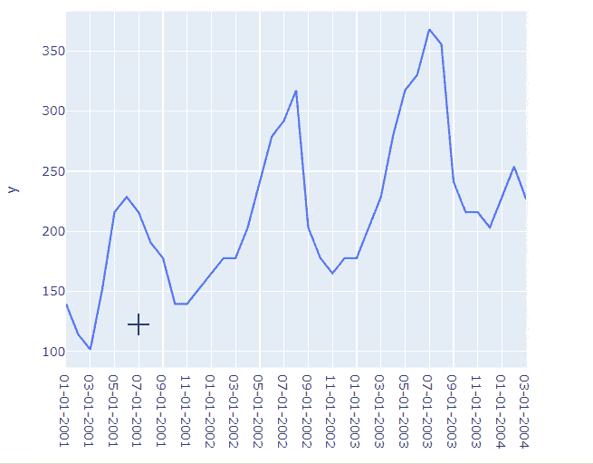
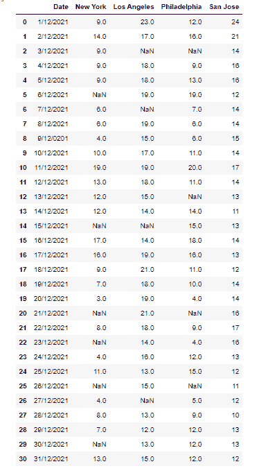
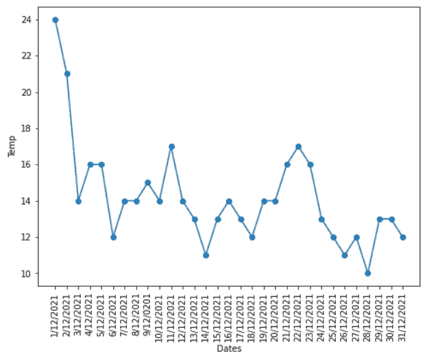

# Matplotlib 时间序列图

> 原文：<https://pythonguides.com/matplotlib-time-series-plot/>

[](https://sharepointsky.teachable.com/p/python-and-machine-learning-training-course)

在本 [Python Matplotlib 教程](https://pythonguides.com/what-is-matplotlib/)中，我们将讨论 **Matplotlib 时序图**。在这里，我们将使用 [matplotlib](https://pythonguides.com/what-is-matplotlib/) 涵盖与时间序列图相关的不同示例。我们还将讨论以下主题:

*   Matplotlib 时间序列
*   Matplotlib 时间序列情节熊猫
*   Matplotlib 时间序列散点图
*   Matplotlib 多时间序列图
*   Matplotlib 时间序列条形图
*   Matplotlib 绘制时间序列 x 轴
*   Python 时间序列图 seaborn
*   Matplotlib 箱线图时间序列
*   Python 时间序列交互式绘图
*   Matplotlib 时间序列多条形图
*   Matplotlib 绘制有间隙的时间序列

目录

[](#)

*   [Matplotlib 时间序列](#Matplotlib_time_series "Matplotlib time series")
    *   [什么是时间序列图:](#What_is_Time_Series_Plot "What is Time Series Plot:")
    *   [我们需要时间序列图的地方:](#Where_we_need_Time_Series_Plot "Where we need Time Series Plot:")
*   [Matplotlib 时间序列剧情熊猫](#Matplotlib_time_series_plot_pandas "Matplotlib time series plot pandas")
*   [Matplotlib 时间序列散点图](#Matplotlib_time_series_scatter_plot "Matplotlib time series scatter plot")
*   [Matplotlib 多个时间序列图](#Matplotlib_multiple_time_series_plot "Matplotlib multiple time series plot")
*   [Matplotlib 时间序列条形图](#Matplotlib_time_series_bar_plot "Matplotlib time series bar plot")
*   [Matplotlib 绘制时间序列 x 轴](#Matplotlib_plot_time_series_x_axis "Matplotlib plot time series x axis")
*   [Python 时间序列图 seaborn](#Python_time_series_plot_seaborn "Python time series plot seaborn")
*   [Matplotlib 箱线图时间序列](#Matplotlib_boxplot_time_series "Matplotlib boxplot time series")
*   [Python 时间序列交互图](#Python_time_series_interactive_plot "Python time series interactive plot")
*   [Matplotlib 时间序列多条线图](#Matplotlib_time_series_multiple_bar_plot "Matplotlib time series multiple bar plot")
*   [Matplotlib 绘制带有间隙的时间序列](#Matplotlib_plot_time_series_with_gaps "Matplotlib plot time series with gaps")

## Matplotlib 时间序列

这里先来了解一下什么是时序 plot，讨论一下为什么在 matplotlib 中需要它。

### 什么是时间序列图:

时间序列数据是在一段时间内收集的数据点的集合，具有时间索引。这些观测是在整个时间内以均匀的间隔进行的。数据可视化在绘制时间序列图中起着重要的作用。

### 我们需要时间序列图的地方:

ECG 信号、EEG 信号、股票市场数据、天气数据等等都是时间索引的，并且在一段时间内被记录。分析这些数据和预测未来观测的研究领域要广泛得多。

另外，检查: [Matplotlib 更新循环中的绘图](https://pythonguides.com/matplotlib-update-plot-in-loop/)

## Matplotlib 时间序列剧情熊猫

在这里，我们学习绘制将在[熊猫](https://pythonguides.com/pandas-in-python/)中创建的时间序列图。所以首先，我们必须在熊猫身上创建一个样本数据集。

**下面是` `在 Pandas 中创建 DataFrame 的语法:**

```py
pandas.DataFrame(data, index, columns, dtype, copy)
```

**让我们看看创建数据帧的源代码:**

```py
**# Import Library**

import pandas as pd

**# Defne Data** 
timeseries_data = { 
    'Date': ['2021-12-26', '2021-12-29',
             '2021-12-27', '2021-12-30',
             '2021-12-28', '2021-12-31' ], 

    'Washington': [42, 41, 41, 42, 42, 40],

    'Canada' : [30, 30, 31, 30, 30, 30],

    'California' : [51, 50, 50, 50, 50, 50]
}

**# Create dataframe**

dataframe = pd.DataFrame(timeseries_data,columns=['Date', 'Washington', 'Canada', 'California'])

**# Changing the datatype**

dataframe["Date"] = dataframe["Date"].astype("datetime64")

**# Setting the Date as index**

dataframe = dataframe.set_index("Date")
dataframe
```

**输出:**


Data Set

**绘制数据的源代码:**

```py
**# Import Library** 
import matplotlib.pyplot as plt

**# Plot**

plt.plot(dataframe["Canada"], marker='o')

**# Labelling** 

plt.xlabel("Date")
plt.ylabel("Temp in Faherenheit")
plt.title("Pandas Time Series Plot")

**# Display**

plt.show()
```

*   首先导入 `matplotlib.pyplot` 库。
*   接下来，为**加拿大**列绘制图表。
*   为了在轴上添加标签，我们使用了 `xlabel()` 和 `ylabel()` 函数。
*   为了添加标题，我们使用了 `title()` 函数。

**输出:**


*Pandas Time Series Plot*

另外，请阅读:[Matplotlib fill _ between–完整指南](https://pythonguides.com/matplotlib-fill_between/)

## Matplotlib 时间序列散点图

现在我们学习使用 Matplotlib 中的[散点图绘制时序图。](https://pythonguides.com/matplotlib-scatter-marker/)

**举例:**

在这个例子中，我们把上面创建的 DataFrame 作为一个数据。

```py
**# Import Library** 
import matplotlib.pyplot as plt

**# Plot scatter**

plt.scatter(dataframe.index, dataframe["Washington"])

**# Labelling** 

plt.xlabel("Date")
plt.ylabel("Temp in Faherenheit")

**# Auto space**

plt.tight_layout()

**# Display** 
plt.show()
```

这里我们画了一个散点图，表示**的**日期**和**温度**。**


Scatter Plot

阅读:[Matplotlib plot _ date–完整教程](https://pythonguides.com/matplotlib-plot-date/)

## Matplotlib 多个时间序列图

在这里，我们将学习使用 matplotlib 在一个图中绘制多个时间序列。

**举例:**

```py
**# Import Libraries**

import matplotlib.pyplot as plt
import datetime
import numpy as np
import pandas as pd

**# Create figure** 
fig = plt.figure(figsize=(12, 8))

**# Define Data** 
df1 = pd.DataFrame({'date': np.array([datetime.datetime(2021, 
                    12, i+1) for i in range(20)]),
                   'blogs_read': [4, 6, 5, 8, 15, 13, 18, 6, 5, 
                  3, 15, 14, 19, 21, 15, 19, 25, 24, 16, 26]})

df2 = pd.DataFrame({'date': np.array([datetime.datetime(2021, 
                     12, i+1)
 for i in range(20)]),
                   'blogs_unread': [1, 1, 2, 3, 3, 3, 4, 3, 2,     
                    3, 4, 7, 5, 3, 2, 4, 3, 6, 1, 2]})

**# Plot time series**

plt.plot(df1.date, df1.blogs_read, label='blogs_read', 
         linewidth=3)
plt.plot(df2.date, df2.blogs_unread, color='red', 
         label='blogs_unread', linewidth=3)

**# Add title and labels** 
plt.title('Blogs by Date')
plt.xlabel('Date')
plt.ylabel('Blogs')

**# Add legend**

plt.legend()

**# Auto space** 
plt.tight_layout()

**# Display plot** 
plt.show() 
```

*   首先导入必要的库，如 `matplotlib.pyplot` 、 `datetime` 、 `numpy` 和 `pandas` 。
*   接下来，要增加图形的大小，使用 `figsize()` 函数。
*   为了定义数据坐标，我们创建 pandas `DataFrame` 。
*   为了绘制时间序列，我们使用 `plot()` 函数。
*   要给绘图添加标题，使用 `title()` 函数。
*   为了在轴上添加标签，我们使用了 `xlabel()` 和 `ylabel()` 函数。
*   要添加图例，使用 `legend()` 函数。
*   要显示绘图，使用 `show()` 功能。


Multiple Time Series

阅读: [Matplotlib 旋转刻度标签](https://pythonguides.com/matplotlib-rotate-tick-labels/)

## Matplotlib 时间序列条形图

这里我们将学习使用 Matplotlib 中的[条形图绘制时间序列。](https://pythonguides.com/matplotlib-plot-bar-chart/)

**点击此处下载数据:**

[Sales.CSV](https://docs.google.com/spreadsheets/d/e/2PACX-1vS0R1sVemravUuHi-6lRwfT9wqH3BG0azEt8yJNl789wVir1bWY6uHHzsYKNzZZNa44xt0Uv_z4Eo97/pub?gid=1381125080&single=true&output=csv)

**举例:**

```py
**# Import Library** 
import pandas as pd 
import matplotlib.pyplot as plt 

**# Read csv** 
data= pd.read_csv('Sales.csv')

**# Convert data frame** 
df=pd.DataFrame(data)

**# Initilaize list** 
X = list(df.iloc[:,0])
Y = list(df.iloc[:,1])

**# Set figure** 
plt.figure(figsize=(15, 12))

**# Bar Plot** 
plt.bar(X, Y)

**# Setting Ticks** 
plt.tick_params(axis='x',labelsize=15,rotation=90)
plt.tight_layout()

**# Display**

plt.show() 
```

*   首先，我们导入必要的库，如 `matplotlib.pyplot` 和 `pandas` 。
*   接下来，读取 CSV 文件。
*   之后，从 CSV 文件创建 DataFrame。
*   初始化 X 和 y 的列表。
*   为了绘制条形图，我们使用了 `bar()` 函数。
*   要更改 tick 设置，我们使用 `tick_params()` 函数。
*   为了设置空间，我们使用 `tight_layout()` 函数。


plt.bar()

读取: [Matplotlib x 轴标签](https://pythonguides.com/matplotlib-x-axis-label/)

## Matplotlib 绘制时间序列 x 轴

这里我们将学习在 Matplotlib 中设置时间序列数据图的 x 轴。

**我们来看一个例子:**

```py
**# Import Library** 
import matplotlib.pyplot as plt
from datetime import datetime, timedelta

**# Define data** 
dates = [
    datetime(2021, 9, 21),
    datetime(2021, 9, 22),
    datetime(2021, 9, 23),
    datetime(2021, 9, 24),
    datetime(2021, 9, 25),
    datetime(2021, 9, 26),
    datetime(2021, 9, 27),
]

y = [0, 1.8, 2, 3.5, 4, 5.6, 6]

**# Plot** 
plt.plot_date(dates, y)

**# Setting axes** 
plt.tight_layout()
plt.tick_params(axis='x', rotation=90)

**# Display**

plt.show()
```

*   导入库 `matplotlib.pyplot` 和 `datetime` 。
*   定义数据轴 x 和 y。
*   为了绘制日期，我们使用 `plot_date()` 函数。
*   为了设置分笔成交点的设置，我们使用了 `tick_params()` 函数。


plt.plot_date()

阅读: [Matplotlib 多条形图](https://pythonguides.com/matplotlib-multiple-bar-chart/)

## Python 时间序列图 seaborn

在这里，我们将学习如何用 seaborn 创建一个时间序列图。

Seaborn 是一个优秀的 Python 可视化工具，用于绘制统计图像。它包括吸引人的默认样式和调色板，使统计图表更有吸引力。它基于最新版本的 matplotlib 包，并与 pandas 的数据结构紧密集成。

**点击` `上的` `下载数据集销售。CSV 文件:**

[Sales.CSV](https://docs.google.com/spreadsheets/d/e/2PACX-1vS0R1sVemravUuHi-6lRwfT9wqH3BG0azEt8yJNl789wVir1bWY6uHHzsYKNzZZNa44xt0Uv_z4Eo97/pub?gid=1381125080&single=true&output=csv)

**我们来看一个例子:**

```py
**# Import Library** 
import pandas as pd
import seaborn as sns
import matplotlib.pyplot as plt 

**# Read csv** 
data= pd.read_csv('Sales.csv')

**# Convert to dataframe** 
df=pd.DataFrame(data)

**# Initilaize list** 
X = list(df.iloc[:,0])
Y = list(df.iloc[:,1])

**# Set figure** 
plt.figure(figsize=(12,10))

**# Seaborn**

sns.lineplot(x=X, y=Y)

**# Setting Ticks** 
plt.tick_params(axis='x',labelsize=15,rotation=90)
plt.tight_layout()

**# Display** 
plt.show() 
```

*   首先导入 `matplotlib.pyplot` 、**熊猫**和 `seaborn` 库。
*   接下来，使用 `read_csv()` 函数读取 CSV 文件。
*   要将数据转换成数据帧，使用 pandas 的 `DataFrame()` 函数。
*   为了初始化列表，我们使用 pandas 的 `iloc()` 函数。
*   要设置图的尺寸，使用 `figsize()` 图的方法。
*   为了用 seaborn 库创建时间序列图，我们使用了 `lineplot()` 方法。
*   要更改 ticks 的设置，我们使用 `tick_params()` 函数。
*   要设置绘图的调整，使用 `tight_layout()` 功能。
*   要显示绘图，使用 `show()` 功能。


sns.lineplot()

阅读: [Matplotlib 3D 散点图](https://pythonguides.com/matplotlib-3d-scatter/)

## Matplotlib 箱线图时间序列

在这里，我们将学习使用 Matplotlib 使用 seaborn boxplot 绘制时间序列图。

**举例:**

```py
**# Import libraries**

import numpy as np
import pandas as pd
import seaborn
import matplotlib.pyplot as plt

**# Define Data** 
data = pd.DataFrame(np.random.randn(100), 
                    index=pd.date_range(start="2021-12-01", 
                    periods=100, freq="H"))
data.groupby(lambda x: x.strftime("%Y-%m-
            %d")).boxplot(subplots=False, figsize=(12,9))

**# Display** 
plt.show()
```

*   导入 `numpy` 、**熊猫**、 `seaborn` 和 `matplotlib.pyplot` 库。
*   使用 `DataFrame()` 函数创建熊猫数据框。
*   要定义用于绘图的数据，使用 `random.randn()` 函数并将索引设置为日期。
*   要按日期绘制分组，请使用 `groupby()` 函数。
*   要创建箱线图，使用 `boxplot()` 函数。


boxplot()

读取:[水平线 matplotlib](https://pythonguides.com/horizontal-line-matplotlib/)

## Python 时间序列交互图

Plotly 是一个 Python 开源数据可视化模块，支持各种图形，如折线图、散点图、条形图、直方图和面积图。Plotly 是一个绘图工具，使用 javascript 创建交互式图形。

**使用下面提到的命令进行 Plotly 安装:**

```py
pip install plotly
```

**点击` `上的` `下载数据集销售。CSV 文件:**

[Sales.CSV](https://docs.google.com/spreadsheets/d/e/2PACX-1vS0R1sVemravUuHi-6lRwfT9wqH3BG0azEt8yJNl789wVir1bWY6uHHzsYKNzZZNa44xt0Uv_z4Eo97/pub?gid=1381125080&single=true&output=csv)

**我们来看一个例子:**

```py
**# Import Library**

import pandas as pd
import plotly.express as px 
import matplotlib.pyplot as plt 

**# Read csv**

data= pd.read_csv('Sales.csv')

**# Convert data frame**

df=pd.DataFrame(data)

**# Initilaize list** 

X = list(df.iloc[:,0])
Y = list(df.iloc[:,1])

**# Set figure**

plt.figure(figsize=(12,10))

**# Plotly graph**

plot = px.line(x=X, y=Y)

**# Setting Ticks** 
plt.tick_params(axis='x',labelsize=15,rotation=90)
plt.tight_layout()

**# Display** 
plot.show() 
```

*   导入**熊猫**、 `plotly.express` 、 `matplotlib.pyplot` 等必要的库。
*   读取 CSV 文件，使用 `read_csv()` 函数。
*   使用 `DataFrame()` 函数将 CSV 文件转换为数据帧。
*   为了初始化列表，我们使用 `iloc()` 函数。
*   要绘制交互式时间序列折线图，使用 `plotly.express` 模块的 `line()` 函数。



Interactive Time Series Plot

读取: [Matplotlib 反转 y 轴](https://pythonguides.com/matplotlib-invert-y-axis/)

## Matplotlib 时间序列多条线图

在本节中，我们将学习使用多个条形图绘制时间序列图。我们在这里绘制了显示特定时期出生人数的图表。

**我们来看一个例子:**

```py
**# Import Libraries**

import pandas as pd
import matplotlib.pyplot as plt

**# Creating dataframe** 
df = pd.DataFrame({
     'Dates':['2021-06-10', '2021-06-11',
             '2021-06-12', '2021-06-13',
             '2021-06-14', '2021-06-15'],
    'Female': [200, 350, 150, 600, 500, 350],
    'Male': [450, 400, 800, 250, 500, 900]
})

**# Plotting graph** 
df.plot(x="Dates", y=["Female", "Male"], kind="bar")

**# Show**

plt.show()
```

**说明:**

*   导入 `matplotlib` 库进行数据可视化。
*   接下来，导入 `pandas` 库来创建数据帧。
*   然后使用 `DataFrame()` 函数在 pandas 中创建数据帧。
*   为了创建一个多条形图，我们使用了 `plot()` 方法，并将它的**种类**定义为**条形图**。
*   为了可视化这个图，我们使用了 `show()` 函数。


df.plot(kind=’bar’)

阅读:[将图例放在绘图 matplotlib 之外](https://pythonguides.com/put-legend-outside-plot-matplotlib/)

## Matplotlib 绘制带有间隙的时间序列

在本节中，我们将学习如何使用 matplotlib 绘制带有间隙的时间序列。首先，让我们来看一下 **gap 是什么意思**:

假设我们有一个 CSV 格式的数据集，其中有一些**缺少**值。然后，这些空白值或空白单元格被替换为 `NaN` 值。因此，当我们可视化这种数据集时，我们得到的是一个带有断点而不是连续线条的图表。

**要下载数据集，请单击最高温度美国城市:**

[Max Temp USA Cities](https://docs.google.com/spreadsheets/d/e/2PACX-1vRU7c6ZE1YIKPCGg-HoEmt9WQp1TQ0SRp_ARujA71AosjNCyAw6u6nyizLCjU0ZEcH6Kt-zsYcaPmX0/pubhtml?gid=0&single=true)

**为了更清楚地理解概念，我们来看不同的例子:**

*   首先，我们导入了必要的库，如 `pandas` 和 `matplotlib.pyplot` 。
*   在这之后，使用熊猫的 `read_csv()` 函数读取 csv 文件。
*   要查看数据集，请将其打印出来。

**源代码:**

```py
**# Import Libraries**

import pandas as pd 
import matplotlib.pyplot as plt 

**# Read** `CSV`

data= pd.read_csv('Max Temp USA Cities.csv')

**# Print** 

data
```



data

*   接下来，我们使用 `DataFrame()` 函数将 CSV 文件转换为熊猫的数据帧。
*   如果你想查看数据框，打印出来。

**源代码:**

```py
**# Convert data frame** 
df=pd.DataFrame(data)

**# Print**

df
```


df

*   使用 `iloc()` 函数初始化列表，从 pandas 数据帧中按位置选择行和列。

**源代码:**

```py
**# Initilaize list** 
dates = list(df.iloc[:,0])
city_1 = list(df.iloc[:,1])
city_2 = list(df.iloc[:,2])
city_3 = list(df.iloc[:,3])
city_4 = list(df.iloc[:,4])
```

*   现在，使用 `figsize()` 函数设置图形大小。
*   要设置 x 轴的旋转和标签尺寸，使用 `tick_params()` 函数。
*   要在 x 轴上设置标签，使用 `xlabel()` 函数。
*   要在 y 轴上设置标签，使用 `ylabel()` 函数。

**源代码:**

```py
**# Set Figure** `Size`

plt.figure(figsize=(8,6))

**# Setting Ticks**

plt.tick_params(axis='x',labelsize=10,rotation=90)

**# Labels** 
plt.xlabel("Dates")
plt.ylabel("Temp")
```

*   要绘制没有间隙的折线图，请使用 `plot()` 函数，并向其传递没有缺失值的数据坐标。
*   要设置标记，请将标记**作为参数传递。**
*   为了可视化图表，使用 `show()` 函数。

**示例#1(无间隙)**

```py
**# Plot**

plt.plot(dates, city_4, marker='o')

**# Display** 
plt.show()
```



Without Gaps

**示例#2(有间隙)**

```py
**# Set figure**

plt.figure(figsize=(8,6))

**# Plot**

plt.plot(dates,city_1, marker='o')

**# Labels**

plt.xlabel("Dates")
plt.ylabel("Temp")

**# Setting Ticks**

plt.tick_params(axis='x',labelsize=10,rotation=90)

**# Display**

plt.show()
```


With Gaps

**示例#3(有间隙)**

这里我们绘制了日期和洛杉矶市之间的图表。

```py
**# Set figure**

plt.figure(figsize=(8,6))

**# Plot**

plt.plot(dates,city_2, marker='o')

**# Labels**

plt.xlabel("Dates")
plt.ylabel("Temp")

**# Setting Ticks**

plt.tick_params(axis='x',labelsize=10,rotation=90)

**# Display**

plt.show()
```


plt.plot()

**示例#4(有间隙)**

这里我们绘制了日期和费城之间的图表。

```py
**# Set figure**

plt.figure(figsize=(8,6))

**# Plot**

plt.plot(dates,city_3, marker='o')

**# Labels**

plt.xlabel("Dates")
plt.ylabel("Temp")

**# Setting Ticks** 
plt.tick_params(axis='x',labelsize=10,rotation=90)

**# Display** 
plt.show()
```


plt.plot()

**示例#5(在一个图中有或没有间隙)**

```py
**# Set figure**

plt.figure(figsize=(8,6))

**# Plot**

plt.plot(dates,city_1, marker='o')
plt.plot(dates,city_4, marker='o')

**# Labels**

plt.xlabel("Dates")
plt.ylabel("Temp")

**# Setting Ticks**

plt.tick_params(axis='x',labelsize=10,rotation=90)

**# Display**

plt.show()
```


With or Without Gaps

你可能也喜欢阅读下面的 Matplotlib 教程。

*   [Matplotlib 默认图形尺寸](https://pythonguides.com/matplotlib-default-figure-size/)
*   [Matplotlib savefig 空白图像](https://pythonguides.com/matplotlib-savefig-blank-image/)
*   [Matplotlib 绘图误差线](https://pythonguides.com/matplotlib-plot-error-bars/)

在本 Python 教程中，我们已经讨论了“ **Matplotlib 时间序列图”**，并且我们还介绍了一些与之相关的示例。这些是我们在本教程中讨论过的以下主题。

*   Matplotlib 时间序列
*   Matplotlib 时间序列情节熊猫
*   Matplotlib 时间序列散点图
*   Matplotlib 多时间序列图
*   Matplotlib 时间序列条形图
*   Matplotlib 绘制时间序列 x 轴
*   Python 时间序列图 seaborn
*   Matplotlib 箱线图时间序列
*   Python 时间序列交互式绘图
*   Matplotlib 时间序列多条形图
*   Matplotlib 绘制有间隙的时间序列

[Bijay Kumar](https://pythonguides.com/author/fewlines4biju/)

Python 是美国最流行的语言之一。我从事 Python 工作已经有很长时间了，我在与 Tkinter、Pandas、NumPy、Turtle、Django、Matplotlib、Tensorflow、Scipy、Scikit-Learn 等各种库合作方面拥有专业知识。我有与美国、加拿大、英国、澳大利亚、新西兰等国家的各种客户合作的经验。查看我的个人资料。

[enjoysharepoint.com/](https://enjoysharepoint.com/)[](https://www.facebook.com/fewlines4biju "Facebook")[](https://www.linkedin.com/in/fewlines4biju/ "Linkedin")[](https://twitter.com/fewlines4biju "Twitter")