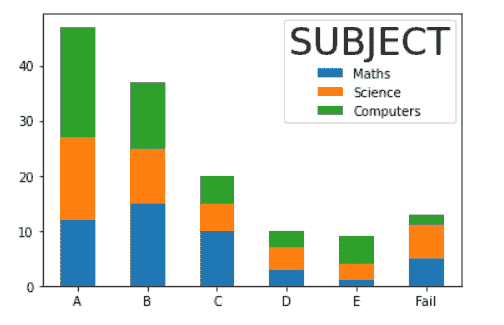

# Matplotlib 标题字体大小

> 原文：<https://pythonguides.com/matplotlib-title-font-size/>

[](https://sharepointsky.teachable.com/p/python-and-machine-learning-training-course)

在本 [Python 教程](https://pythonguides.com/learn-python/)中，我们将讨论 Python 中的 `Matplotlib title font size` 。在这里，我们将介绍使用 [matplotlib](https://pythonguides.com/what-is-matplotlib/) 与标题字体大小相关的不同例子。我们还将讨论以下主题:

*   Matplotlib 标题字体大小
*   Matplotlib 设置标题字体大小
*   Matplotlib 标题字体大小粗体
*   Matplotlib 图例标题字体大小
*   Matplotlib 子图标题字体大小
*   Matplotlib rcParams 标题字体大小
*   Matplotlib 饼图标题字体大小
*   Matplotlib 条形图标题字体大小
*   matplot lib colorbar title font size
*   Matplotlib 图形标题字体大小
*   Matplotlib set_title text font size
*   Matplotlib 标题不同字体大小

目录

[](#)

*   [Matplotlib 标题字体大小](#Matplotlib_title_font_size "Matplotlib title font size")
*   [Matplotlib 设置标题字体大小](#Matplotlib_set_title_font_size "Matplotlib set title font size")
*   [Matplotlib 标题字体大小加粗](#Matplotlib_title_font_size_bold "Matplotlib title font size bold")
*   [Matplotlib 图例标题字体大小](#Matplotlib_legend_title_font_size "Matplotlib legend title font size")
*   [Matplotlib 子图标题字体大小](#Matplotlib_subplot_title_font_size "Matplotlib subplot title font size")
*   [Matplotlib rcParams 标题字体大小](#Matplotlib_rcParams_title_font_size "Matplotlib rcParams title font size")
*   [Matplotlib 饼图标题字体大小](#Matplotlib_pie_chart_title_font_size "Matplotlib pie chart title font size")
*   [Matplotlib 条形图标题字体大小](#Matplotlib_bar_chart_title_font_size "Matplotlib bar chart title font size")
*   [matplot lib color bar title font size](#Matplotlib_colorbar_title_font_size "Matplotlib colorbar title font size")
*   [Matplotlib 图标题字体大小](#Matplotlib_figure_title_font_size "Matplotlib figure title font size")
*   [Matplotlib set_title text font size](#Matplotlib_set_title_text_font_size "Matplotlib set_title text font size")
*   [Matplotlib 标题不同字体大小](#Matplotlib_title_different_font_size "Matplotlib title different font size")

## Matplotlib 标题字体大小

这里我们要学习的是**如何在 Python** 中改变 matplotlib 中标题的字体大小。在开始这个话题之前，我们首先要了解一下**【标题】**是什么意思。

**标题:**用于描述 matplotlib 中的情节的名称。

**以下步骤用于将标题添加到情节中，概述如下:**

*   **定义库:**导入所需的重要库(用于数据创建和操作:Numpy 和 Pandas，用于数据可视化:来自 matplotlib 的 pyplot)。
*   **定义 X 轴和 Y 轴:**定义用于 X 轴和 Y 轴的数据坐标值。
*   **绘制图表或图形:**通过使用**条()**、**饼()**、**散点()**、 `plot()` 等方法，我们可以绘制出一个曲线图。
*   **添加标题:**通过使用 `title()` 方法我们可以给图表添加标题。
*   **生成一个图:**通过使用 `show()` 方法我们可以可视化一个图。

查看，[如何安装 matplotlib python](https://pythonguides.com/how-to-install-matplotlib-python/)

## Matplotlib 设置标题字体大小

在 Matplotlib 中，要设置一个绘图的标题，你必须使用 `title()` 方法并传递 `fontsize` 参数来改变它的字体大小。

**分配标题给` `图并改变其字体大小的语法如下:**

```py
**# To add title**
matplotlib.pyplot.title()

**# To change size**
matplotlib.pyplot.title(label, fontsize=None)
```

**上述使用的参数描述如下:**

*   **标签:**指定标题。
*   **fontsize:** 设置您选择的字体大小。

**让我们看一个设置标题字体大小的例子:**

```py
**# Import Library**

import matplotlib.pyplot as plt

**# Define Data**

x = [ 1, 2, 3, 4, 5]
y = [3, 6, 9, 12, 15]

**# Plot**

plt.plot(x,y,color='r')

**# Define Title and change size**

plt.title("Straight Line Function Chart", fontsize=10)

**# Show**

plt.show()
```

*   在上面的例子中，我们导入 `matplotlib.pyplot` 库来绘制图表。之后，我们定义用于数据绘图的数据点。
*   然后使用 `plt.plot()` 方法绘制折线图。
*   之后，我们使用 `plt.title()` 方法在情节上添加标题，我们还传递了 `fontsize` 参数，将其值设置为 `10` 。


plt.title() *“We set font size to 10”*

读取 [Matplotlib 虚线](https://pythonguides.com/matplotlib-dashed-line/)

## Matplotlib 标题字体大小加粗

这里我们学习如何在 Matplotlib 中将标题字体大小设置为粗体。

**将字体大小` `设置为粗体的语法:**

```py
matplotlib.pyplot.title(label, fontsize=None, fontweight=None)
```

**上面使用的参数如下:**

*   **标签:**指定绘图的标题。
*   **fontsize:** 设置绘图的字体大小。
*   **fontweight:** 设置字体为粗体。

**让我们来看一个` `的例子，将` `的标题设为加粗:**

```py
**# Import Library** 
import matplotlib.pyplot as plt
import numpy as np

**# Define Data**

x = np.arange(0, 15, 0.2)
y = np.sin(x)

**# Plot figure**

plt.plot(x, y)

**# Title**

plt.title("Sine Function", fontsize= 15, fontweight='bold')

**# Generate Plot**

plt.show()
```

在上面的例子中，我们使用 `plt.title()` 方法向绘图添加一个标题，我们将 `fontsize` 和 `fontweight` 参数传递给该方法，分别将其值设置为 `15` 和 `bold` 。


*” Set title font to bold “*

读取 [Matplotlib plot_date](https://pythonguides.com/matplotlib-plot-date/)

## Matplotlib 图例标题字体大小

这里我们学习在 Matplotlib 中设置绘图的图例标题的字体大小。我们使用 `legend()` 方法来添加图例标题。

我们还传递了 `title_fontsize` 参数，并将其值设置为 `30` 。

**添加图例标题和改变其字体大小的语法:**

```py
**# Import libraries**

import matplotlib.pyplot as plt
import pandas as pd

**# Define Data**

df = pd.DataFrame({
    'Maths': [12, 15, 10, 3, 1, 5],
    'Science': [15, 10, 5, 4, 3, 6],
    'Computers':[20, 12, 5, 3, 5, 2]
})

labels = ['A','B','C','D','E','Fail']

**# Plot stacked bar chart** ax = df.plot(stacked=True, kind='bar')

**# Set Tick labels** ax.set_xticklabels(labels,rotation='horizontal')

ax.legend(title='SUBJECT',title_fontsize=30)

**# Display chart**

plt.show()
```

*   在上面的例子中，我们导入了 `matplotlib.pyplot` 和 `pandas` 库。
*   之后，我们使用 pandas `DataFrame()` 方法来定义标签和数据坐标，并使用 `plot()` 方法来绘制堆叠条形图。
*   通过使用 `set_xticklabels()` 方法，我们设置 x 标签，并将其**旋转**设置为**水平**。
*   然后我们使用 `ax.legend()` 方法设置图例的标题，并传递 `title_fontsize` 参数，将其值设置为 30。



*” Change legend title font size”*

读取 [Matplotlib 日志日志图](https://pythonguides.com/matplotlib-log-log-plot/)

## Matplotlib 子图标题字体大小

这里我们将讨论如果我们使用 matplotlib 库在一个图形区域中绘制多个图，我们如何改变特定子图的标题字体大小。

我们使用 `set_size()` 方法来改变特定子情节的标题字体大小。

**让我们借助一个例子来理解这个概念:**

```py
**# Importing Libraries** 
import numpy as np
import matplotlib.pyplot as plt

**# Define Data**

x1= [0.2, 0.4, 0.6, 0.8, 1]
y1= [0.3, 0.6, 0.8, 0.9, 1.5]

x2= [2, 6, 7, 9, 10]
y2= [3, 4, 6, 9, 12]

x3= [5, 8, 12]
y3= [3, 6, 9]

x4= [7, 8, 15]
y4= [6, 12, 18]

fig, ax = plt.subplots(2, 2)

**# Set Title**

ax[0, 0].set_title("Plot 1")
ax[0, 1].set_title("Plot 2")
ax[1, 0].set_title("Plot 3")
ax[1, 1].set_title("Plot 4")

**# Change font size** 
ax[0,1].title.set_size(20)

**# Plot graph**

ax[0, 0].plot(x1, y1)
ax[0, 1].plot(x2, y2)
ax[1, 0].plot(x3, y3)
ax[1, 1].plot(x4, y4)

**# Display Graph**

fig.tight_layout()
plt.show()
```

*   在上面的例子中，我们在图形区域绘制了多个图。而且我们想改变具体剧情的标题字体大小。
*   这里我们使用 `set_title()` 方法在每个地块上添加标题。
*   我们对第二个子情节使用 `set_size()` 方法，并将其标题大小设置为 20。


*” Title size of subplot 2 changed “*

读取[Matplotlib subplots _ adjust](https://pythonguides.com/matplotlib-subplots_adjust/)

## Matplotlib rcParams 标题字体大小

在 matplotlib 中，可以通过更改 rcParams 字典的值来调整标题的大小。

我们可以改变保存在全局字典中的**【RC】**的默认设置来改变它的字体大小。

**改变 rcParams 标题字体大小的语法:**

```py
parameter = {'axes.titlesize': }

plt.rcParams.update(parameter)
```

这里我们定义一个**参数**字典来改变标题的字体大小。

**我们来看一个例子:**

```py
**# Import Libraries**

import numpy as np
import matplotlib.pyplot as plt

**# Define Data**

x=np.linspace(0,10,15)
y= np.cos(2 * np.pi * x)

**# Set title size**

par = {'axes.titlesize':30}
plt.rcParams.update(par)

**# Plot**

plt.plot(x, y)

**# Define title and labels** plt.title('Plot of cos x')
plt.xlabel('x')
plt.ylabel('cos x')

**# Show**

plt.show()
```

*   首先我们导入 `matplotlib.pyplot` 库和 `numpy` 库。
*   在这之后，我们定义用于绘图的数据，然后我们使用 `axes.titlesize` 并将它的值设置为 `30` ，我们将它传递给 `plt.rcParams.update()` 方法。
*   通过使用 `plt.plot()` 方法绘制 cos x 图，我们还使用 `plt.title()` 、 `plt.xlabel()` 、 `plt.ylabel()` 方法分别设置**标题**和**轴标签**。
*   最后，我们使用 `show()` 方法对图形进行可视化。


*” Change rcParams title font size “*

检查， [Matplotlib 最佳拟合线](https://pythonguides.com/matplotlib-best-fit-line/)

## Matplotlib 饼图标题字体大小

在本节中，我们将学习如何向饼图添加标题，还将学习在 Matplotlib 中更改其大小和颜色。

**举例:**

```py
**# Import Library**

import matplotlib.pyplot as plt
import numpy as np

**# Define Data**

subjects = ['MATHS', 'SCIENCE', 'ENGLISH', 'HINDI', 'SOCIAL-SCIENCE']

data = [20, 7, 31, 25, 12]

**# Creating plot** 
plt.pie(data, labels = subjects)

**# Set title**

plt.title("Popularity of subjects among students", fontsize=15, color='r', fontweight='bold')

**# Show plot**

plt.show()
```

*   这里我们使用 `plt.title()` 方法来定义饼图的标题，并传递**标签**、**字体大小**、**颜色**和**字体重量**作为参数。
*   我们将字体大小的值设置为 **15，**颜色设置为**红色，**粗细设置为**粗体**。


plt.title()

阅读 [Matplotlib 支线剧情教程](https://pythonguides.com/matplotlib-subplot-tutorial/)

## Matplotlib 条形图标题字体大小

通过使用 Matplotlib 库，这里我们首先通过使用 **plt.bar()，**绘制条形图，然后通过使用 `plt.title()` 为该图添加一个标题。

我们将字体的**大小**设为 50，字体的**颜色**设为黑色。

**举例:**

```py
**# Import Library** 
import matplotlib.pyplot as plt

**# Define Data**

students = [5, 6, 2, 3]
activities= ["Joging", "Gyming", "Swimming", "Shopping"]

**# Plot bar chart**

plt.bar( activities, students, color= 'yellow')

**# Add Title**

plt.title("BAR CHART", fontsize=50, color='k')

**# Display chart**

plt.show()
```


*“Bar chart”*

阅读 [Matplotlib 绘图条形图](https://pythonguides.com/matplotlib-plot-bar-chart/)

## matplot lib color bar title font size

这里我们学习在颜色栏上设置标题，我们也学习改变它的字体大小，颜色等等。通过使用 Matplotlib 库功能。

**绘图颜色条的语法和设置其标题文本如下:**

```py
**# Plot colorbar**
matplotlib.pyplot.colorbar()

**# Add text title**
matplotlib.pyplot.colorbar().set_label()
```

**让我们看一个改变颜色栏标题字体大小的例子:**

```py
**# Import Library**

import numpy as np
import matplotlib.pyplot as plt

**# Define Data**

subject = ['Maths', 'Science', 'Social-Science', 'Hindi', 'English']  
likes = [25, 15, 20, 16, 12]
ratio = [0.5, 1.2, 2.3, 4.3, 0.2]

**# Plot**

plt.scatter(x=subject, y=likes, c=ratio, cmap="summer")

**# Color Bar**

plt.colorbar().set_label(label='Ratio',size=25,weight='bold',color='blue')

**# Show**

plt.show()
```

*   在上面的例子中，我们首先导入 `matplotlib.pyplot` 和 `numpy` 库。
*   之后，我们定义数据，并通过使用 `plt.scatter()` 方法绘制散点图。
*   然后通过使用 `plt.colorbar()` 方法我们绘制颜色条，并通过使用 `set_label()` 我们设置颜色条的标题。
*   我们还将**尺寸**、**重量**和**颜色**作为参数传递，并将其值分别设置为 `25` 、**粗体**和**蓝色**。


plt.colorbar()

另外，检查一下，[什么是 matplotlib 内联](https://pythonguides.com/what-is-matplotlib-inline/)

## Matplotlib 图标题字体大小

轴标题和图形标题是不同的。所以。在这一节中，我们将学习图形标题。

我们也称一个人物标题为 suptitle 或者你也可以称之为 super title。

**添加图名的语法:**

```py
matplotlib.figure.Figure.suptitle(self, t, **kwargs)
```

**参数如下:**

*   **t:** 指定标题文本。
*   **x:** 指定标题的 x 位置。
*   **y:** 指定标题的 y 位置。
*   **fontsize:** 指定文本的字体大小，也可以写成 size。
*   **fontweight:** 指定文本的字体粗细，或者你也可以写为粗细。

`suptitle()` 方法用于给图添加居中的标题。

**让我们看一个例子来更清楚地理解这个概念:**

```py
**# Import Library**

import matplotlib.pyplot as plt

**# Create a new figure** fig = plt.figure()

**# Add Title to figure**

fig.suptitle('Grade Sheet', x= 0.5, y =1.05, fontsize=30, weight='bold') 

**# Define Data**

grades = ["A","B","C","D","E","Fail"]
students = [15, 12, 3, 5, 1, 2]

**# Plot bar chart**

plt.bar(grades,students)

**# Define axes title** 
plt.title("Class10",fontsize=15)  

**# Define axes labels**

plt.ylabel("No. of students")
plt.xlabel("Grades of students")

**# Display a bar chart**

plt.show()
```

*   这里我们使用 `plt.figure()` 方法创建一个新的图形。
*   在这之后，我们使用 `plt.suptitle()` 方法给图添加一个标题，并传递要写的**标题**以及其他参数，如 `x` 、 `y` 。我们使用 x 和 y 来设置超级标题的位置。
*   我们还将图中的**字体大小**和**重量**分别设置为 `30` 和**加粗**。
*   然后我们定义要绘制的数据，使用 `plt.bar()` 方法绘制条形图。
*   通过使用 `plt.title()` 方法，我们添加了轴标题，并将其 `fontsize` 设置为 `15` 。
*   通过使用 `plt.xlabel()` 和 `plt.ylabel()` 方法我们定义了轴标签。最后，我们使用 `plt.show()` 方法生成一个图。


fig.suptitle()

阅读 [Python 使用 Matplotlib 绘制多行](https://pythonguides.com/python-plot-multiple-lines/)

## Matplotlib set_title text font size

通过使用 `set_title()` 方法，您可以在 matplotlib 中为您的绘图添加一个标题。

**举例:**

```py
**# Import Library**

import matplotlib.pyplot as plt

**# Create new figure and subplot** 
fig = plt.figure() 
ax = fig.add_subplot(111) 

**# Add title**

ax.set_title('Title',fontsize= 30) 

**# Axes label**

ax.set_xlabel('x-axis')
ax.set_ylabel('y-axis')

**# Define Data**

x = [0, 1, 2, 3, 4, 5]
y = [1.5, 3, 5.3, 6, 10, 2]

**# Plot**

ax.plot(x,y,'-o') 

**# Show**

plt.show()
```


set_title()

读 [Matplotlib 情节 a l](https://pythonguides.com/matplotlib-plot-a-line/)[【I】](https://pythonguides.com/matplotlib-plot-a-line/)

## Matplotlib 标题不同字体大小

在 matplotlib 中，我们可以为图表中的每个标签设置不同的字体大小。

**举例:**

```py
**# Import Library**

import matplotlib.pyplot as plt

**# Create new figure and subplot** 
fig = plt.figure()
ax = fig.add_subplot(111) 

**# Add Figure Title**

fig.suptitle('Figure Title', x= 0.5, y =1.06, fontsize=35) 

**# Add Axes title**

ax.set_title('Axes Title',fontsize= 20) 

**# Add Axes label**

ax.set_xlabel('x-axis', fontsize= 15)
ax.set_ylabel('y-axis', fontsize= 10)

**# Define Data**

x = [0, 1, 2, 3, 4, 5]
y = [1.5, 3, 6.3, 6, 10, 2]

**# Plot**

ax.plot(x,y,'-o') 

**# Show**

plt.show()
```

**在上面的例子中，我们使用下面的方法来添加标题并设置它们的字体大小，如下所示:**

*   **fig.suptitle:** 给图添加标题。我们将字体大小设置为 35。
*   **ax.set_title:** 给轴添加标题。我们将字体大小设置为 20。
*   **ax.set_xlabel:** 添加一个 x 轴文本标签。我们将字体大小设置为 15。
*   **ax.set_ylabel:** 添加 y 轴文本标签。我们将字体大小设置为 10。


*“Different Title Font Size”*

您可能会喜欢以下 Python Matplotlib 教程:

*   [Matplotlib 默认图形尺寸](https://pythonguides.com/matplotlib-default-figure-size/)
*   [Matplotlib savefig 空白图像](https://pythonguides.com/matplotlib-savefig-blank-image/)
*   [Matplotlib 另存为 png](https://pythonguides.com/matplotlib-save-as-png/)
*   [Matplotlib 两个 y 轴](https://pythonguides.com/matplotlib-two-y-axes/)
*   [Matplotlib tight_layout](https://pythonguides.com/matplotlib-tight-layout/)

在本 Python 教程中，我们已经讨论了`" Matplotlib title font size "`，并且我们还讨论了一些与之相关的例子。这些是我们在本教程中讨论过的以下主题。

*   Matplotlib 标题字体大小
*   Matplotlib 设置标题字体大小
*   Matplotlib 标题字体大小粗体
*   Matplotlib 图例标题字体大小
*   Matplotlib 子图标题字体大小
*   Matplotlib rcParams 标题字体大小
*   Matplotlib 饼图标题字体大小
*   Matplotlib 条形图标题字体大小
*   matplot lib colorbar title font size
*   Matplotlib 图形标题字体大小
*   Matplotlib set_title text font size
*   Matplotlib 标题不同字体大小

[Bijay Kumar](https://pythonguides.com/author/fewlines4biju/)

Python 是美国最流行的语言之一。我从事 Python 工作已经有很长时间了，我在与 Tkinter、Pandas、NumPy、Turtle、Django、Matplotlib、Tensorflow、Scipy、Scikit-Learn 等各种库合作方面拥有专业知识。我有与美国、加拿大、英国、澳大利亚、新西兰等国家的各种客户合作的经验。查看我的个人资料。

[enjoysharepoint.com/](https://enjoysharepoint.com/)[](https://www.facebook.com/fewlines4biju "Facebook")[](https://www.linkedin.com/in/fewlines4biju/ "Linkedin")[](https://twitter.com/fewlines4biju "Twitter")