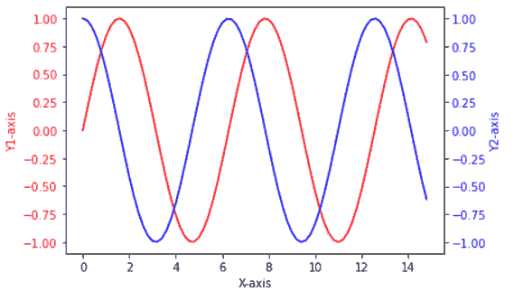
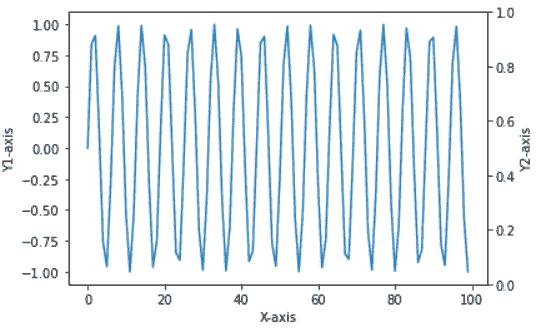
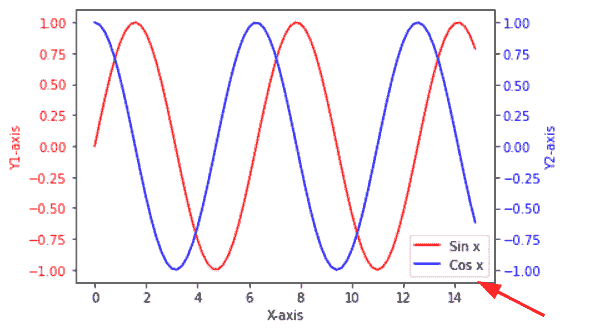
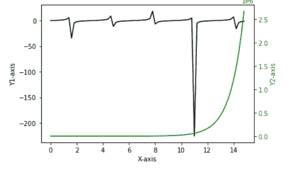
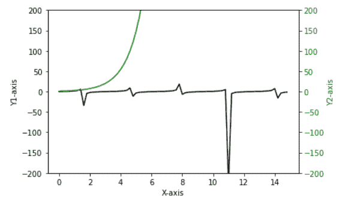
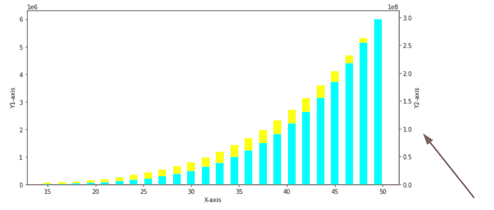
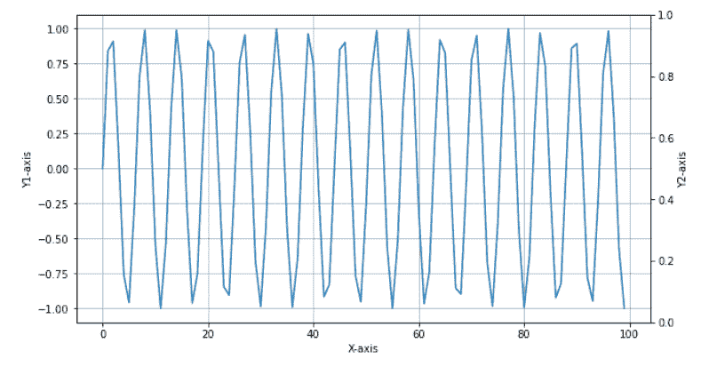

# Matplotlib 两个 y 轴

> 原文：<https://pythonguides.com/matplotlib-two-y-axes/>

[](https://sharepointsky.teachable.com/p/python-and-machine-learning-training-course)

在本 [Python 教程](https://pythonguides.com/python-hello-world-program/)中，我们将讨论 Python 中的 **Matplotlib 两个 y 轴**。在这里，我们将使用 [matplotlib](https://pythonguides.com/what-is-matplotlib/) 涵盖与两个 y 轴相关的不同示例。我们还将讨论以下主题:

*   Matplotlib 两个 y 轴
*   Matplotlib 两个 y 轴相同数据
*   Matplotlib 双 y 轴图例
*   Matplotlib 两个 y 轴不同比例
*   两个 y 轴比例相同
*   Matplotlib 双 y 轴条形图
*   Matplotlib 两个 y 轴网格

目录

[](#)

*   [Matplotlib 两个 y 轴](#Matplotlib_two_y_axes "Matplotlib two y axes")
*   [Matplotlib 两个 y 轴相同的数据](#Matplotlib_two_y_axes_same_data "Matplotlib two y axes same data")
*   [Matplotlib 两个 y 轴图例](#Matplotlib_two_y_axes_legend "Matplotlib two y axes legend")
*   [Matplotlib 两个 y 轴不同比例](#Matplotlib_two_y_axes_different_scale "Matplotlib two y axes different scale")
*   [Matplotlib 两个 y 轴同比例](#Matplotlib_two_y_axes_same_scale "Matplotlib two y axes same scale")
*   [Matplotlib 两个 y 轴条形图](#Matplotlib_two_y_axes_bar_plot "Matplotlib two y axes bar plot")
*   [Matplotlib 两个 y 轴网格](#Matplotlib_two_y_axis_grid "Matplotlib two y axis grid")

## Matplotlib 两个 y 轴

在本节中，我们将学习如何在 Python 的 matplotlib 中绘制一个带有两个 y 轴的图形。当我们需要快速分析时，我们会用两个不同比例的数据变量创建一个图表。

在 matplotlib 中， `twinx()` 函数用于创建双轴。

**twinx()方法的语法如下:**

```py
matplotlib.axes.Axes.twinx(self)
```

**让我们看一个创建两个 y 轴的例子:**

```py
**# Import Library**

import numpy as np 
import matplotlib.pyplot as plt 

**# Define Data**

x = np.arange(0, 15, 0.2)
data_1 = np.sin(x)
data_2 = np.cos(x) 

**# Create Plot**

fig, ax1 = plt.subplots() 

ax1.set_xlabel('X-axis') 
ax1.set_ylabel('Y1-axis', color = 'red') 
ax1.plot(x, data_1, color = 'red') 
ax1.tick_params(axis ='y', labelcolor = 'red') 

**# Adding Twin Axes** ax2 = ax1.twinx() 

ax2.set_ylabel('Y2-axis', color = 'blue') 
ax2.plot(x, data_2, color = 'blue') 
ax2.tick_params(axis ='y', labelcolor = 'blue') 

**# Show plot** 
plt.show()
```

*   在上面的例子中，我们首先导入 `numpy` 和 `matplotlib.pyplot` 库。
*   接下来，我们使用 `arrange()` 、 `sin()` 和 `cos()` 方法定义数据。
*   然后我们使用 `plot()` 方法绘制出 **x 轴**和 **y1 轴**之间的数据。
*   之后，我们使用 `plot()` 方法绘制 **x 轴**和 **y2 轴**之间的数据。
*   `twinx()` 方法用于创建两个 y 轴。



twinx()

*   [如何安装 matplotlib python](https://pythonguides.com/how-to-install-matplotlib-python/)

## Matplotlib 两个 y 轴相同的数据

在这里，我们将学习如何在 Python Matplotlib 中创建两个具有相同数据绘图的 y 轴。

通过使用 `twinx()` 方法，我们创建了两个孪生 y 轴。

**举例:**

```py
**# Import Library** 
import numpy as np
import matplotlib.pyplot as plt

**# Define Data** 
x = np.arange(100)
y = np.sin(x)

**# Plot Graph** 
fig, ax1 = plt.subplots()
ax1.plot(x, y)

**# Define Labels** 
ax1.set_xlabel('X-axis')
ax1.set_ylabel('Y1-axis')

**# Twin Axes** 
ax2 = ax1.twinx()
ax2.set_ylabel('Y2-axis')

**# Display** plt.show()
```

在上面的例子中，通过使用 `twinx()` 方法，我们创建了两个 y 轴，并通过使用 `plot()` 方法绘制了相同的数据。



*” Two y-axes with same data “*

*   [Matplotlib 绘制一条线](https://pythonguides.com/matplotlib-plot-a-line/)

## Matplotlib 两个 y 轴图例

在 matplotlib 中，通过使用 `plt.legend()` 方法，我们可以向绘图添加图例。

**语法如下:**

```py
matplotlib.pyplot.legend()
```

**让我们看一个例子来更好地理解这个概念:**

```py
**# Import Library** 
import numpy as np 
import matplotlib.pyplot as plt 

**# Define Data** 
x = np.arange(0, 15, 0.2)
data_1 = np.sin(x)
data_2 = np.cos(x) 

**# Create Plot** 
fig, ax1 = plt.subplots() 

ax1.set_xlabel('X-axis') 
ax1.set_ylabel('Y1-axis', color = 'red') 
plot_1 = ax1.plot(x, data_1, color = 'red', label='Sin x') 
ax1.tick_params(axis ='y', labelcolor = 'red') 

**# Adding Twin Axes** 
ax2 = ax1.twinx() 

ax2.set_ylabel('Y2-axis', color = 'blue') 
plot_2 = ax2.plot(x, data_2, color = 'blue', label = 'Cos x') 
ax2.tick_params(axis ='y', labelcolor = 'blue') 

**# Add legends** 
lns = plot_1 + plot_2
labels = [l.get_label() for l in lns]
plt.legend(lns, labels, loc=0)

**# Show plot** 
plt.show()
```

*   在上面的例子中，我们首先导入 `numpy` 和 `matplotlib.pyplot` 库。
*   接下来我们定义，数据使用 `arrange()` 、 `sin()` 和 `cos()` 的方法。
*   然后我们使用 `plot()` 方法绘制数据，并通过**标签**作为参数来定义图例。
*   在此之后，我们使用 `twinx()` 方法创建两个 y 轴。
*   `plt.legend()` 方法用于给绘图添加图例。



plt.legend()

*   [Python 使用 Matplotlib 绘制多条线](https://pythonguides.com/python-plot-multiple-lines/)

## Matplotlib 两个 y 轴不同比例

这里我们要学习如何在 Matplotlib 中绘制两个不同比例尺的 y 轴。它仅仅意味着两个图在相同的轴上，具有不同的 y 轴或左右刻度。

通过使用 `Axes.twinx()` 方法，我们可以生成两种不同的比例。

**让我们看一个左右刻度不同的两个 y 轴的例子:**

```py
**# Import Library**

import numpy as np 
import matplotlib.pyplot as plt 

**# Define Data** 
x = np.arange(0, 15, 0.2)
data_1 = np.tan(x)
data_2 = np.exp(x) 

**# Create Plot**

fig, ax1 = plt.subplots() 

ax1.set_xlabel('X-axis') 
ax1.set_ylabel('Y1-axis', color = 'black') 
plot_1 = ax1.plot(x, data_1, color = 'black') 
ax1.tick_params(axis ='y', labelcolor = 'black') 

**# Adding Twin Axes**

ax2 = ax1.twinx() 

ax2.set_ylabel('Y2-axis', color = 'green') 
plot_2 = ax2.plot(x, data_2, color = 'green') 
ax2.tick_params(axis ='y', labelcolor = 'green') 

**# Show plot**

plt.show()
```

*   在上面的例子中，我们将 `matplotlib.pypot` 和 `numpy` 作为库导入。
*   之后我们使用 numpy 的 `arrange()` 、 `tan()` 和 `exp()` 方法定义数据。
*   然后通过使用 `ax1.plot()` 方法，我们绘制出了 `tan` 函数的图形。
*   要添加双轴，我们使用 `twinx()` 方法。
*   接下来，我们使用 `ax2.plot()` 方法绘制一个**指数**函数的图形。



*” Two y-axes with different scales “*

在这里，您观察到 **Y1 轴的范围是(-200–0)**，而 **Y2 轴的范围是(0–2.5)**。因此，两个轴具有不同的刻度。

*   [什么是 matplotlib 内联](https://pythonguides.com/what-is-matplotlib-inline/)

## Matplotlib 两个 y 轴同比例

当我们在上面学习创建两个 y 轴时，我们使用了 `twinx()` 方法，但是它创建了具有不同刻度的轴。

现在，如果我们想创建两个相同比例的 y 轴，我们需要做什么？为此，我们必须**设置 y 轴的视图限制**。

**设置 y 轴视图限制的语法:**

```py
matplotli.axes.Axes.set_ylim(bottom=None, top=None, emit= True, auto=False, ymin=None, ymax=None)
```

**上面使用的参数概述如下:**

*   **bottom:** 在数据坐标中指定 bottom ylim。
*   **top:** 指定数据坐标中的 top ylim。
*   **emit:** 用于通知观察者极限变化。
*   **自动:**用于开启自动呼叫。
*   **ymin，ymax:** 同时传递 ymin 和 bottom 或者 ymax 和 top 都是错误的。

**让我们看一个例子，在 y 轴上我们有相同的刻度:**

```py
**# Import Library** 
import numpy as np 
import matplotlib.pyplot as plt 

**# Define Data** 
x = np.arange(0, 15, 0.2)
data_1 = np.tan(x)
data_2 = np.exp(x) 

**# Create Plot** 
fig, ax1 = plt.subplots() 

ax1.set_xlabel('X-axis') 
ax1.set_ylabel('Y1-axis', color = 'black') 
plot_1 = ax1.plot(x, data_1, color = 'black') 
ax1.tick_params(axis ='y', labelcolor = 'black') 

**# Adding Twin Axes** 
ax2 = ax1.twinx() 

ax2.set_ylabel('Y2-axis', color = 'green') 
plot_2 = ax2.plot(x, data_2, color = 'green') 
ax2.tick_params(axis ='y', labelcolor = 'green') 

**# Set same axes sacles**

a,b = -200, 200
ax1.set_ylim(a,b)
ax2.set_ylim(a,b)

**# Show plot** 
plt.show()
```

*   在上面的例子中，我们将 `matplotlib.pypot` 和 `numpy` 作为库导入。
*   之后我们使用 numpy 的 `arange()` 、 `tan()` 和 `exp()` 方法定义数据。
*   通过使用 `ax1.plot()` 和 `ax.2plot()` 方法我们绘制了一个图形。
*   要添加双轴，我们使用 `twinx()` 方法。
*   现在，使用 `set_ylim()` 方法使 y 轴的两个 sclaes 相同。
*   在这里，我们将两个 y 轴的视图限制设置为从 **-200 到 200** 。



*” Tow y-axes with the same scale “*

*   [Matplotlib 绘图条形图](https://pythonguides.com/matplotlib-plot-bar-chart/)

## Matplotlib 两个 y 轴条形图

这里我们将在 Python matplotlib 中创建一个具有两个 y 轴的条形图。首先，你必须知道如何创建一个条形图。

**创建条形图的语法如下:**

```py
matplotlib.pyplot.bar(x, height)
```

**我们来看一个例子:**

```py
**# Import Library** 
import numpy as np
import matplotlib.pyplot as plt

**# Define Data** 
x = np.arange(15, 50, 1.5)
y1 = x**4
y2 = x**5

**# using subplots() function** 
fig, ax = plt.subplots(figsize = (10, 5))

**# using the twinx() for creating
# another axes** 
ax2 = ax.twinx()

**# creating a bar plot** 
ax.bar(x, y1, color = 'yellow')
ax2.bar(x, y2, color = 'cyan')

**# Label axes** 
ax.set_xlabel('X-axis')
ax.set_ylabel('Y1-axis')
ax2.set_ylabel('Y2-axis')

**# defining layout** 
plt.tight_layout()

**# show plot** 
plt.show()
```

*   在上面的例子中，我们首先导入 `matplotlib.pyplot` 和 `numpy` 库进行数据可视化。
*   之后，我们使用 `arange()` 方法定义数据。
*   通过使用 `subplots()` 函数，我们创建了一个 subplot。
*   然后我们通过使用两个不同的轴对象来创建两个不同的 y 轴，借助于 `twinx()` 方法来创建双 y 轴。
*   然后我们使用 `ax.bar()` 方法和 `ax2.bar()` 方法创建条形图。这里，ax 是简单 Y 轴的对象，ax2 是辅助 Y 轴的对象。
*   通过使用 `set_ylabels()` 和 `set_xlabels()` 方法来设置绘图的标签。
*   最后，我们分别使用**PLT . tight _ 尤拉()**方法和 `plt.show()` 方法来定义布局和显示情节。



plt.bar()

*   [Matplotlib 支线剧情教程](https://pythonguides.com/matplotlib-subplot-tutorial/)

## Matplotlib 两个 y 轴网格

在这里，我们将学习如何从 matplotlib 中的两个 y 轴中的任意一个轴创建一个网格。

为此，我们必须将 `grid()` 方法用于我们想要创建网格线的绘图的 axes 对象。

**举例:**

```py
**# Import Library** 
import numpy as np
import matplotlib.pyplot as plt

**# Define Data** 
x = np.arange(100)
y = np.sin(x)

**# Plot Graph** 
fig, ax1 = plt.subplots(figsize=(10,5.5))
ax1.plot(x, y)

**# Define Labels** 
ax1.set_xlabel('X-axis')
ax1.set_ylabel('Y1-axis')

**# Twin Axes** 
ax2 = ax1.twinx()
ax2.set_ylabel('Y2-axis')

**# Grid method** 
ax1.grid()

**# Display** 
plt.show()
```

*   在上面的例子中，我们导入了 `matplotlib.pyplot` 和 `numpy` 库。
*   然后我们使用 `arange()` 和 `sin()` 方法定义数据。
*   通过使用 `plot()` 方法，我们绘制了一个图形。
*   接下来，我们使用 `twinx()` 方法创建另一个 y 轴。
*   现在，通过对轴的 `ax1` 对象使用 `grid()` 方法，我们创建一条带有 Y1 轴刻度的网格线。



*” Grid lines along Y1-axis scales “*

您可能还会喜欢以下 Python Matplotlib 教程:

*   [Matplotlib 最佳拟合线](https://pythonguides.com/matplotlib-best-fit-line/)
*   [Matplotlib Plot NumPy 数组](https://pythonguides.com/matplotlib-plot-numpy-array/)
*   [水平线 matplotlib](https://pythonguides.com/horizontal-line-matplotlib/)
*   [画垂直线 matplotlib](https://pythonguides.com/draw-vertical-line-matplotlib/)
*   [Matplotlib 反转 y 轴](https://pythonguides.com/matplotlib-invert-y-axis/)
*   [Matplotlib x 轴标签](https://pythonguides.com/matplotlib-x-axis-label/)
*   [Matplotlib 3D scatter](https://pythonguides.com/matplotlib-3d-scatter/)
*   [将图例放在绘图 matplotlib 之外](https://pythonguides.com/put-legend-outside-plot-matplotlib/)

在本 Python 教程中，我们已经讨论了 `"Matplotlib two y axes"` ，并且我们还介绍了一些与之相关的例子。这些是我们在本教程中讨论过的以下主题。

*   Matplotlib 两个 y 轴
*   Matplotlib 两个 y 轴相同数据
*   Matplotlib 双 y 轴图例
*   Matplotlib 两个 y 轴不同比例
*   两个 y 轴比例相同
*   Matplotlib 双 y 轴条形图
*   Matplotlib 两个 y 轴网格

[Bijay Kumar](https://pythonguides.com/author/fewlines4biju/)

Python 是美国最流行的语言之一。我从事 Python 工作已经有很长时间了，我在与 Tkinter、Pandas、NumPy、Turtle、Django、Matplotlib、Tensorflow、Scipy、Scikit-Learn 等各种库合作方面拥有专业知识。我有与美国、加拿大、英国、澳大利亚、新西兰等国家的各种客户合作的经验。查看我的个人资料。

[enjoysharepoint.com/](https://enjoysharepoint.com/)[](https://www.facebook.com/fewlines4biju "Facebook")[](https://www.linkedin.com/in/fewlines4biju/ "Linkedin")[](https://twitter.com/fewlines4biju "Twitter")