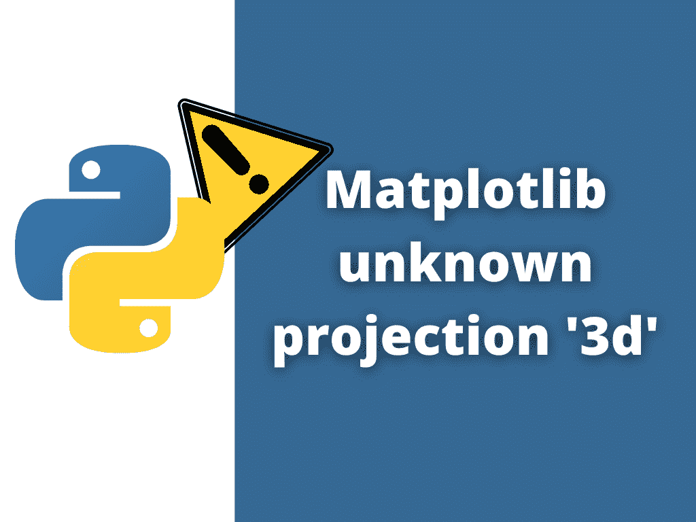

# Matplotlib 未知投影' 3d '

> 原文：<https://pythonguides.com/matplotlib-unknown-projection-3d/>

[](https://sharepointsky.teachable.com/p/python-and-machine-learning-training-course)

在本 [Python 教程](https://pythonguides.com/python-hello-world-program/)中，我们将讨论值错误**“Python 中 matplotlib 未知投影‘3d’”**。在这里，我们将使用 [matplotlib](https://pythonguides.com/what-is-matplotlib/) 来涵盖与此错误相关的原因和解决方案。我们还将讨论以下主题:

*   最旧的版本问题
*   安装问题
*   句法误差



Matplotlib unknown projection ‘3d’

目录

[](#)

*   [Matplotlib 未知投影‘3d’](#Matplotlib_unknown_projection_3d "Matplotlib unknown projection ‘3d’")
    *   [错误#1:最早的版本](#Error1_Oldest_Version "Error#1: Oldest Version")
        *   [解决方案#1](#Solution1 "Solution#1")
        *   [解决方案#2](#Solution2 "Solution#2")
    *   [错误#2 安装问题](#Error_2_Installation_Issue "Error #2 Installation Issue")
    *   [错误#3 语法错误](#Error3_Syntax_Error "Error#3 Syntax Error")

## Matplotlib 未知投影‘3d’

在本节中，我们将讨论错误“ **Matplotlib 未知投影‘3d’**”的各种原因及其解决方案

### 错误#1:最早的版本

首先了解一下 `mplot3D` 在不同版本的 matplotlib 中的工作方式是不同的。这里我们讨论的是 matplotlib 0.99 版本中的**值错误:matplotlib 未知投影‘3d**’。

所以首先你必须确认你用的是哪个版本？

**检查版本的语法:**

```py
**# Import library**

import matplotlib

**# Check Version**

print matplotlib."__version__"
```

如果你使用的是 matplotlib 0.99 ，在这种情况下你需要使用稍微不同的语法或者升级到一个更新的版本。

**让我们来看看这个问题的解决方案:**

#### 解决方案#1

解决此属性错误的第一个也是最简单的方法是将 matplotlib 升级到最新版本。

**Jupyter 笔记本:**

以下命令用于将 Jupyter Notebook 中的 matplotlib 升级到最新版本。

```py
pip install --upgrade matplotlib
```

**蟒蛇分布:**

如果您的系统中有 Anaconda 提示符，您可以从这里使用下面提到的命令轻松地将 matplotlib 更新到最新版本。

```py
conda update matplotlib
           #OR
conda update -all
```

这里，第一个命令只更新 matplotlib 包，第二个命令更新所有包。

#### 解决方案#2

解决此错误的第二种方法是使用稍微不同的语法，而不是使用 projection 关键字参数。

**使用以下语法:**

```py
**# Import Library**

from mpl_toolkits.mplot3d import axes3d, Axes3D

**# Set Projection**

Axes3D()
```

### 错误#2 安装问题

第一，原因可能是没有安装 matplotlib。

**Jupyter 笔记本:**

*   要安装 matplotlib，请使用 pip 命令。

```py
pip install matplotlib
```

**蟒蛇分布:**

*   要安装 matplotlib，请使用 conda 命令。

```py
conda install matplotlib
```

第二，原因可能是 matplotlib 没有正确安装。所以，首先，卸载 matplotlib 包，然后重新安装。上面我们讨论了 matplotlib 的安装。这里我们讨论一下 matplotlib 的卸载。

**Jupyter 笔记本:**

*   要卸载 matplotlib，请使用 pip 命令。

```py
pip uninstall matplotlib
```

**蟒蛇分布:**

*   要卸载 matplotlib，请使用 conda 命令。

```py
conda uninstall matplotlib
```

### 错误#3 语法错误

如果您使用的不是 matplotlib 的最早版本，并且 matplotlib 包安装正确，但仍然出现错误，那么您可能有语法错误。

下面是正确的语法:

```py
**# Import Library** 
from mpl_toolkits import mplot3d

**# Projection**

ax = plt.axes(projection="3d")
```

你可能也喜欢阅读下面的 Matplotlib 教程。

*   [如何安装 matplotlib python](https://pythonguides.com/how-to-install-matplotlib-python/)
*   [Matplotlib 旋转刻度标签](https://pythonguides.com/matplotlib-rotate-tick-labels/)
*   [什么是 add_axes matplotlib](https://pythonguides.com/add_axes-matplotlib/)
*   [Matplotlib 改变背景颜色](https://pythonguides.com/matplotlib-change-background-color/)
*   [Matplotlib 绘制一条线(详细指南)](https://pythonguides.com/matplotlib-plot-a-line/)
*   [Matplotlib plot _ date–完整教程](https://pythonguides.com/matplotlib-plot-date/)
*   [Matplotlib 1.3.1 需要未安装的 nose】](https://pythonguides.com/matplotlib-1-3-1-requires-nose-which-is-not-installed/)

在本 Python 教程中，我们已经讨论了**“matplotlib 未知投影‘3d’”**，我们还讨论了与之相关的原因和解决方案。这些是我们在本教程中讨论过的以下主题。

*   最旧版本
*   安装问题
*   句法误差

[Bijay Kumar](https://pythonguides.com/author/fewlines4biju/)

Python 是美国最流行的语言之一。我从事 Python 工作已经有很长时间了，我在与 Tkinter、Pandas、NumPy、Turtle、Django、Matplotlib、Tensorflow、Scipy、Scikit-Learn 等各种库合作方面拥有专业知识。我有与美国、加拿大、英国、澳大利亚、新西兰等国家的各种客户合作的经验。查看我的个人资料。

[enjoysharepoint.com/](https://enjoysharepoint.com/)[](https://www.facebook.com/fewlines4biju "Facebook")[](https://www.linkedin.com/in/fewlines4biju/ "Linkedin")[](https://twitter.com/fewlines4biju "Twitter")