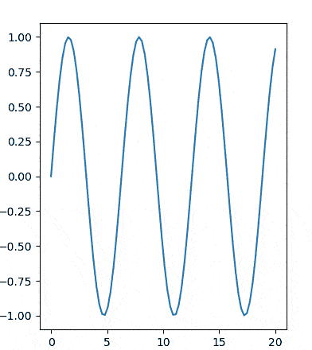
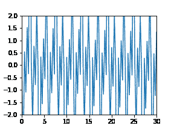
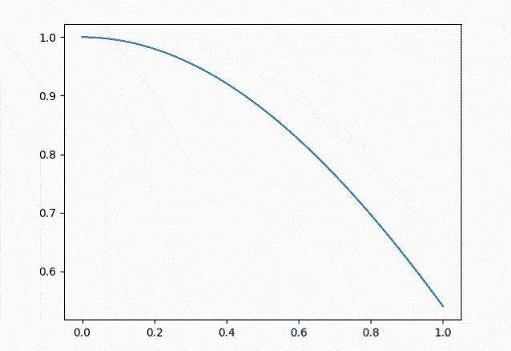
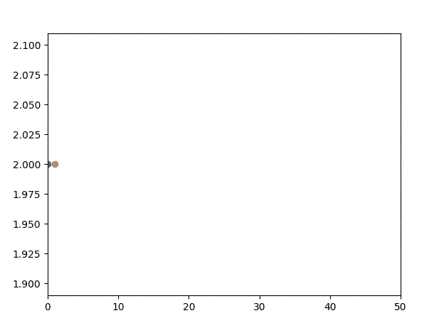
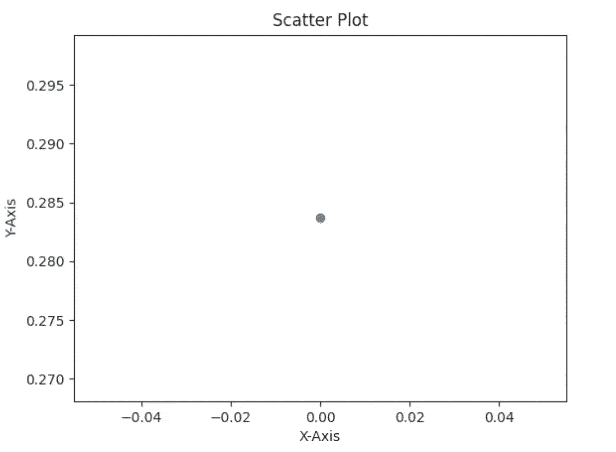
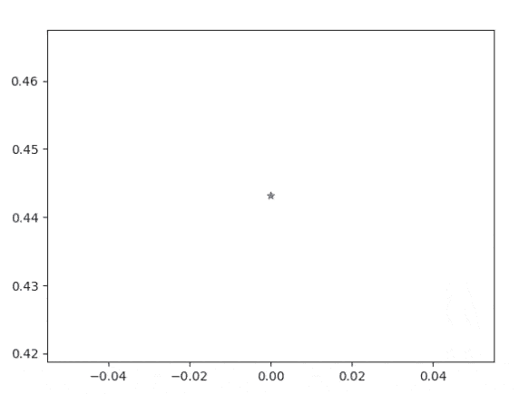
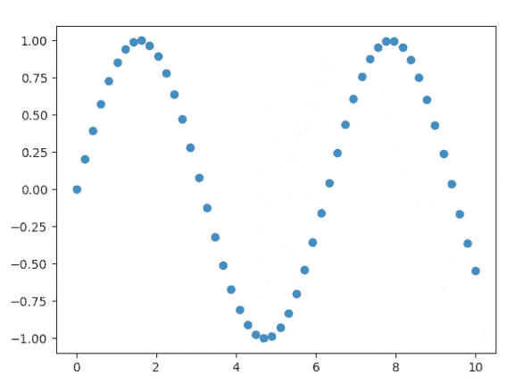

# Matplotlib 在循环中更新绘图

> 原文：<https://pythonguides.com/matplotlib-update-plot-in-loop/>

[](https://sharepointsky.teachable.com/p/python-and-machine-learning-training-course)

在本 [Python Matplotlib 教程](https://pythonguides.com/what-is-matplotlib/)中，我们将讨论循环中的 **Matplotlib 更新图。在这里，我们将介绍与使用 matplotlib 在循环**中**更新绘图相关的不同示例。我们还将讨论以下主题:**

*   Matplotlib 在循环中更新绘图
*   Matplotlib update plot in jupyter
*   Matplotlib 在循环中更新散点图
*   Matplotlib 在 while 循环中更新绘图
*   Matplotlib 更新 for 循环中的绘图

目录

[](#)

*   [Matplotlib 更新循环中的绘图](#Matplotlib_update_plot_in_loop "Matplotlib update plot in loop")
    *   [canvas.draw 用 canvas_flush_events()函数](#canvasdraw_with_canvas_flush_events_function "canvas.draw with canvas_flush_events() function")
    *   [FuncAnimation()函数](#FuncAnimation_function "FuncAnimation() function")
*   [Matplotlib update plot in Jupyter](#Matplotlib_update_plot_in_Jupyter "Matplotlib update plot in Jupyter")
    *   [绘图前清除轴](#Clear_axes_befor_plotting "Clear axes befor plotting")
    *   [绘图前不清除轴](#Without_clearing_axes_before_plotting "Without clearing axes before plotting ")
*   [Matplotlib 更新循环中的散点图](#Matplotlib_update_scatter_plot_in_loop "Matplotlib update scatter plot in loop")
*   [Matplotlib 在 while 循环中更新绘图](#Matplotlib_update_plot_in_while_loop "Matplotlib update plot in while loop")
*   [Matplotlib 更新循环中的绘图](#Matplotlib_update_plot_in_for_loop "Matplotlib update plot in for loop")

## Matplotlib 更新循环中的绘图

为了在循环中每次迭代时更新绘图，我们可以使用 matplotlib。我们通过循环迭代不断更新要绘制的变量，然后在 Matplotlib 中绘制变化的值，以实时绘制数据或制作动画。

我们使用各种方法通过动画实时显示更新的图，例如:

*   canvas.draw()带有 canvas_flush_events()函数
*   FuncAnimation()函数

### canvas.draw 用 canvas_flush_events()函数

通过更新变量，我们可以在循环中更新情节，然后使用 `canvas.draw()` 函数通过动画显示更新。

**举例:**

```py
**# Interactive Mode**

%matplotlib notebook

**# Import Library** 
import numpy as np
import time
import matplotlib.pyplot as plt

**# Create subplots**

figure, ax = plt.subplots(figsize=(4,5))

**# Data Coordinates**

x = np.linspace(0, 20, 80)
y = np.sin(x)

**# GUI**

plt.ion()

**#  Plot**

plot1, = ax.plot(x, y)

**# Labels**

plt.xlabel("X-Axis",fontsize=18)
plt.ylabel("Y-Axis",fontsize=18)

for value in range(150):
    update_y_value = np.sin(x-2.5*value)

    plot1.set_xdata(x)
    plot1.set_ydata(update_y_value)

    figure.canvas.draw()
    figure.canvas.flush_events()
    time.sleep(0.1)

**# Display**

plt.show()
```

**说明:**

*   首先，打开互动模式。
*   接下来导入 `numpy` 、 `time` 、 `matplotlib.pyplot` 等库。
*   使用**支线剧情()**函数创建支线剧情。
*   接下来定义数据坐标，使用 `linespace()` 和 `sin()` 函数。
*   为了用 x 和 y 值更新绘图，我们使用 `ion()` 函数。
*   为了绘制直线，我们使用 `plot()` 函数。
*   为了定义标签，我们使用了 `xlabel()` 和 `ylabel()` 函数。
*   然后我们用 `set_xdate()` 和 `set_ydata()` 函数更新变量 x 和 y。
*   为了显示更新，我们使用 `canvas.draw()` 函数。
*   为了获得新的图形，我们使用 `canvas.flush_event()`

**输出:**



Matplotlib update plot in loop example-1

### FuncAnimation()函数

在这里，我们将学习通过更新变量来更新绘图，并使用动画功能来显示它们。

**以下是语法:**

```py
matplotlib.animation.FuncAnimation(fig, func, frames=None, 
                                   init_func=None, 
                                   fargs=None, 
                                   save_count=None, * ,    
                                   cache_frame_data=True, 
                                   **kwargs)
```

**举例:**

```py
**# Import Library**

import numpy as np
import matplotlib.pyplot as plt
from matplotlib.animation import FuncAnimation

**# Create figure and subplot**

figure, ax = plt.subplots(figsize=(4,3))

x = []
y = []

**# Plot**

plot_1, = ax.plot(x, y)
plt.axis([0, 30, -2, 2])

**# Animation Function**

def animate_plot (i):
    x = np.linspace(0, 30, 100)
    y = np.tan(6 * (x - 0.3 * i))
    plot_1.set_data(x, y)
    return plot_1,

**# Animated Function**

ani = FuncAnimation(figure,
                    animate_plot,
                    frames=3,
                    interval=100)

**# Save as gif**

ani.save('animation.gif', fps=10)

**# Display**

plt.show() 
```

**说明:**

*   导入 `numpy` 、 `matplotlib.pyplot` 、**动画**等库。
*   接下来，我们使用 `figure()` 函数来将绘图更新。
*   为了绘制折线图，我们使用了 `plot()` 函数。
*   为了设置轴，我们使用了 `axis()` 函数。
*   定义数据坐标，使用 numpy 的 `linespace()` 和 `tan()` 函数。
*   每一帧要调用的函数是 `animate_plot` 。它的第一个参数来自下一个值帧。
*   `FuncAnimation()` 函数用于制作情节动画。
*   为了在 gif plot 中保存绘图，我们使用 `save()` 函数。



Matplotlib update plot in loop example-2

另外，查看: [Matplotlib 饼图教程](https://pythonguides.com/matplotlib-pie-chart/)

## Matplotlib update plot in Jupyter

我们将学习更新 Jupyter 中的情节。为此，我们必须导入 display 和 clear_output。现在我们有两种不同的方法来更新我们的情节，让我们一个一个来看:

*   绘图前清除轴
*   打印前不清除轴

### 绘图前清除轴

这里我们更新了 Jupyter 中的绘图，在这种方法中，我们在绘制图形之前清除了轴。

**举例:**

```py
**# Import Libraries** 
import numpy as np
import matplotlib.pyplot as plt
from IPython.display import display, clear_output

**# Create figure and subplot**

fig = plt.figure()
ax = fig.add_subplot(1, 1, 1) 

**# Define and update plot**

for i in range(20):
    x = np.linspace(0, i, 100);
    y = np.cos(x) 
    ax.set_xlim(0, i)    
    ax.cla()
    ax.plot(x, y)
    display(fig)    
    clear_output(wait = True)
    plt.pause(0.1)
```

*   首先导入 `numpy` 、 `matplotlib.pyplot` 、 `display` 和 `clear_output` 库。
*   在这之后，我们使用 `figure()` 和 `add_subplot()` 函数创建 figure 和 subplot。
*   接下来，定义数据坐标，使用 `linspace()` 和 `cos()` 函数。
*   为了设置限制，我们使用 `set_xlim()` 函数。
*   为了绘制图表，我们使用了 `plot()` 函数。
*   为了清除屏幕，我们使用 `cla()` 函数。
*   要显示该图， `display()` 功能。
*   为了清除输出，我们使用 `clear_output()` 函数。
*   为了暂停代码的执行，我们使用 `pause()` 函数。

**输出:**



matplotlib update plot in jupyter example-1

### 未清轴前的

在这里，我们更新了 Jupyter 中的绘图，在这种方法中，我们绘制图形时没有清除图形前的轴。

**举例:**

```py
**# Import Libraries**

import numpy as np
import matplotlib.pyplot as plt
from IPython.display import display, clear_output

**# Create figure and subplot**

fig = plt.figure()
ax = fig.add_subplot(1, 1, 1) 

**# Define and update plot**

for i in range(100):
    ax.set_xlim(0, 50)
    ax.plot(i, 2, marker='o')
    display(fig)    
    clear_output(wait = True)
    plt.pause(0.2)
```

*   导入 `numpy` 、 `matplotlib.pyplot` 、**显示**和 `clear_output` 库。
*   在这之后，我们使用 `figure()` 和 `add_subplot()` 函数创建 figure 和 subplot。
*   接下来，定义数据坐标，使用 `linspace()` 和 `cos()` 函数。
*   为了设置限制，我们使用 `set_xlim()` 函数。
*   为了绘制图表，我们使用了 `plot()` 函数。
*   要显示该图， `display()` 功能。为了清除输出，我们使用 `clear_output()` 函数。
*   为了暂停代码的执行，我们使用 `pause()` 函数。

**输出:**



matplotlib update plot in jupyter example-2

阅读: [Matplotlib 多条形图](https://pythonguides.com/matplotlib-multiple-bar-chart/)

## Matplotlib 更新循环中的散点图

在这里，我们将学习更新散点图。为此，我们可以更新 x 和 y 的值，并在每次迭代中添加分散点。

**举例:**

```py
**# Import Libraries**

import numpy as np

import matplotlib.pyplot as plt

**# Create Scatter Plot**

x=0
for i in range(40):

    x=np.sin(i)
    y = np.cos(30*x-5)

    plt.scatter(x, y)

    plt.title("Scatter Plot")

    plt.xlabel("X-Axis")
    plt.ylabel("Y-Axis")

    plt.pause(0.2)

**# Display**

plt.show()
```

*   首先，我们导入库，比如 `numpy` 和 `matplotlib` 。
*   接下来，我们使用 `range()` 和 `scatter()` 函数创建一个散点图。
*   要添加标题，我们使用 `title()` 函数。
*   为了添加轴标签，我们使用了 `xlable()` 和 `ylabel()` 函数。
*   为了暂停执行，我们使用了 `pause()` 函数。
*   为了显示图表，我们使用了 `show()` 函数。

**输出:**



Matplotlib update scattter plot in loop example

阅读: [Matplotlib 3D 散点图](https://pythonguides.com/matplotlib-3d-scatter/)

## Matplotlib 在 while 循环中更新绘图

这里我们将看到一个例子，我们创建一个图，并使用 while 循环在每次迭代中更新它的 x 和 y 坐标。

**语法如下:**

```py
while test_expression:
    Body of while
```

**举例:**

```py
**# Import Libraries**

import matplotlib.pyplot as plt
import numpy as np

**# GUI**

plt.ion()

**# Create figure**

fig=plt.figure()

**# Define Data** 
data=0
x=list()
y=list()

**# While loop** 
while data <50:
    new_y=np.random.random();
    x.append(data);
    y.append(new_y);
    plt.scatter(data,new_y,marker='*');
    data+=1;
    plt.show()
    plt.pause(0.1) 
```

**输出:**



Matplotlib update plot in while loop example

阅读: [Matplotlib 绘图条形图](https://pythonguides.com/matplotlib-plot-bar-chart/)

## Matplotlib 更新循环中的绘图

这里我们将看到一个例子，我们创建一个图，并在每次迭代中使用 for 循环更新它的 x 和 y 坐标。

**语法如下:**

```py
for val in sequence:
    loop body
```

**举例:**

```py
**# Import Library**

import matplotlib.pyplot as plt
import numpy as np

**# For loop**

for n in range(5):
    x = np.linspace(0,10)
    y = np.sin( x+n )
    plt.scatter( x, y )
    plt.pause(0.5) 

**# Display** 
plt.show()
```

*   导入 `matplotlib.pyplot` 和 `numpy` 库。
*   接下来，使用 `range()` 、 `linespace()` 和 `sin()` 函数来定义数据坐标。
*   为了绘制图表，我们使用了 `scatter()` 函数。

**输出:**



Matplotlib update plot in for loop example

你可能也喜欢阅读下面的 Matplotlib 教程。

*   [Matplotlib 默认图形尺寸](https://pythonguides.com/matplotlib-default-figure-size/)
*   [Matplotlib 时间序列图](https://pythonguides.com/matplotlib-time-series-plot/)
*   [Matplotlib savefig 空白图像](https://pythonguides.com/matplotlib-savefig-blank-image/)
*   [Matplotlib 条形图标签](https://pythonguides.com/matplotlib-bar-chart-labels/)
*   [Matplotlib 设定 y 轴范围](https://pythonguides.com/matplotlib-set-y-axis-range/)
*   [Matplotlib 绘图误差线](https://pythonguides.com/matplotlib-plot-error-bars/)
*   [Matplotlib xlim–完整指南](https://pythonguides.com/matplotlib-xlim/)
*   [模块‘matplotlib’没有属性‘plot’](https://pythonguides.com/module-matplotlib-has-no-attribute-plot/)

因此，在这个 **Python 教程**中，我们已经讨论了**“Matplotlib 循环更新绘图”**，并且我们也涵盖了一些与之相关的例子。这些是我们在本教程中讨论过的以下主题。

*   Matplotlib 在循环中更新绘图
*   Matplotlib update plot in jupyter
*   Matplotlib 在循环中更新散点图
*   Matplotlib 在 while 循环中更新绘图
*   Matplotlib 更新 for 循环中的绘图

[Bijay Kumar](https://pythonguides.com/author/fewlines4biju/)

Python 是美国最流行的语言之一。我从事 Python 工作已经有很长时间了，我在与 Tkinter、Pandas、NumPy、Turtle、Django、Matplotlib、Tensorflow、Scipy、Scikit-Learn 等各种库合作方面拥有专业知识。我有与美国、加拿大、英国、澳大利亚、新西兰等国家的各种客户合作的经验。查看我的个人资料。

[enjoysharepoint.com/](https://enjoysharepoint.com/)[](https://www.facebook.com/fewlines4biju "Facebook")[](https://www.linkedin.com/in/fewlines4biju/ "Linkedin")[](https://twitter.com/fewlines4biju "Twitter")