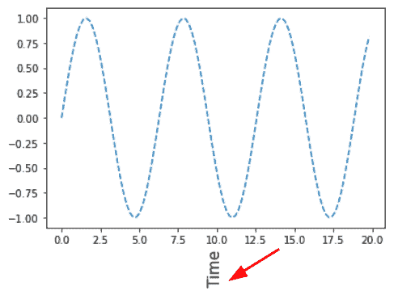
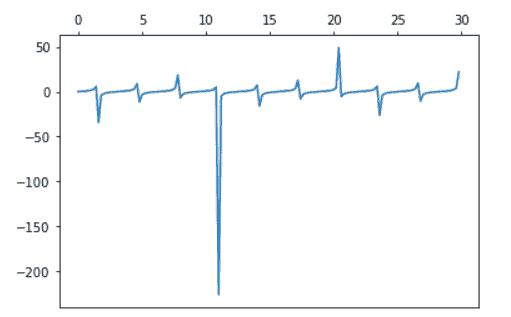
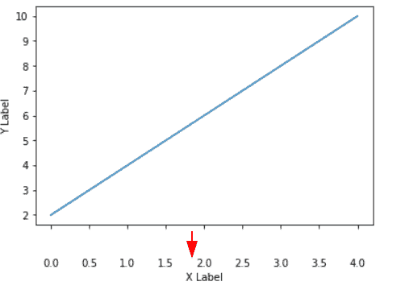
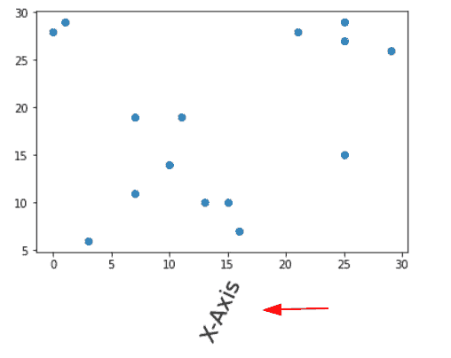

# Matplotlib x 轴标签

> 原文：<https://pythonguides.com/matplotlib-x-axis-label/>

[](https://sharepointsky.teachable.com/p/python-and-machine-learning-training-course)

在本 **Python 教程**中，我们将讨论 Python 中的 **Matplotlib x 轴标签**。在这里，我们将介绍使用 matplotlib 与 x 轴标签相关的不同示例。我们还将讨论以下主题:

*   Matplotlib x 轴标签
*   Matplotlib x 轴标签示例
*   Matplotlib x-axis label size
*   Matplotlib x 轴标签颜色
*   Matplotlib x 轴标签垂直
*   Matplotlib x 轴标签日期
*   Matplotlib x 轴标签间距
*   Matplotlib x-axis label bold
*   Matplotlib x 轴标签范围
*   Matplotlib x 轴标签移除
*   Matplotlib x 轴标签科学记数法
*   Matplotlib x 轴刻度标签
*   Matplotlib x 轴标签字符串
*   Matplotlib x 轴刻度标签大小
*   Matplotlib x 轴刻度标签颜色
*   Matplotlib x 轴标签子图
*   顶部的 Matplotlib x 轴标签
*   Matplotlib x 轴标签位置
*   Matplotlib x 轴标签重叠
*   Matplotlib 禁用 x 轴标签
*   Matplotlib 将 x 轴标签下移
*   Matplotlib x 轴标签频率
*   Matplotlib x 轴标签旋转
*   Matplotlib x 轴标签方向
*   Matplotlib 旋转 x 轴标签子图
*   Matplotlib 替换 x 轴标签
*   Matplotlib 减少 x 轴标签

目录

[](#)

*   [Matplotlib x 轴标签](#Matplotlib_x-axis_label "Matplotlib x-axis label")
*   [Matplotlib x 轴标签示例](#Matplotlib_x-axis_label_example "Matplotlib x-axis label example")
*   [Matplotlib x 轴标签尺寸](#Matplotlib_x-axis_label_size "Matplotlib x-axis label size")
*   [Matplotlib x 轴标签颜色](#Matplotlib_x-axis_label_color "Matplotlib x-axis label color")
*   [Matplotlib x 轴标签垂直](#Matplotlib_x-axis_label_vertical "Matplotlib x-axis label vertical")
*   [Matplotlib x 轴标签日期](#Matplotlib_x-axis_label_date "Matplotlib x-axis label date")
*   [Matplotlib x 轴标签间距](#Matplotlib_x-axis_label_spacing "Matplotlib x-axis label spacing")
*   [Matplotlib x 轴标签粗体](#Matplotlib_x-axis_label_bold "Matplotlib x-axis label bold")
*   [Matplotlib x 轴标签范围](#Matplotlib_x-axis_label_range "Matplotlib x-axis label range")
*   [Matplotlib x 轴标签移除](#Matplotlib_x-axis_label_remove "Matplotlib x-axis label remove")
*   [Matplotlib x 轴标签科学记数法](#Matplotlib_x-axis_label_scientific_notation "Matplotlib x-axis label scientific notation")
*   [Matplotlib x 轴刻度标签](#Matplotlib_x-axis_tick_label "Matplotlib x-axis tick label")
*   [Matplotlib x 轴标签串](#Matplotlib_x-axis_label_string "Matplotlib x-axis label string")
*   [Matplotlib x 轴刻度标签尺寸](#Matplotlib_x-axis_tick_label_size "Matplotlib x-axis tick label size")
*   [Matplotlib x 轴刻度标签颜色](#Matplotlib_x-axis_tick_label_color "Matplotlib x-axis tick label color")
*   [Matplotlib x 轴标签子图](#Matplotlib_x-axis_label_subplot "Matplotlib x-axis label subplot")
*   [顶部 Matplotlib x 轴标签](#Matplotlib_x-axis_label_on_top "Matplotlib x-axis label on top")
*   [Matplotlib x 轴标签位置](#Matplotlib_x-axis_label_position "Matplotlib x-axis label position")
*   [Matplotlib x 轴标签重叠](#Matplotlib_x-axis_label_overlap "Matplotlib x-axis label overlap")
*   [Matplotlib 禁用 x 轴标签](#Matplotlib_disable_x-axis_label "Matplotlib disable x-axis label")
*   [Matplotlib 下移 x 轴标签](#Matplotlib_move_x-axis_label_down "Matplotlib move x-axis label down")
*   [Matplotlib x 轴标签频率](#Matplotlib_x-axis_label_frequency "Matplotlib x-axis label frequency")
    *   [数字级滴答频率](#Figure-Level_Tick_Frequency "Figure-Level Tick Frequency")
    *   [轴级滴答频率](#Axis-Level_Tick_Frequency "Axis-Level Tick Frequency")
*   [Matplotlib x 轴标签旋转](#Matplotlib_x-axis_label_rotation "Matplotlib x-axis label rotation")
    *   [Matplotlib x 轴标签旋转使用 plt.xticks()](#Matplotlib_x_axis_label_rotation_by_using_pltxticks "Matplotlib x axis label rotation by using plt.xticks()")
    *   [Matplotlib x 轴标签旋转使用 ax.set_xticklabels()](#Matplotlib_x-axis_label_rotation_by_using_axset_xticklabels "Matplotlib x-axis label rotation by using ax.set_xticklabels()")
    *   [Matplotlib 使用 ax.tick_params()](#Matplotlib_x-axis_label_rotation_by_using_axtick_params "Matplotlib x-axis label rotation by using ax.tick_params()") 旋转 x 轴标签
*   [Matplotlib x 轴标签方向](#Matplotlib_x-axis_label_orientation "Matplotlib x-axis label orientation")
*   [Matplotlib 旋转 x 轴标签子图](#Matplotlib_rotate_x-axis_label_subplot "Matplotlib rotate x-axis label subplot")
*   [Matplotlib 替换 x 轴标签](#Matplotlib_replace_x-axis_label "Matplotlib replace x-axis label")
*   [Matplotlib 减少 x 轴标签](#Matplotlib_reduce_x-axis_label "Matplotlib reduce x-axis label")

## Matplotlib x 轴标签

在本节中，您将了解 Python 中的 [Matplotlib](https://pythonguides.com/what-is-matplotlib/) 中的 x 轴标签。开始之前，您必须先了解术语 **x 轴**和**标签**的含义:

> ***X 轴*** 是二维或三维图表的轴之一。基本上，它是图上水平穿过零点的一条线。

> ***标签*** 或者是代表坐标轴刻度的数字，或者是描述类别的文字。

**以下是向图表添加 x 轴标签的步骤:**

*   **导入库:**从 matplotlib 导入重要的库，如用于数据创建的 `Numpy` 和 `Pandas` 以及用于数据可视化的 `pyplot` 。
*   **定义数据:**定义将用于可视化数据的数据坐标。
*   **绘制图形或图表:**您可以使用 `plot()` 、 `bar()` 、 `scatter()` 等函数来绘制图形。
*   **添加 x 轴标签:**使用 `xlabel()` 方法添加一个 x 轴标签。
*   **生成图形:**要在用户屏幕上显示图形，使用 `show()` 方法。

**下面是添加 x 轴标签的语法:**

```py
matplotlib.pyplot.xlabel(xlabel, fontdict=None, labelpad=None, loc=None , **kwargs)
```

**以下是所使用的参数:**

*   **xlabel:** 表示标签的文本。
*   **labelpad:** 指定从轴的边界框开始的空间，以磅为单位，包括刻度和刻度标签。
*   **loc:** 指定标签的位置。
*   **kwargs:** 控制标签外观的文本属性。

另外，请阅读: [Matplotlib 散点图标记](https://pythonguides.com/matplotlib-scatter-marker/)

## Matplotlib x 轴标签示例

使用 matplotlib 中的 `xlabel()` 方法向绘图的 x 轴添加标签。

**我们来看一个例子:**

```py
**# Import Library**

import matplotlib.pyplot as plt

**# Define Data** 
x = [0, 1, 2, 3, 4]
y = [2, 4, 6, 8, 12]

**# Plotting**

plt.plot(x, y)

**# Add x-axis label**

plt.xlabel('X-axis Label')

**# Visualize**

plt.show() 
```

*   在上面的例子中，我们导入了 `matplotlib.pyplot` 包，并定义了绘图的数据坐标。
*   之后用 `plot()` 方法在 `y` 和 `x` 之间画一条线。
*   `xlabel()` 方法用于设置 x 轴标签。
*   `show()` 函数用于显示图形。


plt.xlabel()

阅读: [Matplotlib 虚线](https://pythonguides.com/matplotlib-dashed-line/)

## Matplotlib x 轴标签尺寸

我们将看看如何使 x 轴标签字体变大。为了改变大小，将参数 `fontsize` 传递给 `xlabel()` 方法。

**以下是改变 x 轴标签大小的语法:**

```py
matplotlib.pyplot.xlabel(xlabel, fontsize)
```

标签文本由 `xlabel` 设置，而字体大小由 `fontsize` 指定。

**举例:**

```py
**# Import Library** 
import matplotlib.pyplot as plt

**# Define Data**

x = [0, 1, 2, 3, 4]
y = [2, 10, 6, 5, 12]

**# Plotting**

plt.plot(x, y, '--')

**# Add x-axis label** 
plt.xlabel('X-axis Label', fontsize=20)

**# Visualize**

plt.show() 
```

在上面的例子中， `fontsize` 参数被传递给 `xlabel()` 方法来调整 x 轴标签的大小。我们给它赋值 `20` 。


plt.xlabel(fontsize=20)

阅读: [Matplotlib plot_date](https://pythonguides.com/matplotlib-plot-date/)

## Matplotlib x 轴标签颜色

在这一节中，我们将学习如何修改 x 轴标签的颜色。我们使用 `color` 参数来定制它的颜色。

**我们来看一个例子:**

```py
**# Import Library** 
import matplotlib.pyplot as plt

**# Define Data** 
x = [0, 1, 2, 3, 4]
y = [2, 10, 6, 5, 12]

**# Plotting** 
plt.plot(x, y, '--')

**# Add x-axis label** 
plt.xlabel('X-axis Label', fontsize=15, color='r')

**# Visualize** 
plt.show() 
```

为了改变 x 轴标签的颜色，我们将一个**颜色**参数传递给上面例子中的 `xlabel()` 方法。我们已经把颜色改成了**红色**。


plt.xlabel(color=None)

读取: [Matplotlib 日志日志图](https://pythonguides.com/matplotlib-log-log-plot/)

## Matplotlib x 轴标签垂直

在本节中，我们将学习如何使 x 轴标签垂直。**旋转**参数用于垂直定位标签。

**下面是垂直设置 x 轴标签的语法:**

```py
matplotlib.pyplot.xlabel(xlabel, rotation='vertical')
```

**举例:**

```py
**# Import Library**

import matplotlib.pyplot as plt
import numpy as np

**# Define Data**

x = np.arange(0, 20, 0.2)
y = np.sin(x)

**# Plotting** 
plt.plot(x, y, '--')

**# Add x-axis label** 
plt.xlabel('Time', size = 15, rotation='vertical')

**# Visualize** 
plt.show()
```

在上例中，将**旋转**参数的值设置为**垂直**。x 轴标签将沿垂直方向旋转。



plt.xlabel(rotation=’vertical’)

阅读: [Matplotlib 支线剧情 _adjust](https://pythonguides.com/matplotlib-subplots_adjust/)

## Matplotlib x 轴标签日期

我们将学习如何在 x 轴上添加一个日期作为标签。

**我们来看一个例子:**

```py
**# Import Libraries** 
import pandas as pd
from datetime import datetime, timedelta
from matplotlib import pyplot as plt
from matplotlib import dates as mpl_dates

**# Define Data** 
dates = [
          datetime(2021, 10, 21),
          datetime(2021, 7, 24),
          datetime(2021, 8, 25),
          datetime(2021, 10, 26),
]

y = [ 0, 1, 2, 3]

**# Plotting** 
plt.plot_date(dates, y)

**# Avoid overlapping** 
plt.gcf().autofmt_xdate()

**# Visualize** 
plt.show()
```

在上面的示例中，plot `date()` 方法用于绘制日期图。这里使用 `autofmt xdate()` 函数自动调整由日期组成的 x 轴。


autofmt_xdate()

## Matplotlib x 轴标签间距

在这一节中，我们将学习如何在 x 轴标签之间添加空间。为了添加空格， `labelpad` 参数被传递给 `xlabel()` 方法。

**以下是语法:**

```py
matplotlib.pyplot.xlabel(xlabel, labelpad=None)
```

**我们来看一个例子:**

```py
**# Import Library** 
import matplotlib.pyplot as plt
import numpy as np

**# Define Data** 
x = np.arange(0, 30, 0.5)
y = np.cos(x)

**# Plotting** 
plt.plot(x, y, '--')

**# Label spacing** 
plt.xlabel('X-Axis')

                   **# OR**

plt.xlabel('X-Axis', labelpad=30)

                   **# OR**

plt.xlabel('X-Axis', labelpad=60)

**# Visualize** 
plt.show()
```

为了提供间距，我们将 `labelpad` 参数传递给上面示例中的 `xlabel()` 方法。


plt.xlabel(xlabel)


plt.xlabel(xlabel, labelpad=30)


plt.xlabel(xlabel, labelpad=60)

阅读: [Matplotlib 最佳拟合线](https://pythonguides.com/matplotlib-best-fit-line/)

## Matplotlib x 轴标签粗体

在本主题中，我们将学习如何将 x 轴标签加粗。将 `fontweight` 参数传递给 `xlabel()` 函数，使标签加粗。

**以下是语法:**

```py
matplotlib.pyplot.xlabel(xlabel, fontweight='bold')
```

**我们来看一个例子:**

```py
**# Import Library** 
import matplotlib.pyplot as plt

**# Define Data** 
x = [0, 1, 2, 3, 4]
y = [2, 10, 6, 9, 8.5]

**# Plotting** 
plt.plot(x, y, '--')

**# Bold x-axis label** 
plt.xlabel('X-Axis Label', fontweight='bold')

**# Visualize** 
plt.show() 
```

*   我们在上面的例子中导入了 `matplotlib.pyplot` 包。
*   下一步是定义数据和创建图表。
*   `plt.xlabel()` 方法用来创建一个 x 轴标签，用 `fontweight` 参数我们把标签**加粗**。


plt.xlabel(fontweight=’bold’)

阅读: [Matplotlib 支线剧情教程](https://pythonguides.com/matplotlib-subplot-tutorial/)

## Matplotlib x 轴标签范围

在这一节中，我们将学习如何限制图的 x 轴的范围。 `xlim()` 方法用于设置 x 轴极限。

**以下是语法:**

```py
matplotlib.pyplot.xlim(limit_range)
```

**让我们以设置 x 轴标签范围为例:**

```py
**# Import Library** 
import matplotlib.pyplot as plt
import numpy as np

**# Define Data** 
x = np.arange(0, 30, 0.5)
y = np.cos(x)

**# Plotting** 
plt.plot(x, y)

**# Add x-axis label** 
plt.xlabel('X-Axis')

**# x-axis limit** 
plt.xlim(-2.5, 6)

**# Display**

plt.show()
```

*   在上面的例子中，我们导入了 `matplotlib.pyplot` 和 `numpy` 库。
*   接下来，我们使用 `arange()` 和 `cos()` 函数来定义数据。
*   要绘制图形，请使用 `plt.plot()` 方法。
*   要给 x 轴添加标签，使用 `plt.xlabel()` 方法。
*   使用 `plt.xlim()` 方法设置 x 轴范围。在这种情况下，我们将其从 `-2.5` 更改为 `6` 。


Normal x-axis


plt.xlim()

阅读: [Matplotlib 绘图条形图](https://pythonguides.com/matplotlib-plot-bar-chart/)

## Matplotlib x 轴标签移除

我们将在这一部分学习如何去掉 x 轴标签。我们移除整个 x 轴标签，包括文本标签、刻度标签和刻度标记。

我们必须调用 `set_visible()` 方法，并将其值设置为 `False` 来移除 x 轴标签。

**以下是移除 x 轴标签的语法:**

```py
matplotlib.axes.Axes.get_xaxis().set_visible(False)
```

**举例:**

```py
**# Import Library** 
import matplotlib.pyplot as plt

**# Create Figure and Axes** 
fig,ax = plt.subplots(1)

**# Define Data** 
x = np.arange(0, 30, 0.5)
y = np.cos(x)

**# Make your plot** 
ax.plot(x, y)

**# Add labels
**        
ax.set_xlabel('X Label')        
ax.set_ylabel('Y Label')

**# Remove X label** 
plt.gca().axes.get_xaxis().set_visible(False)

**# Display
**        
plt.show()
```

*   为了设置 **x 轴**和 **y 轴**标签，我们使用上面例子中的 `ax.set_xlabel()` 和 `ax.set_ylabel()` 方法。
*   然后使用 `plt.gca()` 方法检索当前轴。
*   然后使用 `axes.get_xaxis()` 方法获得 x 轴。
*   然后，为了移除 x 轴标签，我们使用 `set_visible()` 并将其值设置为 `False` 。


*” Remove x-axis labels “*

## Matplotlib x 轴标签科学记数法

在本主题中，我们将学习如何用科学记数法格式化 x 轴。

> ***【科学记数法】*** 指以倍数为数显示。

科学记数法没有加号作为乘数。

方法用于将 x 轴转换为科学记数法。

**以下是语法:**

```py
matplotlib.pyplot.ticklabel_format(axis=None, style="", scilimits=None)
```

**以下是所使用的参数:**

*   **轴:**指定轴。
*   **样式:**表示轴的样式。
*   **scilimits:** 指定刻度的界限

**我们来看一个例子:**

```py
**# Import Library** 
import matplotlib.pyplot as plt

**# Define Data** 
x = [1000, 2000, 3000]
y = [3000, 4000, 5000]

**# Plot**

plt.plot(x, y)

**# Scientific Notation** 
plt.ticklabel_format(axis="x", style="sci", scilimits=(0,0))

**# Display**

plt.show()
```

为了将 x 轴刻度转换为科学记数法，我们使用了 `ticklabel_format()` 方法，并将**轴**作为 `x` 传递，将**样式**作为**科学记数法**传递。


*” Scientific Notation X-axis “*

阅读:[什么是 matplotlib 内联](https://pythonguides.com/what-is-matplotlib-inline/)

## Matplotlib x 轴刻度标签

我们将向您展示如何在您选择的 x 轴上添加刻度标签。

> ***刻度标签*** 是坐标轴上表示数据点的标记。

**要添加刻度标签，请使用以下语法:**

```py
matplotlib.axes.Axes.set_xticklabels(self,xlabel,fontdict=None,labelpad=None)
```

**以下是所使用的参数:**

*   **xlabel:** 指定标签文本。
*   **fontdict:** 字体样式字典。
*   **labelpad:** 点与点之间的空间。

**我们来看一个例子:**

```py
**# Import Library** 
import matplotlib.pyplot as plt
import numpy as np

**# Define data** 
x = [1, 2, 3, 4, 5]
y = [2.5, 0.6, 4.9, 3, 6]

**# Create subplot** 
ax = plt.subplot()

**# Define tick label** 
ax.set_xticklabels([2, 4, 6, 8, 10])

**# Display graph** 
plt.show()
```

*   在上面的例子中，我们导入了 `matplotlib.pyplot` 和 `numpy` 库。
*   然后，为了可视化，我们定义数据坐标。
*   然后使用 `plt.subplot()` 方法来构建子情节。
*   然后使用 `set_xticklabels()` 方法来定义 x 刻度标签。

**输出:**


*” By default x-axis tick labels “*

当我们不指定刻度标签时，我们得到如上所示的输出。


set_ticklabels()

当我们选择刻度标签时，我们得到上面显示的输出。

## Matplotlib x 轴标签串

我们将学习如何使用字符串来设置 x 轴标签或刻度标记。构建了程序员和语言之间的图形。

**我们来看一个例子:**

```py
**# Import Library** 
import matplotlib.pyplot as plt

**# Define Data** 
programmers = [5, 6, 2, 3]
languages = ["Python", "Java", "C++", "C" ]

**# Plot chart** 
plt.plot( languages, programmers, color= 'r', marker= 'o')

**# Display chart** 
plt.show()
```

*   在上面的例子中，我们通过将 x 轴标签放在**引号**中来定义**字符串形式**的 x 轴标签。
*   我们使用**双引号**来定义**不同的语言**，以便它们可以用字符串格式表示。
*   之后，我们使用 `plt.plot()` 方法绘制一个图形，传递**颜色**和**标记**作为参数，并分别给它们赋值**红色**和 `o` 。


*“String Labels”*

阅读: [Python 使用 Matplotlib 绘制多条线](https://pythonguides.com/python-plot-multiple-lines/)

## Matplotlib x 轴刻度标签尺寸

数据轴标签(通常称为刻度标签)的大小可以更改。我们只需要传递 `fontsize` 参数并设置它的值。

**要修改 x 刻度标签的大小，请使用以下语法:**

```py
matplotlib.pyplot.xticks(fontsize=)
```

**我们来看一个例子:**

```py
**# Import Library** 
import matplotlib.pyplot as plt

**# Define Data** 
students = [6, 15, 8, 10]
color = ["Red", "Black", "White", "Blue"]

**# Plot sactter chart** 
plt.scatter(color, students, marker='*', color='g', s=50)

**# Fontsize of tick labels** 
plt.xticks(fontsize=15)

**# Labels** 
plt.xlabel("Favourite color")
plt.ylabel("No.of.students")    

**# Display chart** 
plt.show()
```

*   我们在上面的例子中导入了 `matplotlib.pyplot` 包。
*   接下来，我们定义将要绘制的数据。
*   使用 `plt.scatter()` 方法绘制散点图，使用参数**标记**、**颜色**和 `s` 分别设置**标记样式**、**颜色**和**大小**。
*   使用 `plt.xticks()` 方法绘制刻度标签，将 `fontsize` 参数调整为 `15` 来改变字体大小。
*   要在 x 轴和 y 轴上设置标签，请使用 `plt.xlabel()` 和 `plt.ylabel()` 方法。


plt.xticks(fontsize=15)

## Matplotlib x 轴刻度标签颜色

在本节中，我们将学习如何修改 x 轴上刻度标签的颜色。要改变颜色，使用带有**颜色**参数的 `xticks()` 方法。

**下面是改变 x 记号颜色的语法:**

```py
matplotlib.pyplot.xticks(color=None)
```

**我们来看一个例子:**

```py
**# Import Library**

import matplotlib.pyplot as plt
import numpy as np

**# Define Data**

x = np.arange(0, 30, 0.5)
y = np.tan(x)

**# Plotting** 
plt.plot(x, y)

**# Change color of xticks** 
plt.xticks(color='r')

**# Visualize**

plt.show()
```

*   在上面的例子中，我们使用 numpy 的 `arange()` 和 `tan()` 方法来定义数据并在它们之间绘制图形。
*   为了修改刻度的颜色，我们使用 `plt.xticks()` 并传递一个**颜色**参数。在这种情况下，xticks 的颜色设置为**红色**。


plt.xticks(color=’red’)

阅读: [Matplotlib 标题字体大小](https://pythonguides.com/matplotlib-title-font-size/)

## Matplotlib x 轴标签子图

我们将在这里学习如何给子情节添加 x 轴标签。为了给 x 轴添加标签，我们使用了 `set_xlabel()` 方法。

**以下是向 x 轴添加标签的语法:**

```py
matplotlib.axes.Axes.set_xlabel()
```

**举例:**

```py
**# Import Library**

import matplotlib.pyplot as plt

**# Define Data**

x1= [0.2, 0.4, 0.6, 0.8, 1]
y1= [0.3, 0.6, 0.8, 0.9, 1.5]

x2= [2, 6, 7, 9, 10]
y2= [3, 4, 6, 9, 12]

x3= [5, 8, 12]
y3= [3, 6, 9]

x4= [7, 8, 15]
y4= [6, 12, 18]

**# Add subplots**

fig, ax = plt.subplots(2, 2)

**# Add labels at x-axis** 
ax[0, 0].set_xlabel('Subplot 1')
ax[0, 1].set_xlabel('Subplot 2')
ax[1, 0].set_xlabel('Subplot 3')
ax[1, 1].set_xlabel('Subplot 4')

**# Plot graph**

ax[0, 0].plot(x1, y1)
ax[0, 1].plot(x2, y2)
ax[1, 0].plot(x3, y3)
ax[1, 1].plot(x4, y4)

**# Display Graph**

fig.tight_layout()
plt.show() 
```

*   我们在一个图形区域中绘制了多个图，并希望在上面的示例中向 x 轴添加一个标签。
*   为了添加标签，我们使用了 `set_xlabel()` 方法。


set_xlabel()

## 顶部 Matplotlib x 轴标签

我们将学习如何将 x 轴标签或 x 轴刻度线放在图表的顶部，而不是底部。

默认情况下，将在左侧和底部轴上添加刻度和刻度标签。我们可以在 matplotlib 中独立地打开和关闭标签。

**下面是在顶部添加标签的语法:**

```py
**# Tick Marker**
matplotlib.axes.Axes.tick_params(bottom=True, top=False, left=True, right=False)

**# Tick Label**
matplotlib.axes.Axes.tick_params(labelbottom=True, labeltop=False, labelleft=True, labelright=False) 
```

以下是布尔参数:

*   **底部:**指定是否显示底部刻度。
*   **顶部:**指定顶部刻度是否显示。
*   **右:**指定是否显示右刻度。
*   **左侧:**指定是否显示左侧刻度。
*   **标签底部:**指定刻度标签是否显示在底部。
*   **标签顶部:**指定刻度标签是否显示在顶部。
*   **labelleft:** 指定刻度标签是否显示在左侧。
*   **标签右侧:**指定刻度标签是否显示在右侧。

**我们来看一个例子:**

```py
**# Import Library**

import matplotlib.pyplot as plt
import numpy as np

**# Define Data** 
x = np.arange(0, 30, 0.2)
y = np.tan(x)

**# Add subplot**

ax = plt.subplot()

**# Plotting** 
plt.plot(x, y)

**# Xlabel on top**

ax.tick_params(top=True, bottom=False)
ax.tick_params(labeltop=True, labelbottom=False)

**# Visualize**

plt.show()
```

*   我们在上面的代码中导入了 `matplotlib.pyplot` 和 `numpy` 库。
*   接下来，我们使用 `arange()` 和 numpy 的 `tan()` 方法指定数据，然后使用 `plot()` 方法绘制图形。
*   要添加刻度和刻度标签，请使用 `ax.tick_params()` 方法。
*   为了**打开轴的**顶部**上的**刻度和**关闭轴的**底部**上的**刻度，我们传递**顶部**和**底部**作为参数。为了**在轴的**顶部**显示刻度标签**并且**从轴的**底部**隐藏刻度标签**，我们必须传递**标签顶部**和**标签底部**作为参数。



ax.tick_params()

阅读: [Matplotlib 默认图形尺寸](https://pythonguides.com/matplotlib-default-figure-size/)

## Matplotlib x 轴标签位置

在本主题中，我们将学习如何将 x 轴标签移动到不同的位置。

**以下是语法:**

```py
matplotlib.axes.Axes.set_xlabel(label, loc='None')
```

**我们来看一个例子:**

```py
**# Import Library** 
import matplotlib.pyplot as plt

**# Define Data** 
x1= [0.2, 0.4, 0.6, 0.8, 1]
y1= [0.3, 0.6, 0.8, 0.9, 1.5]

**# Add subplots** 
fig, ax = plt.subplots()

**# Add labels at x-axis at different locations**

ax.set_xlabel('X-Axis')

                **# OR**

ax.set_xlabel('X-Axis', loc='right')

                **#OR**

ax.set_xlabel('X-axis', loc='left')

**# Plot graph** 
ax.plot(x1, y1)

**# Display Graph** 
plt.show() 
```

在上面的例子中，我们使用 `set_xlabel()` 方法向 x 轴添加一个标签，我们将 `loc` 作为参数传递，并将其值设置为 `left` 和 `right` 。


By default loc=’center’


loc=’right’


loc=’left’

## Matplotlib x 轴标签重叠

在这一节中，我们将看看 x 轴标签开始重叠的情况。因此，我们必须设置 x 轴的格式，以使图表看起来整洁。

让我们看看下面的例子:

```py
**# Import Library** 
import matplotlib.pyplot as plt

**# Define Data** 
x = ['I am the Label 1', "I am the Label 2", "I am the Label 3", "I am the Label 4", "I am the Label 5", "I am the Label 6"]

y = [2, 4, 5, 6, 7.5, 3.8]

**# Plot chart** 
plt.plot(x, y)

**# Display Chart** 
plt.show()
```


*“X-axis Label Overlap Each Other”*

在 matplotlib 中，我们有一个方法 `setp()` 用于设置刻度标签的旋转和对齐属性，以避免重叠。

**setp()方法的语法如下:**

```py
matplotlib.pyplot.setp(object, **kwargs)
```

**让我们来看一个去除重叠的例子:**

```py
**# Import Library** 
import matplotlib.pyplot as plt

**# Define Data** 
x = ['I am the Label 1', "I am the Label 2", "I am the Label 3", "I am the Label 4", "I am the Label 5", "I am the Label 6"]

y = [2, 4, 5, 6, 7.5, 3.8]

**# Plot chart** 
ax= plt.subplot()
plt.plot(x, y)

**# Function to avoid overlapping** 
plt.setp(ax.get_xticklabels(), rotation=30, ha='right')

**# Display Chart** 
plt.show()
```

为了获得 ticklabels，我们使用了 `plt.setp()` 和 `get.xticklabels()` 函数，并将**旋转**和 `ha` 参数传递给该函数，分别将它们的值设置为 `30` 和**右**。


*“X-axis Without Overlapping”*

读取: [Matplotlib savefig 空白图像](https://pythonguides.com/matplotlib-savefig-blank-image/)

## Matplotlib 禁用 x 轴标签

在本教程中，我们将了解如何在 Matplotlib 中从 x 轴移除标签。默认情况下，标签显示在 matplotlib 中绘图的左轴和底轴上。

我们必须调用 `tick_params()` 方法从 x 轴上移除标签，或者我们可以说从轴的底部移除标签。

**禁用 x 轴标签的语法如下:**

```py
matplotlib.axes.Axes.tick_params(bottom=False, labelbottom=False)
```

**底部**和**标签底部**都被赋予了**假**布尔值。因此，x 轴上的刻度和刻度标签被禁用。但是，x 轴标签仍然保留。

**举例:**

```py
**# Import Library** 
import matplotlib.pyplot as plt
import numpy as np

**# Create Figure and Axes** 
fig,ax = plt.subplots()

**# Define Data** 
x = np.arange(0, 30, 0.5)
y = np.cos(x)

**# Make your plot** 
ax.plot(x, y)

**# Add labels
**        
ax.set_xlabel('X Label')        
ax.set_ylabel('Y Label')

**# Disabel X label** 
ax.tick_params(bottom=False, labelbottom=False)

**# Show**

plt.show()
```

*   在上面的例子中， `plot()` 方法用于创建一个图表。
*   之后，我们使用 `set_xlabel()` 和 `set_ylabel()` 方法在两个轴上创建标签。
*   我们使用 `tick_params()` 方法从绘图的 x 轴上移除**刻度**和**刻度标签**。我们将 `bottom` 和 `labelbottom` 参数传递给函数，并将它们的布尔值设为 `False` 。


tick_params(bottom=False, labelbottom=False)

阅读: [Matplotlib 条形图标签](https://pythonguides.com/matplotlib-bar-chart-labels/)

## Matplotlib 下移 x 轴标签

在本主题中，我们将学习如何沿 x 轴移动 x 轴标签和刻度标签。我们使用带有 `labelpad` 参数的 `xlabel()` 函数来移动标签，使用带有 `pad` 参数的 `tick_params()` 方法来移动 ticklabels。

要向下移动，必须传递一个正整数值；否则，它将开始向上移动。

**语法如下:**

```py
**# To move labels** 
plt.xlabel(xlabel, labelpad=20)
            `OR`
ax.xaxis.labelpad=20

**# To move ticklabels**

ax.tick_params(pad=20)
```

**我们来看例子:**

**例#1**

```py
**# Import Library** 
import matplotlib.pyplot as plt

**# Add subplots** 
fig, ax = plt.subplots()

**# Define Data** 
x= [0.2, 0.4, 0.6, 0.8, 1]
y= [0.3, 0.6, 0.8, 0.9, 1.5]

**# Plot graph** 
ax.plot(x, y)

**# Add labels
**        
ax.set_xlabel('X Label')        
ax.set_ylabel('Y Label')

**# Move label downwards** 
ax.xaxis.labelpad=30

**# Display Graph** 
plt.show() 
```

为了在上面的例子中向下移动标签，我们使用了值为 `30` 的 `ax.xaxis.labelpad` 。


labelpad=30

**例 2**

```py
**# Import Library**

import matplotlib.pyplot as plt
import numpy as np

**# Define Data**

x = np.arange(0, 30, 0.5)
y = np.sin(x)

**# Plotting** 
plt.plot(x, y)

**# Move label downwards** 
plt.xlabel('X-Axis', labelpad=30)

**# Visualize**

plt.show()
```

我们在上面的例子中使用 `labelpad` 参数向下移动标签，并将其传递给 `xlabel()` 方法。其值已被设置为 `30` 。


labelpad=30

**例 3**

```py
**# Import Library**

import matplotlib.pyplot as plt

**# Add subplots** 
fig, ax = plt.subplots()

**# Define Data**

x= [0, 1, 2, 3, 4]
y= [2, 4, 6, 8, 10 ]

**# Plot graph**

plt.plot(x,y)

**# Add labels**

ax.set_xlabel('X Label')        
ax.set_ylabel('Y Label')

**# Move ticklabel downwards**

ax.tick_params(axis='x',pad=30)

**# Display Graph** 
plt.show()
```

在上面的例子中， `tick_params()` 方法用于向下移动刻度标签。我们将**轴**和**垫**的值分别设置为 `x` 和 `30` 作为参数。



tick_params(axis=x, pad=30)

阅读:[在 Python 中添加文本到 plot matplotlib](https://pythonguides.com/add-text-to-plot-matplotlib/)

## Matplotlib x 轴标签频率

在本用户指南中，我们将了解如何在图形和轴级别修改 matplotlib 中的刻度频率。

### 数字级滴答频率

要调整图形级别的刻度频率，调用 `xticks()` 函数，并将刻度数组作为参数传递。该数组在 X 轴上从 `0` 开始，在最大值 `x` 结束，在 X 轴上每 `3` 步有一个刻度。

**举例:**

```py
**# Import Library**

import matplotlib.pyplot as plt
import numpy as np

**# Define Data**

x = np.random.randint(low=0, high=30, size=15)
y = np.random.randint(low=0, high=30, size=15)

**# Scatter Plot** 
plt.scatter(x,y)

**# Tick frequency** 
plt.xticks(np.arange(0, max(x), 3))

**# Show**

plt.show()
```


“X-axis Tick Frequency”

### 轴级滴答频率

如果在一个图形区域中有多个图，我们希望在轴级别上调整刻度频率。为了分别调整两个轴的节拍频率，我们使用了 `set_xticks()` 函数。

```py
**# Import Library** 
import matplotlib.pyplot as plt
import numpy as np

**# Create figure and subplot** 
fig = plt.figure(figsize=(12, 6))
ax = fig.add_subplot(121)
ax1 = fig.add_subplot(122)

**# Define Data** 
x = np.random.randint(low=0, high=30, size=15)
y = np.random.randint(low=0, high=30, size=15)

**# Scatter Plot** 
ax.scatter(x,y)
ax1.scatter(x,y)

**# Tick Frequency** 
ax.set_xticks(np.arange(0, max(x), 3))
ax1.set_xticks(np.arange(0, max(y), 10))

**# Show** 
plt.show()
```

*   在上面的例子中，我们导入了 `matplotlib.pyplot` 和 `numpy` 库。
*   接下来，我们使用 `figure()` 和 `add_subplot()` 函数分别构建一个人物和一个子情节。
*   然后我们用 random 来定义数据 `randint()` 是一个返回随机数的方法。
*   要创建散点图，请使用 `scatter()` 方法。
*   `set_xticks()` 方法用于控制滴答的频率。该数组在**副剧情 1** 上以每 3 步一个刻度从 0 开始，在 x 的最大值处结束，而在**副剧情 2** 上以每 10 步一个刻度从 0 开始，在 x 的最大值处结束。


set_xticks()

读取: [Matplotlib 绘图误差线](https://pythonguides.com/matplotlib-plot-error-bars/)

## Matplotlib x 轴标签旋转

我们学习如何在 matplotlib 中旋转 x 轴标签。我们可以选择任何角度放置标签。

**可以使用多种功能旋转 x 轴标签:**

*   通过使用 plt.xticks()
*   通过使用 ax.set_xticklabels()
*   通过使用 ax.tick_params()

### Matplotlib x 轴标签旋转使用 plt.xticks()

要在 **15 度**旋转 x 轴刻度标签，我们使用带有 matplotlib 中旋转参数的 `plt.xticks()` 方法。

**举例:**

```py
**# Import Library**

import matplotlib.pyplot as plt

**# Define Data**

x= [0, 1, 2, 3, 4]
y= [2, 4, 6, 8, 10 ]

**# Plot graph**

plt.plot(x,y)

**# Rotation**

plt.xticks(rotation=30)

**# Display Graph**

plt.show()
```


plt.xticks(rotation=30)

### Matplotlib x 轴标签旋转使用 ax.set_xticklabels()

为了旋转 x 轴标签，我们使用了 `ax.set_xticklabels()` 方法，并将**旋转**和**标签**作为参数传递。

```py
**# Import Library**

import matplotlib.pyplot as plt

**# Create subplot**

ax = plt.subplot()

**# Define Data**

students = [6, 15, 8, 10]
color = ["Red", "Black", "White", "Blue"]

**# Plot scatter chart**

plt.scatter(color, students, marker='*', color='g', s=50)

**# labels**

plt.xlabel("Favourite color")
plt.ylabel("No.of.students") 

**# Rotation** 
ax.set_xticklabels(color, rotation=45)

**# Display chart**

plt.show()
```


ax.set_xticklabels(color, rotation=45)

### Matplotlib 使用 ax.tick_params() 旋转 x 轴标签

为了旋转标签，我们使用 `ax.tick_params()` 函数，将**轴**和**标签旋转**作为参数传递，并将它们的值分别设置为 `x` 和 `65` 度。

**举例:**

```py
**# Import Library**

import matplotlib.pyplot as plt

**# Create subplot**

ax = plt.subplot()

**# Define Data**

students = [6, 15, 8, 10]
color = ["Red", "Black", "White", "Blue"]

**# Plot scatter chart** 
plt.scatter(color, students, marker='*', color='g', s=50)

**# labels**

plt.xlabel("Favourite color")
plt.ylabel("No.of.students") 

**# Rotation**

ax.tick_params(axis='x', labelrotation=180)

**# Display chart** 
plt.show()
```


ax.tick_params(axis=’x’, labelrotation=180)

读取: [Matplotlib 移除刻度标签](https://pythonguides.com/matplotlib-remove-tick-labels/)

## Matplotlib x 轴标签方向

本节将讨论 x 轴标签方向。方向选项允许您以您喜欢的任何角度旋转 x 轴标签。将**旋转**参数传递给 `plt.xlabel()` 方法来旋转标签。

**举例:**

```py
**# Import Library** 
import matplotlib.pyplot as plt
import numpy as np

**# Define Data** 
x = np.random.randint(low=0, high=30, size=15)
y = np.random.randint(low=0, high=30, size=15)

**# Scatter Plot** 
plt.scatter(x,y)

**# Rotate** 
plt.xlabel('X-Axis', rotation=65, size=20)

**# Show** 
plt.show()
```

*   在上面的例子中，我们使用 `random.randint()` 方法定义数据，使用 `scatter()` 方法在散点图中绘制数据。
*   `plt.xlabel()` 方法用于向 x 轴添加标签，或者我们可以说是描述性标签，并且将**旋转**参数传递给该方法以调整 x 轴标签的方向。



“X Label at 65 Degrees”

阅读: [Matplotlib 旋转刻度标签](https://pythonguides.com/matplotlib-rotate-tick-labels/)

## Matplotlib 旋转 x 轴标签子图

如果我们有多个支线剧情，我们将探索如何旋转特定支线剧情的 x 轴标签。

**我们来看一个例子:**

```py
**# Import Library** 
import matplotlib.pyplot as plt

**# Define Data** 
x1= [0.2, 0.4, 0.6, 0.8, 1]
y1= [0.3, 0.6, 0.8, 0.9, 1.5]

x2= [2, 6, 7, 9, 10]
y2= [3, 4, 6, 9, 12]

x3= [5, 8, 12]
y3= [3, 6, 9]

x4= [7, 8, 15]
y4= [6, 12, 18]

**# Add subplots** 
fig, ax = plt.subplots(2, 2)

**# Plot graph** 
ax[0, 0].plot(x1, y1)
ax[0, 1].plot(x2, y2)
ax[1, 0].plot(x3, y3)
ax[1, 1].plot(x4, y4)

**# Add labels at x-axis** 
ax[0, 0].set_xlabel('Subplot 1', rotation=15)
ax[0, 1].set_xlabel('Subplot 2')
ax[1, 0].set_xlabel('Subplot 3')
ax[1, 1].set_xlabel('Subplot 4')

**# Rotate x ticks** 
ax[1, 1].set_xticklabels(ax[1, 1].get_xticks(), rotation=45)

**# Display Graph** 
fig.tight_layout()
plt.show() 
```

*   为了旋转 x 轴标签，我们使用了 `set_xlabel()` 方法，并将参数 `xlabel` 和 `rotation` 传递给函数。
*   `set_xticklabels()` 函数也用于旋转 x 轴上的刻度标签。我们使用 `get_xticks()` 方法来获取 x 轴上的记号，并使用 `rotation` 参数来旋转记号标签。


*” Rotation of labels and tick labels “*

## Matplotlib 替换 x 轴标签

在本教程中，我们将学习如何将默认的 x 轴刻度标签更改为我们自己的标签。

**举例:**

在本例中，我们将使用我们选择的标签替换特定的 xticklabel。我们通过调用 `set_xticklabels()` 方法并向其传递新的刻度标签来实现这一点。

```py
**# Import Library** 
import matplotlib.pyplot as plt
import numpy as np

**# Create subplot** 
fig, ax = plt.subplots()
fig.canvas.draw()

**# Define Data** 
x = np.random.randint(low=0, high=30, size=15)
y = np.random.randint(low=0, high=30, size=15)

**# Scatter Plot** 
plt.scatter(x,y)

**# Replace** 
labels[2] = 'Change'
ax.set_xticklabels(labels)

**# Show** 
plt.show()
```

*   在上面的例子中，我们使用 `random.randint()` 函数来定义数据，使用 `scatter()` 方法来绘制它们之间的图形。
*   然后使用 `set_xticklabels()` 方法来替换特定的标签。


*” Replace x-axis tick labels “*

阅读:[将图例放在绘图 matplotlib 之外](https://pythonguides.com/put-legend-outside-plot-matplotlib/)

## Matplotlib 减少 x 轴标签

要减少轴上的 xticks 数量，请使用 matplotlib 中的 `locator_params()` 方法。

**以下是语法:**

```py
matplotlib.pyplot.locator_params(axis=, nbins=)
```

**以下是所使用的参数:**

*   **轴:**指定是 x 轴还是 y 轴。
*   **nbins:** 指定刻度数。

**我们来看一个例子:**

```py
**# Import Library** 
import matplotlib.pyplot as plt
import numpy as np

**# Define Data** 
x = np.arange(0, 40, 0.5)
y = np.tan(x)

**# Plotting** 
plt.plot(x, y)

**# Add x-axis label** 
plt.xlabel('X-Axis')
plt.ylabel('Y-Axis')

**# Reduce xtick label** 
plt.locator_params(axis="x", nbins=5)

**# Visualize** 
plt.show()
```

*   在上面的例子中，我们导入了 `matplotlib.pyplot` 和 `numpy` 库。
*   之后，我们使用 `arange()` 和 `tan()` 函数来定义数据。
*   要绘制 x 和 y 数据坐标之间的图形，使用 `plt.plot()` 方法。
*   `xlabel()` 和 `ylabel()` 函数用于给轴添加标签。
*   要减少 x 轴标签，请使用 `plt.locator_params()` 方法。我们分别设置**轴**和 `nbins` 到 `x` 和 `5` 的值作为参数。


*” Default number of xticks “*


” Reduce the *number of sticks “*

另外，看看 Matplotlib 上的更多教程。

*   [Matplotlib 饼图教程](https://pythonguides.com/matplotlib-pie-chart/)
*   [Matplotlib 辅助 y 轴](https://pythonguides.com/matplotlib-secondary-y-axis/)

因此，在本 Python 教程中，我们已经讨论了**“Matplotlib x 轴标签”**，并且我们还涵盖了一些与之相关的示例。这些是我们在本教程中讨论过的以下主题。

*   Matplotlib x 轴标签
*   Matplotlib x 轴标签示例
*   Matplotlib x-axis label size
*   Matplotlib x 轴标签颜色
*   Matplotlib x 轴标签垂直
*   Matplotlib x 轴标签日期
*   Matplotlib x 轴标签间距
*   Matplotlib x-axis label bold
*   Matplotlib x 轴标签范围
*   Matplotlib x 轴标签移除
*   Matplotlib x 轴标签科学记数法
*   Matplotlib x 轴刻度标签
*   Matplotlib x 轴标签字符串
*   Matplotlib x 轴刻度标签大小
*   Matplotlib x 轴刻度标签颜色
*   Matplotlib x 轴标签子图
*   顶部的 Matplotlib x 轴标签
*   Matplotlib x 轴标签位置
*   Matplotlib x 轴标签重叠
*   Matplotlib 禁用 x 轴标签
*   Matplotlib 将 x 轴标签下移
*   Matplotlib x 轴标签频率
*   Matplotlib x 轴标签旋转
*   Matplotlib x 轴标签方向
*   Matplotlib 旋转 x 轴标签子图
*   Matplotlib 替换 x 轴标签
*   Matplotlib 减少 x 轴标签

[Bijay Kumar](https://pythonguides.com/author/fewlines4biju/)

Python 是美国最流行的语言之一。我从事 Python 工作已经有很长时间了，我在与 Tkinter、Pandas、NumPy、Turtle、Django、Matplotlib、Tensorflow、Scipy、Scikit-Learn 等各种库合作方面拥有专业知识。我有与美国、加拿大、英国、澳大利亚、新西兰等国家的各种客户合作的经验。查看我的个人资料。

[enjoysharepoint.com/](https://enjoysharepoint.com/)[](https://www.facebook.com/fewlines4biju "Facebook")[](https://www.linkedin.com/in/fewlines4biju/ "Linkedin")[](https://twitter.com/fewlines4biju "Twitter")