# matplotlib xlim–完整指南

> 原文:# t0]https://pythongguide . com/matplotlib-xlim/

[](https://sharepointsky.teachable.com/p/python-and-machine-learning-training-course)

在本 [Python Matplotlib 教程](https://pythonguides.com/what-is-matplotlib/)中，我们将讨论 `Matplotlib xlim` 。在这里，我们将使用 matplotlib 介绍与 xlim 函数相关的不同示例。我们还将讨论以下主题:

*   Matplotlib xlim
*   Matplotlib 调用 xlim
*   Matplotlib xlim 左
*   Matplotlib xlim 右
*   Matplotlib xlim 对数标度
*   Matplotlib 散点图 xlim
*   Matplotlib xlim histogram
*   matplotlib imshow xlim
*   Matplotlib heatmap xlim
*   Matplotlib xlim 填充
*   Matplotlib 三维绘图 xlim
*   Matplotlib 动画 xlim
*   Matplotlib xlim errorbar
*   Matplotlib twiny xlim
*   Matplotlib xlim 子出图
*   Matplotlib xlim 日期时间

目录

[](#)

*   [Matplotlib xlim](#Matplotlib_xlim "Matplotlib xlim ")
*   [Matplotlib 呼叫 xlim](#Matplotlib_call_xlim "Matplotlib call xlim")
    *   [获取当前轴范围](#Get_current_axis_range "Get current axis range")
    *   [改变当前轴范围](#Change_current_axis_range "Change current axis range")
    *   [用关键字参数](#Change_current_axes_range_with_keyword_argument "Change current axes range with keyword argument")改变当前轴范围
*   [Matplotlib xlim left](#Matplotlib_xlim_left "Matplotlib xlim left")
*   [Matplotlib xlim right](#Matplotlib_xlim_right "Matplotlib xlim right")
*   [Matplotlib xlim 对数标度](#Matplotlib_xlim_log_scale "Matplotlib xlim log scale")
*   [Matplotlib 散点图 xlim](#Matplotlib_scatter_plot_xlim "Matplotlib scatter plot xlim")
*   [Matplotlib xlim 组团](#Matplotlib_xlim_histogram "Matplotlib xlim histogram")
*   [matplotlib im how xlim](#Matplotlib_imshow_xlim "Matplotlib imshow xlim")
*   [Matplotlib 热图 xlim](#Matplotlib_heatmap_xlim "Matplotlib heatmap xlim")
*   [Matplotlib xlim 填充](#Matplotlib_xlim_padding "Matplotlib xlim padding")
*   [Matplotlib 3d plot xlim](#Matplotlib_3d_plot_xlim "Matplotlib 3d plot xlim")
*   [Matplotlib 动画 xlim](#Matplotlib_animation_xlim "Matplotlib animation xlim")
*   [Matplotlib xlim errorbar](#Matplotlib_xlim_errorbar "Matplotlib xlim errorbar")
*   [Matplotlib twiny xlim](#Matplotlib_twiny_xlim "Matplotlib twiny xlim")
*   [Matplotlib xlim 子图](#Matplotlib_xlim_subplot "Matplotlib xlim subplot")
*   [Matplotlib xlim 日期时间](#Matplotlib_xlim_datetime "Matplotlib xlim datetime")

## Matplotlib xlim

在本节中，我们将了解 matplotlib 库的 pyplot 模块的 `xlim()` 函数。 `xlim()` 函数用于设置或获取 x 轴限值，或者我们可以说是 x 轴范围。

默认情况下，matplotlib 会自动选择 x 轴界限的范围，以便在绘图区域绘制数据。但是如果你想改变 x 轴的范围，你可以使用 xlim()函数。

首先，我们将看到 `xlim()` 函数的语法。

```py
matplotlib.pyplot.xlim(*args, **kargs)
```

这里你可以使用参数和关键字参数，所以我们可以有零个或多个参数和关键字参数。

另外，检查: [Matplotlib x 轴标签](https://pythonguides.com/matplotlib-x-axis-label/)

## Matplotlib 呼叫 xlim

在这里，我们将学习调用 pyplot 模块的 `xlim()` 函数。通常，我们会以三种不同的方式调用 `xlim()` 函数:

*   获取当前轴范围
*   更改当前轴范围
*   用关键字参数更改当前轴范围

### 获取当前轴范围

要获得当前的轴范围，您必须接受两个变量，比如 left 和 right，因此您将获得范围的左值和右值，然后您将调用这个 xlim()函数。

**语法:**

```py
left, right = matplotlib.pyplot.xlim()
```

**我们来看一个例子:**

```py
**# Import Library**

import numpy as np 
import matplotlib.pyplot as plt

**# Data Coordinates** 
x = np.arange(2, 8) 
y = np.array([5, 8, 6, 20, 18, 30])

**# PLot** 
plt.plot(x, y) 

**# Get and print current axes**

left, right = plt.xlim()

print("Left value:",left,"\n","Right Value:",right)

**# Add Title** 
plt.title("Get Current axis range") 

**# Add Axes Labels** 
plt.xlabel("X-axis") 
plt.ylabel("Y-axis") 

**# Display**

plt.show()
```

*   首先，我们导入 `matplotlib.pyplot` 和 `numpy` 库。
*   接下来，我们使用 numpy 的 `arange()` 和 `array()` 函数定义用于绘图的数据坐标。
*   为了绘制图表，我们使用了 `plot()` 函数。
*   取两个变量 left 和 right 和 `xlim()` 不带任何参数的函数，这意味着它将返回当前的 x 轴范围。
*   然后我们将获得左右值，并使用 `print()` 函数打印它们。
*   为了添加标题，我们使用了 `title()` 函数。
*   为了在轴上添加标签，我们使用了 `xlabel()` 和 `ylabel()` 函数。
*   为了显示图表，我们使用了 `show()` 函数。

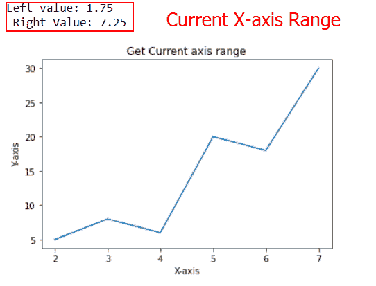

xlim()

### 改变当前轴范围

如果你想改变极限，我们用你选择的左值和右值调用 `xlim()` 函数。

**语法:**

```py
matplotlib.pyplot.xlim(left_value, right_value)
```

**我们来看一个例子:**

```py
**# Import Library**

import numpy as np
import matplotlib.pyplot as plt

**# Define Data**

x = [0, 1, 2, 3, 4, 5]
y = [1.5, 3, 5.3, 6, 10, 2]

**# Change current axes**

plt.xlim(2, 5)

**# Plot** 
plt.plot(x,y,'-o')

**# Display**

plt.show()
```

要更改当前 x 轴的值，我们使用 `xlim()` 函数，并传递您选择的左右值。


plt.xlim(2,5)

### 用关键字参数改变当前轴范围

这里您将使用 `xlim()` 函数，用关键字参数而不是参数来改变轴的范围。

**语法:**

```py
matplotlib.pyplot.xlim(left=value, right=value)
```

**我们来看一个例子:**

```py
**# Import Library** 
import matplotlib.pyplot as plt
import numpy as np

**# Define data coordinates**

x = np.linspace(20, 10, 100)
y = np.sin(x)

**# Change axes with keyword arguments**

plt.xlim(left=5, right=15)

**# Plot**

plt.plot(x, y)

**# Display**

plt.show()
```

*   这里我们首先导入 `matplotlib.pyplot` 和 `numpy` 库。
*   接下来，我们定义数据坐标，使用 numpy 的 `linespace()` 和 `sin()` 函数。
*   为了改变轴的限制，我们使用带有关键字参数**左**和**右**的 `xlim()` 函数，并设置它们的值。这里我们把左边的值设为 5，右边的值设为 15。
*   为了绘制线图，我们使用了 `plot()` 函数。

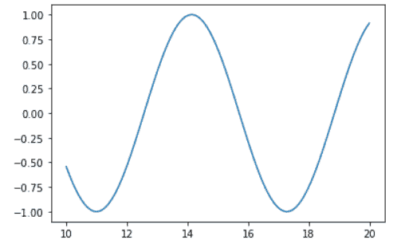

Graph with default values

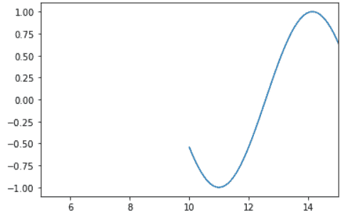

plt.xlim(left=5, right=15)

阅读: [Matplotlib 多条形图](https://pythonguides.com/matplotlib-multiple-bar-chart/)

## Matplotlib xlim left

这里我们将学习设置或获取 x 轴左边值的极限。让我们来看看不同的例子。

**例#1**

在本例中，我们将获得当前轴的左极限，为此，我们将获取变量 `left` ，然后我们不带任何参数地调用 `xlim()` 函数。

**语法:**

```py
left =matplotlib.pyplot.xlim()
```

**源代码:**

```py
**# Import Library**

import numpy as np 
import matplotlib.pyplot as plt

**# Data Coordinates** 
x = np.arange(2, 8) 
y = np.array([2, 4, 6, 8, 10, 12])

**# PLot**

plt.plot(x, y) 

**# Get and print current axes**

left, right= plt.xlim()

print("Left value:",left)

**# Display**

plt.show()
```

**输出:**

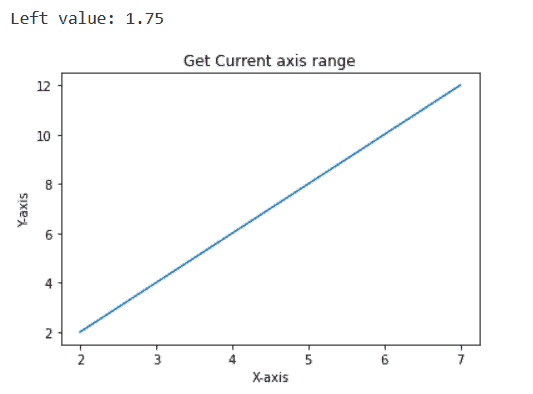

left=plt.xlim()

**例 2**

在本例中，我们将设置左当前轴限制，为此，我们将使用关键字参数 `left` 和 `xlim()` 函数。

**语法:**

```py
matplotlib.pyplot.xlim(left=left_value)
```

**源代码:**

```py
**# Import Library** 
import numpy as np 
import matplotlib.pyplot as plt

**# Data Coordinates** 
x = [1, 2, 3, 4, 5]
y = [4, 8, 12, 16, 20]

**# PLot** 
plt.plot(x, y) 

**# Set left axes**

plt.xlim(left=2.5)

**# Display** 
plt.show()
```

**输出:**

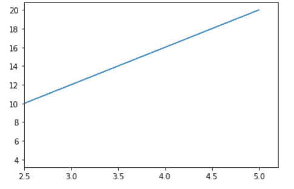

plt.xlim(left=2.5)

**例 3**

如果你想改变限制，我们用你选择的左值调用 `xlim()` 函数。绘图的正确值是自动设置的。

**语法:**

```py
matplotlib.pyplot.xlim(left_value)
```

**源代码:**

```py
**# Import Library** 
import matplotlib.pyplot as plt
import numpy as np

**# Define data coordinates** 
x = np.linspace(20, 10, 100)
y = np.sin(x)

**# Change axes** 
plt.xlim(20)

**# Plot**

plt.plot(x, y)

**# Display** 
plt.show()
```

这里我们将 20 传递给 `xlim()` 函数，这个值被设置为绘图的左 x 轴。

**输出:**

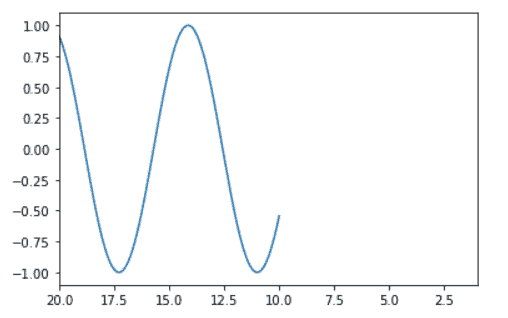

plt.xlim(20)

阅读: [Matplotlib 散点图图例](https://pythonguides.com/matplotlib-scatter-plot-legend/)

## Matplotlib xlim right

在这里，我们将学习设置或获取 x 轴右值的极限。让我们来看看不同的例子。

**例#1**

在本例中，我们将获得右当前轴限值，为此，我们将获取变量**右**，然后我们调用 `xlim()` 函数，不带任何参数。之后，我们打印正确的值。

**语法:**

```py
right =matplotlib.pyplot.xlim()
```

**源代码:**

```py
**# Import Library** 
import matplotlib.pyplot as plt
import numpy as np

**# Define data coordinates** 
x = np.arange(5, 11) 
y = np.array([2, 4, 6, 8, 10, 12])

**# Plot** 
plt.plot(x, y)

**# Get and print current axes**

left, right= plt.xlim()

print("Right value:",right)

**# Display** 
plt.show()
```

**输出:**

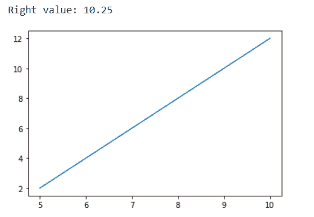

right=plt.xlim()

**例 2**

在本例中，我们将设置右当前轴限制，为此，我们将使用关键字参数 `right` 和 `xlim()` 函数。

**语法:**

```py
matplotlib.pyplot.xlim(right=right_value)
```

**源代码:**

```py
**# Import Library** 
import matplotlib.pyplot as plt
import numpy as np

**# Define data coordinates** 
x = np.random.randint(450,size=(80))
y = np.random.randint(260, size=(80))

**# Plot**

plt.scatter(x, y)

**# Set right axes**

plt.xlim(right=250)

**# Display**

plt.show()
```

**输出:**

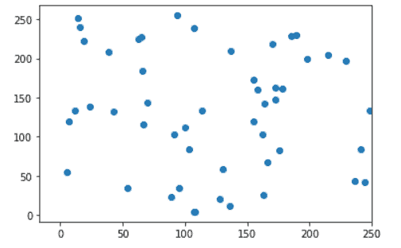

plt.xlim(right=250)

阅读: [Matplotlib 默认图形尺寸](https://pythonguides.com/matplotlib-default-figure-size/)

## Matplotlib xlim 对数标度

这里我们将看到一个对数图的例子，这里我们还设置了 x 轴的界限。

**我们来看一个例子:**

```py
**# Import Library** 
import matplotlib.pyplot as plt

**# Define Data** 
x = [ 10**i for i in range(5)]
y = [ i for i in range(5)]

**# Log scale**

plt.xscale("log")

**# Plot**

plt.plot(x,y)

**# Set limit**

plt.xlim([1,2**10])

**# Display**

plt.show()
```

*   这里我们先导入 `matplotlib.pyplot` 库。
*   接下来，我们定义数据坐标。
*   然后，我们使用 `xscale()` 函数将 x 轴刻度转换为对数刻度。
*   为了绘制图表，我们使用了 `plot()` 函数。
*   为了设置 x 轴的极限，我们使用 `xlim()` 函数。
*   为了显示图形，我们使用 `show()` 函数。

**输出:**

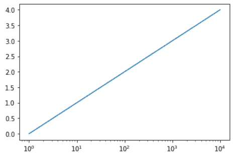

Default x limits

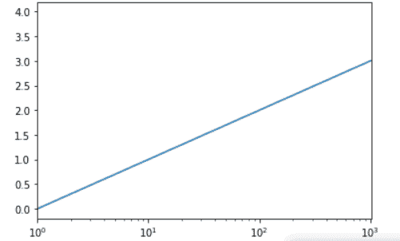

plt.xlim([1,2**10])

阅读:[堆积条形图 Matplotlib](https://pythonguides.com/stacked-bar-chart-matplotlib/)

## Matplotlib 散点图 xlim

这里我们将设置散点图 x 轴的界限。为了创建散点图，我们使用了 `scatter()` 函数，为了设置 x 轴的范围，我们使用了 `xlim()` 函数。

**我们来看一个例子:**

```py
**# Import Library**

import matplotlib.pyplot as plt
import numpy as np

**# Define Data** 
x = np.arange(0, 20, 0.2)
y = np.sin(x)

**# Plotting**

plt.scatter(x, y)

**# Set axes** 
plt.xlim(6, 18)

**# Add label**

plt.xlabel('X-Axis')
plt.ylabel('Y-Axis')

**# Display** plt.show() 
```

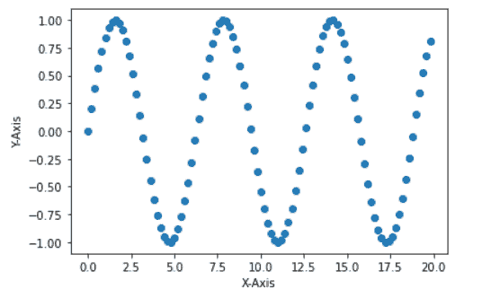

Default axes limits

这里，x 轴的最小值或右侧值约为 0.0，x 轴的最大值或左侧值约为 20.0。

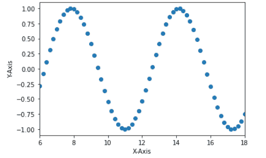

plt.xlim()

这里我们将 x 轴的右边界设置为 6，左边界设置为 18。

阅读: [Matplotlib 两个 y 轴](https://pythonguides.com/matplotlib-two-y-axes/)

## Matplotlib xlim 组团

在这里，我们将学习设置直方图中 x 轴的限制。首先，我们讨论直方图是什么。基本上，直方图是一个图表，用于频率分布。为了在 matplotlib 中创建直方图，我们使用了 `hist()` 函数。

我们已经知道，要设置 x 轴极限，我们使用 `xlim()` 函数。

**举例:**

```py
**# Import Library**

import numpy as np
import matplotlib.pyplot as plt

**# Define Data**

x = np.random.normal(170, 10, 250)

**# Plot Histogram** 
plt.hist(x)

**# Set limits**

plt.xlim(160,250)

**# Display** 
plt.show()
```

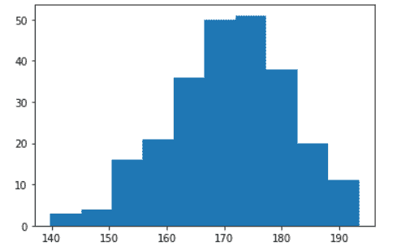

hist()

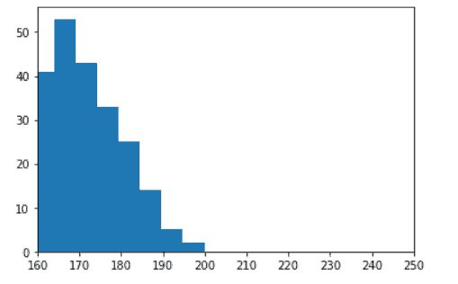

plt.xlim(160, 250)

这里我们将 x 轴的最大和最小范围分别设置为 160 和 250。

读取:[水平线 matplotlib](https://pythonguides.com/horizontal-line-matplotlib/)

## matplotlib im how xlim

matplotlib 的 `imshow()` 函数用于将数据显示为图像，并设置 x 轴极限 we，使用`xlim()`函数。

**我们来看一个例子:**

```py
**# Import Library** 
import numpy as np
import matplotlib.pyplot as plt

**# Define Data** 
x = np.arange(100).reshape((10,10)) 

**# Set axes** 
plt.xlim(left=-1,right=10)

**# Heat map**

plt.imshow( x, cmap = 'Set2' , interpolation = 'bilinear')

**# Add Title**

plt.title( "Imshow Xlim Function" )

**# Display**

plt.show()
```

*   导入 `matplotlib.pyplot` 和 `numpy` 库。
*   接下来，我们使用 numpy 的 `arange()` 函数定义数据坐标。
*   在此之后，我们使用 `xlim()` 函数来设置 x 轴。我们将左边的值设置为-1，右边的值设置为 10。
*   然后，我们使用 `imshow()` 函数来绘制热图。我们通过 `x` 参数来表示图像的数据， `cmap` 参数是 colormap 实例，**插值**参数用于显示图像。

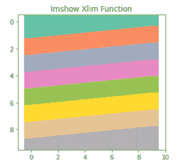

imshow() and xlim()

阅读:[画垂直线 matplotlib](https://pythonguides.com/draw-vertical-line-matplotlib/)

## Matplotlib 热图 xlim

seaborn 模块的 `heatmap()` 函数用于将矩形数据绘制为颜色矩阵，要设置 x 轴限制，请使用 `xlim()` 函数。

**我们来看一个例子:**

```py
**# Import Library** 
import numpy as np
import seaborn as sns
import matplotlib.pyplot as plt

**# Define Data Coordinates** 
x = np.arange(15**2).reshape((15, 15))

**# HeatMap**

sns.heatmap( x , linewidth = 0.5 , cmap = 'tab10' )

**# Set limit** 
plt.xlim(5,8)

**# Add Title**

plt.title( "Heat Map" )

**# Display**

plt.show()
```

*   在上面的例子中，我们导入了 `numpy` 、 `matplotlib.pyplot` 和 `seaborn` 库。
*   之后，我们使用 numpy 的 `arange()` 方法定义数据坐标，并使用`shape()`方法对其进行整形。
*   然后我们使用 seaborn 的 `heatmap()` 函数。
*   为了设置 x 轴的限制，我们使用 `xlim()` 函数，该函数具有绘图的左值和右值。
*   要给绘图添加标题，使用 `title()` 函数。

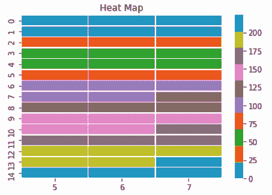

xlim()

阅读:[将图例放在绘图 matplotlib 之外](https://pythonguides.com/put-legend-outside-plot-matplotlib/)

## Matplotlib xlim 填充

在设置 x 轴限制时，我们可以通过使用紧凑布局来保留填充。为了设置紧凑布局，我们使用**PLT . RC params[" figure . autolayout "]= False**。

**举例:**

```py
**# Import Libraries**

import numpy as np
import matplotlib.pyplot as plt

**# Setting plot** 
plt.rcParams["figure.figsize"] = [6.00, 3.00]
plt.rcParams["figure.autolayout"] = True

**# Define Data** 
x = np.linspace(-20, 20, 300)
y = np.cos(x)

**# Set axes** 
plt.xlim([2,max(x)])

**# Plot** 
plt.plot(x, y)

**# Display** 

plt.show()
```

**说明:**

*   首先，导入 `numpy` 和 `matplotlib.pyplot` 库。
*   接下来，为了设置图形大小，我们使用**PLT . RC params[" figure . fig size "]**。
*   为了调整子情节之间和周围的填充，我们使用**PLT . RC params[" figure . autolayout "]**。
*   使用 numpy 的 `linspace()` 和 `cos()` 函数创建 x 和 y 数据坐标。
*   限制 x 轴，我们使用 `xlim()` 函数。
*   使用 `plot()` 方法，绘制 x 和 y 数据点。
*   使用 `show()` 功能显示图形

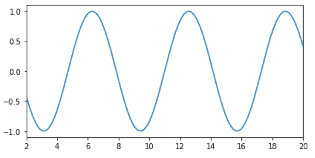

xlim()

阅读: [Matplotlib 标题字体大小](https://pythonguides.com/matplotlib-title-font-size/)

## Matplotlib 3d plot xlim

[3D 散点图](https://pythonguides.com/matplotlib-3d-scatter/)是一个数学图表，用于使用笛卡尔坐标将数据属性显示为三个变量。在 matplotlib 中创建 3D 散点图，我们必须导入 `mplot3d` **工具包**。

在这里，我们学习使用 pyplot 模块的 `xlim()` 函数来设置 3d 绘图的 x 轴界限。

**举例:**

```py
**# Import libraries**

from mpl_toolkits import mplot3d
import numpy as np
import matplotlib.pyplot as plt

**# Create Figure**

fig = plt.figure(figsize = (10, 7))
ax = plt.axes(projection ="3d")

**# Define Data**

x = np.arange(0, 20, 0.2)
y = np.sin(x)
z = np.cos(x)

**# Create Plot**

ax.scatter3D(x, y, z)

**# Limit Axes**

plt.xlim(left= -15)

**# Show plot**

plt.show()
```

*   在上面的例子中，我们导入了 **mplot3d 工具包**、 `numpy` 和 `pyplot` 库。
*   `plt.figure()` 方法用于设置图形尺寸这里我们将 `figsize` 作为参数传递。
*   `plt.axes()` 方法用于设置轴，这里我们将**投影**作为参数传递。
*   接下来，我们使用 `arange()` 、 `sin()` 和 `cos()` 方法定义数据。
*   为了设置 x 轴极限，我们使用 `plt.xlim()` 函数。这里，我们将左侧值设置为-15，右侧值会自动调整。
*   `ax.scatter3D()` 方法用于创建三维散点图，这里我们传递 `x` 、 `y` 、 `z` 作为参数。
*   `plt.show()` 方法用于在用户屏幕上生成图形。

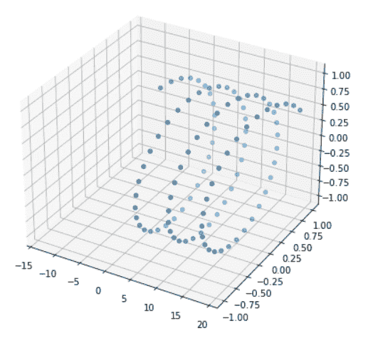

plt.xlim()

阅读: [Matplotlib 条形图标签](https://pythonguides.com/matplotlib-bar-chart-labels/)

## Matplotlib 动画 xlim

这里我们将看到一个动画绘图的例子，我们通过使用 `axes()` 函数来设置 x 轴的限制。我们将 `xlim` 作为参数传递给轴函数。

**举例:**

```py
**# Import Libraries**

import numpy as np
import matplotlib.pyplot as plt
from matplotlib.animation import FuncAnimation

**# Create figure and axes** 
fig = plt.figure()
ax = plt.axes(xlim=(0,4))
plot, = ax.plot([], [])

**# Define functions**

def init():
    plot.set_data([], [])
    return line,
def animate(i):
    x = np.linspace(0, 4, 100)
    y = np.sin(x*i)
    plot.set_data(x, y)
    return line,

**# Animation**

anim = FuncAnimation(fig, animate, init_func=init,
                     frames=200, interval=20, blit=True)

**# Save as gif**

anim.save('Animation Xlim.gif', writer='pillow')
```

*   我们导入 `numpy` 、 `matplotlib.pyplot` 和**动画**库。
*   我们定义了 `init` 函数，它负责触发动画。 `init` 函数设置轴边界并初始化数据。
*   然后我们定义动画函数，这个函数以**帧**号(I)为自变量，生成一个基于 I 移位的**正弦波**，这个函数返回一个变化了的剧情对象的元组，告诉动画框架剧情的哪些元素应该动画化。
*   通过使用**动画。FuncAnimation()** 方法我们给剧情添加动画。
*   然后，最后我们使用 `save()` 方法将一个情节保存为 `gif` 。

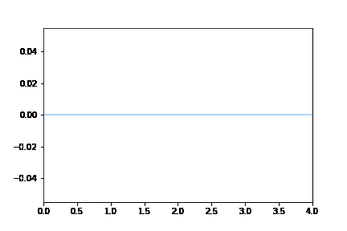

plt.axes(xlim=())

读取: [Matplotlib 绘图误差线](https://pythonguides.com/matplotlib-plot-error-bars/)

## Matplotlib xlim errorbar

当我们用图形表示数据时，有些数据具有不规则性。为了表示这些不规则性或不确定性，我们使用**误差棒**。要设置 x 轴的极限，使用 pyplot 模块的 `xlim()` 功能。

**举例:**

```py
**# Import Library**

import matplotlib.pyplot as plt

**# Define Data**

x= [2, 4, 6, 8, 10]
y= [9, 15, 20, 25, 13]

**# Plot error bar** 
plt.errorbar(x, y, xerr = 0.5)

**# Limit x-axis**

plt.xlim(0,8)

**# Display graph** 
plt.show()
```

*   在上面的例子中，我们导入了 `matplotlib.pyplot` 库。
*   然后我们定义 x 轴和 y 轴数据点。
*   `plt.errorbar()` 方法用于绘制误差线，我们传递参数 **x，y，**和 `xerr` ，并设置 xerr 的值= **0。** 5。
*   为了设置 x 轴的极限，我们使用 `xlim()` 函数。这里的范围在 0 到 8 之间。
*   然后我们使用 `plt.show()` 方法显示误差棒图。

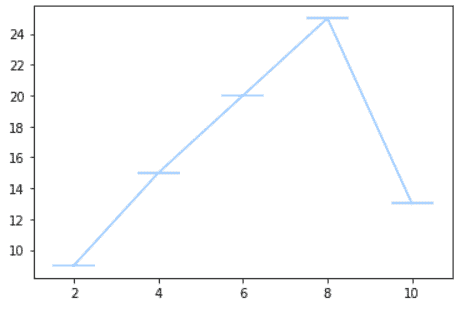

Plot with default axes

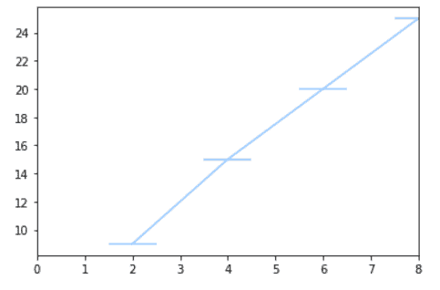

plt.xlim(0,8)

阅读: [Matplotlib 旋转刻度标签](https://pythonguides.com/matplotlib-rotate-tick-labels/)

## Matplotlib twiny xlim

在 matplotlib 中， `twiny()` 函数用于创建双轴。为了设置双 x 轴的极限，我们使用 `set_xlim()` 函数。

**举例:**

```py
**# Import Library** 
import numpy as np
import matplotlib.pyplot as plt

**# Define Data**

x = np.arange(100)
y = np.cos(x)

**# Plot Graph** 
fig, ax1 = plt.subplots()
ax1.plot(x, y)

**# Define Labels** 
ax1.set_xlabel('X1-axis')
ax1.set_ylabel('Y-axis')

**# Twin Axes**

ax2 = ax1.twiny()
ax2.set_xlim(-1,2)
ax2.set_xlabel('X2-Axis')

**# Display** 
plt.show()
```

*   这里我们用相同的数据创建两个 x 轴，所以首先，我们导入 **matplotlib。pyplot** 和 `numpy` 库。
*   接下来，我们使用 numpy 的 `arange()` 和 `cos()` 函数定义数据坐标。
*   为了绘制图表，我们使用 axes 模块的 `plot()` 函数。
*   为了在轴上设置标签，我们使用了 `set_xlabel()` 和 `set_ylabel()` 函数。
*   为了创建一个双 x 轴，我们使用了 `twiny()` 函数。
*   为了设置 x 轴的极限，我们使用 `set_xlim()` 函数。

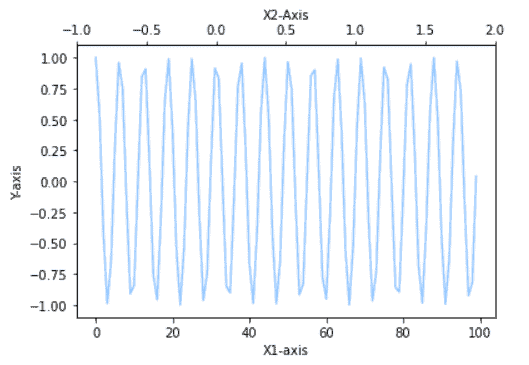

set_xlim()

读取: [Matplotlib 移除刻度标签](https://pythonguides.com/matplotlib-remove-tick-labels/)

## Matplotlib xlim 子图

这里我们将讨论如果我们在一个图形区域中绘制多个图，我们如何改变特定子图的 x 轴限制。

**举例:**

```py
**# Importing Libraries** 
import numpy as np
import matplotlib.pyplot as plt

**# Create subplot** 
fig, ax = plt.subplots(1, 2)

**# Define Data** 
x1= [0.2, 0.4, 0.6, 0.8, 1]
y1= [0.3, 0.6, 0.8, 0.9, 1.5]

x2= [2, 6, 7, 9, 10]
y2= [3, 4, 6, 9, 12]

**# Plot graph**

ax[0].plot(x1, y1)
ax[1].plot(x2, y2)

**# Limit axes**

ax[1].set_xlim(0,10)

**# Add space**

fig.tight_layout()

**# Display Graph**

plt.show()
```

*   首先，我们导入 `numpy` 和 `matplotlib.pyplot` 库。
*   在这之后，我们使用 `subplots()` 函数创建一个 subplots。
*   然后我们创建 x 和 y 数据坐标。
*   为了绘制图表，我们使用 axes 模块的 `plot()` 函数。
*   这里我们通过使用 `set_xlim()` 函数改变第一个子图的 x 轴极限。范围在 0 到 10 之间。
*   为了自动调整支线剧情之间的间距，我们使用了 `tight_layout()` 函数。
*   为了显示图表，我们使用了 `show()` 函数。

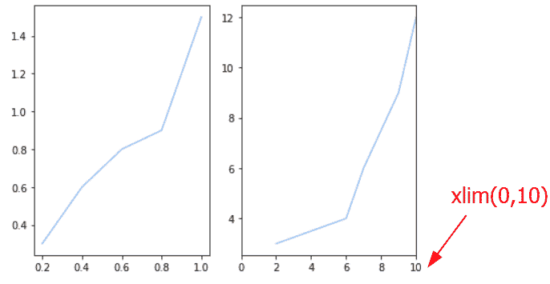

a[1].set_xlim()

读取: [Matplotlib 改变背景颜色](https://pythonguides.com/matplotlib-change-background-color/)

## Matplotlib xlim 日期时间

在这里，我们将看到一个例子，我们创建一个日期图，并手动设置他们的 x 轴限制。

**举例:**

```py
**# Import Libraries**

import datetime
import matplotlib.pyplot as plt

**# Subplot** 
fig, ax = plt.subplots()

**# Define Data** 
x = [datetime.date(2021, 12, 28)] * 3
y = [2, 4, 1]

**# plot Date** ax.plot_date(x, y)

**# Auto format date**

fig.autofmt_xdate()

**# Set x-limits** 
ax.set_xlim([datetime.date(2021, 12, 20), 
            datetime.date(2021, 12, 30)])

**# Display** 
plt.show()
```

*   我们导入 `datetime` 和 `matplotlib.pyplot` 库。
*   然后我们创建支线剧情，使用**支线剧情()**函数。
*   然后我们定义数据坐标。这里我们将 x 坐标设为日期。
*   为了绘制日期，我们使用 `plot_date()` 函数。
*   为了自动格式化 x 轴上的日期，我们使用了 `autofmt_xdate()` 函数。
*   为了设置 x 轴的极限，我们使用 `set_xlim()` 函数。
*   为了显示图表，我们使用了 `show()` 函数。

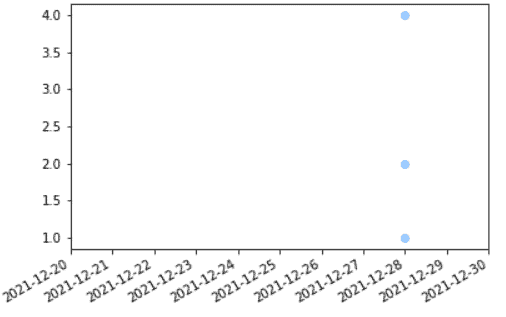

set_xlim()

你可能也喜欢阅读下面的 Matplotlib 教程。

*   [Matplotlib 虚线–完整教程](https://pythonguides.com/matplotlib-dashed-line/)
*   [Matplotlib plot _ date–完整教程](https://pythonguides.com/matplotlib-plot-date/)
*   [Matplotlib 设定 y 轴范围](https://pythonguides.com/matplotlib-set-y-axis-range/)
*   [Matplotlib 更新循环中的绘图](https://pythonguides.com/matplotlib-update-plot-in-loop/)
*   [Matplotlib 饼图教程](https://pythonguides.com/matplotlib-pie-chart/)

在本 Python 教程中，我们已经讨论了" `Matplotlib xlim` "并且我们还介绍了一些与之相关的例子。这些是我们在本教程中讨论过的以下主题。

*   Matplotlib xlim
*   Matplotlib 调用 xlim
*   Matplotlib xlim 左
*   Matplotlib xlim 右
*   Matplotlib xlim 对数标度
*   Matplotlib 散点图 xlim
*   Matplotlib xlim histogram
*   matplotlib imshow xlim
*   Matplotlib heatmap xlim
*   Matplotlib xlim 填充
*   Matplotlib 三维绘图 xlim
*   Matplotlib 动画 xlim
*   Matplotlib xlim errorbar
*   Matplotlib twiny xlim
*   Matplotlib xlim 子出图
*   Matplotlib xlim 日期时间

[Bijay Kumar](https://pythonguides.com/author/fewlines4biju/)

Python 是美国最流行的语言之一。我从事 Python 工作已经有很长时间了，我在与 Tkinter、Pandas、NumPy、Turtle、Django、Matplotlib、Tensorflow、Scipy、Scikit-Learn 等各种库合作方面拥有专业知识。我有与美国、加拿大、英国、澳大利亚、新西兰等国家的各种客户合作的经验。查看我的个人资料。

[enjoysharepoint.com/](https://enjoysharepoint.com/)[](https://www.facebook.com/fewlines4biju "Facebook")[](https://www.linkedin.com/in/fewlines4biju/ "Linkedin")[](https://twitter.com/fewlines4biju "Twitter")