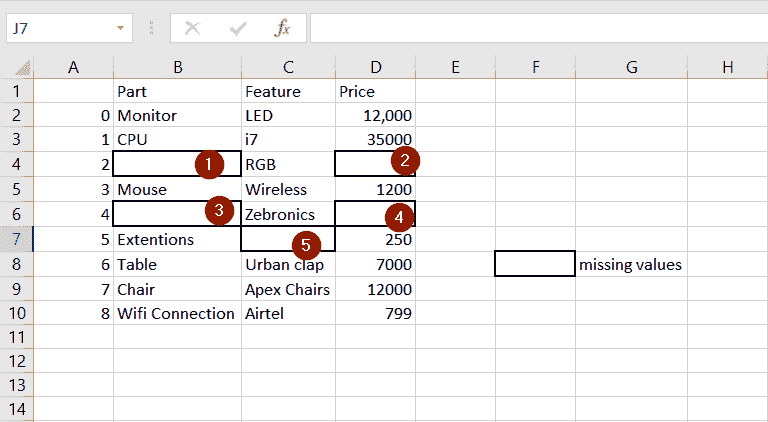
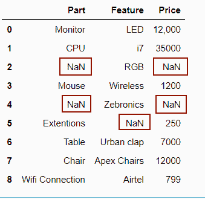

# Python 中熊猫缺失的数据

> 原文：<https://pythonguides.com/missing-data-in-pandas/>

在本[机器学习教程](https://pythonguides.com/machine-learning-using-python/)中，我们学习了 Python 中熊猫的**缺失数据。此外，我们已经讨论了这些主题。**

*   熊猫缺失数据
*   熊猫数据帧中缺失的数据
*   缺失数据熊猫的时间序列
*   计算熊猫缺失的数据
*   删除熊猫中缺失的数据
*   对熊猫缺失数据进行插值
*   输入熊猫丢失的数据

目录

*   [失踪的数据熊猫](#Missing_Data_Pandas "Missing Data Pandas")
*   [缺失数据熊猫数据帧](#Missing_Data_Pandas_DataFrame "Missing Data Pandas DataFrame")
*   [时间序列缺失数据熊猫](#Time_Series_Missing_Data_Pandas "Time Series Missing Data Pandas")
*   [统计缺失数据熊猫](#Count_Missing_Data_Pandas "Count Missing Data Pandas")
*   [删除丢失的数据熊猫](#Remove_Missing_Data_Pandas "Remove Missing Data Pandas")
*   [插值缺失数据熊猫](#Interpolate_Missing_Data_Pandas "Interpolate Missing Data Pandas")
*   [估算缺失数据熊猫](#Impute_Missing_Data_Pandas "Impute Missing Data Pandas")

## 失踪的数据熊猫

*   缺失数据是指数据集中缺失的值。数据集是随着时间的推移记录的大量信息的集合。
*   这些信息可能与任何事情有关，如客户调查、植物、动物、昆虫、微生物、自然灾害、互联网活动等。
*   有各种网站可以下载数据集。几个例子是 Data.gov、[谷歌公共](https://console.cloud.google.com/marketplace/browse?filter=solution-type:dataset&_ga=2.190110701.775911225.1614209723-1328743109.1614209723&pli=1)、 [Buzzfeed 新闻](https://github.com/BuzzFeedNews)这 `Kaggle` 。com 是下载数据集的流行网站之一。
*   我们在 excel 或 CSV 文件中看到缺失数据的缺失空间，但是当使用 pandas 读取该数据时，它会在缺失数据的位置显示 `NaN` 。
*   以下是 CSV 文件中缺失数据的示例。

missing data in pandas

下面是一个使用 pandas 读取相同数据集的示例。你可以在空白的地方观察 NaN。

machine learning using python missing values in pandas

有各种内置函数来识别和处理丢失的数据。

| `isnull(), notnull()` | 该函数用于识别数据集是否有缺失值。它们返回布尔值。 |
| `dropna()` | 此函数删除缺少值的行。 |
| `fillna()` | 该函数用提供的值填充缺少的值。 |
| `replace()` | 该函数用提供的字替换 `NaN` |
| `interpolate()` | 此函数使用应用算法后生成的一些值来填充缺失的数据。最好使用插值而不是硬编码。 |

## 缺失数据熊猫数据帧

*   在本节中，我们将学习如何使用 DataFrame 创建和处理丢失的数据。
*   Python 熊猫将 `None` 值视为缺失值，并指定 `NaN` 代替它。
*   在数据帧中，我们可以通过使用``isnull()`, `notnull()``函数来识别缺失的数据。
*   **`isnull()`** 对所有缺失值返回 True】对所有占用值返回 False。
*   ``notnull()``对于所有被占用的值返回 True，对于缺失的值返回 False。
*   我们使用 **`dropna()`** 函数删除所有缺失数据的行。
*   **`replace()`** 功能用于将项目替换为名称或值。这需要两个流行的论点。
    *   **to_replace:** 要更改的值
    *   **值**:要提供的新值
*   这是所有提到的函数的表示。