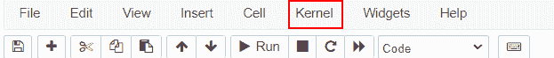
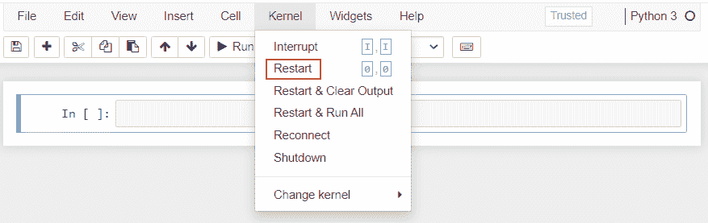

# 模块“matplotlib”没有属性“artist”

> 原文：<https://pythonguides.com/module-matplotlib-has-no-attribute-artist/>

[](https://sharepointsky.teachable.com/p/python-and-machine-learning-training-course)

在本 [Python 教程](https://pythonguides.com/learn-python/)中，我们将讨论错误“**模块' [matplotlib](https://pythonguides.com/what-is-matplotlib/) '没有属性‘艺术家'**”。在这里，我们将使用 matplotlib 来解释与此错误相关的原因。我们还将讨论以下主题:

*   模块 matplotlib 未安装
*   matplotlib 模块中的问题
*   环境问题

目录

[](#)

*   [属性错误:模块“matplotlib”没有属性“artist”](#AttributeError_module_matplotlib_has_no_attribute_artist "AttributeError: module ‘matplotlib’ has no attribute ‘artist’")
    *   [错误#1:模块“matplotlib”未安装](#Error1_module_matplotlib_not_installed "Error#1: module ‘matplotlib’ not installed ")
*   [错误# 2:matplotlib 模块中的问题](#Error2_Issue_in_matplotlib_module "Error#2: Issue in matplotlib module")
*   [错误#3:环境问题](#Error3_environemt_issue "Error#3: environemt issue")

## 属性错误:模块“matplotlib”没有属性“artist”

### 错误#1:模块“matplotlib”未安装

这里我们要讨论的是错误**属性错误:python 中模块' matplotlib '没有属性' artist'** 。基本上，当我们导入 pandas 库时，就会出现这个错误声明。

**原因:**第一个原因可能是您的系统中没有安装 matplotlib。

**现在我们来看看这个问题的解决方案:**

**Jupyter 笔记本:**

*   使用 pip 命令安装 matplotlib。

**语法:**

```py
pip install matplotlib
```

*   要检查它是否已安装，请检查其版本。

**语法:**

```py
import matplotlib
print(matplotlib.__version__)
```

**蟒蛇分布:**

如果您的系统中有 Anaconda 提示符，您可以从这里使用下面提到的命令轻松安装 matplotlib。如果你不确定你是否有它，你可以很容易地在你的机器 Windows 开始菜单中看到它。

*   使用 conda 命令安装 matplotlib:

**语法:**

```py
conda install matplotlib
```

*   要检查是否安装了 matplotlib，请检查其版本:

**语法:**

```py
import matplotlib
print(matplotlib.__version__)
```

关于安装 matplotlib 的详细信息，请查看:[如何安装 matplotlib python](https://pythonguides.com/how-to-install-matplotlib-python/)

## 错误# 2:matplotlib 模块中的问题

这里我们要讨论的是错误**属性错误:python 中模块' matplotlib '没有属性' artist'** 。

**原因:**模块‘matplotlib’安装不正确。

如果您确定 matplotlib 模块已经安装在您的系统中，但是您仍然面临上述属性错误。原因一定是，安装不正确。

**我们来讨论一下解决方案:**

**Jupyter 笔记本:**

*   取消所有已经安装的版本。

**语法:**

```py
pip uninstall matplotlib
```

*   重新安装 matplotlib 模块:

**语法:**

```py
pip install matplotlib
```

**蟒蛇分布:**

如果有 anaconda 提示符，请使用以下命令:

*   取消所有已经安装的版本。

**语法:**

```py
conda uninstall matplotlib
```

*   重新安装 matplotlib 模块:

**语法:**

```py
conda install matplotlib
```

另外，检查: [modulenotfounderror:没有名为“matplotlib”的模块](https://pythonguides.com/no-module-named-matplotlib/)

## 错误#3:环境问题

如果你按照上面提到的错误原因和解决方案，你仍然有错误。那么可能是环境有问题。

**让我们来看看这个问题的解决方案:**

**Jupyter 笔记本:**

在 Juypter 笔记本中，要解决这个错误，我们必须重启内核。

**按照以下步骤重启内核:**

*   **打开**jupyter 笔记本。
*   点击 jupyter 菜单顶部的**内核**。
*   然后点击**重启**。



Kernel



Restart

这将重置您的笔记本并删除已定义的变量和方法。

**蟒蛇分布:**

在水蟒中，我们可以激活和关闭环境。因此，要激活环境，请遵循以下代码:

```py
conda activate <envirinemnt name>
```

如果您不知道环境，请使用以下命令:

```py
conda env list
```

在本 Python 教程中，我们已经讨论了"**模块' matplotlib '没有属性' artist'** "并且我们还讨论了与之相关的原因和解决方案。这些是我们在本教程中讨论过的以下主题。

*   模块 matplotlib 未安装
*   matplotlib 模块中的问题
*   环境问题

你可能也喜欢阅读下面的 Matplotlib 教程。

*   [Matplotlib 绘制一条线(详细指南)](https://pythonguides.com/matplotlib-plot-a-line/)
*   [Matplotlib fill _ between–完整指南](https://pythonguides.com/matplotlib-fill_between/)
*   [Matplotlib tight _ layout–有用教程](https://pythonguides.com/matplotlib-tight-layout/)
*   [Matplotlib 未知投影‘3d’](https://pythonguides.com/matplotlib-unknown-projection-3d/)
*   [Matplotlib 目前正在使用 agg 非 gui 后端](https://pythonguides.com/matplotlib-is-currently-using-agg-a-non-gui-backend/)
*   [Matplotlib 1.3.1 需要未安装的 nose】](https://pythonguides.com/matplotlib-1-3-1-requires-nose-which-is-not-installed/)

[Bijay Kumar](https://pythonguides.com/author/fewlines4biju/)

Python 是美国最流行的语言之一。我从事 Python 工作已经有很长时间了，我在与 Tkinter、Pandas、NumPy、Turtle、Django、Matplotlib、Tensorflow、Scipy、Scikit-Learn 等各种库合作方面拥有专业知识。我有与美国、加拿大、英国、澳大利亚、新西兰等国家的各种客户合作的经验。查看我的个人资料。

[enjoysharepoint.com/](https://enjoysharepoint.com/)[](https://www.facebook.com/fewlines4biju "Facebook")[](https://www.linkedin.com/in/fewlines4biju/ "Linkedin")[](https://twitter.com/fewlines4biju "Twitter")