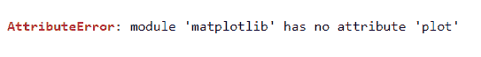
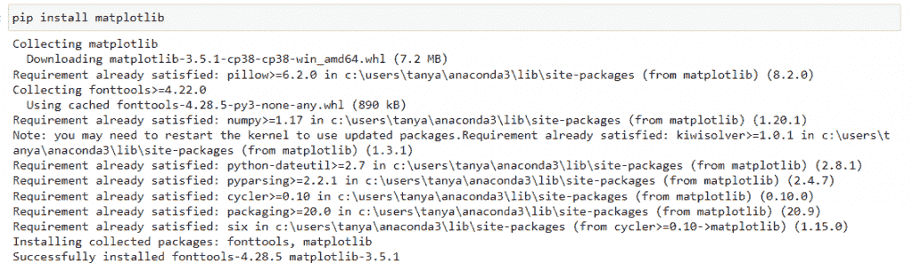
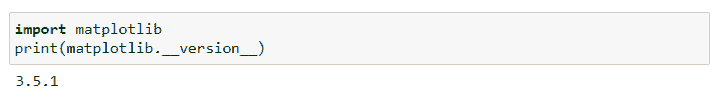
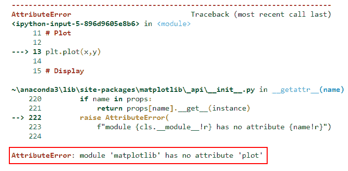
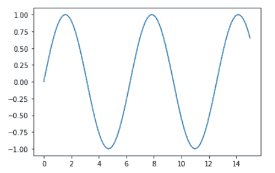

# 模块“matplotlib”没有属性“plot”

> 原文：<https://pythonguides.com/module-matplotlib-has-no-attribute-plot/>

[](https://sharepointsky.teachable.com/p/python-and-machine-learning-training-course)

在本 [Python 教程](https://pythonguides.com/learn-python/)中，我们将讨论**模块‘matplotlib’没有属性‘plot’**。在这里，我们将使用 matplotlib 介绍与此错误相关的不同原因。我们将讨论以下主题:

*   安装问题:模块“matplotlib”没有属性“plot”
*   语法错误:模块“matplotlib”没有属性“plot”

目录

[](#)

*   [错误#1 安装问题:模块“matplotlib”没有属性“plot”](#Error1_Installation_Issue_module_matplotlib_has_no_attribute_plot "Error#1 Installation Issue: module ‘matplotlib’ has no attribute ‘plot’")
*   [错误#2 语法错误:模块“matplotlib”没有属性“plot”](#Error2_Syntax_Error_module_matplotlib_has_no_attribute_plot "Error#2 Syntax Error: module ‘matplotlib’ has no attribute ‘plot’ ")

## 错误#1 安装问题:模块“matplotlib”没有属性“plot”

这里我们要讨论的是错误**属性错误:python 中模块' matplotlib '没有属性' plot'** 。所以在这里，你会在这里得到所有可能的原因和解决方法。

第一，原因可能是 [matplotlib](https://pythonguides.com/what-is-matplotlib/) 安装不正确。

**我们来看一个错误:**



**现在我们来看看这个问题的解决方案:**

只需使用以下步骤安装 matplotlib:

*   使用 pip 命令安装 matplotlib:

**语法:**

```py
pip install matplotlib
```

*   要检查 matplotlib 是否安装成功，请检查其版本。如果安装成功，将显示版本。

**语法:**

```py
import matplotlib
print(matplotlib.__version__)
```

**输出:**



Install



Version

另外，查看关于如何安装 matplotlib python 的详细教程

## 错误#2 语法错误:模块“matplotlib”没有属性“plot”

如果 matplotlib 成功安装在您的系统中，但您仍然有一个**属性错误:模块‘matplotlib’没有属性‘plot’**。这意味着语法有问题，或者我们说有语法错误。

**让我们看一个出错的例子:**

**源代码:**

```py
**# Import Library**

import matplotlib as plt
import numpy as np

**# Define Data Coordinate**

x = np.linspace(0,15,150)
y = np.sin(x)

**# Plot**

plt.plot(x,y)

**# Display**

plt.show()
```



Error

**解决方案:**

在上面的例子中出现这个错误是因为我们用来导入 matplotlib 库的语法不正确。

**导入 matplotlib 库的正确语法如下:**

```py
import matplotlib.pyplot as plt
```

现在让我们用正确的语法再次看看上面的例子:

```py
**# Import Library**

import matplotlib.pyplot as plt
import numpy as np

**# Define Data Coordinate**

x = np.linspace(0,15,150)
y = np.sin(x)

**# Plot**

plt.plot(x,y)

**# Display** 
plt.show()
```

**输出:**



Hurry!!! We’ll get the plot

另外，检查: [modulenotfounderror:没有名为“matplotlib”的模块](https://pythonguides.com/no-module-named-matplotlib/)

**结论:**

我们必须导入 `matplotlib.pyplot` 模块，而不是 `matplotlib` 。

在本 Python 教程中，我们已经讨论了**“模块 matplotlib 没有属性** `plot"` ，并且我们还讨论了与之相关的原因和解决方案。这些是我们在本教程中讨论过的以下主题。

*   安装问题:模块“matplotlib”没有属性“plot”
*   语法错误:模块“matplotlib”没有属性“plot”

还有，多看看一些相关的帖子。

*   [Python 使用 Matplotlib 绘制多条线](https://pythonguides.com/python-plot-multiple-lines/)
*   [Matplotlib 改变背景颜色](https://pythonguides.com/matplotlib-change-background-color/)
*   [Matplotlib 设定 y 轴范围](https://pythonguides.com/matplotlib-set-y-axis-range/)
*   [模块“matplotlib”没有属性“artist”](https://pythonguides.com/module-matplotlib-has-no-attribute-artist/)
*   [Matplotlib 目前正在使用 agg 非 gui 后端](https://pythonguides.com/matplotlib-is-currently-using-agg-a-non-gui-backend/)
*   [Matplotlib 虚线–完整教程](https://pythonguides.com/matplotlib-dashed-line/)
*   [Matplotlib plot _ date–完整教程](https://pythonguides.com/matplotlib-plot-date/)
*   [Matplotlib 另存为 pdf + 13 示例](https://pythonguides.com/matplotlib-save-as-pdf/)

[Bijay Kumar](https://pythonguides.com/author/fewlines4biju/)

Python 是美国最流行的语言之一。我从事 Python 工作已经有很长时间了，我在与 Tkinter、Pandas、NumPy、Turtle、Django、Matplotlib、Tensorflow、Scipy、Scikit-Learn 等各种库合作方面拥有专业知识。我有与美国、加拿大、英国、澳大利亚、新西兰等国家的各种客户合作的经验。查看我的个人资料。

[enjoysharepoint.com/](https://enjoysharepoint.com/)[](https://www.facebook.com/fewlines4biju "Facebook")[](https://www.linkedin.com/in/fewlines4biju/ "Linkedin")[](https://twitter.com/fewlines4biju "Twitter")