# 模块“tensorflow”没有属性“div”

> 原文：<https://pythonguides.com/module-tensorflow-has-no-attribute-div/>

[](https://sharepointsky.teachable.com/p/python-and-machine-learning-training-course)

在本 [Python 教程](https://pythonguides.com/learn-python/)中，我们将重点讨论如何修复**属性错误:模块 tensorflow 在 TensorFlow** 中没有属性 *'* *div* **'。此外，我们还将看一些如何在 *`TensorFlow`* 中使用 *`tf.div()`* 函数的示例。我们将讨论这些话题。**

*   Attributeerror:模块“tensorflow”没有属性“div”
*   Attributeerror:模块“tensorflow”没有属性“dimension”
*   Attributeerror:模块“tensorflow”没有属性“count _ 非零”
*   Attributeerror:模块“tensorflow”没有属性“lin_space”
*   Attributeerror:模块“tensorflow”没有属性“sigmoid”
*   Attributeerror 模块“tensorflow”没有属性“placeholder”
*   Attributeerror 模块“tensorflow”没有属性“isnan”

目录

[](#)

*   [Attributeerror 模块“tensorflow”没有属性“div”](#Attributeerror_module_tensorflow_has_no_attribute_div "Attributeerror module ‘tensorflow’ has no attribute ‘div’")
*   [属性错误:模块“tensorflow”没有属性“dimension”](#Attributeerror_module_tensorflow_has_no_attribute_dimension "Attributeerror: module ‘tensorflow’ has no attribute ‘dimension’")
*   [属性错误:模块“tensorflow”没有属性“count _ 非零”](#Attributeerror_module_tensorflow_has_no_attribute_count_nonzero "Attributeerror: module ‘tensorflow’ has no attribute ‘count_nonzero’")
*   [属性错误:模块“tensorflow”没有属性“Lin _ space”](#Attributeerror_module_tensorflow_has_no_attribute_lin_space "Attributeerror: module ‘tensorflow’ has no attribute ‘lin_space’")
*   [属性错误:模块“tensorflow”没有属性“Sigmoid”](#Attributeerror_module_tensorflow_has_no_attribute_Sigmoid "Attributeerror: module ‘tensorflow’ has no attribute ‘Sigmoid’")
*   [Attributeerror 模块“tensorflow”没有属性“placeholder”](#Attributeerror_module_tensorflow_has_no_attribute_placeholder "Attributeerror module ‘tensorflow’ has no attribute ‘placeholder’")
*   [Attributeerror 模块“tensorflow”没有属性“isnan”](#Attributeerror_module_tensorflow_has_no_attribute_isnan "Attributeerror module ‘tensorflow’ has no attribute ‘isnan’")

## Attributeerror 模块“tensorflow”没有属性“div”

*   在本节中，我们将讨论如何解决没有属性“div”的 attributeerror 模块“tensorflow”。
*   使用 tf.div()函数对两个给定的输入张量进行逐个元素的划分。

**举例**:

```py
import tensorflow as tf

tens_1 = tf.constant([36, 56, 21])
tens_2 = tf.constant([6, 8, 7])
result=tf.div(tens_1,tens_2)
print(result)
```

在下面给出的代码中，我们首先导入别名为“tf”的 [TensorFlow 库](https://pythonguides.com/tensorflow/)，然后使用 `tf.constant()` 函数创建一个张量，在这个函数中，我们将整数作为参数。

接下来，我们使用了 `tf.div()` 函数，该方法在 Tensorflow 1.x 版本中可用，它不支持最新版本。

下面是以下给定代码的实现。

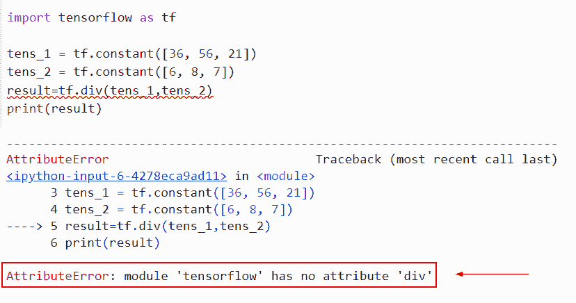

Attributeerror module ‘tensorflow’ has no attribute ‘div’

以下是此错误的解决方案。

**语法**:

下面是 Python TensorFlow 中 *`tf.math.divide()`* 函数的语法

```py
tf.math.divide(
    x, y, name=None
)
```

*   它由几个参数组成
    *   `x` :该参数定义了第一个输入张量。
    *   `y` :该参数指定第二个输入张量。
    *   `name` :默认不取值，指定操作的名称。

```py
import tensorflow as tf

tens_1 = tf.constant([36, 56, 21])
tens_2 = tf.constant([6, 8, 7])
result=tf.divide(tens_1,tens_2)
print(result)
```

你可以参考下面的截图

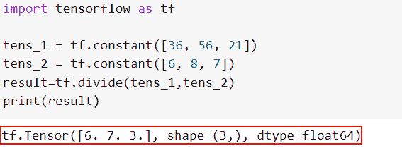

Solution of attributeerror module ‘tensorflow’ has no attribute ‘div’

这就是我们解决 attributeerror 模块“tensorflow”没有属性“div”的方法。

阅读: [TensorFlow Tensor to numpy](https://pythonguides.com/tensorflow-tensor-to-numpy/)

## 属性错误:模块“tensorflow”没有属性“dimension”

*   这里我们将使用 attributeerror 模块“tensorflow.math”没有属性“divide”。
*   张量在张量流的每一次计算中都要用到。张量是可以表示任何数据的 n 维向量或矩阵。张量的值都具有相同的数据类型和已知(或至少部分已知)的形状。
*   矩阵或数组的维数由数据的几何形状决定。

**举例**:

```py
import tensorflow as tf

tens_1 = tf.constant([[36, 56, 21],[12,56,7]])
result=tf.dimension(tens_1)
print(result)
```

下面是以下给定代码的执行过程

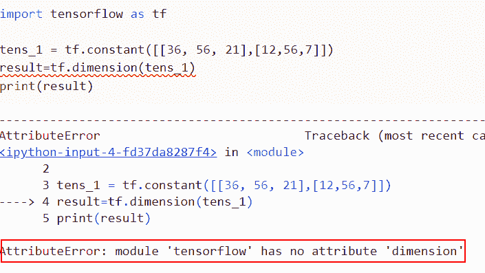

attributeerror module tensorflow has no attribute dimension

以下是此错误的解决方案。

在本例中，我们将使用 `tf.compat.v1.Dimension()` ，它将表示 TensorShape 中一个维度的值。

阅读:[Python tensor flow reduce _ sum](https://pythonguides.com/python-tensorflow-reduce_sum/)

## 属性错误:模块“tensorflow”没有属性“count _ 非零”

*   使用此函数计算多维张量的非零元素计数。这个函数允许我们确定多维张量中非零元素的数量。
*   沿指定轴的给定张量中非零值的数量是函数的返回值。如果不是，则返回数组的非零值计数。

**举例**:

```py
import tensorflow as tf

# Creation of input tensor
new_tens = tf.constant([16,0,24,78,0], dtype = tf.int32)

print("Input: ",new_tens)
new_output = tf.count_nonzero(new_tens)
# Display the Content
print("Number of non-zero elements: ",new_output)
```

在下面给出的代码中，我们首先将 TensorFlow 库作为 tf 导入，然后通过使用 `tf.constant()` 函数创建一个张量，在这个函数中，我们将整数值作为参数进行赋值。

之后，我们使用了**TF . count _ 非零()**函数，在这个函数中，我们将输入张量指定为一个参数。该功能将在 TensorFlow 1.x 版本中工作。

下面是以下给定代码的实现。

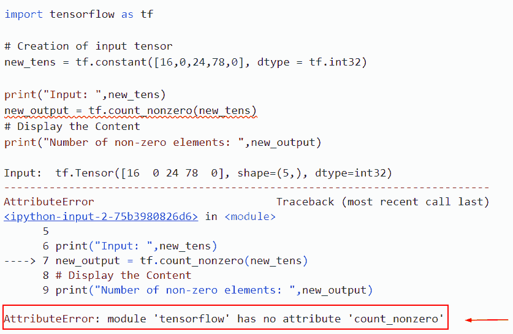

attributeerror module tensorflow has no attribute count_nonzero

此错误的解决方案。

在本例中，我们将使用 `tf.math.count_nonzero()` 函数，该函数生成输入张量维度上非零值的数量。

**语法**:

```py
tf.math.count_nonzero(
    input,
    axis=None,
    keepdims=None,
    dtype=tf.dtypes.int64,
    name=None
)
```

*   它由几个参数组成
    *   **输入**:该参数减少张量。应为布尔值、字符串或数字类型。
    *   **轴**:默认情况下，减少的尺寸不取值。如果没有(缺省值)，则所有维度都将减少。范围[-等级(输入)，等级(输入)]是必需的。
    *   `keepdims` :检查条件，如果为真，则减少长度为 1 的尺寸。
    *   `dtype` :该参数指定输入张量的数据类型。
    *   **名称**:指定操作的名称。

```py
import tensorflow as tf

# Creation of input tensor
new_tens = tf.constant([16,0,24,78,0], dtype = tf.int32)

print("Input: ",new_tens)
new_output = tf.math.count_nonzero(new_tens)
# Display the Content
print("Number of non-zero elements: ",new_output)
```

下面是以下给定代码的实现

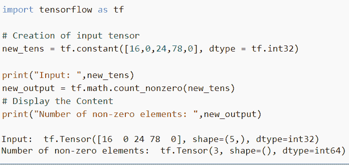

Solution of attributeerror module tensorflow has no attribute count_nonzero

正如你在截图中看到的，我们已经解决了 attributeerror 模块 tensorflow 没有属性' count _ 非零'的错误解决方案。

阅读: [Python TensorFlow 随机均匀](https://pythonguides.com/tensorflow-random-uniform/)

## 属性错误:模块“tensorflow”没有属性“Lin _ space”

*   在本节中，我们将讨论如何求解没有属性“lin_space”的 attributeerror 模块 tensorflow。
*   Linspace 用于在指定的时间间隔内创建均匀间隔的序列。
*   TensorFlow linspace 函数生成在指定范围内均匀分布的值序列。
*   实质上，您提供了一个起点、一个终点以及您希望在该间隔内拥有的断点总数(包括起点和终点)。tf.linspace 函数将返回一系列等间距的值。

**语法**:

下面是 Python TensorFlow 中 tf.linspace()函数的语法

```py
tf.linspace(
    start, stop, num, name=None, axis=0
)
```

*   它由几个参数组成
    *   `start` :该参数定义了输入张量的起始值。
    *   `stop` :指定输入张量的结束值。

**注意**:该功能在 tensorflow 1.x 和 2.x 版本中都有效。

**举例**:

```py
import tensorflow as tf

# Creation of input tensors
new_start_val = tf.constant(12, dtype = tf.float64)
new_end_val = tf.constant(25, dtype = tf.float64)
num = 5

new_output = tf.linspace(new_start_val, new_end_val, num)

# Display the Content
print("Result: ", new_output)
```

在这个例子中，我们使用了 tf.linspace()函数，在这个函数中，我们为它分配了起始值和结束值。

你可以参考下面的截图

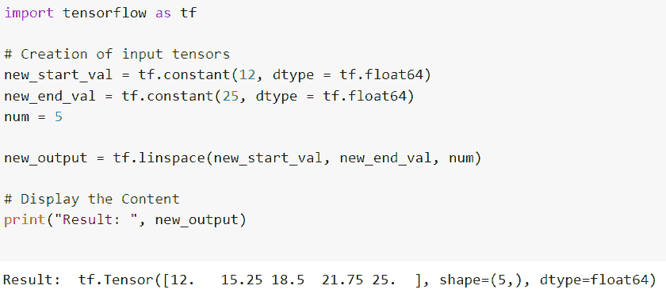

Solution of attributeerror module tensorflow has no attribute lin_space

这就是我们解决 attributerror 模块 tensorflow 没有属性 lin_space 的方法。

阅读:[张量流乘法](https://pythonguides.com/tensorflow-multiplication/)

## 属性错误:模块“tensorflow”没有属性“Sigmoid”

*   在本节中，我们将讨论 attributeerror 模块“tensorflow”没有属性“sigmoid”。
*   在二元分类问题中，当我们需要确定某个数据集属于某个特定类的可能性时，sigmoid 函数是最好的工具，它产生的结果在范围(0，1)内。在任何一点上，sigmoid 函数都可以求导，并产生其导数。
*   sigmoid 函数有一个“消失梯度”问题，因为它在两端变平，导致反向传播过程中权重的变化非常小。这可能会导致神经网络陷入困境并停止适应。

**举例**:

```py
import tensorflow as tf

# Creation of input tensor
new_tens = tf.constant([15.0, -13.5, 3.4, -42.1, 17.9, -34.5], dtype = tf.float32)
# By using the sigmoid() function 
result = tf.Sigmoid(new_tens, name ='sigmoid')

with tf.compat.v1.Session() as val:
    new_output=val.run(result)
    print(new_output)
```

下面是以下代码的截图

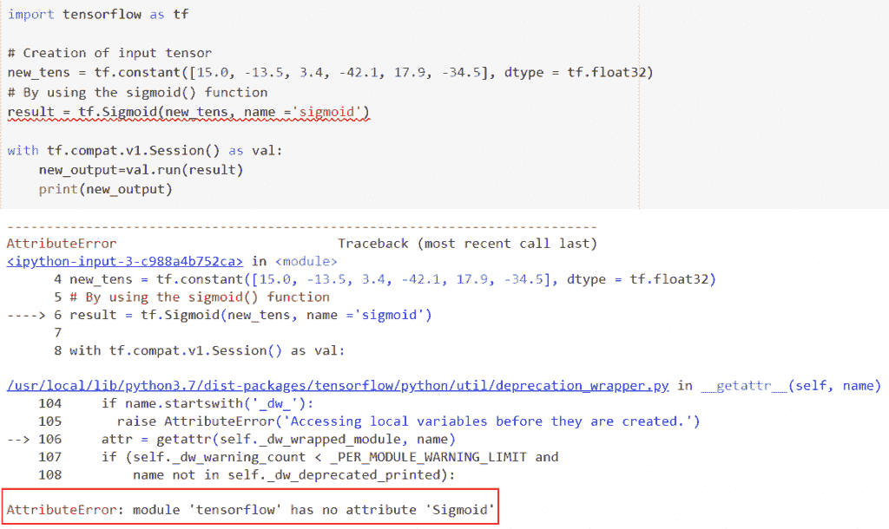

attributeerror module tensorflow has no attribute Sigmoid

以下是此错误的解决方案。

在这个例子中，我们将使用 `tf.sigmoid()` 函数，这个函数计算 x 元素的 sigmoid。

**语法**:

让我们看一下语法并理解 tf.sigmoid()函数的工作原理

```py
tf.math.sigmoid(
    x, name=None
)
```

*   它由几个参数组成
    *   `x` :该参数定义了将应用 sigmoid 函数的输入张量。
    *   `name` :默认取 none 值，定义操作的名称。

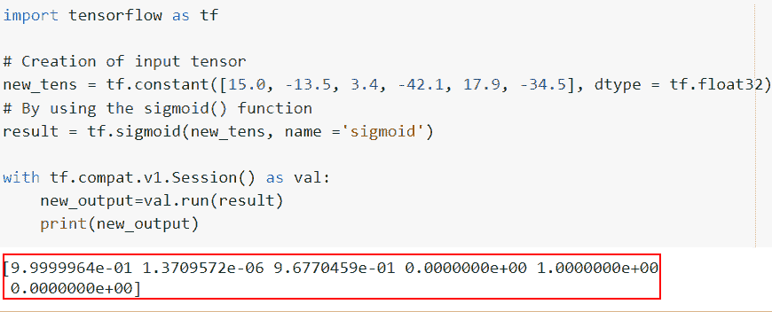

Solution of attributeerror module tensorflow has no attribute Sigmoid

阅读:[张量流均方误差](https://pythonguides.com/tensorflow-mean-squared-error/)

## Attributeerror 模块“tensorflow”没有属性“placeholder”

*   当我们试图访问一个不存在的对象的属性时，我们会在 Python 程序中得到一个 AttributeError。语句“'模块' tensorflow '没有属性' placeholder '”通知我们，占位符属性在 TensorFlow 模块()中不存在。
*   TensorFlow 1.x API 包含 placeholder()函数。在大多数情况下，如果 AttributeError 引用缺少属性的模块，则该功能要么以不同的名称为人所知，要么被弃用。

**举例**:

```py
import tensorflow as tf
tf.compat.v1.disable_eager_execution()

new_tensor=tf.placeholder(dtype=tf.int32,shape=(300,300))
print(new_tensor)
```

下面是以下给定代码的执行过程

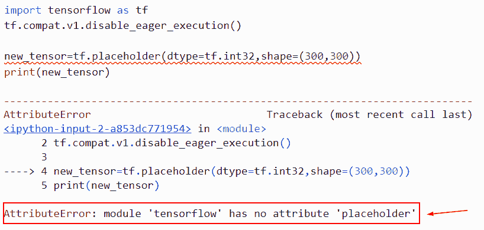

attributeerror module tensorflow has no attribute placeholder

此错误的解决方案

**原因:**此错误的可能原因是 Tensorflow 最新版本(TensorFlow2.0)中没有 `tf.placeholder()` 属性。

**举例**:

```py
import tensorflow as tf
tf.compat.v1.disable_eager_execution()

new_tensor=tf.compat.v1.placeholder(dtype=tf.int32,shape=(300,300))
print(new_tensor)
```

你可以参考下面的截图

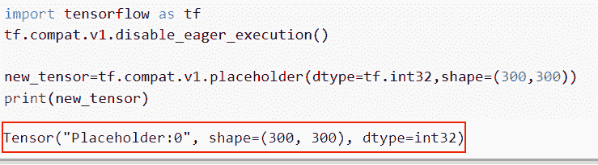

Solution of attributeerror module tensorflow has no attribute placeholder

阅读: [Python TensorFlow one_hot](https://pythonguides.com/tensorflow-one_hot/)

## Attributeerror 模块“tensorflow”没有属性“isnan”

*   Python 中内置的数学函数 *`isnan()`* 可以用来判断输入是否为合法数字。
*   要使用数学库的一部分 *`isnan()`* 函数，如果元素是 nan，则返回 true，否则返回 false。

**举例**:

```py
import tensorflow as tf
import numpy as np

# Creation of input tensor
tens = tf.constant([16, 67, 34, 178, np.inf], dtype = tf.float64)

# Calculating the nan value
new_output = tf.is_nan(tens)

# Printing the result
print('Result: ', new_output)
```

下面是下面给出的代码的截图。

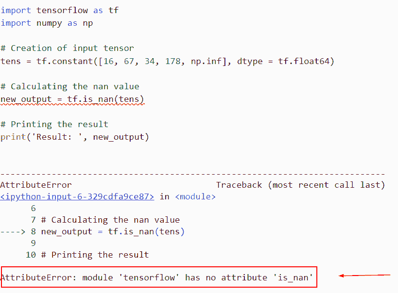

attributeerror module tensorflow has no attribute isnan

以下是此错误的解决方案。

```py
import tensorflow as tf
import numpy as np

# Creation of input tensor
tens = tf.constant([16, 67, 34, 178, np.inf], dtype = tf.float64)

# Calculating the nan value
new_output = tf.math.is_nan(tens)

# Printing the result
print('Result: ', new_output) 
```

在下面给出的代码中，我们首先使用 tf.constant()函数导入了输入张量，在这个函数中，我们将 datatype 指定为参数。

之后，我们使用了 `tf.math.is_nan()` ，在这个函数中，我们将输入张量作为参数传递。

下面是以下给定代码的执行。

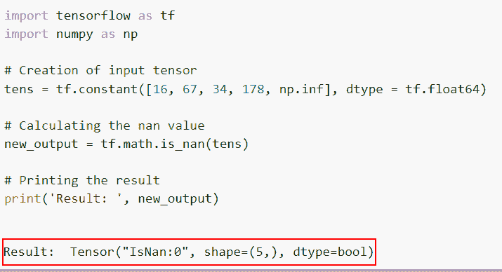

Solution of attributeerror module tensorflow has no attribute isnan

您可能也喜欢阅读以下 Python TensorFlow 教程。

*   [Python TensorFlow 随机均匀](https://pythonguides.com/tensorflow-random-uniform/)
*   [TensorFlow Tensor to numpy](https://pythonguides.com/tensorflow-tensor-to-numpy/)
*   [模块“张量流”没有属性“会话”](https://pythonguides.com/module-tensorflow-has-no-attribute-session/)
*   [导入错误没有名为 TensorFlow 的模块](https://pythonguides.com/import-error-no-module-named-tensorflow/)
*   [模块“tensorflow”没有属性“get _ variable”](https://pythonguides.com/module-tensorflow-has-no-attribute-get_variable/)

在本 Python 教程中，我们重点讨论了如何修复 attributeerror:模块 tensorflow 在 TensorFlow 中没有属性 ***'* div'** ，我们还将看一些如何在 *`TensorFlow`* 中使用 `tf.div()` 函数的示例。我们已经讨论了这些主题。

*   Attributeerror:模块“tensorflow”没有属性“div”
*   Attributeerror:模块“tensorflow”没有属性“dimension”
*   Attributeerror:模块“tensorflow”没有属性“count _ 非零”
*   Attributeerror:模块“tensorflow”没有属性“lin_space”

[Bijay Kumar](https://pythonguides.com/author/fewlines4biju/)

Python 是美国最流行的语言之一。我从事 Python 工作已经有很长时间了，我在与 Tkinter、Pandas、NumPy、Turtle、Django、Matplotlib、Tensorflow、Scipy、Scikit-Learn 等各种库合作方面拥有专业知识。我有与美国、加拿大、英国、澳大利亚、新西兰等国家的各种客户合作的经验。查看我的个人资料。

[enjoysharepoint.com/](https://enjoysharepoint.com/)[](https://www.facebook.com/fewlines4biju "Facebook")[](https://www.linkedin.com/in/fewlines4biju/ "Linkedin")[](https://twitter.com/fewlines4biju "Twitter")