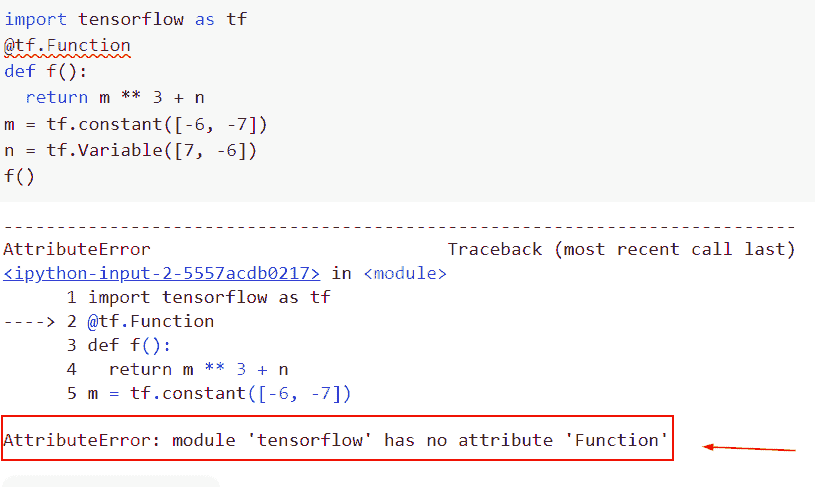
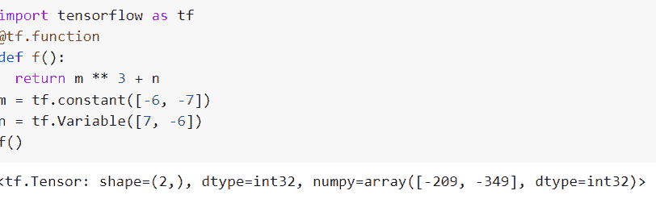
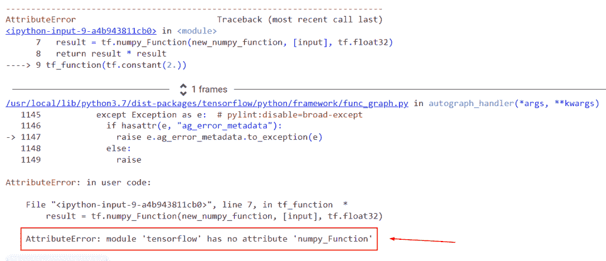
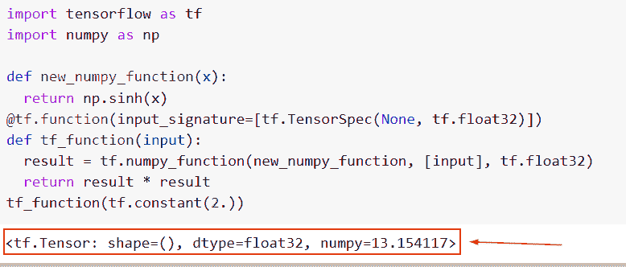
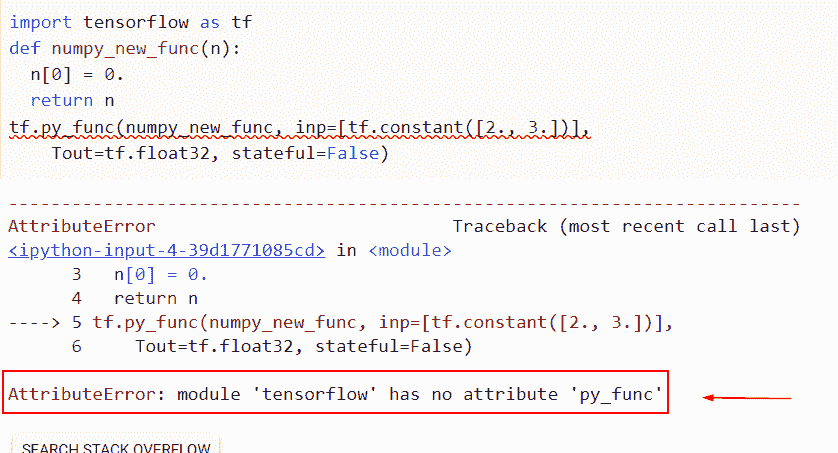
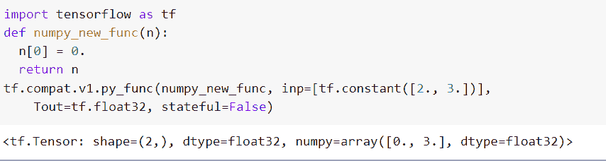

# 模块“tensorflow”没有属性“Function”

> 原文：<https://pythonguides.com/module-tensorflow-has-no-attribute-function/>

[](https://sharepointsky.teachable.com/p/python-and-machine-learning-training-course)

在本 [Python 教程](https://pythonguides.com/learn-python/)中，我们将重点讨论如何修复 ***属性错误:模块“tensorflow”在我们的模型中没有属性`* *`【函数】*** ，我们还将看一些如何在 *`TensorFlow`* 中使用`*TF . Function()*`函数的例子。我们将讨论这些话题。

*   Attributeerror:模块“tensorflow”没有属性“Function”
*   Attributeerror:模块“tensorflow”没有属性“numpy function”
*   Attributeerror:模块“tensorflow”没有属性“py_function”

目录

[](#)

*   [属性错误:模块“tensorflow”没有属性“Function”](#Attributeerror_module_tensorflow_has_no_attribute_Function "Attributeerror: module ‘tensorflow’ has no attribute ‘Function’")
*   [属性错误:模块“tensorflow”没有属性“numpy _ Function”](#Attributeerror_module_tensorflow_has_no_attribute_numpy_Function "Attributeerror: module ‘tensorflow’ has no attribute ‘numpy_Function’")
*   [属性错误:模块“tensorflow”没有属性“py _ func”](#Attributeerror_module_tensorflow_has_no_attribute_py_func "Attributeerror: module ‘tensorflow’ has no attribute ‘py_func’")

## 属性错误:模块“tensorflow”没有属性“Function”

*   在本节中，我们将讨论 attributeerror 模块“tensorflow”没有属性“function”。
*   您可以使用 **tf.function()创建脚本图。**它是一个转换工具，可以将你的 Python 代码转换成独立于 Python 的数据流图。为了使用 SavedModel，您必须这样做，这将有助于创建可移植的和有效的模型。

**举例**:

```py
import tensorflow as tf
@tf.Function
def f():
  return m ** 3 + n
m = tf.constant([-6, -7])
n = tf.Variable([7, -6])
f()
```

下面是以下给定代码的实现



Attributeerror module ‘tensorflow’ has no attribute ‘Function’

以下是此错误的解决方案。

在这个例子中，我们将使用 `tf.function()` ，这个函数用于将一个函数编译成一个可调用的张量流图。

**语法**:

下面是 Python TensorFlow 中 `tf.function()` 的语法

```py
tf.function(
    func=None,
    input_signature=None,
    autograph=True,
    jit_compile=None,
    reduce_retracing=False,
    experimental_implements=None,
    experimental_autograph_options=None,
    experimental_relax_shapes=None,
    experimental_compile=None,
    experimental_follow_type_hints=None
) 
```

*   它由几个参数组成
    *   `func` :待编译函数。在 func 为 None 的情况下， `tf.function()` 提供了一个只需要一个参数的装饰器:func。换句话说，TF . func(func，输入签名)和 TF . func(func，输入签名)是相等的。
    *   `input_signature` :将要发送给这个函数的张量的形状和数据类型由一个可能的 tf 嵌套序列定义。TensorSpec 对象。对于每个推断的输入签名，如果没有，则创建一个单独的函数。如果给定了输入签名，func 的每个输入必须是张量；func 不能接受*** *克沃格**。
    *   **自动签名**:在绘制图形之前是否对 func 应用自动签名。Python 控制流语句依赖于数据需求，默认情况下 `autograph=True` 。
    *   `jit_compile` :如果为真，使用 XLA 编译函数。XLA 执行编译器优化，如融合，并试图发出更有效的代码。
    *   `reduce _ retracting`:true 时 `tf.function()` 尝试使用通用形状减少缩进的值。
    *   `experimental_implements` :如果给定了的话，它实现的一个函数的名字作为说明。这作为属性保存在推理函数中，在处理序列化函数时可以找到。
    *   `experimental _ autograph _ options`:可选参数，实验函数值。
    *   `experimental_compile` :是 jit 编译，被该函数删除。

**举例**:

```py
import tensorflow as tf
@tf.function
def f():
  return m ** 3 + n
m = tf.constant([-6, -7])
n = tf.Variable([7, -6])
f()
```

在下面给出的代码中，我们首先导入了 tensorflow 库，然后使用了 `tf.function()` 并用 `f()` 名称定义了函数。接下来，我们将通过使用 `tf.constant()` 和 **tf 来声明两个张量。变量()**。

下面是以下给定代码的输出。



Solution of Attributeerror module ‘tensorflow’ has no attribute ‘Function’

这就是我们解决 attributeerror 模块“tensorflow”没有属性“Function”的方法。

阅读:[模块“tensorflow”没有属性“div”](https://pythonguides.com/module-tensorflow-has-no-attribute-div/)

## 属性错误:模块“tensorflow”没有属性“numpy _ Function”

*   这里我们将讨论 attributeerror 模块 tensorflow 没有属性‘numpy _ function’。
*   一个 Python 函数，将 numpy.ndarray 对象作为输入，并输出这些项目的列表(或单个 numpy。ndarray)。这个函数的参数类型必须与相关 tf 的参数类型相匹配，并且它必须接受与张量一样多的参数。

**举例**:

```py
import tensorflow as tf
import numpy as np 

def new_numpy_function(x):
  return np.sinh(x)
@tf.function(input_signature=[tf.TensorSpec(None, tf.float32)])
def tf_function(input):
  result = tf.numpy_Function(new_numpy_function, [input], tf.float32)
  return result * result
tf_function(tf.constant(2.))
```

下面是以下给定代码的执行过程



Attributeerror module tensorflow has no attribute numpy_Function

以下是此错误的解决方案。

在这个例子中，我们将使用 `tf.numpy_function()` ，这个函数被封装在一个 python 函数中，用作 TensorFlow 操作。

**语法**:

```py
tf.numpy_function(
    func, inp, Tout, stateful=True, name=None
)
```

*   它由几个参数组成
    *   `func` :待编译函数。在 func 为 None 的情况下， `tf.function()` 提供了一个只需要一个参数的装饰器:func。换句话说，TF . func(func，输入签名)和 TF . func(func，输入签名)是相等的。
    *   `inp` :是张量对象列表。
    *   `Tout` :单个 tensorflow 数据类型，如果只有一个，或者 tensorflow 数据类型的列表或元组，指定函数返回。
    *   **有状态**:
        *   默认情况下，需要真值和运行时才能将函数视为无状态。通过将此参数设置为 False，可以进行一些优化。
        *   当给定相同的输入和输出时，无状态函数返回相同的结果，并且没有副作用；它的目的是有一个返回值。
        *   给定有状态参数 False 时，有状态函数的行为是未指定的。因为这是一个有状态的过程，所以在修改输入参数时应该特别小心。

```py
import tensorflow as tf
import numpy as np 

def new_numpy_function(x):
  return np.sinh(x)
@tf.function(input_signature=[tf.TensorSpec(None, tf.float32)])
def tf_function(input):
  result = tf.numpy_function(new_numpy_function, [input], tf.float32)
  return result * result
tf_function(tf.constant(2.))
```

在下面给出的代码中，我们首先导入了 tensorflow 库，然后定义了一个函数(new_numpy_function ),在这个函数中，我们为它分配了**‘x’**变量。

你可以参考下面的截图。



Solution of Attributeerror module tensorflow has no attribute numpy_Function

截图中可以看到，我们已经解决了 attributerror 模块 TensorFlow 没有属性 numpy_Function。

读取:[属性错误:模块“tensorflow”没有属性“mul”](https://pythonguides.com/module-tensorflow-has-no-attribute-mul/)

## 属性错误:模块“tensorflow”没有属性“py _ func”

*   可以使用 tf.py func()运算符在张量流图中执行任何 Python 代码。
*   这对于包装唯一的 NumPy 操作特别有用，因为目前没有可比较的 TensorFlow 操作符。图内的 `Sess.run()` 调用可以通过添加 `tf.py func()` 来代替。

**举例:**

```py
import tensorflow as tf
def numpy_new_func(n):
  n[0] = 0.
  return n
tf.py_func(numpy_new_func, inp=[tf.constant([2., 3.])],
    Tout=tf.float32, stateful=False)
```

你可以参考下面的截图



Attributeerror module tensorflow has no attribute py_func

以下是此错误的解决方案。

在本例中，我们将使用 `tf.compat.v1.py_func()` ，它是一个接近但等价于包装函数的张量流张量，而不是 NumPy 数组，后者可以受益于加速器并提供梯度。

**语法**:

我们先来看看语法，了解一下**在 Python TensorFlow 中 tf.compat.v1.py_func()** 函数的工作原理。

```py
tf.compat.v1.py_func(
    func, inp, Tout, stateful=True, name=None
)
```

示例:

```py
import tensorflow as tf
def numpy_new_func(n):
  n[0] = 0.
  return n
tf.compat.v1.py_func(numpy_new_func, inp=[tf.constant([2., 3.])],
    Tout=tf.float32, stateful=False)
```

你可以参考下面的截图。



Solution of Attributeerror module tensorflow has no attribute py_func

这就是我们解决 attributeerror 模块 tensorflow 没有属性 py_func 的方法。

还有，多看看一些 Tensorflow 教程。

*   [TensorFlow 学习率调度器](https://pythonguides.com/tensorflow-learning-rate-scheduler/)
*   [Tensorflow 将字符串转换为整型](https://pythonguides.com/tensorflow-convert-string-to-int/)
*   [批量归一化张量流](https://pythonguides.com/batch-normalization-tensorflow/)
*   [TensorFlow feed_dict + 9 个例子](https://pythonguides.com/tensorflow-feed_dict/)
*   [tensor flow next _ batch+Examples](https://pythonguides.com/tensorflow-next_batch/)

在本 Python 教程中，我们重点讨论了如何修复 ***属性错误:模块 tensorflow 在我们的模型中没有属性`* *`【函数】*** ，我们还将看一些如何在 *`TensorFlow`* 中使用 *`tf.function()`* 函数的例子。我们已经讨论了这些主题。

*   Attributeerror:模块“tensorflow”没有属性“numpy function”
*   Attributeerror:模块“tensorflow”没有属性“py_function”

[Bijay Kumar](https://pythonguides.com/author/fewlines4biju/)

Python 是美国最流行的语言之一。我从事 Python 工作已经有很长时间了，我在与 Tkinter、Pandas、NumPy、Turtle、Django、Matplotlib、Tensorflow、Scipy、Scikit-Learn 等各种库合作方面拥有专业知识。我有与美国、加拿大、英国、澳大利亚、新西兰等国家的各种客户合作的经验。查看我的个人资料。

[enjoysharepoint.com/](https://enjoysharepoint.com/)[](https://www.facebook.com/fewlines4biju "Facebook")[](https://www.linkedin.com/in/fewlines4biju/ "Linkedin")[](https://twitter.com/fewlines4biju "Twitter")