# 模块“TensorFlow”没有属性“get_default_graph”

> 原文：<https://pythonguides.com/module-tensorflow-has-no-attribute-get_default_graph/>

[](https://sharepointsky.teachable.com/p/python-and-machine-learning-training-course)

在本 [Python 教程](https://pythonguides.com/learn-python/)中，我们将讨论错误“**模块‘tensor flow’没有属性‘get _ default _ graph’**”。在这里，我们将使用 TensorFlow 来解释与此错误相关的原因。我们还将讨论以下主题:

*   模块“TensorFlow”没有属性“get_default_graph”
*   模块“tensorflow”没有属性“get_variable”
*   模块“tensorflow”没有属性“get_default_session”
*   模块“tensorflow”没有属性“get _ default _ graph”keras
*   模块“tensorflow”没有属性“get_variable_scope”
*   模块“tensorflow”没有属性“get_shape”
*   模块“tensorflow”没有属性“get_tensor_by name”
*   模块“tensorflow”没有属性“make_tensor_proto”
*   模块“tensorflow”没有属性“get_collection”
*   模块“tensorflow”没有属性“mean_squared_error”
*   模块“tensorflow”没有属性“placeholder”

目录

[](#)

*   [模块' tensorflow '没有属性' get_default_graph'](#Module_tensorflow_has_no_attribute_get_default_graph "Module ‘tensorflow’ has no attribute ‘get_default_graph’")
*   [模块“TensorFlow”没有属性“get _ variable”](#Module_TensorFlow_has_no_attribute_get_variable "Module ‘TensorFlow’ has no attribute ‘get_variable’")
*   [模块“tensorflow”没有属性“get _ default _ session”](#Module_tensorflow_has_no_attribute_get_default_session "Module ‘tensorflow’ has no attribute ‘get_default_session’")
*   [模块“tensorflow”没有属性“get _ variable _ scope”](#Module_tensorflow_has_no_attribute_get_variable_scope "Module ‘tensorflow’ has no attribute ‘get_variable_scope’")
*   [模块“tensorflow”没有属性“get _ shape”](#Module_tensorflow_has_no_attribute_get_shape "Module ‘tensorflow’ has no attribute ‘get_shape’")
*   [模块‘tensor flow’没有属性‘get _ tensor _ by name’](#Module_tensorflow_has_no_attribute_get_tensor_by_name "Module ‘tensorflow’ has no attribute ‘get_tensor_by name’")
*   [模块' tensorflow '没有属性' make_tensor_proto'](#Module_tensorflow_has_no_attribute_make_tensor_proto "Module ‘tensorflow’ has no attribute ‘make_tensor_proto’")
*   [模块“tensorflow”没有属性“get _ collection”](#Module_tensorflow_has_no_attribute_get_collection "Module ‘tensorflow’ has no attribute ‘get_collection’")
*   [模块‘tensor flow’没有属性‘mean _ squared _ error’](#Module_tensorflow_has_no_attribute_mean_squared_error "Module ‘tensorflow’ has no attribute ‘mean_squared_error’")
*   [模块“张量流”没有属性“占位符”](#Module_tensorflow_has_no_attribute_placeholder "Module ‘tensorflow’ has no attribute ‘placeholder’")

## 模块' tensorflow '没有属性 **'** get_default_graph'

在本节中，我们将讨论错误 **AttributeError:模块' [Tensorflow](https://pythonguides.com/tensorflow/) '在 Python 中没有属性' get_default_graph'** 。

**举例:**

```py
import tensorflow as tf

tensor1 = tf.Variable(4)
tensor2 = tf.Variable(6)
tensor3 = tf.Variable(3)
result = (tensor1 + tensor2) * tensor3

for result in tf.get_default_graph().get_operations():
    print (result.name)
```

下面是以下给定代码的实现。

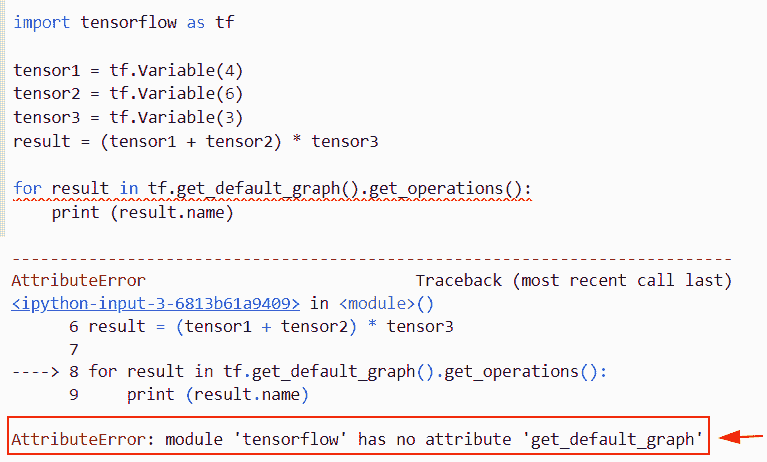

module ‘TensorFlow’ has no attribute ‘get_default_graph’

正如您在屏幕截图中看到的，输出显示错误 **AttributeError:模块‘tensor flow’**没有属性**‘get _ default _ graph’**。

**原因:**该错误的可能原因是 Tensorflow 最新版本(TensorFlow2.0)中没有 tf.get_default_graph()属性。

现在让我们看看这个错误的解决方案

**举例:**

```py
import tensorflow as tf

tensor1 = tf.Variable(4)
tensor2 = tf.Variable(6)
tensor3 = tf.Variable(3)
result = (tensor1 + tensor2) * tensor3

for result in tf.compat.v1.get_default_graph().get_operations():
    print (result.name)
```

在下面给出的代码中，我们已经导入了 TensorFlow 库，然后使用 `tf.variable()` 函数创建了操作。之后，我们使用了`TF . compat . v1 . get _ default _ graph()`函数并将结果变量存储为参数。

下面是以下给定代码的执行。

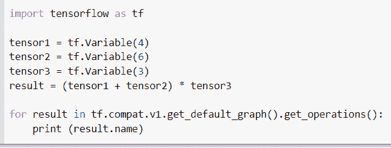

Solution of module ‘TensorFlow’ has no attribute ‘get_default_graph’

另外，请阅读:[导入错误没有名为 TensorFlow 的模块](https://pythonguides.com/import-error-no-module-named-tensorflow/)

## 模块“TensorFlow”没有属性“get _ variable”

*   这里我们要讨论的是错误 **Attributeerror 模块‘tensor flow’没有属性****【get _ variable】**。
*   为了执行这个特定的任务，我们将使用 `tf.get_variable()` 函数，这个函数用于获取带有这些参数的给定变量。但该功能仅在 **TensorFlow 1.x 版本**中有效。
*   如果您要在 `TensorFlow 2.x` 版本上执行此函数，那么它将引发一个属性错误。

**举例:**

```py
import tensorflow as tf

tensor = tf.get_variable(name='tens',shape=[1],dtype=tf.int32)
print(tensor)
```

下面是以下给定代码的实现。

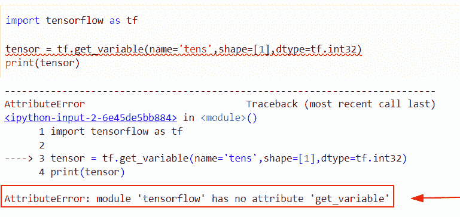

module TensorFlow has no attribute get_variable

**原因:**此错误的原因是最新版本的 TensorFlow 中没有 `tf.get_variable()` 函数。

此错误代码的解决方案:

```py
import tensorflow as tf

tensor = tf.compat.v1.get_variable(name='tens',shape=[1],dtype=tf.int32)
print(tensor)
```

在下面给定的代码中，我们创建了一个名为**‘tensor’**的变量，并为其分配了 t`f . compat . v1 . get _ variable()`函数，在该函数中，我们为其分配了名称和 `dtype` 参数。

下面是下面给出的代码的截图。

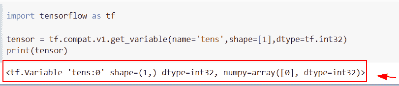

Solution of module TensorFlow has no attribute get_variable

阅读:[模块“张量流”没有属性“会话”](https://pythonguides.com/module-tensorflow-has-no-attribute-session/)

## 模块“tensorflow”没有属性“get _ default _ session”

*   在本节中，我们将讨论 Python 中的错误 **AttributeError:模块' Tensorflow '没有属性' get_default_session'** 。
*   为了完成这项任务，我们将使用 `tf.get_default_session()` 函数来创建会话。在本例中，我们将使用 `*` 运算符执行乘法运算。

**举例:**

```py
import tensorflow as tf
tf.compat.v1.disable_eager_execution()
tens1 = tf.constant(38,dtype="int32",name="tens1")
tens2 = tf.constant(98,dtype="int32",name="tens2")
with tf.get_default_session() as val:
    new_result=val.run(tens1*tens2)
    print(new_result)
```

在上面的代码中，我们导入了 TensorFlow 库，然后使用了 `tf.constant()` 函数，在这个函数中，我们将值和类型指定为参数。

你可以参考下面的截图。

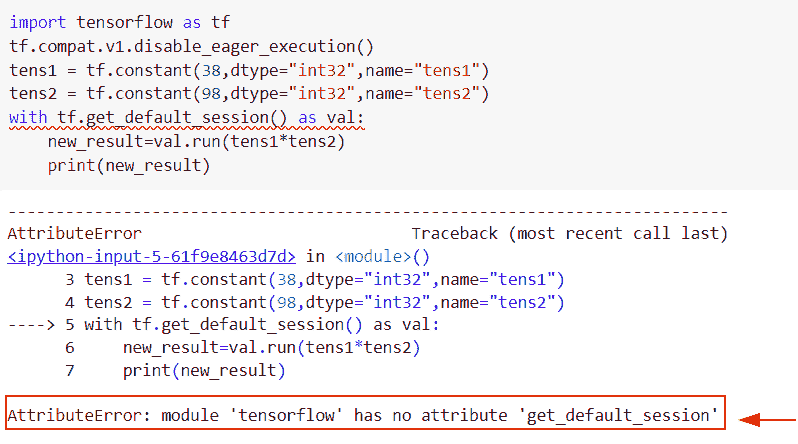

module TensorFlow has no attribute get_default_session

**原因:**此错误的原因是最新版本的 TensorFlow 中没有 `tf.get_variable()` 函数。

**解决方案:**

```py
import tensorflow as tf
tf.compat.v1.disable_eager_execution()
tens1 = tf.constant(38,dtype="int32",name="tens1")
tens2 = tf.constant(98,dtype="int32",name="tens2")
with tf.compat.v1.Session() as val:
    new_result=val.run(tens1*tens2)
    print(new_result)
```

下面是以下给定代码的实现。

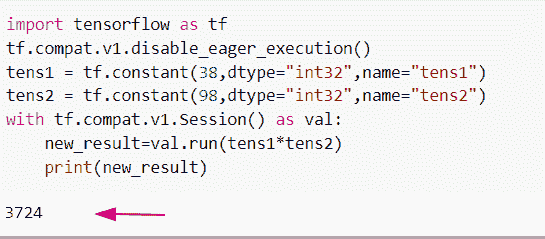

Solution of module tensorflow has no attribute get_default_session

阅读: [TensorFlow Tensor to NumPy](https://pythonguides.com/tensorflow-tensor-to-numpy/)

## 模块“tensorflow”没有属性“get _ variable _ scope”

*   这里我们要讨论的是错误 **Attributeerror 模块‘tensor flow’没有属性****【get _ variable _ scope】**。
*   通过使用 `tf.get_variable_scope()` 函数，我们可以很容易地得到变量的作用域。但是在这个程序中，这个函数不起作用，因为在 `Tensorflow 2.x` 中不存在这个函数。

**举例:**

```py
import tensorflow as tf

with tf.get_variable_scope('tens1'):
    result = tf.zeros((), name='tens2')
    print(result)
```

下面是下面给出的代码的截图。

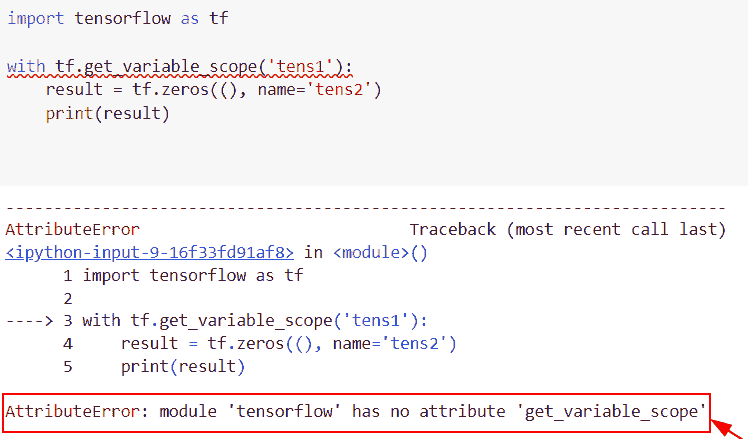

module TensorFlow has no attribute get_variable_scope

正如您在屏幕截图中看到的，输出显示错误 **AttributeError:模块‘tensor flow’**没有属性**‘get _ variable _ scope’**。

R **原因:**该错误的可能原因是 Tensorflow 最新版本(TensorFlow2.0)中没有 tf.get_variable_scope()属性。

现在让我们来看看这个错误的解决方案。

**解决方案:**

```py
import tensorflow as tf

with tf.compat.v1.variable_scope('tens1'):
    result = tf.zeros((), name='tens2')
    print(result)
```

在上面的代码中，我们导入了 TensorFlow 库，然后使用了`TF . compat . v1 . variable _ scope()`函数，在这个函数中，我们指定了张量名称。

下面是以下给定代码的执行。

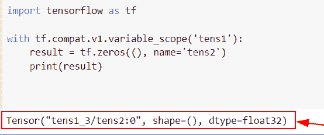

Solution of module TensorFlow has no attribute get_variable_scope

阅读:[Python tensor flow reduce _ sum](https://pythonguides.com/python-tensorflow-reduce_sum/)

## 模块“tensorflow”没有属性“get _ shape”

*   本节我们将讨论错误 AttributeError: **模块' Tensorflow '在 Python 中没有属性' get_shape'** 。
*   为了完成这个任务，我们将使用 `tf.get_shape()` 函数，这个函数将帮助用户获得输入张量的形状。
*   但在这个程序中，这个功能在 `Tensorflow 2.x` 版本中不起作用。

**举例:**

```py
import tensorflow as tf

tensor = tf.constant([[[15, 67, 89], [34, 27, 89]], 
                [[45, 89, 189], [68, 91, 46]]])

result=tf.get_shape(tensor)
result 
```

下面是以下给定代码的实现。

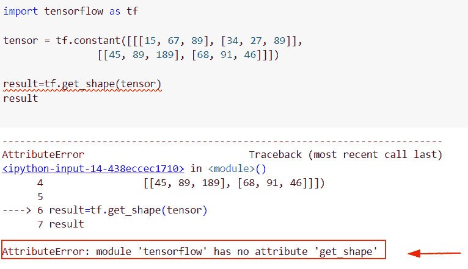

module TensorFlow has no attribute get_shape

正如您在屏幕截图中看到的，输出显示错误 **AttributeError:模块‘tensor flow’**没有属性**‘get _ shape’**。

**原因:**该错误的可能原因是 Tensorflow 最新版本(TensorFlow2.0)中没有 `tf.get_shape()` 属性。

**解决方案:**

```py
import tensorflow as tf

tensor = tf.constant([[[15, 67, 89], [34, 27, 89]], 
                [[45, 89, 189], [68, 91, 46]]])

result=tf.shape(tensor)
result 
```

下面是以下给定代码的执行。

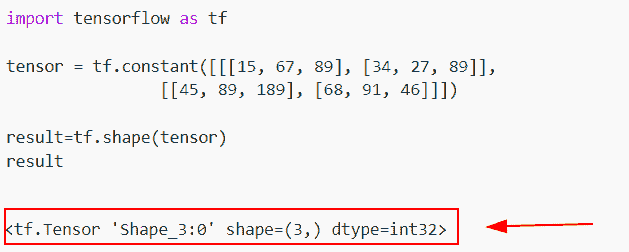

Solution of module TensorFlow has no attribute get_shape

阅读:[张量流均方误差](https://pythonguides.com/tensorflow-mean-squared-error/)

## 模块‘tensor flow’没有属性‘get _ tensor _ by name’

*   本节我们将讨论错误 AttributeError: **模块' Tensorflow '在 Python 中没有属性' get_tensor_by name'** 。
*   为了执行这个特定的任务，我们将使用 `tf.get_tensor_by_name()` ，这个函数返回所有的张量名称。
*   这个函数在 `TensorFlow 2.x` 版本中并不存在，我们将使用`TF . compat . v1 . get _ default _ graph()`函数。

**举例:**

```py
import tensorflow as tf
tf.compat.v1.disable_eager_execution()
tensor1 = tf.constant([[17, 18], [19, 20]])
tensor2 = tf.constant([[21, 22], [23, 24]])
tensor3 = tf.matmul(tensor1, tensor2, name='tens')

with tf.compat.v1.Session() as sess:
    new_output =  sess.run(tensor3)
    print (tensor3.name) 
    new_output = tf.get_tensor_by_name("tens")
    print (new_output)
```

下面是下面给出的代码的截图。

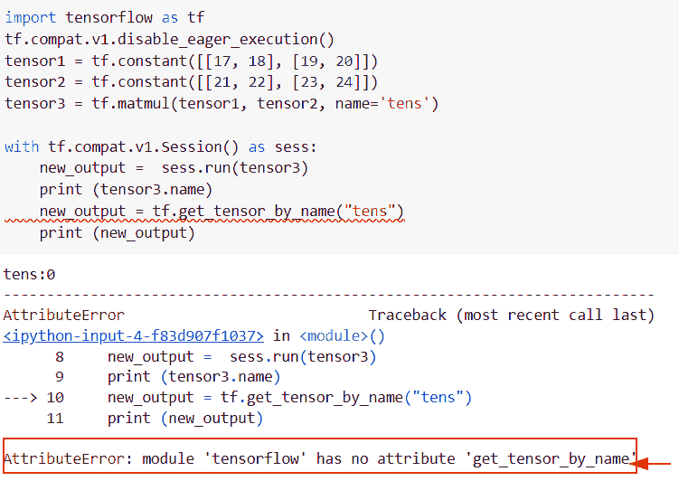

module TensorFlow has no attribute get_tensor_by-name

正如您在屏幕截图中看到的，输出显示错误 **AttributeError:模块“tensor flow”**没有属性“ `get_tensor_by_name` ”。

**原因:**该错误的可能原因是 Tensorflow 最新版本(TensorFlow2.0)中没有 `tf.get_tensor_by_name()` 属性。

**解决方案:**

```py
import tensorflow as tf
tf.compat.v1.disable_eager_execution()

tensor1 = tf.constant([[17, 18], [19, 20]])
tensor2 = tf.constant([[21, 22], [23, 24]])
tensor3 = tf.matmul(tensor1, tensor2, name='example')

with tf.compat.v1.Session() as val:
    result =  val.run(tensor3)
    print (tensor3.name)
    result = tf.compat.v1.get_default_graph().get_tensor_by_name("example:0")
    print (result)
```

在下面的代码中，我们导入了 TensorFlow 库，然后使用 `tf.constant()` 函数创建了张量。创建张量后，我们已经应用了 `matmul()` 函数进行乘法运算。

下面是以下给定代码的输出。

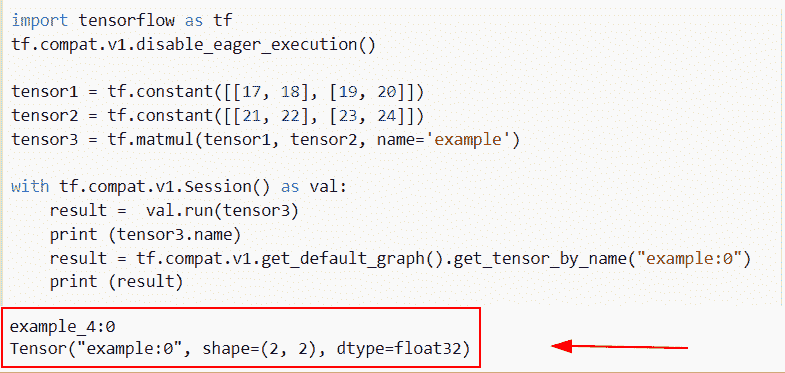

Solution of module TensorFlow has no attribute get_tensor_by name

阅读: [Python TensorFlow 占位符](https://pythonguides.com/tensorflow-placeholder/)

## 模块' tensorflow '没有属性' make_tensor_proto'

*   这里我们要讨论的错误模块' TensorFlow '在 Python 中没有属性 **'make_tensor_proto'** 。
*   这个函数将帮助用户创建一个 TensorProto，它用于计算一个 numpy 数组。

**举例:**

```py
import tensorflow as tf

new_val = tf.constant([[25,37,89],[56,14,90]])
result = tf.make_tensor_proto_(new_val)
print(result)
```

下面是下面给出的代码的截图。

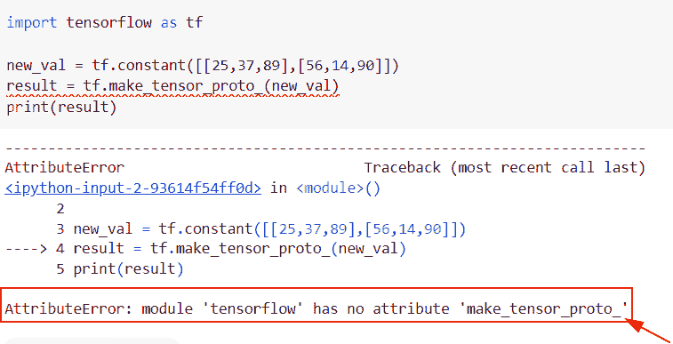

module TensorFlow has no attribute make_tensor_proto

正如您在屏幕截图中看到的，输出显示错误 **AttributeError:模块‘tensor flow’**没有属性**‘make _ tensor _ proto’**。

**解决方案:**

```py
import tensorflow as tf

new_val = tf.constant([[25,37,89],[56,14,90]])
result = tf.make_tensor_proto(new_val)
print(result)
```

在下面给定的代码中，我们导入了 TensorFlow 库，然后使用 tf.constant()函数创建了一个张量，在这个函数中，我们只给整数赋值。

创建张量后，我们使用了 tf.make_tensor_proto()函数，在这个函数中，我们将张量作为参数传递。

你可以参考下面的截图。

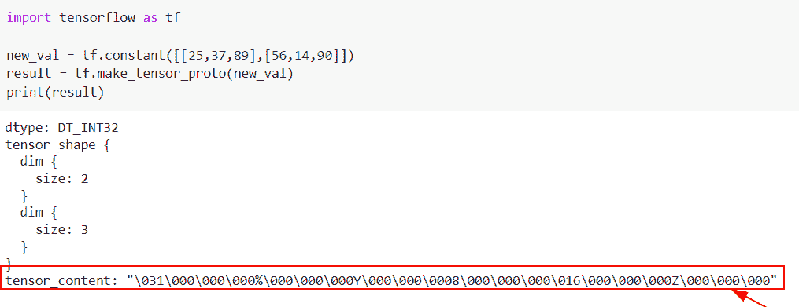

Solution of module TensorFlow has no attribute make_tensor_proto

阅读: [Tensorflow 迭代张量](https://pythonguides.com/tensorflow-iterate-over-tensor/)

## 模块“tensorflow”没有属性“get _ collection”

*   在本节中，我们将讨论 Python 中的错误模块**‘tensor flow’没有属性‘get _ collection’**。
*   为了完成这个任务，我们将使用 `tf.get_collection()` 函数，这个函数使用默认的图形。

**举例:**

```py
import tensorflow as tf

with tf.compat.v1.variable_scope('my_scope'):
    tens = tf.Variable(0)

print (tf.get_collection(tf.compat.v1.GraphKeys.GLOBAL_VARIABLES, scope='my_scope'))
```

在上面的代码中，我们已经导入了 TensorFlow 库，然后使用了`TF . compat . v1 . variable _ scope()`函数 **('my_scope')** 。

下面是以下给定代码的实现。

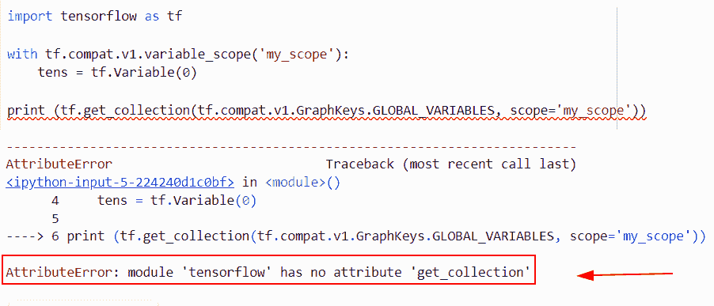

module tensorflow has no attribute get_collection

正如您在屏幕截图中看到的，输出显示错误 **AttributeError:模块‘tensor flow’**没有属性**‘get _ collection’**。

**原因:**该错误的可能原因是 Tensorflow 最新版本(TensorFlow2.0)中没有 `tf.get_collection()` 属性。

**解决方案:**

```py
import tensorflow as tf

with tf.compat.v1.variable_scope('my_scope'):
    tens = tf.Variable(0)

print (tf.compat.v1.get_collection(tf.compat.v1.GraphKeys.GLOBAL_VARIABLES, scope='my_scope'))
```

在下面给出的代码中，我们使用了`TF . compat . v1 . get _ collection()`方法。

下面是以下给定代码的执行。

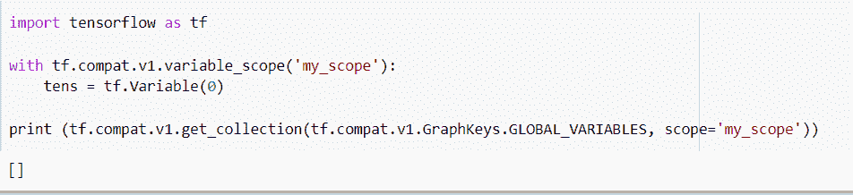

Solution of module tensorflow has no attribute get_collection

阅读:[将列表转换为张量张量流](https://pythonguides.com/convert-list-to-tensor-tensorflow/)

## 模块‘tensor flow’没有属性‘mean _ squared _ error’

*   在这里，我们将讨论 Python 中的错误模块“tensorflow”没有属性“mean_squared_error”。
*   为了执行这个特定的任务，我们将使用 `tf.mean_squared_error()` 函数，该函数用于插入给定标签和预测的平方和。

**举例:**

```py
import tensorflow as tf

y_true = tf.constant([[4.6, 7.3, 3.2],
                      [4.1,5.8,7.2]])
y_pred = tf.constant([[2.4, 4.6, 9.7],
                      [1.2,2.3,1.6]])

result=tf.mean_squared_error(y_true,y_pred)
print("Reduce mean squared error:",result)
```

下面是下面给出的代码的截图。

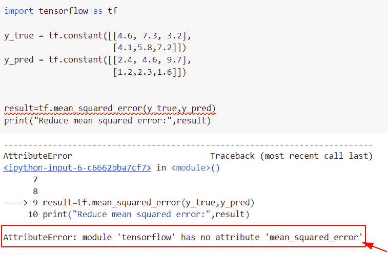

module tensorflow has no attribute mean_squared_error

正如您在屏幕截图中看到的，输出显示错误 **AttributeError:模块‘tensor flow’**没有属性**‘mean _ squared _ error’**。

**原因:**该错误的可能原因是 Tensorflow 最新版本(TensorFlow2.0)中没有 `tf.mean_squared_error()` 属性。

**解决方案:**

```py
import tensorflow as tf

y_true = tf.constant([[4.6, 7.3, 3.2],
                      [4.1,5.8,7.2]])
y_pred = tf.constant([[2.4, 4.6, 9.7],
                      [1.2,2.3,1.6]])

result=tf.compat.v1.losses.mean_squared_error(y_true,y_pred)
print("Reduce mean squared error:",result)
```

在下面给出的代码中，我们使用了`TF . compat . v1 . losses . mean _ squared _ error()`函数。

下面是以下给定代码的输出。

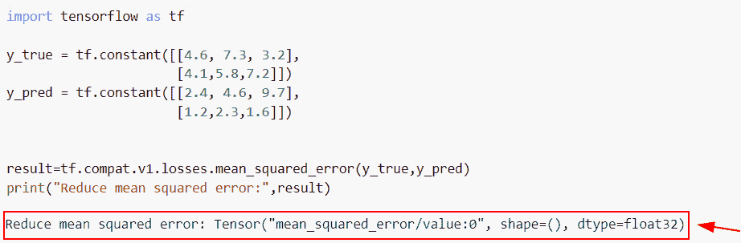

Solution of module tensorflow has no attribute mean_squared_error

阅读: [Python TensorFlow 截断法线](https://pythonguides.com/tensorflow-truncated-normal/)

## 模块“张量流”没有属性“占位符”

*   在本节中，我们将讨论 Python 中的错误模块“tensorflow”没有属性**“placeholder”**。
*   该函数用于提供操作数据并生成我们的计算图。

**举例:**

```py
import tensorflow as tf
tf.compat.v1.disable_eager_execution()

tens=tf.placeholder(dtype=tf.int32,shape=(300,300))
print(tens)
```

在上面的代码中，我们已经导入了 TensorFlow 库，然后使用`TF . compat . v1 . disable _ eager _ execution()`函数创建了会话。

下面是以下给定代码的实现。

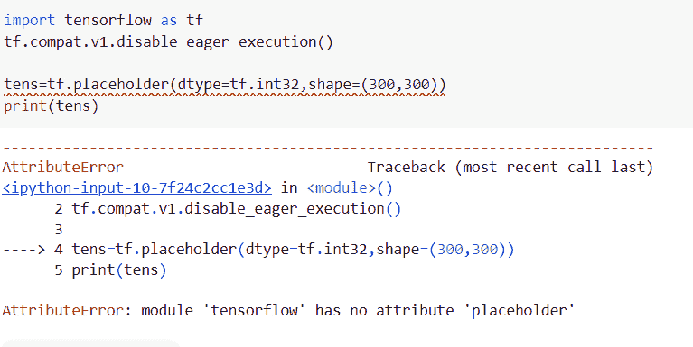

module tensorflow has no attribute placeholder

正如您在屏幕截图中看到的，输出显示错误 **AttributeError:模块‘tensor flow’**没有属性**‘占位符’**。

**原因:**此错误的可能原因是 Tensorflow 最新版本(TensorFlow2.0)中没有 `tf.placeholder()` 属性。

**解决方案:**

```py
import tensorflow as tf
tf.compat.v1.disable_eager_execution()

tens=tf.compat.v1.placeholder(dtype=tf.int32,shape=(300,300))
print(tens)
```

下面是以下给定代码的执行。

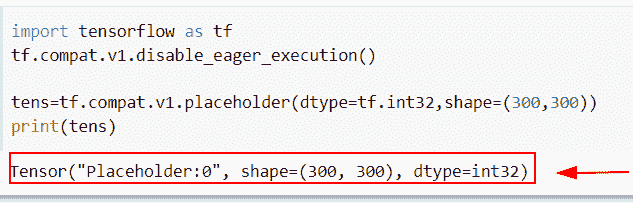

Solution of module tensorflow has no attribute placeholder

另外，请查看以下 Python TensorFlow 教程。

*   [Python tensor flow expand _ dims](https://pythonguides.com/tensorflow-expand_dims/)
*   [Python TensorFlow one_hot](https://pythonguides.com/tensorflow-one_hot/)
*   [模块“tensorflow”没有属性“mul”](https://pythonguides.com/module-tensorflow-has-no-attribute-mul/)
*   [模块“tensorflow”没有属性“get _ variable”](https://pythonguides.com/module-tensorflow-has-no-attribute-get_variable/)
*   [tensor flow clip _ by _ value–完整教程](https://pythonguides.com/tensorflow-clip_by_value/)

在本教程中，我们已经涵盖了错误“**模块‘tensor flow’没有属性‘get _ default _ graph’**”。这里我们已经用 TensorFlow 解释了与这个错误相关的原因。我们还讨论了以下主题:

*   模块“TensorFlow”没有属性“get_default_graph”
*   模块“tensorflow”没有属性“get_variable”
*   模块“tensorflow”没有属性“get_default_session”
*   模块“tensorflow”没有属性“get _ default _ graph”keras
*   模块“tensorflow”没有属性“get_variable_scope”
*   模块“tensorflow”没有属性“get_shape”
*   模块“tensorflow”没有属性“get_tensor_by name”
*   模块“tensorflow”没有属性“make_tensor_proto”
*   模块“tensorflow”没有属性“get_collection”
*   模块“tensorflow”没有属性“mean_squared_error”
*   模块“tensorflow”没有属性“placeholder”

[Bijay Kumar](https://pythonguides.com/author/fewlines4biju/)

Python 是美国最流行的语言之一。我从事 Python 工作已经有很长时间了，我在与 Tkinter、Pandas、NumPy、Turtle、Django、Matplotlib、Tensorflow、Scipy、Scikit-Learn 等各种库合作方面拥有专业知识。我有与美国、加拿大、英国、澳大利亚、新西兰等国家的各种客户合作的经验。查看我的个人资料。

[enjoysharepoint.com/](https://enjoysharepoint.com/)[](https://www.facebook.com/fewlines4biju "Facebook")[](https://www.linkedin.com/in/fewlines4biju/ "Linkedin")[](https://twitter.com/fewlines4biju "Twitter")