# 模块“tensorflow”没有属性“get_variable”

> 原文：<https://pythonguides.com/module-tensorflow-has-no-attribute-get_variable/>

[](https://sharepointsky.teachable.com/p/python-and-machine-learning-training-course)

在这个 [Python 教程](https://pythonguides.com/learn-python/)中，我们将重点关注如何修复 ***属性错误:模块 tensorflow 在我们的模型中没有属性‘get _ variable’***，我们还将看一些如何在 *`TensorFlow`* 中使用`*TF . get _ variable()*`函数的例子。我们将讨论这些话题。

*   Attributeerror 模块“tensorflow”没有属性“get_variable”
*   Attributeerror 模块“tensorflow”没有属性“get_variable_scope”
*   Attributeerror 模块“tensorflow”没有属性“variable_scope”
*   Attributeerror 模块“tensorflow”没有属性“variable”
*   Attributeerror 模块“tensorflow”没有属性“variables_initializer”
*   Attributeerror 模块“tensorflow”没有属性“report _ uninitialized _ variables”
*   Attributeerror 模块“tensorflow”没有属性“trainable _ variables”
*   Attributeerror 模块“tensorflow”没有属性“initalize _ all _ variables”
*   Attributeerror 模块“tensorflow”没有属性“local_variables_initializer”

目录

[](#)

*   [Attributeerror 模块“tensorflow”没有属性“get _ variable”](#Attributeerror_module_tensorflow_has_no_attribute_get_variable " Attributeerror module ‘tensorflow’ has no attribute ‘get_variable’")
*   [Attributeerror 模块“tensorflow”没有属性“get _ variable _ scope”](#Attributeerror_module_tensorflow_has_no_attribute_get_variable_scope "Attributeerror module ‘tensorflow’ has no attribute ‘get_variable_scope’")
*   [Attributeerror 模块“tensorflow”没有属性“variable _ scope”](#Attributeerror_module_tensorflow_has_no_attribute_variable_scope "Attributeerror module ‘tensorflow’ has no attribute ‘variable_scope’")
*   [Attributeerror 模块' tensorflow '没有属性' variable'](#Attributeerror_module_tensorflow_has_no_attribute_variable "Attributeerror module ‘tensorflow’ has no attribute ‘variable’")
*   [Attributeerror 模块“tensorflow”没有属性“variables _ initializer”](#Attributeerror_module_tensorflow_has_no_attribute_variables_initializer "Attributeerror module ‘tensorflow’ has no attribute ‘variables_initializer’")
*   [Attributeerror 模块' tensorflow '没有属性' report _ initialized _ variables '](#Attributeerror_module_tensorflow_has_no_attribute_report_uninitialized_variables "Attributeerror module ‘tensorflow’ has no attribute ‘report_uninitialized_variables’")
*   [Attributeerror 模块‘tensor flow’没有属性‘trainible _ variables’](#Attributeerror_module_tensorflow_has_no_attribute_trainable_variables "Attributeerror module ‘tensorflow’ has no attribute ‘trainable_variables’")
*   [Attributeerror 模块“tensorflow”没有属性“initialize _ all _ variables”](#Attributeerror_module_tensorflow_has_no_attribute_initalize_all_variables "Attributeerror module ‘tensorflow’ has no attribute ‘initalize_all_variables’")
*   [Attributeerror 模块“tensorflow”没有属性“local _ variables _ initializer”](#Attributeerror_module_tensorflow_has_no_attribute_local_variables_initializer "Attributeerror module ‘tensorflow’ has no attribute ‘local_variables_initializer’")

## Attributeerror 模块“tensorflow”没有属性“get _ variable”

*   这里我们要讨论的是错误 **Attributeerror 模块‘tensor flow’没有属性****【get _ variable】**。
*   而不是打电话给 tf。变量，使用函数 tf.get variable()获取或创建一个变量。与 tf 相反。变量，它直接传递值，利用初始化器。一个被称为初始化器的函数接受一个形状，并输出该形状的张量。下面是 TensorFlow 提供的几个初始化器。

示例:

```py
import tensorflow as tf

new_tens = tf.get_variable(name='tens',shape=[2],dtype=tf.int32)
print(new_tens)
```

下面是下面给出的代码的截图。

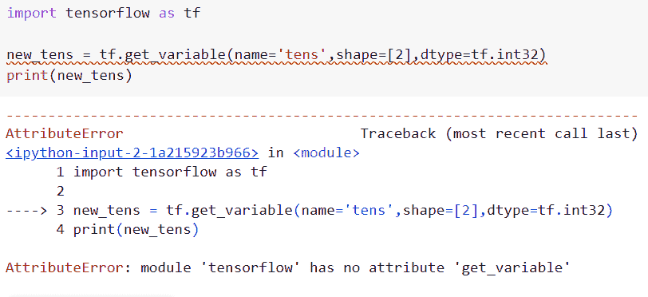

Attributeerror module ‘tensorflow’ has no attribute ‘get_variable’

**原因:**此错误的原因是最新版本的 TensorFlow 中没有 `tf.get_variable()` 函数。

此错误代码的解决方案:

在这个例子中我们将使用`TF . compat . v1 . get _ variable()`函数的概念。

**语法**:

下面是`TF . compat . v1 . get _ variable()`函数的语法。

```py
tf.compat.v1.get_variable(
    name,
    shape=None,
    dtype=None,
    initializer=None,
    regularizer=None,
    trainable=None,
    collections=None,
    caching_device=None,
    partitioner=None,
    validate_shape=True,
    use_resource=None,
    custom_getter=None,
    constraint=None,
    synchronization=tf.VariableSynchronization.AUTO,
    aggregation=tf.compat.v1.VariableAggregation.NONE
)
```

*   它由几个参数组成
    *   **名称**:指定操作的名称。
    *   `shape` :默认情况下，它不取值，定义输入张量的形状。
    *   `dtype` :定义输入张量的数据类型。
    *   **初始值设定项**:如果创建了变量初始值设定项，就会使用它。可以是张量或初始化器对象。如果它是一个张量，那么它的形状必须是已知的，除非 validate shape 为假。
    *   **正则化子** : tf。GraphKeys 将收到将其应用于新形成的变量的结果。您可以使用正则化损失进行正则化。
    *   **可训练的**:如果为真，将变量添加到 GraphKeys 集合中。可训练变量(参见 tf。变量)。
    *   **集合**:添加变量的图形集合键列表。

```py
import tensorflow as tf

new_tens = tf.compat.v1.get_variable(name='new_tens',shape=[2],dtype=tf.int32)
print(new_tens)
```

在上面的代码中，我们导入了别名为“tf”的 tensorflow 库，然后使用了 tf.compat.v1.get_variable()函数，在该函数中，我们将形状和数据类型指定为参数。

你可以参考下面的截图

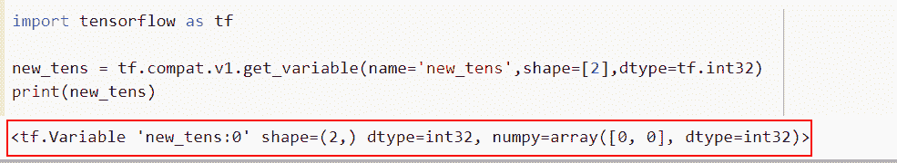

solution of Attributeerror module tensorflow has no attribute get_variable

这就是我们解决 attributeerror 模块“tensorflow”没有属性“get_variable”的方法。

读取:[属性错误:模块“tensorflow”没有属性“mul”](https://pythonguides.com/module-tensorflow-has-no-attribute-mul/)

## Attributeerror 模块“tensorflow”没有属性“get _ variable _ scope”

*   让我们讨论并了解如何解决错误 **Attributeerror 模块‘tensor flow’没有属性****【get _ variable _ scope】**。
*   通过使用 `tf.get_variable_scope()` 函数，我们可以很容易地得到变量的作用域。变量作用域提供检查以防止意外创建或共享，同时允许您共享已经生成的变量和创建新的变量。

**举例**:

```py
import tensorflow as tf

with tf.get_variable_scope('new_tens_1'):
    new_output = tf.zeros((), name='new_tens_2')
    print(new_output)
```

下面是以下给定代码的实现

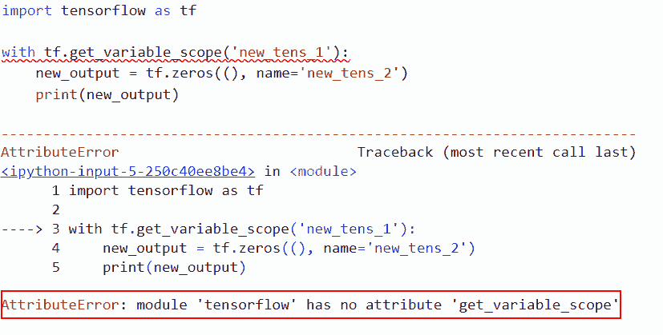

Attributeerror module tensorflow has no attribute get_variable_scope

**原因:**该错误的可能原因是 Tensorflow 最新版本(TensorFlow2.0)中没有 tf.get_variable_scope()属性。

现在让我们来看看这个错误的解决方案。

在这个例子中我们将使用`TF . compat . v1 . get _ variable _ scope()`函数的概念

**语法**:

让我们看一下语法并理解 TF . compat . v1 . get _ variable _ scope()函数的工作原理

```py
tf.compat.v1.get_variable_scope()
```

**注意**:它不带任何参数。

**举例**:

```py
import tensorflow as tf

with tf.compat.v1.variable_scope('new_tens_1'):
    new_output = tf.zeros((), name='new_tens_2')
    print(new_output)
```

在上面的代码中，我们导入了 TensorFlow 库，然后使用了`TF . compat . v1 . variable _ scope()`函数，在这个函数中，我们指定了张量名称。

下面是以下给定代码的实现

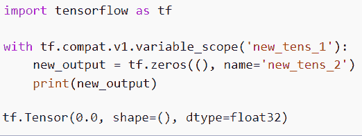

Solution of Attributeerror module tensorflow has no attribute get_variable_scope

正如你在截图中看到的，我们已经解决了 attributeerror 模块 tensorflow 没有属性 get_variable_scope。

阅读:[模块“张量流”没有属性“日志”](https://pythonguides.com/module-tensorflow-has-no-attribute-log/)

## Attributeerror 模块“tensorflow”没有属性“variable _ scope”

*   在本节中，我们将讨论如何解决属性错误模块' tensorflow '没有属性' variable_scope '。
*   为了执行这个特定的任务，我们将使用 `tf.variable_scope()` 函数，该函数仅在 tensorflow 1.x 版本中可用。

**举例**:

在上面的例子中，我们使用了 tf.variable_scope()函数，在这个函数中，我们提到了形状和数据类型作为参数。

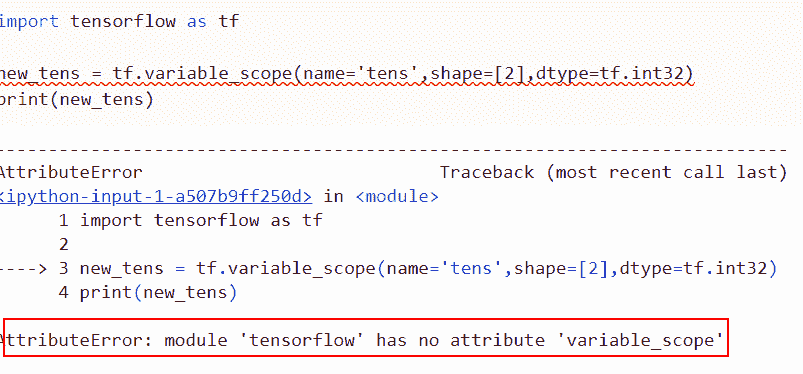

Attributeerror module tensorflow has no attribute variable_scope

以下是此错误的解决方案

这里我们将使用`TF . compat . v1 . variable _ scope()`函数。

**语法**:

```py
tf.compat.v1.variable_scope(
    name_or_scope,
    default_name=None,
    values=None,
    initializer=None,
    regularizer=None,
    caching_device=None,
    partitioner=None,
    custom_getter=None,
    reuse=None,
    dtype=None,
    use_resource=None,
    constraint=None,
    auxiliary_name_scope=True
)
```

*   它由几个参数组成
    *   `name_or_scope` :该参数定义了字符串或变量的作用域。
    *   `default_name` :如果 name 或 scope 参数为 None，则默认使用的名称将是唯一的。名称或范围不是必需的，可以是 None，因为即使提供了也不会被使用。
    *   **值**:op 函数接收的张量的参数列表。
    *   `initializer` :默认情况下，它为这个范围内的变量取 none 值和 initializer。
    *   **正则化**正则化默认为该范围内的变量。

```py
import tensorflow as tf

new_tens = tf.compat.v1.variable_scope(default_name='tens',values=[2,3],dtype=tf.int32, name_or_scope='tens')
print(new_tens)
```

你可以参考下面的截图

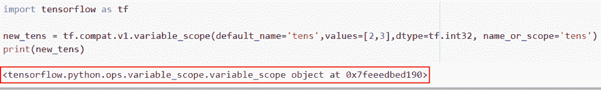

Solution of Attributeerror module tensorflow has no attribute variable_scope

这就是我们解决这个 attributeerror 模块 tensorflow 没有属性 variable_scope。

阅读:[批量归一化张量流](https://pythonguides.com/batch-normalization-tensorflow/)

## Attributeerror 模块' tensorflow '没有属性' variable'

*   任何种类或形状的张量都可以用作 variable()函数对象(){[本机代码] }中变量的初始值。变量的初始值决定了它的类型和形状。
*   一旦建成，形状和变量不能改变。让我们来看几个 TensorFlow 变量创建示例。
*   TensorFlow 中需要变量来表示深度学习模型的参数。基于张量的内存缓冲区称为张量流变量，在多次图形执行中是持久的。
*   变量的值会随着训练的进行而波动，每一个变化都会使模型更接近理想系统。

示例:

```py
import tensorflow as tf

new_tens = tf.variable([2, 2])
print("The shape of the given variable: ",
	new_tens.shape)

# The size of the variable
print("The size of the tensorflow variable:",
	tf.size(new_tens).numpy())
```

下面是以下给定代码的实现。

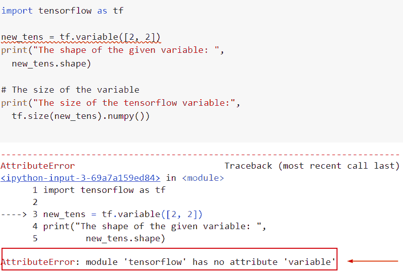

attributeerror module tensorflow has no attribute variable

此错误的解决方案。

```py
import tensorflow as tf

new_tens = tf.Variable([2, 2])
print("The shape of the given variable: ",
	new_tens.shape)

# The size of the variable
print("The size of the tensorflow variable:",
	tf.size(new_tens).numpy()) 
```

你可以参考下面的截图

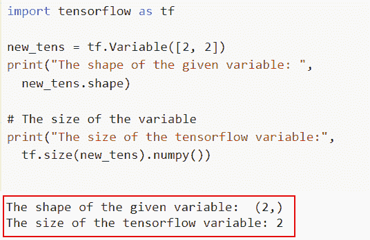

Solution of Attributeerror module tensorflow has no attribute variable

阅读:[张量流自定义损失函数](https://pythonguides.com/tensorflow-custom-loss-function/)

## Attributeerror 模块“tensorflow”没有属性“variables _ initializer”

若要初始化全局变量，请使用 tf。全局变量初始化器()函数。若要初始化局部变量，请使用 tf。局部变量初始化器()函数。

**举例**:

```py
import tensorflow as tf

new_tens = tf.variables_initializer(name='tens')
print(new_tens)
```

在本例中，我们使用了 tf.variables_initializer()函数，该函数在 tensorflow 1.x 版本中可用。

下面是以下给定代码的实现

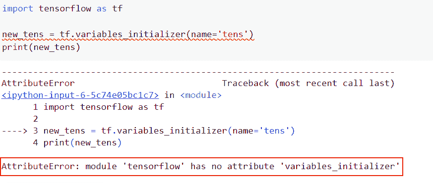

Attributeerror module tensorflow has no attribute variables_initializer

以下是给定代码的解决方案

这里我们使用`*TF . compat . v1 . variables _ initializer()*`函数

**语法**:

```py
tf.compat.v1.variables_initializer(
    var_list, name='init'
)
```

**举例**:

```py
import tensorflow as tf

new_tens = tf.compat.v1.variables_initializer(var_list=[12,3,4],name='tens')
print(new_tens)
```

下面是以下给定代码的输出。

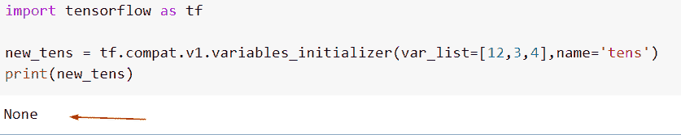

Solution of Attributeerror module tensorflow has no attribute variables_initializer

在上面的示例中，我们已经解决了 attributeerror 模块“tensorflow”没有属性“variables_initializer”。

阅读: [TensorFlow 全球平均池](https://pythonguides.com/tensorflow-global-average-pooling/)

## Attributeerror 模块' tensorflow '没有属性' report _ initialized _ variables '

在这个例子中，我们将使用 TF . report _ initialized _ variables()函数，在这个函数中，我们设置了 var_list 和张量的名称。

**举例**:

```py
import tensorflow as tf

new_tens = tf.report_uninitialized_variables(var_list=[12,3,4],name='tens')
print(new_tens)
```

下面是以下给定代码的实现

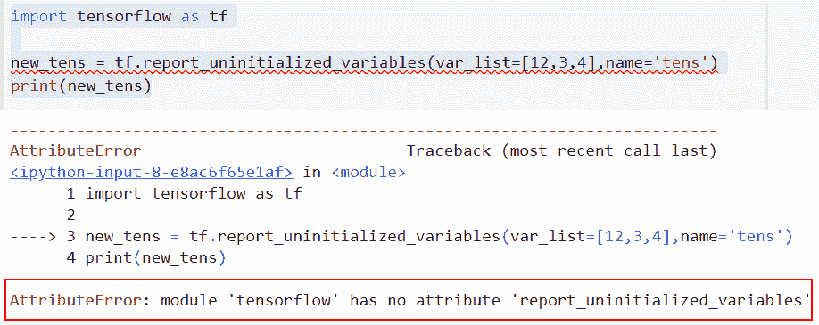

Attributeerror module ‘tensorflow’ has no attribute ‘report_uninitialized_variables’

此错误的解决方案

```py
import tensorflow as tf

new_tens = tf.compat.v1.report_uninitialized_variables(var_list=None,name='tens')
print(new_tens)
```

在这个例子中，我们已经使用了 TF . compat . v1 . report _ initialized _ variables()函数，如果有任何未初始化的变量，它将返回一个带有它们名称的一维张量；否则，它返回一个空数组。

下面是以下代码的截图

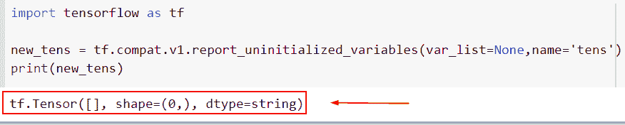

Solution of Attributeerror module tensorflow has no attribute report_uninitialized_variables

阅读:[二元交叉熵张量流](https://pythonguides.com/binary-cross-entropy-tensorflow/)

## Attributeerror 模块‘tensor flow’没有属性‘trainible _ variables’

*   模型中的所有可训练变量都由可训练变量返回。这里，“可训练的”指的是应该改进以提高模型有效性的变量。
*   当提供参数 trainable = True 时，Variable()函数对象会自动向图形集合 GraphKeys 添加新变量。可训练变量。该集合的内容由该函数返回。

**举例**:

```py
import tensorflow as tf

tensor = tf.trainable_variables(scope=None)
print(tensor)
```

下面是以下给定代码的实现

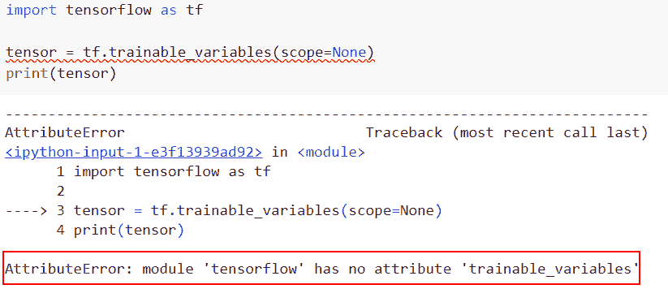

Attributeerror module tensorflow has no attribute trainable_variables

**原因:**此错误的原因是最新版本的 TensorFlow 中没有`TF . trainiable _ variables()`函数。

此错误代码的解决方案:

在本例中，我们将使用`TF . compat . v1 . trainible _ variables()`函数的概念。

语法:

```py
tf.compat.v1.trainable_variables(
    scope=None
)
```

*   它只包含一个参数
    *   `scope` :可选参数，如果提供，re.match 用于过滤输出列表，使其只包含 name 属性匹配 scope 的对象。如果给定了范围，则不会返回没有名称属性的项。由于选择了 re.match，没有唯一标记的范围将按前缀进行筛选。

**举例**:

```py
import tensorflow as tf

tensor = tf.compat.v1.trainable_variables(scope=None)
print(tensor)
```

这里我们使用了 TF . compat . v1 . trainiable _ variables()函数，这个函数在 tensorflow 最新版本 2.x 中可用。

你可以参考下面的截图

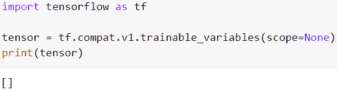

Solution of Attributeerror module tensorflow has no attribute trainable_variables

这就是我们如何解决这个属性错误模块“tensorflow”没有属性“trainable _ variables”。

阅读:[模块' TensorFlow '没有属性' get_default_graph'](https://pythonguides.com/module-tensorflow-has-no-attribute-get_default_graph/)

## Attributeerror 模块“tensorflow”没有属性“initialize _ all _ variables”

*   在本节中，我们将讨论如何解决错误属性错误模块“tensorflow”没有属性“initalize _ all _ variables”。
*   为了执行此任务，我们将使用 tf.initialize_all_variables()函数的概念，此函数在 tensorflow 1.x 版本中可用。

**举例**:

```py
import tensorflow as tf

tensor = tf.initialize_all_variables()
print(tensor)
```

下面是以下给定代码的输出。

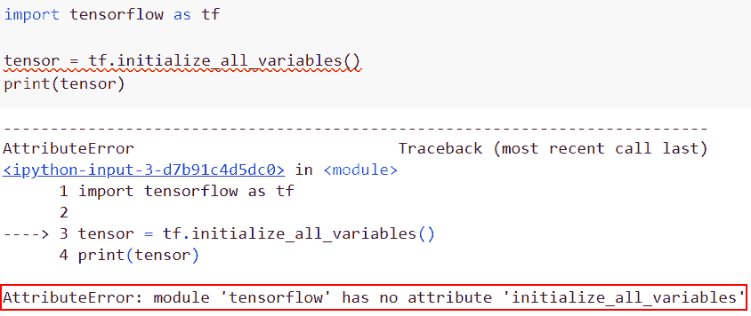

Attributeerror module tensorflow has no attribute initalize_all_variables

以下是此错误的解决方案

```py
import tensorflow as tf

tensor = tf.compat.v1.initialize_all_variables()
print(tensor)
```

你可以参考下面的截图。

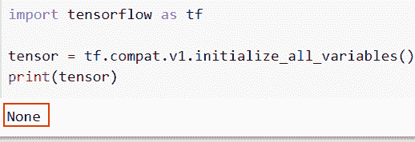

Solution of Attributeerror module tensorflow has no attribute initalize_all_variables

阅读:[张量流图-详细指南](https://pythonguides.com/tensorflow-graph/)

## Attributeerror 模块“tensorflow”没有属性“local _ variables _ initializer”

*   让我们讨论并了解如何解决错误 **Attributeerror 模块‘tensor flow’没有属性****【local _ variables _ initializer】**。
*   通过使用'`local _ variables _ initializer`函数，我们可以很容易地得到变量的作用域。变量作用域提供检查以防止意外创建或共享，同时允许您共享已经生成的变量和创建新的变量。

**举例**:

```py
import tensorflow as tf

tensor = tf.local_variables_initializer()
print(tensor)
```

你可以参考下面的截图

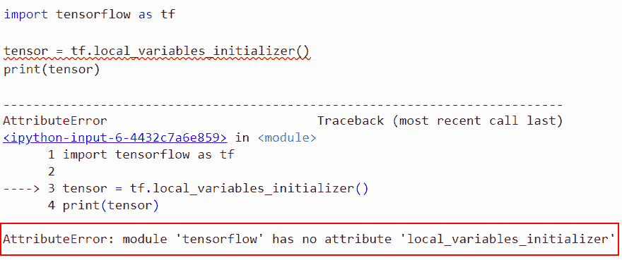

Attributeerror module tensorflow has no attribute local_variables_initializer

解决办法

```py
import tensorflow as tf

tensor = tf.compat.v1.local_variables_initializer()
print(tensor)
```

下面是以下给定代码的实现

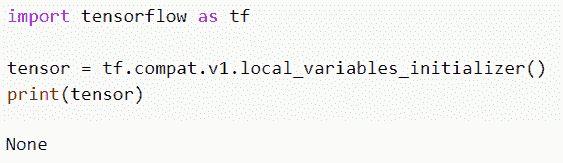

Solution of Attributeerror module tensorflow has no attribute local_variables_initializer

还有，多看看一些 Python TensorFlow 教程。

*   [张量流均方误差](https://pythonguides.com/tensorflow-mean-squared-error/)
*   [将列表转换为张量张量流](https://pythonguides.com/convert-list-to-tensor-tensorflow/)
*   [Python TensorFlow one_hot](https://pythonguides.com/tensorflow-one_hot/)
*   [模块“tensorflow”没有属性“sparse _ placeholder”](https://pythonguides.com/module-tensorflow-has-no-attribute-sparse_placeholder/)

在本 Python 教程中，我们重点介绍了如何修复属性错误:在我们的模型中，模块 tensorflow 没有属性***‘get*`_`variable’**，我们还将看一些如何在 *`TensorFlow`* 中使用 tf.get_variable()函数的示例。我们已经讨论了这些主题。

*   Attributeerror 模块“tensorflow”没有属性“get_variable”
*   Attributeerror 模块“tensorflow”没有属性“get_variable_scope”
*   Attributeerror 模块“tensorflow”没有属性“variable_scope”
*   Attributeerror 模块“tensorflow”没有属性“variable”
*   Attributeerror 模块“tensorflow”没有属性“variables_initializer”
*   Attributeerror 模块“tensorflow”没有属性“report _ uninitialized _ variables”
*   Attributeerror 模块“tensorflow”没有属性“trainable _ variables”
*   Attributeerror 模块“tensorflow”没有属性“initalize _ all _ variables”
*   Attributeerror 模块“tensorflow”没有属性“local_variables_initializer”

[Bijay Kumar](https://pythonguides.com/author/fewlines4biju/)

Python 是美国最流行的语言之一。我从事 Python 工作已经有很长时间了，我在与 Tkinter、Pandas、NumPy、Turtle、Django、Matplotlib、Tensorflow、Scipy、Scikit-Learn 等各种库合作方面拥有专业知识。我有与美国、加拿大、英国、澳大利亚、新西兰等国家的各种客户合作的经验。查看我的个人资料。

[enjoysharepoint.com/](https://enjoysharepoint.com/)[](https://www.facebook.com/fewlines4biju "Facebook")[](https://www.linkedin.com/in/fewlines4biju/ "Linkedin")[](https://twitter.com/fewlines4biju "Twitter")