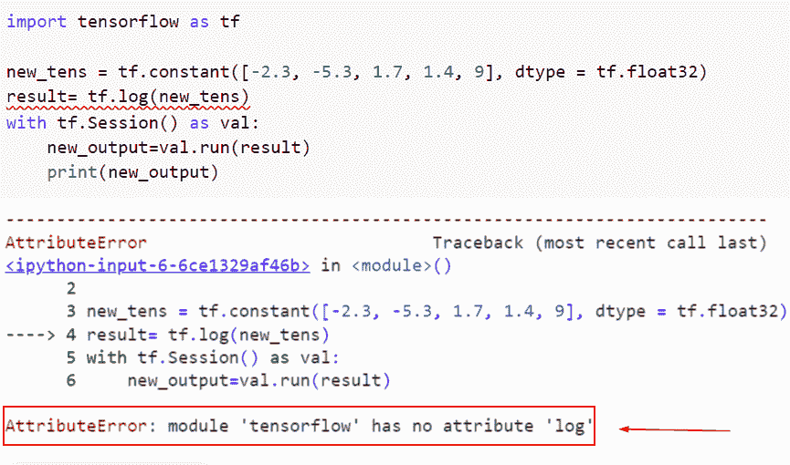
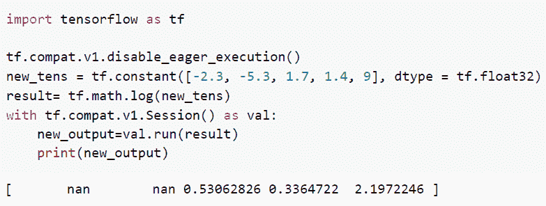
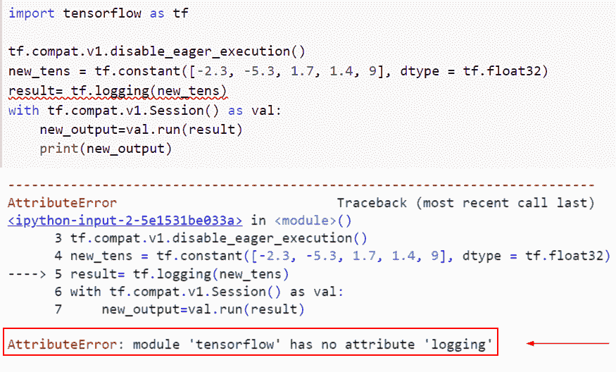
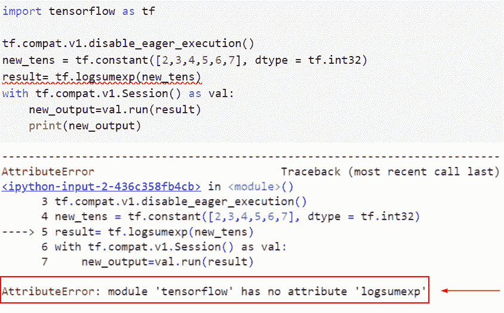
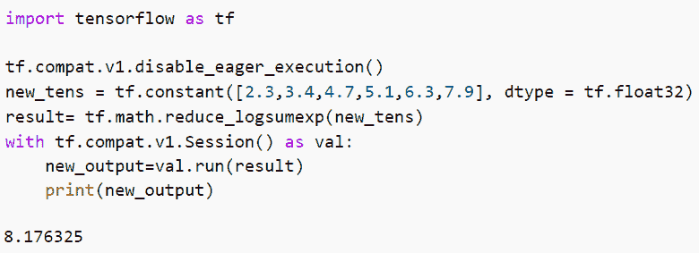
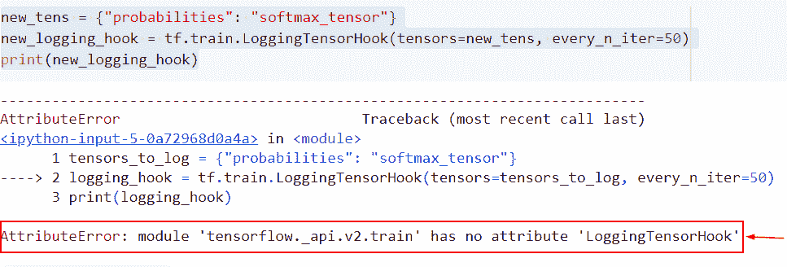
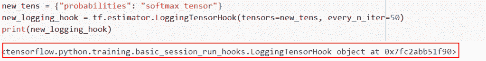

# 模块“tensorflow”没有属性“log”

> 原文：<https://pythonguides.com/module-tensorflow-has-no-attribute-log/>

[](https://sharepointsky.teachable.com/p/python-and-machine-learning-training-course)

在本 [Python 教程](https://pythonguides.com/learn-python/)中，我们将讨论错误“**模块‘tensor flow’没有属性‘log’**”。我们还将讨论以下主题:

*   Attributeerror 模块“tensorflow”没有属性“log”
*   Attributeerror 模块“tensorflow”没有属性“logging”Bert
*   Attributeerror 模块的 tensorflow。“Keras.backend”没有属性“logsumexp”
*   Attributeerror 模块的 tensorflow。_api.v2.train '没有属性' **loggingtensorhook 【T1 ' '**

目录

[](#)

*   [Attributeerror 模块“tensorflow”没有属性“log”](#Attributeerror_module_tensorflow_has_no_attribute_log "Attributeerror module ‘tensorflow’ has no attribute ‘log’")
*   [Attributeerror 模块“tensorflow”没有属性“logging”Bert](#Attributeerror_module_tensorflow_has_no_attribute_logging_bert "Attributeerror module ‘tensorflow’ has no attribute ‘logging’ bert")
*   [Attributeerror 模块' tensorflow。“Keras.backend”没有属性“logsumexp”](#Attributeerror_module_tensorflowKerasbackend_has_no_attribute_logsumexp "Attributeerror module ‘tensorflow.Keras.backend’ has no attribute ‘logsumexp’")
*   [Attributeerror 模块' tensorflow。_api.v2.train '没有属性' loggingtensorhook'](#Attributeerror_module_tensorflow_apiv2train_has_no_attribute_loggingtensorhook "Attributeerror module ‘tensorflow._api.v2.train’ has no attribute ‘loggingtensorhook’")

## Attributeerror 模块“tensorflow”没有属性“log”

*   在本节中，我们将讨论错误 AttributeError:“模块‘tensor flow’在 Python 中没有属性**‘session’**。
*   为了执行这个任务，我们首先将导入带有 tf 别名的张量流库，其中 *`tf`* 代表张量流，用于数值计算问题。
*   接下来，我们将创建一个张量形式的变量，并分配一个 `tf.constant()` 函数。在 Python 中，这个函数采用一个常数值，表示不修改的值，它还初始化一个对象，如数组或列表。
*   tensorflow.math 模块支持一些基本的数学运算。张量流函数 `tf.log()` 【别名 `tf.math.log` 支持自然对数函数。它预期以浮点值或复数的形式输入，格式为 `a+bi` 。
*   如果输入中有几个元素，则计算元素对数。输入类型是张量。

示例:

```py
import tensorflow as tf

new_tens = tf.constant([-2.3, -5.3, 1.7, 1.4, 9], dtype = tf.float32)
result= tf.log(new_tens)
with tf.Session() as val:
    new_output=val.run(result)
    print(new_output)
```

在这个例子中，我们创建了一个张量，然后使用 `tf.log()` 函数来计算对数值。

下面是下面给出的代码的截图。



attributeerror module ‘tensorflow’ has no attribute ‘log’

此错误的解决方案。

在这个例子中，我们将使用 `tf.math.log()` 函数的概念，它将计算 x 元素的自然对数。

让我们看一下语法，了解一下 `tf.math.log()` 函数的工作原理

```py
tf.math.log(
    x, name=None
)
```

*   它由几个参数组成
    *   `x` :该参数为输入张量，必须为以下类型:float32、float 64、complex 128。
    *   **名称**:该参数指定操作的名称。

```py
import tensorflow as tf

tf.compat.v1.disable_eager_execution()
new_tens = tf.constant([-2.3, -5.3, 1.7, 1.4, 9], dtype = tf.float32)
result= tf.math.log(new_tens)
with tf.compat.v1.Session() as val:
    new_output=val.run(result)
    print(new_output)
```

你可以参考下面的截图



Solution of attributeerror module tensorflow has no attribute log

正如你在截图中看到的，日志错误已经解决。

读取:[属性错误:模块“tensorflow”没有属性“mul”](https://pythonguides.com/module-tensorflow-has-no-attribute-mul/)

## Attributeerror 模块“tensorflow”没有属性“logging”Bert

*   这里我们将讨论如何解决错误模块**‘tensor flow’**没有属性**‘logging’**Bert。
*   为了完成这个任务，我们将使用 `tf.logging()` 函数，但是这个方法只在 1.x 版本中可用，我们必须找到日志的值。首先，我们使用 `tf.constant()` 函数创建了一个张量，并在这个函数中指定了数据类型。

**举例**:

```py
import tensorflow as tf

tf.compat.v1.disable_eager_execution()
new_tens = tf.constant([-2.3, -5.3, 1.7, 1.4, 9], dtype = tf.float32)
result= tf.logging(new_tens)
with tf.compat.v1.Session() as val:
    new_output=val.run(result)
    print(new_output)
```

下面是以下给定代码的实现



Attributeerror module tensorflow has no attribute logging bert

阅读: [TensorFlow 自然语言处理](https://pythonguides.com/tensorflow-natural-language-processing/)

## Attributeerror 模块' tensorflow。“Keras.backend”没有属性“logsumexp”

*   要确定张量元素在其所有维度上的对数和 exp，请使用 `tf.logSumExp()` 函数。输入项沿着轴的维度减少。
*   如果参数**“keep dims”**为真，则减少的尺寸长度保持为 1；否则，张量的秩减少 1。如果轴参数没有条目，它将返回一个包含单个元素和所有缩减维度的张量。

**举例**:

```py
import tensorflow as tf

tf.compat.v1.disable_eager_execution()
new_tens = tf.constant([2,3,4,5,6,7], dtype = tf.int32)
result= tf.logsumexp(new_tens)
with tf.compat.v1.Session() as val:
    new_output=val.run(result)
    print(new_output)
```

下面是以下代码的截图



Attributeerror module tensorflow.Keras_.backend has no attribute logsumexp

此错误的解决方案。

这里我们将使用`TF . math . reduce _ logsumexp()`函数的概念，它将计算输入张量各维值的对数和 exp。

**语法**:

```py
tf.math.reduce_logsumexp(
    input_tensor, axis=None, keepdims=False, name=None
)
```

*   它由几个参数组成
    *   `input_tensor` :要约简的数值张量。
    *   **轴**:默认取无值，指定缩减尺寸。范围[**-秩(输入张量)，秩(输入张量)** ]应该包含它的值。如果未提供值，则所有维度都会减少。
    *   `keepdims` : False 为其默认值。如果设置为 True，将保留长度为 1 的缩减维度。
    *   `name` :可选参数，指定操作的名称。

```py
import tensorflow as tf

tf.compat.v1.disable_eager_execution()
new_tens = tf.constant([2.3,3.4,4.7,5.1,6.3,7.9], dtype = tf.float32)
result= tf.math.reduce_logsumexp(new_tens)
with tf.compat.v1.Session() as val:
    new_output=val.run(result)
    print(new_output)
```

下面是以下给定代码的输出。



Solution of attributeerror module tensorflow.Keras_.backend has no attribute logsumexp

这就是我们解决 attributeerror 模块 tensorflow 的方法。Keras_backend 没有属性 logsumexp。

阅读: [TensorFlow feed_dict + 9 个例子](https://pythonguides.com/tensorflow-feed_dict/)

## Attributeerror 模块' tensorflow。_api.v2.train '没有属性' loggingtensorhook'

*   因为不支持按名称访问张量，所以建立一个自定义回调 `(LoggingTensorCallback)` ，在这里手动记录和输出记录的张量，以便复制 LoggingTensorHook 的行为。
*   日志记录频率也可以在自定义回调中使用。在下面的例子中，每两步打印一次重量。还有更多的操作可以使用，比如每 N 秒记录一次。

**举例**:

```py
new_tens = {"probabilities": "softmax_tensor"}
new_logging_hook = tf.train.LoggingTensorHook(tensors=new_tens, every_n_iter=50)
print(new_logging_hook)
```

你可以参考下面的截图



attributeerror module tensorflow._api.v2.train has no attribute loggingtensorhook

此错误的解决方案。

在本例中，我们将使用`TF . estimator . loggingtensorhook()`函数的概念，它将每 N 个本地步骤和每 N 秒打印一次输入张量。

**语法**:

```py
tf.estimator.LoggingTensorHook(
    tensors, every_n_iter=None, every_n_secs=None, at_end=False, formatter=None
)
```

*   它由几个参数组成
    *   `tensors`:tensors 和 tensor 名称的 iterable，或者将字符串值标签转换为 tensors 和 tensor 名称的 dict。
    *   `every_n_iter` :对当前 worker，int 采取的每 N 个局部步长，打印张量的值。
    *   `every_n_secs` :每 N 秒打印一次张量值，作为 int 或 float。每 n 个条目和每 n 秒应该正好有一个可用。
    *   `at_end` : bool 表示是否在运行结束时打印张量值。
    *   格式化程序:默认情况下，它不取任何值，它将打印所有的张量。

**举例**:

```py
new_tens = {"probabilities": "softmax_tensor"}
new_logging_hook = tf.estimator.LoggingTensorHook(tensors=new_tens, every_n_iter=50)
print(new_logging_hook)
```

下面是以下代码的截图



Solution of attributeerror module tensorflow._api.v2.train has no attribute loggingtensorhook

正如你在截图中看到的，我们已经解决了 loggingtensorhook 错误。

你可能也喜欢阅读下面的 TensorFlow 教程。

*   [TensorFlow Sparse Tensor](https://pythonguides.com/tensorflow-sparse-tensor/)
*   [张量流交叉熵损失](https://pythonguides.com/tensorflow-cross-entropy-loss/)
*   [Tensorflow 嵌入 _ 查找](https://pythonguides.com/tensorflow-embedding_lookup/)
*   [张量流获取变量](https://pythonguides.com/tensorflow-get-variable/)
*   [Python TensorFlow 占位符](https://pythonguides.com/tensorflow-placeholder/)

在本 Python 教程中，我们讨论了错误“**模块‘tensor flow’没有属性‘log’**”。我们还讨论了以下主题:

*   Attributeerror 模块“tensorflow”没有属性“log”
*   Attributeerror 模块“tensorflow”没有属性“logging”Bert
*   Attributeerror 模块的 tensorflow。“Keras.backend”没有属性“logsumexp”
*   Attributeerror 模块的 tensorflow。_api.v2.train '没有属性' **loggingtensorhook 【T1 ' '**

[Bijay Kumar](https://pythonguides.com/author/fewlines4biju/)

Python 是美国最流行的语言之一。我从事 Python 工作已经有很长时间了，我在与 Tkinter、Pandas、NumPy、Turtle、Django、Matplotlib、Tensorflow、Scipy、Scikit-Learn 等各种库合作方面拥有专业知识。我有与美国、加拿大、英国、澳大利亚、新西兰等国家的各种客户合作的经验。查看我的个人资料。

[enjoysharepoint.com/](https://enjoysharepoint.com/)[](https://www.facebook.com/fewlines4biju "Facebook")[](https://www.linkedin.com/in/fewlines4biju/ "Linkedin")[](https://twitter.com/fewlines4biju "Twitter")