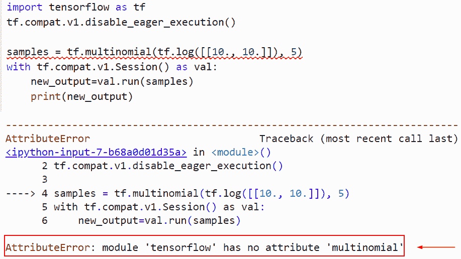

# Attributeerror:模块“tensorflow”没有属性“mul”

> 原文：<https://pythonguides.com/module-tensorflow-has-no-attribute-mul/>

[](https://sharepointsky.teachable.com/p/python-and-machine-learning-training-course)

在本 [Python 教程](https://pythonguides.com/learn-python/)中，我们将讨论错误“**模块‘tensor flow’没有属性‘mul’**”。我们还将讨论以下主题:

*   Attributeerror 模块“tensorflow”没有属性“mul”
*   Attributeerror 模块“tensorflow”没有属性“multinominal”
*   Attributeerror 模块的 tensorflow。“Keras.layers”没有属性“multiheadattention”
*   Attributeerror 模块的 tensorflow。_api.v2.distribute '没有属性' multiworkermirroredstrategy '
*   Attributeerror 模块“tensorflow.compat.v1 .”没有属性“mul”

目录

[](#)

*   [Attributeerror 模块“tensorflow”没有属性“mul”](#Attributeerror_module_tensorflow_has_no_attribute_mul "Attributeerror module ‘tensorflow’ has no attribute ‘mul’")
*   [Attributeerror 模块“tensorflow”没有属性“多项”](#Attributeerror_module_tensorflow_has_no_attribute_multinominal "Attributeerror module ‘tensorflow’ has no attribute ‘multinominal’")
*   [Attributeerror 模块' tensorflow。“Keras.layers”没有属性“multi head attention”](#Attributeerror_module_tensorflowKeraslayers_has_no_attribute_multiheadattention "Attributeerror module ‘tensorflow.Keras.layers’ has no attribute ‘multiheadattention’")
*   [Attributeerror 模块' tensorflow。_api.v2.distribute '没有属性' multiworkermirroredstrategy '](#Attributeerror_module_tensorflow_apiv2distribute_has_no_attribute_multiworkermirroredstrategy "Attributeerror module ‘tensorflow._api.v2.distribute’ has no attribute ‘multiworkermirroredstrategy’")
*   [Attributeerror 模块' tensorflow.compat.v1 . '没有属性' mul'](#Attributeerror_module_tensorflowcompatv1_has_no_attribute_mul "Attributeerror module ‘tensorflow.compat.v1.’ has no attribute ‘mul’")

## Attributeerror 模块“tensorflow”没有属性“mul”

*   在本节中，我们将讨论错误 AttributeError:“模块‘tensor flow’在 Python 中没有属性**‘session’**。
*   为了完成这项任务，我们首先将导入带有 tf 别名的 TensorFlow 库，其中 tf 代表 TensorFlow，用于数值计算问题。
*   接下来，我们将创建一个张量形式的变量，并分配一个 `tf.constant()` 函数。在 Python 中，这个函数采用一个常数值，表示不修改的值，它还初始化一个对象，如数组或列表。
*   在给定的例子中，我们已经指定了 scaler 值和数据类型作为参数。现在我们要把两个共享的变量相乘，分别命名为**‘l’**和**‘m’**。为了完成这个任务，我们首先学习 `tf.session()` 的概念。
*   在 Python 中，该函数用于在图形中执行一些操作。它将检查图的节点，在本例中，我们将创建类似于 `tf.session()` 的会话，并使用 `tf.session()` 作为 Val 启动会话，其中 Val 是会话名称。

**举例**:

```py
import tensorflow as tf

input_tensor_1 = tf.constant(67,dtype="int32",name="input_tensor_1")
input_tensor_2 = tf.constant(89,dtype="int32",name="input_tensor_2")
result= tf.mul(input_tensor_1,input_tensor_2)
with tf.Session() as val:
    new_output=val.run(result)
    print(new_output)
```

在这个例子中，我们首先使用 `tf.constant()` 函数创建了两个输入张量，在这个函数中，我们将整数值和数据类型指定为参数。接下来，我们使用 `tf.mul()` 函数将两个张量相乘。

下面是下面给出的代码的截图。


attributeerror module tensorflow has no attribute mul

正如您在截图中看到的，输出显示了错误属性错误:模块**‘tensor flow’**没有属性**‘mul’**。

**原因:**此错误的可能原因是 `tf.session()` 属性在 Tensorflow 的最新版本(TensorFlow2.0)中不可用，并且 `tf.mul()` 已从 tensorflow 2.x 的最新版本中折旧

现在让我们来看看这个问题的解决方案

```py
import tensorflow as tf
tf.compat.v1.disable_eager_execution()

input_tensor_1 = tf.constant(67,dtype="int32",name="input_tensor_1")
input_tensor_2 = tf.constant(89,dtype="int32",name="input_tensor_2")
result= tf.math.multiply(input_tensor_1,input_tensor_2)
with tf.compat.v1.Session() as val:
    new_output=val.run(result)
    print(new_output)
```

在上面的程序中，我们使用了 TF . compat . v1 . disable _ eager _ execution()函数，它用于困难的程序，可以在 `TensorFlow2.0` 中使用，代替 `tf.session()` 函数。

在最新的 2.0 版本中， `tf.session()` 已经被删除，如果您使用的是旧版本的 TensorFlow，那么它可以在复杂的程序中工作。

现在 `eager_execution()` 函数在 `Tensorflow2.0` 中工作，而不是在 session 中。与进程相比，此函数很简单，因为它在不创建图形的情况下执行操作。

你可以参考下面的截图


Solution of attributeerror module ‘tensorflow’ has no attribute ‘mul’

这就是我们如何解决错误属性错误模块“tensorflow”没有属性**“mul”**

阅读: [TensorFlow 学习率调度器](https://pythonguides.com/tensorflow-learning-rate-scheduler/)

## Attributeerror 模块“tensorflow”没有属性“多项”

*   在本节中，我们将讨论错误属性错误模块“tensorflow”没有属性“multinominal”。
*   在这个例子中，我们将使用 `tf.multinominal()` 函数。此功能在 TensorFlow `1.x` 版本中可用，多项式模拟 n 次试验的结果，其中每次试验的结果遵循分类分布，例如重复投掷 k 面骰子时。

示例:

```py
import tensorflow as tf
tf.compat.v1.disable_eager_execution()

samples = tf.multinomial(tf.log([[10., 10.]]), 5)
with tf.compat.v1.Session() as val:
    new_output=val.run(samples)
    print(new_output)
```

你可以参考下面的截图



attributeerror module tensorflow has no attribute multinominal

此错误的解决方案

在本例中，我们将使用 multinominal 的最新版本，即`TF . compat . v1 . multinominal()`，它在 TensorFlow 的最新版本中可用。

**语法**:

下面是 TensorFlow 中`TF . compat . v1 . multinominal()`函数的语法

```py
tf.compat.v1.multinomial(
    logits, num_samples, seed=None, name=None, output_dtype=None
)
```

*   它由几个参数组成
    *   `logits` : 2-D【批量大小，数量类】形张量。每个切片代表所有类别的非标准化对数概率。
    *   `num_samples` :一行中每片要抽取的独立样本数， **0 到 D** 。
    *   **种子**:该参数用于定义分配的随机种子。
    *   **名称**:该参数指定操作的名称，默认为无。

```py
import tensorflow as tf
tf.compat.v1.disable_eager_execution()

samples = tf.compat.v1.multinomial(tf.math.log([[10., 10.]]), 5)
with tf.compat.v1.Session() as val:
    new_output=val.run(samples)
    print(new_output)
```

你可以参考下面的截图


Solution of attributeerror module tensorflow has no attribute multinominal

正如你在截图中看到的，错误已经解决。

阅读:[批量归一化张量流](https://pythonguides.com/batch-normalization-tensorflow/)

## Attributeerror 模块' tensorflow。“Keras.layers”没有属性“multi head attention”

*   这里我们将讨论如何解决错误 attributeerror 模块 **'tensorflow。“Keras.layers”没有属性“multiheadattention** ”。

**举例**:

```py
import tensorflow as tf
layer = tf.MultiHeadAttention(num_heads=2, key_dim=2, attention_axes=(2, 3))
input_tensor = tf.keras.Input(shape=[17, 28, 38, 89])
output_tensor = layer(input_tensor, input_tensor)
print(output_tensor.shape)
```

下面是以下代码的截图


attributeerror module tensorflow.Keras_.layers has no attribute multiheadattention

此错误的解决方案。

**举例**:

```py
import tensorflow as tf
layer = tf.keras.layers.MultiHeadAttention(num_heads=2, key_dim=2, attention_axes=(2, 3))
input_tensor = tf.keras.Input(shape=[17, 28, 38, 89])
output_tensor = layer(input_tensor, input_tensor)
print(output_tensor.shape)
```

下面是以下给定代码的输出


Solution of attributeerror module tensorflow.Keras_.layers has no attribute multiheadattention

这就是我们解决 attributeerror 模块 tensorflow 的方法。Keras_。layers 没有 multiheadattention 属性。

阅读:[张量流自定义损失函数](https://pythonguides.com/tensorflow-custom-loss-function/)

## Attributeerror 模块' tensorflow。_api.v2.distribute '没有属性' multiworkermirroredstrategy '

*   在本节中，我们将讨论错误 AttributeError:“模块‘tensor flow’在 Python 中没有属性**‘session’**。
*   为了保持变量同步，它使用了 CollectiveOps 的多工作进程 all-reduce 实现。集合运算是张量流图中的单个运算，它允许张量流运行时根据硬件、网络拓扑和张量大小自动选择 all-reduce 算法。

阅读: [TensorFlow next_batch](https://pythonguides.com/tensorflow-next_batch/)

## Attributeerror 模块' tensorflow.compat.v1 . '没有属性' mul'

*   这里我们要讨论的是属性错误模块 **'tensorflow.compat.v1 '没有属性' mul '。**
*   为了完成这项任务，我们首先将导入带有 tf 别名的 TensorFlow 库，其中 tf 代表 TensorFlow，用于数值计算问题。
*   接下来，我们将创建一个张量形式的变量，并分配一个 `tf.constant()` 函数。在 Python 中，这个函数采用一个常数值，表示不修改的值，它还初始化一个对象，如数组或列表。

**举例**:

```py
import tensorflow as tf

tf.compat.v1.disable_eager_execution()
input_tensor_1 = tf.constant([14,28,98,11],dtype="int32",name="input_tensor_1")
input_tensor_2 = tf.constant([15,34,24,5],dtype="int32",name="input_tensor_2")
result= tf.mul(input_tensor_1,input_tensor_2)
with tf.compat.v1.Session() as val:
    new_output=val.run(result)
    print(new_output)
```

在这个例子中，我们通过使用 `tf.constant()` 函数创建了一个张量，在这个函数中，我们设置了值列表以及数据类型**‘int 32’**。接下来，我们使用了 `tf.mul()` 函数，并将输入张量分配给它。`TF . compat . v1 . disable _ eager _ execution()`函数，用于难度较大的程序，可以在 `TensorFlow2.0` 中使用，代替 `tf.session()` 函数。

下面是下面给出的代码的截图。


Attributeerror module tensorflow.compat.v1\. has no attribute mul

此错误的解决方案。

```py
import tensorflow as tf

tf.compat.v1.disable_eager_execution()
input_tensor_1 = tf.constant([14,28,98,11],dtype="int32",name="input_tensor_1")
input_tensor_2 = tf.constant([15,34,24,5],dtype="int32",name="input_tensor_2")
result= tf.math.multiply(input_tensor_1,input_tensor_2)
with tf.compat.v1.Session() as val:
    new_output=val.run(result)
    print(new_output)
```

你可以参考下面的截图。


Solution of Attributeerror module tensorflow.compat.v1.-has no attribute mul

正如您在屏幕截图中看到的，Attributeerror 模块 tensorflow.compat.v1 的错误已得到解决。-没有属性 mul。

您可能也喜欢阅读以下 Python TensorFlow 教程。

*   [TensorFlow 全球平均池](https://pythonguides.com/tensorflow-global-average-pooling/)
*   [模块“张量流”没有属性“函数”](https://pythonguides.com/module-tensorflow-has-no-attribute-function/)
*   [Tensorflow 嵌入 _ 查找](https://pythonguides.com/tensorflow-embedding_lookup/)
*   [张量流均方误差](https://pythonguides.com/tensorflow-mean-squared-error/)
*   [Tensorflow 迭代张量](https://pythonguides.com/tensorflow-iterate-over-tensor/)
*   [TensorFlow 学习率调度器](https://pythonguides.com/tensorflow-learning-rate-scheduler/)

在本 Python 教程中，我们讨论了错误“**模块‘tensor flow’没有属性‘mul’**”。我们已经讨论了以下主题:

*   Attributeerror 模块“tensorflow”没有属性“mul”
*   Attributeerror 模块“tensorflow”没有属性“multinominal”
*   Attributeerror 模块的 tensorflow。“Keras.layers”没有属性“multiheadattention”
*   Attributeerror 模块的 tensorflow。_api.v2.distribute '没有属性' multiworkermirroredstrategy '
*   Attributeerror 模块“tensorflow.compat.v1 .”没有属性“mul”

[Bijay Kumar](https://pythonguides.com/author/fewlines4biju/)

Python 是美国最流行的语言之一。我从事 Python 工作已经有很长时间了，我在与 Tkinter、Pandas、NumPy、Turtle、Django、Matplotlib、Tensorflow、Scipy、Scikit-Learn 等各种库合作方面拥有专业知识。我有与美国、加拿大、英国、澳大利亚、新西兰等国家的各种客户合作的经验。查看我的个人资料。

[enjoysharepoint.com/](https://enjoysharepoint.com/)[](https://www.facebook.com/fewlines4biju "Facebook")[](https://www.linkedin.com/in/fewlines4biju/ "Linkedin")[](https://twitter.com/fewlines4biju "Twitter")