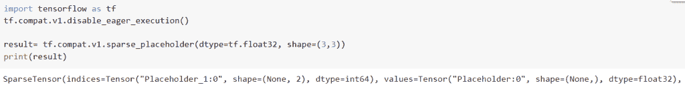

# 模块“tensorflow”没有属性“sparse_placeholder”

> 原文：<https://pythonguides.com/module-tensorflow-has-no-attribute-sparse_placeholder/>

[](https://sharepointsky.teachable.com/p/python-and-machine-learning-training-course)

在这个 [Python 教程](https://pythonguides.com/learn-python/)中，我们将重点关注如何修复 ***属性错误:模块“tensorflow”在我们的模型中没有属性“sparse _ placeholder”***，我们还将看一些如何在 *`TensorFlow`* 中使用`*TF . sparse _ placeholder()*`函数的例子。我们将讨论这些话题。

*   Attributeerror:模块“tensorflow”没有属性“sparse_placeholder”
*   Attributeerror:模块“tensorflow”没有属性“sparsetensorvalue”
*   Attributeerror:模块“tensorflow”没有属性“sparse_to_dense”
*   Attributeerror:模块“tensorflow”没有属性“sparse”
*   Attributeerror:模块“tensor flow . keras . loss”没有属性“sparsecategoricalcrossentropy”

目录

[](#)

*   [属性错误:模块“tensorflow”没有属性“sparse _ placeholder”](#Attributeerror_module_tensorflow_has_no_attribute_sparse_placeholder "Attributeerror: module ‘tensorflow’ has no attribute ‘sparse_placeholder’")
*   [属性错误:模块“tensorflow”没有属性“sparsetensorvalue”](#Attributeerror_module_tensorflow_has_no_attribute_sparsetensorvalue "Attributeerror: module ‘tensorflow’ has no attribute ‘sparsetensorvalue’")
*   [属性错误:模块“tensorflow”没有属性“sparse _ to _ dense”](#Attributeerror_module_tensorflow_has_no_attribute_sparse_to_dense "Attributeerror: module ‘tensorflow’ has no attribute ‘sparse_to_dense’")
*   [属性错误:模块“tensorflow”没有属性“Sparse”](#Attributeerror_module_tensorflow_has_no_attribute_Sparse "Attributeerror: module ‘tensorflow’ has no attribute ‘Sparse’")
*   [Attributeerror:模块' tensor flow . keras . loss '没有属性' sparsecategoricalcrossentropy '](#Attributeerror_module_tensorflowkeraslosses_has_no_attribute_sparsecategoricalcrossentropy "Attributeerror: module ‘tensorflow.keras.losses’ has no attribute ‘sparsecategoricalcrossentropy’")

## 属性错误:模块“tensorflow”没有属性“sparse _ placeholder”

*   占位符只是一个变量，我们随后将向它提供信息。
*   在不需要数据的情况下，它使我们能够设计我们的计算图并产生我们的操作，然后我们使用这些占位符将数据输入到 TensorFlow 语言的图中。
*   sparse_placeholder 为稀疏张量插入一个占位符，该占位符将始终按照字典的顺序输入，它将返回稀疏张量，该稀疏张量可用作输入值的句柄。

**举例:**

让我们举个例子，看看如何解决属性错误模块“tensorflow”没有属性“sparse_placeholder”

```py
import tensorflow as tf

result= tf.sparse_placeholder(shape=(3,3))
print(result)
```

下面是以下代码的截图


attributeerror module ‘tensorflow’ has no attribute ‘sparse_placeholder’

此错误的解决方案

在本例中，我们将使用 TF . compat . v1 . sparse _ placeholder()函数，该函数在 TensorFlow 2.x 版本中可用。

**语法**:

下面是 Python TensorFlow 中`TF . compat . v1 . sparse _ placeholder()`函数的语法。

```py
tf.compat.v1.sparse_placeholder(
    dtype, shape=None, name=None
)
```

*   它由几个参数组成
    *   `dtype` :该参数定义了输入张量中值元素的类型，按照字典的顺序输入。
    *   `shape` :它定义了输入张量的形状，如果没有指定给定的形状，它将检查条件，然后你可以很容易地输入任何形状的稀疏张量。
    *   `name` :指定操作的名称，默认情况下不取值。

```py
import tensorflow as tf
tf.compat.v1.disable_eager_execution()

result= tf.compat.v1.sparse_placeholder(dtype=tf.float32, shape=(3,3))
print(result)
```

在本例中，我们导入了别名为“tf”的 tensorflow 库，然后使用了`TF . compat . v1 . sparse _ placeholder()`函数。如果对该稀疏张量求值，将会导致错误。将它的值输入 Session.run 需要可选的 feed dict 参数。

你可以参考下面的截图



Solution of attributeerror module ‘tensorflow’ has no attribute ‘sparse_placeholder’

这是我们解决属性错误的方法:模块“tensorflow”没有属性“sparse_placeholder”

阅读:[模块“tensorflow”没有属性“get _ variable”](https://pythonguides.com/module-tensorflow-has-no-attribute-get_variable/)

## 属性错误:模块“tensorflow”没有属性“sparsetensorvalue”

*   让我们讨论一下如何解决 attribuiterror 模块“tensorflow”没有属性“sparsetensorvalue”的问题。
*   索引、值和形状是 TensorFlow 用来表示稀疏张量的三个不同的密集张量。为了使用简单，这三个张量在 Python 中被组合成一个 SparseTensor 类。
*   在将它们提供给下面的操作之前，将任何独立的索引、值和形状张量封装在一个 SparseTensor 对象中。

**语法**:

让我们看一下语法并理解 Python TensorFlow 中“tf.compat.v1.sparsetensorvalue”函数的工作原理

```py
tf.compat.v1.SparseTensorValue(
    indices, values, dense_shape
)
```

*   它由几个参数组成
    *   `indexes`:一个形状为[N，ndims]的二维 int64 张量，列出了稀疏张量中非零值成员的索引(元素的索引为零)。indexes =[[7，8]，[5，2]]，例如，指定索引为[[7，8]，[5，2]]的项目具有非零值。
    *   `values` :任意类型和形状的一维张量[N]，提供索引中每个元素的值。例如，给定索引=[[1，3]，[2，6]]，参数值=[15，45]表示稀疏张量的元素[2，6]的值为 15，张量的元素[13，11]的值为 45。
    *   `dense_shape` :指定字段编号的名称元组别名。

**举例**:

```py
import tensorflow as tf
tf.compat.v1.disable_eager_execution()

result= tf.SparseTensorValue(indices=[0,1,2],values=[23,45,67],dense_shape=(3,3))
print(result)
```

在下面给出的代码中，我们首先导入了 tensorflow 库，然后使用了 tf。SparseTensorValue()函数，在这个函数中，我们将索引、值和 dense_shape 指定为参数。

下面是下面给出的代码的截图。


attributeerror module tensorflow has no attribute sparsetensorvalue

以下是此错误的解决方案。

在本例中，我们将使用`TF . compat . v1 . sparsetensorvalue()`函数，该函数仅适用于 TensorFlow 最新版本 2.x。

```py
import tensorflow as tf
tf.compat.v1.disable_eager_execution()

result= tf.compat.v1.SparseTensorValue(indices=[0,1,2],values=[23,45,67],dense_shape=(3,3))
print(result)
```

下面是以下给定代码的实现。


Solution of attributeerror module tensorflow has no attribute sparsetensorvalue

正如您在屏幕截图中看到的，错误已解决 attributeerror 模块 tensorflow 没有属性 sparsetensorvalue。

阅读:[模块“张量流”没有属性“日志”](https://pythonguides.com/module-tensorflow-has-no-attribute-log/)

## 属性错误:模块“tensorflow”没有属性“sparse _ to _ dense”

*   这里我们将讨论如何解决 attributeerror 模块' tensorflow '没有属性' sparse_to_dense '。

**举例**:

```py
import tensorflow as tf

input_tensor = tf.sparse_to_dense(dense_shape=[2, 2],values=[67, 18, 14],indices =[[1, 0],[0, 3],[2, 0]])
print(input_tensor)
```

下面是以下给定代码的输出


attributeerror module tensorflow has no attribute sparse_to_dense

此错误的解决方案

在本例中，我们将使用`TF . compat . v1 . sparse _ to _ dense`()函数，它会将稀疏张量转换为密集张量。

**语法**:

```py
tf.compat.v1.sparse_to_dense(
    sparse_indices,
    output_shape,
    sparse_values,
    default_value=0,
    validate_indices=True,
    name=None
)
```

*   它由几个参数组成
    *   `sparse _ indexes`:int 32 或 int64 类型的一维和二维张量。将存储稀疏值[i]的整个索引包含在稀疏索引[i]数组中。
    *   `output_shape` :定义了密集输出张量的形状。
    *   **稀疏值**:用于所有稀疏索引。
    *   `default_value` :定义了和稀疏值相同的类型，一个 0-D 张量。对于稀疏索引中未列出的索引，应该设置一个值。默认值为零。
    *   `validate _ indexes`:默认情况下，它取真值，如果为真，它将检查条件，然后检查索引以确保它们已排序。

```py
import tensorflow as tf

input_tensor = tf.sparse.SparseTensor(indices=[[1, 0], [1, 1], [1, 1],
                                                [0, 1], [3, 0], [2, 1],
                                                [1, 0]],
                                       values=[45, 20, 34, 24, 19, 25, 75],
                                       dense_shape=[5, 4])

new_input = tf.constant([90, 80, 60, 17, 2])
inputs = [new_input, input_tensor]

result = tf.compat.v1.sparse_to_dense(sparse_indices=inputs[1].indices,
                                                       output_shape=inputs[1].dense_shape,
                                                       sparse_values=inputs[1].values)

print("sparse_dense:",result)
```

在下面给出的代码中，我们首先通过使用 `tf.sparse.SparseTensor` ()创建了一个稀疏张量，并在此函数内将值和 dense_shape()指定为参数。接下来，我们使用`TF . compat . v1 . sparse _ to _ dense()`函数，得到稠密张量。

下面是以下给定代码的执行过程


Solution of attributeerror module tensorflow has no attribute sparse_to_dense

这就是我们解决没有属性 sparse_to_dense 的 attributeerror 模块 tensorflow 的方法。

读取:[属性错误:模块“tensorflow”没有属性“mul”](https://pythonguides.com/module-tensorflow-has-no-attribute-mul/)

## 属性错误:模块“tensorflow”没有属性“Sparse”

*   被称为稀疏张量的数据集是其中大多数条目为零的数据集；这方面的一个例子是一个大的对角矩阵。(其中大部分为零)。
*   存储非零值及其相关坐标，而不是张量对象的整组值。

**举例**:

```py
import tensorflow as tf 

result=tf.Sparse(indices=[[0, 0], [1, 2]], values=[1, 2], dense_shape=[3, 4])
print(result)
```

你可以参考下面的截图


attributeerror module tensorflow has no attribute Sparse

此错误的解决方案。

```py
import tensorflow as tf 

result=tf.sparse.SparseTensor(indices=[[0, 0], [1, 2]], values=[1, 2], dense_shape=[3, 4])
print(result)
```

在下面给出的代码中，我们首先导入 tensorflow 库，然后使用`TF . sparse . sparsesensor()`并为其定义索引和值。

下面是以下给定代码的实现


Solution of attributeerror module tensorflow has no attribute Sparse

阅读:[模块“tensorflow”没有属性“div”](https://pythonguides.com/module-tensorflow-has-no-attribute-div/)

## Attributeerror:模块' tensor flow . keras . loss '没有属性' sparsecategoricalcrossentropy '

*   在本节中，我们将讨论 attributeerror 模块“tensor flow . keras . loss”没有属性“sparsecategoricalcrossentropy”。
*   在有两个或更多标注分类的情况下，使用此交叉熵损失函数。正如所期望的那样，标签必须以整数形式提供。如果要提供具有一个热点表示的标注，请使用分类交叉熵损失。
*   对于 y pred，每个要素应该有 n 个浮点值，对于 y true，每个要素应该只有一个浮点值。

**举例**:

```py
import tensorflow as tf 

from tensorflow.keras import datasets, layers, models 

import matplotlib.pyplot as plt 

(new_train_images, new_train_labels), (new_test_images, new_test_labels) = datasets.cifar10.load_data() 

new_train_images, new_test_images = new_train_images / 255.0, new_test_images / 255.0 

class_names = ['airplane', 'automobile', 'bird', 'cat', 'deer', 

               'dog', 'frog', 'horse', 'ship', 'truck'] 

plt.figure(figsize=(10,10)) 

for i in range(25): 

    plt.subplot(5,5,i+1) 

    plt.xticks([]) 

    plt.yticks([]) 

    plt.grid(False) 

    plt.imshow(new_train_images[i]) 

    plt.xlabel(class_names[new_train_labels[i][0]]) 

plt.show() 

model = models.Sequential() 

model.add(layers.Conv2D(32, (3, 3), activation='relu', input_shape=(32, 32, 3))) 

model.add(layers.MaxPooling2D((2, 2))) 

model.add(layers.Conv2D(64, (3, 3), activation='relu')) 

model.add(layers.MaxPooling2D((2, 2))) 

model.add(layers.Conv2D(64, (3, 3), activation='relu')) 

model.add(layers.Flatten()) 

model.add(layers.Dense(64, activation='relu')) 

model.add(layers.Dense(10)) 

model.compile(optimizer='adam', 

              loss=tf.keras.losses.sparseCategoricalCrossentropy(from_logits=True), 

              metrics=['accuracy']) 

history = model.fit(new_train_images, new_train_labels, epochs=10,  

                    validation_data=(new_test_images, new_test_labels)) 

plt.plot(history.history['accuracy'], label='accuracy') 

plt.plot(history.history['val_accuracy'], label = 'val_accuracy') 

plt.xlabel('Epoch') 

plt.ylabel('Accuracy') 

plt.ylim([0.5, 1]) 

plt.legend(loc='lower right') 

test_loss, test_acc = model.evaluate(new_test_images,  new_test_labels, verbose=2)
```

下面是以下给定代码的实现


attributeerror module tensorflow.keras_.losses has no attribute sparsecategoricalcrossentropy

以下是此错误的解决方案。

在此示例中，我们将使用 TF . keras . loss . sparsecategoricalcrossentropy()函数。

**语法**:

```py
tf.keras.losses.SparseCategoricalCrossentropy(
    from_logits=False,
    reduction=losses_utils.ReductionV2.AUTO,
    name='sparse_categorical_crossentropy'
)
```

*   它由几个参数组成
    *   `from _ logits`:y pred 是否需要 logits 张量。我们假设 y pred 默认情况下编码一个概率分布，并且默认情况下，它取一个假值。
    *   **还原**:默认取 loss _ utils . reduction v2 . auto。

**举例**:

```py
import tensorflow as tf 

from tensorflow.keras import datasets, layers, models 

import matplotlib.pyplot as plt 

(new_train_images, new_train_labels), (new_test_images, new_test_labels) = datasets.cifar10.load_data() 

new_train_images, new_test_images = new_train_images / 255.0, new_test_images / 255.0 

class_names = ['airplane', 'automobile', 'bird', 'cat', 'deer', 

               'dog', 'frog', 'horse', 'ship', 'truck'] 

plt.figure(figsize=(10,10)) 

for i in range(25): 

    plt.subplot(5,5,i+1) 

    plt.xticks([]) 

    plt.yticks([]) 

    plt.grid(False) 

    plt.imshow(new_train_images[i]) 

    plt.xlabel(class_names[new_train_labels[i][0]]) 

plt.show() 

model = models.Sequential() 

model.add(layers.Conv2D(32, (3, 3), activation='relu', input_shape=(32, 32, 3))) 

model.add(layers.MaxPooling2D((2, 2))) 

model.add(layers.Conv2D(64, (3, 3), activation='relu')) 

model.add(layers.MaxPooling2D((2, 2))) 

model.add(layers.Conv2D(64, (3, 3), activation='relu')) 

model.add(layers.Flatten()) 

model.add(layers.Dense(64, activation='relu')) 

model.add(layers.Dense(10)) 

model.compile(optimizer='adam', 

              loss=tf.keras.losses.SparseCategoricalCrossentropy(from_logits=True), 

              metrics=['accuracy']) 

history = model.fit(new_train_images, new_train_labels, epochs=10,  

                    validation_data=(new_test_images, new_test_labels)) 

plt.plot(history.history['accuracy'], label='accuracy') 

plt.plot(history.history['val_accuracy'], label = 'val_accuracy') 

plt.xlabel('Epoch') 

plt.ylabel('Accuracy') 

plt.ylim([0.5, 1]) 

plt.legend(loc='lower right') 

test_loss, test_acc = model.evaluate(new_test_images,  new_test_labels, verbose=2) 
```

下面是以下代码的截图


Solution of attributeerror module tensorflow.keras_.losses has no attribute sparsecategoricalcrossentropy

还有，多看看一些 Python 中的 TensorFlow 教程。

*   [tensor flow next _ batch+Examples](https://pythonguides.com/tensorflow-next_batch/)
*   [Tensorflow 将稀疏张量转换为张量](https://pythonguides.com/tensorflow-convert-sparse-tensor-to-tensor/)
*   [TensorFlow 全球平均池](https://pythonguides.com/tensorflow-global-average-pooling/)
*   [二元交叉熵张量流](https://pythonguides.com/binary-cross-entropy-tensorflow/)
*   [Tensorflow 嵌入 _ 查找](https://pythonguides.com/tensorflow-embedding_lookup/)
*   [模块“tensorflow”没有属性“optimizer”](https://pythonguides.com/module-tensorflow-has-no-attribute-optimizers/)
*   [模块“tensorflow”没有属性“sparse _ placeholder”](https://pythonguides.com/module-tensorflow-has-no-attribute-sparse_placeholder/)

在本 Python 教程中，我们重点介绍了如何修复 ***属性错误:模块“tensorflow”在我们的模型中没有属性“sparse _ placeholder”***，我们还将看一些如何在 *`TensorFlow`* 中使用`*TF . sparse _ placeholder()*`函数的示例。我们已经讨论了这些主题。

*   Attributeerror:模块“tensorflow”没有属性“sparse_placeholder”
*   Attributeerror:模块“tensorflow”没有属性“sparsetensorvalue”
*   Attributeerror:模块“tensorflow”没有属性“sparse_to_dense”
*   Attributeerror:模块“tensorflow”没有属性“sparse”
*   Attributeerror:模块“tensor flow . keras . loss”没有属性“sparsecategoricalcrossentropy”

[Bijay Kumar](https://pythonguides.com/author/fewlines4biju/)

Python 是美国最流行的语言之一。我从事 Python 工作已经有很长时间了，我在与 Tkinter、Pandas、NumPy、Turtle、Django、Matplotlib、Tensorflow、Scipy、Scikit-Learn 等各种库合作方面拥有专业知识。我有与美国、加拿大、英国、澳大利亚、新西兰等国家的各种客户合作的经验。查看我的个人资料。

[enjoysharepoint.com/](https://enjoysharepoint.com/)[](https://www.facebook.com/fewlines4biju "Facebook")[](https://www.linkedin.com/in/fewlines4biju/ "Linkedin")[](https://twitter.com/fewlines4biju "Twitter")