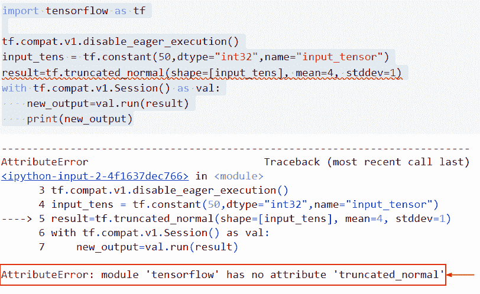
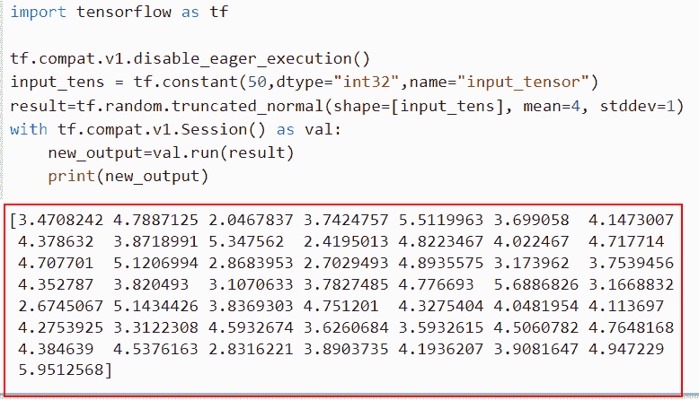
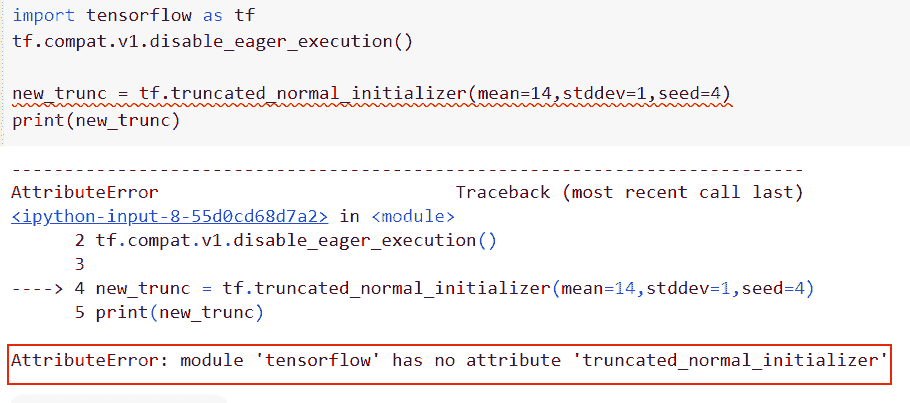
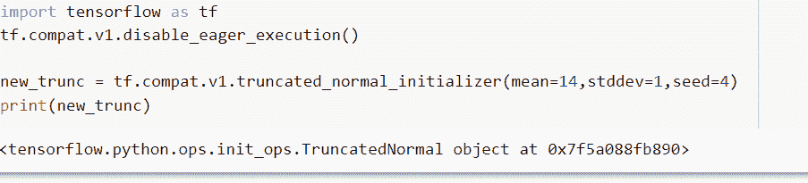

# 模块“tensorflow”没有属性“truncated_normal”

> 原文：<https://pythonguides.com/module-tensorflow-has-no-attribute-truncated_normal/>

[](https://sharepointsky.teachable.com/p/python-and-machine-learning-training-course)

在本 [Python 教程](https://pythonguides.com/learn-python/)中，我们将讨论错误“**模块‘tensor flow’没有属性‘truncated _ normal’**”。我们还将讨论以下主题:

*   Attributeerror:模块“tensorflow”没有属性“truncated_normal”
*   Attributeerror:模块“tensorflow”没有属性“truncated_normal_initializer”

另外，查看关于 TensorFlow 的最新教程:[模块“tensorflow”没有属性“optimizer”](https://pythonguides.com/module-tensorflow-has-no-attribute-optimizers/)

目录

[](#)

*   [属性错误:模块“tensorflow”没有属性“truncated _ normal”](#Attributeerror_module_tensorflow_has_no_attribute_truncated_normal "Attributeerror: module ‘tensorflow’ has no attribute ‘truncated_normal’")
*   [属性错误:模块“tensorflow”没有属性“truncated _ normal _ initializer”](#Attributeerror_module_tensorflow_has_no_attribute_truncated_normal_initializer "Attributeerror: module ‘tensorflow’ has no attribute ‘truncated_normal_initializer’")

## 属性错误:模块“tensorflow”没有属性“truncated _ normal”

*   本节将讨论如何解决错误模块**‘tensor flow’没有属性‘truncated _ normal’**。
*   为了执行这一特定任务，我们将使用 truncated_normal。任何偏离平均值超过两个标准偏差的样本都将被丢弃并减少，这些值取自具有已知平均值和标准偏差的正态分布，此方法用于从正态分布生成随机值，正态分布是指在许多事件中出现的概率分布。

**举例**:

```py
import tensorflow as tf

tf.compat.v1.disable_eager_execution()
input_tens = tf.constant(50,dtype="int32",name="input_tensor")
result=tf.truncated_normal(shape=[input_tens], mean=4, stddev=1)
with tf.compat.v1.Session() as val:
    new_output=val.run(result)
    print(new_output)
```

下面是以下代码的截图



module ‘tensorflow’ has no attribute ‘truncated_normal’

此错误的解决方案

在本例中，我们将使用`TF . random . truncated _ normal()`函数，该函数从截断的正态分布中返回一个输出随机值。

**语法**:

下面是`TF . random . truncated _ normal()`函数的语法

```py
tf.random.truncated_normal(
    shape,
    mean=0.0,
    stddev=1.0,
    dtype=tf.dtypes.float32,
    seed=None,
    name=None
) 
```

*   它由几个参数组成
    *   `shape` :这个参数定义了一个 Python 或者 1-D 整数的张量数组。输出张量的形式。
    *   **表示**:默认情况下，它取 0.0 值和 dtype 或 0-D 张量类型的 Python 值。被缩短的正态分布的平均值。
    *   `stddev`:dtype 或 0-D 张量类型的 Python 值，以及正态分布的初始标准差。
    *   `dtype` :默认取 tf.dtypes.float32，指定张量的数据类型。
    *   `seed`:Python 中的一个整数，用来产生分布的随机种子。
    *   `name` :定义操作的名称，默认情况下不取值。

```py
import tensorflow as tf

tf.compat.v1.disable_eager_execution()
input_tens = tf.constant(50,dtype="int32",name="input_tensor")
result=tf.random.truncated_normal(shape=[input_tens], mean=4, stddev=1)
with tf.compat.v1.Session() as val:
    new_output=val.run(result)
    print(new_output)
```

在上面的代码中，我们已经导入了 Tensorflow 库，然后使用`TF . compat . v1 . disable _ eager _ execution`函数来创建会话。

之后，我们应用常量函数来创建张量形状，然后使用`TF . random . truncated _ normal()`函数，在这个函数中，我们将**形状、平均值和标准偏差**指定为参数。一旦执行了这段代码，输出将显示正态分布的随机值。

你可以参考下面的截图。



Solution of attributeerror: module ‘tensorflow’ has no attribute ‘truncated_normal’

这就是我们如何解决属性错误模块“tensorflow”没有属性“truncated_normal”。

阅读:[模块“张量流”没有属性“日志”](https://pythonguides.com/module-tensorflow-has-no-attribute-log/)

## 属性错误:模块“tensorflow”没有属性“truncated _ normal _ initializer”

*   我们来讨论一下如何解决错误模块‘tensor flow’没有属性‘truncated _ normal _ initializer’。
*   为了执行这个特定的任务，我们将使用`TF . compat . v1 . truncated _ normal _ initializer()`函数，这个函数初始化器生成一个截断的正态分布。
*   这些值与来自随机正常初始值设定项的值之间的唯一区别是，偏离两个以上标准偏差的值将被丢弃和减少。应该使用这种方法初始化神经网络的权重和滤波器。

**语法**:

下面是 Python TensorFlow 中`TF . compat . v1 . truncated _ normal _ initializer()`函数的语法

```py
tf.compat.v1.truncated_normal_initializer(
    mean=0.0,
    stddev=1.0,
    seed=None,
    dtype=tf.dtypes.float32
)
```

**举例**:

```py
import tensorflow as tf
tf.compat.v1.disable_eager_execution()

new_trunc = tf.truncated_normal_initializer(mean=14,stddev=1,seed=4)
print(new_trunc)
```

下面是以下代码的截图



tensorflow has no attribute truncated_normal_initializer

此错误的解决方案。

```py
import tensorflow as tf
tf.compat.v1.disable_eager_execution()

new_trunc = tf.compat.v1.truncated_normal_initializer(mean=14,stddev=1,seed=4)
print(new_trunc)
```

你可以参考下面的截图



solution of attributeerror module tensorflow has no attribute truncated_normal_initializer

正如你在截图中看到的，我们已经解决了 attributeerror 模块 tensorflow 没有属性 truncated_normal_initializer。

你可能也喜欢阅读下面的 TensorFlow 教程。

*   [TensorFlow 全连通层](https://pythonguides.com/tensorflow-fully-connected-layer/)
*   [模块“张量流”没有属性“函数”](https://pythonguides.com/module-tensorflow-has-no-attribute-function/)
*   [熊猫数据帧到张量流数据集](https://pythonguides.com/convert-pandas-dataframe-to-tensorflow-dataset/)
*   [TensorFlow 自然语言处理](https://pythonguides.com/tensorflow-natural-language-processing/)
*   [张量流自定义损失函数](https://pythonguides.com/tensorflow-custom-loss-function/)
*   [Tensorflow 获取静态值](https://pythonguides.com/tensorflow-get-static-value/)
*   [属性错误:模块“tensorflow”没有属性“matrix _ transpose”](https://pythonguides.com/attributeerror-module-tensorflow-has-no-attribute-matrix_transpose/)

在本 Python 教程中，我们讨论了错误“**模块‘tensor flow’没有属性‘truncated _ normal’**”。我们还讨论了以下主题:

*   Attributeerror:模块“tensorflow”没有属性“truncated_normal”
*   Attributeerror:模块“tensorflow”没有属性“truncated_normal_initializer”

[Bijay Kumar](https://pythonguides.com/author/fewlines4biju/)

Python 是美国最流行的语言之一。我从事 Python 工作已经有很长时间了，我在与 Tkinter、Pandas、NumPy、Turtle、Django、Matplotlib、Tensorflow、Scipy、Scikit-Learn 等各种库合作方面拥有专业知识。我有与美国、加拿大、英国、澳大利亚、新西兰等国家的各种客户合作的经验。查看我的个人资料。

[enjoysharepoint.com/](https://enjoysharepoint.com/)[](https://www.facebook.com/fewlines4biju "Facebook")[](https://www.linkedin.com/in/fewlines4biju/ "Linkedin")[](https://twitter.com/fewlines4biju "Twitter")