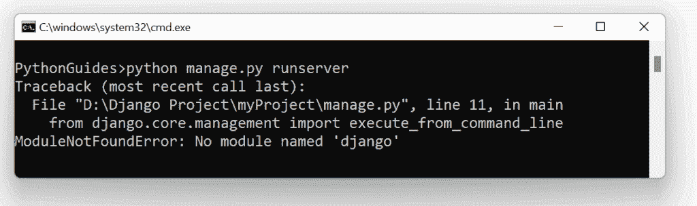

# ModuleNotFoundError:没有名为 Django 的模块

> 原文：<https://pythonguides.com/modulenotfounderror-no-module-named-django/>

[](https://sharepointsky.teachable.com/p/python-and-machine-learning-training-course)

在本 [Python Django 教程](https://pythonguides.com/how-to-install-django/)中，我们将讨论如何解决 **ModuleNotFoundError:没有名为 Django** 的模块，我们还将涉及以下主题:

*   没有名为 Django windows 10 的模块
*   没有名为 Django ubuntu 的模块
*   没有名为 Django macOS 的模块

目录

[](#)

*   [没有名为 Django windows 10 的模块](#No_module_named_Django_windows_10 "No module named Django windows 10")
*   [没有名为 Django ubuntu 的模块](#No_module_named_Django_ubuntu "No module named Django ubuntu")
*   [没有名为 Django macOS 的模块](#No_module_named_Django_macOS "No module named Django macOS")

## 没有名为 Django windows 10 的模块

本节我们将学习如何解决 windows 10 中的 **modulenotfounderror:没有名为‘django’**的模块。



ModuleNotFoundError: No module named Django

为此，首先检查您是否安装了 pip，只需在 python 终端中编写**命令 pip** 即可。如果你有，那就好，否则，从网上下载一个名为 `get-pip.py` 的 python 脚本，保存到你的本地系统。

**命令:**

```py
**# Check pip is installed or not**

pip
```

> *`Pip` 是用于从 Python 包中安装包的安装包。*

尝试了解文件保存的位置，并从命令提示符下将当前目录更改到该位置。

```py
**#If pip is not installed then** 
cd path_of_dir_of_get-pip_script
```

之后，安装 pip 并通过编写以下命令运行 `get-pip.py` 脚本:

```py
"python .\get-pip.py"
```

现在，要安装 Django 及其依赖项，请键入以下命令:

```py
pip install django
```

您的错误将会得到解决。或者，如果没有解决，则检查以下步骤。

*   如果您在虚拟环境中安装了 Django，请确保必须激活它。

```py
source venv/bin/activate
```

*   确保您正在安装的 Django 版本与您已经安装的 Python 版本兼容。
*   如果您安装了 64 位版本的 Python，请确保 Django 也是 64 位的。在 32 位的情况下，两者都必须是 32 位。
*   确保在系统和环境变量的 path 变量中包含 Python 的路径。
*   如果 pip 过期，请将其升级到最新版本。

```py
python -m pip install --upgrage pip
```

*   确保导入语句中也没有错误。

阅读: [Python 改 Django 版本](https://pythonguides.com/python-change-django-version/)

## 没有名为 Django ubuntu 的模块

在本节中，我们将学习解决**modulenotfounderror:Ubuntu 中没有名为‘django’**的模块。

要解决这个错误，您必须安装 Django。因此，要安装 Django，首先用 apt 更新您的 locale 包:

```py
sudo apt update
```

接下来，检查您安装了哪个版本的 Python。并确保它能兼容 Ubuntu 和 Django。

```py
python3 -V
```

最后，通过 APT 包管理器安装 Django。

```py
sudo apt install python3-django
```

如果您想用 pip 安装 Django，请遵循以下命令:

```py
sudo pip install django
```

通过以上步骤，您的错误将得到解决。

另外，检查: [Python Django vs 金字塔](https://pythonguides.com/python-django-vs-pyramid/)

## 没有名为 Django macOS 的模块

在本节中，我们将学习解决 **modulenotfounderror:在 macOS 中没有名为‘django’**的模块。

要解决这个错误，您必须安装 Django。并且，在安装 Django 之前，必须检查是否安装了 Python。如果已经安装了 pip 包，如果没有安装，先安装 python，然后再安装 pip 包。

最后，安装 Django。

```py
sudo pip install django
```

通过以上步骤，您的错误将得到解决。

你可能也喜欢阅读下面的 Django 教程。

*   [获取 Django 中的 URL 参数](https://pythonguides.com/get-url-parameters-in-django/)
*   [Django 模板中的 If 语句](https://pythonguides.com/if-statement-in-django-template/)
*   [Django 从 POST 请求中获取所有数据](https://pythonguides.com/django-get-all-data-from-post-request/)
*   [使用 Django 将 HTML 页面转换为 PDF](https://pythonguides.com/convert-html-page-to-pdf-using-django/)
*   [AttributeError 模块对象在 Django](https://pythonguides.com/module-object-has-no-attribute-in-django/) 中没有属性
*   [Python Django 保存所有应用程序基础模板的位置](https://pythonguides.com/django-where-to-save-base-template-for-all-apps/)

在本 Python Django 教程中，我们讨论了 Python Django no 模块 Django，并且我们还涵盖了以下主题:

*   没有名为 Django windows 10 的模块
*   没有名为 Django ubuntu 的模块
*   没有名为 Django macOS 的模块

[Bijay Kumar](https://pythonguides.com/author/fewlines4biju/)

Python 是美国最流行的语言之一。我从事 Python 工作已经有很长时间了，我在与 Tkinter、Pandas、NumPy、Turtle、Django、Matplotlib、Tensorflow、Scipy、Scikit-Learn 等各种库合作方面拥有专业知识。我有与美国、加拿大、英国、澳大利亚、新西兰等国家的各种客户合作的经验。查看我的个人资料。

[enjoysharepoint.com/](https://enjoysharepoint.com/)[](https://www.facebook.com/fewlines4biju "Facebook")[](https://www.linkedin.com/in/fewlines4biju/ "Linkedin")[](https://twitter.com/fewlines4biju "Twitter")