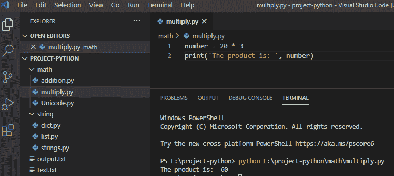
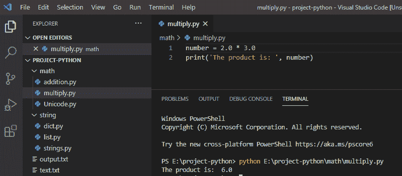
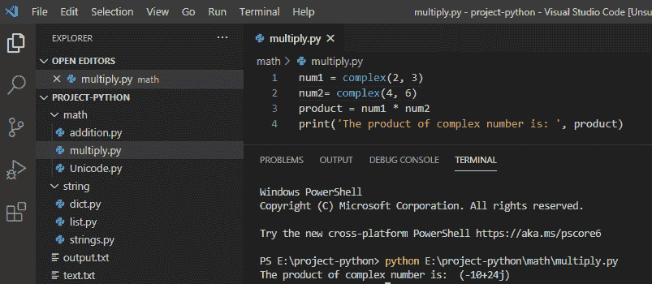
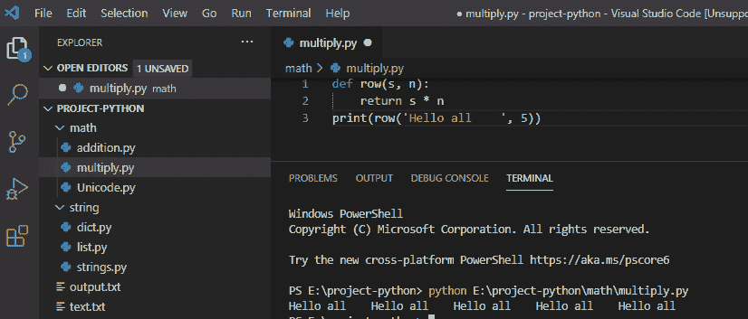
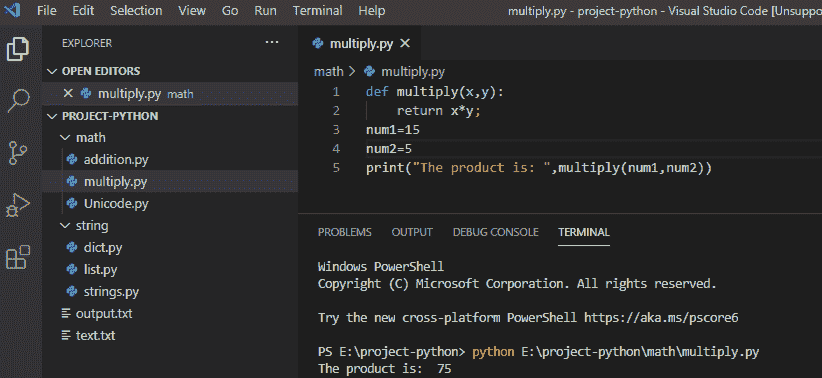
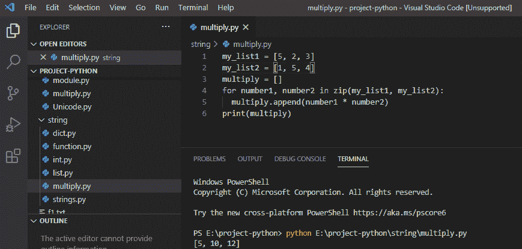
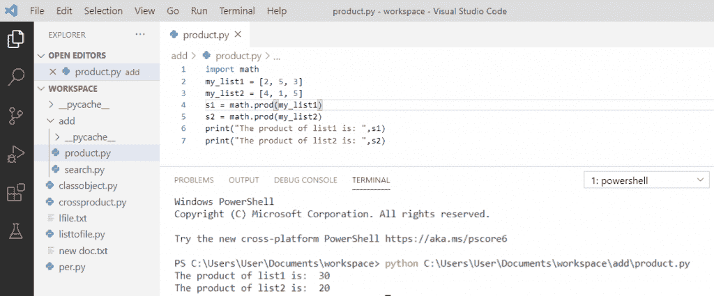
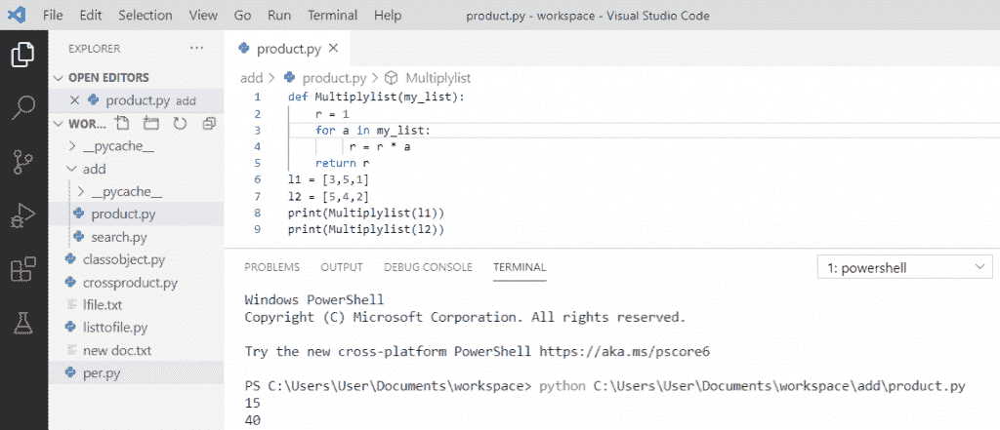
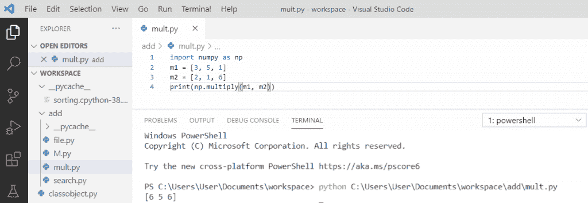

# 用 Python 做乘法并举例

> 原文：<https://pythonguides.com/multiply-in-python/>

[](https://sharepointsky.teachable.com/p/python-and-machine-learning-training-course)

在本 [Python 教程](https://pythonguides.com/python-download-and-installation/)中，我们将讨论如何在 Python 中进行乘法运算。此外，我们还将讨论:

*   如何在 Python 中实现数字相乘
*   如何在 Python 中乘浮点数
*   如何在 Python 中进行复数乘法
*   如何用 python 将字符串与整数相乘
*   使用 python 中的函数将两个数相乘
*   两个列表相乘
*   使用 math.prod python 将列表中的所有值相乘
*   使用遍历 python 将列表中的所有值相乘
*   Python 元素式乘法

目录

[](#)

*   [Python 中的乘法](#Multiply_in_Python "Multiply in Python")
*   [如何在 Python 中实现数字相乘](#How_to_multiply_numbers_in_Python "How to multiply numbers in Python")
*   [如何在 Python 中乘浮点数](#How_to_multiply_float_numbers_in_Python "How to multiply float numbers in Python")
*   [如何在 Python 中进行复数乘法](#How_to_multiply_complex_numbers_in_Python "How to multiply complex numbers in Python")
*   [python 中如何将字符串与整数相乘](#How_to_multiply_string_with_an_integer_in_python "How to multiply string with an integer in python")
*   [使用 python 中的函数将两个数相乘](#Multiply_two_numbers_using_the_function_in_python "Multiply two numbers using the function in python")
*   [两个列表相乘 python](#Multiply_two_lists_python "Multiply two lists python")
*   [使用 math.prod python 将列表中的所有值相乘](#Multiply_all_value_in_the_list_using_mathprod_python "Multiply all value in the list using math.prod python")
*   [使用遍历 python 将列表中的所有值相乘](#Multiply_all_value_in_the_list_using_traversal_python "Multiply all value in the list using traversal python")
*   [Python 元素式乘法](#Python_element-wise_multiplication "Python element-wise multiplication")

## Python 中的乘法

现在，我们将讨论如何在 Python 中进行**乘法。我们将会看到如何使用 python 中的函数将浮点数相乘、将复数相乘、将字符串与整数相乘以及将两个数相乘。**

## 如何在 Python 中实现数字相乘

在 python 中，要乘数字，我们会使用星号字符 `" * "` 来乘数字。

**举例:**

```py
number = 20 * 3
print('The product is: ',number)
```

写完上面的代码(如何在 Python 中进行数字相乘)，你将打印出**“数字”**然后输出将显示为**“乘积是:60”**。这里，星号字符用于乘以数字。

可以参考下面的截图，用 python 做数字相乘。



How to multiply numbers in Python

这就是我们如何在 python 中实现数字相乘。

## 如何在 Python 中乘浮点数

在 python 中，我们也可以使用星号字符 `" * "` 将一个或两个数字相乘，当它是浮点数类型时，那么乘积就是浮点数。

**举例:**

```py
number = 2.0 * 3.0
print('The product is: ',number)
```

写完上面的代码(如何在 Python 中乘浮点数)，你将打印出**“number”**然后输出将显示为**“产品是:6.0”**。这里，星号字符用于乘以浮点数。

你可以参考下面的截图在 python 中乘浮点数。



How to multiply float numbers in Python

这就是我们如何在 python 中乘以浮点数。

## 如何在 Python 中进行复数乘法

在 python 中，要将复数相乘，我们使用 `complex()` 方法将两个数相乘，复数包含实部和虚部。这里，我们将第一个数字乘以第二个数字。

**举例:**

```py
num1 = complex(2, 3)
num2 = complex(4, 6)
product = num1 * num2
print('The product of complex number is: ', product)
```

写完上面的代码(如何在 Python 中进行复数相乘)，你将打印出**“乘积”**然后输出将显示为**“复数的乘积是:(-10+24j)”**。这里，**复数()**用于乘以复数。

可以参考下面截图用 python 做复数乘法。



How to multiply complex numbers in Python

这就是我们如何在 python 中乘法复数的方法

## python 中如何将字符串与整数相乘

在 python 中，用一个整数乘以一个字符串，我们使用一个带参数的 **def 函数**，它会将字符串复制 n 次。

**举例:**

```py
def row(s, n):
return s * n
print(row('Hello all   ', 5))
```

写完上面的代码(如何在 python 中用一个整数乘字符串)，你要打印的那些，然后输出将显示为`" Hello all Hello all`Hello all`**`Hello all`**Hello all "`。这里， **n 是 5，**s 是"**【Hello all "**，它会返回 5 次重复的字符串。

你可以参考下面的截图，用 python 把字符串和整数相乘。



How to multiply string with an integer in python

这就是我们如何在 python 中用整数乘以字符串的方法。

## 使用 python 中的函数将两个数相乘

在 python 中，使用名为 `def` 的函数将两个数字相乘，它可以接受两个参数，返回结果将给出这两个数字的值。

**举例:**

```py
def multiply(x,y):
return x*y;
num1=15
num2=5
print("The product is: ",multiply(num1,num2))
```

编写上述代码(使用 python 中的函数将两个数字相乘)后，您将打印一个数字，然后输出将显示为**“产品是:75”**。这里，我们为乘法定义函数，然后它将返回值。

你可以参考下面的截图，使用 python 中的函数将两个数相乘



Multiply two numbers using the function in python

这就是我们如何使用 python 中的函数将两个数相乘。

## 两个列表相乘 python

在 python 中，要将两个长度相等的列表相乘，我们将使用 `zip()` 来获取列表，它将相乘，然后被追加到一个新的列表中。

**举例:**

```py
my_list1 = [5, 2, 3]
my_list2 = [1, 5, 4]
multiply = []
for number1, number2 in zip(my_list1, my_list2):
multiply.append(number1 * number2)
print(multiply)
```

写完上面的代码后(用 python 将两个列表相乘)，你将打印出 `"multiply"` ，然后输出将显示为 **" [5 10 12] "** 。这里，我们将一个列表中的每个元素乘以另一个列表中的元素。

你可以参考下面的截图，用 python 把两个列表相乘



Multiply two lists python

## 使用 math.prod python 将列表中的所有值相乘

为了将列表中的所有值相乘，标准库中的**数学模块**中包含了一个 **prod 函数**。我们将使用**导入数学**来得到列表的乘积。

**举例:**

```py
import math
my_list1 = [2, 5, 3]
my_list2 = [4, 1, 5]
s1 = math.prod(my_list1)
s2 = math.prod(my_list2)
print("The product of list1 is: ",s1)
print("The product of list2 is: ",s2)
```

写完上面的代码后(用 math.prod 将列表中的所有值相乘)，你将打印出 `"s1 s2"` ，然后输出将显示为**"列表 1 的乘积是:30，列表 2 的乘积是:20 "** 。这里，我们将 list1 的所有元素相乘，然后将 list2 相乘，得到乘积。

你可以参考下面的截图，使用 math.prod 将列表中的所有值相乘



Multiply all value in the list using math.prod

## 使用遍历 python 将列表中的所有值相乘

要使用遍历将列表中的所有值相乘，我们需要将乘积的值初始化为 1。将每个数字乘以乘积，遍历到列表的末尾。

**举例:**

```py
def Multiplylist(my_list):
    r = 1
    for a in my_list:
         r = r * a
    return r
l1 = [3,5,1]
l2 = [5,4,2]
print(Multiplylist(l1))
print(Multiplylist(l2))
```

写完上面的代码(使用遍历 python 将列表中的所有值相乘)，你将打印出`" Multiplylist(L1)Multiplylist(L2)"`，然后输出将显示为 `" 15 40 "` 。这里，我们将 l1 的所有元素相乘，然后将 l2 相乘，得到乘积。最终储存在产品中的价值会给你结果。

你可以参考下面的截图使用遍历 python 乘以列表中的所有值



Multiply all value in the list using traversal python

## Python 元素式乘法

让我们看看如何在 python 中对元素进行乘法运算。

在 python 中，元素级乘法可以通过导入 `numpy` 来完成。为了将两个等长的数组相乘，我们将使用 `np.multiply()` ，它将逐元素相乘。

**举例:**

```py
import numpy as np
m1 = [3, 5, 1]
m2 = [2, 1, 6]
print(np.multiply(m1, m2))
```

写完上面的代码(python 元素级乘法)，你将打印出 **"np.multiply(m1，m2)"** ，然后输出将显示为 **" [6 5 6] "** 。这里，我们将每个元素相乘，它将返回两个 m1 和 m2 的乘积。

可以参考下面截图 python 元素式乘法。



Python element-wise multiplication

这就是我们如何在 python 中把两个列表相乘。

您可能会喜欢以下 Python 教程:

*   [Python 对于基数为 10 的 int()无效文字](https://pythonguides.com/python-invalid-literal-for-int-with-base-10/)
*   [Python 元组排序列表](https://pythonguides.com/python-sort-list-of-tuples/)
*   [如何在 Python 中处理 indexerror:字符串索引超出范围](https://pythonguides.com/indexerror-string-index-out-of-range-python/)
*   [解析 Python 时出现意外的 EOF](https://pythonguides.com/unexpected-eof-python/)
*   [删除 python 中的 Unicode 字符](https://pythonguides.com/remove-unicode-characters-in-python/)
*   [Python 中的注释行](https://pythonguides.com/comment-lines-in-python/)
*   [Python 将列表转换成字符串](https://pythonguides.com/python-convert-list-to-string/)
*   [Python 方块一号](https://pythonguides.com/python-square-a-number/)
*   [无换行符的 Python 打印](https://pythonguides.com/python-print-without-newline/)
*   [Python 字典方法+示例](https://pythonguides.com/python-dictionary-methods/)
*   [从字符串 Python 中删除字符](https://pythonguides.com/remove-character-from-string-python/)
*   [获取当前目录 Python](https://pythonguides.com/get-current-directory-python/)
*   [python 中的百分号是什么意思](https://pythonguides.com/percent-sign-mean-in-python/)

在本教程中，我们学习了如何用 Python 进行乘法运算。

*   如何在 Python 中实现数字相乘
*   如何在 Python 中乘浮点数
*   如何在 Python 中进行复数乘法
*   如何用 python 将字符串与整数相乘
*   使用 python 中的函数将两个数相乘
*   两个列表相乘
*   使用 math.prod python 将列表中的所有值相乘
*   使用遍历 python 将列表中的所有值相乘
*   Python 元素式乘法

[Bijay Kumar](https://pythonguides.com/author/fewlines4biju/)

Python 是美国最流行的语言之一。我从事 Python 工作已经有很长时间了，我在与 Tkinter、Pandas、NumPy、Turtle、Django、Matplotlib、Tensorflow、Scipy、Scikit-Learn 等各种库合作方面拥有专业知识。我有与美国、加拿大、英国、澳大利亚、新西兰等国家的各种客户合作的经验。查看我的个人资料。

[enjoysharepoint.com/](https://enjoysharepoint.com/)[](https://www.facebook.com/fewlines4biju "Facebook")[](https://www.linkedin.com/in/fewlines4biju/ "Linkedin")[](https://twitter.com/fewlines4biju "Twitter")