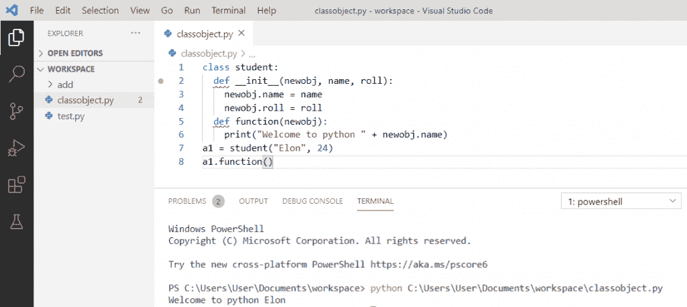
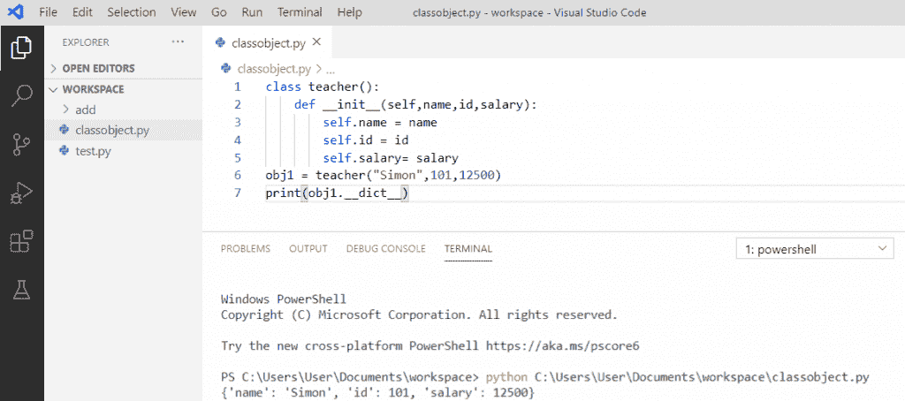

# 面向对象编程 python

> 原文：<https://pythonguides.com/object-oriented-programming-python/>

[](https://sharepointsky.teachable.com/p/python-and-machine-learning-training-course)

在本 [Python 教程](https://pythonguides.com/python-programming-for-the-absolute-beginner/)中，我们将讨论**面向对象编程 python** ，我们将借助例子学习概念。

*   python 中的面向对象编程
*   什么是 Python OOPs 概念
*   用 python 创建一个类
*   python 中的实例属性
*   python 中的类属性
*   用 python 创建一个对象
*   python 中的 init [函数](https://pythonguides.com/function-in-python/)
*   python 中的方法
*   python 中的 Self 参数
*   用 python 创建一个对象和类
*   Python 修改对象属性
*   python 中的继承
*   Python 中的继承类型
*   python 中的方法覆盖
*   python 中的方法重载
*   Python 中的多态性
*   python 中的封装
*   Python 中的抽象
*   Python 打印对象属性

目录

[](#)

*   [Python 中的面向对象编程](#Object_Oriented_Programming_in_Python "Object Oriented Programming in Python")
*   [什么是 Python OOPs 概念](#What_are_Python_OOPs_concepts "What are Python OOPs concepts")
*   [用 python 创建一个类](#Create_a_class_in_python "Create a class in python")
*   [在 python 中创建一个对象](#Create_an_object_in_python "Create an object in python")
*   [python 中的实例属性](#Instance_Attribute_in_python "Instance Attribute in python")
*   [python 中的类属性](#Class_Attribute_in_python "Class Attribute in python")
*   [python 中的 init 函数](#The_init_function_in_python "The init function in python")
*   python 中的[方法](#Method_in_python "Method in python")
*   [python 中的 Self 参数](#Self_Parameter_in_python "Self Parameter in python")
*   [在 python 中创建一个对象和类](#Create_an_object_and_class_in_python "Create an object and class in python")
*   [Python 修改对象属性](#Python_modify_object_properties "Python modify object properties")
*   [python 中的继承](#Inheritance_in_python "Inheritance in python")
*   [Python 中的继承类型](#Types_of_Inheritance_in_Python "Types of Inheritance in Python")
    *   [单一继承](#Single_Inheritance "Single Inheritance")
    *   [多重继承](#Multiple_Inheritance "Multiple Inheritance")
    *   [多级继承](#Multilevel_Inheritance "Multilevel Inheritance")
    *   [层次继承](#Hierarchical_Inheritance "Hierarchical Inheritance")
    *   [混合遗传](#Hybrid_Inheritance "Hybrid Inheritance")
*   [python 中的方法覆盖](#Method_Overriding_in_python "Method Overriding in python")
*   [python 中的方法重载](#Method_Overloading_in_python "Method Overloading in python")
*   [Python 中的多态性](#Polymorphism_in_Python "Polymorphism in Python")
*   [python 中的封装](#Encapsulation_in_python "Encapsulation in python")
*   [python 中的抽象](#Abstraction_in_python "Abstraction in python")
*   [Python 打印对象属性](#Python_print_object_attributes "Python print object attributes")

## Python 中的面向对象编程

Python 是一种**面向对象的编程语言**，它支持不同的编程方法，其中一种方法是通过创建**“对象”**，这意味着我们可以通过在程序中创建对象来解决 python 中的问题。

在 python 中，我们可以很容易地创建和使用类和对象，而且它专注于编写可重用的代码。

## 什么是 Python OOPs 概念

Python 面向对象编程概念包括类、对象、方法等，以及继承、多态、封装和数据抽象等 OOPs 特性。

## 用 python 创建一个类

一个类是对象的蓝图，为了创建一个类，我们将使用 **class 关键字**并从类中构造实例。

**举例:**

```py
class student:
    roll = 1

print(student)
```

写完上面的代码(用 Python 创建一个类)，你将打印出 `" student "` ，然后输出将显示为 **" <类' __main__。学生'> "** 。这里，class 是关键字，class 名称是“student”。

可以参考下面截图**用 python** 创建一个类。


Create a class in python

## 在 python 中创建一个对象

让我们看看**如何在 Python** 中创建一个对象。

在 python 中，**对象是真实世界的实体**，它有自己的状态和行为，python 中的一切都是对象。要创建一个对象，我们可以使用类名。

**举例:**

```py
class student:
    roll = 1

a1 = student()
print(a1.roll)
```

写完上面的代码(用 python 创建一个对象)，你将打印出 `" a1.roll "` ，然后输出将显示为 `" 1 "` 。这里，类名是“student ”,我们创建了 class student 的对象“a1 ”,我们将打印 roll 的值。

你可以参考下面的截图用 python 创建一个对象。


Create an object in python

## python 中的实例属性

在 python 中，**实例属性**是附加到类实例的一个或多个属性。通过使用点符号来访问该实例。

**举例:**

```py
class teacher:
    def __init__(self):
        self.name="John"
        self.salary=100000

t1=teacher()
print(t1.name)
print(t1.salary)
```

*   写完上面的代码(python 中的实例属性)后，你将打印出 `" t1.name t1.salary "` ，然后输出将显示为 `" John 100000 "` 。这里，实例属性由构造函数中的**名**和**薪**定义。
*   实例属性通过点符号 **t1 来访问**是**实例名**和**。名称**是**属性名称**。

可以参考下面 python 中的截图实例属性。


Instance Attribute in python

## python 中的类属性

一个**类属性**是一个属性，它的值对于一个类的所有实例保持不变，称为类属性。它是在类级别定义的，而不是在方法内部定义的。class 属性的值由所有对象共享。

**举例:**

```py
class teacher:
    value = "Welcome"

print(teacher.value)
```

写完上面的代码(python 中的 class 属性)，你将打印出 `" teacher.value "` ，然后输出将显示为 `" Welcome "` 。这里，通过使用类名**“教师”**和类属性**来访问属性。值”。**

可以参考下面 python 中的截图类属性


Class Attribute in python

## python 中的 init 函数

在 python 中， **__init__()是一个内置函数**，所有的类都有一个名为 init 的函数，这个函数总是在类初始化时执行。我们使用 __init__()为对象属性赋值。

**举例:**

```py
class student:
    def __init__(self, name, roll):
        self.name = name
        self.roll = roll

a1 = student("Eelon", 24)
print(a1.name)
print(a1.roll)
```

在编写了上面的代码(python 中的 init 函数)之后，如果您将打印 `" a1.name a1.roll "` ，那么输出将显示为 `" Eelon 24 "` 。这里，类名是“student ”,我们使用 init 函数来赋值 name 和 roll，然后打印出值。

可以参考下面的截图 python 中的 init 函数。


The init function in python

## python 中的方法

python 中的**方法类似于函数，方法是定义在类体内的函数，用于定义对象的行为。**

**举例:**

```py
class student:
    def __init__(self, name, roll):
        self.name = name
        self.roll = roll
        def function(self):
            print("Welcome to python " + self.name)

a1 = student("Elon", 24)
a1.function()
```

*   写完上面的代码(python 中的方法)后，如果你要打印 `" a1.function() "` 那么输出会显示为**"欢迎使用 python Elon"** 。
*   这里，类名是“student ”,我们使用 init 函数来赋值 name 和 roll，这里我的实例方法是“function()”,它被称为实例方法，因为它是在实例对象“a1”上调用的。

可以参考下面 python 中的截图方法。


Method in python

*   [Python 中的字符串方法及示例](https://pythonguides.com/string-methods-in-python/)
*   [Python 字典方法+示例](https://pythonguides.com/python-dictionary-methods/)
*   [11 Python 列表方法](https://pythonguides.com/python-list-methods/)

## python 中的 Self 参数

**self 参数**用于引用一个类的当前实例，同样通过使用**“self”**我们可以访问 python 中一个类的属性和方法。我们可以使用另一个参数名来代替“self ”,但是它应该是类中任何函数的第一个参数。

**举例:**

```py
class student:
    def __init__(newobj, name, roll):
        newobj.name = name
        newobj.roll = roll
    def function(newobj):
        print("Welcome to python " + newobj.name)

a1 = student("Elon", 24)
a1.function()
```

在编写了上面的代码(python 中的 self 参数)之后，如果您将打印 `" a1.function() "` ，那么输出将显示为**"欢迎使用 python Eelon "** 。在这里，我们使用单词“newobj”代替 self，仍然得到相同的结果。

可以参考下面 python 中的截图自参数。



Self Parameter in python

## 在 python 中创建一个对象和类

类是对象的集合，或者我们可以说它是具有共同行为和属性的对象的蓝图。对象是具有状态和行为的类的实例。

**举例:**

```py
class teacher():
    def __init__(self,name,id,salary):
        self.name = name
        self.id = id
        self.salary = salary

obj1 = teacher("Simon",101,12500)
print(obj1.__dict__) 
```

*   写完上面的代码(用 python 创建对象和类)，如果你会打印 **" obj1。__dict__() "** 那么输出会出现一个 **" { '姓名':'西蒙'，' id': 101，'薪金':12500} "** 。
*   这里，**‘obj 1’**是针对类**‘老师’**实例化的对象。单词 **'__dict__'** 是一个字典，它打印带有给定参数的对象的所有值。

你可以参考下面用 python 创建对象和类的截图。



Create an object and class in python

## Python 修改对象属性

在 python 中，可以修改对象的属性。在这里，我们将修改“卷”。

**举例:**

```py
class student:
    def __init__(self, name, roll):
        self.name = name
        self.roll = roll
    def function(self):
        print("Welcome to python " + self.name)

a1 = student("Elon", 24)
a1.roll = 30
print(a1.roll)
```

在编写了上面的代码(python 修改对象属性)之后，如果您将打印 `" a1.roll() "` ，那么输出将显示为 `" 30 "` 。这里，它将修改卷，我们需要设置 a1 的卷为 30，它将打印修改后的结果。

可以参考下面截图 **python 修改对象属性**。


Python modify object properties

## python 中的继承

让我们试着用一个例子来理解 Python 中的**继承。**

**继承**是一个类从另一个类继承所有属性和方法的过程。新的类被称为派生类或子类，而派生它的类被称为父类或基类。

**举例:**

```py
class Teacher():
    def myfirst(self):
        print('This is my first function')

class Child(Teacher):
    def mysecond(self):
        print('This is my second function')

obj = Child()
obj.myfirst()
obj.mysecond()
```

写完上面的代码(python 中的继承)，如果你要打印，那么输出将显示为**“这是我的第一个函数，这是我的第二个函数”**。在这里，您可以使用子类对象来访问父类函数。

可以参考下面截图`python`中的继承。


Inheritance in python

## Python 中的继承类型

继承的类型取决于所涉及的子类和父类的数量。python 中有四种**类型的继承。**

*   单一遗传
*   多重遗传
*   多级遗传
*   分层继承
*   混合遗传

### 单一继承

在**单继承**中，子类只继承一个父类。

**举例:**

```py
class Teacher():
    def myfirst1(self):
        print('This is my first function')
class Child(Teacher):
    def mysecond2(self):
        print('This is my second function')

obj = Child()
obj.myfirst1()
obj.mysecond2()
```

写完上面的代码(单继承)，如果你要打印那么输出会显示为**“这是我的第一个函数这是我的第二个函数”**。在这里，您可以使用子类对象访问父类函数，并且子类继承单个父类的属性。

可以参考下面截图`python`中的单继承。


Single Inheritance

### 多重继承

在**多重继承**中，一个子类从多个父类继承。

**举例:**

```py
 class Teacher1:
    def myfirst1(self):
        print('This is my first function')
class Teacher2:
    def mysecond2(self):
        print('This is my second function')
class Child(Teacher1,Teacher2):
    def mythird3(self):
        print('This is my third function')

obj = Child()
obj.myfirst1()
obj.mysecond2()
obj.mythird3()
```

*   写完上面的代码(多重继承)，如果你要打印，那么输出将显示为**“这是我的第一个函数，这是我的第二个函数，这是我的第三个函数”**。
*   在这里，你既可以用子类对象继承父类的功能，又可以用子类继承多个父类的属性。

可以参考下面截图`python`中的多重继承。


Multiple Inheritance

### 多级继承

在**多级继承**中，子类成为另一个子类的父类

**举例:**

```py
class Teacher:
    def myfirst1(self):
        print('This is my first function')
class Child(Teacher):
    def mysecond2(self):
        print('This is my second function')
class Child2(Child):
    def mythird3(self):
        print('This is my third function')

obj = child()
obj.myfirst1()
obj.mysecond2()
obj.mythird3()
```

写完上面的代码(多级继承)后，如果你要打印，那么输出将显示为**“这是我的第一个函数，这是我的第二个函数，这是我的第三个函数”**。这里，子类充当另一个子类的父类。

可以参考下面截图`python`中的多级继承。


Multilevel Inheritance

### 层次继承

在**层次继承**中，不止一个派生类继承父类的属性。

**举例:**

```py
class Teacher:
    def myfirst1(self):
        print('This is my first function')
class Child(Teacher):
    def mysecond2(self):
        print('This is my second function')
class Child2(Teacher):
    def mythird3(self):
        print('This is my third function')

obj = Child()
obj1 = Child2()
obj.myfirst1()
obj.mysecond2()
obj1.myfirst1()
obj1.mythird3()
```

写完上面的代码(层次继承)后，如果你要打印，那么输出将显示为**“这是我的第一个函数这是我的第二个函数**这是我的第一个函数`** `这是我的第三个函数”**。这里，我们有一个父类和两个子类或派生类。

可以参考下面截图`python`中的层次继承。


Hierarchical Inheritance

### 混合遗传

**混合继承**涉及发生在单个程序中多种类型的继承。

**举例:**

```py
class Teacher:
    def myfirst1(self):
        print('This is my first function')
class Child(Teacher):
    def mysecond2(self):
        print('This is my second function')
class Child2(Teacher):
    def mythird3(self):
        print('This is my third function')
class Child3(Child,Teacher):
    def myfourth4(self):
        print('This is my fourth function')

obj = Child3()
obj.myfirst1()
obj.mysecond2() 
```

在编写了上面的代码(混合继承)之后，如果你要打印，那么输出将显示为**“这是我的第一个函数，这是我的第二个函数。这里，多重继承发生在一个程序中。**

 **可以参考下面截图 python 中的混合继承。


Hybrid Inheritance

## python 中的方法覆盖

*   **Python 方法覆盖**意味着创建两个具有相同名称和相同参数数量的方法，但打印消息不同。
*   这里，**方法覆盖**允许我们在子类中改变或覆盖父类函数。方法重写是运行时多态性的一个例子。

**举例:**

```py
class Teacher:
    def new(self):
        print("I am Teacher")

class Child(Teacher):
    def new(self):
        print("I am Child")

obj=Child()
obj.new()
```

*   在编写了上面的代码(python 中的方法覆盖)之后，如果要打印，那么输出将显示为**“我是孩子。**
*   **这里，我们创建了一个教师类，它包含一个新的 as 方法和要打印的消息，我们还创建了一个子类，它继承了教师类的父类，并将覆盖消息。**

 **可以参考下面 python 中的截图方法 overriding。


Method Overriding in python

## python 中的方法重载

*   **Python 方法重载**意味着我们可以有相同的名字但不同的参数，一个方法可以有一个或多个参数。
*   用不同的方式调用同一个方法，在 python 中称为方法重载。方法重载是编译时多态性的一个例子。

**举例:**

```py
class Teacher:
    def new(self, name=None):
        if name is not None:
            print('Welcome ' + name)
        else: 
            print('Welcome')

obj = Teacher()
obj.new()
obj.new('sam')
```

*   写完上面的代码(python 中的方法重载)后，如果要打印，那么输出将显示为**“欢迎欢迎 Sam**”****。
*   我们创建了一个包含一个 `new()` 方法的教师类。我们首先调用不带任何参数的方法 `obj.new()` ，它输出“欢迎”,下一次我们调用带参数值的方法“Sam ”,这样我们可以用两种方式调用 new()方法。

关于 python 中的方法重载，可以参考下面的截图。


Method Overloading in python

## Python 中的多态性

*   **Python 中的多态性**表示不止一种形式。同样，我们可以说它是一种以不同形式出现的情况。
*   **多态性**是编程中的重要概念之一。例如，我们知道**“+”**运算符用于将两个整数相加，对于字符串，相同的**“+”**运算符用于字符串连接。

**举例:**

```py
val1 = 10
val2 = 20
print(val1+val2)
```

*   写完上面的代码(python 中的多态)后，如果要打印，那么输出将显示为 `" 30` `"` 。
*   这里， `" + "` 运算符用于将两个整数相加，这里我们还将看到字符串连接，因此这里的 `" + "` 运算符可以对不同的数据类型执行不同的运算。

可以参考下面 python 中的截图多态性。


Polymorphism in Python

**举例:**

```py
string1 = "Welcome"
string2 = "Python Guides"
print(string1+" "+string2)
```

*   在编写了上面的代码(python 中的多态性)之后，如果要打印，那么输出将显示为**“欢迎 Python 指南”**。
*   这里， `" + "` 操作符用于连接两个字符串，因此， `" + "` 操作符可以对不同的数据类型执行不同的操作。这样，多态性就起作用了。

你可以参考下面的截图。


Polymorphism in Python

## python 中的封装

*   **封装**是将变量和方法包装成一个单元的过程，它是 Python 中**面向对象编程的基本概念。**
*   在 python 中，虽然没有使用(__)双下划线的显式访问修饰符，但我们可以使变量私有。

**举例:**

```py
class Teacher:
    def __init__(self, name, salary):
        self.name = name
        self.__salary = salary
    def disp(self):
        print(self.name)
        print(self.__salary)

teacher = Teacher('Suzan', 500000)
teacher.disp()
print(teacher.name)
print(teacher.__salary)
```

*   写完上面的代码(用 python 封装)后，如果要打印，那么输出将显示为**“Suzan 500000****”**。
*   在这里，您可以看到仍然可以通过使用属于类的方法和私有变量**“salary”**来访问该变量。
*   不能从外部直接访问，会抛出一个名为**“属性错误”**的错误。

可以参考下面 python 中的截图封装。


Encapsulation in python

## python 中的抽象

*   在 python 中，**抽象**用于隐藏内部细节和显示功能。抽象意味着隐藏真正的实现，并知道如何作为用户使用它，这是通过使用抽象类和接口来实现的。
*   抽象类是提供不完整功能的类，接口提供没有方法体的方法名。

**举例:**

```py
from abc import ABC,abstractmethod

class teacher(ABC):
    def teach_id(self, id, name, salary):
        pass 
class child1(teacher):
    def teach_id(self,id):
        print("teach_id is 14520")

teach1 = child1()
teach1.teach_id(id)
```

*   写完上面的代码(python 中的抽象)，如果你要打印，那么输出将显示为**“teach _ id 是 14520**”****。
*   这里，我们已经**导入了一个抽象方法**，并且我们有了父类和子类。
*   此外，对象被实例化为**‘child 1’**，并且使用了 abstract 的功能。

可以参考下面 python 中的截图抽象。


Abstraction in python

## Python 打印对象属性

属性是类中的变量或方法。要打印一个对象的属性，我们可以使用**object。__dict__"** 它返回对象所有名称和属性的字典。

**举例:**

```py
class x:
    val = None
    def f():
        pass
print(x.__dict__)
```

写完上面的代码(python 打印对象属性)，一旦你将打印 `"x.__dict__"` 那么输出就会出现。在这里，使用**对象。__dict__** 将打印一个对象的属性。

你可以参考下面的 python 打印对象属性截图


Python print object attributes

您可能会喜欢以下 Python 教程:

*   [Python 匿名函数](https://pythonguides.com/python-anonymous-function/)
*   [Python 访问修饰符+示例](https://pythonguides.com/python-access-modifiers/)
*   [Python 数组与示例](https://pythonguides.com/python-array/)
*   [Python For 循环示例](https://pythonguides.com/python-for-loop/)
*   [Python 读取 excel 文件并在 Python 中写入 Excel](https://pythonguides.com/python-read-excel-file/)
*   [Python 创建空集](https://pythonguides.com/python-create-empty-set/)
*   [Python 关键字与示例](https://pythonguides.com/python-keywords/)
*   [Python While 循环示例](https://pythonguides.com/python-while-loop/)
*   [名称错误:Python 中没有定义名称](https://pythonguides.com/nameerror-name-is-not-defined/)
*   [Python 中的字符串方法及示例](https://pythonguides.com/string-methods-in-python/)
*   [Python 检查变量是否为整数](https://pythonguides.com/python-check-if-the-variable-is-an-integer/)

在本教程中，我们学习了 python 中的**面向对象编程，也看到了如何通过一个例子来使用它:**

*   python 中的面向对象编程
*   什么是 Python OOPs 概念
*   用 python 创建一个类
*   python 中的实例属性
*   python 中的类属性
*   用 python 创建一个对象
*   python 中的 init 函数
*   python 中的方法
*   python 中的 Self 参数
*   用 python 创建一个对象和类
*   Python 修改对象属性
*   python 中的继承
*   Python 中的继承类型
*   python 中的方法覆盖
*   python 中的方法重载
*   Python 中的多态性
*   python 中的封装
*   Python 中的抽象
*   Python 打印对象属性

[Bijay Kumar](https://pythonguides.com/author/fewlines4biju/)

Python 是美国最流行的语言之一。我从事 Python 工作已经有很长时间了，我在与 Tkinter、Pandas、NumPy、Turtle、Django、Matplotlib、Tensorflow、Scipy、Scikit-Learn 等各种库合作方面拥有专业知识。我有与美国、加拿大、英国、澳大利亚、新西兰等国家的各种客户合作的经验。查看我的个人资料。

[enjoysharepoint.com/](https://enjoysharepoint.com/)[](https://www.facebook.com/fewlines4biju "Facebook")[](https://www.linkedin.com/in/fewlines4biju/ "Linkedin")[](https://twitter.com/fewlines4biju "Twitter")****