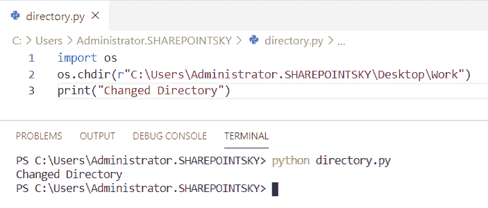
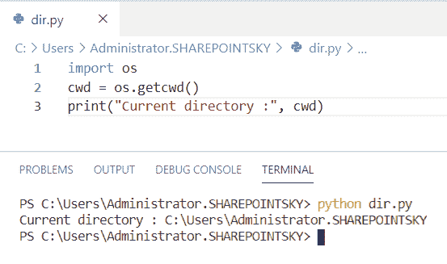
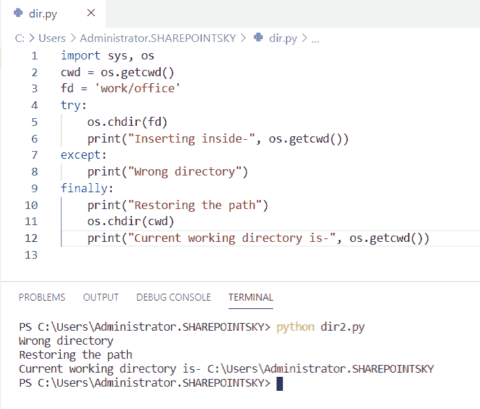
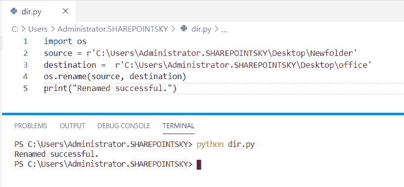
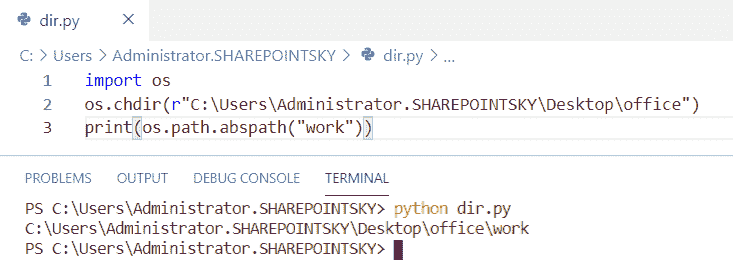

# 操作系统更改目录 Python

> 原文：<https://pythonguides.com/os-change-directory-python/>

[](https://sharepointsky.teachable.com/p/python-and-machine-learning-training-course)

在这个 [python 教程中，](https://pythonguides.com/python-hello-world-program/)你将了解到 **Os 更改目录 python** 我们也将检查 **:**

*   如何使用 chdir()改变目录
*   检查当前工作目录
*   更改目录例外
*   Python 操作系统更改目录名
*   Python os 获取当前目录的绝对路径

目录

[](#)

*   [如何使用 chdir()](#How_to_change_directory_using_chdir "How to change directory using chdir()") 更改目录
*   [检查 Python 中的当前工作目录](#Check_current_working_directory_in_Python "Check current working directory in Python")
*   [在 Python 中更改目录异常](#Changing_directory_exceptions_in_Python "Changing directory exceptions in Python")
*   [Python os 更改目录名](#Python_os_change_directory_name "Python os change directory name")
*   [Python os 获取当前目录的绝对路径](#Python_os_get_absolute_path_of_the_current_directory "Python os get absolute path of the current directory")

## 如何使用 chdir() 更改目录

现在，我们可以看到**如何在 python 中使用 chdir()** 改变目录。

*   在这个例子中，我已经将模块作为 `os` 导入。
*   `os.chdir` 用于改变目录。
*   当目录改变时，**改变的目录**作为输出被打印。

示例:

```py
import os 
os.chdir(r"C:\Users\Administrator.SHAREPOINTSKY\Desktop\Work") 
print("Changed Directory") 
```

下面的截图显示了输出。



Change directory using chdir()

这是**如何在 Python** 中使用 chdir()改变目录。

你可能会喜欢，[如何打印 Python 斐波那契数列](https://pythonguides.com/python-fibonacci-series/)。

## 检查 Python 中的当前工作目录

这里可以看到**如何在 python 中检查当前工作目录**。

*   在这个例子中，我导入了一个名为 `os` 的模块。
*   这里，我们使用的是 `os.chdir` 和路径。
*   `os.getcwd()` 返回当前目录。
*   为了获得输出，我使用了 **print("当前目录:"，cwd)** 。

示例:

```py
import os 
cwd = os.getcwd()  
print("Current directory :", cwd) 
```

我们可以看到当前目录作为输出。你可以参考下面的截图。



Check the current working directory

这段代码我们可以用来**检查 Python** 中的当前工作目录。

## 在 Python 中更改目录异常

现在，我们可以看到**如何在 python 中改变目录异常**。

*   在这个例子中，我导入了一个名为 `sys` 和 **os 的模块。**
*   `os.getcwd()` 返回当前目录
*   错误的目录被分配为**FD =‘工作/办公室’**。
*   try 块用于检查代码块。
*   如果出现任何错误，则使用除之外的**。**
*   执行 finally 块，并使用 `os.getcwd` 获取当前目录。

示例:

```py
import sys, os 
cwd = os.getcwd() 
fd = 'work/office'
try: 
	os.chdir(fd) 
	print("Inserting inside-", os.getcwd()) 
except: 
	print("Wrong directory")  
finally: 
	print("Restoring the path") 
	os.chdir(cwd) 
	print("Current working directory is-", os.getcwd()) 
```

您可以参考下面的输出截图。



Changing the directory exceptions

## Python os 更改目录名

现在，我们可以看到用 python 让 **os 改变目录名**。

*   在这个例子中，我导入了一个名为 `os` 的模块。分配源路径和目的路径，并且在目的路径中，新目录的名称被写成**办公室**。
*   **os.rename(source，destination)** 用于重命名目录。
*   我用过 **print(“重命名成功。”)**得到输出。

示例:

```py
import os 
source = r'C:\Users\Administrator.SHAREPOINTSKY\Desktop\Newfolder'
destination =  r'C:\Users\Administrator.SHAREPOINTSKY\Desktop\office'
os.rename(source, destination) 
print("Renamed successful.") 
```

下面的截图显示了输出。



Python os change directory name

这就是我们如何在 Python OS 中更改目录名。

## Python os 获取当前目录的绝对路径

现在，我们可以看到 **os 在 python 中获得当前目录**的绝对路径。

*   在这个例子中，我导入了一个名为 module `os` 的模块。
*   `os.chdir` 用于改变当前目录以指定当前目录。
*   `os.path.abspath` 用于查找绝对路径。

示例:

```py
import os
os.chdir(r"C:\Users\Administrator.SHAREPOINTSKY\Desktop\office")
print(os.path.abspath("work"))
```

我们可以将绝对路径视为输出。您可以参考下面的输出截图。



Python os get absolute path of the current directory

上面的代码我们可以用来**获取 Python 中当前目录的绝对路径**。

您可能会喜欢以下 Python 教程:

*   [Python 程序反转字符串的例子](https://pythonguides.com/python-program-to-reverse-a-string/)
*   [Python 程序求 n 个数之和并举例](https://pythonguides.com/python-program-to-find-sum-of-n-numbers/)
*   [Python 程序打印质数](https://pythonguides.com/python-program-to-print-prime-numbers/)
*   [文件不存在 Python](https://pythonguides.com/file-does-not-exist-python/)
*   [如何在 Python 中读取视频帧](https://pythonguides.com/read-video-frames-in-python/)
*   [Python 多重处理](https://pythonguides.com/python-multiprocessing/)

在本 Python 教程中，我们学习了 `**`Os 更改目录 python`**` 。此外，我们还讨论了以下主题:

*   如何使用 chdir()改变目录？
*   检查当前工作目录
*   更改目录例外
*   Python 操作系统更改目录名
*   Python os 获取当前目录的绝对路径

[Bijay Kumar](https://pythonguides.com/author/fewlines4biju/)

Python 是美国最流行的语言之一。我从事 Python 工作已经有很长时间了，我在与 Tkinter、Pandas、NumPy、Turtle、Django、Matplotlib、Tensorflow、Scipy、Scikit-Learn 等各种库合作方面拥有专业知识。我有与美国、加拿大、英国、澳大利亚、新西兰等国家的各种客户合作的经验。查看我的个人资料。

[enjoysharepoint.com/](https://enjoysharepoint.com/)[](https://www.facebook.com/fewlines4biju "Facebook")[](https://www.linkedin.com/in/fewlines4biju/ "Linkedin")[](https://twitter.com/fewlines4biju "Twitter")