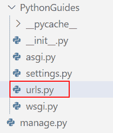

# 将 Python 输出到 html Django

> 原文：<https://pythonguides.com/outputting-python-to-html-django/>

[](https://sharepointsky.teachable.com/p/python-and-machine-learning-training-course)

在本 [Python Django 教程](https://pythonguides.com/how-to-install-django/)中，我们将了解**将 Python 输出到 HTML Django** 的实现。我们还会看到与此相关的不同例子。这些是我们将在本教程中讨论的以下主题。

*   输出到 HTML 的基本步骤
*   如何在项目中包含应用程序
*   如何访问应用程序 url
*   如何访问视图
*   Django 的模板
*   在 Django 运行服务器
*   将 python 输出到 html Django

目录

[](#)

*   [输出到 HTML 的基本步骤](#Basic_Steps_for_output_to_HTML "Basic Steps for output to HTML")
*   [如何在项目中包含 app](#How_to_include_app_in_project "How to include app in project")
*   [如何访问 app 网址](#How_to_access_app_url "How to access app url")
*   [如何访问视图](#How_to_access_view "How to access view")
*   [Django 中的模板](#Template_in_Django "Template in Django")
*   [在 Django 运行服务器](#Run_Server_in_Django "Run Server in Django")
*   [将 python 输出到 HTML Django](#Outputting_python_to_HTML_Django "Outputting python to HTML Django")

## 输出到 HTML 的基本步骤

既然我们已经学习了如何在控制台或终端中表示程序输出，现在是时候学习如何使用 Django 模板在 HTML 页面上显示它了。在这一节中，我们将学习使用 Django 将 Python 输出到 HTML 的一些基本步骤。

**步骤#1 安装 Django**

安装 Django 是第一步也是最重要的一步。Python pip 可以用来快速安装 Django。它作为一个包管理器来管理 Python 包。

我们可以使用 pip 来安装不属于 Python 发行版的包。在命令提示符下执行以下命令来下载并安装 Django。

```py
pip install django
```


Install Django

**步骤 2 测试 Django 安装**

安装 Django 后，使用命令提示符测试 Django 是否安装成功。

命令:

```py
django-admin --version
```


Django Version

**第三步 Django 项目**

下一个关键步骤是创建 Django 项目。因此，首先，导航到您希望保存项目的目录。在终端中，执行以下命令来创建 Django 项目。

```py
django-admin startproject project_name
```

你可以给这个项目起任何你喜欢的名字，但是要简短和相关，因为你将会建立大型网站。

> **注:**
> 
> 不，你不必每次开始一个新项目时都重新安装 Django。一旦您用 pip 安装了它，现在您所要做的就是运行 django 项目创建命令。

在这里，我创建了一个名为 PythonGuides 的 Django 项目。


Django Project

**第 4 步 Django 应用程序**

对于每一项功能，应用程序都可以构建为一个完全独立的模块。要在 Django 项目中创建一个基本的应用程序，请编写以下命令。

```py
python manage.py startapp app_name
                 **#OR** django-admin startapp app_name
```

在这里，我创建了一个名为 home 的 Django 应用程序。


Django App

**第五步安装应用**

要将应用程序包含在您的项目中，请将您的应用程序名称添加到项目的 settings.py 中的已安装应用程序列表中。


Installed App

阅读:[Django 模板中的 If 语句](https://pythonguides.com/if-statement-in-django-template/)

## 如何在项目中包含 app

在上一节中，我们学习了如何创建项目和应用程序，以及如何安装应用程序。现在，我们将在这一部分学习如何将一个应用程序包含到我们的项目中。

要使用 URL 来呈现应用程序，我们必须将它们包含在我们的主项目中，以便可以呈现路由到它的 URL。以下是使用 URL 的步骤。

*   打开项目目录。
*   打开项目目录下的 urls.py 文件。
*   添加标题。
*   您现在必须在 URL 模式列表中指定应用程序名称，以便包含您的应用程序 URL。



Project Directory


Project’s urls.py file

**python guides URLs . py 文件源代码:**

```py
from django.contrib import admin
from django.urls import path, include

urlpatterns = [
    path('admin/', admin.site.urls),
    path('', include('home.urls'))
]
```

阅读:[获取 Django 中的 URL 参数](https://pythonguides.com/get-url-parameters-in-django/)

## 如何访问 app 网址

在本节中，我们将了解如何访问应用程序的 URL。项目的 urls.py 文件将无法访问应用程序的 URL 文件，因为它不包含在应用程序目录中。为了正确执行 Django Web 应用程序，必须完成以下步骤。

*   在 apps 目录中创建一个 urls.py 文件。
*   添加代码。


App Directory


App’s urls.py File

**home URLs . py 文件源代码:**

```py
from django.urls import path, include
from home import views

urlpatterns = [
    path('', views.home, name='home'),
]
```

阅读: [Python Django 长度过滤器](https://pythonguides.com/python-django-length-filter/)

## 如何访问视图

在这一节中，我们将学习如何在 Django 中访问视图。视图函数，也称为“视图”，是一个接收 web 请求并提供 web 响应的 Python 函数。这个响应可以是网页的 HTML 内容、重定向、404 错误、XML 文档、图像或其他任何东西。

在 Django 中，视图必须在 app views.py 文件中定义。我们可以用两种方式在 Django 中创建视图:基本视图和 MVT 模式视图。

*   **基本视图:**为了在基本视图中呈现 HTML 页面，我们使用了 HttpResponse。但是，这不是最有效的呈现页面的方式。
*   **MVT 模式视图:**为了创建先例视图，Django 支持 MVT 模式。因此，我们在这个视图中呈现一个模板。


App’s view.py File

**views . py 文件源代码:**

```py
from django.shortcuts import render, HttpResponse

# Create your views here.

def home(request):
    return render(request, 'home.html')
```

阅读:[如何从 Django 的 get 请求中获取数据](https://pythonguides.com/get-data-from-get-request-in-django/)

## Django 中的模板

在这一节中，我们将学习使用模板系统生成 HTML 页面。首先，我们将了解 Django 模板。

Django 的模板系统使得创建动态 HTML 页面变得简单。模板由您想要创建的 HTML 输出的静态部分组成。Django 模板引擎允许我们通过将设计从 python 代码中分离出来来开发动态网页。

下面是使用模板生成 HTML 页面的步骤。

*   创建模板目录
*   模板配置
*   创建 HTML 页面。

**步骤#1 创建模板目录**

首先，打开项目应用程序并创建一个目录模板。


Template Directory

**步骤#2 模板配置**

我们必须在 settings.py 文件中提供一些项目来配置模板系统。我们的模板目录的名称是 `templates` ，正如我们前面指出的。DjangoTemplates 默认在每个**安装的应用**子目录中搜索一个模板子目录。


Templates

**第三步**

然后，在新形成的模板文件夹中，创建一个模板 HTML 页面。


HTML File

**home.html 文件的源代码:**

```py
<!doctype html>
<html lang="en">

<head>

    <meta charset="utf-8">
    <meta name="viewport" content="width=device-width, initial-scale=1">
    <link href="https://cdn.jsdelivr.net/npm/bootstrap@5.0.2/dist/css/bootstrap.min.css" rel="stylesheet">

    <title>PythonGuides!</title>
</head>

<body>

    <nav class="navbar navbar-expand-lg navbar-dark bg-dark">
        <div class="container-fluid">
            <a class="navbar-brand" href="#">PythonGuides</a>
            <button class="navbar-toggler" type="button" data-bs-toggle="collapse"
                data-bs-target="#navbarSupportedContent" aria-controls="navbarSupportedContent" aria-expanded="false"
                aria-label="Toggle navigation">
                <span class="navbar-toggler-icon"></span>
            </button>
            <div class="collapse navbar-collapse" id="navbarSupportedContent">
                <ul class="navbar-nav me-auto mb-2 mb-lg-0">
                    <li class="nav-item">
                        <a class="nav-link active" aria-current="page" href="#">Home</a>
                    </li>
                </ul>
                <form class="d-flex">
                    <input class="form-control me-2" type="search" placeholder="Search" aria-label="Search">
                    <button class="btn btn-outline-success" type="submit">Search</button>
                </form>
            </div>
        </div>
    </nav>
    <div class="container my-3">
        <h1 style="text-align:center;">Welcome to Python Guides</h1>
    </div>

    <div class="card">
        <div class="card-body">
            <h3 style="text-align:center;">Thanks for landing on this page to know more about PythonGuides.com.</h3>
            <br>
            <h6>I welcome you to the website and hopefully, you got to learn something in Python. I started this website
                to share my finding and learnings in Python with you.</h6>
            <h6>To keep things simple, I am trying to write a lot of articles on Python. Feel free to give your valuable
                comments and also share the articles if you are liking and hoping it will be helpful to someone.</h6>
            <br>
            <h2 style="text-align:center;">Also, Subscribe to Our YouTube Channel for FREE Python Video Tutorials.</h2>
        </div>

        <script src="https://cdn.jsdelivr.net/npm/bootstrap@5.0.2/dist/js/bootstrap.bundle.min.js"></script>

</body>

</html>
```

## 在 Django 运行服务器

在这一节中，我们将学习在 Django 中运行服务器。Django 开发服务器提供了一个很棒的本地开发服务器，开发者可以用它来预览代码更新和测试 Django 支持的网站特性。

在终端中运行以下命令启动服务器。

```py
python manage.py runserver
```


Run Server In Django

阅读: [Python Django group by](https://pythonguides.com/python-django-group-by/)

## 将 python 输出到 HTML Django

在本节中，我们将在浏览器上看到 HTML Django 输出。

于是，运行开发服务器后，我们需要打开一个浏览器，打开下面的网址 **http://127.0.0.1:8000/** 。


Django Output

另外，看看更多的 Django 教程。

*   [Python Django 过滤器](https://pythonguides.com/python-django-filter/)
*   [Python Django get](https://pythonguides.com/python-django-get/)
*   [Django for loop](https://pythonguides.com/django-for-loop/)
*   [设置 Django 项目](https://pythonguides.com/setup-django-project/)
*   [Python Django 获取枚举选择](https://pythonguides.com/python-django-get-enum-choices/)

在这个 Django 教程中，我们已经了解了将 python 输出到 HTML Django 的实现。这是我们在本教程中涉及的主题的完整列表。

*   输出到 HTML 的基本步骤
*   如何在项目中包含应用程序
*   如何访问应用程序 url
*   如何访问视图
*   Django 的模板
*   在 Django 运行服务器
*   将 python 输出到 html django

[Bijay Kumar](https://pythonguides.com/author/fewlines4biju/)

Python 是美国最流行的语言之一。我从事 Python 工作已经有很长时间了，我在与 Tkinter、Pandas、NumPy、Turtle、Django、Matplotlib、Tensorflow、Scipy、Scikit-Learn 等各种库合作方面拥有专业知识。我有与美国、加拿大、英国、澳大利亚、新西兰等国家的各种客户合作的经验。查看我的个人资料。

[enjoysharepoint.com/](https://enjoysharepoint.com/)[](https://www.facebook.com/fewlines4biju "Facebook")[](https://www.linkedin.com/in/fewlines4biju/ "Linkedin")[](https://twitter.com/fewlines4biju "Twitter")