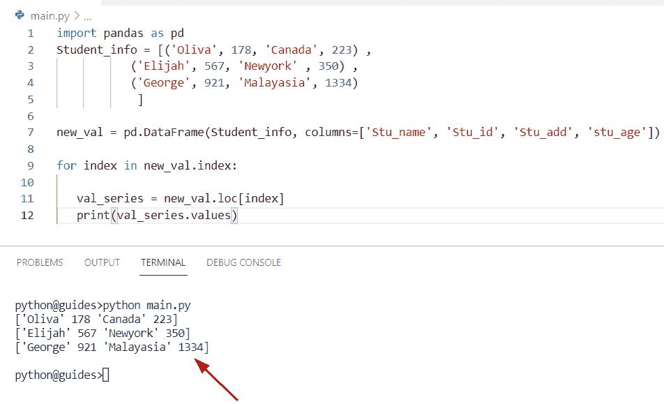

# Python 熊猫数据帧条目

> 原文：<https://pythonguides.com/pandas-dataframe-iterrows/>

[](https://sharepointsky.teachable.com/p/python-and-machine-learning-training-course)

在这个 [Python 熊猫教程](https://pythonguides.com/pandas-in-python/)中，我们将学习如何使用 Python 在熊猫数据框架中使用 **iterrows()函数。此外，我们将涵盖这些主题。**

*   熊猫数据框架条目索引
*   熊猫数据帧慢行
*   熊猫数据帧 iterrows 更新值
*   熊猫数据框架 iterrows 添加列
*   熊猫数据帧反转
*   熊猫系列
*   熊猫用 iterrows 更新数据帧
*   熊猫 iterrows 返回数据帧
*   熊猫数据框架 itertuples vs iterrows
*   Pandas 数据帧 iterrows 设置值
*   Pandas 循环的数据帧项目
*   熊猫数据帧条目更改值

目录

[](#)

*   [python data frame ETR rows](#Python_DataFrame_Iterrows "Python DataFrame Iterrows")
    *   [通过使用 iterrows()方法](#By_using_iterrows_method "By using iterrows() method")
    *   [通过使用 itertuple()方法](#By_using_itertuple_method "By using itertuple() method")
*   [熊猫数据框 iterrows 索引](#Pandas_DataFrame_iterrows_index "Pandas DataFrame iterrows index")
    *   [通过使用 for 循环+ iterrows()方法](#By_using_for_loop_iterrows_method "By using for loop + iterrows() method")
*   熊猫数据帧增加缓慢
*   [熊猫数据帧 iterrows 更新值](#Pandas_DataFrame_iterrows_update_value "Pandas DataFrame iterrows update value")
*   [熊猫数据框 iterrows 添加列](#Pandas_DataFrame_iterrows_add_column "Pandas DataFrame iterrows add column")
*   [熊猫数据帧反转](#Pandas_DataFrame_iterrows_reverse "Pandas DataFrame iterrows reverse")
*   [熊猫系列 iterrows](#Pandas_series_iterrows "Pandas series iterrows")
*   [熊猫用 iterrows 更新数据帧](#Pandas_update_DataFrame_with_iterrows "Pandas update DataFrame with iterrows ")
*   熊猫 iterrows 返回数据帧
*   [熊猫数据帧 itertuple vs iterrows](#Pandas_DataFrame_itertuple_vs_iterrows "Pandas DataFrame itertuple vs iterrows")
*   [Pandas DataFrame iterrows 设定值](#Pandas_DataFrame_iterrows_set_value "Pandas DataFrame iterrows set value")
*   [熊猫数据帧 iterrows for loop](#Pandas_DataFrame_iterrows_for_loop "Pandas DataFrame iterrows for loop")
*   [熊猫数据帧 iterrows 改变值](#Pandas_DataFrame_iterrows_change_value "Pandas DataFrame iterrows change value")

## python data frame ETR rows

*   在这个程序中，我们将讨论如何使用 `iterrows()` 方法迭代数据帧的行。
*   在 Python 中，Pandas`data frame . ITER rows()`方法用于遍历 Pandas DataFrame 的每一行，它总是返回一个迭代器来存储每一行的数据。
*   有各种方法来迭代数据帧行。
    *   通过使用 iterrows()方法
    *   通过使用 itertuple()方法

### 通过使用 iterrows()方法

在 Python 中，Pandas 有一个 `iterrows()` 方法，它将帮助用户遍历 Pandas 数据帧的每一行和每一列。

**语法:**

下面是 iterrows()方法的语法

```py
DataFrame.iterrows()
```

*   **Index:**Pandas 数据帧中行的索引和 multiindex 的元组。
*   **数据:**它总是以熊猫系列的形式返回行数据。

**举例:**

让我们举个例子，看看如何用熊猫来遍历行

```py
import pandas as pd

df = pd.DataFrame([[26,16,18,8.7,2.9,1.9]], columns=[
				'George', 'John', 'Micheal', 'Oliva', 'Chris', 'Hemosworth'])

new_itr = next(df.iterrows())[1]
print(new_itr)
```

在上面的代码中，我们首先导入了一个 pandas 模块，然后创建了一个 dataframe 和一个列名。现在通过使用 `iterrows()` 方法迭代数据框行。

下面是以下代码的截图


Python DataFrame Iterrows

读取， [Python 将数据帧转换为列表](https://pythonguides.com/python-convert-dataframe-to-list/)

### 通过使用 itertuple()方法

*   在 Python 中， `itertuple()` 方法将 Pandas 数据帧的行和列作为 namedtuples 进行迭代。当我们在 Pandas DataFrame 中使用这个函数时，它返回一个 map 对象。
*   在这个方法中，元组的第一个值将是行索引值，其余的值作为行值。

**语法:**

下面是 itertuple()方法的语法

```py
DataFrame.itertuples(
                     index=True,
                     name='Pandas'
                    )
```

*   它由几个参数组成
    *   **Index:** 如果值为 True，那么它将返回索引作为元组的第一个值。
    *   **名称:**该参数指定返回的元组。

**源代码:**

```py
import pandas as pd

new_dt = {
  "Country_name": ["Australia", "Newzealand", "Germany"],
  "new_values": [672, 193, 881]
}
result = pd.DataFrame(new_dt)
for new_row in result.itertuples():
  print(new_row)
```

首先在上面的程序中，我们将创建一个字典，其中包含以键和值的形式出现的元素。现在创建一个数据帧并分配一个字典**‘new _ dt’**。一旦您将打印**‘new _ row’**，那么输出将以 tuple 的形式显示。

下面是以下给定代码的执行过程


Python DataFrame Iterrows using itertuple

阅读:[熊猫删除栏目](https://pythonguides.com/pandas-delete-column/)

## 熊猫数据框 iterrows 索引

*   让我们看看如何使用索引遍历数据帧的行和列。
*   通过使用 `iterrows()` 函数，我们可以执行这个特定的任务，在这个例子中，我们将创建一个具有五行的数据帧，并使用 `iterate()` 方法进行迭代。

**源代码:**

```py
import pandas as pd

new_dt = pd.DataFrame([['Rose', 'Tulip', 'Lilly', 'Jasmine',
					'Lotus']])

new_iteration = next(new_dt.iterrows())[1]
print(new_iteration)
```

下面是以下给定代码的输出


Pandas DataFrame iterrows index

### 通过使用 for 循环+ iterrows()方法

在这里，我们可以看到如何迭代 dataframe 的行和列，还可以通过使用 `iterrows()` 方法来访问行的索引。

**源代码:**

```py
import pandas as pd

new_val = pd.DataFrame({
    'Country_name': ['China', 'Japan', 'Malayasia', 'Bangladesh'],
	'dict_val': [721, 618, 178, 389]})

for index, row in new_val.iterrows():
    print(index, ': ', row['Country_name'], row['dict_val'])
```

你可以参考下面的截图


Pandas DataFrame iterrows index using loop

阅读:[如何将熊猫数据帧转换成字典](https://pythonguides.com/how-to-convert-pandas-dataframe-to-a-dictionary/)

## 熊猫数据帧增加缓慢

*   在这个程序中，我们将讨论 iterrows()方法为什么很慢。
*   在 Python iterrows 中，与 itertuples()方法相比，性能非常慢，因为当在 iterrows()中迭代时应用多个函数时，每一行都有自己的属性，这使得它更慢。
*   Python pandas 中有各种方法比 iterrows 方法(如(itertuple ))性能更好。

## 熊猫数据帧 iterrows 更新值

*   这里我们可以看到如何**创建一个 Pandas 数据帧**并在逐行迭代时更新。
*   在这个例子中，我们已经更新了数据帧的内容，还需要迭代熊猫数据帧的行和列。

**源代码:**

```py
import pandas as pd

new_data = [(62, 19, 634, 189) ,
           (156, 178, 156, 762) ,
           (109, 447, 390, 643)
           ]

df = pd.DataFrame(new_data, columns=['George', 'Micheal' , 'Oliva', 'Elijah'])
for new_ind, select_row in df.iterrows():

   df.at[new_ind , 'Oliva'] = select_row['Oliva'] * 3
print(df)
```

在上面的程序中，我们通过将列‘Oliva’中的每个值乘以 `3` 来更新它。一旦您将打印**‘df’**，那么输出将以更新的数据帧的形式显示。

下面是以下给定代码的实现


Pandas DataFrame iterrows update value

阅读: [Python 熊猫掉行](https://pythonguides.com/python-pandas-drop-rows-example/)

## 熊猫数据框 iterrows 添加列

*   让我们看看如何使用 `iterrows()` 和 iloc 方法在 Pandas 数据帧中添加一列。
*   通过使用索引位置和 iloc 方法，我们可以解决此任务。在本例中，我们创建了一个数据帧，并使用 row 在其中添加了一个新列。
*   在 Python 中，iloc 方法用于选择数据集的指定行，这有助于从数据帧中选择属于特定列的值。

**源代码:**

```py
import pandas as pd
import numpy as np

new_dt = pd.DataFrame(columns=list('mn'), data = np.random.randn(6,2))
print(new_dt)
for new_ind,row in new_dt.iterrows():
    new_dt.loc[new_ind,'o'] = np.random.randint(0, 8)
print("Updated dataframe:")
print(new_dt)
```

在上面的程序中，我们使用 **np 创建了一个数组。random()** 函数。现在我必须在现有数组中添加一列，为此我们必须使用 `iloc` 方法并在其中分配一个新列。

下面是以下给定代码的实现


Pandas DataFrame iterrows add a column

阅读:[Python 熊猫中的 group by](https://pythonguides.com/groupby-in-python-pandas/)

## 熊猫数据帧反转

*   这里我们可以看到如何通过使用 `iloc` 方法来**反转一个数据帧行**。
*   通过使用 `iloc` ，我们可以通过索引位置访问每一行。在这个例子中，我们可以使用一个循环，通过索引反向遍历数据帧的行。

**源代码:**

```py
import pandas as pd
Student_info = [('William', 689, 'Micheal', 591) ,
           ('John', 148, 'Potter' , 109) ,
           ('Hmsworth', 776, 'Chris', 314)
            ]

new_result = pd.DataFrame(Student_info, columns=['Stu_name', 'Stu_id', 'Stu2_name', 'Stu2_id'], index=['m', 'o', 'p'])
for m in range(new_result.shape[0] - 1, -1, -1):

   Final_output = new_result.iloc[m]
   print(Final_output.values)
```

在上面的程序中，我们首先导入了一个 pandas 模块，然后创建了一个存储了多个元组的列表。现在，我们必须通过申请 iloc 和索引位置来逆向迭代数据帧中的行。

为了完成这项任务，我们创建了一个数据帧**‘new _ result’**，然后循环遍历最后一个索引到第 0 个**索引**。一旦您将打印**‘最终输出’**，那么输出将显示反转数据帧中的行数。

你可以参考下面的截图


Pandas DataFrame iterrows reverse

阅读:[Python 熊猫中的交叉表](https://pythonguides.com/crosstab-in-python-pandas/)

## 熊猫系列 iterrows

*   让我们看看如何使用 `series.iterrows()` 方法迭代熊猫数据帧中的行。
*   Python 中的系列。iterrows 方法返回一个可迭代列表或元组(index，value)。在 Python 中， `iloc` 方法用于选择数据集或数据帧的指定单元格。

**源代码:**

```py
import pandas as pd
Student_info = [('Oliva', 178, 'Canada', 223) ,
           ('Elijah', 567, 'Newyork' , 350) ,
           ('George', 921, 'Malayasia', 1334)
            ]

new_val = pd.DataFrame(Student_info, columns=['Stu_name', 'Stu_id', 'Stu_add', 'stu_age'])

for index in new_val.index:

   val_series = new_val.loc[index]
   print(val_series.values)
```

在上面的例子中，我们必须结合使用 for 循环和 iloc 方法来迭代 dataframe 的列和行。

下面是以下代码的截图



Pandas series iterrows

另一个如何在 DataFrame 中使用 `series.iterrows()` 函数的例子。

这是使用 `series.iterrows()` 方法迭代 DataFrame 中的行的另一种方法。它将总是返回一个包含序列对的可迭代元组。

**源代码:**

```py
import pandas as pd

new_data = pd.Series(['m', 'n', 'o'])
for index, value in new_data.items():
    print(f"Index_val : {index}, New_Value : {value}")
```

下面是以下给定代码的输出


Pandas series iterrows

阅读:[Python 中熊猫缺失数据](https://pythonguides.com/missing-data-in-pandas/)

## 熊猫用 iterrows 更新数据帧

*   这里我们可以看到如何用 iterrows ()方法来更新 Pandas 数据帧。
*   在 Python 中， `iterrows()` 方法将帮助用户根据给定的条件更新值或列，在本例中，我们使用 for 循环来获取 Pandas 数据帧的每一行，iterrows 方法总是返回一个存储每一行数据的迭代器。

**举例:**

让我们举一个例子，看看如何用 iterrows 更新数据帧

```py
import pandas as pd

new_val = [(14, 21, 189, 49) ,
           (981, 445,156,109) ,
           (267, 871, 156,456)
           ]

df = pd.DataFrame(new_val, columns=['Chris', 'Hemsworth' , 'George', 'Elijah'])
for new_ind, select_row in df.iterrows():

   df.at[new_ind , 'George'] = select_row['George'] * 4
print(df)
```

在上面的例子中，我们必须通过将列**‘乔治’**中的每个值乘以 `4` 来更新它。打印“df”后，输出将以更新数据帧的形式显示。

你可以参考下面的截图


Pandas update DataFrame with iterrows

阅读: [Python 熊猫 CSV 教程](https://pythonguides.com/python-pandas-csv/)

## 熊猫 iterrows 返回数据帧

*   在这个程序中，我们将讨论如何使用 Python 中的 iterrrows()函数返回熊猫数据帧。
*   在 Python 中，有时我们需要迭代熊猫数据帧的列和行，而不使用 for 循环方法。因此，在这种情况下，我们将使用 `iterrows()` 方法迭代(index，series)对形式的行。

**语法:**

下面是 `iterrows()` 方法的语法。

```py
DataFrame.iterrows()
```

**源代码:**

让我们举一个例子，了解如何为每一行返回一个序列

```py
import pandas as pd

df = pd.DataFrame([['Banana', 'Cherry', 'Grapes', 'Oranges',
					'Apple', 'litchi']])

new_val = next(df.iterrows())[1]
print(new_val) 
```

在上面的程序中，我们通过使用 `iterrows()` 方法迭代 Pandas 数据帧，并且没有列名。

下面是下面给出的代码的截图。


Pandas iterrows return DataFrame

阅读:[获取字典 Python 中的第一个键](https://pythonguides.com/get-first-key-in-dictionary-python/)

## 熊猫数据帧 itertuple vs iterrows

*   这里我们可以看到 Pandas 数据帧中 itertuple 和 itertool 方法之间的区别
*   在 Python 中， `itertuple()` 方法将 Pandas 数据帧的行作为命名元组进行迭代。而 `iterrows()` 是一个对 Pandas 数据帧的行和列进行迭代的方法。
*   在 Python 中， `iterrows()` 方法总是返回一个序列，而 itertuple 返回一个命名元组。如果您想使用索引和 `getattr()` 方法访问值，那么 namedtuple 的分配值是有序的。
*   在 Python 中，这两种方法都是 Pandas 内置的函数，可以遍历 Pandas 数据帧。迭代时，我们可以通过使用 i `terrows()` 方法声明多个函数。而 `itertuples()` 调用的函数比 `iterrows()` 少。

**源代码:**

```py
import pandas as pd

new_dictionary = {'Student_name': ['Micheal', 'John', 'william', 'jonas'],
				'Student_id': [66,24,91,118],
				'Student_address': ['China', 'Japan', 'France', 'Ireland'],
				'Student_age': [18,21,32,28]}

df = pd.DataFrame(new_dictionary, columns = ['Student_name','Student_id','Student_address','Student_age'])

for index, row in df.iterrows():
	print (row['Student_name'], row['Student_age'])
	print (row['Student_address'], row['Student_age'])
#itertuple
Employee_dictionary= {'Emp_name': ['Noah', 'Lijah', 'Hayden', 'Adam'],
				'Emp_unique_id': [612, 883, 945, 7119],
				'Desgination': ['Tester', 'Gamer', 'Quality assurance', 'Production'],
				'Emp_add': ['Germany','Paris','Bangladesh','Moscow']}

df = pd.DataFrame(Employee_dictionary, columns = ['Emp_name', 'Emp_unique_id', 'Desgination', 'Emp_add'])

for row in df.itertuples(index = True, name ='Python'):
	print (getattr(row, 'Emp_name'), getattr(row, "Emp_add"))
```

在上面的程序中，我们使用 `itertuples()` 和 `iterrows()` 方法创建数据帧。现在我们想尝试迭代熊猫数据帧的行和列。

在 `itertuple()` 示例中，DataFrame 方法的**‘索引’**和**‘名称’**参数为真，它将返回元素的值和名称。

下面是以下给定代码的输出。


Pandas DataFrame itertuple vs itertool

阅读: [Python 将数据帧转换为列表](https://pythonguides.com/python-convert-dataframe-to-list/)

## Pandas DataFrame iterrows 设定值

*   这里我们可以看到如何在使用 `iterrows()` 方法时设置 Pandas DataFrame 中的值。
*   通过使用索引位置和 iloc 方法，我们可以设置数据帧中行的值。

**举例:**

```py
import pandas as pd

new_df = pd.DataFrame([[64, 118, 801],
                [249, 321,963],
                [136, 589, 501]],
                index=[0,1,2],
                columns=['m', 'n', 'o'])

print(pd.DataFrame(new_df))

new_df.loc[0, 'm'] = 812
new_df.loc[1, 'n'] = 678
new_df.loc[2, 'o'] = 512

print(pd.DataFrame(new_df))
```

在上面的程序中，我们已经设置了**‘m’，‘n’，**和**‘o’**的值，并通过使用 iloc 和 index 方法迭代数据帧的行。一旦您将打印' **new_df'** ，那么输出将显示更新的数据帧。

你可以参考下面的截图


Pandas DataFrame iterrows set value

阅读: [Python 字典增量值](https://pythonguides.com/python-dictionary-increment-value/)

## 熊猫数据帧 iterrows for loop

*   在这个程序中，我们将讨论如何在 Pandas 数据帧中使用 for 循环和 iterrows 方法来迭代数据帧的行和列。
*   在 Pandas 中，for 循环方法通常用于迭代作为元组对的数据帧的列和行。
*   让我们创建一个熊猫数据框架，并检查如何在程序中应用这种方法。在下面的代码**‘df’**中包含了关于四个人的学生数据**‘斯图 _ 姓名’**和**‘斯图 _ id’**的信息。现在使用 `iterrows()` 函数获取迭代的行。

**举例:**

```py
import pandas as pd

new_stu_info = {'stu_name': ['Chris', 'oliva', 'Elite', 'jonas'],
				'stu_id': [167,524,132,267]}

df = pd.DataFrame(new_stu_info, columns = ['stu_name','stu_id'])

for index, row in df.iterrows():
	print (row['stu_name'], row['stu_id'])
```

下面是以下给定代码的执行过程


Pandas DataFrame iterrows for loop

阅读: [Python 列表字典](https://pythonguides.com/python-dictionary-of-lists/)

## 熊猫数据帧 iterrows 改变值

*   让我们看看如何修改 Pandas 数据框架中的值。
*   为了完成这个特定的任务，我们可以应用 `iterrows()` 的概念，并在 DataFrame 中获取更新后的值。

**源代码:**

```py
import pandas as pd

new_elements = [(102, 115, 721, 845) ,
           (334, 578, 439, 120) ,
           (290, 389, 164, 510)
           ]

df = pd.DataFrame(new_elements, columns=['Banana', 'Apple' , 'Oranges', 'Grapes'])
for new_ind, select_row in df.iterrows():

   df.at[new_ind , 'Apple'] = select_row['Apple'] * 6
print(df)
```

在上面的程序中，我们修改了列**‘Apple’**中的每个值，将它乘以 `6` 。一旦您将打印**‘df’**，那么输出将以更新的数据帧的形式显示。

下面是以下给定代码的实现


Pandas DataFrame iterrows change the value

**相关帖子:**

*   [计算熊猫数据帧中的行数](https://pythonguides.com/count-rows-in-pandas-dataframe/)
*   [Python 数据帧到 CSV](https://pythonguides.com/python-dataframe-to-csv/)

在本教程中，我们学习了如何使用 Python 在 Pandas DataFrame 中使用 `iterrows()` 函数。此外，我们已经讨论了这些主题。

*   熊猫数据框架条目索引
*   熊猫数据帧慢行
*   熊猫数据帧 iterrows 更新值
*   熊猫数据框架 iterrows 添加列
*   熊猫数据帧反转
*   熊猫数据帧 iterrows 跳过第一行
*   熊猫系列
*   熊猫用 iterrows 更新数据帧
*   熊猫 iterrows 返回数据帧
*   熊猫数据框架 itertuples vs iterrows
*   Pandas 数据帧 iterrows 设置值
*   Pandas 循环的数据帧项目
*   熊猫数据帧条目更改值

[Bijay Kumar](https://pythonguides.com/author/fewlines4biju/)

Python 是美国最流行的语言之一。我从事 Python 工作已经有很长时间了，我在与 Tkinter、Pandas、NumPy、Turtle、Django、Matplotlib、Tensorflow、Scipy、Scikit-Learn 等各种库合作方面拥有专业知识。我有与美国、加拿大、英国、澳大利亚、新西兰等国家的各种客户合作的经验。查看我的个人资料。

[enjoysharepoint.com/](https://enjoysharepoint.com/)[](https://www.facebook.com/fewlines4biju "Facebook")[](https://www.linkedin.com/in/fewlines4biju/ "Linkedin")[](https://twitter.com/fewlines4biju "Twitter")