# 熊猫用 0 代替 nan

> 原文：<https://pythonguides.com/pandas-replace-nan-with-0/>

[](https://sharepointsky.teachable.com/p/python-and-machine-learning-training-course)

在这个 [Python 熊猫](https://pythonguides.com/pandas-in-python/)教程中，将学习如何在 Python 中使用熊猫**用 0 替换 nan 值。此外，我们将涵盖这些主题。**

*   熊猫用栏中的 0 替换 nan
*   熊猫对多列用 0 代替 nan
*   熊猫在一列中用 0 代替 nan
*   熊猫用 0 代替 nan
*   熊猫用 0 代替 nan
*   熊猫系列用 0 代替 nan
*   熊猫合并用 0 替换 nan
*   熊猫用 0 填充 nan 值
*   熊猫 read_csv 用 0 替换 nan
*   熊猫将所有列中的 nan 替换为 0
*   将 nan 替换为 0 熊猫列表
*   熊猫用 0 代替字符串 nan
*   熊猫 sum 用 0 代替 nan
*   熊猫枢轴用 0 替换 nan

目录

[](#)

*   熊猫用 0 换下南
    *   [通过使用 Fill.na()方法](#By_using_Fillna_method "By using Fill.na() method")
    *   [通过使用 replace()方法](#By_using_replace_method "By using replace() method")
*   [熊猫在](#Pandas_replace_nan_with_0_in_column "Pandas replace nan with 0 in column")栏中用 0 代替 nan
*   [熊猫用 0 替换多列的 nan](#Pandas_replace_nan_with_0_for_multiple_columns "Pandas replace nan with 0 for multiple columns")
*   [熊猫在一列中用 0 代替南](#Pandas_replace_nan_with_0_in_one_column "Pandas replace nan with 0 in one column")
*   熊猫用 0 换下南
*   熊猫用 0 换下南
*   [熊猫系列用 0 替换南](#Pandas_series_replace_nan_with_0 "Pandas series replace nan with 0")
*   [熊猫合并用 0 替换 nan](#Pandas_merge_replace_nan_with_0 "Pandas merge replace nan with 0")
*   [熊猫用 0 填充 nan 值](#Pandas_fill_nan_values_with_0 "Pandas fill nan values with 0")
*   [熊猫将所有列中的 nan 替换为 0](#Pandas_replace_nan_with_0_in_all_columns "Pandas replace nan with 0 in all columns")
*   [将南换成 0 熊猫名单](#Replace_nan_with_0_pandas_list "Replace nan with 0 pandas list")
*   [熊猫用 0 替换串楠](#Pandas_replace_string_nan_with_0 "Pandas replace string nan with 0")
*   [熊猫 sum 用 0 代替 nan](#Pandas_sum_replace_nan_with_0 "Pandas sum replace nan with 0")
*   [熊猫枢轴用 0 替换南](#Pandas_pivot_replace_nan_with_0 "Pandas pivot replace nan with 0")

## 熊猫用 0 换下南

*   在本节目中，我们将讨论如何使用 Pandas DataFrame 将 nan 值替换为零。
*   在 Python 中，编程 nan 代表的不是一个数字。这些是 NumPy 数组和 Pandas 中的特殊值，它表示数据集中缺少值。
*   在 Python 中，我们通常可以用空字符串替换 nan 值，但在本文中，我们将讨论如何在 Pandas 数据帧中用零替换 Nan 值。
*   有各种方法可以解决这个问题。我们举个例子，了解一下 nan 值在熊猫身上到底起什么作用，以及如何用零代替 nan。
    *   通过使用 Fill.na()方法
    *   通过使用 replace()方法

### 通过使用 Fill.na()方法

该方法用于填充熊猫数据帧中缺失的值。而在 NumPy 数组的情况下，它有 np.nan，表示缺少一个数值。

**语法:**

下面是 `fill.na()` 方法的语法

```py
DataFrame.fillna
               (
                value=None,
                method=None,
                axis=None,
                inplace=False,
                limit=None,
                downcast=None
               )
```

*   它由几个参数组成
    *   **值:**该参数指定将用于填充空值的值。在本文中，您必须提供一个 0 值，该值将用于填充 Pandas 数据帧中所有缺失的值。
    *   **方法:**该参数用于填充序列中缺失的值，默认为无。
    *   **轴:**该方法只接受列和行的整数值或字符串值
    *   **inplace:** 默认情况下，该参数设置为 inplace =False，这意味着它不会在空白位置填充值。

**举例:**

让我们举一个例子，检查如何在 Pandas 中使用 fill.na()方法

```py
import pandas as pd
import numpy as np

df = pd.DataFrame({'new_val': [np.nan, np.nan, np.nan, np.nan]})
df['new_val'] = df['new_val'].fillna(0)

print (df)
```

在上面的程序中，我们用 np 取一个数据帧。南价值观。现在我们将使用 `fillna()` 方法来替换这些值 **np。nan** 值带零。

下面是以下给定代码的执行过程

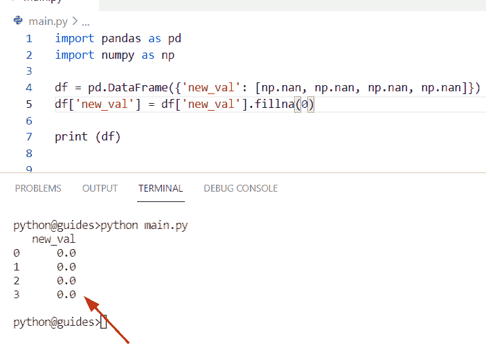

Pandas replace nan with 0

### 通过使用 replace()方法

*   这是使用 Pandas DataFrame 用零替换 nan 值的另一种方法。
*   通过使用 `Pandas.replace()` 方法，Pandas 数据帧的值可以替换为其他值，如零。

**语法:**

下面是 `Pandas.replace()` 方法的语法

```py
DataFrame.replace
                 (
                  to_replace=None,
                  value=None,
                  inplace=False,
                  limit=None,
                  regex=False,
                  method='pad'
                 )
```

**源代码:**

```py
import pandas as pd
import numpy as np

new_dictionary = {'Employee_name': ['George','Micheal','William','Liah','Oliva','Elite','James','Potter'],
		'Employee_id': [ np.nan, 763, np.nan, np.nan, 279,np.nan,99928,np.nan],

	'Employee_age': [277, np.nan, np.nan, np.nan, 267, 2883, np.nan, 829]}

df = pd.DataFrame(new_dictionary)
new_result = df.replace(np.nan, 0)
print(new_result)
```

你可以参考下面的截图

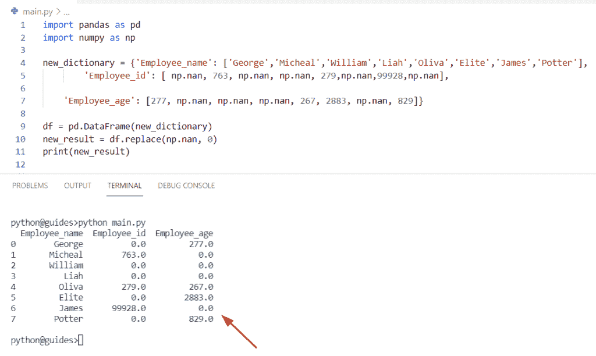

Pandas replace nan with 0

阅读:[如何在 Python Pandas 中向数据帧添加列](https://pythonguides.com/add-a-column-to-a-dataframe-in-python-pandas/)

## 熊猫在栏中用 0 代替 nan

*   让我们看看如何在 Python 中用零替换列中的 nan 值。
*   为了执行这个特定的任务，我们可以应用 `DataFrame.fillna()` 方法。在这个程序中，我们将看到如何替换列中的 nan 值。
*   在 Python 中，此函数用于填充给定数据帧中缺失的值，并用零替换这些值。

**举例:**

```py
import pandas as pd
import numpy as np

df = pd.DataFrame(
	[[np.nan, np.nan, 745],
	[567, np.nan, 156],
	[348, 118, np.nan],
	[np.nan, np.nan, np.nan]],
	columns=['Australia', 'Germany', 'China'])

df['China'] = df['China'].fillna(0)
df['Germany'] = df['Germany'].fillna(0)
df['Australia'] = df['Australia'].fillna(0)
print("Updated DataFrame",df) 
```

在上面的代码中，我们首先创建了一个 data frame**‘df’**，然后在其中分配一个 nan 和一个数值。现在用 `Fillna()` 方法选择一个特定的列元素。一旦您将打印' df ',那么输出将只显示零和数字整数值。

下面是以下代码的截图

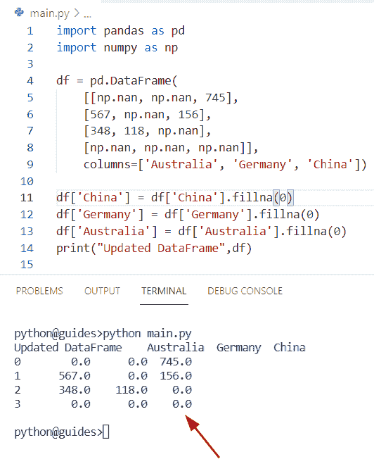

Pandas replace nan with 0 in column

阅读:[如何在 Python 中把 Pandas DataFrame 转换成 NumPy 数组](https://pythonguides.com/convert-pandas-dataframe-to-numpy-array/)

## 熊猫用 0 替换多列的 nan

*   这里我们可以看到如何在 Python Pandas 中使用 `replace()` 方法将多个列的 nan 值替换为零。
*   在 Python 中，这种方法用于数据清理，这种技术用于在多个列中用零替换 nan 值。当您在任何数据帧中使用此方法时，它将替换任何列中值的每个实例。

让我们看一个例子

**源代码:**

```py
import pandas as pd
import numpy as np
new_dict = {'Stu_name': ['William', 'Jmaes', 'Chris', 'Hemsowrth'],
            'Stu_age': [14, np.nan, np.nan, 34],
            'Stu_name': [998, np.nan, 157,np.nan],
             'Stu_marks':[167, np.nan,556,np.nan]}
df = pd.DataFrame(new_dict)

df['Stu_age'] = df['Stu_age'].replace(np.nan,0)
df['Stu_marks'] = df['Stu_marks'].replace(np.nan,0)

print("Updated DataFrame",df) 
```

在上面的代码中，我们首先导入执行这个程序所需的包。现在我们已经创建了一个简单的 DataFrame 对象，这个 DataFrame 包含**‘Student _ information’**。

数据帧有四个变量**【列】**。现在，我们只想在新的 DataFrame 中显示多列。为此，我们将使用 `replace()` 方法以及列表中的列名。

下面是以下给定代码的实现。

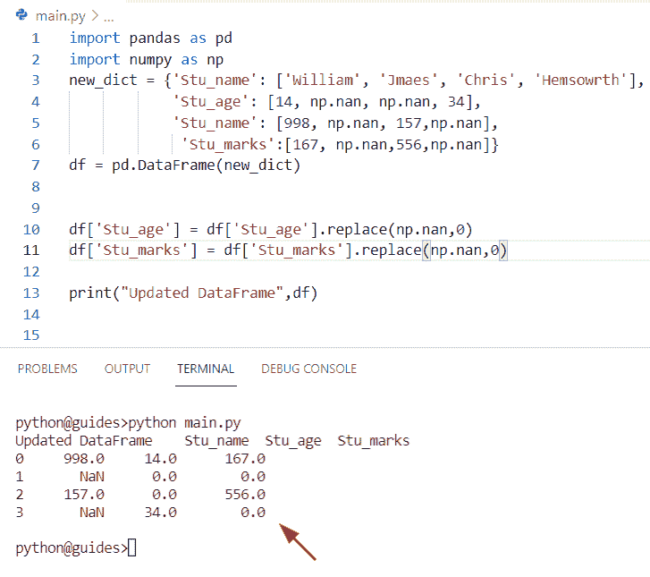

Pandas replace nan with 0 for multiple columns

阅读:[如何在 Python 数据帧中找到重复项](https://pythonguides.com/how-to-find-duplicates-in-python-dataframe/)

## 熊猫在一列中用 0 代替南

*   在这个程序中，我们将讨论如何在 Pandas 数据帧的特定列中用零替换 nan 值。
*   为了完成这项任务，我们将使用 `DataFrame.fillna()` 方法，该函数将帮助用户替换特定列中的值。在这个例子中，我们将提到列表中的列名，然后使用 `fillna()` 方法。一旦您打印了**‘df’**，那么输出将只显示一列值**‘日本’**。

**举例:**

```py
import pandas as pd
import numpy as np

df = pd.DataFrame(
	[[np.nan, np.nan, 456],
	[110, np.nan, 145],
	[np.nan, 113, np.nan],
	[np.nan, np.nan, np.nan]],
	columns=['Japan', 'U.S.A', 'England'])

df['Japan'] = df['U.S.A'].fillna(0)
print("Updated DataFrame",df) 
```

你可以参考下面的截图

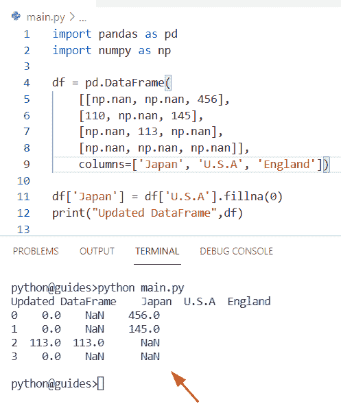

Pandas replace nan with 0 in one column

正如您在屏幕截图中看到的，新的数据帧在“日本”列名中包含零值。

阅读:[向数据帧添加行 Python 熊猫](https://pythonguides.com/add-row-to-dataframe-python-pandas/)

## 熊猫用 0 换下南

*   让我们看看如何在 Pandas 中使用 inplace 参数将 nan 值替换为 0。
*   在这个方法中，inplace 参数被设置为 `inplace =True` ，这意味着它将填充空值并直接修改原始 Pandas 数据帧。如果设置 inplace =True，那么它在一个空的地方填充值。
*   默认情况下，该方法采用 **inplace='False'** 值，这意味着返回一个包含结果内容的新 dataframe。

**源代码:**

```py
import pandas as pd
import numpy as np
Student_info = {'Stu_name': ['Hayden', 'Adam', 'Mathew', 'Gilchrist'],
        'Stu_age': [16, 18, np.nan, np.nan],
        'Stu_marks': [180, np.nan, 340,np.nan]}
df = pd.DataFrame(Student_info)
df.fillna(0, inplace=True)
print(df)
```

下面是以下代码的截图

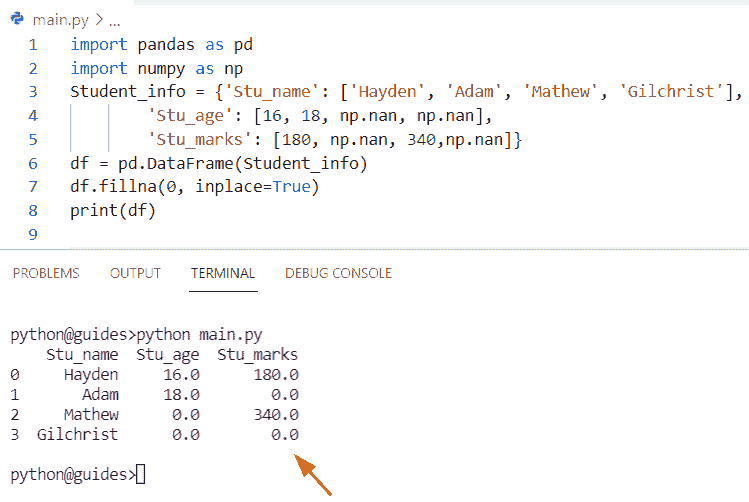

Pandas replace nan with 0 in place

阅读:[检查 Python Pandas 中的数据帧是否为空](https://pythonguides.com/check-if-dataframe-is-empty-in-python-pandas/)

## 熊猫用 0 换下南

*   这里我们可以看到**如何在 Pandas 数据帧**中将 nan 值替换为零。
*   通过使用 `Pandas.replace()` 方法，我们可以执行这个特定的任务，并将数字整数值更改为 0。

**源代码:**

```py
import pandas as pd
import numpy as np

new_dictionary = {'Employee_name': ['Brett','lee','John','Liah','Oliva','Elite','James','Potter'],
		'Employee_id': [ np.nan, 157, np.nan, np.nan, 239,np.nan,445,np.nan],

	'Employee_age': [277, np.nan, np.nan, np.nan, 267, 2883, np.nan, 829]}

df = pd.DataFrame(new_dictionary)
new_result = df.replace(np.nan, 0)
print(new_result) 
```

在上面的程序中，我们取一个带有 np.nan 值的数据帧。现在我们将使用 DataFrame.replace()方法将这些值 np.nan 值替换为零。

下面是以下给定代码的执行过程

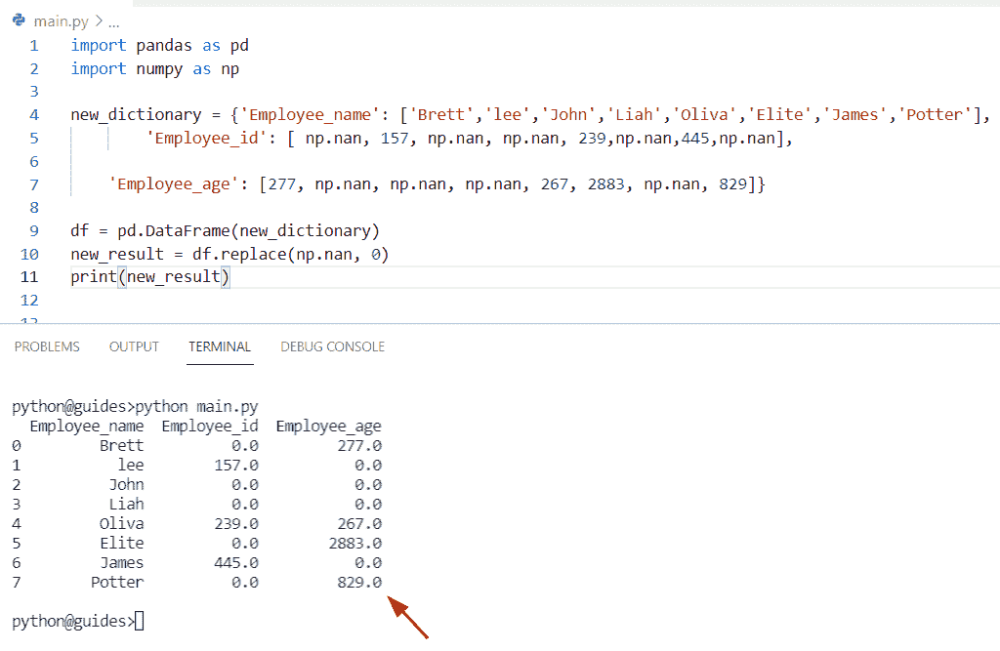

Pandas substitute nan with 0

阅读: [Python 熊猫替换多个值](https://pythonguides.com/pandas-replace-multiple-values/)

## 熊猫系列用 0 替换南

*   本期节目我们将讨论**如何利用熊猫系列**将 nan 值替换为 0。
*   在 Python 中，Pandas 系列只能存储一个带索引的列表，dataframe 是用来分析数据的系列的集合。我们还可以使用 pandas `"series"` 方法将字典、列表和元组转换成序列。
*   现在在这个程序中，我们将通过创建一个 DataFrame 对象来检查如何用零替换 nan 值。

**举例:**

```py
 import pandas as pd
import numpy as np

new_series = {'val1': [15, np.nan, 536, np.nan, 22, 234, np.nan,
						np.nan, 82, np.nan],
	'val2': [19, 25, np.nan, np.nan, 11, np.nan,
						np.nan, 234, 119, np.nan],
	'val3': [16, 856, np.nan, np.nan, np.nan, 3312, 9913,
						19, 1567, np.nan]}

df = pd.DataFrame(new_series)
df = df.fillna(0)
print(df)
```

在上面的代码中，我们首先导入了 pandas 和 NumPy 库，然后创建了一个字典，在这个字典中我们必须分配数字 integer 和 nan 值。

下面是以下给定代码的实现

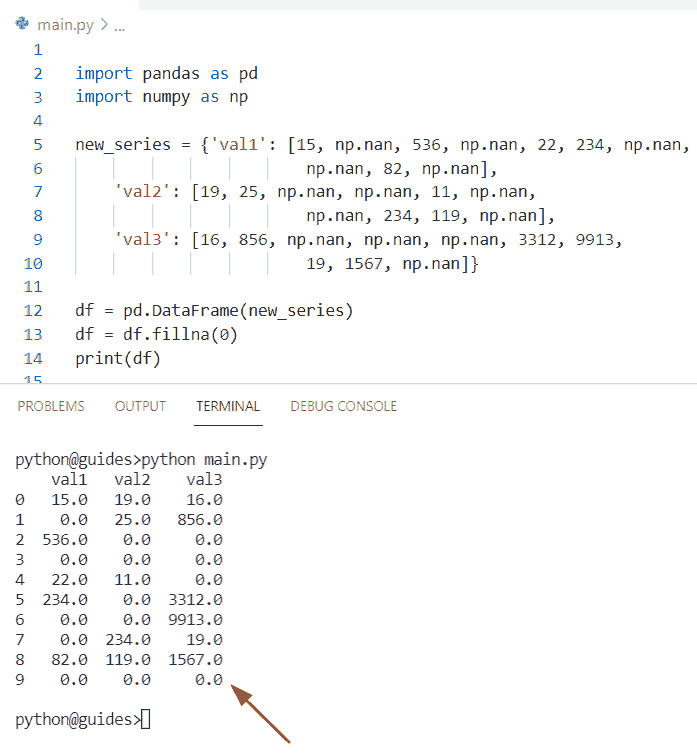

Pandas series replace nan with 0

阅读:[如何在 Python Pandas 中设置列为索引](https://pythonguides.com/set-column-as-index-in-python-pandas/)

## 熊猫合并用 0 替换 nan

*   在这里，我们可以看到如何合并两个不同的数据帧，并使用 **Pandas 将 nan 值替换为零。Concat()** 方法。
*   在 Python 中，该函数用于将 dataframe 系列与 Pandas 对象的轴组合在一起。在这个方法中，我们还可以传递各种参数来修改 Pandas 连接操作的行为。

**语法:**

下面是熊猫的句法。Concat()方法

```py
Pandas.Concat
             (
              objs,
              axis=0,
              join='outer',
              ignore_index=False,
              keys=None,
              Levels=None,
              names=None,
              verify_integrity=False,
              sort=False,
              copy=True
             )
```

*   它由几个参数组成
    *   **objs:** 该参数指定系列或数据帧对象的顺序，如果映射系列被传递，排序的关键字将被用作关键字参数。
    *   **轴:**默认情况下，其值为 0，用于与数据帧中的轴连接。如果 axis=1，则按列执行。
    *   **join:** 该参数表示如何控制其他轴上的指标。
    *   **ignore_index:** 默认情况下，其值为 false，如果为 true 则不使用给定轴上的索引值。
    *   **keys:** 默认情况下，其值为 None，应该只包含元组值。
    *   **级别:**该参数指定级别(序列列表)，默认情况下不取值。

让我们举一个例子，看看如何合并两个数据帧序列，并用零替换 nan 值

**源代码:**

```py
import pandas as pd
import numpy as np

new_series = pd.DataFrame({'Student_age': [np.nan, 67, np.nan, 88],
					'Student_marks': [45, np.nan, 456, np.nan]})

new_col = pd.DataFrame({'Student_age': [134, np.nan, 578, np.nan],
					'Student_marks': [764, np.nan, 1457, np.nan]})

new_val = [new_series, new_col]

result = pd.concat(new_val)
df = result.fillna(0)
print(df)
```

在上面的程序中，我们首先创建了两个不同的数据帧**‘new _ series’**和**‘new _ col’**，它们包含整数和 nan 值。

现在声明一个列表，并为其分配列名。然后使用 `Pandas.concat()` 方法连接两个带有列表参数的序列。

下面是以下给定代码的执行过程

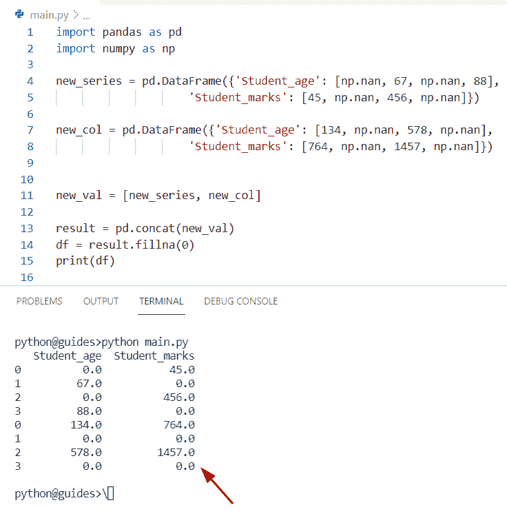

Pandas merge replace nan with 0

阅读: [Python 数据帧到 CSV](https://pythonguides.com/python-dataframe-to-csv/)

## 熊猫用 0 填充 nan 值

*   在这个程序中，我们将讨论如何在 Python Pandas 中使用 fillna()方法将 nan 值替换为 0。
*   在 Python Pandas 中，该方法用于填充 `NA/NAN` 值，并且总是返回缺少值的 Pandas DataFrame 对象。这些是 NumPy 数组和 Pandas 中的特殊值，它表示数据集中缺少值。

**语法:**

下面是 Pandas.fillna()方法的语法

```py
DataFrame.fillna
               (
                value=None,
                method=None,
                axis=None,
                inplace=False,
                limit=None,
                downcast=None
               )
```

**源代码:**

```py
import pandas as pd
import numpy as np

df = pd.DataFrame(
	[[np.nan, np.nan, 456],
	[178, np.nan, 756],
	[np.nan, 129, np.nan],
	[np.nan, np.nan, np.nan]],
	columns=['Oliva', 'Elijah', 'Chris'])

df['Elijah'] = df['Elijah'].fillna(0)
print("Updated DataFrame",df) 
```

在上面的程序中，我们用 np 取一个数据帧。南价值观。现在我们将使用 fillna()方法来替换这些值 np。带零的 nan 值。

你可以参考下面的截图

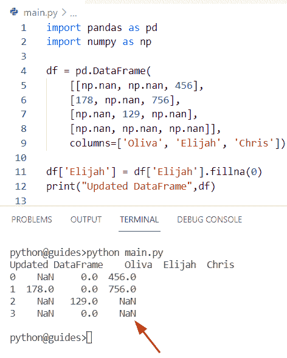

Pandas fill nan values with 0

阅读:[获取索引熊猫 Python](https://pythonguides.com/get-index-pandas-python/)

## 熊猫将所有列中的 nan 替换为 0

*   让我们看看如何在 Python Pandas 中用零替换所有列中的 nan 值。
*   为了执行这个特定的任务，我们可以应用 Pandas.fillna()方法。在本例中，我们将替换给定列表中所有可用的 nan 值。

**举例:**

```py
import pandas as pd
import numpy as np

df = pd.DataFrame(
	[[np.nan, np.nan, 267],
	[117, np.nan, 881],
	[107, 578, np.nan],
	[np.nan, np.nan, np.nan]],
	columns=['Micheal', 'Liah', 'Oliva'])

df['Micheal'] = df['Micheal'].fillna(0)
df['Liah'] = df['Liah'].fillna(0)
df['Oliva'] = df['Oliva'].fillna(0)
print("Updated DataFrame",df) 
```

在上面的代码中，我们首先创建了一个 data frame**‘df’**，然后在其中分配一个 nan 和一个数值。现在用 `fillna()` 方法选择一个特定的列元素。一旦您将打印**‘df’**，那么输出将只显示零和数字整数值。

下面是以下给定代码的执行过程

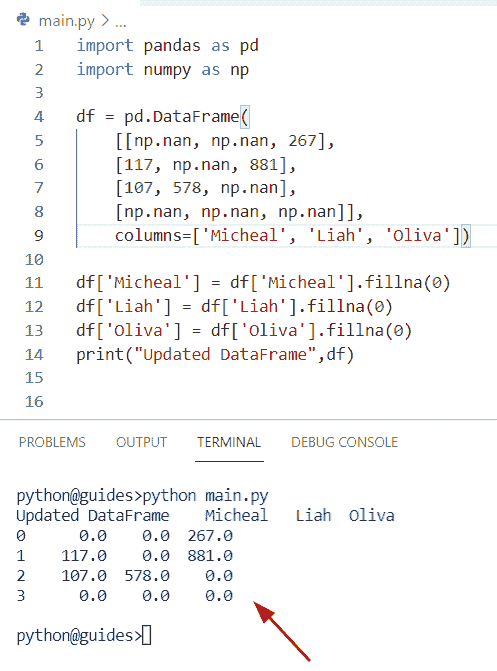

Pandas replace nan with 0 in all columns

阅读: [Python 熊猫写数据帧到 Excel](https://pythonguides.com/python-pandas-write-dataframe-to-excel/)

## 将南换成 0 熊猫名单

*   这里我们可以看到**如何通过使用熊猫**用零替换列表中的 nan 值。
*   在这个程序中，我们导入了一个 pandas 库，然后创建了一个包含 integer 和 nan 值的列表。现在使用列表理解方法遍历一个值。
*   在 Python 中，list comprehension 方法用于通过对现有列表中的每个项目执行操作来创建列表。

**源代码:**

```py
import pandas as pd

new_lis = [78, pd.NA, 157, pd.NA,pd.NA,456,pd.NA]
new_lis = [0 if pd.isna(m) else m for m in new_lis]
print("upgraded dataframe",new_lis) 
```

下面是以下给定代码的实现

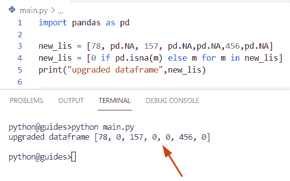

Replace nan with 0 pandas list

阅读:[计算熊猫数据帧中的行数](https://pythonguides.com/count-rows-in-pandas-dataframe/)

## 熊猫用 0 替换串楠

*   在这个程序中，我们将看到**如何在 Pandas** 中用零替换 nan 字符串值。为了完成这项任务，我们将使用 replace()方法。
*   通过使用 `Pandas.replace()` 方法，Pandas 数据帧的值可以替换为其他值，如零。

**举例:**

```py
import pandas as pd
import numpy as np
new_dict = {'Stu_name': ['John', 'Potter', 'Ghilchrist', 'Adam','np.nan','np.nan'],
            'Country_name': ['Japan', 'China', 'Germany', 'Australia'],
            'Stu_name': ['np.nan', 'np.nan', 157,'np.nan'],
             'Stu_marks':[167, 'np.nan',556,'np.nan']}
df = pd.DataFrame(new_dict)

df['Stu_name'] = df['Stu_name'].replace('np.nan',0)
df['Stu_marks'] = df['Stu_marks'].replace('np.nan',0)

print("Updated DataFrame",df) 
```

在上面的代码中，我们首先创建了一个字典，并分配了一个键值对元素。在此示例中，键被视为列名，列表仅包含字符串值。现在我们想通过使用 `replace()` 方法将' np.nan '值替换为零。

你可以参考下面的截图

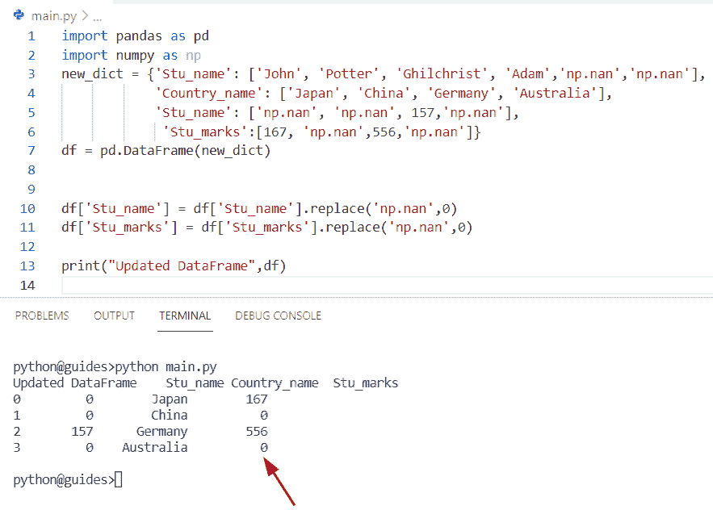

Pandas replace string nan with 0

阅读: [Python 熊猫数据帧 Iterrows](https://pythonguides.com/pandas-dataframe-iterrows/)

## 熊猫 sum 用 0 代替 nan

*   让我们看看**如何在 Python Pandas** 中使用 Pandas.sum()方法对给定数据帧中的所有整数值求和。
*   在 Python 中，Pandas 提供了一个名为 `sum()` 的函数，可用于获取 Pandas 数据帧中所有值的总和以及轴，该方法总是返回一个存储每列中所有值总和的序列。

**语法:**

下面是 Pandas.sum()方法的语法

```py
DataFrame.sum(
              axis=None,
              skipna=None,
              level=None,
              numeric_only=None,
              min_count=0
             )
```

*   它由几个参数组成
    *   **轴:**该参数表示将要计算的值的总和。如果 axis=1，则表示由列表示的值的总和。
    *   **skipna:** 默认取真值。
    *   **级:**默认无，整数或级名。

**源代码:**

```py
import numpy as np
import pandas as pd

my_new_dict = { 'val1': [723, 1178, np.NaN, np.NaN],
                'val2': [867, np.NaN, np.NaN, 289],
                'val3': [356, np.NaN, np.NaN, 190],
                'val4': [115, 590, 389, 178],
                'col_name': ['Python', 'Java', 'Ruby', 'Sql']}

df = pd.DataFrame(my_new_dict)
df = df.set_index('col_name')
new_val=df['val2'].sum()
print(new_val) 
```

在上面的程序中，我们在这个 Pandas 数据帧上调用了 `sum()` 函数，没有任何轴参数。因此，它显示一个 Dataframe 系列，其中系列中的每个值都代表一列中值的总和。

你可以参考下面的截图

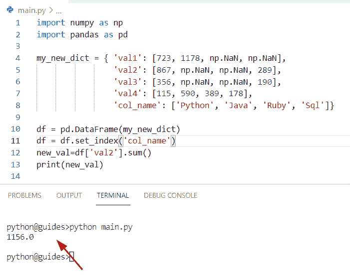

Pandas sum replace nan with 0

阅读: [Python 将数据帧转换为列表](https://pythonguides.com/python-convert-dataframe-to-list/)

## 熊猫枢轴用 0 替换南

*   在这个 Python 程序中，我们将讨论如何使用 pivot 和 replace 函数将 nan 值替换为零。
*   在 Python 中，该函数表示基于唯一值的数据透视表，并使用值进行填充。

**语法:**

下面是 Pandas.pivot()函数的语法

```py
DataFrame.pivot(
                index=None,
                columns=None,
                values=None
               )
```

**举例:**

```py
import pandas as pd
import numpy as np
new_dict = {'Stu_name': ['William', 'Jmaes', 'Chris', 'Hemsowrth'],
            'Stu_age': [14, np.nan, np.nan, 34],
            'Stu_name': [998, np.nan, 157,np.nan],
             'Stu_marks':[167, np.nan,556,np.nan]}
df = pd.DataFrame(new_dict)

df['Stu_age'] = df['Stu_age'].replace(np.nan,0)
df['Stu_marks'] = df['Stu_marks'].replace(np.nan,0)

print("Updated DataFrame",df) 
```

下面是以下给定代码的输出

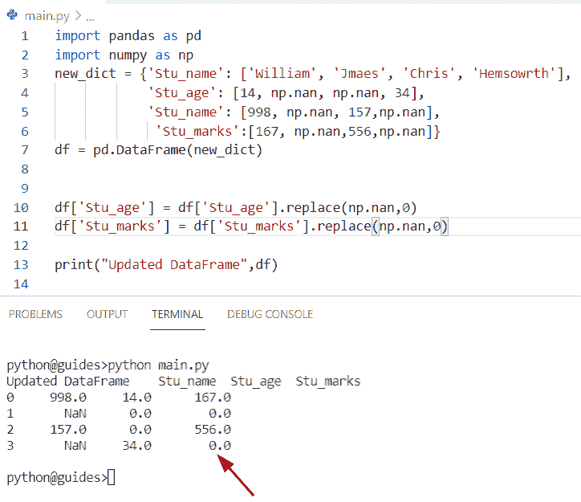

Pandas pivot replace nan with 0

在这篇 Python Pandas 教程中，我们已经学习了如何使用 Pandas 在 Python 中用 0 替换 nan 值。此外，我们已经讨论了这些主题。

*   熊猫用栏中的 0 替换 nan
*   熊猫对多列用 0 代替 nan
*   熊猫在一列中用 0 代替 nan
*   熊猫用 0 代替 nan
*   熊猫用 0 代替 nan
*   熊猫系列用 0 代替 nan
*   熊猫合并用 0 替换 nan
*   熊猫用 0 填充 nan 值
*   熊猫 read_csv 用 0 替换 nan
*   熊猫将所有列中的 nan 替换为 0
*   将 nan 替换为 0 熊猫列表
*   熊猫用 0 代替字符串 nan
*   熊猫 sum 用 0 代替 nan
*   熊猫枢轴用 0 替换 nan

[Bijay Kumar](https://pythonguides.com/author/fewlines4biju/)

Python 是美国最流行的语言之一。我从事 Python 工作已经有很长时间了，我在与 Tkinter、Pandas、NumPy、Turtle、Django、Matplotlib、Tensorflow、Scipy、Scikit-Learn 等各种库合作方面拥有专业知识。我有与美国、加拿大、英国、澳大利亚、新西兰等国家的各种客户合作的经验。查看我的个人资料。

[enjoysharepoint.com/](https://enjoysharepoint.com/)[](https://www.facebook.com/fewlines4biju "Facebook")[](https://www.linkedin.com/in/fewlines4biju/ "Linkedin")[](https://twitter.com/fewlines4biju "Twitter")