# 如何在 Python Django 中解析 CSV

> 原文：<https://pythonguides.com/parse-csv-in-python-django/>

[](https://sharepointsky.teachable.com/p/python-and-machine-learning-training-course)

在这个 [Python Django 教程](https://pythonguides.com/what-is-python-django/)中，我会用简单的步骤解释**如何` `解析 Python Django** 中的 CSV。

最近，我一直在使用 Django 框架创建一个网站。我有一些 CSV 文件中的数据项要上传到 Django 模型。

因此，我已经做了研究，并创建了一个逻辑，用于在一眨眼的时间内将 CSV 文件解析为 Django 模型。

在这里我们将看到:

*   什么是 django-import-export 库？
*   如何使用 django-import-export
*   在 Django web 框架中建立一个项目
*   在 Django 创建模型
*   如何向管理界面注册模型
*   如何在 Python Django 中解析 CSV
*   用于导入和导出 CSV 的 Django 模板
*   如何在 Django 中创建超级用户
*   如何在管理界面中查看数据项

在本文的最后，您还可以下载用 Python Django 解析 CSV 的代码。

这是我们将在这里建造的。

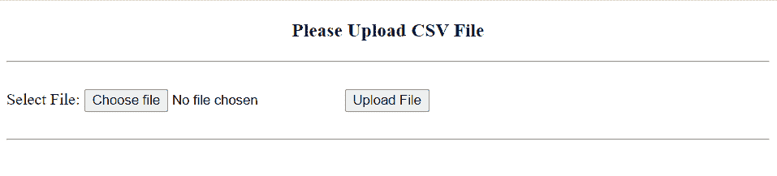

Parsing CSV in Python Django

目录

[](#)

*   [如何在 Python Django 中一步步解析 CSV](#How_to_parse_CSV_in_Python_Django_step_by_step "How to parse CSV in Python Django step by step")
    *   [django-进出口库](#django-import-export_library "django-import-export library")
    *   [如何设置导入导出库](#How_to_set_up_Import_and_Export_Library "How to set up Import and Export Library")
    *   [解析 Python Django 中的 CSV](#Parse_CSV_in_Python_Django "Parse CSV in Python Django")
        *   [建立 Django 项目](#Set_up_Django_Project "Set up Django Project")
        *   [在 Django 中创建模型](#Create_Model_in_Django "Create Model in Django")
        *   [向管理站点注册模型](#Register_Model_to_Admin_Site "Register Model to Admin Site")
        *   Django 的资源
        *   [用于导入和导出 CSV 的 Django 模板](#Django_Template_to_Import_and_Export_CSV "Django Template to Import and Export CSV")
        *   [定义视图](#Define_View "Define View")
        *   [执行 Django 模型](#Execute_Django_Model "Execute Django Model")
        *   [执行 Django 应用程序](#Execute_Django_Application "Execute Django Application")
        *   [从 Django 管理界面查看数据](#View_data_from_the_Django_admin_interface "View data from the Django admin interface")
*   [下载解析 CSV 格式的 Python Django 完整代码](#Download_Parse_CSV_in_Python_Django_complete_code "Download Parse CSV in Python Django complete code")
*   [结论](#Conclusion "Conclusion")

## 如何在 Python Django 中一步步解析 CSV

现在，让我们先了解一下`*Django-import-export*`库，一步步学习在 Python Django 中解析 CSV 文件。

### django-进出口库

顾名思义， `django-import-export` 库处理数据导入和导出。

该库支持多种格式，如 xls、csv、json、yaml，以及其他由 `tablib` 提供的格式。此外，它有一个 Django 管理集成，非常用户友好。

### 如何设置导入导出库

django-import-export 应该首先安装在您激活的虚拟环境中。借助这个包，我们可以在 Python Django 中解析 CSV 文件。

```py
pip install django-import-export
```

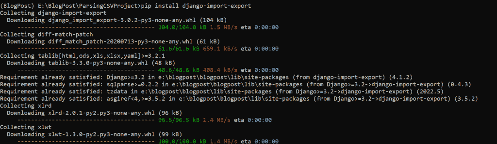

django-import-export library

安装完成后，在 `settings.py` 文件中添加 Django `import_export` 到 `INSTALLED_APPS` 。

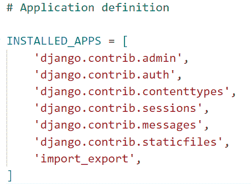

Update settings.py

此外，还有一个可选配置，您可以在 `settings.py` 文件中进行设置。

```py
IMPORT_EXPORT_USE_TRANSACTIONS = True
```

它决定了库是否会在数据导入期间使用数据库事务。默认情况下，该值为 False。因此，为了安全起见，我们将其设置为 True。

阅读: [Python Django 表单验证](https://pythonguides.com/django-form-validation/)

### 解析 Python Django 中的 CSV

现在，我们将看到一个与在 Python Django 中解析 CSV 相关的例子。

#### 建立 Django 项目

要启动 Django 项目，请打开终端并输入以下命令。这里，`parsingsvproject`是 Django 项目的名称。

```py
django-admin startproject ParsingCSVProject
```

它将创建一个名为`parsingsvproject`的文件夹，并在终端中输入下面的命令。

```py
cd ParsingCSVProject
```

通过在终端中键入下面的命令，在这个项目文件夹中创建一个名为 `MyApp` 的 Django 应用程序。

```py
python manage.py startapp MyApp
```

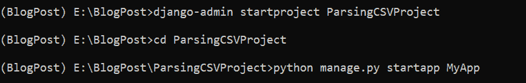

Setup Python Django Project

将应用名称添加到位于 `settings.py` 文件中的 `INSTALLED_APP` 列表中，以激活该应用。

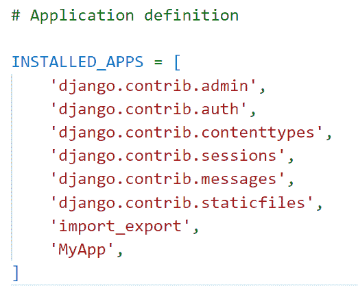

Install App in settings.py

Django 在项目目录中包含了一个 `urls.py` 文件，默认情况下，它将新构建的应用程序映射到其中。为此，在其中添加以下代码。

```py
from django.contrib import admin
from django.urls import path,include

urlpatterns = [
    path('admin/', admin.site.urls),
    path('',include('MyApp.urls')),
]
```

阅读: [Python Django MySQL CRUD](https://pythonguides.com/python-django-mysql-crud/)

#### 在 Django 中创建模型

要在 Django 中创建模型，打开 app 目录中的 `models.py` 文件，并添加下面给出的代码。

```py
from django.db import models

# Create your models here.

class SongRank(models.Model):
    Rank = models.IntegerField()
    Song = models.CharField(max_length=200)
    Streams = models.CharField(max_length=5)
    Artist = models.CharField(max_length=500)
    Release_Date = models.DateField(null=True)
```

在这里，我们创建一个模型类 `SongRank` 有以下字段。

*   **排名**是 Django IntegerField，用来存储歌曲的排名。
*   **歌曲**是 Django CharField，它存储了 Spotify 上最热门的流媒体歌曲的名称。这个字符字段有 200 个字符的限制。
*   `Streams` 是 Django CharField，它存储了 Spotify 统计的歌曲流。
*   **艺术家**是 Django CharField，它存储了歌曲艺术家的名字。
*   `Release_Date` 是 Django DateField，它存储了歌曲在 Spotify 上的发布日期。此外，我们将参数**设置为空**到**真**。

#### 向管理站点注册模型

要在管理应用程序中查看模型，请在管理站点上注册它。打开 `admin.py` 文件，将以下代码添加到该文件中。

```py
from django.contrib import admin
from import_export.admin import ImportExportModelAdmin
from .models import SongRank

# Register your models here.

@admin.register(SongRank)
class SongRankAdmin(ImportExportModelAdmin):
    list_display = ('Rank', 'Song', 'Streams', 'Artist')
```

这里，我们创建了一个装饰器来注册我们的模型类。列表的字段名使用 `list_display` 属性以必要的顺序定义在一个元组中。

阅读；[如何用 Django 脆皮制作造型](https://pythonguides.com/create-form-with-django-crispy-forms/)

#### Django 的资源

为了使用 `django-import-export` 库，我们需要从前端导入和导出文件的资源。资源是类定义，与 Django 处理模型表单和管理类的方式非常相似。

要添加与资源相关的代码，在 app 文件夹中创建一个名为 `resources.py` 的文件。

```py
from import_export import resources
from .models import SongRank

class SongRankResource(resources.ModelResource):
    class Meta:
        model = SongRank
```

首先从**进出口**库中导入**资源**和 `SongRank` 模型。然后，创建一个名为 `SongRankResource` 的资源类，并将**模型**名称传递给**元类**进行配置。

#### 用于导入和导出 CSV 的 Django 模板

在主项目目录中创建一个名为 `Templates` 的子目录来存储所有的项目模板，因为 Django 应用程序的前端是在 Templates 中指定的。

通过打开 `settings.py` 文件，更新 `DIRS` 以使用模板文件夹的路径。

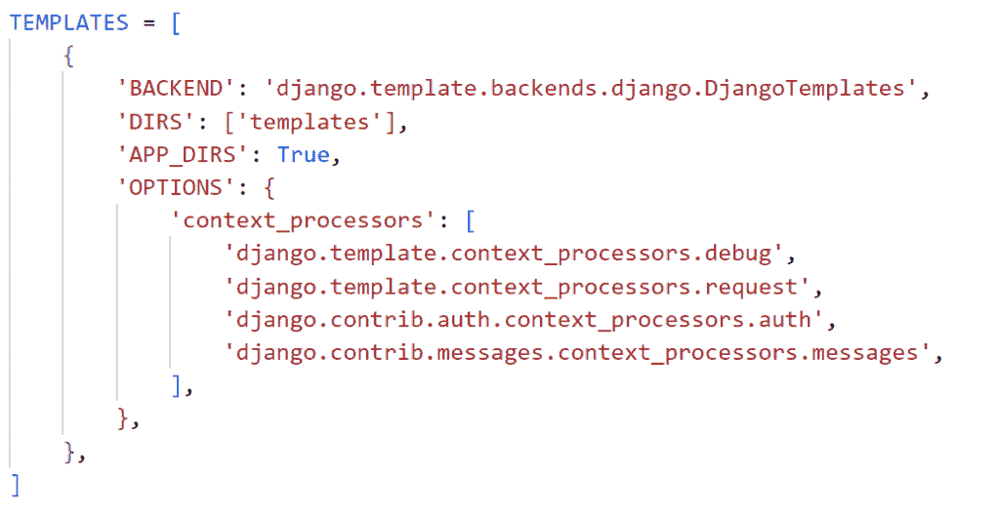

Update Template Folder Path

创建一个`home.html`文件，在模板文件夹中添加用于解析 Django 中的 CSV 的 HTML 代码。

```py
<!DOCTYPE html>
<html lang="en">

<head>
    <meta charset="UTF-8">
    <meta http-equiv="X-UA-Compatible" content="IE=edge">
    <meta name="viewport" content="width=device-width, initial-scale=1.0">
    <title>Parse CSV File</title>
</head>

<body>
    <h3 align="center">
        Please Upload CSV File
    </h3>
    <hr>
    <br>
    <form method="post" enctype="multipart/form-data">
        
        <input type="file" name="myfile">
        <button type="submit">Upload File</button>
    </form>
    <br>
    <hr>
    
    
    <div class="alert alert-{{ message.tags }}" role="alert">
        <p class="" >{{ message }}</p>
    </div>
    
    
</body>

</html>
```

*   HTML 标签 `h3` 用于在**主体**标签内添加表单的标题。
*   一旦表单被提交，通过调用表单标签的 `POST` 方法，表单就会被提交。
*   在**表单**标签中添加`enctype = " multipart/form-data "`，否则不上传文件。
*   在表单元素中添加 `csrf_token` 来保护表单免受网络攻击，并使您能够安全地传输数据。
*   然后，我们创建选择文件的**文件输入**选项和将文件数据上传到管理站点的**提交按钮**。
*   最后，我们使用 **{{message}}** 来打印错误和成功消息。

阅读: [Django 联系表，包含基于类别的视图](https://pythonguides.com/django-contact-form-with-class-based-views/)

#### 定义视图

要定义应用程序的主要逻辑，打开 `views.py` 文件并添加下面给出的代码。

```py
from django.shortcuts import render
from .models import SongRank
from .resources import SongRankResource
from django.contrib import messages
from tablib import Dataset
import csv,io

def upload(request):
    if request.method == 'POST':
        songrank_resource = SongRankResource()
        dataset = Dataset()
        new_songrank = request.FILES['myfile']

        if not new_songrank.name.endswith('csv'):
            messages.info(request,'Please Upload the CSV File only')
            return render(request,'home.html')

        data_set = new_songrank.read().decode('UTF-8')
        io_string = io.StringIO(data_set)
        next(io_string)
        for column in csv.reader(io_string, delimiter=',', quotechar="|"):
            created = SongRank.objects.update_or_create(
                Rank=column[0],
                Song=column[1],
                Streams=column[2],
                Artist=column[3])
    return render(request, 'home.html')
```

现在，为了调用视图，我们必须将视图映射到 URL，因此我们必须在 app 目录中创建一个名为 `urls.py` 的文件。在其中包含以下代码。

```py
from django.urls import path
from . import views

urlpatterns = [
path('', views.upload, name='upload'),
]
```

阅读:[创建一个 Django 联系表单，并附上电子邮件](https://pythonguides.com/build-a-django-contact-form-with-email/)

#### 执行 Django 模型

要创建包含模型表格模式代码的迁移文件，请在终端中键入以下命令。

```py
python manage.py makemigrations
```

要按照迁移文件的模式构建表，请执行以下命令。

```py
python manage.py migrate
```

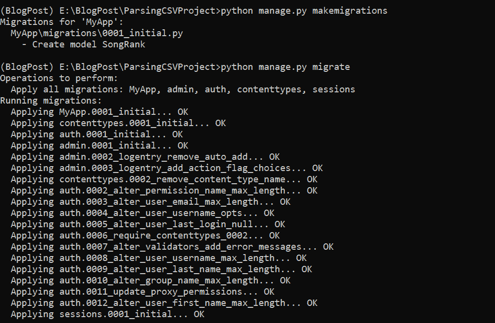

Execute Django Model

#### 执行 Django 应用程序

要启动开发服务器，请在终端中键入下面给出的命令。

```py
python manage.py runserver
```

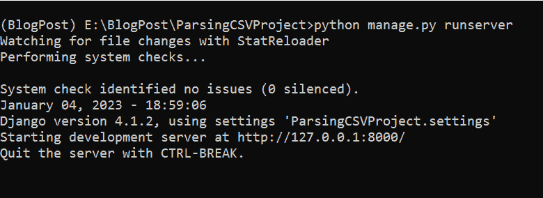

Runserver in Django

它成功地打开了 Django 页面，以选择 Python Django 中的文件。


Python Django Parse CSV

接下来，导入您想要导出到 Django 模型的文件。

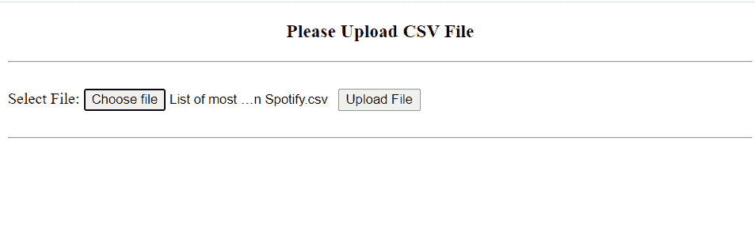

Select the CSV File

成功选择 CSV 文件后，会显示成功消息。

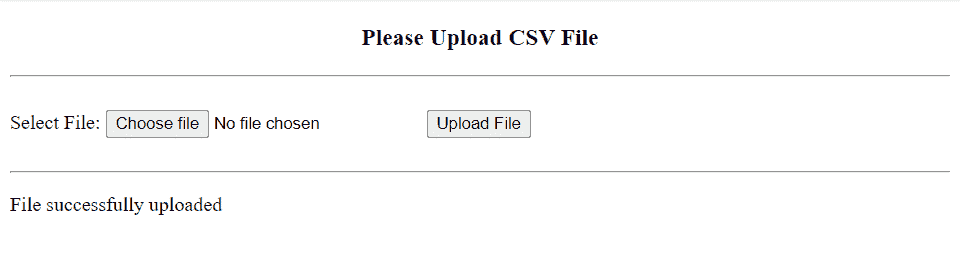

Success Message

如果您上传的文件不是 CSV 格式，它将显示一条错误消息。

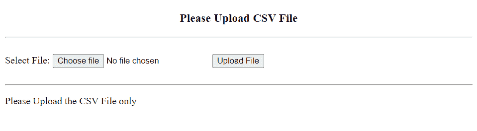

Error Message

阅读:[使用 PostgreSQL 的 Django CRUD 示例](https://pythonguides.com/django-crud-example-with-postgresql/)

#### 从 Django 管理界面查看数据

要查看 Django 管理界面中输入数据，首先我们必须创建一个超级用户。在给定的命令下键入。

```py
python manage.py createsuperuser
```

然后，点击**宋排名**下**缅甸**。它将成功地向您显示模型中的数据项。

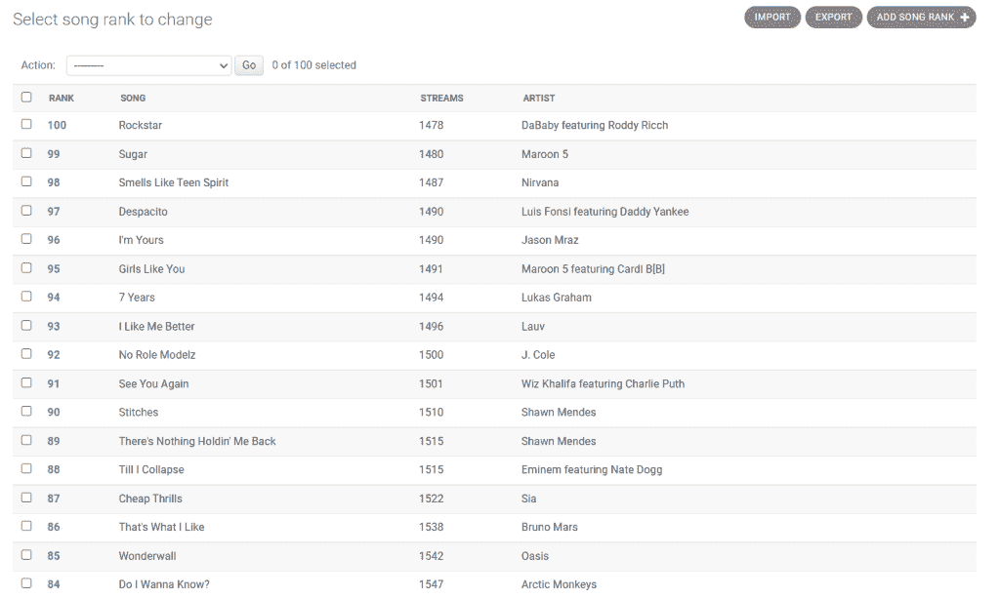

Parse CSV in Python Django

这就是我们如何在 Python Django 中解析 CSV。

## 下载解析 CSV 格式的 Python Django 完整代码

这是代码。

[Parse CSV in Python Django](https://pythonguides.com/wp-content/uploads/2023/01/ParsingCSVProject.zip)

## 结论

这样，我们已经成功地在 Python Django 中导入和导出了 CSV。我们还学习了 *django-import-export* 库以及将 CSV 解析为 Python Django 模型。

此外，我们还讨论了以下主题。

*   什么是 django-import-export 库？
*   如何使用 django-import-export
*   在 Django web 框架中建立一个项目
*   在 Django 创建模型
*   如何向管理界面注册模型
*   如何在 Python Django 中解析 CSV
*   用于导入和导出 CSV 的 Django 模板
*   如何在 Django 中创建超级用户
*   如何在管理界面中查看数据项

另外，看看更多的 Python Django 教程。

*   [获取 Django 中的 URL 参数](https://pythonguides.com/get-url-parameters-in-django/)
*   [Django 从 POST 请求中获取所有数据](https://pythonguides.com/django-get-all-data-from-post-request/)
*   [Django 模板中的 If 语句](https://pythonguides.com/if-statement-in-django-template/)
*   [Python Django 随机数](https://pythonguides.com/django-random-number/)

[Bijay Kumar](https://pythonguides.com/author/fewlines4biju/)

Python 是美国最流行的语言之一。我从事 Python 工作已经有很长时间了，我在与 Tkinter、Pandas、NumPy、Turtle、Django、Matplotlib、Tensorflow、Scipy、Scikit-Learn 等各种库合作方面拥有专业知识。我有与美国、加拿大、英国、澳大利亚、新西兰等国家的各种客户合作的经验。查看我的个人资料。

[enjoysharepoint.com/](https://enjoysharepoint.com/)[](https://www.facebook.com/fewlines4biju "Facebook")[](https://www.linkedin.com/in/fewlines4biju/ "Linkedin")[](https://twitter.com/fewlines4biju "Twitter")