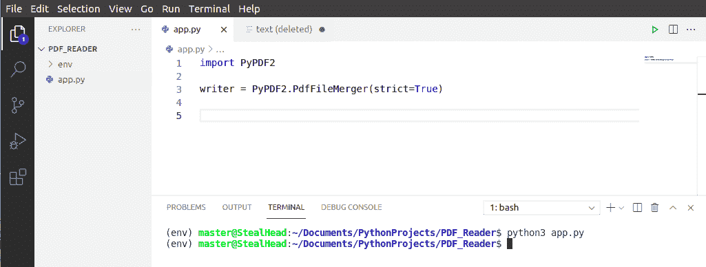
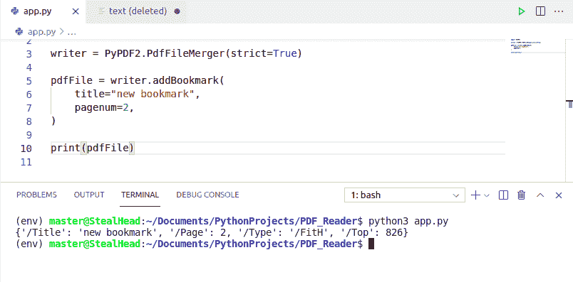
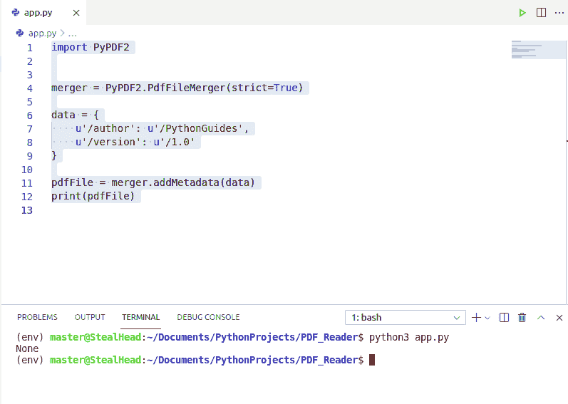
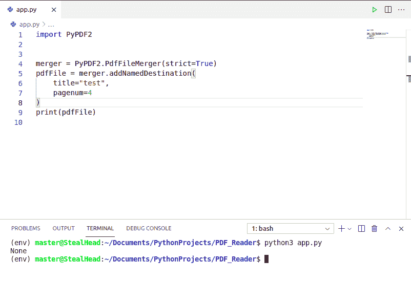
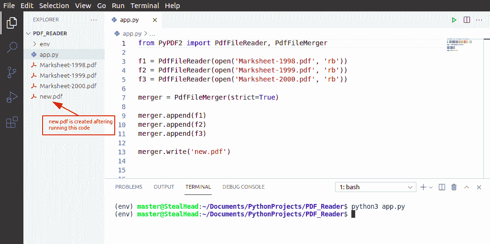
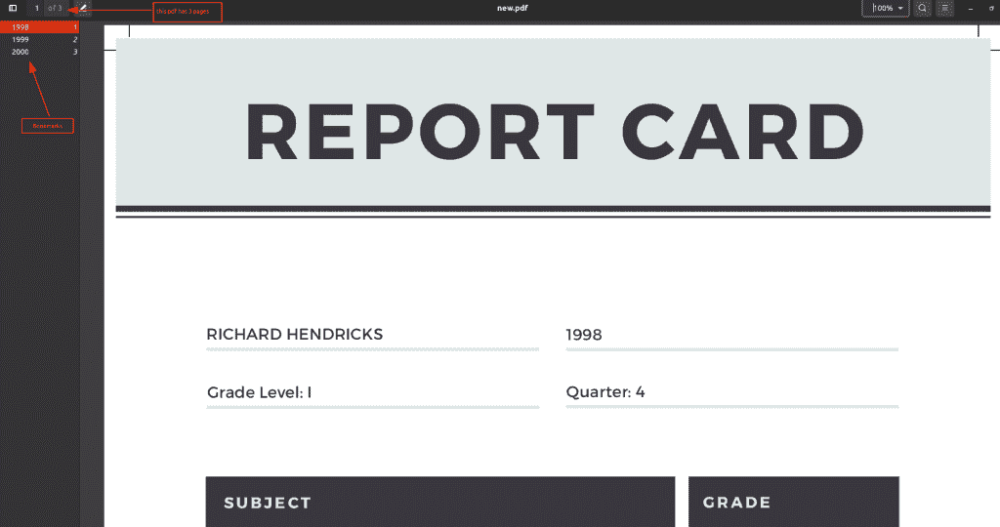
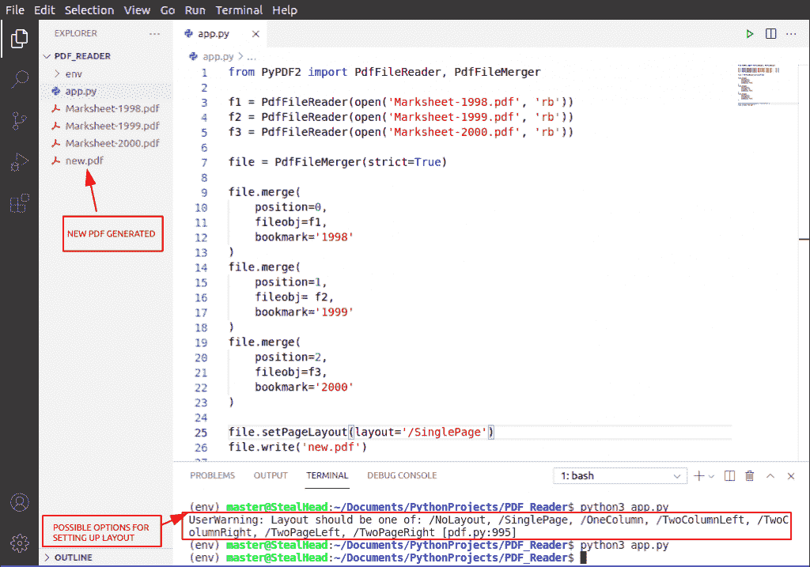
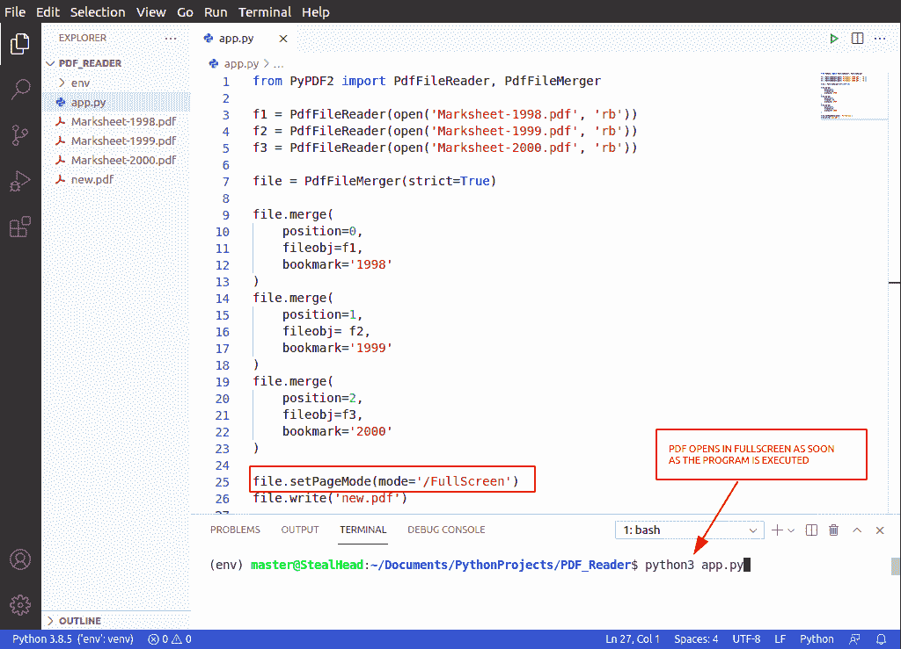

# PdfFileMerger Python 示例

> 原文：<https://pythonguides.com/pdffilemerger-python-examples/>

[](https://sharepointsky.teachable.com/p/python-and-machine-learning-training-course)

在这个 [Python 教程](https://pythonguides.com/learn-python/)中，我们将讨论什么是 Python 中的 PyPDF2 以及 PdfFileMerger 的各种方法，还有 **PdfFileMerger Python 示例**。

我们将学习 **PdfFileMerger 类和方法**。PyPDF2 模块中的类被广泛用于**在 Python** 中将多个 PDF 文件合并成一个文件。

此外，我们将检查:

*   如何在 Python 中给 PDF 添加书签
*   如何在 Python 中向 pdf 添加元数据
*   如何在 Python 中追加 PDF 文件
*   如何使用 PDFFileMerger 在 Python 中合并 PDF 文件
*   如何在 Python 中设置 PDF 中的页面布局
*   如何在 Python 中设置 PDF 中的页面模式
*   在 Python 中使用 PdfFileMerger 编写文件对象

目录

[](#)

*   [PyPDF2 Python 库](#PyPDF2_Python_Library "PyPDF2 Python Library")
*   [在 python 中安装 pypdf 2](#Install_PyPDF2_in_python "Install PyPDF2 in python")
*   [Python 中的 PdfFileMerger](#PdfFileMerger_in_Python "PdfFileMerger in Python")
*   [PdfFileMerger Python 示例](#PdfFileMerger_Python_Example "PdfFileMerger Python Example")
    *   [使用 Python 中的 PdfFileMerger 添加书签](#Add_Bookmark_using_PdfFileMerger_in_Python "Add Bookmark using PdfFileMerger in Python")
    *   [使用 Python 中的 PdfFileMerger 在 PDF 中添加元数据](#Add_Metadata_in_PDF_using_PdfFileMerger_in_Python "Add Metadata in PDF using PdfFileMerger in Python")
    *   [使用 Python 中的 PdfFileMerger 向 PDF 文件添加命名目的地](#Add_Named_Destination_to_PDF_files_using_PdfFileMerger_in_Python "Add Named Destination to PDF files using PdfFileMerger in Python")
    *   [使用 Python 中的 PDF 文件合并器添加 PDF 文件](#Append_PDF_using_PdfFileMerger_in_Python "Append PDF using PdfFileMerger in Python")
    *   [Python 中 PdfFileMerger 的关闭操作](#Close_operation_in_PdfFileMerger_in_Python "Close operation in PdfFileMerger in Python")
    *   [使用 Python 中的 PdfFileMerger 合并 PDF 文件](#Merge_PDF_files_using_PdfFileMerger_in_Python "Merge PDF files using PdfFileMerger in Python")
    *   [使用 Python 中的 PdfFileMerger 设置页面布局](#Set_Page_Layout_using_PdfFileMerger_in_Python "Set Page Layout using PdfFileMerger in Python")
    *   [使用 Python 中的 PdfFileMerger 设置页面模式](#Set_Page_Mode_using_PdfFileMerger_in_Python "Set Page Mode using PdfFileMerger in Python")
    *   [使用 Python 中的 PdfFileMerger 编写文件对象](#Write_file_object_using_PdfFileMerger_in_Python "Write file object using PdfFileMerger in Python")

## PyPDF2 Python 库

*   Python 被用于各种各样的目的&用各种活动的库和类来装饰。出于这些目的，其中一个是用 Python 从 PDF 中读取文本。
*   `PyPDF2` 提供的类帮助我们**读取**，**合并**，**编写**一个 PDF 文件。
    *   `PdfFileReader` 用于执行与读取文件相关的所有操作。
    *   **pdf 文件合并器**用于将多个 pdf 文件合并在一起。
    *   `PdfFileWriter` 用于对 pdf 执行写操作。
*   所有的类都有不同的方法，方便程序员控制和执行 pdf 上的任何操作。
*   PyPDF2 在 Python3.5 之后已经停止接收任何更新，但仍用于控制 PDF。在本教程中，我们将涵盖关于 `PdfFileMerger` 类&的一切，我们将告诉你所有的函数都贬值或损坏了什么。

阅读: [PdfFileReader Python 示例](https://pythonguides.com/pdffilereader-python-example/)

## 在 python 中安装 pypdf 2

要在 Python 中使用 PyPDF2 库，我们需要首先安装 PyPDF2。按照以下代码在您的系统中安装 **PyPDF2 模块**。

```py
pip install PyPDF2
```

阅读完本教程后，您将对 PdfFileMerger 类中的每个函数有完整的了解。此外，我们将演示 PdfFileMerger 类中每个函数的例子。

阅读:[用 Python 创建和修改 PDF 文件](https://pythonguides.com/create-and-modify-pdf-file-in-python/)

## Python 中的 PdfFileMerger

Python 中的 PdfFileMerger 提供了帮助将多个 PDF 合并成一个的方法。它提供了各种功能，您可以使用这些功能在 Python 中控制 PDF。

*   Python 中的 PdfFileMerger 用于将两个或多个 PDF 文件合并为一个。它初始化一个 PdfFileMerger 对象。
*   它可以连接，切片和插入 PDF 文件。
*   第一步是导入 `PyPDF2` 模块。

```py
import PyPDF2
```

*   下一步是用 Python 初始化 PyPDF2 模块中的类。所以这次我们将初始化 PdfFileMerger。

```py
PyPDF2.PdfFileMerger(strict=True)
```

这里， `strict` 决定了是否应该警告用户所有的问题。默认情况下，这是真的。

下面是上面代码的实现。如果它显示一个错误，这意味着在 Python 的 PdfFileMerger 中一切正常。



PdfFileMerger Python examples

这就是我们如何在 Python 中使用 **PdfFileMerger。接下来，我们将学习本课程中所有可用的方法。**

阅读: [PdfFileWriter Python 示例](https://pythonguides.com/pdffilewriter-python-examples/)

## PdfFileMerger Python 示例

在这一节中，我们将了解 PdfFileMerger 类中可用的函数。此外，我们将借助示例演示每个函数的用法。

请注意，Python 中的 PyPDF2 模块在 python 3.5 之后没有更新，所以，您正在阅读的这篇博客可能有几个功能不起作用。

### 使用 Python 中的 PdfFileMerger 添加书签

让我们看看如何在 Python 中使用 PdfFileMerger 添加书签。

PdfFileMerger 提供了一个方法 **addBookmark(title，pagenum，parent=None)** 允许在 Python 中的 PDF 文件中添加书签。

*   用 Python 为 PDF 文件添加书签。
*   参数:
    *   `title` (str):用于该书签的标题或名称。
    *   `pagenum` (int):这个书签将指向的页码。
    *   `parent` :对父书签的引用，用于创建嵌套书签。
*   下面是 Python 中 PdfFileMerger 类的 `addBookmark()` 函数的例子

**代码片段:**

在这段代码中，我们使用 Python 中的 PdfFileMerger 添加了一个书签，名称为“new bookmark ”,引用是针对第 2 页的。

```py
import PyPDF2

writer = PyPDF2.PdfFileMerger(strict=True)

pdfFile = writer.addBookmark(
    title="new bookmark",
    pagenum=2,
)

print(pdfFile)
```

**输出:**

在这个输出中，您可以看到在终端字典中显示的书签信息。



Add Bookmark using PdfFileMerger in Python

这就是我们如何用 Python 在 PDF 中添加书签。

### 使用 Python 中的 PdfFileMerger 在 PDF 中添加元数据

现在，让我们看看如何使用 PdfFileMerger 在 Python 中向 PDF 文件添加元数据。

PdfFileMerge 提供了方法 `addMetadata(infos)` ，该方法允许在 Python 中的 PDF 文件中添加元数据。

*   该函数将自定义元数据添加到输出中。
*   参数:
    *   infos (dict):一个 python 字典，其中每个键都是一个字段，每个值都是新的元数据。示例:`{u'/Title': u'My title'}`
*   下面是在 Python 中使用 PdfFileMerger 添加元数据的例子

**代码片段:**

在这段代码中，我们遵循了使用 Python 中的 PdfFileMerger 输入元数据的过程。请注意，所有的键和值必须是一个**字符串**。

```py
import PyPDF2

merger = PyPDF2.PdfFileMerger(strict=True)

data = {
    u'/author': u'/PythonGuides',
    u'/version': u'/1.0'
}

pdfFile = merger.addMetadata(data)
print(pdfFile) 
```

**输出:**

在这种情况下，预期的输出是终端中出现的字典文本，但它没有返回任何内容。我们声明这个方法是无效的，但是如果你找到了解决方案，请在评论区留下。



Add Metadata using PdfFileMerger in Python

这就是我们如何使用 PdfFileMerger 在 Python 中向 PDF 文件添加元数据。

### 使用 Python 中的 PdfFileMerger 向 PDF 文件添加命名目的地

PdfFileMerger 提供了一个方法 **addNamedDestination(title，pagenum)** 允许在 Python 中的 PDF 文件中添加命名的目的地。

*   向输出添加目的地。
*   参数:
    *   **标题** (str):要使用的标题
    *   `pagenum` (int):此目的地指向的页码。
*   下面是在 Python 中使用 PdfFileMerger 的 `addNamedDestination()` 的例子

**代码片段:**

在这段代码中，我们遵循了在 Python 中使用 PdfFileMerger 添加的过程。请注意，所有的键和值必须是一个**字符串**。

```py
import PyPDF2

merger = PyPDF2.PdfFileMerger(strict=True)
pdfFile = merger.addNamedDestination(
    title="test",
    pagenum=4
)
print(pdfFile) 
```

**输出:**

上述代码的输出显示无。我们在 Python 的 PdfFileReader 中也有同样的功能。此功能已贬值，不再起作用。



Add Named Destination using PdfFileMerger in Python

这是如何使用 Python 中的 PdfFileMerger 向 PDF 文件添加命名目标。

### 使用 Python 中的 PDF 文件合并器添加 PDF 文件

PdfFileMerger 提供了一个方法 `append( `fileobj，bookmark=None，pages=None，import_bookmarks=True` )` ，使用该方法连接 PDF 页面。

*   与 merge()方法相同，但是假设您想要将所有页面连接到文件的末尾，而不是指定一个位置。
*   参数:
    *   `File obj`–一个文件对象或一个支持标准读取并寻找类似于文件对象的方法的对象。也可以是表示 PDF 文件路径的字符串。
    *   `bookmark`(str)–可选地，您可以通过提供书签的文本来指定要在所包含文件的开头应用的书签。
    *   `pages`–可以是页面范围或(start，stop[，step])元组，只将源文档中指定范围的页面合并到输出文档中。
    *   `import _ bookmarks`(bool)–您可以通过将其指定为 False 来防止导入源文档的书签。
*   下面是 Python 中使用 PdfFileMerger 的 `append()` 的例子。

**代码片段:**

在这段代码中，我们有

```py
from PyPDF2.pdf import PdfFileReader, PdfFileMerger

f1 = PdfFileReader(open('Marksheet-1998.pdf', 'rb'))
f2 = PdfFileReader(open('Marksheet-1999.pdf', 'rb'))
f3 = PdfFileReader(open('Marksheet-2000.pdf', 'rb'))

merger = PdfFileMerger(strict=True)

merger.append(f1)
merger.append(f2)
merger.append(f3)

merger.write('new.pdf') 
```

**输出:**

在此输出中，三个 PDF 文件被附加在一起，生成了 new.pdf。点击下面的按钮下载所有相关的 pdf 文件

[Download](https://pythonguides.com/wp-content/uploads/2021/05/PDFs-for-Reference.zip)

Append PDF using PdfFileMerger in Python

这就是我们如何使用 Python 中的 PdfFileMerger**向 pdf 文件添加内容。**

### Python 中 PdfFileMerger 的关闭操作

PdfFileMerger 提供了 close()方法，该方法在 Python 中关闭对 PDF 的操作。它关闭所有文件描述符(输入和输出)并清除所有内存使用。

### 使用 Python 中的 PdfFileMerger 合并 PDF 文件

PdfFileMerger 提供了一个方法 **merge(position，fileobj，bookmark=None，pages=None，import_bookmarks=True)** 使用该方法可以在 Python 中将多个文件合并在一起。

*   将给定文件中的页面合并到指定页码处的输出文件中。
*   参数:
    *   `position`(int)–插入该文件的页码。文件将被插入到给定的数字之后。
    *   `File obj`–文件对象或支持类似于文件对象的标准读取和查找方法的对象。也可以是表示 PDF 文件路径的字符串。
    *   `bookmark`(str)–可选地，您可以通过提供书签的文本来指定要在所包含文件的开头应用的书签。
    *   `pages`–可以是页面范围或(start，stop[，step])元组，只将源文档中指定范围的页面合并到输出文档中。
    *   `import _ bookmarks`(bool)–您可以通过将其指定为 False 来防止导入源文档的书签。
*   合并和追加的工作方式类似。他们都添加两个或更多的 PDF 在一起，但他们这样做是不同的。
*   下面是 PyPDF2 Python 中 merge 方法的例子。

**代码片段:**

在这段代码中，我们将三个 PDF 合并成一个 PDF。这是一个学生三年的假成绩单。点击下面的按钮下载 pdf 文件。

```py
from PyPDF2 import PdfFileReader, PdfFileMerger

f1 = PdfFileReader(open('Marksheet-1998.pdf', 'rb'))
f2 = PdfFileReader(open('Marksheet-1999.pdf', 'rb'))
f3 = PdfFileReader(open('Marksheet-2000.pdf', 'rb'))

file = PdfFileMerger(strict=True)

file.merge(
    position=0,
    fileobj=f1,
    bookmark=('1998', 0)
)
file.merge(
    position=1,
    fileobj= f2,
    bookmark='1999' 
)
file.merge(
    position=2,
    fileobj=f3,
    bookmark='2000'
)

file.write('new.pdf') 
```

**输出:**

在这个输出中，PDF 被合并，书签也被提到。点击 belkow 按钮下载本程序中使用的所有 pdf 文件。

[Download](https://pythonguides.com/wp-content/uploads/2021/05/PDFs-for-Reference.zip)

Merge PDF using PdfFileMerger in Python

这就是我们如何使用 Python 中的 PdfFileMerger**合并多个 PDF 文件。**

### 使用 Python 中的 PdfFileMerger 设置页面布局

PdfFileMerger 提供了一个方法 `setPageLayout(layout)` ，使用该方法可以在 Python 中的 PDF 文件中设置页面布局。

*   设置页面布局
*   参数:
    *   **布局**(str)–要使用的页面布局

| 布局 | 说明 |
| --- | --- |
| /NoLayout | 未明确指定布局 |
| /单页 | 一次显示一页 |
| 一栏 | 一次显示一列 |
| /TwoColumnLeft | 以两栏显示页面，奇数页在左边 |
| /TwoColumnRight | 以两栏显示页面，奇数页在右边 |
| /TwoPageLeft | 一次显示两页，奇数页在左边 |
| /TwoPageRight | 一次显示两页，奇数页在右边 |

下面是一个在 Python 中使用 PyPDF2 的 PdfFileMerger 中的 `setPageLayout()` 方法的例子。

**代码片段:**

在这段 Python 代码中，我们将页面布局设置为“SinglePage ”,这意味着每个页面都将在 Python 中的单个页面视图中显示。

```py
from PyPDF2 import PdfFileReader, PdfFileMerger

f1 = PdfFileReader(open('Marksheet-1998.pdf', 'rb'))
f2 = PdfFileReader(open('Marksheet-1999.pdf', 'rb'))
f3 = PdfFileReader(open('Marksheet-2000.pdf', 'rb'))

file = PdfFileMerger(strict=True)

file.merge(
    position=0,
    fileobj=f1,
    bookmark='1998'
)
file.merge(
    position=1,
    fileobj= f2,
    bookmark='1999' 
)
file.merge(
    position=2,
    fileobj=f3,
    bookmark='2000'
)

file.setPageLayout(layout='/SinglePage')
file.write('new.pdf') 
```

**输出:**

在此输出中，new.pdf 是用单页布局创建的。终端上显示页面布局的选项。



Set Page Layout using PdfFileMerger in Python

### 使用 Python 中的 PdfFileMerger 设置页面模式

PdfFileMerger 提供了一个方法 `setPageMode(mode)` ，使用该方法可以在 Python 中的 PDF 文件中设置页面模式。

*   设置页面模式。
*   参数:
    *   `mode`(str)–要使用的页面模式。

| 模式 | 说明 |
| --- | --- |
| /UseNone | 不显示轮廓或缩略图面板 |
| /使用大纲 | 显示轮廓(又名书签)面板 |
| /使用拇指 | 显示页面缩略图面板 |
| /全屏 | 全屏视图 |
| /UseOC | 显示可选内容组(OCG)面板 |
| /use 附件 | 显示附件面板 |

下面是在 Python 中使用 PyPDF2 的 PdfFileMerger 中的 `setPageMode()` 方法的例子。

**代码片段:**

在这段代码中，我们将屏幕设置为全屏模式。

```py
from PyPDF2 import PdfFileReader, PdfFileMerger

f1 = PdfFileReader(open('Marksheet-1998.pdf', 'rb'))
f2 = PdfFileReader(open('Marksheet-1999.pdf', 'rb'))
f3 = PdfFileReader(open('Marksheet-2000.pdf', 'rb'))

file = PdfFileMerger(strict=True)

file.merge(
    position=0,
    fileobj=f1,
    bookmark='1998'
)
file.merge(
    position=1,
    fileobj= f2,
    bookmark='1999' 
)
file.merge(
    position=2,
    fileobj=f3,
    bookmark='2000'
)

file.setPageMode(mode='/FullScreen')
file.write('new.pdf') 
```

**输出:**

在这个输出中，我们从许多模式中选择了全屏模式。程序执行后，PDF 文件会立即在全屏窗口中打开。



Set Page Mode using PdfFileMerger in Python

### 使用 Python 中的 PdfFileMerger 编写文件对象

PdfFileMerger 提供方法 `write(fileobj)` ，使用该方法可以将合并的数据写入 Python 中的新 PDF 文件。

*   将所有已合并的数据写入给定的输出文件。
*   参数:
    *   `file obj`–输出文件。可以是文件名或任何类似文件的对象。
*   上面所有的例子都使用了 Write 方法。这可能是代码的最后一行。

您可能会喜欢以下 Python 教程:

*   [追加到字符串 Python](https://pythonguides.com/append-to-a-string-python/)
*   [Python zip()函数示例](https://pythonguides.com/python-zip/)
*   [添加字符串到列表 Python](https://pythonguides.com/add-string-to-list-python/)
*   [使用 Python Tkinter 的身体质量指数计算器](https://pythonguides.com/bmi-calculator-using-python-tkinter/)
*   [Python 熊猫掉行例子](https://pythonguides.com/python-pandas-drop-rows-example/)

至此，我们完成了 Python 中 PdfFileMerger 的所有方法。我们通过以下几点了解了如何使用 Python 中的 PdfFileMerger 处理 PDF 文件:

*   如何在 Python 中给 PDF 添加书签
*   如何在 Python 中向 pdf 添加元数据
*   如何在 Python 中追加 PDF 文件
*   如何使用 PDFFileMerger 在 Python 中合并 PDF 文件
*   如何在 Python 中设置 PDF 中的页面布局
*   如何在 Python 中设置 PDF 中的页面模式
*   在 Python 中使用 PdfFileMerger 编写文件对象

[Bijay Kumar](https://pythonguides.com/author/fewlines4biju/)

Python 是美国最流行的语言之一。我从事 Python 工作已经有很长时间了，我在与 Tkinter、Pandas、NumPy、Turtle、Django、Matplotlib、Tensorflow、Scipy、Scikit-Learn 等各种库合作方面拥有专业知识。我有与美国、加拿大、英国、澳大利亚、新西兰等国家的各种客户合作的经验。查看我的个人资料。

[enjoysharepoint.com/](https://enjoysharepoint.com/)[](https://www.facebook.com/fewlines4biju "Facebook")[](https://www.linkedin.com/in/fewlines4biju/ "Linkedin")[](https://twitter.com/fewlines4biju "Twitter")