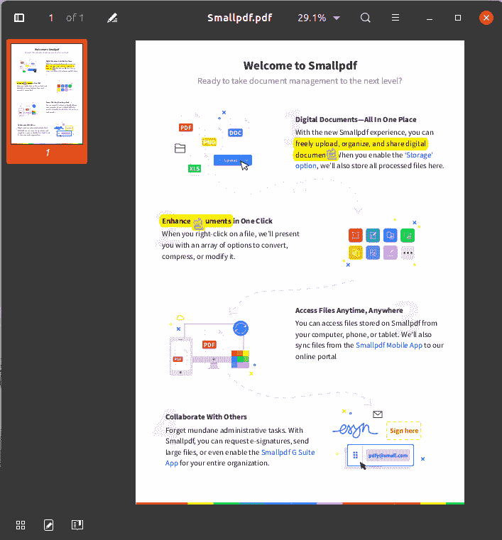

# PdfFileWriter Python 示例(20 个示例)

> 原文：<https://pythonguides.com/pdffilewriter-python-examples/>

[](https://sharepointsky.teachable.com/p/python-and-machine-learning-training-course)

在这个 [Python 教程](https://pythonguides.com/learn-python/)中，我们将讨论什么是 Python 中的 PyPDF2 以及 PdfFileMerger 的各种方法，还有 **PdfFileWriter Python 示例**。

我们将学习 **PdfFileWriter 类和方法**。PyPDF2 模块中的类被广泛用于**将 PDF 文件写入 Python** 中的一个文件。我们将检查以下示例:

1.  如何在 Python 中添加 PDF 格式的附件
2.  如何在 Python 中添加空白页
3.  在 Python 中向 PDF 添加书签
4.  如何在 Python 中给 PDF 文件添加 JavaScript
5.  如何在 Python 中添加 PDF 文件的链接
6.  使用 PyPDF2 在 Python 中向 PDF 文件添加元数据
7.  如何在 Python 中向 PDF 文件添加页面
8.  使用 PyPDF2 在 Python 中为 PDF 文件添加加密
9.  使用 Python 中的 PyPDF2 获取页数
10.  如何用 Python 从 PDF 文件中获取带页码的页面
11.  用 Python 获取 PDF 文件的页面布局
12.  在 Python 中获取 PDF 文件的页面模式
13.  在 Python 中向 PDF 文件插入空白页
14.  用 Python 将页面插入 PDF 文件
15.  在 Python 中从 PDF 中移除图像
16.  使用 PyPDF2 移除 Python 中 PDF 的链接
17.  使用 PyPDF2 在 Python 中设置 PDF 的页面布局
18.  在 Python 中设置 PDF 的页面模式
19.  使用 Python 中的 PyPDF2 更新交互式 PDF 的页面表单字段值
20.  用 Python 写 PDF

目录

[](#)

*   [PyPDF2 Python 库](#PyPDF2_Python_Library "PyPDF2 Python Library")
*   [在 python 中安装 pypdf 2](#Install_PyPDF2_in_python "Install PyPDF2 in python")
*   [Python 中的 PdfFileWriter](#PdfFileWriter_in_Python "PdfFileWriter in Python")
*   [PdfFileWriter Python 示例](#PdfFileWriter_Python_Examples "PdfFileWriter Python Examples")
    *   [1。使用 Python 中的 PyPDF2 在 PDF 文件中添加附件](#1_Add_Attachment_in_PDF_file_using_PyPDF2_in_Python "1\. Add Attachment in PDF file using PyPDF2 in Python")
    *   [2。在 Python 中为 PDF 文件添加空白页](#2_Add_Blank_Page_to_PDF_file_in_Python "2\. Add Blank Page to PDF file in Python")
    *   [3。使用 PyPDF2](#3_Add_Bookmark_to_PDF_file_in_Python_using_PyPDF2 "3\. Add Bookmark to PDF file in Python using PyPDF2") 在 Python 中为 PDF 文件添加书签
    *   [4。使用 Python 中的 PyPDF2 将 JavaScript 添加到 PDF 文件中](#4_Add_JavaScript_to_PDF_file_using_PyPDF2_in_Python "4\. Add JavaScript to PDF file using PyPDF2 in Python")
    *   [5。如何使用 pypdf F2](#5_How_to_Add_Link_to_PDF_in_Python_using_PYPDF2 "5\. How to Add Link to PDF in Python using PYPDF2")在 Python 中添加到 PDF 的链接
    *   [6。如何使用 PyPDF2](#6_How_to_Add_Metadata_to_PDF_file_in_Python_using_PyPDF2 "6\. How to Add Metadata to PDF file in Python using PyPDF2") 在 Python 中给 PDF 文件添加元数据
    *   7 .[。使用 PyPDF2](#7_Add_Pages_to_PDF_file_in_Python_using_PyPDF2 "7\. Add Pages to PDF file in Python using PyPDF2") 在 Python 中向 PDF 文件添加页面
    *   [8。使用 PyPDF2](#8_Add_Encryption_to_PDF_file_in_Python_using_PyPDF2 "8\. Add Encryption to PDF file in Python using PyPDF2") 在 Python 中为 PDF 文件添加加密
    *   [9。如何在 Python 中获取 PDF 文件的页数](#9_How_to_Get_Number_of_Pages_of_PDF_file_in_Python "9\. How to Get Number of Pages of PDF file in Python")
    *   10。用 Python 获取带有 PDF 文件页码的页面
    *   [11。用 Python 获取 PDF 文件的页面布局](#11_Get_Page_Layout_of_PDF_file_in_Python "11\. Get Page Layout of PDF file in Python")
    *   [12。使用 Python 中的 PyPDF2 获取 PDF 的页面模式](#12_Get_Page_Mode_of_PDF_using_PyPDF2_in_Python "12\. Get Page Mode of PDF using PyPDF2 in Python")
    *   13。如何在 Python 中插入空白页
    *   [14。使用 PyPDF2](#14_Insert_Page_to_PDF_file_in_Python_using_PyPDF2 "14\. Insert Page to PDF file in Python using PyPDF2") 在 Python 中将页面插入 PDF 文件
    *   15。使用 PyPDF2 从 Python 的 PDF 中移除图像
    *   16。使用 PyPDF2 删除 Python 中 PDF 的链接
    *   [17。在 Python 中设置 PDF 的页面布局](#17_Set_Page_Layout_of_PDF_in_Python "17\. Set Page Layout of PDF in Python")
    *   18。使用 Python 中的 PyPDF2 设置 PDF 的页面模式
    *   [19。使用 Python 中的 PyPDF2 更新交互式 PDF 的页面表单字段值](#19_Update_Page_Form_Field_Values_of_Interactive_PDF_using_PyPDF2_in_Python "19\. Update Page  Form Field Values of Interactive PDF using PyPDF2 in Python")
    *   20。用 Python 中的 PyPDF2 写一个 PDF

## PyPDF2 Python 库

*   Python 被用于各种各样的目的&用各种活动的库和类来装饰。出于这些目的，其中一个是用 Python 从 PDF 中读取文本。
*   `PyPDF2` 提供了帮助我们**读取**、**合并**、**编写**pdf 文件的类。
    *   `PdfFileReader` 用于执行与读取文件相关的所有操作。
    *   **pdf 文件合并器**用于将多个 pdf 文件合并在一起。
    *   `PdfFileWriter` 用于对 pdf 执行写操作。
*   所有的类都有不同的方法，方便程序员控制和执行 pdf 上的任何操作。
*   PyPDF2 在 Python3.5 之后已经停止接收任何更新，但仍用于控制 PDF。在本教程中，我们将涵盖关于 `PdfFileMerger` 类&的一切，我们将告诉你所有的函数都贬值或损坏了什么。

阅读: [PdfFileReader Python 示例](https://pythonguides.com/pdffilereader-python-example/)

## 在 python 中安装 pypdf 2

要在 Python 中使用 PyPDF2 库，我们需要首先安装 PyPDF2。按照以下代码在您的系统中安装 **PyPDF2 模块**。

```py
pip install PyPDF2
```

阅读完本教程后，您将对 PdfFileMerger 类中的每个函数有完整的了解。此外，我们将演示 PdfFileMerger 类中每个函数的例子。

阅读:[用 Python 创建和修改 PDF 文件](https://pythonguides.com/create-and-modify-pdf-file-in-python/)

## Python 中的 PdfFileWriter

*   这个类支持写出 PDF 文件，给定由另一个类(通常是 PdfFileReader)产生的页面。
*   它提供了各种帮助我们编写 PDF 的功能
*   使用这个类的第一步是导入 `PyPDF` 模块。

```py
import PyPDF
```

*   下一步是初始化该类

```py
PyPDF2.PdfFileWriter()
```

像其他类一样，PdfFileWriter 也有一些函数可以帮助程序员在他的程序中添加各种功能。接下来，让我们了解一下可用的功能。

阅读: [PdfFileMerger Python 示例](https://pythonguides.com/pdffilemerger-python-examples/)。

## PdfFileWriter Python 示例

在这一节中，我们将介绍 **PyPDF2 中所有可用的方法。Python 中的 PdfFileWriter** 类。我们将用一个例子来解释一切。

请注意 PyPDF2 模块在 python3.5 之后没有更新，所以可能有一些函数被破坏和不起作用。我们使用的是 Python3.8，所以我们会在这里留一个说明。

### 1。使用 Python 中的 PyPDF2 在 PDF 文件中添加附件

PyPDF2 提供了一个方法 **addAttachment(fname，fdata)** ，使用该方法可以在 Python 中的 PDF 中添加附件。

*   此功能用于在 PDF 文件中嵌入附件。一边用 Python 写 PDF。如果您想添加任何附件，如图像、视频、giff 等，您可以使用此功能插入。
*   它有两个参数，文件名和文件数据
*   参数:
    *   `fname` (str):为文件提供一个名称
    *   `fdata` (str):提供您想要嵌入的数据

### 2。在 Python 中为 PDF 文件添加空白页

PyPDF2 提供了一个方法 **addBlankPage(width=None，height=None)** 允许在 Python 中的 PDF 中添加空白页。

*   将空白页附加到 PDF 文件并返回它。如果未指定页面大小，则使用最后一页的大小。
*   如果没有为最后一页指定页面大小，则会引发异常``PageSizeNotDefinedError`.`
*   参数:
    *   `width`(float)–新页面的宽度，以默认用户空间单位表示。
    *   `height`(float)–新页面的高度，以默认用户空间单位表示。
*   下面是在 Python 中使用 PyPDF2 的例子 `addBlankPage()` 。

**代码片段:**

在这段代码中，我们创建了一个名为“BlankPdf.pdf”的 PDF 文件，并添加了 2 个不同宽度和高度的空白页。

```py
from PyPDF2 import PdfFileWriter

file = PdfFileWriter()

file.addBlankPage(
    width= 200,
    height= 200
)
file.addBlankPage(
    width=100,
    height=500
)

output = open('blankPdf.pdf', 'wb')
file.write(output) 
```

**输出:**

在这个输出中，我们使用 Python 中的 PyPDF 展示了对 `addBlankPage()` 方法的实现。


addBlankPage method implementation

在第二张图中，你可以注意到有两个空白页&两个都有不同的高度和宽度。


Add Blank Page using PyPDF2 in Python

这就是我们如何使用 PyPDF2 库在 Python 中向 pdf 文件添加空白页。

### 3。使用 PyPDF2 在 Python 中为 PDF 文件添加书签

Python 中的 PyPDF2 提供了一个方法 `addBookMark()` ，该方法允许在 Python 中的 PDF 文档中添加书签。

```py
addBookmark(
            title, 
            pagenum, 
            parent=None, 
            color=None, 
            bold=False, 
            italic=False, 
            fit='/Fit', 
            *args
    )
```

*   这个函数在 Python 中向 PDF 文件添加书签。使用书签在 PDF 页面中导航变得很容易。
*   参数:
    *   **标题**(str)–用于该书签的标题。
    *   `pagenum`(int)–该书签将指向的页码。
    *   `parent`–对父书签的引用，用于创建嵌套书签。
    *   `Color`(tuple)–书签的颜色，为从 0.0 到 1.0 的红、绿、蓝元组
    *   **粗体**(布尔值)–书签为粗体
    *   **斜体**(布尔值)–书签为斜体
    *   `fit`(str)–目标页面的适合度。
*   下面是一个关于 `addBookmark()` 方法的例子。

**代码片段:**

在这段代码中，我们使用 PdfFileReader 读取 python 中的 PDF 文件，然后使用 PyPDF2 模块使用 PdfFileWriter 添加一本书并在 Python 中编写新的 PDF 文件。

```py
from PyPDF2 import PdfFileWriter, PdfFileReader

writer = PdfFileWriter() 
reader = PdfFileReader(open('Grades.pdf', 'rb')) 
writer.addPage(reader.getPage(0)) 
writer.addBookmark(
    title='Grade-1998',
    pagenum=0,
    parent=None,
    color= None,
    bold=True,
    italic=False,
    fit='/Fit',
)
output = open('NewGrades.pdf','wb') 
writer.write(output) 
output.close() 
```

**输出:**

在这个输出中，我们用 Python 打开了新创建的 PDF 文件。你可以看到书签出现在左边。


Add Bookmark to PDF using PyPDF2 in Python

这就是如何在 Python 中使用 pypdf 2**将书签添加到 PDF 中。**

### 4。使用 Python 中的 PyPDF2 将 JavaScript 添加到 PDF 文件中

PyPDF2 提供了一个方法 `addJS(javascript)` ，使用该方法可以将 javascript 添加到 Python 中的 PDF 文件中。

*   此函数添加 JavaScript，它将在打开 PDF 时启动。
*   它主要用于创建交互式 pdf。
*   参数:
    *   `javascript`(str)–任何 JavaScript

### 5。如何使用 pypdf F2在 Python 中添加到 PDF 的链接

Python 中的 PyPDF2 提供了方法 **addLink(pagenum，pagedest，rect，border=None，fit='/Fit '，*args)** 使用该方法可以将内部链接添加到 Python 中的 PDF 页面。

*   这个函数添加一个从矩形区域到指定页面的内部链接。
*   参数:
    *   `pagenum`(int)–放置链接的页面的索引。
    *   `page dest`(int)–链接应该到达的页面的索引。
    *   `rect`–rectangle object 或四个整数的数组，指定可点击的矩形区域[xLL，yLL，xUR，yUR]，或“[ xLL yLL xUR yUR ]”形式的字符串。
    *   `border`–如果提供，描述边框绘制属性的数组。详情请见 PDF 规范。如果省略该参数，将不会绘制边框。
    *   **适合**(str)–页面适合或“缩放”选项(见下文)。可能需要提供其他参数。传递 None 将被读取为该坐标的空值。

可用的缩放选项如下:

| 缩放参数 | 描述 |
| --- | --- |
| /适合 | 没有其他参数 |
| /XYZ | [左][上] [zoomFactor] |
| /FitH | [顶部] |
| /FitV | [左] |
| /FitR | [左][下][右][上] |
| /FitB | 没有其他参数 |
| /FitBH | [顶部] |
| /FitBV | [左] |

下面是 PyPDF2 的 addLink()方法在 Python 中的实现

**代码片段:**

在这段代码中，我们使用 PyPDF2 中的 PdfFileReader 读取了 PDF 文件，然后使用该 PDF 文件添加了链接，并使用 PyPDF2 中的 PDFFileWriter 创建了 NewGrades.pdf。

```py
from PyPDF2 import PdfFileWriter, PdfFileReader
from PyPDF2.generic import RectangleObject

writer = PdfFileWriter() 
reader = PdfFileReader(open('Grades.pdf', 'rb')) 
linkfrom = writer.addPage(reader.getPage(0))
linkto = writer.addPage(reader.getPage(2))

writer.addLink(
     pagenum=0, 
     pagedest=1, 
     rect=RectangleObject([0,20,100,120]),
     border='dott',
     fit='/Fit'
 )
output = open('NewGrades.pdf','wb') 
writer.write(output) 
output.close() 
```

**输出:**

下面是使用 PyPDF2 在 Python 中实现上述代码的输出。在这段代码中，我们正在阅读 Grades.pdf，并创建了有链接的 NewGrades.pdf。


Add Link to PDF using PYPDF2 in Python

第二张图显示了在 PDF 中创建的总页数，第 1 页上添加了一个链接，如果单击该链接，用户将直接进入第 3 页。


Add Link to PDF using PYPDF2 in Python

这就是**如何在 Python** 中使用 PYPDF2 添加到 PDF 的链接。

### 6。如何使用 PyPDF2 在 Python 中给 PDF 文件添加元数据

PyPDF2 提供了方法 `addMetadata(infos)` ，使用该方法可以将元数据添加到 Python 中的 PDF 文件。

*   该函数将自定义元数据添加到输出中。
*   参数:
    *   `infos`(dict)——一个 Python 字典，其中每个键是一个字段，每个值是新的元数据。
*   下面是 Python 中使用 PyPDF 的 `addMetadata()` 方法的例子。

**代码片段:**

```py
from PyPDF2 import PdfFileWriter, PdfFileReader
from PyPDF2.generic import RectangleObject

writer = PdfFileWriter() 
reader = PdfFileReader(open('Grades.pdf', 'rb')) 
writer.addPage(reader.getPage(0))
writer.addPage(reader.getPage(1))
writer.addPage(reader.getPage(2))

writer.addLink(
     pagenum=1,  # page on which link will be placed
     pagedest=2,  # page to which link will go 
     rect=RectangleObject([0,20,100,120]),
     border='dott',
     fit='/Fit'
 )

metadata = {
    '/Title': 'Richard\'s Grade',
    '/Subject': 'Richard\'s updated performance report',
    '/Author': 'PythonGuides'
}

writer.addMetadata(metadata) 
output = open('NewGrades.pdf','wb') 
writer.write(output) 
output.close() 
```

**输出:**

在此输出中，第一个图像显示了没有元数据的 PDF 文档属性。


Add Metadata to pdf file using PyPDF2 in Python

在第二个输出图片中，PDF 文档属性与元数据一起显示


Add Metadata to pdf file in Python

这是如何在 Python 中使用 PyPDF2 向 PDF 文件添加元数据。

### 7。使用 PyPDF2 在 Python 中向 PDF 文件添加页面

Python 中的 PyPDF2 提供了方法 `addPage(page)` ，该方法可用于在 Python 中的 PDF 文档中添加页面。

*   此功能向 PDF 文件添加页面。该页通常是从 PdfFileReader 实例中获取的。
*   参数:page(page object)-要添加到文档中的页面。应为 PageObject 的实例。

### 8。使用 PyPDF2 在 Python 中为 PDF 文件添加加密

Python 中的 PyPDF2 提供了方法 **encrypt(user_pwd，owner_pwd=None，use_128bit=True)** ，使用该方法可以将加密添加到 Python 中的 PDF 文件中。

*   使用 PDF 标准加密处理程序加密 PDF 文件。使用这个函数可以保护 Python 中的 PDF。
*   参数:
    *   `user _ pwd`(str)—“用户密码”，允许在规定的限制下打开和阅读 PDF 文件。
    *   `owner _ pwd(`str)——“所有者密码”，允许不受任何限制地打开 PDF 文件。默认情况下，所有者密码与用户密码相同。
    *   `use _ 128 bit`(bool)–标志是否使用 128 位加密。如果为 false，将使用 40 位加密。默认情况下，此标志是打开的。
*   下面是 Python 中 PyPDF2 模块中 PdfFileWriter 上的 `encrypt()` 方法的例子。

**代码片段:**

在这段代码中，我们使用 Python 中的 PyPDF2 对 PDF 进行加密。

```py
from PyPDF2 import PdfFileWriter, PdfFileReader

writer = PdfFileWriter() 
reader = PdfFileReader(open('Grades.pdf', 'rb')) 
writer.addPage(reader.getPage(0))
writer.addPage(reader.getPage(1))
writer.addPage(reader.getPage(2))

# adding encryption
writer.encrypt(
    user_pwd='Test',
    owner_pwd='test',
    use_128bit=True
)

output = open('NewGrades.pdf','wb') 
writer.write(output) 
output.close() 
```

**输出:**

在这个输出中，PDF 被加密保护。PDF 上有一把锁，需要密码才能打开。


Add Encryption to PDF file in Python


Add Encryption to PDF file in Python using PyPDF2

这就是我们如何使用 PyPDF2 库在 Python 中用**密码保护 PDF 文件。**

### 9。如何在 Python 中获取 PDF 文件的页数

PyPDF2 提供了一个方法 `getNumPages()` ，使用该方法可以在 Python 中显示页面总数。

下面是 Python 中使用 PyPDF2 的 getNumPages()方法的示例。

**代码片段:**

下面是在 Python 中使用 PyPDF2 显示 PDF 页数的代码。

```py
from PyPDF2 import PdfFileWriter, PdfFileReader

writer = PdfFileWriter() 
reader = PdfFileReader(open('Grades.pdf', 'rb')) 
writer.addPage(reader.getPage(0))
writer.addPage(reader.getPage(1))
writer.addPage(reader.getPage(2))

print(writer.getNumPages())
```

**输出:**

在这个输出中，我们在 PyPDF2 的第 6、7、8 行使用 `PdfFileWriter()` 读取了 3 个页面，当我们应用 `getNumPages()` 方法时，终端上显示了 3 个页面。


Get Number of Pages using PyPDF2 in Python

这就是如何在 Python 中使用 pypdf 2**获得页数。**

### 10。用 Python 获取带有 PDF 文件页码的页面

Python 中的 PyPDF2 提供了一个方法 `getPage(pageNumber)` ，使用该方法可以从特定的页码中检索信息。

*   用 Python 从 PDF 文件中按编号检索页面。它在页码给定的索引处返回页面
*   参数:
    *   `page number`(int)–要检索的页码(页面从零开始)
*   下面是 Python 中使用 PyPDF2 的 getPage()方法的例子。

**代码片段:**

```py
from PyPDF2 import PdfFileWriter, PdfFileReader

writer = PdfFileWriter() 
reader = PdfFileReader(open('Grades.pdf', 'rb')) 
writer.addPage(reader.getPage(0))
writer.addPage(reader.getPage(1))
writer.addPage(reader.getPage(2))

print(writer.getPage(1)) 
```

**输出:**

在该输出中，第 1 页的信息显示在终端中。要查看人类可读格式的信息，请使用 Python 中 PyPDF2 的 `extractText()` 方法。


Get Page with Page Number using PyPDF2 in Python

在 Python 中，这是如何在 Python 中使用 pypdf 2**获取带有页码的页面。**

### 11。用 Python 获取 PDF 文件的页面布局

Python 中的 PDF2 提供了 `getPageLayout()` ，它返回 Python 中 PDF 的当前页面布局。它返回 Python 中 PDF 文档当前使用的页面布局

下面是 Python 中使用 PyPDF2 的 `getPageLayout()` 方法中可用布局的列表

| 布局 | 说明 |
| --- | --- |
| /NoLayout | 未明确指定布局 |
| /单页 | 一次显示一页 |
| 一栏 | 一次显示一列 |
| /TwoColumnLeft | 以两栏显示页面，奇数页在左边 |
| /TwoColumnRight | 以两栏显示页面，奇数页在右边 |
| /TwoPageLeft | 一次显示两页，奇数页在左边 |
| /TwoPageRight | 一次显示两页，奇数页在右边 |

下面是 Python 中使用 PyPDF2 的 `getPageLayout()` 方法的例子。

**代码片段**:

在这段代码中，我们使用 PyPDF2 中的 `getPageLayout()` 方法显示 PDF 的页面布局。

```py
from PyPDF2 import PdfFileWriter, PdfFileReader

writer = PdfFileWriter() 
reader = PdfFileReader(open('Grades.pdf', 'rb')) 
writer.addPage(reader.getPage(0))
writer.addPage(reader.getPage(1))
writer.addPage(reader.getPage(2))

print(writer.getPageLayout()) 
```

**输出:**

在该输出中， `None` 显示在终端上。这意味着 Python 中没有为这个 PDF 设置页面布局。


Get Page Layout using PDF2 in Python

上面的代码我们可以用来**在 Python** 中使用 PDF2 获得页面布局。

### 12。使用 Python 中的 PyPDF2 获取 PDF 的页面模式

PyPDF2 提供了一个方法 `getPageMode()` ，该方法返回 Python 中 PDF 文档使用的当前模式。

下面是 Python 中 PyPDF2 的 getPageMode()方法中的有效模式列表。

| 模式 | 说明 |
| --- | --- |
| /UseNone | 不显示轮廓或缩略图面板 |
| /使用大纲 | 显示轮廓(又名书签)面板 |
| /使用拇指 | 显示页面缩略图面板 |
| /全屏 | 全屏视图 |
| /UseOC | 显示可选内容组(OCG)面板 |
| /use 附件 | 显示附件面板 |

### 13。如何在 Python 中插入空白页

PyPDF2 提供了一个方法 **insertBlankPage(width=None，height=None，index=0)** ，使用该方法可以在 Python 中的 PDF 文档中插入空白页。

*   将空白页插入此 PDF 文件并返回。如果没有指定页面大小，则使用最后一页的大小。
*   如果没有前一页，则引发异常: **`Raises PageSizeNotDefinedError`**
*   参数:
    *   `width`(float)–新页面的宽度，以默认用户空间单位表示。
    *   `height`(float)–新页面的高度，以默认用户空间单位表示。
    *   `index`(int)–添加页面的位置。
*   下面是 Python 中使用 PyPDF2 的 `insertBlankPage()` 方法的例子。

**代码片段:**

```py
from PyPDF2 import PdfFileWriter, PdfFileReader

writer = PdfFileWriter() 
reader = PdfFileReader(open('Grades.pdf', 'rb')) 
writer.addPage(reader.getPage(0))
writer.addPage(reader.getPage(1))
writer.addPage(reader.getPage(2))

writer.addBlankPage()
writer.addBlankPage()

output = open('NewGrades.pdf','wb') 
writer.write(output) 
output.close() 
```

**输出:**

在这个输出中，首先我们显示了没有空白页的 PDF。


Insert Blank Page using PyPDF2 in Python

在这个输出中，您可以看到我们运行这个程序后的结果。您可以看到 Python 中的 PDF 中添加了两个空白页。


Insert Blank Page using PyPDF2 in Python

这就是如何在 Python 中使用 pypdf 2**插入空白页。**

### 14。使用 PyPDF2 在 Python 中将页面插入 PDF 文件

PyPDF2 提供了一个方法 **insertPage(page，index=0)** ，使用该方法可以在 Python 中的 PDF 文档中插入新页面。

*   用 Python 在 PDF 文件中插入页面。该页通常是从 PdfFileReader 实例中获取的。
*   参数:
    *   **页面**(page object)–要添加到文档中的页面。此参数应该是 PageObject 的一个实例。
    *   `index`(int)–页面将被插入的位置。

### 15。使用 PyPDF2 从 Python 的 PDF 中移除图像

Python 中的 PyPDF 提供了`remove images(ignoreByteStringObject = False)`方法，该方法允许从 Python 中的 PDF 文件中删除图像。

*   从 Python 的输出中移除图像。
*   参数:
    *   `ignoreByteStringObject`(bool)–忽略字节字符串的可选参数
*   下面是 Python 中使用 PyPDF2 的 `removeimage()` 方法的例子。

**代码片段:**

在这段代码中，我们将使用 PyPDF2 中的 `removeImages()` 方法从 Python 中的 PDF 中删除图像。

```py
from PyPDF2 import PdfFileWriter, PdfFileReader

writer = PdfFileWriter() 
newreader = PdfFileReader(open('Smallpdf.pdf', 'rb'))

writer.addPage(newreader.getPage(0))
writer.removeImages(ignoreByteStringObject=False) 

output = open('Digital.pdf','wb') 
writer.write(output) 
output.close() 
```

**输出:**

这是我们在这个例子中使用的 PDF，在下一个图像中，您将看到使用 Python 中的 PyPDF2 移除了所有图像的相同 PDF。



Remove Images from PDF using PyPDF2 in Python

第二个图像是程序执行时的图像。第一张图片也是如此，你会发现这张图片缺少一些图片。这样我们就可以用 Python 中的 PyPDF2 从 PDF 中移除图像。


Remove Images from PDF file in Python

这就是我们如何使用 Python 中的 PyPDF2 从 PDF 文件中移除图像。

### 16。使用 PyPDF2 删除 Python 中 PDF 的链接

PyPDF2 提供了一个方法 `removeLinks()` ，它允许从 Python 中的 PDF 文件中删除链接。它从 Python 的输出 PDF 中移除链接和注释。

下面是 Python 中使用 PyPDF2 的 `removeLinks()` 模块的例子。

**代码片段:**

在这段代码中，我们使用 Python 中的 PyPDF2 删除了 PDF 中的所有链接。请注意，链接文本的颜色将保持不变，但它将不再有页面或网页的地址。

```py
from PyPDF2 import PdfFileWriter, PdfFileReader

writer = PdfFileWriter() 
newreader = PdfFileReader(open('Smallpdf.pdf', 'rb'))
writer.addPage(newreader.getPage(0))
writer.removeLinks()

output = open('Digital.pdf','wb') 
writer.write(output) 
output.close() 
```

**输出:**

这是我们正在使用的 PDF，所有圈出的单词都是超链接。使用 `removeLinks()` 方法我们将从文档中移除所有链接。


Remove Links from PDF using PyPDF2 in Python

在此图片中，您标记的文本不再是链接。文本颜色保持不变，但是使用 PyPDF2 中的 `removeLinks()` 方法移除了超链接。


Remove Links from PDF using PyPDF2 in Python

这就是我们如何使用 Python 中的 PyPDF2 从 PDF 文件中移除链接。

### 17。在 Python 中设置 PDF 的页面布局

Python 中的 PyPDF2 提供了一个方法 `setPageLayout(layout)` ，使用该方法可以将页面布局分配给 Python 中的 PDF。

*   设置页面布局
*   就像使用 `getPageLayout()` 方法一样，我们可以查看页面布局。同样，使用此方法，我们可以分配页面布局。
*   以下是可以应用的布局列表

| 布局 | 说明 |
| --- | --- |
| /NoLayout | 未明确指定布局 |
| /单页 | 一次显示一页 |
| 一栏 | 一次显示一列 |
| /TwoColumnLeft | 以两栏显示页面，奇数页在左边 |
| /TwoColumnRight | 以两栏显示页面，奇数页在右边 |
| /TwoPageLeft | 一次显示两页，奇数页在左边 |
| /TwoPageRight | 一次显示两页，奇数页在右边 |

下面是 Python 中使用 PyPDF2 的 `setPageLayout()` 方法的例子。

**代码片段:**

```py
from PyPDF2 import PdfFileWriter, PdfFileReader

writer = PdfFileWriter() 
reader = PdfFileReader(open('Grades.pdf', 'rb')) 
writer.addPage(reader.getPage(0))
writer.addPage(reader.getPage(1))
writer.addPage(reader.getPage(2))

writer.setPageLayout('/TwoColumnRight')

output = open('NewGrades.pdf','wb') 
writer.write(output) 
output.close() 
```

**输出:**


Set Page Layout of PDF using PyPDF2 in Python

这就是如何在 Python 中使用 pypdf 2**设置 PDF 的页面布局。**

### 18。使用 Python 中的 PyPDF2 设置 PDF 的页面模式

PyPDF2 提供了一个方法 `setPageMode(mode)` ，使用该方法可以设置页面模式。

以下是可用的有效模式列表:

| 模式 | 说明 |
| --- | --- |
| /UseNone | 不显示轮廓或缩略图面板 |
| /使用大纲 | 显示轮廓(又名书签)面板 |
| /使用拇指 | 显示页面缩略图面板 |
| /全屏 | 全屏视图 |
| /UseOC | 显示可选内容组(OCG)面板 |
| /use 附件 | 显示附件面板 |

**代码片段:**

在这段代码中，我们使用 Python 中的 PyPDF2 模块将页面模式设置为全屏。

```py
from PyPDF2 import PdfFileWriter, PdfFileReader

writer = PdfFileWriter() 
reader = PdfFileReader(open('Grades.pdf', 'rb')) 
writer.addPage(reader.getPage(0))
writer.addPage(reader.getPage(1))
writer.addPage(reader.getPage(2))

writer.setPageMode('/FullScreen')

output = open('NewGrades.pdf','wb') 
writer.write(output) 
output.close() 
```

**输出:**

在此输出中，我们将页面模式设置为全屏，现在每次打开 PDF 时，它都会以全屏方式打开。

### 19。使用 Python 中的 PyPDF2 更新交互式 PDF 的页面表单字段值

PyPDF2 提供了方法**updatePageFormFieldValues(page，fields)** ，使用该方法可以更新 PDF 表单字段。

*   从字段字典中更新给定页面的表单字段值。将字段文本和值从字段复制到页面。
*   此方法可用于交互式 PDF。交互式 pdf 允许用户提供他们的输入。
*   参数:
    *   **页面**–来自 PDF writer 的页面参考，注释和字段数据将在此更新。
    *   **字段**–包含字段名称(/T)和文本值(/V)的 Python 字典

### 20。用 Python 中的 PyPDF2 写一个 PDF

PyPDF2 提供了一个方法 `write(stream)` ，使用它可以用 Python 编写 PDF。

*   将添加到此对象的页面集合作为 PDF 文件写出。
*   参数:
    *   `stream`–文件写入的对象。该对象必须支持 write 方法和 tell 方法，类似于 file 对象。
*   如果你正在阅读本教程，那么你一定知道 write()方法是做什么的。因此，无论我们执行什么操作，如果我们想用这些设置和功能创建一个新的 PDF，我们都要使用 PyPDF2 中的 write()方法。

您可能会喜欢以下 Python pdf 教程:

*   [用 Python 创建和修改 PDF 文件](https://pythonguides.com/create-and-modify-pdf-file-in-python/)

所以在本教程中，我们已经使用 Python 中的 PyPDF2 模块学习了关于 PdfFileWriter 及其方法的一切。此外，我们还介绍了 20 个 PdfFileWriter Python 示例:

*   如何在 Python 中添加 PDF 格式的附件
*   如何在 Python 中添加空白页
*   在 Python 中向 PDF 添加书签
*   如何在 Python 中给 PDF 文件添加 JavaScript
*   如何在 Python 中添加 PDF 文件的链接
*   使用 PyPDF2 在 Python 中向 PDF 文件添加元数据
*   如何在 Python 中向 PDF 文件添加页面
*   使用 PyPDF2 在 Python 中为 PDF 文件添加加密
*   使用 Python 中的 PyPDF2 获取页数
*   如何用 Python 从 PDF 文件中获取带页码的页面
*   用 Python 获取 PDF 文件的页面布局
*   在 Python 中获取 PDF 文件的页面模式
*   在 Python 中向 PDF 文件插入空白页
*   用 Python 将页面插入 PDF 文件
*   在 Python 中从 PDF 中移除图像
*   使用 PyPDF2 移除 Python 中 PDF 的链接
*   使用 PyPDF2 在 Python 中设置 PDF 的页面布局
*   在 Python 中设置 PDF 的页面模式
*   使用 Python 中的 PyPDF2 更新交互式 PDF 的页面表单字段值
*   用 Python 写 PDF

[Bijay Kumar](https://pythonguides.com/author/fewlines4biju/)

Python 是美国最流行的语言之一。我从事 Python 工作已经有很长时间了，我在与 Tkinter、Pandas、NumPy、Turtle、Django、Matplotlib、Tensorflow、Scipy、Scikit-Learn 等各种库合作方面拥有专业知识。我有与美国、加拿大、英国、澳大利亚、新西兰等国家的各种客户合作的经验。查看我的个人资料。

[enjoysharepoint.com/](https://enjoysharepoint.com/)[](https://www.facebook.com/fewlines4biju "Facebook")[](https://www.linkedin.com/in/fewlines4biju/ "Linkedin")[](https://twitter.com/fewlines4biju "Twitter")