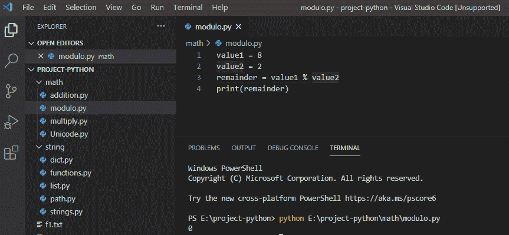
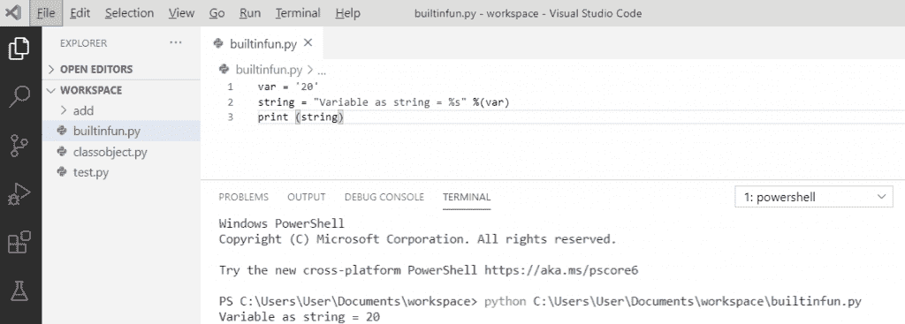
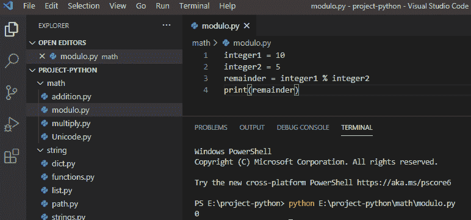
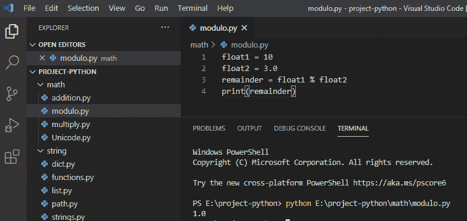
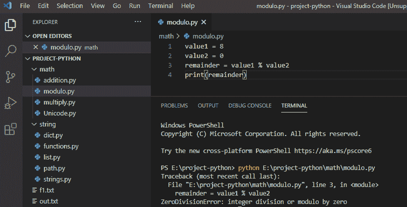
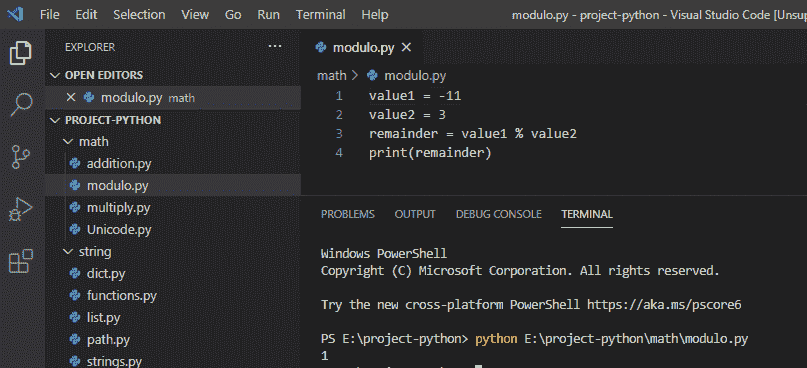

# python 中的百分号是什么意思

> 原文：<https://pythonguides.com/percent-sign-mean-in-python/>

[](https://sharepointsky.teachable.com/p/python-and-machine-learning-training-course)

在本 [Python 教程](https://pythonguides.com/python-download-and-installation/)中，我们将讨论**在 python** 中百分号是什么意思。我们还将检查一些示例:

*   python 中的百分号是什么意思
*   python 中的%s 是什么意思
*   Python 整数取模
*   带浮点的 Python 模
*   Python 零除法误差
*   Python 负数取模

目录

[](#)

*   [python 中的百分号是什么意思](#What_does_the_percent_sign_mean_in_python "What does the percent sign mean in python")
*   [python 中的%s 是什么意思](#What_does_s_mean_in_python "What does %s mean in python")
*   [Python 用整数取模](#Python_modulo_with_integers "Python modulo with integers")
*   [Python 模带浮点](#Python_modulo_with_float "Python modulo with float")
*   [Python 零除法误差](#Python_zero_division_error "Python zero division error")
*   [Python 负数取模](#Python_modulo_with_negative_numbers "Python modulo with negative numbers")

## python 中的百分号是什么意思

在 python 中，**百分号**被称为**模运算符“%”**，它返回左操作数除以右操作数后的余数。

**举例:**

```py
value1 = 8
value2 = 2
remainder = value1 % value2
print(remainder)
```

写完上面的代码(百分比符号在 python 中是什么意思)，你将打印出**“余数”**，然后输出将显示为**“0”**。这里，模运算符**“%”**返回两个数相除后的余数。

可以参考下面的截图**百分号在 python** 中是什么意思。



percentage symbol mean in python

## python 中的%s 是什么意思

**%s** 运算符允许您将值添加到 python 字符串中。%s 表示您想要将字符串值添加到字符串中，它也用于格式化字符串中的数字。

**举例:**

```py
var = '20'
string = "Variable as string = %s" %(var)
print(string)
```

写完上面的代码后(python 中%s 是什么意思)，你将打印出 `" string "` ，然后输出将显示为一个**"变量 as string = 20 "** 。这里， **" %s "** 用于添加字符串值，并将该值转换为字符串。

你可以参考下面的截图%s 在 python 中是什么意思



What does %s mean in python

*   Python 中的[函数](https://pythonguides.com/function-in-python/)
*   [Python 读取 CSV 文件并写入 CSV 文件](https://pythonguides.com/python-read-csv-file/)
*   [Python GUI 编程](https://pythonguides.com/python-gui-programming/)
*   [Python – stderr, stdin and stdout](https://pythonguides.com/python-stderr-stdin-and-stdout/)

## Python 用整数取模

在 python 中，当两个数都是整数时，那么余数也是整数值。

**举例:**

```py
integer1 = 10
integer2 = 5
remainder = integer1 % integer2
print(remainder)
```

写完上面的代码( **python 模整数**)，你将打印出**“余数”**，然后输出将显示为**“0”**。这里，模运算符`" "`返回整数 1 和整数 2 这两个数相除后的余数。

下面是截图 **python 模整数**



## Python 模带浮点

在 python 中，如果其中一个数是 float，那么输出的将是浮点数。

**举例:**

```py
float1 = 10
float2 = 3.0
remainder = float1 % float2
print(remainder)
```

写完上面的代码(python modulo with float)，你将打印出**“余数”**，然后输出将显示为**“1.0”**。这里，模运算符`" " "`返回 float1 和 float2 两个数相除后的余数。

你可以参考下面的截图 python 带浮点模



*   [名称错误:Python 中没有定义名称](https://pythonguides.com/nameerror-name-is-not-defined/)
*   [Python 检查变量是否为整数](https://pythonguides.com/python-check-if-the-variable-is-an-integer/)
*   [值错误:数学域错误](https://pythonguides.com/valueerror-math-domain-error/)
*   [检查一个数是否是素数 Python](https://pythonguides.com/check-if-a-number-is-a-prime-python/)

## Python 零除法误差

在 python 中，我们得到这个 `ZeroDivisionError` 如果除数是 0，那么模块操作符会抛出这个错误，因为我们不能除以 0。

**举例:**

```py
value1 = 8
value2 = 0
remainder = value1 % value2
print(remainder)
```

写完上面的代码(python 零除法错误)，你将打印出**“余数”**，然后输出将显示为**“零除法错误:整数除法或以零为模”**。在这里，模操作符**“%”**如果除以 0，就会抛出一个错误。

下面是截图 **python 零除错误**。



## Python 负数取模

在 python 中，模运算符总是给出与除数符号相同的余数。

**举例:**

```py
value1 = -11
value2 = 3
remainder = value1 % value2
print(remainder)
```

写完上面的代码(python 模负数)，你将打印出**“余数”**，然后输出将显示为**“1”**。这里，余数和除数符号相同，所以我的除数是正的，这就是为什么余数也是正的，反之亦然。

下面截图 **python 以负数为模**。



您可能会喜欢以下 Python 教程:

*   [Python 内置函数示例](https://pythonguides.com/python-built-in-functions/)
*   [获取当前目录 Python](https://pythonguides.com/get-current-directory-python/)
*   [语法错误返回外部函数 python](https://pythonguides.com/syntaxerror-return-outside-function-python/)
*   [从字符串 Python 中删除字符](https://pythonguides.com/remove-character-from-string-python/)
*   [在 Python 中创建一个空数组](https://pythonguides.com/create-an-empty-array-in-python/)
*   [python 中的无效语法](https://pythonguides.com/invalid-syntax-in-python/)
*   [语法错误标识符 python3 中的无效字符](https://pythonguides.com/syntaxerror-invalid-character-in-identifier-python3/)
*   [Python 加法示例](https://pythonguides.com/python-addition/)
*   [Python 创建空集](https://pythonguides.com/python-create-empty-set/)

在本教程中，我们通过各种例子学习了 python 中百分号的含义。

*   **python 中的百分号是什么意思**
*   python 中的%s 是什么意思
*   Python 整数取模
*   带浮点的 Python 模
*   Python 零除法误差
*   Python 负数取模

[Bijay Kumar](https://pythonguides.com/author/fewlines4biju/)

Python 是美国最流行的语言之一。我从事 Python 工作已经有很长时间了，我在与 Tkinter、Pandas、NumPy、Turtle、Django、Matplotlib、Tensorflow、Scipy、Scikit-Learn 等各种库合作方面拥有专业知识。我有与美国、加拿大、英国、澳大利亚、新西兰等国家的各种客户合作的经验。查看我的个人资料。

[enjoysharepoint.com/](https://enjoysharepoint.com/)[](https://www.facebook.com/fewlines4biju "Facebook")[](https://www.linkedin.com/in/fewlines4biju/ "Linkedin")[](https://twitter.com/fewlines4biju "Twitter")