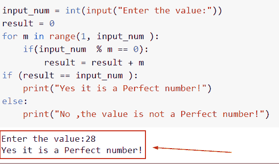
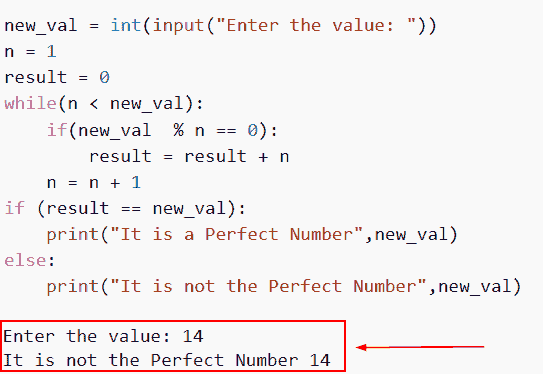
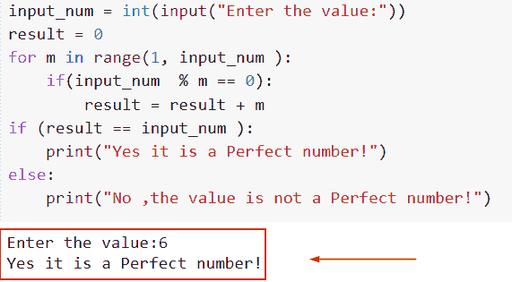
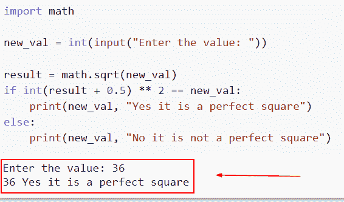
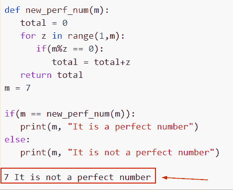
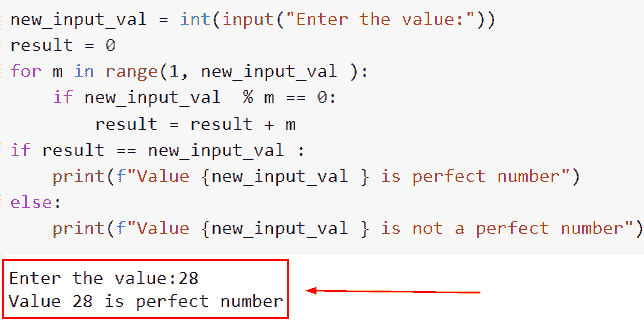
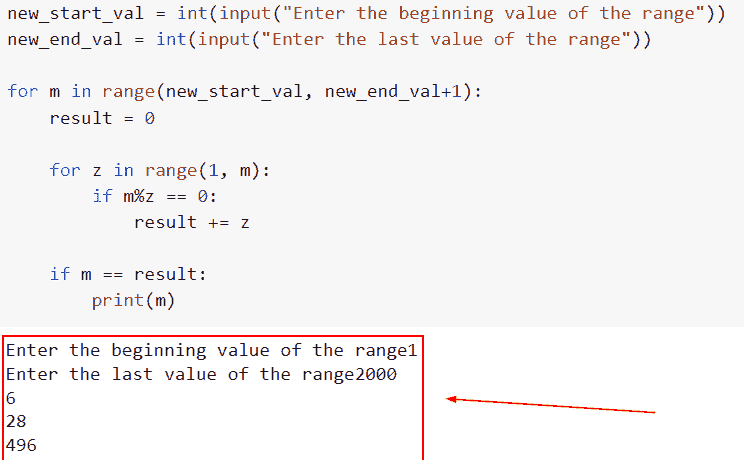
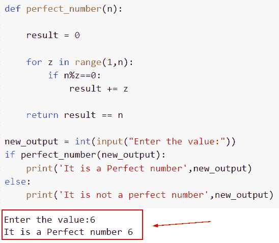

# 如何在 Python 中寻找完全数

> 原文：<https://pythonguides.com/perfect-number-in-python/>

[](https://sharepointsky.teachable.com/p/python-and-machine-learning-training-course)

你知道如何用 Python 处理一个完美的数字吗？本 [Python 教程](https://pythonguides.com/python-hello-world-program/)将讨论如何在 Python 中求完全数。此外，我们还将讨论以下主题。

*   如何在 Python 中寻找完全数
*   如何在 Python 中用 for 循环求完全数
*   如何使用 while 循环在 Python 中寻找完全数
*   如何用链表在 Python 中找到完全数
*   如何在 python 中求完美平方数
*   如何在 Python 中寻找完全数函数
*   如何找到完全数的 python 程序
*   如何找到 python 打印所有完全数
*   如何用递归在 Python 中求完全数

目录

[](#)

*   [Python 中的完全数](#Perfect_number_in_Python "Perfect number in Python")
*   [使用 while 循环的 Python 中的完全数](#Perfect_number_in_Python_using_while_loop "Perfect number in Python using while loop")
*   [使用 for 循环的 Python 中的完全数](#Perfect_number_in_Python_using_for_loop "Perfect number in Python using for loop")
*   [python 中的完美平方数](#perfect_square_number_in_python "perfect square number in python")
*   [Python 中的完全数函数](#Perfect_number_function_in_Python "Perfect number function in Python")
*   [Python 程序求完全数与否](#Python_program_for_perfect_numbers_or_not "Python program for perfect numbers or not")
*   [Python 打印所有完全数](#Python_prints_all_perfect_number "Python prints all perfect number")
*   [Python 中使用递归的完全数](#Perfect_number_in_Python_using_recursion "Perfect number in Python using recursion")

## Python 中的完全数

*   在 Python 中，任何一个数都可以是一个完全数，如果它的所有正约数，不包括这个数本身，加起来都是相同的值。
*   简单地说，如果一个数的约数之和等于该数，则认为该数是完美的。
*   首先，我们将使用一个整数获取输入，并将它们存储在一个变量中。我们现在将定义一个名为“result”的变量，在这里我们将存储指定数字的除数的总和。
*   下面的任务是创建一个 for 循环，在这个循环中，我们将把数字除以变量的初始值，然后增加 I 的值，并确定哪些数字的余数为零。
*   现在，使用变量“result”，我们将添加该数的约数。
*   最后，为了比较用户提供的数字和值，我们将利用决策语句关键字“if”
*   例如，在 Python 中，6 是一个完美的数字，因为它可以被 1、2、3 和 6 整除。所以，1+2+3 = 6(记住，我们要忽略数字本身。)是这些值的总和。

**举例**:

```py
input_num = int(input("Enter the value:"))
result = 0
for m in range(1, input_num ):
    if(input_num  % m == 0):
        result = result + m
if (result == input_num ):
    print("Yes it is a Perfect number!")
else:
    print("No ,the value is not a Perfect number!")
```

下面是以下代码的截图



Perfect number in Python

这就是我们如何在 Python 中得到完美数字的方法。

阅读:[如何在 Python 中反转一个数字](https://pythonguides.com/reverse-a-number-in-python/)

## 使用 while 循环的 Python 中的完全数

*   在这一节中，我们将讨论如何通过使用 Python 中的 while 循环来获得 Python 中的完美数字。
*   为了执行这个特定的任务，我们将使用 while 循环概念，在本例中，我们将使用输入用户并输入号码。接下来，我们将应用 while 循环来生成从 1 到 n 的数，其中 n 不包括在内，因为我们需要该数的真约数之和。
*   在指定的条件为假之前，将使用 Python 中的 while 循环重复一组语句。
*   在本例中，我们将在 n<new_val then="" n="="></new_val>

**举例**:

```py
new_val = int(input("Enter the value: "))
n = 1
result = 0
while(n < new_val):
    if(new_val  % n == 0):
        result = result + n
    n = n + 1
if (result == new_val):
    print("It is a Perfect Number",new_val)
else:
    print("It is not the Perfect Number",new_val)
```

下面是以下给定代码的实现



Perfect number in Python using while loop

在这个例子中，我们已经理解了如何使用 while 循环在 Python 中显示完美的数字。

阅读: [Python 字典追加](https://pythonguides.com/python-dictionary-append/)

## 使用 for 循环的 Python 中的完全数

*   在这里，我们将讨论如何通过使用 Python 中的 for-loop 方法，在 Python 中显示完全数。
*   Python 中的 for 循环通常用于迭代可以迭代的项目，例如列表、元组或字符串。
*   首先在这个例子中，我们将使用一个整数获取输入，并将它们存储在一个变量中。我们现在将定义一个名为“result”的变量，在这里我们将存储指定数字的除数的总和。

**举例**:

```py
input_num = int(input("Enter the value:"))
result = 0
for m in range(1, input_num ):
    if(input_num  % m == 0):
        result = result + m
if (result == input_num ):
    print("Yes it is a Perfect number!")
else:
    print("No ,the value is not a Perfect number!")
```

在下面给定的代码中，首先，我们将从用户处获取输入并设置条件(input_num % m == 0 ),如果相等，它将显示“是，这是一个完美的数字”。

下面是以下给定代码的实现。



Perfect number in Python using for loop

阅读: [Python 方块一号](https://pythonguides.com/python-square-a-number/)

## python 中的完美平方数

*   完美的正方形是任何可以被表示为两个相等的整数的乘积的数。例如，数字 36 是一个完美的正方形，因为它可以表示为 6*6。
*   Python 包含一个内置的 sqrt()函数，它返回一个数的平方根。它解释了如何计算一个值的平方根乘以它自己得到一个数。因为不能直接调用 sqrt()方法来获得给定数字的平方根，所以我们必须使用数学模块。
*   假设我们有 n，我们必须确定 n 是否是一个完美的平方。当一个数的平方根是一个整数时，它被认为是一个完美的平方数。

**举例**:

```py
import math

new_val = int(input("Enter the value: "))

result = math.sqrt(new_val)
if int(result + 0.5) ** 2 == new_val:
    print(new_val, "Yes it is a perfect square")
else:
    print(new_val, "No it is not a perfect square")
```

在上面的代码中，我们首先导入数学模块，然后输入用户。接下来，我们使用 math.sqrt()函数，在这个函数中，我们将“new_val”作为参数传递。

下面是以下给定代码的实现。



perfect square number in python

这就是我们如何通过使用 math.sqrt()函数在 Python 中创建一个完美的平方数。

阅读:[什么是 Python 字典](https://pythonguides.com/create-a-dictionary-in-python/)

## Python 中的完全数函数

*   一个完全数是一个正整数，不包括这个数本身，等于它的所有正整数因子的总和。以数字 6 为例。它的除数，不包括它自己，是 1，2 和 3。因此，它的约数之和，即 1+2+3，等于 6。
*   在 Python 中，可以用一个函数来判断一个数是否完美。称为函数的代码单元执行特定的任务。
*   这个完全数程序可以输入任何数字。在这个数字的帮助下，这些函数将确定这个数字是否是一个完美的数字。

**举例**:

```py
def new_perf_num(m): 
   total = 0
   for z in range(1,m): 
      if(m%z == 0):
         total = total+z
   return total 
m = 7

if(m == new_perf_num(m)): 
   print(m, "It is a perfect number") 
else: 
   print(m, "It is not a perfect number") 
```

下面是以下给定代码的执行。



perfect number function in Python

阅读: [Python 字典方法](https://pythonguides.com/python-dictionary-methods/)

## Python 程序求完全数与否

*   在本节中，我们将讨论如何在 Python 中检查数字是否完美。
*   下面的任务是创建一个 for 循环，在这个循环中，我们将把数字除以变量的初始值，然后增加 I 的值，并确定哪些数字的余数为零。
*   首先，我们必须要求用户输入一个整数，该整数将保存在输入数字字段中。接下来，声明一个名为“sum 变量”的变量，它将保存输入数的除数之和。
*   使用 for 循环，我们将确定输入的数字是否除以提供的数字，或者它是否导致零提醒。这些数将是我们的约数。现在，将每个除数添加到 sum 变量中。
*   最后一步使用决策语句将用户提供的数字与 sum 变量值进行比较。如果值相等，用户提供的数字将显示为一个完全数。

**举例**:

```py
new_input_val = int(input("Enter the value:"))
result = 0
for m in range(1, new_input_val ):
    if new_input_val  % m == 0:
        result = result + m
if result == new_input_val :
    print(f"Value {new_input_val } is perfect number")
else:
    print(f"Value {new_input_val } is not a perfect number")
```

下面是以下给定代码的实现



Python program for perfect numbers or not

这就是我们如何在 Python 中检查数字是否完美的方法。

阅读:[如何在 Python 中创建列表](https://pythonguides.com/create-list-in-python/)

## Python 打印所有完全数

*   这里我们将讨论如何用 Python 打印所有的完全数。
*   在这个例子中，我们必须打印最低数字和最高数字之间的所有完全数，但是在这个例子中，最高数字是无穷大，所以我们将声明一个数字 2000。
*   为了执行这个细节，我们需要使用 while 循环概念，在这个例子中，我们将使用输入用户并输入号码。接下来，我们将应用 for 循环来生成从 1 到 n 的数，其中 n 不包括在内，因为我们需要该数的真约数之和。

**举例**:

我们举个例子，看看如何用 Python 打印所有的完全数。

**源代码**:

```py
new_start_val = int(input("Enter the beginning value of the range"))
new_end_val = int(input("Enter the last value of the range"))

for m in range(new_start_val, new_end_val+1):
    result = 0

    for z in range(1, m):
        if m%z == 0:
            result += z

    if m == result:
        print(m)
```

你可以参考下面的截图。



Python prints all perfect number

正如你在截图中看到的，我们已经理解了如何用 Python 打印所有的完全数。

阅读:[在 Python 中创建一个空数组](https://pythonguides.com/create-an-empty-array-in-python/)

## Python 中使用递归的完全数

*   在这个例子中，我们将讨论如何通过使用递归方法在 Python 中获得完全数。
*   递归函数反复调用自己。它的功能类似于我们之前讨论的循环，尽管有些情况下递归优于循环。
*   基本情况和递归步骤是每个递归函数的两个部分。基本案例通常包含最小的输入和易于验证的解决方案。此方法还防止函数无限期地调用自身。

**举例**:

```py
def perfect_number(n):

    result = 0

    for z in range(1,n):
        if n%z==0:
            result += z

    return result == n

new_output = int(input("Enter the value:"))
if perfect_number(new_output):
    print('It is a Perfect number',new_output)
else:
    print('It is not a perfect number',new_output)
```

首先，我们将使用一个整数获取输入，并将它们存储在一个变量中。我们现在将定义一个名为“result”的变量，在这里我们将存储指定数字的除数的总和。

下面的任务是创建一个 for 循环，在这个循环中，我们将把数字除以变量的初始值，然后增加 I 的值，并确定哪些数字的余数为零。

因此，它将检查条件是否是一个完美的数字。

下面是以下给定代码的输出。



Perfect number in Python using recursion

您可能也喜欢阅读以下 Python 教程。

*   [删除 python 中的 Unicode 字符](https://pythonguides.com/remove-unicode-characters-in-python/)
*   [名称错误:Python 中没有定义名称](https://pythonguides.com/nameerror-name-is-not-defined/)
*   [检查一个数是否是素数 Python](https://pythonguides.com/check-if-a-number-is-a-prime-python/)
*   [Python 内置函数示例](https://pythonguides.com/python-built-in-functions/)

在本教程中，我们讨论了如何在 Python 中找到完美的数字。我们还讨论了以下主题。

*   如何在 Python 中寻找完全数
*   如何在 Python 中用 for 循环求完全数
*   如何使用 while 循环在 Python 中寻找完全数
*   如何用链表在 Python 中找到完全数
*   如何在 python 中求完美平方数
*   如何在 Python 中寻找完全数函数
*   如何找到完全数的 python 程序
*   如何找到 python 打印所有完全数
*   如何用递归在 Python 中求完全数

[Bijay Kumar](https://pythonguides.com/author/fewlines4biju/)

Python 是美国最流行的语言之一。我从事 Python 工作已经有很长时间了，我在与 Tkinter、Pandas、NumPy、Turtle、Django、Matplotlib、Tensorflow、Scipy、Scikit-Learn 等各种库合作方面拥有专业知识。我有与美国、加拿大、英国、澳大利亚、新西兰等国家的各种客户合作的经验。查看我的个人资料。

[enjoysharepoint.com/](https://enjoysharepoint.com/)[](https://www.facebook.com/fewlines4biju "Facebook")[](https://www.linkedin.com/in/fewlines4biju/ "Linkedin")[](https://twitter.com/fewlines4biju "Twitter")