# Python 程序打印图案(10 个例子)

> 原文：<https://pythonguides.com/print-pattern-in-python/>

[](https://sharepointsky.teachable.com/p/python-and-machine-learning-training-course)

在本 [python 教程中，](https://pythonguides.com/python-hello-world-program/)你将学习如何在 Python 中**打印图案，以及 **Python 程序打印图案**，我们还将检查 **:****

*   Python 程序打印数字模式
*   打印图案的 Python 程序 1 12 123
*   使用嵌套 for 循环打印模式的 Python 程序
*   Python 程序打印星形图案
*   打印图案的 Python 程序 1 22 333
*   Python 程序以逆序打印图案
*   Python 程序使用 while 循环打印模式
*   打印模式 A 的 Python 程序
*   Python 程序打印模式 G
*   Python 程序打印模式 a ab abc abcd abcde
*   Python 程序打印公元前 CDE DEFG 模式

目录

[](#)

*   [Python 程序打印数字模式](#Python_program_to_print_pattern_of_numbers "Python program to print pattern of numbers")
*   [Python 程序打印图案 1 12 123](#Python_program_to_print_pattern_1_12_123 "Python program to print pattern 1 12 123")
*   [Python 程序使用嵌套 for 循环打印图案](#Python_program_to_print_pattern_using_nested_for_loop "Python program to print pattern using nested for loop")
*   [Python 程序打印星星图案](#Python_program_to_print_pattern_of_stars "Python program to print pattern of stars")
*   [Python 程序打印图案 1 22 333](#Python_program_to_print_pattern_1_22_333 "Python program to print pattern 1 22 333")
*   [Python 程序以逆序打印数字模式](#Python_program_to_print_pattern_of_numbers_in_reverse_order "Python program to print pattern of numbers in reverse order")
*   [Python 程序使用 while 循环打印图案](#Python_program_to_print_pattern_using_while_loop "Python program to print pattern using while loop")
*   [Python 程序打印图案 A](#Python_program_to_print_pattern_A "Python program to print pattern A")
*   [Python 程序打印模式 G](#Python_program_to_print_pattern_G "Python program to print pattern G")
*   [Python 程序打印模式 a ab abc abcd abcde](#Python_program_to_print_pattern_a_ab_abc_abcd_abcde "Python program to print pattern a ab abc abcd abcde")
*   [Python 程序打印图案公元前一年 CDE DEFG](#Python_program_to_print_pattern_A_BC_CDE_DEFG "Python program to print pattern A BC CDE DEFG")

## Python 程序打印数字模式

让我们看看 **python 程序打印数字**的模式。

*   首先，我们将创建一个变量 `num` 。
*   **第一个外部循环**用于处理多个**行**，而**内部循环用于处理**个**列**。
*   **print(i，end=" ")** 用于**显示数字**，另一个`print(" "`用于每**行**后的**下一行**。

**举例:**

```py
num = 5
for n in range(1, num):
    for i in range(1, n+1):
        print(i, end=" ")
    print("")
```

您可以参考下面的截图来查看输出中的数字模式。

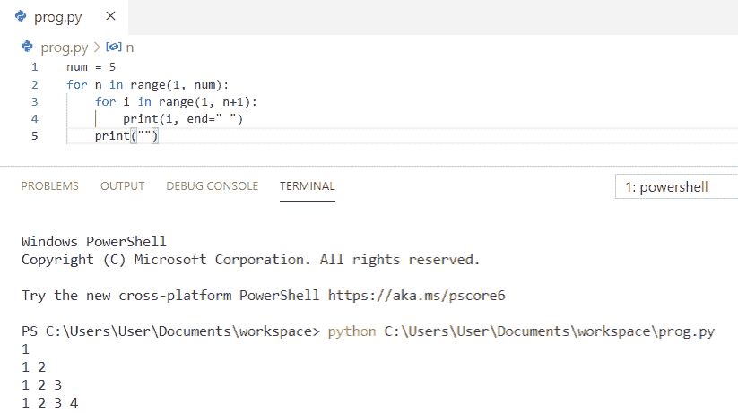

Python program to print pattern of numbers

上面的代码，我们可以用 Python 中的来**打印数字模式。**

阅读，[如何在 Python 中打印一个数的阶乘](https://pythonguides.com/factorial-of-a-number-in-python/)。

## Python 程序打印图案 1 12 123

现在，我们将看到 **python 程序打印模式 1 12 123** 。

*   首先，我们将初始化一个变量 `num=3` 。
*   **第一个外部循环**用于处理多个**行**，而**内部循环用于处理**个**列**。
*   **print(j，end=" ")** 用于**显示数字**，另一个`print(" "`用于每**行**后的**下一行**。

**举例:**

```py
num = 3
for i in range(1, num+1):
    for j in range(1, i+1):
        print(j, end=" ")
    print("")
```

你可以参考下面的截图，看看输出中 1 12 123 的模式。

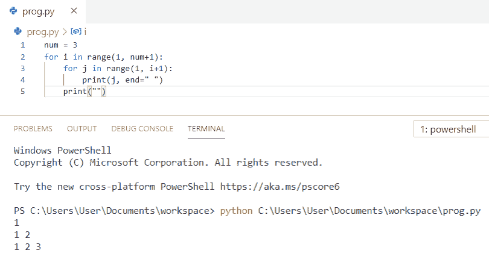

Python program to print pattern 1 12 123

这是打印模式 1 12 123 的 python 程序。

## Python 程序使用嵌套 for 循环打印图案

在这里，我们将看到 **python 程序使用嵌套的 for 循环**打印模式。

*   首先，我们将使用一个函数 **def 模式(n)** 。
*   **第一个外部循环**用于处理多个**行**，而**内部循环用于处理**个**列**。
*   **打印(" * "，end=" ")** 用于显示**图案**，另一个**打印(" "**用于每**行**后的**下一行**。
*   这里， `n=5` 被初始化，然后调用函数。

**举例:**

```py
def pattern(n):
    for i in range(0,n):
        for j in range(0,i+1):
            print("*",end="")
        print()
n = 5
pattern(n)
```

您可以参考下面的截图来查看输出中使用嵌套 for 循环的模式。

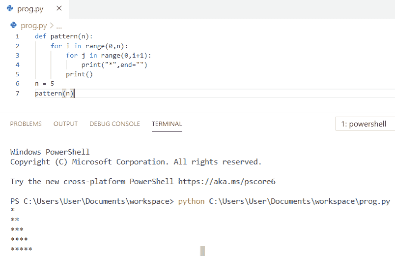

Python program to print pattern using nested for loop

这就是如何在 Python 中使用嵌套的 for 循环**打印图案。**

还有，看，[如何在 Python 中交换两个数](https://pythonguides.com/swap-two-numbers-in-python/)？

## Python 程序打印星星图案

让我们看看 **python 程序打印星星图案**。

*   首先，我们将接受来自用户的**输入。**
*   **第一个外部循环**用于处理多个**行**，而**内部循环用于处理**个**列**。
*   **打印(" * "，end=" ")** 用于显示**图案**，另一个**打印(" "**用于每**行**后的**下一行**。

**举例:**

```py
num = int(input("Enter the number of rows:"))
for i in range(0, num):
    for j in range(0, i+1):
        print("* ",end="")
    print("")
```

你可以参考下面的截图来查看输出中的星星图案。

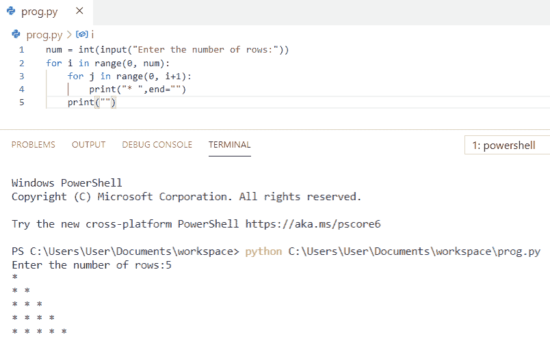

Python program to print pattern of stars

这就是如何用 Python**打印星星图案。**

你可能会喜欢，[如何打印 Python 斐波那契数列](https://pythonguides.com/python-fibonacci-series/)？

## Python 程序打印图案 1 22 333

现在，我们将看到 **python 程序打印模式 1 22 333**

*   首先，我们将接受来自用户的**输入。**
*   **第一个外部循环**用于处理多个**行**，而**内部循环用于处理**个**列**。
*   **print(i，end=" ")** 用于显示**图案**，另一个`print(" "`用于每**行**后的**下一行**。

**举例:**

```py
num = int(input("Enter the number of rows:"))
for i in range(1, num+1):
    for j in range(1, i+1):
        print(i,end="")
    print("")
```

您可以参考下面的截图，了解输出中 1 22 333 的模式。

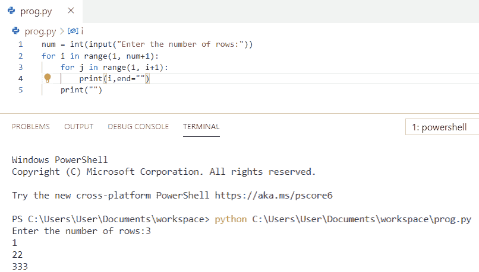

Python program to print pattern 1 22 333

上面的代码我们可以用 Python 中的**打印模式 1 22 333。**

阅读，[Python 中两个数如何相减](https://pythonguides.com/subtract-two-numbers-in-python/)？

## Python 程序以逆序打印数字模式

在这里，我们将看到 **python 程序以逆序**打印数字模式。

*   首先，我们将接受来自用户的**输入。**
*   **第一个外部循环**用于处理多个**行**，而**内部循环用于处理**个**列**。
*   **print(row，end="")** 用于显示**图案**，另一个 `print()` 用于**新行**。

**举例:**

```py
num = int(input("Enter the number of rows:"))
for row in range (num,0,-1):
    for col in range (1,row+1):
        print(row,end="")
    print()
```

您可以参考下面的屏幕截图，了解输出中的逆序数字模式。

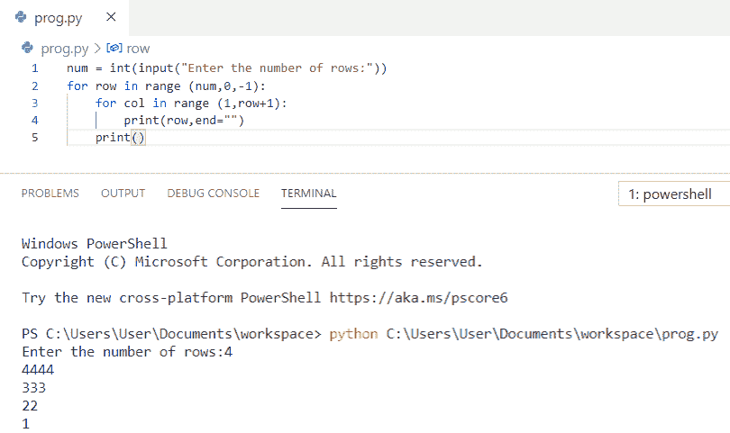

Python program to print pattern of numbers in reverse order

这是在 Python 中以逆序打印数字模式的代码。

阅读，[Python 中两个数如何除法](https://pythonguides.com/divide-two-numbers-in-python/)？

## Python 程序使用 while 循环打印图案

这里，我们将看到 **python 程序使用 while 循环**打印模式。

*   首先，我们将接受来自用户的**输入。**
*   这里，我们将使用两个 while 循环。
*   **内部 while 循环**在完成执行后打印一行，而**外部 while 循环**打印这些行。

**举例:**

```py
num = int(input('Enter number of rows : '))
i = 1
while i <= num :
    j = 1
    while j <= i:
        print(j, end = " ")
        j += 1
    print()
    i += 1
```

您可以参考下面的截图，了解在输出中使用 while 循环的模式。

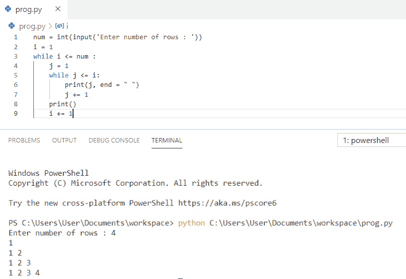

Python program to print pattern using while loop

这是使用 while 循环打印模式的 Python 程序。

## Python 程序打印图案 A

让我们看看 **python 程序打印模式 A**

*   首先，我们将为**循环**和**范围(0，7)** 。这里，我们将范围设为 7，因为我们有 7 行。
*   现在，我们将为循环取另一个**，它用于列，范围是 5，因为我们有 5 列。**
*   `if-else` 条件语句用于检查 **column == 0 或 column == 4** 是否任一条件为真以及**行！那时我们想要一个明星。**
*   我们将检查另一个条件，即**行== 0 或行== 3** ，此时**列>为 0，列<为 4** 。
*   然后**打印(" * "，end = ")**
*   如果条件不满足，那么它将转到**否则**部分，它将打印空间。
*   `print()` 用于新行。

**举例:**

```py
for row in range(0,7):    
    for column in range(0,5):     
        if ((column == 0 or column == 4) and row != 0) or ((row == 0 or row == 3) and (column > 0 and column < 4)): 
            print("*",end="")
        else:
            print(end=" ")
    print()
```

您可以参考下面的 python 程序截图，在输出中打印模式 a。

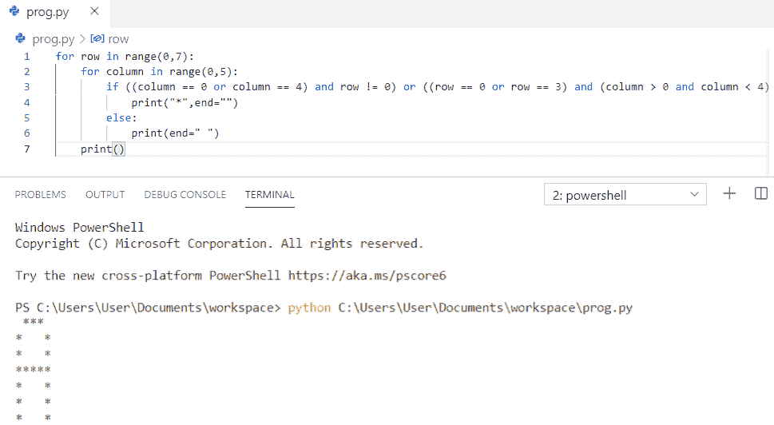

Python program to print pattern a

阅读，[如何在 Python 中添加两个变量](https://pythonguides.com/add-two-variables-in-python/)？

## Python 程序打印模式 G

现在，我们将看到 **python 程序打印模式 G**

*   首先，我们将为**循环**和**范围(0，7)** 。这里，我们将范围设为 7，因为我们有 7 行。
*   现在，我们将为循环取另一个**，它用于列，范围是 6，因为我们有 6 列。**
*   `if-else` 条件语句用于检查 **column == 0 或(column == 4 且(row！= 1 且行！= 2))** 如果是**真**则打印。
*   我们将检查另一个条件，即 **((row==0 或 row==6)和(列> 0 和列< 4))**
*   这里，我们将检查 **(row==3 和(column==3 或 column==5))** 如果为真，则打印星号。
*   然后**打印(" * "，end = ")**
*   如果条件不满足，那么它将转到**否则**部分，它将打印空间。
*   `print()` 用于新行。

**举例:**

```py
for row in range(0,7):    
    for column in range(0,6):     
        if column == 0 or (column == 4 and (row != 1 and row!= 2)) or ((row==0 or row==6) and (column>0 and column<4)) or (row==3 and (column==3 or column==5)):
            print("*",end="")
        else:
            print(end=" ")
    print()
```

你可以参考下面的 python 程序截图，在输出中打印模式 g。

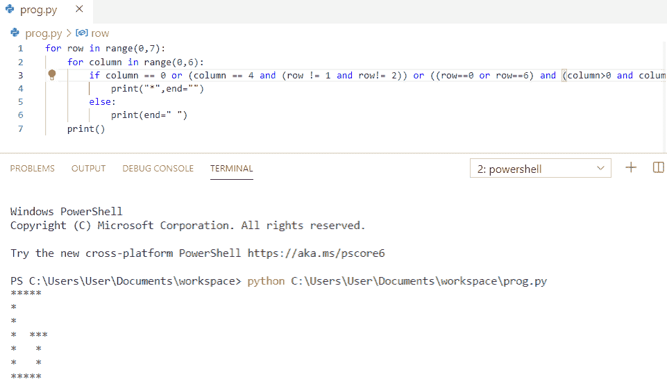

Python program to print pattern g

这是打印模式 g 的 Python 程序。

来看看，[Python 中两个数如何相加](https://pythonguides.com/add-two-numbers-in-python/)？

## Python 程序打印模式 a ab abc abcd abcde

在这里，我们将看到 **python 程序打印模式 a ab abc abcd abcde** 。

*   首先，我们将接受来自用户的**输入**
*   循环的**被使用，我们已经初始化了 `v=97` ，它是一个 ASCII 字符，给**一个**作为输出。**
*   另一个**用于循环**用于打印图案。
*   要打印图案，我们必须使用 **print(chr(v)，end = " "**。这里 `chr` 用来打印**小 a** 因为我们要字母表。
*   和 `v += 1` ，这将增加 v。

**举例:**

```py
n = int(input("Enter number of rows: "))
for i in range(1,n+1):
    v = 97
    for j in range(1, i+1):
        print(chr(v), end="")
        v += 1
    print()
```

你可以参考下面 python 程序的截图，在输出中打印模式 a ab abc abcd abcde。

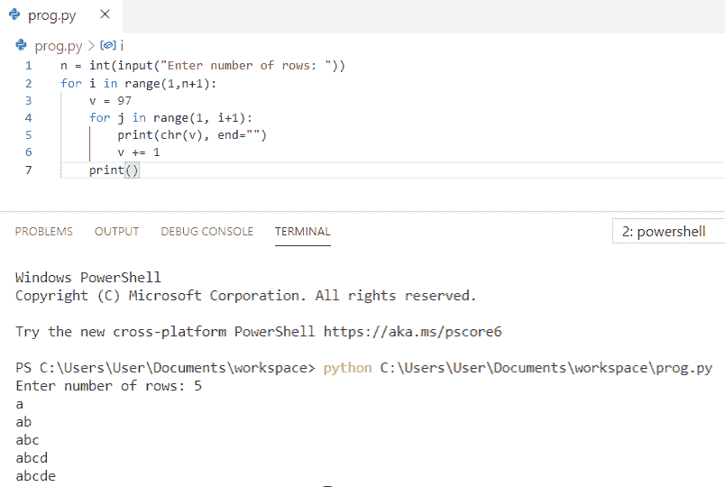

Python program to print pattern a ab abc abcd abcde

上面的代码，我们可以用 Python 来打印模式 a ab abc abcd abcde。

## Python 程序打印图案公元前一年 CDE DEFG

让我们来看一下 **python 程序打印出的图案 A 公元前 CDE DEFG** 。

*   首先，我们将接受来自用户的**输入**
*   现在，我们将**作为循环**的一行。
*   我们将使用变量 `"k"` 和 `ord("A")` 函数，该函数将给出 `A` 的 ASCII 值，并将其存储在变量 k 中
*   另一个**用于循环**用于列，我们将**打印(chr(k)，end = " "**)。 `chr()` 函数用于将 ASCII 值转换为字符。
*   和 `K += 1` ，这将增加 K。

**举例:**

```py
n = int(input("Enter number of rows: "))
for i in range(n):
    k = ord("A")+i
    for j in range(i+1):
        print(chr(k), end="")
        k += 1
    print()
```

你可以参考下面的 python 程序在输出中打印模式 A BC CDE DEFG 的截图。

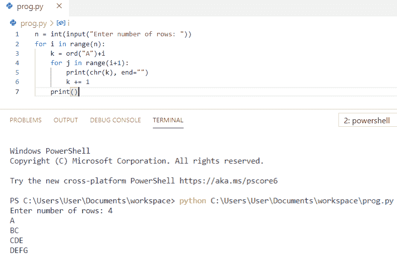

Python program to print pattern A BC CDE DEFG

上面的代码我们可以用 Python 来**打印一个公元前 CDE DEFG 的图案。**

您可能会喜欢以下 Python 教程:

*   [如何使用 Python Tkinter 创建倒计时定时器](https://pythonguides.com/create-countdown-timer-using-python-tkinter/)
*   [Python 程序反转字符串的例子](https://pythonguides.com/python-program-to-reverse-a-string/)
*   [Python 程序求 n 个数之和并举例](https://pythonguides.com/python-program-to-find-sum-of-n-numbers/)

在本 Python 教程中，我们学习了打印图案的 **Python 程序**。此外，我们还讨论了以下主题:

*   Python 程序打印数字模式
*   打印图案的 Python 程序 1 12 123
*   使用嵌套 for 循环打印模式的 Python 程序
*   Python 程序打印星形图案
*   打印图案的 Python 程序 1 22 333
*   Python 程序以逆序打印图案
*   Python 程序使用 while 循环打印模式
*   打印模式 A 的 Python 程序
*   Python 程序打印模式 G
*   Python 程序打印模式 a ab abc abcd abcde
*   Python 程序打印公元前 CDE DEFG 模式

[Bijay Kumar](https://pythonguides.com/author/fewlines4biju/)

Python 是美国最流行的语言之一。我从事 Python 工作已经有很长时间了，我在与 Tkinter、Pandas、NumPy、Turtle、Django、Matplotlib、Tensorflow、Scipy、Scikit-Learn 等各种库合作方面拥有专业知识。我有与美国、加拿大、英国、澳大利亚、新西兰等国家的各种客户合作的经验。查看我的个人资料。

[enjoysharepoint.com/](https://enjoysharepoint.com/)[](https://www.facebook.com/fewlines4biju "Facebook")[](https://www.linkedin.com/in/fewlines4biju/ "Linkedin")[](https://twitter.com/fewlines4biju "Twitter")