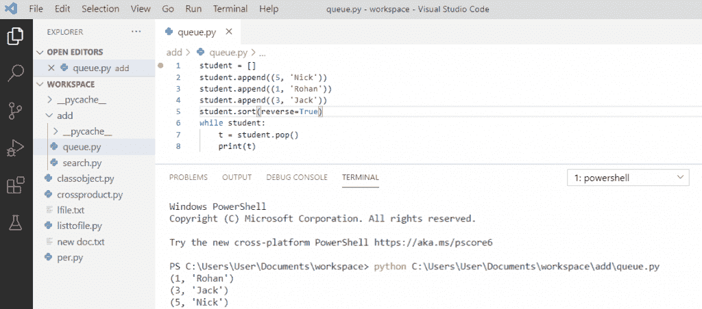
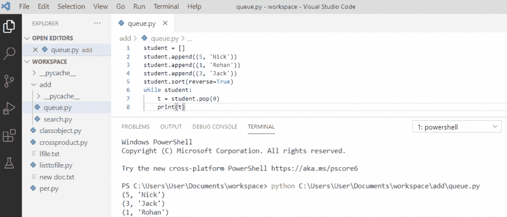
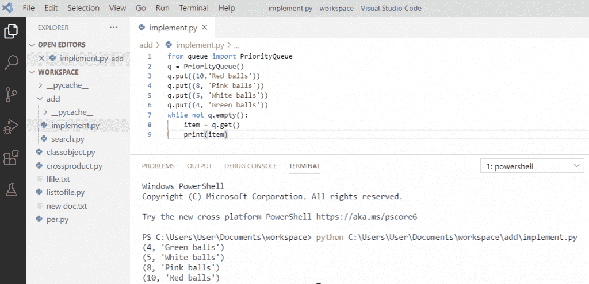
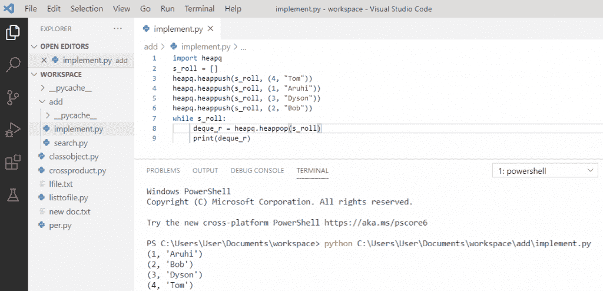
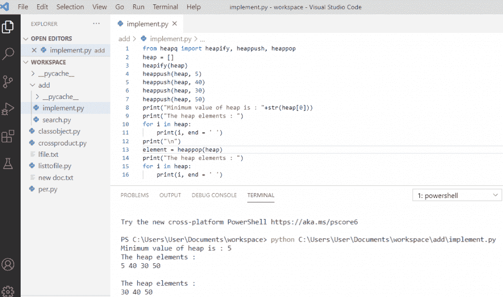

# Python 中的优先级队列

> 原文：<https://pythonguides.com/priority-queue-in-python/>

[](https://sharepointsky.teachable.com/p/python-and-machine-learning-training-course)

在本 [Python 教程](https://pythonguides.com/python-gui-programming/)中，我们将讨论 python 中的**优先级队列。此外，我们将看到以下主题:**

*   python 中的优先级队列是什么？
*   Python 优先级队列实现
*   python 中的最大优先级队列
*   使用 python 库的优先级队列
*   python 中使用 heapq 实现优先级队列
*   Python heapq 示例
*   Python 优先级队列与 heapq

目录

[](#)

*   [python 中的优先级队列是什么？](#What_is_the_priority_queue_in_python "What is the priority queue in python?")
*   [Python 优先级队列实现](#Python_Priority_queue_implementation "Python Priority queue implementation ")
*   [Python 中的最大优先级队列](#Max_priority_queue_in_Python "Max priority queue in Python")
*   [使用 Python 库的优先级队列](#Priority_queue_using_a_Python_library "Priority queue using a Python library")
*   [使用 python 中的 heapq 实现优先级队列](#Priority_queue_implementation_using_heapq_in_python "Priority queue implementation using heapq in python")
*   [Python heapq 示例](#Python_heapq_example "Python heapq example")
*   [Python 优先级队列 vs heapq](#Python_Priority_Queue_vs_heapq "Python Priority Queue vs heapq")

## python 中的优先级队列是什么？

python 中的优先级队列是什么？python 中的优先级队列是一种高级类型的队列数据结构。优先级队列根据元素的优先级对元素进行排序和出列，而不是将最旧的元素出列。优先级队列通常用于处理调度问题。它优先考虑更紧急的任务。

## Python 优先级队列实现

为了在 Python 中**实现优先级队列，我们必须声明一个[空 Python 列表](https://pythonguides.com/create-list-in-python/)，使用列表类的 `append()` [方法将元素插入其中。然后列表按升序排序。](https://pythonguides.com/python-list-methods/) [While 循环](https://pythonguides.com/python-while-loop/)用于使用 `pop()` 方法检索元素。**

**举例:**

```py
student = []
student.append((5, 'Nick'))
student.append((1, 'Rohan'))
student.append((3, 'Jack'))
student.sort(reverse=True)
while student:
    t = student.pop()
    print(t)
```

写完上面的代码(python 优先级队列实现)，你将打印出**“t”**然后输出将显示为**(1，“Rohan”)(3，“Jack”)(5，“Nick)”**。这里，元素根据它们的优先级队列对元素进行排序和出列。

关于 **python 优先级队列**的实现可以参考下面的截图。



Python Priority queue implementation

> 你可能会喜欢[用 Python 海龟](https://pythonguides.com/draw-colored-filled-shapes-using-python-turtle/)和[绘制彩色填充形状，以及如何用海龟](https://pythonguides.com/snake-game-in-python/)用 Python 创建一个贪吃蛇游戏。

## Python 中的最大优先级队列

现在，让我们了解一下 Python 中的 **max priority queue。**

在 **Python 最大优先级队列**中，列表将按照优先级降序排列。While 循环用于使用 `pop(0)` 方法检索元素。

**举例:**

```py
student = []
student.append((5, 'Nick'))
student.append((1, 'Rohan'))
student.append((3, 'Jack'))
student.sort(reverse=True)
while student:
    t = student.pop(0)
    print(t)
```

写完上面的代码(python 中的 max priority queue)，你将打印出**【t】**，然后输出将显示为**(5，'尼克) **(3，'杰克')` **`(1，'罗汉')`**`。这里，列表按降序排序，并根据元素的优先级队列对其进行出列。

python 中的**最大优先级队列可以参考下面的截图。**



Max priority queue in python

## 使用 Python 库的优先级队列

让我们看看如何使用 Python 库实现**优先级队列。**

Python 提供了优先级队列的内置实现。使用 **put()方法**导入队列模块并插入元素。while 循环用于使用 `get()` 方法使元素出队。**队列的时间复杂度。PriorityQueue** 类为 O(log n)。

**举例:**

```py
from queue import priorityQueue
q = PriorityQueue()
q.put((10,'Red balls'))
q.put((8,'Pink balls'))
q.put((5,'White balls'))
q.put((4,'Green balls'))
while not q.empty():
    item = q.get()
    print(item)
```

写完上面的代码(使用 python 库的优先级队列)，你将打印出 `" item "` ，然后输出将显示为**(4，"绿球") **(5，"白球")` **`(8，"粉红球")**** (10，"红球")**。这里，列表按升序排序，并根据元素的优先级队列对其进行出列。

使用 python 库可以参考下面的**优先级队列截图。**



Priority queue using a python library

## 使用 python 中的 heapq 实现优先级队列

我们还可以使用 python 中的 **heapq 模块来实现一个**优先级队列**。我们将**从库中导入 heapq** ，然后创建一个空列表。但是 [heapq](https://docs.python.org/3/library/heapq.html) 只提供最小堆实现。**

**举例:**

```py
import heapq
s_roll = []
heapq.heappush(s_roll,(4, "Tom"))
heapq.heappush(s_roll,(1, "Aruhi"))
heapq.heappush(s_roll,(3, "Dyson"))
heapq.heappush(s_roll,(2, "Bob"))
While s_roll:
    deque_r = heapq.heappop(s_roll)
    print(deque_r)
```

写完上面的代码(在 python 中使用 heapq 实现优先级队列)，你将打印出 `" deque_r "` 然后输出将显示为**(1，'阿鲁希') **(2，'鲍勃')` **`(3，'戴森')**** (4，'汤姆')**。这里，通过使用 heapq 模块的 `heappush()` 方法，我们将元素插入到列表中。然后使用 While 循环弹出元素。

可以参考下面截图`python`中使用 heapq 实现优先级队列。



Priority queue implementation using heapq in python

## Python heapq 示例

我们将使用 **heapq 类**在 python 中实现**堆。在 heapq 中，默认情况下，**最小堆**就是由这个类实现的。**

**举例:**

```py
from heapq import heapify, heappush, heappop
heap = []
heapify(heap)
heappush(heap, 5)
heappush(heap, 40)
heappush(heap, 30)
heappush(heap, 50)
print("Minimum value of heap is : "+str(heap[0]))
print("The heap element : ")
for i in heap:
    print(i, end = ' ')
print("\n")
element = heappop(heap)
print("The heap element : ")
for i in heap:
    print(i, end= ' ')
```

在编写完上述代码(python heapq 示例)后，您将打印这些代码，然后输出将显示为**“堆的最小值是:5”**。这里，通过使用 heapq 模块的 `heappush()` 方法，我们将元素插入到堆中，它将打印最小元素的值。

可以参考下面截图 **python heapq 例子**



Python heapq example

## Python 优先级队列 vs heapq

| **优先级队列** | `heapq` |
| 排队。PriorityQueue 是线程安全的类 | heapq 模块没有线程安全 |
| 排队中。PriorityQueue，可以使用通常的队列方法 put()来添加项目。 | 在 heapq 中，可以使用 heappush()方法来添加新项。 |
| 排队中。PriorityQueue，可以使用通常的队列方法 get()来移除。 | 在 heapq 中，可以使用 heappop()方法来移除。 |

您可能会喜欢以下 Python 教程:

*   [Python 历元到日期时间+示例](https://pythonguides.com/python-epoch-to-datetime/)
*   [Python 将变量写入文件+示例](https://pythonguides.com/python-write-variable-to-file/)
*   [Python 3 pickle typeerror 需要一个类似字节的对象，而不是“str”](https://pythonguides.com/python-3-pickle-typeerror-a-bytes-like-object-is-required-not-str/)
*   [Python 二分搜索法和线性搜索](https://pythonguides.com/python-binary-search/)
*   [Python 点积和叉积](https://pythonguides.com/python-dot-product/)
*   [Python 退出命令(quit()、exit()、sys.exit())](https://pythonguides.com/python-exit-command/)
*   [Python 输入和 raw_input 函数](https://pythonguides.com/python-input-and-raw_input-function/)
*   [Python 中的排序算法(详细教程)](https://pythonguides.com/sorting-algorithms-in-python/)
*   [如何在 Python 中把字符串转换成日期时间](https://pythonguides.com/convert-a-string-to-datetime-in-python/)

在本 Python 教程中，我们学习了 python 中的 ****优先级队列。此外，我们还讨论了以下主题:****

*   python 中的优先级队列是什么？
*   Python 优先级队列实现
*   python 中的最大优先级队列
*   使用 python 库的优先级队列
*   python 中使用 heapq 实现优先级队列
*   Python heapq 示例
*   Python 优先级队列与 heapq

[Bijay Kumar](https://pythonguides.com/author/fewlines4biju/)

Python 是美国最流行的语言之一。我从事 Python 工作已经有很长时间了，我在与 Tkinter、Pandas、NumPy、Turtle、Django、Matplotlib、Tensorflow、Scipy、Scikit-Learn 等各种库合作方面拥有专业知识。我有与美国、加拿大、英国、澳大利亚、新西兰等国家的各种客户合作的经验。查看我的个人资料。

[enjoysharepoint.com/](https://enjoysharepoint.com/)[](https://www.facebook.com/fewlines4biju "Facebook")[](https://www.linkedin.com/in/fewlines4biju/ "Linkedin")[](https://twitter.com/fewlines4biju "Twitter")